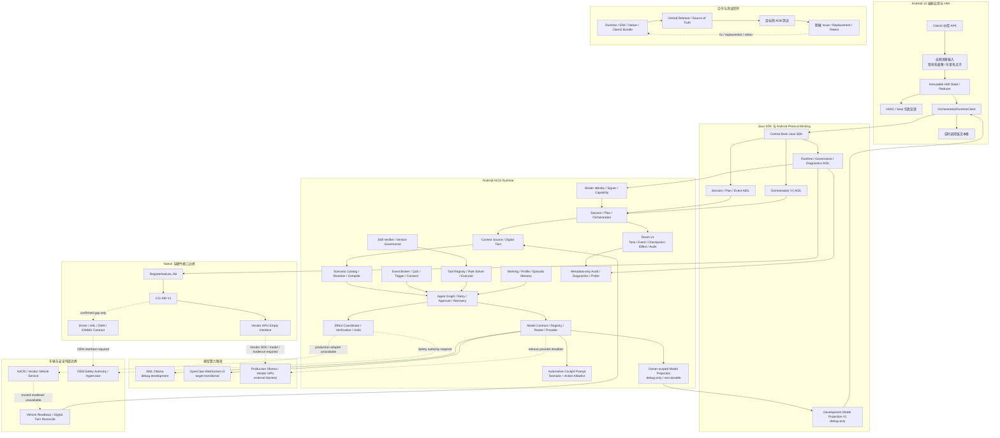

# CougarOS Central Brain

## 软件架构框图

## 开发进度总表：最细颗粒度需求跟进列表

状态只表示该最小工作包的软件和已注明证据范围；`DONE` 不等于量产，`EXTERNAL_BLOCKED` 不允许用仿真替代，
`SUSPENDED` 不包含可执行安全测试。`github_source_of_truth=true`、`maintained_project_files_synced=true`、
`production_ready=false`、`target_hardware_validated=false`。

### 已开发并验证

#### P0 设计基线

| 跟进 ID | 最小交付单元 | Req IDs | 已交付与证据 | 状态 |
| --- | --- | --- | --- | --- |
| `P0-W01` | 开源与行业证据基线 | 全部 | AIOS/座舱行业证据、采用与延后边界 | `DONE` |
| `P0-W02` | 产品与 UX 基线 | `S2-UX-001..003`, `S2-HMI-006`, `S2-SCN-001`, `S2-SAF-001`, `S2-EFF-001` | 意图优先、行驶限制、失败/补偿/撤销 UX | `DONE` |
| `P0-W03` | 工程详设和 backlog | 全部 | 模块、接口、依赖、测试、DoD 与 Req ID 追踪 | `DONE` |

#### P1 Runtime Contract v2

| 跟进 ID | 最小交付单元 | Req IDs | 已交付与证据 | 状态 |
| --- | --- | --- | --- | --- |
| `P1-W01` | Session DTO/AIDL | `S2-SES-001`, `S2-UX-001` | 五个有界 DTO；`session_contract_v1_defined=true`、`session_parcel_physical_android13_arm64_verified=true` | `DONE` |
| `P1-W02` | Plan/Node DTO/AIDL | `S2-SCN-001`, `S2-GRF-001` | immutable DAG/11 node allowlist；`plan_contract_v1_defined=true`、`plan_parcel_physical_android13_arm64_verified=true`、`plan_runtime_published=false` | `DONE` |
| `P1-W03` | Typed Event DTO/AIDL | `S2-SES-001`, `S2-EVT-001` | cursor/replay/callback；`event_contract_v1_defined=true`、`event_parcel_physical_android13_arm64_verified=true`、`event_runtime_service_published=true`、`event_callback_service_published=true` | `DONE` |
| `P1-W04` | Effect/Approval DTO | `S2-EFF-001`, `S2-SAF-001`, `S2-UX-003` | typed target/state/approval/undo；`effect_contract_v1_defined=true`、`effect_parcel_physical_android13_arm64_verified=true`、`effect_runtime_service_published=false`、`approval_response_service_published=false`、`undo_service_published=false` | `DONE` |
| `P1-W05` | SDK facade v2 | `S2-SES-001`, `S2-UX-001..003`, `S2-EVT-001`, `APP-004`, `XSC-001/006` | `ScenarioClient`/`SessionClient`、replay/resubscribe、Binder death/reconnect；`sdk_facade_v2_available=true` | `DONE / ANDROID13_ARM64_VERIFIED` |
| `P1-W06` | Room v4 schema | `S2-SES-001`, `S2-GRF-001`, `S2-EFF-001`, `S2-EVT-001` | durable Session/Event、v3->v4 migration、process-death rehydration；`room_schema_version=4` | `DONE / ANDROID13_ARM64_VERIFIED` |
| `P1-W07` | Contract v2 aggregate | P1 全部 | AIDL hash、capability、bounds、Room、SDK 与 forbidden fallback 聚合门禁 | `DONE` |
| `P6-EV2` | Durable Session Event V2 | `S2-EVT-001`, `S2-SES-001` | terminal cursor、owner/session Room ACK、SDK V2 negotiation/V1 fallback | `SOFTWARE_COMPLETE / ARM64_RETEST_OPEN` |

#### P2 Context、Digital Twin、Scenario 与仿真 Effect

| 跟进 ID | 最小交付单元 | Req IDs | 已交付与证据 | 状态 |
| --- | --- | --- | --- | --- |
| `P2-W01` | Canonical Vehicle Signal Types | `S2-CTX-001`, `S2-TWN-001` | 12 路径、timestamp/quality/source/schema；`vehicle_signal_schema_defined=true` | `DONE` |
| `P2-W02` | Vehicle Capability Catalog | `S2-TWN-001`, `S2-ADP-001` | 8 capability、area/risk/adapter/authorization；production authorized=0 | `DONE` |
| `P2-W03` | Vehicle Digital Twin Store | `S2-TWN-001` | desired/reported/quality/revision；process-local、非 production trust | `DONE` |
| `P2-W04` | Trusted Context Snapshot | `S2-CTX-001`, `S2-SAF-001` | freshness/trust/restricted report；production source 未接 | `DONE` |
| `P2-W05` | Scenario Manifest | `S2-SCN-001`, `S2-SAF-001` | schema/catalog/checksum；production-signed artifact 未接 | `DONE` |
| `P2-W06` | Deterministic Scenario Resolver | `S2-SCN-001`, `S2-SAF-001` | fixed selection、availability fail-closed；model 未参与 | `DONE` |
| `P2-W07` | Scenario Plan Compiler | `S2-SCN-001`, `S2-GRF-001`, `S2-SAF-001` | immutable DAG、moving seat branch removal；Runtime publication 未接 | `DONE` |
| `P2-W08` | Simulated Effect Adapter Base | `S2-ADP-001`, `S2-EFF-001` | typed target、idempotency、desired/reported；debug-only | `DONE / ANDROID13_ARM64_VERIFIED` |
| `P2-W09` | Simulated HVAC Adapter | `S2-ADP-001`, `S2-EFF-001` | power/temp/fan typed simulation/readback | `DONE / ANDROID13_ARM64_VERIFIED` |
| `P2-W10` | Simulated Seat Adapter | `S2-ADP-001`, `S2-SAF-001` | recline/heat typed simulation、dispatch revalidation | `DONE / ANDROID13_ARM64_VERIFIED` |
| `P2-W11` | Simulated Media/Navigation Adapters | `S2-ADP-001` | media state、synthetic navigation observation、digest-only query | `DONE / ANDROID13_ARM64_VERIFIED` |
| `P2-W12` | Debug Simulation Controller | `S2-CTX-001`, `S2-ADP-001` | signature/capability protected、revision ACK、release absent | `DONE / ANDROID13_ARM64_VERIFIED` |

#### P3 Durable Agent Graph 与 Effect 闭环

| 跟进 ID | 最小交付单元 | Req IDs | 已交付与证据 | 状态 |
| --- | --- | --- | --- | --- |
| `P3-W01` | Agent Graph Runtime state machine | `S2-GRF-001`, `NV-G-004/006/007` | 10-state bounded control runtime、dependency-ready、failure closed | `DONE / DEBUG_RUNTIME` |
| `P3-W02` | Typed node executors | `S2-GRF-001`, `S2-SAF-001`, `S2-EFF-001` | 11 node schemas、7 deterministic executors；dispatch disabled | `DONE / CONTRACT` |
| `P3-W03` | CheckpointSerializer | `S2-GRF-001`, `NV-G-003/006/007` | registered DTO、canonical JSON、size/depth/digest guards | `DONE / CONTRACT` |
| `P3-W04` | Retry/Timeout policy | `S2-GRF-001`, `NV-G-004` | bounded deadline/attempt/backoff；Effect retry requires reconciliation | `DONE / CONTRACT` |
| `P3-W05` | P3 Durable approval interrupt | `S2-SAF-001`, `S2-UX-003`, `S2-GRF-001` | owner/plan/context/policy/Safety/expiry binding；authority 未发布 | `DONE / CONTRACT` |
| `P3-W06` | P3 EffectCoordinator | `S2-EFF-001`, `S2-SAF-001` | prepare-all、dependency waves、exact adapter registry；production dispatch=false | `DONE / CONTRACT` |
| `P3-W07` | P3 Effect verification/reconciliation | `S2-EFF-001`, `S2-TWN-001` | delivered/applied/verified 分离、Twin reconcile、no redispatch | `DONE / CONTRACT` |
| `P3-W08` | P3 Compensation/Undo | `S2-EFF-001`, `S2-UX-003`, `S2-SAF-001` | before snapshot、TTL、reverse dependency、new governed task | `DONE / CONTRACT` |
| `P3-W09` | P3 Restart recovery | `S2-SES-001`, `S2-GRF-001`, `S2-EFF-001`, `S2-SAF-001` | Room recovery reducer、reconcile directives、exactly-once audit | `DONE / ANDROID13_ARM64_DEBUG_VERIFIED` |
| `P4-R1` | Durable Runtime Orchestration V1 | `S2-SES-001`, `S2-SCN-001`, `S2-GRF-001`, `S2-EFF-001` | owner/session Binder、Plan/Graph/Effect/readback Room projection | `DONE / DEBUG_RUNTIME` |

#### P4 Client2 中控闭环

| 跟进 ID | 最小交付单元 | Req IDs | 已交付与证据 | 状态 |
| --- | --- | --- | --- | --- |
| `P4-W01` | Bridge Session/Event API migration | `S2-UX-001`, `S2-HMI-005`, `XSC-001` | Client2 typed Session/Event callbacks | `DONE` |
| `P4-W02` | Cockpit HMI state/reducer/reconnect | `S2-UX-001..003`, `S2-HMI-003/005/006` | immutable state、single reducer、Binder reconnect | `DONE` |
| `P4-W03` | Intent-first overlay shell | `S2-HMI-001..003/006` | Intent/Plan/Execution/Result 工程状态壳 | `DONE` |
| `P4-W04` | P4 Client2 HVAC control surface | `S2-HMI-001/003/004/005`, `S2-ADP-001` | immutable desired、300 ms debounce、scenario ownership | `DONE` |
| `P4-W05` | P4 Client2 Seat control surface | `S2-HMI-002..005`, `S2-SAF-001`, `S2-ADP-001` | seat typed state、Safety/approval gate | `DONE` |
| `P4-W06` | P4 Client2 observable execution timeline | `S2-UX-001`, `S2-HMI-003/006`, `S2-EVT-001` | 七阶段、最多八条 typed event、partial visibility | `DONE` |
| `P4-W07` | P4 Client2 approval/recovery UX | `S2-UX-003`, `S2-HMI-003`, `S2-SAF-001` | approval/partial/retry/undo projection | `DONE` |
| `P4-W08` | P4 Client2 driving restriction renderer | `S2-UX-002`, `S2-HMI-002` | PARKED/MOVING/UNKNOWN_RESTRICTED rendering | `DONE` |
| `P4-W09` | P4 Client2 engineer simulation drawer | `S2-HMI-004`, `S2-ADP-001`, `S2-OBS-001` | debug-only controller、fault/context controls | `DONE` |
| `P4-W10` | Scenario/manual-control synchronization | `S2-HMI-001..006`, `S2-SCN-001` | canonical roles、lifecycle、sequence ownership | `DONE` |
| `P4-W11` | Accessibility/display matrix | `S2-UX-003`, `S2-HMI-001/002` | 48dp、非颜色单一表达、1920x1080 safe frame | `DONE` |
| `P4-W12` | P4 Android aggregate acceptance | P4 全部 | navigation/scenario/fault/restart/display application acceptance | `DONE / ANDROID13_ARM64_APP_VERIFIED` |
| `P4-D4a` | Simulated Scenario/Plan/Graph composition | `S2-SCN-001`, `S2-GRF-001`, `S2-EFF-001` | fixed Cold/Fatigue graph、pending nodes | `DONE / DEBUG_ONLY` |
| `P4-D4b` | Debug Runtime Session/Event projection | `S2-SCN-001`, `S2-GRF-001`, `S2-EVT-001` | bounded Session/Event projection、digest-only payload | `DONE / DEBUG_ONLY` |
| `P4-D4c` | Signature-protected debug Binder | `APP-004`, `XSC-001/004/005/006` | fixed 2x2 input、same-signer/capability、release absent | `DONE / DEBUG_ONLY` |
| `P4-D4d` | Debug simulated Effect/readback | `S2-EFF-001`, `S2-SAF-001`, `S2-HMI-003/006` | 4 adapters、7 targets、MATCHED readback、approval projection | `DONE / ANDROID13_ARM64_DEBUG_VERIFIED` |
| `P4-D4e` | Client2 simulated scenario chain | `APP-004`, `S2-SCN-001`, `S2-GRF-001`, `S2-EFF-001` | formal chain、seven-stage UI、Cold/Fatigue approve/reject | `DONE / ANDROID13_ARM64_DEBUG_VERIFIED` |
| `P4-R2` | Client2 Orchestration V1 migration | `APP-004`, `S2-SES-001`, `S2-SCN-001`, `S2-EVT-001` | legacy scenario Binder removed；formal SDK/Room/Effect projection | `DONE / DEBUG_E2E` |
| `P4-R3` | Voice-first live cockpit HMI | `S2-HMI-001..006`, `S2-MDL-001`, `S2-EFF-001` | 两个自然触发、32 行调用链、HVAC/Seat 动画；`voice_first_hmi_implemented=true` | `DONE / UI_SIMULATION_ONLY` |

#### P5 Tool、Skill 与 Memory

| 跟进 ID | 最小交付单元 | Req IDs | 已交付与证据 | 状态 |
| --- | --- | --- | --- | --- |
| `P5-W01` | P5 Tool Manifest/Schema | `S2-TOL-001` | versioned manifest、bounded input/output schema | `DEVELOPED` |
| `P5-W02` | P5 Tool Registry/Resolver | `S2-TOL-001` | version map、health freshness、registered/resolved/usable separation | `DEVELOPED` |
| `P5-W03` | P5 Tool RuleSolver | `S2-TOL-001`, `S2-SAF-001` | rule x model x usable intersection、fail-closed | `DEVELOPED` |
| `P5-W04` | P5 Tool Executor boundary | `S2-TOL-001`, `S2-SAF-001`, `S2-OBS-001` | signed built-in executor、deadline/output bound、digest-only invocation | `DEVELOPED` |
| `P5-W05` | P5 Skill package verifier | `S2-TOL-001`, `S2-SAF-001`, `S2-OBS-001` | signer/version/digest/anti-downgrade；no dynamic load | `DEVELOPED` |
| `P5-W06` | P5 WorkingMemoryStore | `S2-MEM-001`, `S2-SAF-001`, `S2-OBS-001` | owner/session bounded process-local store | `DEVELOPED / PROCESS_LOCAL` |
| `P5-W07` | P5 ProfileMemoryStore | `S2-MEM-001`, `S2-SAF-001`, `S2-OBS-001` | consent/field/user-seat binding；contract cipher only | `DEVELOPED / CONTRACT_TEST` |
| `P5-W08` | P5 EpisodicMemoryStore | `S2-MEM-001`, `S2-SAF-001`, `S2-OBS-001` | typed bounded scenario summaries；process-local | `DEVELOPED / PROCESS_LOCAL` |
| `P5-W09` | P5 ContextBudgetManager | `S2-MEM-001`, `S2-MDL-001`, `S2-SAF-001` | metadata-only budget decision；tokenizer/summary execution 未接 | `DEVELOPED / DECISION_ONLY` |
| `P5-W10` | P5 Memory consent HMI/API | `S2-MEM-001`, `S2-UX-003` | source visibility、disable、clear preference、moving restriction | `DEVELOPED / PROJECTION_ONLY` |
| `P5-R1` | Debug Runtime composition | P5 + `S2-GRF-001` | Tool/Skill/ContextBudget/WorkingMemory combined evidence | `DONE / DEBUG_ONLY` |

#### P6 Event 与主动智能

| 跟进 ID | 最小交付单元 | Req IDs | 已交付与证据 | 状态 |
| --- | --- | --- | --- | --- |
| `P6-W01` | P6 EventBroker interface/in-process | `S2-EVT-001`, `S2-SAF-001` | typed topic、append-before-notify、bounded replay、identity policy | `DEVELOPED / PROCESS_LOCAL` |
| `P6-W02` | P6 Event Backpressure/QoS | `S2-EVT-001`, `NV-G-004`, `S2-SAF-001` | 4 policies、critical no-silent-drop、consumer isolation | `DEVELOPED / PROCESS_LOCAL` |
| `P6-W03` | P6 TriggerRule/TriggerEngine | `S2-EVT-001`, `S2-SCN-001`, `S2-SAF-001` | threshold/window/debounce/cooldown、suggestion-only | `DEVELOPED / PROCESS_LOCAL` |
| `P6-W04` | P6 Proactive consent/policy | `S2-SAF-001`, `S2-MEM-001`, `S2-EVT-001` | exact grant binding、HIGH/CRITICAL hard block、TTL/revoke | `DEVELOPED / POLICY_ONLY` |
| `P6-W05` | P6 Context source adapters | `S2-CTX-001`, `S2-EVT-001`, `S2-SAF-001` | Runtime health/time/simulated vehicle normalization | `DEVELOPED / NORMALIZATION_ONLY` |
| `P6-W06` | P6 Active suggestion UX | `S2-UX-002`, `S2-TRG-002`, `S2-SAF-001` | full/minimal card、merge/replay、never-ask | `DEVELOPED / PROJECTION_ONLY` |
| `P6-P7-R1` | Debug decision composition | P6 + P7 + `S2-GRF-001` | Context/Trigger/Consent/Model/Event chain、no action authority | `DONE / DEBUG_ONLY` |

#### P7 Model Runtime 与模型网关

| 跟进 ID | 最小交付单元 | Req IDs | 已交付与证据 | 状态 |
| --- | --- | --- | --- | --- |
| `P7-W01` | P7 ModelRequest/Result v2 | `S2-MDL-001`, `S2-SAF-001`, `S2-OBS-001` | privacy/latency/token/capability/fallback/digest contract | `DEVELOPED` |
| `P7-W02` | P7 ModelProviderRegistry/health | `S2-MDL-001`, `S2-SAF-001`, `S2-OBS-001` | 5-provider catalog、health source/freshness/replay | `DEVELOPED` |
| `P7-W03` | P7 PolicyAwareModelRouter | `S2-MDL-001`, `S2-SAF-001`, `S2-OBS-001` | privacy/network/thermal/latency/quota/fallback decision | `DEVELOPED / NO_ACTION_AUTHORITY` |
| `P7-W04` | P7 LocalModelProvider | `S2-MDL-001`, `S2-SAF-001`, `S2-OBS-001` | deadline/cancel/stream limits；debug source only | `DEVELOPED` |
| `P7-W05` | P7 Structured Model Output | `S2-MDL-001`, `S2-SAF-001`, `S2-OBS-001` | exact JSON、scenario binding、action allowlist、raw log=false | `DEVELOPED` |
| `P7-W06` | P7 Scenario Evaluation | `S2-MDL-001`, `S2-SAF-001`, `S2-OBS-001` | deterministic evaluation harness、bounded metrics | `DEVELOPED` |
| `P7-W07` | P7 Resource Admission | `S2-MDL-001`, `NV-G-004` | foreground priority、thermal degradation、fail-closed | `DEVELOPED` |
| `P7-R2` | WSL Ollama development gateway | `S2-MDL-001`, `S2-SAF-001`, `S2-OBS-001`, `XSC-001/005/006` | real debug model via ADB reverse、strict output、Client2 projection | `DONE / ANDROID13_ARM64_DEBUG_VERIFIED` |
| `P7-R3-OC2` | OpenClaw target transitional gateway | `S2-MDL-001/002`, `S2-SAF-001`, `S2-OBS-001/002` | fixed WebSocket v3、challenge/auth/send/history/abort、Client2 projection；`openclaw_target_integration_implemented=true` | `TRANSITIONAL / CURRENT_CONNECTIVITY_BLOCKED` |

#### P9 软件接口与调试证据

| 跟进 ID | 最小交付单元 | Req IDs | 已交付与证据 | 状态 |
| --- | --- | --- | --- | --- |
| `P9-W01` | P9 Performance Budget Contract | `S2-OBS-001` | 7 categories/10 metrics、strict report、synthetic probe | `SOFTWARE_COMPLETE / TARGET_MEASUREMENT_OPEN` |
| `P9-W02` | P9 Stability Fault Matrix Contract | `S2-REL-001`, `S2-OBS-001` | 3 workloads x 6 faults = 18 cases、strict report | `SOFTWARE_COMPLETE / 72H_TARGET_OPEN` |
| `P9-W03a` | P9 Parser Security Corpus | `S2-SAF-001`, `S2-TOL-001`, `S2-SES-001`, `S2-MDL-001` | 3 parser surfaces/18 hostile cases、deterministic regression | `DONE / HOST_REGRESSION` |
| `P9-W03b` | P9 Identity/Replay Security Corpus | `S2-SAF-001`, `S2-SES-001` | caller/session/signer 3 surfaces/18 cases | `DONE / HOST_POLICY` |
| `P9-W03c` | P9 Security Boundary Inventory | `S2-SAF-001`, `S2-OBS-001` | 37 public AIDL items、8 validation families、debug probe | `DONE / ANDROID13_ARM64_DEBUG_VERIFIED` |
| `P9-W03d` | Binder identity device evidence | `S2-SAF-001`, `S2-OBS-001` | UID/package/current signer、spoof negative case | `DONE / ANDROID13_ARM64_DEBUG_VERIFIED` |
| `P9-W03e` | Callback replay device evidence | `S2-SAF-001`, `S2-TOL-001`, `S2-OBS-001` | task/sequence/single-terminal/cross-owner isolation | `DONE / ANDROID13_ARM64_DEBUG_VERIFIED` |
| `P9-W03f` | Executable parser robustness campaign | `S2-SAF-001` | 历史实现已按用户决定完整撤回 | `RETIRED / NOT_CURRENT_CAPABILITY` |
| `P9-W03g` | External security evidence interface | `S2-SAF-001`, `S2-OBS-001` | 8-field metadata/digest/reference interface；无 executor/transport | `SUSPENDED / EXTERNAL_INTERFACE_ONLY` |
| `P9-W04a` | P9 Privacy Data Inventory | `S2-MEM-001`, `S2-SAF-001`, `S2-OBS-001` | 12 surfaces、retention/delete/export/log/enforcement classification | `DONE` |
| `P9-W04b` | P9 Privacy Policy Admission | `S2-MEM-001`, `S2-SAF-001` | owner evidence、delete/hold/export guards；draft denied | `DONE / OWNER_POLICY_OPEN` |
| `P9-W04c` | P9 Privacy Redaction/Audit Probe | `S2-SAF-001`, `S2-OBS-001` | 21 keys、10 forbidden field classes、debug Activity | `DONE / TARGET_PROBE_OPEN` |
| `P9-W05a` | P9 Production Release Admission | `S2-REL-001` | exact 3 APK set、same-signer/cohort/version/schema/rollback gate | `DONE / OWNER_OPEN` |
| `P9-W05b` | P9 Production Release Metadata Probe | `S2-REL-001`, `S2-OBS-001` | 27-key projection、read-only no-install adapter | `DONE / TARGET_REHEARSAL_OPEN` |
| `P9-W06a` | Driver Safety Admission | `S2-UX-002`, `S2-SAF-001`, `S2-EFF-001`, `S2-OBS-001` | 12 actions、4 UX profiles、500 ms state、moving hard interlock | `DONE / OEM_OWNER_OPEN` |
| `P9-W06b` | Driver Safety Redacted Probe | `S2-SAF-001`, `S2-OBS-001` | 27-key projection、DUMP Activity、no-install adapter | `DONE / TARGET_MATRIX_OPEN` |
| `P9-W07a` | Release Evidence Envelope | `S2-OBS-001`, `S2-REL-001`, `DEL-001/004/005` | release identity、8 diagnostic categories、stable report digest | `DONE / TARGET_OWNER_OPEN` |
| `P9-W07b` | Field Diagnostics Probe | `S2-OBS-001`, `S2-REL-001` | 31-key projection、5 executed + 3 NOT_RUN adapter | `DONE / TARGET_REPORT_OPEN` |
| `P9-W07c` | Release Retest Workflow | `S2-REL-001`, `DEL-004/005` | 5 states/5 transitions、replacement identity、four-party digest | `DONE / RETEST_OPEN` |
| `P10-R1` | P10-R1 Android repository software completion | 全部已分类 Req IDs | `repository_software_requirements_complete=true`、`unclassified_repository_requirement_count=0` | `DONE / EXTERNAL_ACTIVATION_BLOCKED` |

### 未开发或外部阻塞

#### P3-P7 量产激活剩余项

| 跟进 ID | 最小剩余需求 | Req IDs | 依赖/阻塞 | 状态 |
| --- | --- | --- | --- | --- |
| `P3-ACT-01` | Agent Graph production wiring | `S2-GRF-001`, `S2-EFF-001` | Effect material/authority、retention/encryption、target fault evidence；`ISSUE-022` | `SOFTWARE_COMPLETE / EXTERNAL_BLOCKED` |
| `P4-ACT-01` | 中控 AIOS 真实车辆闭环 | `S2-HMI-001..006`, `S2-EFF-001`, `S2-ADP-002` | vehicle service、approval/undo authority、target validation；`ISSUE-019/023/030/033` | `EXTERNAL_BLOCKED` |
| `P5-ACT-01` | Tool/Skill/Memory production publication | `S2-TOL-001`, `S2-MEM-001` | signer、storage、identity、privacy owner；`ISSUE-040..045` | `EXTERNAL_BLOCKED` |
| `P6-ACT-01` | Durable production Event/Trigger/Consent | `S2-EVT-001`, `S2-SAF-001` | publisher/middleware/source/identity/receipt owner；`ISSUE-031/046` | `EXTERNAL_BLOCKED` |
| `P7-ACT-01` | Production Model Provider | `S2-MDL-001/002`, `S2-OBS-001/002` | TLS、credential owner、health/version、artifact、resource producer、NPU evidence；`ISSUE-024/044/054` | `EXTERNAL_BLOCKED` |

#### P8 真实目标 Adapter

| 跟进 ID | 最小剩余需求 | Req IDs | 依赖/阻塞 | 状态 |
| --- | --- | --- | --- | --- |
| `P8-W01` | P8 Target Capability Discovery | `S2-ADP-002` | 14-column software contract/collector 已完成；缺 OEM property/service/permission/owner/version evidence；`ISSUE-047` | `EXTERNAL_BLOCKED` |
| `P8-W02` | VSS to AAOS mapping | `S2-ADP-002` | 缺公开 CarProperty/service schema、area/type/read-write/permission | `EXTERNAL_BLOCKED` |
| `P8-W03` | AaosCarPropertyEffectAdapter | `S2-ADP-002` | 缺 AAOS property contract、权限、readback、fault/rollback evidence | `EXTERNAL_BLOCKED` |
| `P8-W04` | Vendor service adapter | `S2-ADP-002` | 缺 Vendor service ABI/AIDL、owner、version、permission | `EXTERNAL_BLOCKED` |
| `P8-W05` | Vendor NPU provider | `S2-MDL-001`, `S2-ADP-002` | 缺 Vendor SDK、PCIe runtime、model artifact、memory/cancel/performance evidence | `EXTERNAL_BLOCKED` |
| `P8-W06` | Production activation evidence | `S2-ADP-002`, `DEL-005` | 每项 capability 的 owner/ABI/permission/safety/smoke/rollback 证据未提供 | `EXTERNAL_BLOCKED` |

#### P9 目标资格剩余项

| 跟进 ID | 最小剩余需求 | Req IDs | 依赖/阻塞 | 状态 |
| --- | --- | --- | --- | --- |
| `P9-EXT-01` | Target performance measurement | `S2-OBS-001` | owner-approved 30-sample target evidence；`ISSUE-048` | `EXTERNAL_BLOCKED` |
| `P9-EXT-02` | 72h stability/fault run | `S2-REL-001`, `S2-OBS-001` | real workload/fault injection/72h evidence；`ISSUE-049` | `EXTERNAL_BLOCKED` |
| `P9-EXT-03` | Security external evidence | `S2-SAF-001` | executable campaign suspended；只接受批准的非秘密 evidence interface；`ISSUE-050` | `SUSPENDED / EXTERNAL_BLOCKED` |
| `P9-EXT-04` | Privacy owner policy and enforcement | `S2-MEM-001`, `S2-SAF-001` | owner ceiling/evidence、repository enforcement、target probe；`ISSUE-051` | `EXTERNAL_BLOCKED` |
| `P9-EXT-05` | Production signer/OTA/rollback | `S2-REL-001` | signer owner、candidate、MDM/OTA、rollback rehearsal；`ISSUE-052` | `EXTERNAL_BLOCKED` |
| `P9-EXT-06` | OEM driver-safety acceptance | `S2-UX-002`, `S2-SAF-001`, `S2-EFF-001` | trusted state、DMS/identity、seat/HVAC policy、hard interlock、owner sign-off；`ISSUE-029/030` | `EXTERNAL_BLOCKED` |
| `P9-EXT-07` | Complete release/field retest | `S2-OBS-001`, `S2-REL-001`, `DEL-004/005` | named replacement release、target report、owner/tester evidence；`ISSUE-052/053` | `EXTERNAL_BLOCKED` |

#### 明确挂起或范围外

| 跟进 ID | 需求 | 原因 | 状态 |
| --- | --- | --- | --- |
| `SCOPE-01` | Python simulation runtime | 已退役；`python_prototype_runtime_maintained=false` | `OUT_OF_SCOPE` |
| `SCOPE-02` | Linux frontend | 本阶段只交付 Android 13 座舱应用 | `OUT_OF_SCOPE` |
| `SCOPE-03` | Hypervisor / ASIL-QM partition implementation | 用户明确不开发虚拟化；只保留外部 Safety 接口 | `OUT_OF_SCOPE` |
| `SCOPE-04` | Unapproved kernel/Driver/HAL extension | 仅在公开/Vendor API 经证明确有缺口时创建最小工作包 | `SUSPENDED` |
| `SCOPE-05` | Unconfirmed protocol binding | 架构图未确认的协议不得推断实现 | `SUSPENDED` |
