# CougarOS Central Brain

CougarOS 是面向黑盒 Android 13 座舱域控制器的车载中央大脑工程。当前唯一产品开发主线是
Java/AIDL/C Android Runtime、typed Binder SDK、Client2 座舱 HMI 和面向真实车辆/NPU 的
失败关闭适配接口。早期 Python/REST/Linux 仿真原型已于 2026-07-16 退役：
`python_prototype_runtime_maintained=false`。

用户提供的架构图是需求基线，不是示意图。所有实现、接口、交付和偏差必须映射明确 Req ID；
核心映射覆盖 `APP-004`、`XSC-001..006`、`NV-F-001/011/012`、
`NV-G-003/005/006/007`、`NV-P-002`、`KH-003/006`、`DEL-001/003/004/005`、
`S2-HMI-001..006`、`S2-EVT-001`。

## 当前状态

更新时间：2026-07-18

| 项目 | 当前值 | 含义 |
| --- | --- | --- |
| 目标平台 | Android 13 / API 33 黑盒座舱控制器 | 普通 APK、公开 Android/NDK API；不修改已刷机系统 |
| Android 软件交付 | `hybrid_software_handoff_ready=true` | SDK/Native AAR、Runtime/Demo APK 和可选 Client2 APK 已形成 |
| 物理应用层证据 | `physical_controller_application_evidence_available=true` | Runtime/Demo/Client2 的安装、Binder、UI、恢复已验证 |
| GitHub 基线 | `maintained_project_files_synced=true` | 正式源码/文档已跟踪；首页架构与进度由门禁维护 |
| Python 原型 | `python_prototype_runtime_maintained=false` | 源码、合同、样例、部署和对应门禁已移除 |
| AIOS Stage 2 | `design_baseline_complete=true`；`runtime_contract_v2_defined=true`；`runtime_contract_v2_verified=true`；`runtime_contract_v2_physical_android13_arm64_verified=true`；`frozen_v1_hashes_unchanged=true`；`session_contract_v1_defined=true`；`plan_contract_v1_defined=true`；`event_contract_v1_defined=true`；`effect_contract_v1_defined=true`；`sdk_facade_v2_available=true`；`session_runtime_service_published=true`；`event_runtime_service_published=true`；`event_callback_service_published=true`；`active_session_reconnect_resubscribe_verified=true`；`room_schema_version=4`；`session_runtime_persistence_wired=true`；`session_runtime_process_death_rehydration=true`；`vehicle_signal_schema_defined=true`；`vehicle_signal_path_allowlist_count=12`；`vehicle_signal_schema_android13_arm64_verified=true`；`vehicle_signal_provider_wired=false`；`vehicle_property_mapping_configured=false`；`vehicle_capability_catalog_defined=true`；`vehicle_capability_count=8`；`vehicle_capability_catalog_android13_arm64_verified=true`；`vehicle_production_capability_authorized_count=0`；`vehicle_capability_adapter_registry_wired=false`；`vehicle_digital_twin_store_defined=true`；`vehicle_digital_twin_android13_arm64_verified=true`；`vehicle_digital_twin_persistence_wired=false`；`vehicle_digital_twin_adapter_wired=false`；`context_snapshot_defined=true`；`context_snapshot_android13_arm64_verified=true`；`context_snapshot_production_trusted=false`；`context_snapshot_production_wired=false`；`scenario_manifest_schema_version=1`；`scenario_catalog_count=3`；`scenario_manifest_android13_arm64_verified=true`；`scenario_manifest_artifact_crypto_verified=false`；`scenario_catalog_production_trusted=false`；`scenario_resolver_defined=true`；`scenario_resolution_schema_version=1`；`scenario_resolver_android13_arm64_verified=true`；`scenario_resolver_model_invoked=false`；`scenario_resolver_runtime_wired=false`；`scenario_compiler_wired=false`；`scenario_plan_compiler_defined=true`；`scenario_plan_schema_version=1`；`scenario_plan_compiler_android13_arm64_verified=true`；`scenario_plan_compiler_runtime_wired=false`；`scenario_plan_runtime_published=false`；`scenario_runtime_wired=false`；`scenario_graph_execution_enabled=false`；`simulated_effect_adapter_base_defined=true`；`simulated_effect_adapter_android13_arm64_verified=true`；`simulated_effect_adapter_debug_only=true`；`simulated_effect_adapter_release_source_absent=true`；`simulated_effect_adapter_production_registered=false`；`simulated_effect_adapter_runtime_wired=false`；`simulated_hvac_adapter_defined=true`；`simulated_hvac_typed_target_verified=true`；`simulated_hvac_desired_reported_verified=true`；`simulated_hvac_android13_arm64_verified=true`；`simulated_hvac_debug_only=true`；`simulated_hvac_release_source_absent=true`；`simulated_hvac_production_registered=false`；`simulated_hvac_runtime_wired=false`；`simulated_seat_adapter_defined=true`；`simulated_seat_typed_target_verified=true`；`simulated_seat_recline_safety_verified=true`；`simulated_seat_dispatch_revalidation_verified=true`；`simulated_seat_progress_verified=true`；`simulated_seat_android13_arm64_verified=true`；`simulated_seat_debug_only=true`；`simulated_seat_release_source_absent=true`；`simulated_seat_production_registered=false`；`simulated_seat_runtime_wired=false`；`simulated_media_adapter_defined=true`；`simulated_navigation_adapter_defined=true`；`simulated_media_nav_typed_target_verified=true`；`simulated_media_state_verified=true`；`simulated_navigation_synthetic_observation_verified=true`；`simulated_navigation_query_digest_only=true`；`simulated_media_nav_replaceable_backend_verified=true`；`simulated_media_nav_android13_arm64_verified=true`；`simulated_media_nav_debug_only=true`；`simulated_media_nav_release_source_absent=true`；`simulated_media_nav_production_registered=false`；`simulated_media_nav_runtime_wired=false`；`external_activity_started=false`；`location_uploaded=false`；`network_accessed=false`；`checkpoint_serializer_defined=true`；`checkpoint_serializer_registered_dto_verified=true`；`checkpoint_serializer_canonical_digest_verified=true`；`checkpoint_serializer_size_depth_limit_verified=true`；`checkpoint_serializer_security_corpus_verified=true`；`checkpoint_serializer_android13_arm64_verified=true`；`checkpoint_serializer_java_serialization_enabled=false`；`node_retry_policy_defined=true`；`node_timeout_policy_defined=true`；`backoff_deterministic_bounded_verified=true`；`timeout_deadline_clamp_verified=true`；`retry_attempt_budget_verified=true`；`effect_idempotency_reconcile_gate_verified=true`；`retry_deadline_fail_closed_verified=true`；`retry_timeout_policy_android13_arm64_verified=true`；`retry_timeout_policy_runtime_wired=false`；`approval_interrupt_record_defined=true`；`approval_interrupt_binding_verified=true`；`approval_interrupt_checkpoint_roundtrip_verified=true`；`approval_interrupt_trusted_decision_verified=true`；`approval_resume_owner_plan_context_policy_verified=true`；`approval_resume_safety_revalidation_verified=true`；`approval_resume_expiry_verified=true`；`approval_interrupt_android13_arm64_verified=true`；`approval_interrupt_persistence_wired=false`；`approval_grant_service_published=false`；`event_v2_cursor_ack_required=true`；`event_v2_interface_published=false`；`plan_runtime_published=false`；`scenario_execution_enabled=false`；`effect_runtime_service_published=false`；`approval_response_service_published=false`；`undo_service_published=false`；`event_qos_contract_defined=true`；`event_qos_policy_count=4`；`event_qos_critical_no_silent_drop_verified=true`；`event_qos_deadline_priority_verified=true`；`event_qos_consumer_isolation_verified=true`；`event_qos_android13_arm64_verified=false`；`event_qos_process_local=true`；`event_qos_broker_wired=false`；`event_qos_durable_persistence_wired=false`；`event_qos_production_middleware_wired=false`；`trigger_rule_manifest_defined=true`；`trigger_rule_manifest_verified=true`；`trigger_threshold_window_debounce_verified=true`；`trigger_cooldown_scope_verified=true`；`trigger_input_fail_closed_verified=true`；`trigger_suggestion_only_verified=true`；`trigger_engine_android13_arm64_verified=false`；`trigger_engine_process_local=true`；`trigger_cooldown_persistence_wired=false`；`trigger_source_adapter_wired=false`；`trigger_auto_execution_enabled=false`；`trigger_runtime_wired=false`；`proactive_consent_policy_defined=true`；`proactive_grant_binding_verified=true`；`proactive_high_critical_generic_grant_blocked=true`；`proactive_grant_ttl_revoke_verified=true`；`proactive_policy_fail_closed_verified=true`；`proactive_consent_android13_arm64_verified=false`；`proactive_policy_process_local=true`；`proactive_grant_persistence_wired=false`；`proactive_consent_authority_wired=false`；`proactive_auto_execution_enabled=false`；`proactive_runtime_wired=false`；`context_source_adapter_contract_defined=true`；`context_source_count=3`；`context_source_allowlist_verified=true`；`context_source_runtime_health_verified=true`；`context_source_simulated_vehicle_verified=true`；`context_source_time_verified=true`；`context_source_freshness_quality_verified=true`；`context_source_fail_closed_verified=true`；`context_source_android13_arm64_verified=false`；`context_source_production_registry_published=false`；`context_source_runtime_wired=false`；`context_source_trigger_engine_wired=false`；`active_suggestion_controller_defined=true`；`active_suggestion_full_card_verified=true`；`active_suggestion_merge_replay_verified=true`；`active_suggestion_moving_minimal_verified=true`；`active_suggestion_never_ask_verified=true`；`active_suggestion_android13_arm64_verified=false`；`active_suggestion_hmi_projection_only=true`；`active_suggestion_production_source_wired=false`；`active_suggestion_preference_repository_wired=false`；`active_suggestion_voice_engine_wired=false`；`local_model_provider_verified=true`；`local_model_provider_debug_only=true`；`structured_model_output_verified=true`；`model_output_catalog_binding_verified=true`；`model_output_unknown_capability_rejected=true`；`model_output_no_action_authority=true`；`model_resource_admission_verified=true`；`foreground_vehicle_priority_verified=true`；`thermal_degradation_verified=true`；`thermal_resource_fail_closed_verified=true`；`resource_admission_runtime_wired=false`；`resource_snapshot_producer_wired=false`；`model_resource_admission_android13_arm64_verified=false`；`target_capability_discovery_contract_defined=true`；`target_capability_discovery_matrix_column_count=14`；`target_capability_discovery_capability_count=8`；`target_capability_discovery_redaction_verified=true`；`target_capability_discovery_hardware_mapping_complete=false`；`target_capability_discovery_android13_arm64_verified=false`；`target_capability_discovery_external_blocked=true`；`privacy_data_inventory_complete=true`；`privacy_data_surface_count=12`；`privacy_policy_gap_count=2`；`privacy_policy_admission_defined=true`；`privacy_policy_required_owner_approval_count=3`；`privacy_active_effect_delete_guard_defined=true`；`privacy_audit_hold_guard_defined=true`；`privacy_current_policy_admitted=false`；`privacy_owner_policy_approved=false`；`privacy_repository_mutation_wired=false`；`privacy_redacted_audit_projection_defined=true`；`privacy_android_debug_probe_available=true`；`privacy_android_debug_probe_executed=false`；`privacy_android13_arm64_verified=false`；`privacy_production_lifecycle_complete=false`；`production_release_admission_defined=true`；`release_package_set_count=3`；`same_signer_upgrade_fail_closed=true`；`release_database_compatibility_fail_closed=true`；`release_rollback_decision_fail_closed=true`；`production_signer_owner_approved=false`；`production_release_candidate_admitted=false`；`release_installer_wired=false`；`release_rollback_executor_wired=false`；`release_android13_arm64_verified=false`；`implementation_stage=P9-W05` | P1-W01..P1-W07、P2-W01..P2-W12、P3-W01..P3-W09、P4-W01..P4-W12、P5-W01..P5-W10、P6-W01..P6-W06、P7-W01..P7-W07 及 P9-W01..P9-W02、P9-W03a..P9-W03c、P9-W04a..P9-W04c、P9-W05a 软件合同已完成；P8-W01 目标能力发现保持外部阻塞，下一软件增量为 P9-W05b，不代表 Graph dispatch、Effect dispatch、真实车辆接口、目标性能或模型已接入 |
| P2 Debug Simulation Controller | `debug_simulation_controller_defined=true`；`debug_simulation_controller_aidl_version=1`；`debug_simulation_controller_signature_permission_enforced=true`；`debug_simulation_controller_capability_enforced=true`；`debug_simulation_controller_android13_arm64_verified=true`；`debug_simulation_controller_debug_only=true`；`debug_simulation_controller_release_source_absent=true`；`debug_simulation_controller_production_exported=false`；`debug_simulation_controller_runtime_wired=false` | P2-W12 已完成；只证明受保护 debug Binder，不代表 production Context、车辆或硬件接入 |
| P3 Agent Graph 状态机 | `agent_graph_runtime_defined=true`；`agent_graph_state_machine_verified=true`；`agent_graph_compensation_fail_closed_verified=true`；`agent_graph_android13_arm64_verified=true`；`agent_graph_executor_dispatch_enabled=false`；`agent_graph_runtime_persistence_wired=false`；`agent_graph_runtime_binder_published=false`；`agent_graph_runtime_production_wired=false`；`implementation_stage=P9-W03` | P3-W01 已完成；仅 process-local control-only 状态机，typed executor/checkpoint/policy 见后续行 |
| P3 Typed Node Executors | `typed_node_executor_contract_defined=true`；`typed_node_executor_schema_count=11`；`typed_node_executor_debug_count=7`；`typed_node_executor_exact_class_verified=true`；`typed_node_executor_effect_fail_closed_verified=true`；`typed_node_executor_unsupported_fail_closed_verified=true`；`typed_node_executor_android13_arm64_verified=true`；`typed_node_executor_graph_dispatch_enabled=false`；`typed_node_executor_production_wired=false`；`implementation_stage=P9-W03` | P3-W02 已完成；main 只有合同，七类实现仅 debug/test，Graph 仍不调度 |
| P3 CheckpointSerializer | `checkpoint_serializer_defined=true`；`checkpoint_serializer_registered_dto_verified=true`；`checkpoint_serializer_canonical_digest_verified=true`；`checkpoint_serializer_size_depth_limit_verified=true`；`checkpoint_serializer_security_corpus_verified=true`；`checkpoint_serializer_android13_arm64_verified=true`；`checkpoint_serializer_java_serialization_enabled=false`；`agent_graph_runtime_persistence_wired=false`；`implementation_stage=P9-W03` | P3-W03 已完成；envelope epoch 使用 canonical string；serializer 未接 Graph/Room/recovery |
| P3 Retry/Timeout policy | `node_retry_policy_defined=true`；`node_timeout_policy_defined=true`；`backoff_deterministic_bounded_verified=true`；`timeout_deadline_clamp_verified=true`；`retry_attempt_budget_verified=true`；`effect_idempotency_reconcile_gate_verified=true`；`retry_deadline_fail_closed_verified=true`；`retry_timeout_policy_android13_arm64_verified=true`；`retry_timeout_policy_runtime_wired=false`；`implementation_stage=P9-W03` | P3-W04 已完成；纯策略合同未接 Graph/Effect |
| P3 Durable approval interrupt | `approval_interrupt_record_defined=true`；`approval_interrupt_binding_verified=true`；`approval_interrupt_checkpoint_roundtrip_verified=true`；`approval_interrupt_trusted_decision_verified=true`；`approval_resume_owner_plan_context_policy_verified=true`；`approval_resume_safety_revalidation_verified=true`；`approval_resume_expiry_verified=true`；`approval_interrupt_android13_arm64_verified=true`；`approval_interrupt_persistence_wired=false`；`approval_grant_service_published=false`；`implementation_stage=P9-W03` | P3-W05 已完成 checkpoint-ready 合同；仍未接 Room/Graph/Binder，EffectCoordinator 进度见下一行 |
| P3 EffectCoordinator | `effect_batch_defined=true`；`effect_dependency_plan_verified=true`；`effect_resource_conflict_serialized=true`；`effect_adapter_registry_profile_isolation_verified=true`；`effect_prepare_all_required_verified=true`；`effect_optional_degradation_verified=true`；`effect_independent_observation_verified=true`；`effect_coordinator_android13_arm64_verified=true`；`effect_coordinator_graph_wired=false`；`effect_coordinator_persistence_wired=false`；`production_effect_adapter_registered=false`；`production_effect_dispatch_enabled=false`；`effect_verification_reconciliation_wired=false`；`implementation_stage=P9-W03` | P3-W06 已完成 process-local two-phase 合同；未接 Graph/Room/outbox/production adapter；verification/reconciliation 见下一行 |
| P3 Effect verification/reconciliation | `effect_verifier_defined=true`；`effect_verification_policies_verified=true`；`effect_state_separation_verified=true`；`effect_unknown_reconciliation_verified=true`；`effect_verified_redispatch_blocked=true`；`effect_production_readback_fail_closed=true`；`effect_verification_android13_arm64_verified=true`；`effect_verification_reconciliation_runtime_wired=false`；`effect_verification_scheduler_wired=false`；`effect_verification_persistence_wired=false`；`effect_verification_production_readback_wired=false`；`effect_verification_graph_wired=false`；`implementation_stage=P9-W03` | P3-W07 已完成 process-local verifier/reconciler；五种 policy、状态分层、Twin readback、UNKNOWN timed reconcile 与 VERIFIED 去重已验证 |
| P3 Compensation/Undo | `compensation_planner_defined=true`；`compensation_absolute_before_verified=true`；`compensation_reverse_dependency_verified=true`；`compensation_irreversible_rejected=true`；`undo_ttl_governance_verified=true`；`undo_new_governed_task_verified=true`；`undo_idempotent_replay_verified=true`；`undo_production_fail_closed=true`；`compensation_undo_android13_arm64_verified=true`；`compensation_undo_runtime_wired=false`；`compensation_undo_persistence_wired=false`；`undo_binder_service_published=false`；`compensation_dispatch_enabled=false`；`implementation_stage=P9-W03` | P3-W08 已完成 process-local planner/admission；原 VERIFIED Effect 不变，Undo 创建绝对 before target 的新 governed task；P3-W09 已提供持久化恢复 foundation |
| P3 Restart recovery | `graph_restart_reconciler_defined=true`；`graph_restart_room_v4_repository_verified=true`；`graph_restart_waiting_recovered=true`；`graph_restart_executing_reconciled=true`；`graph_restart_unknown_effect_reconciled=true`；`graph_restart_approval_undo_revalidation_verified=true`；`graph_restart_checkpoint_mismatch_stuck=true`；`graph_restart_continue_after_revalidate_verified=true`；`graph_restart_process_death_verified=true`；`graph_restart_idempotent_reopen_verified=true`；`graph_restart_audit_exactly_once_verified=true`；`graph_restart_historical_digest_replay_verified=true`；`graph_restart_side_effect_count=0`；`graph_restart_android13_arm64_verified=true`；`graph_restart_repository_implementation_available=true`；`graph_restart_runtime_wired=false`；`graph_restart_binder_published=false`；`graph_restart_executor_dispatch_enabled=false`；`graph_restart_effect_dispatch_enabled=false`；`graph_restart_production_wired=false`；`agent_graph_runtime_persistence_wired=false`；`production_effect_dispatch_enabled=false`；`implementation_stage=P9-W03` | P3-W09 已完成 reducer/Room repository 和两次进程死亡幂等恢复证据；未接 Runtime/Binder/生产 dispatch；P4-W01..P4-W12 应用验收已完成 |
| P4 Client2 Session/Event bridge | `client2_session_event_primary_api=true`；`client2_session_event_typed_callback=true`；`client2_legacy_submit_compatibility=true`；`client2_scenario_alias_map_count=14`；`client2_session_snapshot_verified=true`；`client2_session_event_sequence_verified=true`；`client2_session_reconnect_replay_verified=true`；`client2_session_duplicate_event_suppressed=true`；`client2_session_android13_arm64_verified=true`；`scenario_execution_enabled=false`；`service_dispatch_triggered=false`；`hardware_accessed=false`；`implementation_stage=P9-W03` | P4-W01 已完成；主 API 使用 Session/Event stream，旧 submit 只保留为未被当前 UI 调用的兼容入口 |
| P4 Client2 HMI state/reducer/lifecycle | `cockpit_hmi_state_reducer_implemented=true`；`cockpit_hmi_state_immutable=true`；`cockpit_hmi_lifecycle_owner_java=true`；`client2_legacy_smali_controller_retired=true`；`client2_hmi_session_replacement_verified=true`；`client2_hmi_checkpoint_resume_verified=true`；`client2_hmi_hidden_state_recreation_verified=true`；`client2_hmi_checkpoint_text_persisted=false`；`legacy_text_callback_authoritative=false`；`implementation_stage=P9-W03` | P4-W02 已完成；Java coordinator 以唯一 reducer 投影 typed Session/Event，Activity/process recreate 恢复同一 Session |
| P4 Client2 intent-first 四阶段 shell | `cockpit_hmi_four_stage_shell_implemented=true`；`cockpit_hmi_intent_first_primary=true`；`cockpit_hmi_safe_frame_1920x1080_verified=true`；`cockpit_hmi_material_alpha=0.60`；`cockpit_hmi_device_drawer_scaffolded=true`；`scenario_execution_enabled=false`；`implementation_stage=P9-W03` | P4-W03 已完成并通过 Android 13 ARM64 实体设备验证；四阶段壳和次级详情抽屉继续作为 P4 载体 |
| P4 Client2 HVAC control surface | `cockpit_hvac_surface_implemented=true`；`cockpit_hvac_reducer_owned=true`；`cockpit_hvac_debounce_ms=300`；`cockpit_hvac_governed_manual_session=true`；`cockpit_hvac_desired_reported_separation_verified=true`；`cockpit_hvac_reported_readback_available=false`；`cockpit_hvac_verified_before_readback=false`；`hvac_manual_typed_parameter_field=false`；`cockpit_seat_surface_implemented=true`；`production_effect_dispatch_enabled=false`；`hardware_accessed=false`；`implementation_stage=P9-W03` | P4-W04 已完成；完整 HVAC UI 和 governed Session admission 已通过 Android 13 ARM64 验证，Graph/Effect/readback 未接 |
| P4 Client2 Seat control surface | `cockpit_seat_surface_implemented=true`；`cockpit_seat_reducer_owned=true`；`cockpit_seat_debounce_ms=300`；`cockpit_seat_governed_manual_session=true`；`cockpit_seat_heat_vent_mutex_verified=true`；`cockpit_seat_unknown_restricted_fail_closed=true`；`cockpit_seat_desired_reported_separation_verified=true`；`cockpit_seat_reported_readback_available=false`；`cockpit_seat_verified_before_readback=false`；`seat_manual_typed_parameter_field=false`；`production_effect_dispatch_enabled=false`；`hardware_accessed=false`；`implementation_stage=P9-W03` | P4-W05 已完成；四座区、heat/vent 互斥、massage、recline、presets 和未知可信上下文位置调整失败关闭已进入 Client2；Graph/Effect/readback 未接 |
| P4 Client2 observable execution timeline | `cockpit_execution_timeline_implemented=true`；`cockpit_execution_timeline_reducer_owned=true`；`cockpit_execution_typed_event_projection=true`；`cockpit_execution_trace_capacity=8`；`cockpit_execution_plan_published=false`；`cockpit_execution_effect_dispatch_enabled=false`；`cockpit_execution_readback_available=false`；`implementation_stage=P9-W03` | P4-W06 已完成并通过 Android 13/API 33 ARM64 实体设备验证；七阶段、Media/Nav 和 typed trace 已交付，当前 Runtime 无 Plan/Effect publication，准确显示未接入状态 |
| P4 Client2 approval/recovery UX | `cockpit_recovery_state_reducer_owned=true`；`cockpit_approval_details_fail_closed=true`；`cockpit_partial_outcome_projection=true`；`cockpit_compensation_projection=true`；`cockpit_approval_response_service_published=false`；`cockpit_retry_service_published=false`；`cockpit_undo_service_published=false`；`cockpit_recovery_commands_enabled=false`；`implementation_stage=P9-W03` | P4-W07 已完成并通过 Android 13/API 33 ARM64 实体设备验证；审批字段、partial evidence、compensation 和四类 disabled command 已交付，真实 command service 未发布 |
| P4 Client2 driving restriction renderer | `cockpit_driving_ux_policy_implemented=true`；`cockpit_unknown_driving_restricted=true`；`cockpit_moving_long_text_hidden=true`；`cockpit_restricted_parameter_editing_disabled=true`；`cockpit_high_risk_controls_disabled=true`；`cockpit_runtime_policy_authority_independent=true`；`implementation_stage=P9-W03` | P4-W08 已完成；UNKNOWN/MOVING 只显示摘要并禁用参数编辑与高风险休息，PARKED 只改变呈现，Runtime Safety/Policy 仍独立授权 |
| P4 Client2 engineer simulation drawer | `cockpit_engineer_simulation_drawer_implemented=true`；`cockpit_engineer_signature_permission_required=true`；`cockpit_engineer_capability_required=true`；`cockpit_engineer_context_revisioned=true`；`cockpit_engineer_runtime_release_service_absent=true`；`cockpit_engineer_effect_authorization_source=false`；`cockpit_engineer_production_available=false`；`implementation_stage=P9-W03` | P4-W09 已完成并通过 Android 13/API 33 ARM64；只投影受保护 debug Controller 已确认状态，不接 production Context/Effect/Vehicle |
| P4 Scenario/manual control synchronization | `cockpit_scenario_control_state_reducer_owned=true`；`cockpit_scenario_catalog_normalized=true`；`cockpit_scenario_manual_shared_client=true`；`cockpit_scenario_device_session_synchronized=true`；`cockpit_scenario_plan_publication_inferred=false`；`cockpit_scenario_effect_dispatch_enabled=false`；`cockpit_scenario_readback_available=false`；`implementation_stage=P9-W03` | P4-W10 已完成；cold/fatigue/rest 与 manual HVAC/Seat 共用 ScenarioClient/Session/Event 状态源，catalog role 不冒充 Runtime Plan 或车辆执行 |
| P4 Client2 accessibility/display matrix | `cockpit_display_matrix_defined=true`；`cockpit_display_profile_count=3`；`cockpit_touch_target_min_dp=48`；`cockpit_accessibility_semantics_runtime_owned=true`；`cockpit_accessibility_state_not_color_only=true`；`cockpit_display_large_text_1_3_verified=true`；`cockpit_display_unsupported_fail_closed=true`；`cockpit_display_matrix_android13_arm64_verified=true`；`cockpit_display_effect_authorization_source=false`；`implementation_stage=P9-W03` | P4-W11 已完成；三档横屏与 1.30 字体通过 Android 13 ARM64，未列入 profile 失败关闭；不是 OEM 多屏或 Effect authority |
| P4 Android aggregate acceptance | `p4_w12_application_acceptance_complete=true`；`p4_android13_arm64_aggregate_verified=true`；`p4_navigation_show_hide_verified=true`；`p4_natural_scenario_sync_verified=true`；`p4_manual_hvac_seat_admission_verified=true`；`p4_moving_unknown_fail_closed_verified=true`；`p4_runtime_client_process_recovery_verified=true`；`p4_ui_tree_verified=true`；`p4_crash_buffer_clean=true`；`runtime_release_simulation_surface_absent=true`；`p4_plan_effect_projection_host_verified=true`；`p4_automatic_plan_runtime_published=false`；`p4_production_effect_dispatch_enabled=false`；`p4_approval_response_service_published=false`；`p4_undo_service_published=false`；`p4_vehicle_readback_available=false`；`client2_production_release_artifact_available=false`；`hmi_d4_demo_control_loop_complete=false`；`implementation_stage=P9-W03` | P4-W12 应用层验收已完成；实体 Runtime 自动 Plan/Effect、审批/撤销、车辆回读、独立 production Client2 和目标硬件验收仍未完成 |
| P5 Tool Manifest/Schema | `tool_manifest_contract_defined=true`；`tool_manifest_schema_version=1`；`tool_manifest_contract_digest_verified=true`；`tool_schema_exact_scalar_validation_verified=true`；`tool_manifest_health_fail_closed=true`；`tool_manifest_android13_arm64_verified=false`；`tool_registry_published=false`；`tool_resolver_published=false`；`tool_execution_enabled=false`；`production_tool_artifact_loaded=false`；`implementation_stage=P9-W03` | P5-W01 软件合同完成；JVM 和 debug/release compile 已通过；Windows 已见 COM7/ADB interface，但 adb transport=0，实体 probe 待复测 |
| P5 Tool Registry/Resolver | `tool_registry_contract_defined=true`；`tool_resolver_contract_defined=true`；`tool_health_dynamic_snapshot_defined=true`；`tool_registry_digest_verified=true`；`tool_registry_version_conflict_rejected=true`；`tool_resolver_states_separated=true`；`tool_resolver_unhealthy_no_fallback=true`；`tool_registry_android13_arm64_verified=false`；`tool_registry_published=false`；`tool_resolver_published=false`；`tool_registry_runtime_wired=false`；`tool_execution_enabled=false`；`production_tool_registered=false`；`implementation_stage=P9-W03` | P5-W02 pure-Java 合同完成；registered/resolved/usable、最高兼容版本和动态健康失败关闭已验证，实体 probe 待 ADB transport 恢复后执行 |
| P5 Tool RuleSolver | `tool_rule_set_contract_defined=true`；`tool_rule_type_count=6`；`tool_rule_set_digest_verified=true`；`tool_rule_init_child_conditional_verified=true`；`tool_rule_model_intersection_fail_closed=true`；`tool_rule_terminal_requirements_verified=true`；`tool_rule_approval_annotation_fail_closed=true`；`tool_rule_solver_android13_arm64_verified=false`；`tool_rule_solver_published=false`；`tool_rule_solver_runtime_wired=false`；`tool_approval_authority_available=false`；`tool_execution_enabled=false`；`production_tool_registered=false`；`implementation_stage=P9-W03` | P5-W03 pure-Java rule intersection 完成；模型选择不能扩展 allowset，approval 只标记不授权；实体 probe 待 ADB transport 恢复 |
| P5 Tool Executor boundary | `tool_executor_contract_defined=true`；`tool_invocation_context_defined=true`；`built_in_allowlist_enforced=true`；`built_in_signer_artifact_bound=true`；`tool_executor_host_execution_verified=true`；`tool_executor_deadline_cancel_verified=true`；`tool_executor_output_limit_verified=true`；`tool_executor_audit_bounded_verified=true`；`tool_executor_android13_arm64_verified=false`；`tool_executor_runtime_wired=false`；`tool_execution_enabled=false`；`production_tool_execution_enabled=false`；`production_tool_registered=false`；`os_virtualization_enabled=false`；`implementation_stage=P9-W03` | P5-W04 in-process built-in 边界完成；不接 Runtime/Graph/approval，不提供 production signer evidence 或强制线程抢占；实体 probe 待 ADB transport 恢复 |
| P5 Skill package verifier | `skill_artifact_verifier_contract_defined=true`；`skill_signer_policy_contract_defined=true`；`skill_version_policy_contract_defined=true`；`skill_artifact_hash_verified=true`；`skill_manifest_digest_verified=true`；`skill_signer_policy_verified=true`；`skill_runtime_version_verified=true`；`skill_capability_policy_verified=true`；`skill_revocation_downgrade_fail_closed=true`；`skill_package_verifier_android13_arm64_verified=false`；`trusted_skill_evidence_source_configured=false`；`package_signature_cryptographically_verified=false`；`dynamic_skill_loading_enabled=false`；`skill_execution_enabled=false`；`skill_package_verifier_runtime_wired=false`；`implementation_stage=P9-W03` | P5-W05 static verifier 完成；只验证 supplied digest evidence，不读取/加载 package，不构成签名链、量产 trust 或执行 authority；实体 probe 待 ADB transport 恢复 |
| P5 WorkingMemoryStore | `working_memory_store_defined=true`；`working_memory_session_scope_verified=true`；`working_memory_ttl_verified=true`；`working_memory_item_limit_verified=true`；`working_memory_byte_limit_verified=true`；`working_memory_token_limit_verified=true`；`working_memory_terminal_cleanup_verified=true`；`working_memory_payload_zeroized_on_cleanup=true`；`working_memory_android13_arm64_verified=false`；`working_memory_process_local=true`；`working_memory_persistence_wired=false`；`working_memory_runtime_wired=false`；`working_memory_model_context_published=false`；`working_memory_tokenizer_verified=false`；`implementation_stage=P9-W03` | P5-W06 process-local store 完成；保存 bounded opaque bytes 并在 expiry/remove/terminal cleanup 覆零，不接 Runtime/Room/Graph/model/hardware；实体 probe 待 ADB transport 恢复 |
| P5 ProfileMemoryStore | `profile_memory_store_defined=true`；`profile_memory_explicit_consent_verified=true`；`profile_memory_field_allowlist_verified=true`；`profile_memory_user_seat_scope_verified=true`；`profile_memory_read_update_verified=true`；`profile_memory_delete_verified=true`；`profile_memory_export_verified=true`；`profile_memory_consent_revocation_fail_closed=true`；`profile_memory_encryption_owner_gate_verified=true`；`profile_memory_sealed_payload_zeroized=true`；`profile_memory_android13_arm64_verified=false`；`profile_memory_process_local=true`；`profile_memory_durable_storage_wired=false`；`profile_memory_production_encryption_owner_configured=false`；`profile_memory_consent_authority_production_wired=false`；`profile_memory_runtime_wired=false`；`implementation_stage=P9-W03` | P5-W07 contract-test store 完成；固定 typed field/user-seat/consent/auth 与 sealed owner gate，不是 production encryption/Keystore/Room；实体 probe 待 ADB transport 恢复 |
| P5 EpisodicMemoryStore | `episodic_memory_store_defined=true`；`episodic_memory_summary_result_only_verified=true`；`episodic_memory_owner_isolation_verified=true`；`episodic_memory_policy_fail_closed=true`；`episodic_memory_read_fail_closed=true`；`episodic_memory_retention_verified=true`；`episodic_memory_capacity_verified=true`；`episodic_memory_erase_verified=true`；`episodic_memory_erase_fail_closed=true`；`episodic_memory_android13_arm64_verified=false`；`episodic_memory_process_local=true`；`episodic_memory_raw_continuous_signal_stored=false`；`episodic_memory_arbitrary_payload_stored=false`；`episodic_memory_persistence_wired=false`；`episodic_memory_runtime_wired=false`；`episodic_memory_model_context_published=false`；`episodic_memory_production_read_authority_wired=false`；`implementation_stage=P9-W03` | P5-W08 typed summary/result store 完成；不接受原始连续信号、任意 payload 或自由文本，production catalog/policy/read/erase/repository/Runtime 未接；实体 probe 待 ADB transport 恢复 |
| P5 ContextBudgetManager | `context_budget_manager_defined=true`；`context_budget_category_allocation_verified=true`；`context_budget_dual_limit_verified=true`；`context_budget_deterministic_overflow_verified=true`；`context_budget_required_fail_closed=true`；`context_budget_android13_arm64_verified=false`；`context_budget_decision_only=true`；`context_budget_text_payload_accepted=false`；`context_budget_tokenizer_wired=false`；`context_budget_summarizer_wired=false`；`context_budget_production_authority_wired=false`；`context_budget_runtime_wired=false`；`context_budget_content_logged=false`；`implementation_stage=P9-W03` | P5-W09 metadata-only allocator 完成；只生成预算指令，不接 content、tokenizer、summarizer、model/NPU/Runtime；实体 probe 待 ADB transport 恢复 |
| P5 Memory consent HMI/API | `memory_consent_controller_defined=true`；`memory_consent_source_visibility_verified=true`；`memory_consent_disable_verified=true`；`memory_consent_preference_clear_verified=true`；`memory_consent_moving_restriction_verified=true`；`memory_consent_android13_arm64_verified=false`；`memory_consent_hmi_projection_only=true`；`memory_consent_repository_mutation_wired=false`；`memory_consent_production_authority_wired=false`；`memory_consent_runtime_wired=false`；`memory_consent_model_context_published=false`；`implementation_stage=P9-W03` | P5-W10 fixed-source API 与 debug 右侧半透明 HMI 完成；只更新 process-local projection，不是 production consent/repository erase；实体 probe 待 ADB transport 恢复 |
| P6 EventBroker interface/in-process | `event_broker_interface_defined=true`；`event_broker_typed_topics_verified=true`；`event_broker_append_before_notify_verified=true`；`event_broker_bounded_replay_filter_verified=true`；`event_broker_identity_policy_verified=true`；`event_broker_subscription_lifecycle_verified=true`；`event_broker_android13_arm64_verified=false`；`event_broker_process_local=true`；`event_broker_durable_persistence_wired=false`；`event_broker_dds_transport_wired=false`；`event_broker_production_published=false`；`event_broker_runtime_wired=false`；`implementation_stage=P9-W03` | P6-W01 pure-Java broker contract 完成；required 类名不代表 process-death durability，未接旧 Room cursor repository、DDS/SOME-IP 或 Runtime；实体 probe 待 ADB transport 恢复 |
| P6 Event Backpressure/QoS | `event_qos_contract_defined=true`；`event_qos_policy_count=4`；`event_qos_critical_no_silent_drop_verified=true`；`event_qos_deadline_priority_verified=true`；`event_qos_consumer_isolation_verified=true`；`event_qos_android13_arm64_verified=false`；`event_qos_process_local=true`；`event_qos_broker_wired=false`；`event_qos_durable_persistence_wired=false`；`event_qos_production_middleware_wired=false`；`implementation_stage=P9-W03` | P6-W02 完成四种显式压力策略和 critical no-silent-drop；独立 queue 尚未接 P6-W01 broker/durable repository/production middleware |
| P6 TriggerRule/TriggerEngine | `trigger_rule_manifest_defined=true`；`trigger_rule_manifest_verified=true`；`trigger_threshold_window_debounce_verified=true`；`trigger_cooldown_scope_verified=true`；`trigger_input_fail_closed_verified=true`；`trigger_suggestion_only_verified=true`；`trigger_engine_android13_arm64_verified=false`；`trigger_engine_process_local=true`；`trigger_cooldown_persistence_wired=false`；`trigger_source_adapter_wired=false`；`trigger_auto_execution_enabled=false`；`trigger_runtime_wired=false`；`implementation_stage=P9-W03` | P6-W03 suggestion-only evaluator 完成；不接可信 source、durable cooldown、Runtime/Effect；实体 probe 待 ADB transport 恢复 |
| P6 Proactive consent/policy | `proactive_consent_policy_defined=true`；`proactive_grant_binding_verified=true`；`proactive_high_critical_generic_grant_blocked=true`；`proactive_grant_ttl_revoke_verified=true`；`proactive_policy_fail_closed_verified=true`；`proactive_consent_android13_arm64_verified=false`；`proactive_policy_process_local=true`；`proactive_grant_persistence_wired=false`；`proactive_consent_authority_wired=false`；`proactive_auto_execution_enabled=false`；`proactive_runtime_wired=false`；`implementation_stage=P9-W03` | P6-W04 policy-only exact grant 完成；HIGH/CRITICAL 必须显式审批，eligible 不授权 Effect；实体 probe 待 ADB transport 恢复 |
| P6 Context source adapters | `context_source_adapter_contract_defined=true`；`context_source_count=3`；`context_source_allowlist_verified=true`；`context_source_runtime_health_verified=true`；`context_source_simulated_vehicle_verified=true`；`context_source_time_verified=true`；`context_source_freshness_quality_verified=true`；`context_source_fail_closed_verified=true`；`context_source_android13_arm64_verified=false`；`context_source_production_registry_published=false`；`context_source_runtime_wired=false`；`context_source_trigger_engine_wired=false`；`vehicle_signal_provider_wired=false`；`vehicle_property_mapping_configured=false`；`implementation_stage=P9-W03` | P6-W05 三来源 normalization 完成；真实 vehicle source 后置 P8，实体 probe 待 ADB transport 恢复 |
| P6 Active suggestion UX | `active_suggestion_controller_defined=true`；`active_suggestion_full_card_verified=true`；`active_suggestion_merge_replay_verified=true`；`active_suggestion_moving_minimal_verified=true`；`active_suggestion_never_ask_verified=true`；`active_suggestion_android13_arm64_verified=false`；`active_suggestion_hmi_projection_only=true`；`active_suggestion_production_source_wired=false`；`active_suggestion_preference_repository_wired=false`；`active_suggestion_voice_engine_wired=false`；`trigger_engine_wired=false`；`graph_execution_enabled=false`；`effect_dispatch_enabled=false`；`implementation_stage=P9-W03` | P6-W06 why/cooldown/never-ask、merge 与 moving minimal projection 已完成；debug HMI 未接 production suggestion/Client2/Effect，实体 probe 待 ADB transport 恢复 |
| 中控 AIOS UI/UX 设计稿 | `cockpit_hmi_design_mockups_ready=true`；`aios_intent_orchestration_ux_ready=true`；`cockpit_hmi_1920x1080_safe_frame_verified=true`；`cockpit_hmi_translucent_material_ready=true` | 四阶段原型、自动化链、画布内安全框、60% 半透明浅灰玻璃和四张 1920x1080 稿件已形成；仅 HMI-D0 设计基线 |
| P7 ModelRequest/Result v2 | `model_contract_v2_defined=true`；`model_request_v2_fields_verified=true`；`model_result_v2_binding_verified=true`；`model_privacy_fallback_fail_closed=true`；`model_raw_content_accepted=false`；`model_provider_registry_wired=false`；`model_policy_router_wired=false`；`model_contract_v2_android13_arm64_verified=false`；`model_invoked=false`；`npu_accessed=false`；`implementation_stage=P9-W03` | P7-W01 digest-only request/result、预算/隐私约束和结果绑定已完成；不接 Provider registry/router、真实内容、模型/NPU/Effect，实体 probe 待 ADB transport 恢复 |
| P7 ModelProviderRegistry/health | `model_provider_registry_defined=true`；`model_provider_count=4`；`model_provider_health_freshness_verified=true`；`model_provider_health_replay_verified=true`；`model_provider_availability_separation_verified=true`；`model_provider_placeholder_fail_closed=true`；`model_contract_test_available_count=1`；`model_development_available_count=1`；`model_production_ready_count=0`；`model_provider_registry_android13_arm64_verified=false`；`model_provider_registry_runtime_wired=false`；`model_policy_router_wired=false`；`implementation_stage=P9-W03` | P7-W02 fixed catalog/health metadata 完成；HEALTHY placeholder 不激活，未接 Runtime/Router/model/network/NPU/hardware，实体 probe 待 ADB transport 恢复 |
| P7 PolicyAwareModelRouter | `model_policy_router_defined=true`；`model_policy_router_privacy_network_thermal_verified=true`；`model_policy_router_latency_capability_quota_verified=true`；`model_policy_router_fallback_bounded=true`；`model_policy_router_no_action_authority=true`；`model_policy_router_android13_arm64_verified=false`；`model_policy_router_runtime_wired=false`；`provider_invoked=false`；`model_invoked=false`；`network_accessed=false`；`npu_accessed=false`；`implementation_stage=P9-W03` | P7-W03 deterministic admission 完成；只输出 primary/fallback/rejection metadata，不接 Provider/Runtime/Graph/Effect/network/NPU/hardware，实体 probe 待 ADB transport 恢复 |
| P7 LocalModelProvider | `local_model_provider_verified=true`；`local_model_provider_deadline_verified=true`；`local_model_provider_cancel_verified=true`；`local_model_provider_stream_limit_verified=true`；`local_model_provider_debug_only=true`；`local_model_provider_release_source_absent=true`；`local_model_provider_runtime_wired=false`；`local_model_provider_vendor_npu_fallback_enabled=false`；`local_model_provider_android13_arm64_verified=false`；`production_inference_enabled=false`；`implementation_stage=P9-W03` | P7-W04 debug-only 进程内 Provider 完成；支持 injected engine、deadline/cancel 与 bounded stream，不进入 release/生产路径，不接 Vendor NPU/Runtime/硬件，实体 probe 待 ADB transport 恢复 |
| P7 Structured Model Output | `structured_model_output_verified=true`；`model_output_catalog_binding_verified=true`；`model_output_unknown_capability_rejected=true`；`model_output_no_action_authority=true`；`model_output_schema_runtime_wired=false`；`structured_model_output_android13_arm64_verified=false`；`model_invoked=false`；`raw_model_content_logged=false`；`implementation_stage=P9-W03` | P7-W05 strict scenario/parameter/summary schema 完成；ScenarioManifest + CapabilityCatalog 约束 type/range/area，proposal 不授予 Plan/approval/Effect authority，实体 probe 待 ADB transport 恢复 |
| P7 Scenario Evaluation | `scenario_evaluation_verified=true`；`evaluation_corpus_verified=true`；`evaluation_metrics_verified=true`；`evaluation_boundary_verified=true`；`evaluation_case_count=12`；`scenario_evaluation_runtime_wired=false`；`raw_evaluation_content_logged=false`；`scenario_evaluation_android13_arm64_verified=false`；`model_invoked=false`；`production_ready=false`；`implementation_stage=P9-W03` | P7-W06 fixed synthetic evaluator 完成；只保留 digest/enums/counts，1000/0 deterministic probe 不代表真实模型质量或硬件资格，实体 probe 待 ADB transport 恢复 |
| P7 Resource Admission | `model_resource_admission_verified=true`；`foreground_vehicle_priority_verified=true`；`thermal_degradation_verified=true`；`thermal_resource_fail_closed_verified=true`；`admission_boundary_verified=true`；`resource_admission_runtime_wired=false`；`resource_snapshot_producer_wired=false`；`model_resource_admission_android13_arm64_verified=false`；`provider_invoked=false`；`model_invoked=false`；`hardware_accessed=false`；`production_ready=false`；`implementation_stage=P9-W03` | P7-W07 request/route/policy/resource binding、foreground HIGH、compact/minimal degradation 与 scheduler composition 已完成；真实 producer、Provider/NPU 和实体 probe 仍未接 |
| 中控 AIOS 闭环 | `cockpit_demo_control_loop_implemented=false`；`hmi_d4_demo_control_loop_complete=false` | P4 Client2 应用验收已完成；Runtime 自动 Plan/Effect、审批/撤销、车辆回读与 production adapter 尚未形成执行闭环 |
| 测试版本 | `android13-hwtest-v0.5.0-rc.2` | 远程硬件测试合同的当前 RC；不是量产版本 |
| 模型/NPU | `vendor_npu_provider_available=false` | Model contract/C ABI 保留，Vendor provider 仍为空 |
| 生产状态 | `production_ready=false` | 生产签名、系统 owner、权限、升级/回滚未关闭 |
| 目标硬件 | `target_hardware_validated=false` | PCIe NPU、VHAL、车辆总线和 Driver/HAL 未验收 |
| Driver/HAL | `driver_development_triggered=false` | 仅在公开能力确认不足后新增最小开发量 |
| 虚拟化 | `virtualization_development_triggered=false` | 只保留外部接口约束，不开发 Hypervisor |

权威进度见 [路线图](docs/CENTRAL_BRAIN_ROADMAP.md)，偏差见
[架构偏差](docs/CENTRAL_BRAIN_ARCHITECTURE_DEVIATIONS.md)，风险见
[架构问题](docs/CENTRAL_BRAIN_ARCHITECTURE_ISSUES.md)。

## GitHub 同步与仓库完整性

[LucasWEIchen/CougarOS](https://github.com/LucasWEIchen/CougarOS) 是本项目正式源码与文档的
唯一远端基线。每个完成的开发增量必须在同一轮完成 Git commit、push 和远端检查；影响架构、
模块、接口或开发状态的变更还必须更新本 README，并在检查通过后进入默认分支 `main`，保证
GitHub 首页展示当前架构和进度，而不是只存在于开发机或临时分支。

```text
github_source_of_truth=true
github_sync_required=true
maintained_project_files_synced=true
github_homepage_architecture_current=true
```

“完整项目”指全部受维护、可评审和可复现的工程内容：

| GitHub 必须承载 | 不得进入 GitHub |
| --- | --- |
| 根 README、`.github/`、`.githooks/` | 签名私钥、keystore、token、账号凭据 |
| `central-brain/` Android Java/AIDL/C/JNI 源码和合同 | `build/`、`.gradle/`、`.cxx/`、生成 APK/AAR 和临时包 |
| `apk-labs/client2-central-brain/` 可复验 patch 工程 | `apks/`、`reverse/` 原始/逆向受控输入 |
| `docs/CENTRAL_BRAIN_*` 产品、架构、接口、交付和验收文档 | 原始设备日志、序列号、fingerprint、车辆/用户/模型 payload |
| Central Brain 构建、安装、测试、打包和门禁工具 | 本机 SDK、环境脚本、未经审查的测试证据 |

推送门禁会拒绝未提交的受维护文件、未跟踪的 Central Brain 正式文件、缺少 README 同步的项目
变更和包含敏感/二进制历史的发布。GitHub Release 只发布经过 manifest/hash/signer 审查的交付包，
不把生成物提交到源码树。

## README 维护规则

以下变化必须同步更新本文件：

- 每个完成的开发增量必须刷新近期记录；状态变化必须同时刷新开发进度总表；
- Android Gradle module、AIDL、Java/C ABI、Room schema、Client2 bridge 或交付物变化；
- Model/NPU、车辆服务、Driver/HAL、权限、签名和目标部署边界变化；
- 新增/删除正式模块或改变 production/hardware readiness；
- 发布新硬件测试 RC 或关闭外部 blocker。

提交前至少运行：

```bash
bash tools/check_central_brain_python_prototype_retirement.sh
bash tools/check_central_brain_github_repository_completeness.sh
bash tools/check_central_brain_root_readme.sh
bash tools/check_central_brain_cockpit_hmi_design.sh
bash tools/check_central_brain_aios_stage2_design.sh
bash tools/check_central_brain_android_session_contract.sh
bash tools/check_central_brain_android_plan_contract.sh
bash tools/check_central_brain_android_event_contract.sh
bash tools/check_central_brain_android_effect_contract.sh
bash tools/check_central_brain_android_sdk_facade.sh
bash tools/check_central_brain_android_vehicle_signal_schema.sh
bash tools/check_central_brain_android_vehicle_capability_catalog.sh
bash tools/check_central_brain_android_vehicle_digital_twin.sh
bash tools/check_central_brain_android_context_snapshot.sh
bash tools/check_central_brain_android_scenario_manifest.sh
bash tools/check_central_brain_android_scenario_resolver.sh
bash tools/check_central_brain_android_agent_graph_runtime.sh
bash tools/check_central_brain_android_retry_timeout_policy.sh
bash tools/check_central_brain_android_graph_restart_recovery.sh
bash tools/check_central_brain_android_tool_manifest.sh
bash tools/check_central_brain_android_tool_registry.sh
bash tools/check_central_brain_android_tool_rule_solver.sh
bash tools/check_central_brain_android_tool_executor.sh
bash tools/check_central_brain_android_skill_package_verifier.sh
bash tools/check_central_brain_android_working_memory_store.sh
bash tools/check_central_brain_android_profile_memory_store.sh
bash tools/check_central_brain_android_event_backpressure_qos.sh
bash tools/check_central_brain_android_model_contract_v2.sh
bash tools/check_central_brain_android_model_provider_registry.sh
bash tools/check_central_brain_android_runtime_evolution.sh
```

## 软件总架构

```mermaid
flowchart TB
  subgraph App["应用与 HMI"]
    Client2["Client2 导航触发悬浮菜单"]
    ClientBridge["Client2 Session/Event bridge（P4-W01 已完成）"]
    HmiState["Immutable HMI state / reducer / four-stage renderer（P4-W03 已完成）"]
    IntentUi["意图输入（设计稿已交付）"]
    PlanUi["计划与 Policy（设计稿已交付）"]
    ExecutionUi["Effect 执行链（设计稿已交付）"]
    ResultUi["Readback 结果证据（设计稿已交付）"]
    DeviceUi["HVAC / Seat Effect 详情与手动兜底"]
    HvacUi["HVAC immutable desired + 300 ms debounce（P4-W04 已完成）"]
    SeatUi["Seat immutable desired + Safety gate（P4-W05 已完成）"]
    DrivingPolicy["Driving UX policy / restricted renderer（P4-W08 已完成）"]
    EngineerUi["Engineer simulation drawer（P4-W09 debug-only）"]
    ScenarioSync["Scenario/manual synchronization（P4-W10）"]
    DisplayPolicy["Accessibility/display policy（P4-W11）"]
    P4Acceptance["P4 aggregate Android acceptance（P4-W12）"]
    Demo["Demo HMI"]
    Sdk["Central Brain Java SDK"]
    Facade["ScenarioClient / SessionClient"]
  end

  subgraph Binder["Android Protocol Binding"]
    RuntimeApi["ICentralBrainRuntime"]
    GovApi["ICentralBrainGovernance"]
    DiagApi["ICentralBrainDiagnostics"]
    SessionApi["ICentralBrainSessionRuntime V1（已发布）"]
    PlanContract["ScenarioPlan / PlanNode V1（合同已冻结）"]
    EventApi["ICentralBrainSessionEvents V1（已发布）"]
    EffectContract["Effect / Approval / Undo V1（合同已冻结，未发布）"]
    DebugSimApi["IDebugSimulationController V1（debug-only）"]
  end

  subgraph Runtime["Android AIOS Runtime"]
    Services["3 Services + Runtime dual-action Binder"]
    SessionRegistry["Durable Session/Event Registry（Room v4）"]
    Identity["Binder identity + signer/capability"]
    Durable["Room task/checkpoint/approval/effect/outbox/audit"]
    Domains["Event / Memory / Skill / Middleware"]
    ToolContract["Tool Manifest / bounded schema（P5-W01 contract only）"]
    ToolRegistry["Tool Registry / deterministic version map（P5-W02）"]
    ToolHealth["Dynamic health snapshot / freshness（P5-W02）"]
    ToolResolver["Registered / resolved / usable resolver（P5-W02）"]
    ToolRuleSet["Init / child / condition / terminal rules（P5-W03）"]
    ToolRuleSolver["Rule x model x USABLE intersection（P5-W03）"]
    ToolInvocation["Digest-only invocation / deadline / output bound（P5-W04）"]
    ToolExecutor["Signed built-in in-process executor（P5-W04, not wired）"]
    SkillSigner["Skill signer active / retired / revoked policy（P5-W05）"]
    SkillVersion["Skill / Runtime version + anti-downgrade policy（P5-W05）"]
    SkillVerifier["Digest-only Skill package verifier（P5-W05, no load）"]
    WorkingMemory["Session-scoped bounded WorkingMemoryStore（P5-W06, process-local）"]
    ProfileMemory["Consent + field + user/seat ProfileMemoryStore（P5-W07, contract-test）"]
    EpisodicMemory["Typed scenario summary/result EpisodicMemoryStore（P5-W08, process-local）"]
    ContextBudget["Metadata-only ContextBudgetManager（P5-W09, decision-only）"]
    MemoryConsent["Memory consent HMI/API（P5-W10, projection only）"]
    EventBrokerP6["Typed EventBroker + bounded replay（P6-W01, process-local）"]
    EventQoSP6["Per-subscription Backpressure / QoS（P6-W02, process-local）"]
    TriggerEngineP6["TriggerRule / TriggerEngine（P6-W03, suggestion-only）"]
    ProactiveConsentP6["Proactive Consent Policy（P6-W04, policy-only）"]
    ContextSourcesP6["Context Source Adapters（P6-W05, normalization-only）"]
    ActiveSuggestionP6["Active Suggestion UX（P6-W06, projection-only）"]
    ModelContractV2["ModelRequest / ModelResult V2（P7-W01, contract-only）"]
    ModelRegistryP7["ModelProviderRegistry / health（P7-W02, metadata-only）"]
    ModelRouterP7["PolicyAwareModelRouter（P7-W03, decision-only）"]
    Twin["Vehicle Digital Twin desired / reported store"]
    Context["Versioned Context + restricted/trust report"]
    ScenarioCatalog["Versioned Scenario manifest catalog（template only）"]
    ScenarioResolver["Deterministic Scenario Resolver（selection only）"]
    ScenarioCompiler["Scenario Plan Compiler（immutable DAG）"]
    GraphRuntime["Agent Graph state machine（control-only）"]
    TypedExecutors["Typed Node schema + debug/test executors（no Graph dispatch）"]
    Checkpoint["Registered DTO + canonical CheckpointSerializer（not wired）"]
    RetryPolicy["Retry / Timeout / deterministic backoff（not wired）"]
    ApprovalInterrupt["Durable Approval interrupt contract（not wired）"]
    EffectCoordinator["Effect batch / dependency / exact adapter registry（process-local）"]
    EffectVerification["Effect verifier / Twin reconciler（process-local）"]
    CompensationUndo["Compensation planner / governed Undo admission（process-local）"]
    RestartRecovery["Graph restart reducer + Room v4 recovery repository（not Runtime-wired）"]
    DebugSimController["Protected Debug Simulation Controller（release absent）"]
    Model["Scheduler + ModelProvider + Router gates"]
    Effect["Effect contract + activation/reconcile gates"]
  end

  subgraph Native["Native Runtime"]
    JavaBridge["NativeRuntime Java wrapper"]
    Jni["RegisterNatives JNI"]
    CAbi["C11 ABI V1"]
  end

  subgraph Target["目标硬件外部边界"]
    Vehicle["AAOS/Vendor vehicle service"]
    VendorNpu["Vendor NPU runtime / PCIe card"]
    Driver["Driver / HAL / DMA / IOMMU"]
    Safety["Safety Runtime / Hypervisor"]
  end

  subgraph Delivery["交付与测试闭环"]
    Bundle["B4 hybrid bundle"]
    Release["Private GitHub Release"]
    Tester["目标侧 ADB 测试"]
    Issue["脱敏 GitHub Issue / retest"]
  end

  Client2 --> DisplayPolicy --> P4Acceptance --> HmiState --> ScenarioSync --> ClientBridge --> Facade
  ClientBridge -- "typed Session/Event callbacks" --> HmiState
  ScenarioSync -- "canonical roles / lifecycle / event sequence" --> HmiState
  HmiState --> DrivingPolicy
  DrivingPolicy --> IntentUi
  Context -. "trusted global Context pending" .-> DrivingPolicy
  HmiState --> IntentUi
  IntentUi --> PlanUi --> ExecutionUi --> ResultUi
  ExecutionUi --> DeviceUi
  ResultUi --> DeviceUi
  DeviceUi --> HvacUi --> ClientBridge
  DeviceUi --> SeatUi --> ClientBridge
  DeviceUi --> EngineerUi --> DebugSimApi --> DebugSimController
  DebugSimController -- "acknowledged revision / SIMULATED projection" --> HmiState
  DebugSimController --> Identity
  IntentUi --> Sdk
  PlanUi --> Sdk
  ExecutionUi --> Sdk
  ResultUi --> Sdk
  DeviceUi --> Sdk
  Demo --> Sdk
  Sdk --> Facade
  Facade --> SessionApi
  Facade --> EventApi
  Sdk --> RuntimeApi
  Sdk --> GovApi
  Sdk --> DiagApi
  Sdk --> PlanContract
  Sdk --> EffectContract
  RuntimeApi --> Services
  GovApi --> Services
  DiagApi --> Services
  SessionApi --> Services
  PlanContract --> ScenarioCompiler
  EventApi --> Services
  EffectContract -. "facade / service / persistence pending" .-> Services
  Services --> Identity --> Durable
  Services --> SessionRegistry
  SessionRegistry -->|"Room v4 owner repository"| Durable
  Durable --> Domains
  TypedExecutors -. "tool.invoke schema only" .-> ToolContract
  ToolContract --> ToolRegistry --> ToolResolver
  ToolHealth --> ToolResolver
  ToolRuleSet --> ToolRuleSolver
  ToolResolver --> ToolRuleSolver
  ToolRuleSolver --> ToolInvocation --> ToolExecutor
  SkillSigner --> SkillVerifier
  SkillVersion --> SkillVerifier
  SkillVerifier -. "trusted evidence / Runtime wiring pending" .-> Domains
  Domains -. "Runtime/session terminal hook pending" .-> WorkingMemory
  WorkingMemory -. "model context publication disabled" .-> Model
  Domains -. "consent/key/repository owner pending" .-> ProfileMemory
  ProfileMemory -. "durable publication disabled" .-> Model
  Domains -. "catalog/policy/repository owner pending" .-> EpisodicMemory
  EpisodicMemory -. "model context publication disabled" .-> Model
  WorkingMemory -. "trusted size metadata only" .-> ContextBudget
  ProfileMemory -. "authorized metadata only" .-> ContextBudget
  EpisodicMemory -. "authorized metadata only" .-> ContextBudget
  ContextBudget -. "tokenizer / summary execution / Runtime wiring pending" .-> Model
  WorkingMemory --> MemoryConsent
  ProfileMemory --> MemoryConsent
  EpisodicMemory --> MemoryConsent
  MemoryConsent -. "production authority / repository mutation pending" .-> Domains
  Domains -. "production broker composition pending" .-> EventBrokerP6
  Durable -. "transactional event append / cursor wiring pending" .-> EventBrokerP6
  EventBrokerP6 -. "composition pending" .-> EventQoSP6
  EventQoSP6 -. "durable append / DDS / Binder publication pending" .-> GraphRuntime
  Context -. "production source publication pending" .-> ContextSourcesP6
  ContextSourcesP6 -. "Trigger mapping/composition pending" .-> TriggerEngineP6
  EventQoSP6 -. "broker composition pending" .-> TriggerEngineP6
  TriggerEngineP6 -. "production suggestion publication pending" .-> ActiveSuggestionP6
  ActiveSuggestionP6 -. "Client2 production overlay wiring pending" .-> IntentUi
  TriggerEngineP6 -. "composition pending" .-> ProactiveConsentP6
  ProactiveConsentP6 -. "Safety revalidation + Runtime publication pending" .-> ScenarioResolver
  ModelContractV2 --> ModelRouterP7
  ModelRegistryP7 --> ModelRouterP7
  ModelRouterP7 -. "Provider execution / Runtime wiring pending" .-> Model
  ToolExecutor -. "Runtime wiring pending" .-> Domains
  Domains --> Twin
  Twin --> Context
  Context --> ScenarioResolver
  ScenarioCatalog --> ScenarioResolver
  ScenarioResolver --> ScenarioCompiler --> GraphRuntime
  GraphRuntime -. "dispatch pending" .-> TypedExecutors
  GraphRuntime -. "checkpoint pending" .-> Checkpoint
  GraphRuntime -. "retry policy wiring pending" .-> RetryPolicy
  GraphRuntime -. "approval wiring pending" .-> ApprovalInterrupt
  GraphRuntime -. "Effect wiring pending" .-> EffectCoordinator
  EffectCoordinator -. "verification wiring pending" .-> EffectVerification
  EffectVerification -. "verified source / before snapshot" .-> CompensationUndo
  Checkpoint --> RestartRecovery
  Durable --> RestartRecovery
  EffectVerification --> RestartRecovery
  CompensationUndo --> RestartRecovery
  RestartRecovery -. "Runtime / Binder / dispatch pending" .-> GraphRuntime
  RestartRecovery -. "reconcile directives only" .-> Effect
  TypedExecutors -. "Room / Binder pending" .-> Services
  Checkpoint -. "Room / recovery pending" .-> Durable
  Domains --> Model
  Domains --> Effect
  EffectVerification -. "scheduler / Room / production readback pending" .-> Effect
  Services --> JavaBridge --> Jni --> CAbi
  Effect -. "owner/API/evidence required" .-> Vehicle
  Model -. "vendor SDK/evidence required" .-> VendorNpu
  VendorNpu -.-> Driver -.-> Safety
  Bundle --> Release --> Tester --> Issue
  Issue -. "fix / replacement / retest" .-> Bundle
```



不存在 Python gateway、REST fallback 或 Linux daemon 产品路径。跨 SoC 语义通过 AIDL/Java/C
contract 和 adapter 边界保留，未来 Linux 交付必须另建正式非 Python 工作包。

## 开发进度总表

以下状态按最小可验收模块维护。“已开发”只说明对应软件退出条件已通过，不自动提升为量产或
目标硬件资格；“未开发”与“外部阻塞”不得用 test double 或界面演示冒充完成。

### 已开发并验证

| 模块 | 当前交付 | 证据边界 | 状态 |
| --- | --- | --- | --- |
| 架构与产品基线 | Req ID、Stage 2 UX/backlog、完整软件设计、偏差/问题台账 | 文档和静态门禁 | `DEVELOPED` |
| Android SDK 与 Protocol Binding | Java SDK AAR、typed/versioned AIDL、callback/cancel/death | JVM、API 33 Binder | `DEVELOPED` |
| Stage 2 Session 合同 | 5 个有界 DTO、独立 Session Binder V1、Java validator、hash/checksum | JVM + Android Parcel；P1-W05 已发布 app-layer Service | `DEVELOPED` |
| Stage 2 Plan/Node 合同 | 4 个有界 DTO、11 类节点 allowlist、DAG/补偿/重试校验、hash/checksum | JVM + Android Parcel；Compiler/Graph Runtime 未发布 | `DEVELOPED` |
| Stage 2 Event 合同 | 5 个有界 DTO、独立 Event/Callback V1、顺序/父链/脱敏/cursor 校验、hash/checksum | JVM + Android Parcel；P1-W05 已发布 app-layer callback | `DEVELOPED` |
| Stage 2 Effect/Approval 合同 | 4 个有界 DTO、typed target、Effect 状态机、stale approval、undo TTL、hash/checksum | JVM + Android Parcel；Effect/Approval/Undo Service 未发布 | `DEVELOPED` |
| Stage 2 SDK facade v2 | `ScenarioClient`、双 action transport、owner capability、replay/resubscribe | JVM + Android 13 ARM64 真实 Binder；P1-W06 已接 durable registry | `DEVELOPED` |
| Stage 2 Room v4 | Session/Plan/Node/Event/Observation/Compensation entity、v3->v4 migration、owner repository | migration fixture、事务回滚、索引计划、Android 13 Runtime 进程死亡恢复 | `DEVELOPED` |
| Runtime Contract v2 聚合 | 机器可读 capability/error/bounds/Room/compatibility 合同和单一门禁 | 四组 V1 hash、SDK/JVM + Android 13 ARM64、Room v4 与 forbidden fallback 一次校验 | `DEVELOPED` |
| Canonical Vehicle Signal schema | 12 项 VSS-style path allowlist、typed scalar、unit/area、source/quality、monotonic freshness | JVM + Android 13 ARM64 debug probe；无 VHAL/provider/property mapping | `DEVELOPED` |
| Vehicle Capability Catalog | HVAC/Seat/Media/Nav 8 项 immutable capability、target range、readback/safety dependency、activation flags | JVM + Android 13 ARM64 debug probe；production authorized=0、无 adapter | `DEVELOPED` |
| Vehicle Digital Twin Store | thread-safe desired/reported 分离、全局 monotonic revision、TTL/quality、atomic snapshot、reconciliation | JVM 并发/边界测试 + Android 13 ARM64 debug probe；仅进程内、无 adapter/持久化 | `DEVELOPED` |
| Trusted Context Snapshot foundation | 固定 general/seat comfort/seat recline field policy、driving/safety 派生、missing/stale/conflict/trust report、SHA-256 digest | JVM + Android 13 ARM64 debug probe；`productionTrusted=false`、未接 Service | `DEVELOPED` |
| Built-in Scenario Manifest Catalog | cold/fatigue/rest 三份 versioned manifest、strict JSON parser/schema、DAG/capability/risk/fallback/UI metadata、artifact checksum | JVM + Android 13 ARM64 assets probe；未做密码学签名；Resolver 已独立完成，Compiler/Graph 未接 | `DEVELOPED` |
| Deterministic Scenario Resolver | 显式 ID 优先、有界中英文白名单规则、Context/source/zone/capability/policy gate、accept/degrade/reject 与摘要 | JVM + Android 13 ARM64 debug probe；不调用模型、不编译/执行 Graph、未接 production Service | `DEVELOPED` |
| Scenario Plan Compiler | Resolution/Context/Capability/manifest 摘要绑定、immutable typed DAG、optional fallback、required verify/HIGH approval/moving-seat 校验 | JVM + Android 13 ARM64 debug probe；不生成 target、不发布/执行 Graph、未接 production Service | `DEVELOPED` |
| Simulated Effect Adapter base | debug-only typed EffectAdapter、manual clock、六类 fault profile、有界 token 幂等、delivery/readback 分离 | JVM + debug/release compile + Android 13 ARM64 probe；production source/registry/Runtime/硬件均未接 | `DEVELOPED` |
| Simulated HVAC adapter | versioned power/temperature/fan absolute target、catalog area/range/step、isolated desired/reported Twin、fault/readback matrix | JVM + debug/release compile + Android 13 ARM64 probe；production property/registry/Runtime/HMI 均未接 | `DEVELOPED` |
| Simulated Seat adapter | versioned heat/vent/recline target、fresh Safety/occupancy/belt/approval 双重校验、race 拒绝、progress 与 isolated Twin | JVM + debug/release compile + Android 13 ARM64 probe；OEM Safety/production property/registry/Runtime/HMI 均未接 | `DEVELOPED` |
| Simulated Media/Navigation adapters | versioned playback/POI target、immutable player state、digest-only synthetic route、replaceable backend、no Activity/network/location | JVM + debug/release compile + Android 13 ARM64 probe；production platform adapter/registry/Runtime/HMI 均未接 | `DEVELOPED` |
| Debug Simulation Controller | debug-only AIDL V1、typed state/signal/fault/clock/reset、signature+capability、bounded digest-only audit | JVM + debug/release compile + Android 13 ARM64 Binder probe；release/production 无控制入口 | `DEVELOPED` |
| Agent Graph Runtime state machine | typed Plan deep copy、Graph/Node 合法状态、同 session FIFO、跨 session bounded slots、deadline、partial/failure、digest event | JVM + debug/release compile + Android 13 ARM64 probe；control-only、无 executor/Room/Binder/Effect/model | `DEVELOPED` |
| Typed Node Executor contract | 11 类 exact input/output schema、registry safety validation、7 类 debug deterministic executor、authority/trust/fail-closed | JVM + debug/release compile + Android 13 ARM64 probe；Graph 不调度、Release 无 deterministic executor | `DEVELOPED` |
| CheckpointSerializer contract | exact registered DTO、bounded primitive tree、canonical JSON、type/version/digest/size/depth/token/security gate | JVM + debug/release compile + Android 13 ARM64 probe；未接 Graph/Room/recovery | `DEVELOPED` |
| Retry/Timeout policy | node/plan 双 deadline、最多 3 次 attempt、确定性 bounded jitter、Effect idempotency + reconcile-before-retry | JVM + debug/release compile + Android 13 ARM64 probe；未接 Graph/Effect dispatch | `DEVELOPED` |
| Durable approval interrupt contract | caller/plan/context/policy/Safety/expiry 绑定、trusted decision、checkpoint codec、resume revalidation | JVM + debug/release compile + Android 13 ARM64 probe；未接 Graph/Room/Binder | `DEVELOPED` |
| EffectCoordinator contract | immutable batch、dependency/resource wave、exact-profile registry、prepare-all/zero-dispatch、独立 observation | JVM + debug/release compile + Android 13 ARM64 probe；未接 Graph/Room/outbox/readback/production adapter | `DEVELOPED` |
| Effect verification/reconciliation contract | 五种 typed policy、target/composite digest、DELIVERED/APPLIED/VERIFIED、UNKNOWN timed reconcile、Twin readback、VERIFIED no-query dedup | JVM + debug/release compile + Android 13 ARM64 probe；未接 Coordinator/Graph/Room/scheduler/production readback | `DEVELOPED` |
| Compensation/Undo contract | 显式 reversible allowlist、VALID before snapshot、绝对 target、逆 dependency wave、TTL handle、Context/Policy/Safety 复验、新 governed task 与幂等 admission | JVM + debug/release compile + Android 13 ARM64 probe；未接 Graph/Room/Binder/dispatch/production authority | `DEVELOPED` |
| Graph restart recovery foundation | WAITING/EXECUTING/UNKNOWN reducer、Room v4 bounded repository、checkpoint mismatch STUCK、typed reconcile directive、exactly-once audit | JVM + debug/release + Android 13 ARM64 两次 force-stop/reopen；未接 Runtime/Binder/production dispatch | `DEVELOPED` |
| Tool Manifest/Schema | versioned identity/owner、bounded scalar input/output、capability/risk/timeout/idempotency/health、canonical digest、exact validator | JVM + debug/release compile 已通过；Android 13 ARM64 probe 已实现但当前 adb transport=0，待复测 | `DEVELOPED` |
| Tool Registry/Resolver | immutable sorted registry、same-version digest conflict、highest-compatible resolution、dynamic health freshness、registered/resolved/usable 分层 | JVM + debug/release compile；不接 Runtime/Graph/Executor，Android 13 ARM64 probe 待 ADB transport 恢复 | `DEVELOPED` |
| Tool RuleSolver | six-rule immutable graph、canonical digest、tri-state condition、rule/model/USABLE intersection、terminal prerequisite、approval no-grant | JVM + debug/release compile；不接 Runtime/Graph/Executor，Android 13 ARM64 probe 待 ADB transport 恢复 | `DEVELOPED` |
| P5 Tool Executor boundary | digest-only invocation context、exact built-in allowlist/signer/artifact binding、schema validation、deadline/cancel/output limit、bounded audit | JVM + debug/release compile；只验证 in-process built-in，未接 Runtime/Graph/approval/production signer evidence | `DEVELOPED` |
| P5 Skill package verifier | signer active/retired/revoked + epoch、Skill/Runtime version、防降级、manifest/artifact/signer digest、capability allowlist | JVM + debug/release compile；只验证 supplied digest evidence，不验证签名链、不加载/执行 package | `DEVELOPED` |
| P5 WorkingMemoryStore | owner/session 隔离、monotonic TTL、item/byte/token budgets、防御性 payload copy、terminal tombstone 与 retained-byte cleanup | JVM + debug/release compile；process-local only，未接 Runtime/Room/Graph/model，实体 probe 待 ADB transport 恢复 | `DEVELOPED` |
| P5 ProfileMemoryStore | explicit consent、fixed typed field allowlist、user/seat scope、read/update/delete/export、encryption-owner gate、sealed-byte cleanup | JVM + debug/release compile；contract-test owner only，production consent/Keystore/Room/Runtime 未接，实体 probe 待 ADB transport 恢复 | `DEVELOPED` |
| P5 EpisodicMemoryStore | build-owned scenario ref、typed trigger/result/outcome、owner isolation、policy/read/erase gate、replay/conflict、retention/capacity | JVM + debug/release compile；不接受 raw signals/payload/text，production authority/repository/Runtime 未接，实体 probe 待 ADB transport 恢复 | `DEVELOPED` |
| P5 ContextBudgetManager | SYSTEM/CONTEXT/PROFILE/EPISODE/HISTORY 固定顺序、category/global token+byte 包络、required fail-closed、deterministic summarize/truncate/drop 指令 | JVM + debug/release compile；metadata/decision-only，不接文本、tokenizer、summarizer、model/NPU/Runtime，实体 probe 待 ADB transport 恢复 | `DEVELOPED` |
| P5 Memory consent HMI/API | 固定来源/purpose/retention、retained switch、preference clear、owner evidence、replay/conflict、PARKED-only management、响应式 debug HMI | JVM + debug/release compile；process-local projection only，production authority/repository/Runtime 未接，实体 probe 待 ADB transport 恢复 | `DEVELOPED` |
| P6 EventBroker interface/in-process | 三个 generic typed topic、per-topic cursor、append-before-notify、bounded replay/filter、identity/policy、owner subscription | JVM + debug/release compile；process-local only，未接 Room cursor repository、DDS/SOME-IP、Binder/Runtime，实体 probe 待 ADB transport 恢复 | `DEVELOPED` |
| P6 Event Backpressure/QoS | per-subscription bounded queue、deadline/priority、drop-old/coalesce/reject/disconnect、critical no-silent-drop | JVM + debug/release compile；process-local only，未接 P6-W01 broker、durable repository 或 production middleware | `DEVELOPED` |
| P6 TriggerRule/TriggerEngine | bounded canonical manifest、typed threshold/window/debounce、rule+scope atomic cooldown、input fail-closed、digest-only ScenarioSuggestion | JVM + debug/release compile；process-local suggestion-only，未接 source adapter、durable cooldown、consent/policy、Runtime/Effect，实体 probe 待 ADB transport 恢复 | `DEVELOPED` |
| P6 Proactive consent/policy | PARKED evidence/authority grant mutation、owner/scenario/capability/zone/risk/TTL exact binding、HIGH/CRITICAL hard block、revoke/replay/conflict | JVM + debug/release compile；process-local policy-only，eligible 不授权 Effect，未接 production authority/persistence/Runtime，实体 probe 待 ADB transport 恢复 | `DEVELOPED` |
| P6 Context source adapters | fixed Runtime health/SIMULATED vehicle/time descriptor、typed observation、freshness/quality/provenance normalization、digest evidence | JVM + debug/release compile；normalization-only，未接 production registry/Trigger/Runtime/真实 vehicle，实体 probe 待 ADB transport 恢复 | `DEVELOPED` |
| P6 Active suggestion UX | fixed reason/why/plan/voice key、owner+scenario+zone merge、replay/conflict、dismiss cooldown、PARKED-only never-ask、moving/unknown minimal banner | 六项 JVM + debug/release compile；debug projection-only，未接 production source/Client2/voice/Graph/Effect，实体 probe 待 ADB transport 恢复 | `DEVELOPED` |
| P7 ModelRequest/Result v2 | purpose/privacy/capability/fallback fixed enum、latency/token hard bound、trace/input digest、canonical fingerprint、result request binding | 六项 JVM + debug/release compile；contract-only，未接 Provider registry/router、raw content、model/NPU/Effect，实体 probe 待 ADB transport 恢复 | `DEVELOPED` |
| P7 ModelProviderRegistry/health | fixed four-provider catalog、capability/source binding、revision/replay/conflict、monotonic freshness、test/dev/production separation | 六项 JVM + debug/release compile；metadata-only，healthy placeholder 不激活，未接 Runtime/Router/model/network/NPU/hardware | `DEVELOPED` |
| P7 PolicyAwareModelRouter | mode/health/privacy/network/thermal/latency/capability/quota admission、request/policy/catalog binding、bounded fallback | 六项 JVM + debug/release compile；decision-only，未调用 Provider/model/network/NPU，不授予 action/Effect authority | `DEVELOPED` |
| P7 LocalModelProvider | debug-only injected engine、one-slot lifecycle、deadline/cancel、bounded streaming/non-streaming、typed terminal | 六项 JVM + debug/release compile；release source absent，不接 Runtime/Vendor NPU fallback/network/hardware | `DEVELOPED` |
| P7 Structured Model Output | strict UTF-8/JSON、registered scenario/capability/area/type/range/step、bounded summary、canonical digest | 八项 JVM + debug/release compile；proposal-only，不接 Provider/Runtime/Effect/network/NPU/hardware | `DEVELOPED` |
| P7 Scenario Evaluation | fixed 12-case synthetic metadata corpus、intent/unsafe/invalid/fallback permille、latency/token/fallback metrics、case/catalog/report digest | 六项 JVM + debug/release compile；offline digest-only，不调用模型，不接 Runtime/Graph/Effect/Vehicle/NPU | `DEVELOPED` |
| P7 Resource Admission | request/route/policy/resource/context digest binding、foreground priority、compact/minimal thermal/resource degradation、scheduler typed outcome | 八项 JVM + debug/release compile；metadata admission only，不调用 Provider/model，不接 Runtime/Graph/Effect/Vehicle/NPU | `DEVELOPED` |
| P8 Target Capability Discovery 软件准备 | versioned 14-column/8-capability contract、read-only redacted collector、private raw evidence boundary、fake-ADB dynamic checker | 合同和工具已验证；未取得 OEM property/service/permission evidence，P8-W01 仍为 `EXTERNAL_BLOCKED` | `DEVELOPED` |
| P9 Performance Budget Contract | Binder/Plan/Effect/DB/Memory/CPU/Startup 七类十项 initial budget、三种 evidence mode、strict aggregate report | JVM 合成边界和 JSON/Java 同源已验证；没有目标测量、owner approval、Runtime wiring 或硬件资格 | `DEVELOPED` |
| P9 Stability Fault Matrix Contract | cold/fatigue/rest x baseline/adapter death/Runtime restart/storage pressure/callback churn/network loss 的 18-case matrix | JVM 合成合同已验证；没有真实 fault injection、72h run、owner approval 或硬件资格 | `DEVELOPED` |
| P9 Parser Security Corpus | Checkpoint/ScenarioManifest/ToolSchema 三 surface、18 个固定 hostile-input case、精确 typed-error regression | W03a host JVM 已验证；不是 coverage-guided fuzz、AIDL/signature review、Android 实机或安全资格 | `DEVELOPED` |
| P9 Identity/Replay Security Corpus | `security_identity_replay_corpus_defined=true`；`security_identity_replay_case_count=18`；CallerPolicy/SessionReplay/SignerPolicy 三 surface；`security_caller_policy_host_verified=true`；`security_session_replay_owner_policy_host_verified=true`；`security_signer_policy_host_verified=true` | W03b host JVM 已验证；`security_binder_calling_uid_spoof_android_verified=false`；`security_package_signature_cryptographically_verified=false`；`security_android13_arm64_verified=false` | `DEVELOPED` |
| P9 Security Boundary Inventory | `security_aidl_parcel_inventory_complete=true`；`security_aidl_surface_count=37`；7 interface、30 parcelable；`security_validation_family_count=8`；`security_host_path_oversize_aggregate_verified=true`；`security_android_debug_probe_available=true` | W03c host JVM 与 debug/release compile 已验证；`security_android_debug_probe_executed=false`；Android、coverage-guided fuzz、Binder UID spoof 和 APK signature crypto 仍未验证 | `DEVELOPED` |
| P9 Privacy Data Inventory | `privacy_data_inventory_complete=true`；12 surface = 6 Room + 5 process-local + 1 transient；`privacy_policy_gap_count=2`；`privacy_authorized_export_surface_count=1` | W04a JSON/Java/source/JVM 已验证；Effect recovery 与 Audit owner policy 仍缺失；`privacy_production_lifecycle_complete=false` | `DEVELOPED` |
| P9 Privacy Policy Admission | `privacy_policy_admission_defined=true`；12 surface + inventory digest；三 owner evidence；Effect/compensation 与 audit hold guard；Profile export preflight | W04b JVM 已验证；当前 draft unresolved 且无 owner evidence；不修改 repository、不授予 Runtime authority | `DEVELOPED` |
| P9 Privacy Redaction/Audit Probe | `privacy_redacted_audit_projection_defined=true`；21 fixed keys；10 forbidden field classes；DUMP-protected debug Activity | W04c host/JVM/debug-release 已验证；`privacy_android_debug_probe_executed=false`；owner policy/repository enforcement 未完成 | `DEVELOPED` |
| P9 Production Release Admission | `production_release_admission_defined=true`；精确三 APK set；same-signer/cohort；version/Room schema/migration/rollback gate | W05a JSON/Java/JVM 已验证；production signer/release/rollback owner、installer 与目标 rehearsal 未完成 | `DEVELOPED` |
| Runtime 与 Governance | Binder identity、capability/policy、Job Supervisor、诊断 | JVM、Binder、dumpsys | `DEVELOPED` |
| Durable workflow | Room task/checkpoint/approval/effect/outbox/audit/recovery | repository 和进程恢复 | `DEVELOPED` |
| Model/Event/Memory/Skill 软件合同 | scheduler、ModelProvider、bounded runtime、middleware/readiness | deterministic debug/test；无真实 NPU | `DEVELOPED` |
| Native Runtime | C11 ABI V1、JNI、arm64-v8a/x86_64 AAR、进程生命周期 | host sanitizer、ELF、API 33 load/recovery | `DEVELOPED` |
| Client2 基础演示 HMI 与 Demo HMI | 导航触发悬浮菜单、四项自然场景、Intent/Plan/Execution/Result、typed Session/Event、immutable reducer、Java lifecycle、HVAC/Seat controls、text-free process resume | Android 13 ARM64 应用层；四阶段 shell、HVAC 和 Seat control surface 已完成，Effect 执行未接 | `DEVELOPED` |
| Client2 中控 AIOS UI/UX 设计基线 | 可点击意图/计划/执行/结果原型、可观察自动化链、Effect 详情与四张 1920x1080 稿件 | HMI-D0 设计资产；不是 APK、车控或硬件证据 | `DEVELOPED` |
| 构建、交付与远程测试 | 五项 hybrid bundle、安装/回滚、Private Release、Issue 闭环 | 软件交付；非量产资格 | `DEVELOPED` |
| Python 仿真退役 | Python/REST/Linux runtime、旧 Console 和关联门禁已删除 | `central-brain/` Python 文件为 0 | `DEVELOPED` |

P6-W01..P6-W06 状态：`event_broker_interface_defined=true`；`event_broker_typed_topics_verified=true`；
`event_broker_append_before_notify_verified=true`；`event_broker_bounded_replay_filter_verified=true`；
`event_broker_identity_policy_verified=true`；`event_broker_subscription_lifecycle_verified=true`；
`event_broker_android13_arm64_verified=false`；`event_broker_process_local=true`；
`event_broker_durable_persistence_wired=false`；`event_broker_dds_transport_wired=false`；
`event_broker_production_published=false`；`event_broker_runtime_wired=false`；`model_invoked=false`；
`event_qos_contract_defined=true`；`event_qos_policy_count=4`；
`event_qos_critical_no_silent_drop_verified=true`；`event_qos_deadline_priority_verified=true`；
`event_qos_consumer_isolation_verified=true`；`event_qos_android13_arm64_verified=false`；
`event_qos_process_local=true`；`event_qos_broker_wired=false`；`event_qos_durable_persistence_wired=false`；
`event_qos_production_middleware_wired=false`；
`trigger_rule_manifest_defined=true`；`trigger_rule_manifest_verified=true`；
`trigger_threshold_window_debounce_verified=true`；`trigger_cooldown_scope_verified=true`；
`trigger_input_fail_closed_verified=true`；`trigger_suggestion_only_verified=true`；
`trigger_engine_android13_arm64_verified=false`；`trigger_engine_process_local=true`；
`trigger_cooldown_persistence_wired=false`；`trigger_source_adapter_wired=false`；
`trigger_auto_execution_enabled=false`；`trigger_runtime_wired=false`；
`proactive_consent_policy_defined=true`；`proactive_grant_binding_verified=true`；
`proactive_high_critical_generic_grant_blocked=true`；`proactive_grant_ttl_revoke_verified=true`；
`proactive_policy_fail_closed_verified=true`；`proactive_consent_android13_arm64_verified=false`；
`proactive_policy_process_local=true`；`proactive_grant_persistence_wired=false`；
`proactive_consent_authority_wired=false`；`proactive_auto_execution_enabled=false`；
`proactive_runtime_wired=false`；
`context_source_adapter_contract_defined=true`；`context_source_count=3`；
`context_source_allowlist_verified=true`；`context_source_runtime_health_verified=true`；
`context_source_simulated_vehicle_verified=true`；`context_source_time_verified=true`；
`context_source_freshness_quality_verified=true`；`context_source_fail_closed_verified=true`；
`context_source_android13_arm64_verified=false`；`context_source_production_registry_published=false`；
`context_source_runtime_wired=false`；`context_source_trigger_engine_wired=false`；
`active_suggestion_controller_defined=true`；`active_suggestion_full_card_verified=true`；
`active_suggestion_merge_replay_verified=true`；`active_suggestion_moving_minimal_verified=true`；
`active_suggestion_never_ask_verified=true`；`active_suggestion_android13_arm64_verified=false`；
`active_suggestion_hmi_projection_only=true`；`active_suggestion_production_source_wired=false`；
`active_suggestion_preference_repository_wired=false`；`active_suggestion_voice_engine_wired=false`；
`model_contract_v2_defined=true`；`model_request_v2_fields_verified=true`；
`model_result_v2_binding_verified=true`；`model_privacy_fallback_fail_closed=true`；
`model_raw_content_accepted=false`；`model_provider_registry_wired=false`；`model_policy_router_wired=false`；
`model_contract_v2_android13_arm64_verified=false`；`model_invoked=false`；
`model_provider_registry_defined=true`；`model_provider_count=4`；
`model_provider_health_freshness_verified=true`；`model_provider_health_replay_verified=true`；
`model_provider_availability_separation_verified=true`；`model_provider_placeholder_fail_closed=true`；
`model_contract_test_available_count=1`；`model_development_available_count=1`；`model_production_ready_count=0`；
`model_provider_registry_android13_arm64_verified=false`；`model_provider_registry_runtime_wired=false`；
`model_policy_router_defined=true`；`model_policy_router_privacy_network_thermal_verified=true`；
`model_policy_router_latency_capability_quota_verified=true`；`model_policy_router_fallback_bounded=true`；
`model_policy_router_no_action_authority=true`；`model_policy_router_android13_arm64_verified=false`；
`model_policy_router_runtime_wired=false`；`provider_invoked=false`；
`local_model_provider_verified=true`；`local_model_provider_deadline_verified=true`；
`local_model_provider_cancel_verified=true`；`local_model_provider_stream_limit_verified=true`；
`local_model_provider_debug_only=true`；`local_model_provider_release_source_absent=true`；
`local_model_provider_runtime_wired=false`；`local_model_provider_vendor_npu_fallback_enabled=false`；
`local_model_provider_android13_arm64_verified=false`；`production_inference_enabled=false`；
`structured_model_output_verified=true`；`model_output_catalog_binding_verified=true`；
`model_output_unknown_capability_rejected=true`；`model_output_no_action_authority=true`；
`model_output_schema_runtime_wired=false`；`structured_model_output_android13_arm64_verified=false`；
`raw_model_content_logged=false`；
`model_resource_admission_verified=true`；`foreground_vehicle_priority_verified=true`；
`thermal_degradation_verified=true`；`thermal_resource_fail_closed_verified=true`；
`admission_boundary_verified=true`；`resource_admission_runtime_wired=false`；
`resource_snapshot_producer_wired=false`；`model_resource_admission_android13_arm64_verified=false`；
`target_capability_discovery_contract_defined=true`；`target_capability_discovery_matrix_column_count=14`；
`target_capability_discovery_capability_count=8`；`target_capability_discovery_redaction_verified=true`；
`target_capability_discovery_hardware_mapping_complete=false`；
`target_capability_discovery_android13_arm64_verified=false`；
`target_capability_discovery_external_blocked=true`；
`performance_budget_contract_defined=true`；`performance_budget_category_count=7`；
`performance_budget_metric_count=10`；`performance_budget_catalog_verified=true`；
`performance_budget_report_validation_verified=true`；`performance_budget_threshold_fail_closed_verified=true`；
`performance_budget_evidence_mode_separation_verified=true`；
`performance_budget_target_owner_approved=false`；`performance_budget_target_measurement_complete=false`；
`performance_budget_android13_arm64_verified=false`；`performance_budget_runtime_wired=false`；
`stability_fault_matrix_contract_defined=true`；`stability_workload_count=3`；
`stability_fault_count=6`；`stability_matrix_case_count=18`；
`stability_matrix_catalog_verified=true`；`stability_report_validation_verified=true`；
`stability_failure_invariants_verified=true`；`stability_evidence_mode_separation_verified=true`；
`stability_target_72h_complete=false`；`stability_target_owner_approved=false`；
`stability_android13_arm64_verified=false`；`stability_fault_injection_runtime_wired=false`；
`security_parser_corpus_defined=true`；`security_parser_surface_count=3`；`security_parser_case_count=18`；
`security_parser_fail_closed_regression_verified=true`；`security_coverage_guided_fuzz_complete=false`；
`security_aidl_identity_review_complete=false`；`security_signature_policy_review_complete=false`；
`security_android13_arm64_verified=false`；`security_runtime_wired=false`；
`privacy_data_inventory_complete=true`；`privacy_data_surface_count=12`；
`privacy_durable_surface_count=6`；`privacy_process_local_surface_count=5`；
`privacy_transient_surface_count=1`；`privacy_policy_gap_count=2`；
`privacy_authorized_export_surface_count=1`；`privacy_owner_policy_approved=false`；
`privacy_policy_admission_defined=true`；`privacy_policy_required_owner_approval_count=3`；
`privacy_active_effect_delete_guard_defined=true`；`privacy_audit_hold_guard_defined=true`；
`privacy_profile_export_preflight_defined=true`；`privacy_current_policy_admitted=false`；
`privacy_repository_mutation_wired=false`；
`privacy_redacted_audit_projection_defined=true`；`privacy_audit_key_count=21`；
`privacy_android_debug_probe_available=true`；`privacy_android_debug_probe_executed=false`；
`privacy_production_lifecycle_complete=false`；`privacy_runtime_lifecycle_wiring_complete=false`；
`privacy_android13_arm64_verified=false`；
`production_release_admission_defined=true`；`release_package_set_count=3`；
`same_signer_upgrade_fail_closed=true`；`release_database_compatibility_fail_closed=true`；
`release_rollback_decision_fail_closed=true`；`production_signer_owner_approved=false`；
`production_release_candidate_admitted=false`；`release_installer_wired=false`；
`release_rollback_executor_wired=false`；`release_android13_arm64_verified=false`；
`npu_accessed=false`；`hardware_accessed=false`；`production_ready=false`；`target_hardware_validated=false`；
`implementation_stage=P9-W05`。

### 未开发或外部阻塞

| 模块 | 最小剩余工作 | 阻塞或下一步 | 状态 |
| --- | --- | --- | --- |
| 场景解析与仿真编排 | P2 foundation、P3-W01..W09、P4-W01..W12 应用验收已完成；仍需 Runtime 场景编排与 Effect publication | P3/P4 Runtime wiring；不由 P5-W01 Tool 合同隐式关闭 | `IN_PROGRESS` |
| Event Broker production/durability | P6-W01 typed broker 与 P6-W02 process-local QoS 已完成；仍需 durable append/cursor transaction、broker composition 与 middleware publication | 独立后续 P6/P8/P9 集成工作；production owner 见 `ISSUE-046` | `IN_PROGRESS` |
| Proactive consent production | P6-W04 已形成 process-local exact grant 与 HIGH/CRITICAL hard block；仍需真实 identity/receipt、durable revoke、HMI disclosure、single-use approval 与 Runtime publication | production owner 见 `ISSUE-031` | `IN_PROGRESS` |
| Context source production | P6-W05 已完成 Runtime health/SIMULATED vehicle/time normalization；仍未发布 production registry、Trigger mapping 或真实 vehicle source | P8 冻结 SDK property/service 与 source owner；`DEV-076`、`ISSUE-030/031` | `IN_PROGRESS` |
| Active suggestion production | P6-W06 已完成 projection policy/debug HMI；仍需真实 suggestion event、durable cooldown/never-ask、Client2 overlay 与 voice engine | P8/P9 production composition；`DEV-077`、`ISSUE-031` | `IN_PROGRESS` |
| Model Runtime production | P7-W01..P7-W07 request/result、registry/health、router、debug provider、structured output、evaluation 和 resource/thermal admission 已完成；仍需可信 resource producer、Runtime dispatch 和 vendor/cloud production provider | P8-W01 capability discovery；Vendor/NPU 见 `ISSUE-024` | `IN_PROGRESS` |
| P8-W01 目标能力发现 | 软件合同、只读采集器和脱敏门禁已完成；仍缺 property/service/area/type/read-write/permission/owner/version 的目标证据 | `DEV-085`、`ISSUE-047`；OEM/Vendor 输入未提供 | `EXTERNAL_BLOCKED` |
| P9-W03 Security review/fuzz | W03a parser corpus、W03b identity/replay/signer corpus、W03c 37 项 AIDL inventory/8 类边界聚合/debug probe 已完成 | 仍需目标 Android probe、Binder UID spoof、APK signature crypto、coverage-guided fuzz 和安全 owner approval；见 `DEV-088..090`、`ISSUE-050` | `IN_PROGRESS` |
| P9-W04 Privacy/data lifecycle | W04a 清单、W04b policy admission、W04c redacted debug probe 软件项已完成 | 仍需真实 owner ceiling/evidence、repository enforcement 和目标 probe；见 `DEV-091/092/093`、`ISSUE-051` | `EXTERNAL_BLOCKED` |
| P9-W05 Production release | W05a 已完成精确 APK set、same-signer、version/Room schema 与 rollback 准入合同 | 下一软件增量为 P9-W05b metadata Android probe；正式 signer/OTA/rollback rehearsal 见 `DEV-094`、`ISSUE-052` | `IN_PROGRESS` |
| Durable Agent Graph production wiring | P3-W01..W09 state/contract/Room recovery repository 已完成；仍需 Runtime/Binder orchestration 与真实 Effect authority | `DEV-050`；P4 integration / P8 target adapter | `IN_PROGRESS` |
| 场景与仿真 Effect 编排 | Coordinator、readback/reconcile 与 process-local Undo foundation 已完成；仍需“我冷了/我累了”和 Runtime wiring | Stage 2 P4；不依赖真实车身信号 | `IN_PROGRESS` |
| 中控 AIOS 演示闭环 | 四阶段 shell、HVAC/Seat 手动受理、timeline/recovery/restriction、工程抽屉、场景同步、显示矩阵和 P4 聚合设备验收已完成；Runtime 自动 Plan/Effect 执行仍未发布 | P3/P4 Runtime wiring + P8 adapter；`S2-HMI-001..006` | `IN_PROGRESS` |
| Tool/Skill/Memory runtime | P5-W01..W10 Tool/Skill/Memory/Context 与 consent HMI/API 合同已完成；可信 evidence 与量产 composition 未完成 | production owner 见 `ISSUE-040/041/042/043/044/045` | `IN_PROGRESS` |
| 量产 HMI 加固 | 驾驶分心、多分辨率、性能、长稳、OEM UX 验收 | Stage 2 P9；Client2 当前只是基础演示壳 | `NOT_STARTED` |
| 真实车辆 Effect 编排 | HVAC/Seat/Media/Nav target readback、Safety、rollback | 缺车辆服务、权限与 Safety owner | `EXTERNAL_BLOCKED` |
| Vendor NPU 与模型底座 | Vendor provider、模型格式、内存/取消/故障/性能 | 缺 Vendor SDK、PCIe NPU 和目标证据 | `EXTERNAL_BLOCKED` |
| 车辆/VHAL/SOA adapter | HVAC/Seat/Media/Nav property/service 和权限 | 缺 OEM/Vendor contract | `EXTERNAL_BLOCKED` |
| 生产部署与运维 | production signer、system owner、MDM、OTA、rollback、long-run | 缺目标平台 owner/策略 | `EXTERNAL_BLOCKED` |
| Driver/HAL | 仅在公开/Vendor API 已确认不足后实现最小 gap | 当前未触发 | `EXTERNAL_BLOCKED` |
| Safety/ASIL-QM/虚拟化 | 接入外部 Safety authority；不开发 Hypervisor | 用户明确当前不开发虚拟化 | `OUT_OF_SCOPE` |

## 核心调用链

### 应用任务

```text
Client2 / Demo HMI
  -> CentralBrainClient
  -> ICentralBrainRuntime.submitAgentTask
  -> Binder identity + package/current-signer capability
  -> DurableTaskRepository + JobSupervisor
  -> current deterministic task behavior
  -> TaskUpdate / TaskResult / TaskFailure callback
```

### 车辆 Effect

```text
Agent Graph (planned)
  -> Governance / Safety / Approval
  -> DurableEffectRepository prepare
  -> EffectDeliveryActivationGate
  -> AAOS or Vendor Adapter (currently absent)
  -> readback / verify / reconcile / compensate
```

当前 activation gate 失败关闭，不能把 Client2 文本回复解释成真实空调或座椅动作。

### Stage 2 Session/Event facade

```text
Client2 / Demo HMI
  -> ScenarioClient (no Binder primitive)
  -> AndroidScenarioTransport
  -> CentralBrainRuntimeService explicit Session/Event actions
  -> Binder identity + session/event capability
  -> DurableSessionRegistry (owner scoped, Room v4)
  -> snapshot -> cursor replay -> sequence dedup -> callback
  -> Service rebind + Runtime process-death rehydration verified
```

这条链已在 Android 13 ARM64 上通过真实 Binder、Room v4 迁移和 Runtime 进程死亡恢复验证；callback
注册仍是进程内对象，重启后由 SDK cursor replay 重建。Scenario/Plan/Effect 执行仍未启用。

### Client2 AIOS 意图编排与中控控制闭环

```text
Client2 natural scene intent: “我有些疲惫” (four-stage shell implemented)
  -> allowlisted bounded scenario normalization
  -> trusted Context snapshot
  -> Session / Governance / Durable Agent Graph
  -> visible Plan + Policy/Approval
  -> EffectCoordinator
  -> debug/test Digital Twin adapter (SIMULATED) or target adapter (future)
  -> EffectVerifier / DigitalTwinEffectReconciler
  -> DELIVERED / APPLIED / VERIFIED observation and reported state
  -> CockpitHmiReducer
  -> execution chain + HVAC/Seat/Media/Nav details + result evidence + retry/undo
```

控件不得直接调用仿真或真实 adapter，也不得用本地 View 状态伪造回读。无真实车身信号时，
Android debug/test 版本持续显示 `SIMULATED`；release/production 中 adapter 缺失即显示 unavailable。

### 模型/NPU

```text
Runtime policy
  -> InferenceResourceScheduler
  -> ModelProvider contract
  -> vendor.npu.empty (current)
  -> Vendor SDK/JNI/C ABI (future, evidence gated)
  -> PCIe NPU Driver/HAL (external)
```

Android deterministic provider 只用于 unit/debug contract test。它不是 Python 仿真，不进入生产路由，
也不提供 NPU 性能证据。

## 仓库目录与模块映射

| 路径 | 模块 | 职责 |
| --- | --- | --- |
| `central-brain/android-runtime/central-brain-sdk` | SDK/AIDL | 应用公开 Runtime、Governance、Diagnostics、Session、Plan/Node、Event 与 Effect/Approval 合同 |
| `central-brain/android-runtime/runtime-service` | AIOS Runtime | Binder、身份、治理、Room、Model/Event/Memory/Skill/Effect、`vehicle/schema`、`vehicle/capability`、进程内 `vehicle/twin`、`context` snapshot、build-owned `scenario` manifest catalog 与 deterministic resolver |
| `central-brain/android-runtime/runtime-service/src/main/java/com/centralbrain/runtime/tools` | Tool contract | P5-W01 manifest/schema；P5-W02 registry/health/resolver；P5-W03 rule intersection；P5-W04 built-in executor boundary；未接 Runtime/Graph |
| `central-brain/android-runtime/runtime-service/src/main/java/com/centralbrain/runtime/skills` | Skill contract | bounded built-in runtime、P5-W05 signer/version/static artifact verifier；不读取或动态加载 package，未接 production Runtime |
| `central-brain/android-runtime/runtime-service/src/main/java/com/centralbrain/runtime/memory` | Memory contract | bounded lifecycle/readiness、P5-W06 WorkingMemoryStore、P5-W07 ProfileMemoryStore、P5-W08 typed summary-only EpisodicMemoryStore、P5-W09 metadata-only ContextBudgetManager 与 P5-W10 MemoryConsentController；均未发布 production Memory/model context |
| `central-brain/android-runtime/runtime-service/src/main/java/com/centralbrain/runtime/events` | Event/Trigger/Consent/Context-source contract | R6 bounded runtime/readiness、P6-W01 typed EventBroker、P6-W02 Backpressure/QoS、P6-W03 suggestion-only TriggerEngine、P6-W04 policy-only exact grant 与 P6-W05 three-source normalization；production source/Trigger composition、durable state、consent/Safety 和 Runtime 未接 |
| `central-brain/android-runtime/runtime-service/src/main/java/com/centralbrain/runtime/suggestion` | Active suggestion UX policy | P6-W06 fixed why/plan/voice projection、merge/cooldown/never-ask 与 driving restriction；production suggestion source、Client2、voice、preference、Graph/Effect 未接 |
| `central-brain/android-runtime/native-runtime` | Native Runtime | C ABI、JNI、provider 生命周期边界 |
| `central-brain/android-runtime/demo-hmi` | 维护 HMI | SDK/Binder 和治理验收 |
| `central-brain/android-runtime/policy-probe` | 负向测试 | testOnly caller/capability 检查 |
| `apk-labs/client2-central-brain/` | 座舱演示 HMI | `Client2ScenarioBridge`、`CockpitDisplayPolicy`、immutable HMI/device/execution/recovery/engineer state、唯一 reducer、四阶段 overlay、HVAC/Seat controls、七阶段执行 timeline、recovery/restriction、protected debug drawer 与 APK patch/build/test；已完成 P4-W12 Android 13 ARM64 聚合应用验收，production execution 仍未发布 |
| `docs/ui/cockpit-hmi-design/` | 可点击 UI/UX 原型 | 意图/计划/执行/结果、自动化链、设备详情和可复现渲染脚本；不进入 APK 运行时 |
| `docs/assets/cockpit-hmi-design/` | 高保真设计稿 | Client2 参考画布和意图/计划/执行/结果四张 1920x1080 PNG；不是目标硬件证据 |
| `central-brain/contracts/` | Android 验收与聚合合同 | `central_brain_runtime_contract_v2.json`、`central_brain_android_b3_blackbox_acceptance.json`、`central_brain_android_r7c_acceptance.json`、`central_brain_android_p4_hmi_acceptance.json`、`central_brain_github_remote_testing.json` |
| `central-brain/delivery/android-hybrid/` | Android 交付 profile | 五项 artifact、inactive slots、目标输入模板 |
| `docs/CENTRAL_BRAIN_*` | 工程基线 | 需求、设计、Driver/NPU、部署、验收、偏差与风险 |
| `tools/` | 宿主侧工具 | Android build/install/verify/ADB/package/static gate |

Android Gradle 根目录为 `central-brain/android-runtime/`，正式 module 固定为
`central-brain-sdk`、`runtime-service`、`native-runtime`、`demo-hmi`、`policy-probe`。

## 语言与所有权边界

| 语言 | 允许职责 | 禁止职责 |
| --- | --- | --- |
| Java | Binder、身份/Policy、Room、编排、Model/Effect contract、Android API adapter | 猜测私有 ioctl/device node |
| AIDL | 有界 typed IPC、callback、cancel、version/hash | 传原始指针、vendor handle 或无界 payload |
| C | 稳定 Native ABI、JNI 窄桥、vendor C SDK adapter | Binder identity、业务 Policy、Room、UI |
| Bash | 构建、签名、ADB、静态验收和打包 | 承载 Runtime 业务逻辑 |
| Python | 确定性宿主构建工具 | AIOS Runtime、模型推理、车辆仿真、协议服务 |

普通 APK 不修改厂商 Android Framework、VHAL、BSP、SELinux policy 或已编译系统组件。

## Android 交付产物

B4 hybrid bundle 包含：

1. `central-brain-sdk-debug.aar`
2. `native-runtime-debug.aar`
3. `runtime-service-debug.apk`
4. `demo-hmi-debug.apk`
5. 可选 `client2-central-brain.debug.apk`

每项必须进入 manifest、SHA-256、signer/ABI/ELF inventory。安装默认 dry-run；异签 Client2
只有用户明确授权时才允许受控卸载迁移。

## 构建与验证入口

```bash
bash tools/build_central_brain_android_runtime.sh
bash tools/build_client2_central_brain_demo.sh
bash tools/package_central_brain_android_hybrid_delivery.sh
bash tools/install_central_brain_android_hybrid_delivery.sh --dry-run
bash tools/test_client2_central_brain_binder.sh
bash tools/test_client2_central_brain_recovery.sh
bash tools/test_client2_central_brain_engineer_simulation.sh --require-api-33
bash tools/check_central_brain_android_target_capability_discovery.sh
```

连接实体 Android 13 设备时，通过 `ADB=/mnt/e/platform-tools/adb.exe` 或 Linux `adb` 选择工具；
设备身份、raw log、签名材料和车辆/模型 payload 不得进入 GitHub。

## 安全和集成边界

- Runtime 三个 Service 使用 signature permission，内部再做 package/current-signer capability。
- 模型不能直接调用 Effect/vehicle/vendor API；所有副作用必须经过治理、持久化和验证。
- Vendor NPU、VHAL 和车辆服务缺失时返回 unavailable，不回退到已退役的 Python mock。
- GitHub 不连接目标 ADB；测试人员在内网本地执行，Issue 只上传脱敏摘要。
- `production_ready=false` 和 `target_hardware_validated=false` 只能由独立目标证据关闭。

## 关键架构文档

| 文档 | 用途 |
| --- | --- |
| [完整软件开发设计](docs/CENTRAL_BRAIN_COMPLETE_SOFTWARE_DEVELOPMENT_DESIGN.md) | 当前模块、接口、状态机和 Stage 2 实现基线 |
| [Stage 2 backlog](docs/CENTRAL_BRAIN_AIOS_STAGE2_DEVELOPMENT_BACKLOG.md) | P0-P9 最小工作包与 DoD |
| [产品 UX](docs/CENTRAL_BRAIN_AIOS_STAGE2_PRODUCT_UX_PLAN.md) | 场景、驾驶状态、审批和 Effect UX |
| [中控 AIOS 闭环](docs/CENTRAL_BRAIN_COCKPIT_HMI_CONTROL_LOOP_PLAN.md) | Client2 意图编排四阶段、Effect 详情、状态、仿真边界和验收矩阵 |
| [中控 UI/UX 设计稿](docs/CENTRAL_BRAIN_COCKPIT_HMI_UX_DESIGN_MOCKUPS.md) | 可点击意图驱动高保真原型、自动化链、Android 映射和四张 1920x1080 稿件 |
| [接口设计](docs/CENTRAL_BRAIN_INTERFACE_DESIGN.md) | Android AIDL/Java/C 当前接口 |
| [P8 目标能力发现](docs/CENTRAL_BRAIN_TARGET_CAPABILITY_DISCOVERY.md) | 14 列能力矩阵、只读采集、脱敏和外部阻塞边界 |
| [P9 性能预算](docs/CENTRAL_BRAIN_PERFORMANCE_BUDGETS.md) | 七类十项 initial budget、证据模式、报告规则和目标验收边界 |
| [P9 稳定性与故障矩阵](docs/CENTRAL_BRAIN_STABILITY_FAULT_MATRIX.md) | 三 workload、六 fault、18-case 规则、72h 证据模式和目标验收边界 |
| [P9 安全审查与模糊测试](docs/CENTRAL_BRAIN_SECURITY_REVIEW_FUZZ.md) | W03a parser corpus、fail-closed 规则、W03b/W03c 剩余安全边界 |
| [P9 Privacy 与数据生命周期](docs/CENTRAL_BRAIN_PRIVACY_DATA_LIFECYCLE.md) | 12 个 Android 数据面、consent/retention/delete/export/redaction 分类和 policy gap |
| [P9 生产发布准入](docs/CENTRAL_BRAIN_PRODUCTION_RELEASE_ADMISSION.md) | 三 APK set、same-signer、version/Room schema、migration 与 rollback 准入合同 |
| [NPU Runtime](docs/CENTRAL_BRAIN_NPU_RUNTIME_INTERFACE.md) | Vendor NPU/PCIe 接入合同 |
| [Driver/HAL](docs/CENTRAL_BRAIN_DRIVER_INTERFACE_SUPPORT.md) | 能力矩阵和最小缺口规则 |
| [Python 原型退役](docs/CENTRAL_BRAIN_PYTHON_PROTOTYPE_RETIREMENT.md) | 删除范围、替代关系和保留资产 |
| [安装使用](docs/CENTRAL_BRAIN_ANDROID13_HYBRID_INSTALLATION_AND_USAGE.md) | Android 13 安装、运行、验收 |

## 本地受控输入与非发布内容

`apks/`、`reverse/`、`logs/`、本机 SDK/keystore、设备原始证据和旧环境工具不是正式仓库模块，
不得因本项目变更自动 stage 或发布。Client2 正式 patch 工程只读取受控输入并生成可复验输出。

## 近期修改日志

| 日期 | 提交或版本 | 修改内容 | 状态边界 |
| --- | --- | --- | --- |
| 2026-07-18 | [P9-W05a Production Release Admission](docs/CENTRAL_BRAIN_PRODUCTION_RELEASE_ADMISSION.md) | 新增三 APK exact set、same-signer/cohort、version/schema/migration 与 rollback owner/decision/data compatibility gate | synthetic contract only；不安装/卸载/回滚；production owner/target evidence 未提供；下一步 P9-W05b |
| 2026-07-18 | [P9-W04c Privacy Redaction/Audit Probe](docs/CENTRAL_BRAIN_PRIVACY_DATA_LIFECYCLE.md) | 新增 21-key fixed projection、10 类禁止字段、DUMP debug Activity、installer/release-absence 门禁 | host software only；ADB 无 transport，probe 未执行；owner policy/repository enforcement 仍阻塞；下一步 P9-W05 |
| 2026-07-18 | [P9-W04b Privacy Policy Admission](docs/CENTRAL_BRAIN_PRIVACY_DATA_LIFECYCLE.md) | 新增 draft policy/inventory digest、三 owner evidence 准入、Effect/Audit hold 和 Profile export preflight | synthetic validator only；当前 policy 未批准、不修改 repository；下一步 P9-W04c |
| 2026-07-18 | [P9-W04a Privacy Data Inventory](docs/CENTRAL_BRAIN_PRIVACY_DATA_LIFECYCLE.md) | 新增 12-surface JSON/Java 清单、source binding、content/log/export invariant 和 policy-gap gate | inventory only；Effect recovery/Audit owner policy、production lifecycle 和 Android evidence 仍未完成；下一步 P9-W04b |
| 2026-07-18 | [P9-W03c Security Boundary Inventory](docs/CENTRAL_BRAIN_SECURITY_REVIEW_FUZZ.md) | 新增 37 项 public AIDL 精确 inventory、8 validation family 聚合、path/oversize regression 和受保护 debug probe | host/static 软件边界已验证；目标 probe、Binder UID spoof、APK crypto、coverage-guided fuzz 仍未完成；下一软件增量 P9-W04 |
| 2026-07-18 | [P9-W03b Identity/Replay Security Corpus](docs/CENTRAL_BRAIN_SECURITY_REVIEW_FUZZ.md) | 新增 CallerPolicy/SessionReplay/SignerPolicy 三 surface / 18-case JSON/Java corpus，验证 caller policy、owner replay/isolation 和 signer state | deterministic host policy only；真实 Binder UID spoof、APK crypto、Android/fuzz 仍未完成；下一步 P9-W03c |
| 2026-07-18 | [P9-W03a Parser Security Corpus](docs/CENTRAL_BRAIN_SECURITY_REVIEW_FUZZ.md) | 新增三 surface / 18-case JSON/Java corpus，实际 Checkpoint/Scenario/Tool exact-error JVM regression 和总门禁 | deterministic host regression only；AIDL/signature/Android/fuzz 仍未完成；下一步 P9-W03b |
| 2026-07-18 | [P9-W02 Stability Fault Matrix Contract](docs/CENTRAL_BRAIN_STABILITY_FAULT_MATRIX.md) | 新增 3 x 6 / 18-case JSON/Java matrix、三种 evidence mode、strict report、debug-only probe 和总门禁 | 仅合成软件合同；未运行真实 fault injection/72h、未获 owner approval；下一步 P9-W03 |
| 2026-07-18 | [P9-W01 Performance Budget Contract](docs/CENTRAL_BRAIN_PERFORMANCE_BUDGETS.md) | 新增七类十项 JSON/Java 预算、三种 evidence mode、strict aggregate report、debug-only probe 和总门禁 | 仅 initial software budget；未采集目标性能、未获 owner approval、未接 Runtime/硬件；下一步 P9-W02 |
| 2026-07-18 | [P8-W01 Target Capability Discovery Preparation](docs/CENTRAL_BRAIN_TARGET_CAPABILITY_DISCOVERY.md) | 新增 14 列/8 能力机器合同、只读目标采集器、私有原始证据和 fake-ADB 脱敏校验 | 仅软件准备；未发现或调用 OEM service/property，P8-W01 保持 `EXTERNAL_BLOCKED`；随后已完成 P9-W01 软件合同 |
| 2026-07-18 | [P7-W07 Resource Admission](central-brain/android-runtime/runtime-service/src/main/java/com/centralbrain/runtime/scheduler/ModelResourceAdmission.java) | 新增 request/route/policy/resource binding、foreground HIGH、compact/minimal 热资源降级和既有 scheduler composition | 八项 JVM/debug/release 验证；metadata-only，不调用 Provider/model 或连接 Runtime/Graph/Effect/Vehicle/NPU；下一步 P8-W01 |
| 2026-07-18 | [P7-W06 Scenario Evaluation](central-brain/android-runtime/runtime-service/src/main/java/com/centralbrain/runtime/model/ScenarioEvaluationHarness.java) | 新增 fixed 12-case synthetic metadata corpus、intent/unsafe/invalid/fallback、latency/token metrics 与 digest-bound complete report | JVM/debug/release 验证；offline/digest-only，不调用模型或连接 Runtime/Graph/Effect/Vehicle/NPU；下一步 P7-W07 |
| 2026-07-18 | [P7-W05 Structured Model Output](central-brain/android-runtime/runtime-service/src/main/java/com/centralbrain/runtime/model/StructuredModelOutput.java) | 新增 strict UTF-8/JSON、registered scenario/capability/area/type/range/step、bounded summary、canonical digest 与 machine-readable schema | JVM/debug/release 验证；proposal-only，不接 Provider/Runtime/Effect/network/NPU/hardware；下一步 P7-W06 |
| 2026-07-18 | [P7-W04 LocalModelProvider](central-brain/android-runtime/runtime-service/src/debug/java/com/centralbrain/runtime/model/LocalModelProvider.java) | 新增 debug-only in-process engine、lifecycle/metrics、deadline/cancel、bounded stream/non-stream、overflow fail-closed 和 local development catalog availability | JVM/debug/release 通过；release source absent，不接 Runtime/Vendor NPU fallback/network/hardware；下一步 P7-W05 |
| 2026-07-18 | [P7-W03 PolicyAwareModelRouter](central-brain/android-runtime/runtime-service/src/main/java/com/centralbrain/runtime/model/PolicyAwareModelRouter.java) | 新增 policy freshness、mode/health/privacy/network/thermal/latency/capability/quota admission、request/catalog binding 和 bounded fallback | JVM/debug/release 通过；decision-only，不调用 Provider/model/network/NPU，不授予 action/Effect authority；下一步 P7-W04 |
| 2026-07-18 | [P7-W02 ModelProviderRegistry/health](central-brain/android-runtime/runtime-service/src/main/java/com/centralbrain/runtime/model/ModelProviderRegistry.java) | 新增 fixed four-provider catalog、capability/source binding、health revision/replay/conflict/freshness 和 test/dev/production readiness 分离 | JVM/debug/release 通过；metadata-only，healthy placeholder 不激活，未接 Runtime/Router/model/network/NPU/hardware；下一步 P7-W03 |
| 2026-07-18 | [P7-W01 ModelRequest/Result v2](central-brain/android-runtime/runtime-service/src/main/java/com/centralbrain/runtime/model/ModelContractV2.java) | 新增 purpose/privacy/latency/token/capability/fallback/trace 强类型请求、canonical fingerprint、结果绑定和固定 terminal invariant | JVM/debug/release 通过；contract-only，未接 Provider registry/router、raw content、model/NPU/Effect/hardware；下一步 P7-W02 |
| 2026-07-18 | [P6-W06 Active suggestion UX](central-brain/android-runtime/runtime-service/src/main/java/com/centralbrain/runtime/suggestion/ActiveSuggestionController.java) | 新增 fixed why/plan/voice key、owner+scenario+zone merge、replay/conflict、dismiss cooldown、PARKED-only never-ask、moving/unknown minimal banner 与半透明 debug HMI | JVM/debug/release 通过；projection-only，未接 production suggestion/Client2/voice/Graph/Effect/硬件；下一步 P7-W01 |
| 2026-07-18 | [P6-W05 Context source adapters](central-brain/android-runtime/runtime-service/src/main/java/com/centralbrain/runtime/events/ContextSourceAdapter.java) | 新增 Runtime health、SIMULATED vehicle、time 三项 fixed descriptor、typed observation 与 freshness/quality/provenance fail-closed | JVM/debug/release 通过；normalization-only，未接 production registry/Trigger/Runtime/真实 vehicle/硬件；下一步 P6-W06 |
| 2026-07-18 | [P6-W04 Proactive consent/policy](central-brain/android-runtime/runtime-service/src/main/java/com/centralbrain/runtime/events/ProactiveConsentPolicy.java) | 新增 PARKED consent mutation、digest evidence、exact generic grant、TTL/revoke/replay/conflict 与 HIGH/CRITICAL hard block | JVM/debug/release 通过；process-local policy-only，eligible 不授权 Effect，未接 production authority/persistence/Runtime/硬件；下一步 P6-W05 |
| 2026-07-18 | [P6-W03 TriggerRule manifest/engine](central-brain/android-runtime/runtime-service/src/main/java/com/centralbrain/runtime/events/TriggerEngine.java) | 新增 bounded canonical TriggerRule manifest、threshold/window/debounce evaluator、rule+scope atomic cooldown、输入失败关闭和 digest-only ScenarioSuggestion | JVM/debug/release 通过；process-local suggestion-only，未接 source adapter、durable cooldown、Runtime/Effect/硬件；下一步 P6-W04 Proactive consent/policy |
| 2026-07-18 | [P6-W02 Event Backpressure/QoS](central-brain/android-runtime/runtime-service/src/main/java/com/centralbrain/runtime/events/EventDeliveryQoS.java) | 新增 per-subscription bounded queue、deadline/priority、drop-old/coalesce/reject/disconnect、critical no-silent-drop、consumer isolation 和 debug probe | JVM/debug/release 通过；process-local only，未接 P6-W01 broker、durable repository、DDS/SOME-IP/Binder/Runtime/硬件；下一步 P6-W03 TriggerRule manifest/engine |
| 2026-07-18 | [P6-W01 EventBroker interface/in-process](central-brain/android-runtime/runtime-service/src/main/java/com/centralbrain/runtime/events/EventBroker.java) | 新增三个 generic typed topic、per-topic cursor、append-before-notify、bounded replay/filter、owner subscription 与 identity/policy fail-closed | JVM/debug/release 通过；process-local only，不接 Room cursor、DDS/SOME-IP、Binder/Runtime/硬件；下一步 P6-W02 |
| 2026-07-18 | [P5-W10 Memory consent HMI/API](central-brain/android-runtime/runtime-service/src/main/java/com/centralbrain/runtime/memory/MemoryConsentController.java) | 新增固定三来源、retained switch、preference clear、owner evidence、replay/conflict、driving restriction 和响应式半透明 debug HMI | JVM/debug/release 通过；process-local projection only，不接 production authority/repository/Runtime/model/硬件；下一步 P6-W01 |
| 2026-07-18 | [P5-W09 ContextBudgetManager](central-brain/android-runtime/runtime-service/src/main/java/com/centralbrain/runtime/memory/ContextBudgetManager.java) | 新增五类 context 固定优先级、category/global token+byte 双预算、required no-partial fail-closed 与 deterministic summarize/truncate/drop 指令 | JVM/debug/release 通过；metadata/decision-only，不接文本、tokenizer、summarizer、model/NPU/Runtime/硬件；下一步 P5-W10 |
| 2026-07-18 | [P5-W08 EpisodicMemoryStore](central-brain/android-runtime/runtime-service/src/main/java/com/centralbrain/runtime/memory/EpisodicMemoryStore.java) | 新增 build-owned scenario/policy gate、typed trigger/result/outcome、owner isolation、authorized read/erase、replay/conflict、retention/duration 和 capacity | JVM/debug/release 通过；不接 raw signal/payload/text、production authority/Room/Runtime/model/硬件；下一步 P5-W09 |
| 2026-07-18 | [P5-W07 ProfileMemoryStore](central-brain/android-runtime/runtime-service/src/main/java/com/centralbrain/runtime/memory/ProfileMemoryStore.java) | 新增 explicit consent、fixed typed field allowlist、user/seat scope、read/update/delete/export、encryption-owner gate 与 sealed-byte zeroization | JVM/debug/release 通过；debug/test XOR 不是 production encryption，consent/Keystore/Room/Runtime/硬件未接；下一步 P5-W08 |
| 2026-07-18 | [P5-W06 WorkingMemoryStore](central-brain/android-runtime/runtime-service/src/main/java/com/centralbrain/runtime/memory/WorkingMemoryStore.java) | 新增 owner/session scoped opaque payload store、monotonic TTL、item/byte/token budgets、replay/replace/remove、terminal tombstone 与 retained-byte zeroization | JVM/debug/release 通过；Runtime/Room/Graph/model/tokenizer/硬件均未接，实体 probe 待 ADB transport 恢复；下一步 P5-W07 |
| 2026-07-18 | [P5-W05 Skill package verifier](central-brain/android-runtime/runtime-service/src/main/java/com/centralbrain/runtime/skills/SkillArtifactVerifier.java) | 新增 signer active/retired/revoked 与 epoch、semantic Skill/Runtime version、防降级、canonical manifest、artifact/signer digest 和 capability allowlist 验证 | JVM/debug/release 通过；trusted evidence source、签名链、dynamic load、Runtime/Graph/execution/硬件均未接；下一步 P5-W06 |
| 2026-07-18 | [P5-W04 Tool Executor boundary](central-brain/android-runtime/runtime-service/src/main/java/com/centralbrain/runtime/tools/InProcessBuiltInToolExecutor.java) | 新增 digest-only invocation context、exact built-in allowlist/signer/artifact 绑定、schema 验证、deadline/cancel/output limit 和 128 条审计 ring | JVM/debug/release 通过；Runtime/Graph/approval/production signer evidence/硬件均未接，实体 probe 待 ADB transport 恢复；下一步 P5-W05 |
| 2026-07-18 | [P5-W03 Tool RuleSolver](central-brain/android-runtime/runtime-service/src/main/java/com/centralbrain/runtime/tools/ToolRuleSolver.java) | 新增 immutable six-rule set、canonical digest、tri-state condition、rule/model/USABLE deterministic intersection、terminal prerequisite 与 approval no-grant | JVM/debug/release 通过；Runtime/Graph/approval/production Tool 均未接，实体 probe 待 ADB transport 恢复；下一步 P5-W04 |
| 2026-07-18 | [P5-W02 Tool Registry/Resolver](central-brain/android-runtime/runtime-service/src/main/java/com/centralbrain/runtime/tools/ToolRegistry.java) | 新增 immutable registry、same-version digest conflict、最高兼容版本解析、dynamic health freshness 与 registered/resolved/usable 分层 | JVM/compile 通过；Runtime/Graph/Executor/production Tool 均未接，实体 probe 待 ADB transport 恢复；下一步 P5-W03 |
| 2026-07-18 | [P5-W01 Tool Manifest/Schema](central-brain/android-runtime/runtime-service/src/main/java/com/centralbrain/runtime/tools/ToolManifest.java) | 新增 immutable Tool identity/owner/capability/risk/timeout/idempotency/health、bounded scalar schemas、canonical digest、exact validator 与 API 33 ARM64 debug probe | JVM/compile 通过；Windows 可见 COM7/ADB interface 但 adb transport=0，实体 probe 待复测；Registry/Executor/hardware 均未启用 |
| 2026-07-18 | [P4-W12 Aggregate Android acceptance](central-brain/contracts/central_brain_android_p4_hmi_acceptance.json) | 新增单一 API 33 ARM64 runner，顺序聚合 recovery、engineer、scenario/manual 和 display/accessibility，逐套件检查 fresh marker/crash，最终验证 UI tree/navigation，并接入 R7C E015 | 关闭 P4 应用验收；Runtime Plan/Effect、审批/撤销、车辆回读、production Client2、HMI-D4 和目标硬件仍为 false；下一步 P5-W01 |
| 2026-07-17 | [P4-W05 Seat control surface](apk-labs/client2-central-brain/bridge/src/com/centralbrain/client2/SeatControlIntent.java) | 新增四座区 Seat drawer、heat/vent 互斥、massage/recline/presets、immutable Safety/desired/readback state、300 ms debounce 和 manual governed Session | 未知可信 Context 或行驶中主驾位置调整失败关闭；Effect/Adapter/readback/硬件未接；下一步 P4-W06 |
| 2026-07-18 | [P4-W06 Observable execution timeline](apk-labs/client2-central-brain/bridge/src/com/centralbrain/client2/CockpitExecutionTimeline.java) | 新增 reducer-owned 七阶段状态、八条脱敏 typed-event trace、Media/Nav projection 和 1920x1080 Execution surface | Android 13/API 33 ARM64 通过；当前 Plan/Graph/Effect/Readback 仍未发布/未接入；下一步 P4-W07 |
| 2026-07-18 | [P4-W07 Approval/recovery UX](apk-labs/client2-central-brain/bridge/src/com/centralbrain/client2/CockpitRecoveryState.java) | 新增 reducer-owned approval/partial/compensation projection、四类 fail-closed command 和 outside-dismiss 状态保持；Stage 2 路线图门禁同步到 P4-W08 | Android 13/API 33 ARM64 通过；ApprovalPrompt/retry metadata/UndoHandle service 未发布；下一步 P4-W08 |
| 2026-07-18 | [P4-W08 Driving restriction renderer](apk-labs/client2-central-brain/bridge/src/com/centralbrain/client2/DrivingUxPolicy.java) | 新增 fail-closed driving presentation；UNKNOWN/MOVING 隐藏长详情、禁用参数编辑和高风险休息，PARKED 仅恢复完整呈现 | Runtime Policy/Safety 仍独立；当前无可信 Context 的实体设备保持受限；下一步 P4-W09 |
| 2026-07-18 | [P4-W09 Engineer simulation drawer](apk-labs/client2-central-brain/bridge/src/com/centralbrain/client2/CockpitEngineerState.java) | 新增受签名/capability/协议保护的 debug 工程抽屉，支持驾驶三态、占用、安全带、HVAC/Seat 故障与 reset；AIDL 单一来源、revision 单调 | Android 13/API 33 ARM64 与 1920x1080 通过；Runtime release 无 Service，SIMULATED 不构成 production/Effect authority；下一步 P4-W10 |
| 2026-07-18 | [P4-W10 Scenario/manual synchronization](apk-labs/client2-central-brain/bridge/src/com/centralbrain/client2/CockpitScenarioControlState.java) | 新增单一 canonical catalog 与 reducer-owned control state，同步 cold/fatigue/rest、manual HVAC/Seat、Session lifecycle、Plan revision、event sequence 和设备详情 | API 33 ARM64 通过；catalog role 不推断 Plan/Effect/readback，canonical mismatch 失败关闭；下一步 P4-W11 |
| 2026-07-18 | [P4-W11 Accessibility/display matrix](apk-labs/client2-central-brain/bridge/src/com/centralbrain/client2/CockpitDisplayPolicy.java) | 新增三档横屏严格 allowlist、1.30 fontScale、48dp、runtime content/state semantics、最长中文和 Web preview 不放大门禁 | Android 13/API 33 ARM64 三档通过；unsupported profile 失败关闭，不构成 OEM 多屏或 Effect authority；下一步 P4-W12 |
| 2026-07-17 | [P4-W04 HVAC control surface](apk-labs/client2-central-brain/bridge/src/com/centralbrain/client2/HvacControlIntent.java) | 新增完整 HVAC drawer、immutable target/evidence state、300 ms debounce、manual governed Session 和 desired/reported/source/quality/effect 分层；host/APK/static/Android 13 ARM64 验收通过 | Session 仅受理到 REQUESTED；typed parameter field、Effect/Adapter/readback/硬件未接；下一步 P4-W05 |
| 2026-07-17 | [P4-W03 Intent-first four-stage overlay shell](apk-labs/client2-central-brain/patches/main_layout.central_brain_panel.xml) | 将 12 按钮主测试台收敛为四项自然场景和 Intent/Plan/Execution/Result；增加 source/driving/connection 状态、HVAC/Seat 次级详情抽屉、1920x1080 安全框和 60% 浅灰材质；APK 构建、实体 happy/recovery 验收通过 | HVAC/Seat 控制页、Scenario/Graph/Effect dispatch 和车辆 readback 均未接；下一步 P4-W04 |
| 2026-07-17 | [P4-W02 Client2 HMI state/reducer/lifecycle](apk-labs/client2-central-brain/bridge/src/com/centralbrain/client2/CockpitHmiReducer.java) | 删除 legacy Smali controller，新增 immutable state、唯一 reducer、Java lifecycle coordinator、existing Session resume 与 text-free checkpoint；通过 JVM、APK 构建和 Android 13 ARM64 happy/recovery 验收 | 四阶段 renderer、Runtime scenario/Graph/Effect、HVAC/Seat 和真实硬件仍未接；下一步 P4-W03 |
| 2026-07-17 | [P4-W01 Client2 Session/Event bridge](apk-labs/client2-central-brain/bridge/src/com/centralbrain/client2/Client2ScenarioBridge.java) | 主接口迁移为 caller-owned SessionConnection 和 typed snapshot/event/replay callback；保留旧 Smali descriptor；新增 12 项 alias -> canonical ID 映射，并通过 API 33 ARM64 process-death reconnect/duplicate suppression | Runtime 仅完成 Session admission/persistence；scenario/Graph/Effect/HVAC/Seat 未执行；P4-W02 reducer/lifecycle 未实现 |
| 2026-07-17 | [P3-W09 Restart recovery](central-brain/android-runtime/runtime-service/src/main/java/com/centralbrain/runtime/graph/GraphRestartReconciler.java) | 新增 WAITING/EXECUTING/UNKNOWN fail-closed reducer、Room v4 bounded repository、checkpoint mismatch STUCK、typed Effect/approval/undo reconcile directive、process-death reopen 与 exactly-once digest audit | Runtime/Binder/executor/scheduler/adapter dispatch 未接；两次 force-stop 的 API 33 ARM64 probe side-effect count 为 0；后续 P4-W01 bridge 已完成 |
| 2026-07-17 | [P3-W08 Compensation/Undo](central-brain/android-runtime/runtime-service/src/main/java/com/centralbrain/runtime/effects/CompensationPlanner.java) | 新增 explicit reversible policy、VALID before snapshot、absolute target、reverse dependency wave、TTL/digest handle、Context/Policy/Safety 复验、新 governed task 和 process-local idempotent admission | 原 VERIFIED Effect 保持终态；Graph/Room/Binder/dispatch/production authority 均未接；下一步 P3-W09 Restart recovery |
| 2026-07-17 | [P3-W07 Effect verification/reconciliation](central-brain/android-runtime/runtime-service/src/main/java/com/centralbrain/runtime/effects/EffectVerifier.java) | 新增五种 typed verification、target/composite digest、DELIVERED/APPLIED/VERIFIED 分层、UNKNOWN timed reconcile、Twin readback、status regression fail-closed 与 VERIFIED no-query dedup，并通过 API 33 ARM64 probe | Coordinator/Graph/Room/Binder/scheduler/production readback 均未接；下一步 P3-W08 Compensation/Undo |
| 2026-07-17 | [P3-W06 EffectCoordinator](central-brain/android-runtime/runtime-service/src/main/java/com/centralbrain/runtime/effects/EffectCoordinator.java) | 新增 immutable typed batch、dependency/resource wave、exact-profile registry、prepare-all/required zero-dispatch、optional degrade 与每项 typed observation，并通过 API 33 ARM64 probe | Graph/Room/outbox/Binder/production adapter/readback 均未接；下一步 P3-W07 Verification + reconciliation |
| 2026-07-17 | [P3-W05 Durable approval interrupt](central-brain/android-runtime/runtime-service/src/main/java/com/centralbrain/runtime/graph/ApprovalInterruptExecutor.java) | 新增 caller/plan/context/policy/Safety/expiry digest 绑定、trusted terminal decision、checkpoint codec、resume revalidation，并修正 checkpoint envelope 当前 epoch canonical string | Room/Graph/Binder/grant Service/Effect 均未接；下一步 P3-W06 EffectCoordinator |
| 2026-07-17 | [P3-W04 Retry/Timeout policy](central-brain/android-runtime/runtime-service/src/main/java/com/centralbrain/runtime/graph/NodeRetryPolicy.java) | 新增 node/plan deadline、最多 3 次 attempt、确定性 bounded jitter、Effect idempotency/reconcile-before-retry，并通过 API 33 ARM64 probe | 策略未接 Graph/Effect/Room/Binder；下一步 P3-W05 Durable approval interrupt |
| 2026-07-17 | [P3-W03 CheckpointSerializer](central-brain/android-runtime/runtime-service/src/main/java/com/centralbrain/runtime/graph/JsonPrimitiveCheckpointSerializer.java) | 新增 exact registered DTO、immutable primitive tree、canonical JSON、type/version/digest/size/depth/token/security gate，并通过 API 33 ARM64 probe | Graph/Room/Binder/recovery/Effect/model/vehicle/硬件均未接；下一步 P3-W04 |
| 2026-07-17 | [P3-W02 Typed Node Executors](central-brain/android-runtime/runtime-service/src/main/java/com/centralbrain/runtime/graph/TypedNodeExecutor.java) | 新增 11 类 exact schema、registry safety validation、7 类 debug deterministic executor、authority/trust gate 与 Effect/Compensation/unsupported fail-closed，并通过 API 33 ARM64 probe | Graph/Room/Binder/Effect/model/vehicle/硬件均未接；下一步 P3-W03 |
| 2026-07-17 | [P3-W01 Agent Graph Runtime](central-brain/android-runtime/runtime-service/src/main/java/com/centralbrain/runtime/graph/AgentGraphRuntime.java) | 新增 typed Plan deep copy、Graph/Node transition、同 session FIFO、跨 session bounded slot、manual deadline、partial/failure 与 digest-only event，并通过 API 33 ARM64 probe | control-only registry；executor/Room/Binder/Effect/model/vehicle/硬件均未接；下一步 P3-W02 |
| 2026-07-17 | [P2-W12 Debug Simulation Controller](central-brain/android-runtime/runtime-service/src/debug/java/com/centralbrain/runtime/simulation/DebugSimulationController.java) | 新增 debug AIDL、signature+current-signer capability、typed state/signal/fault/clock/reset、bounded digest-only audit，并通过 API 33 ARM64 Binder probe | release/production 无控制入口；Context/vehicle/Graph/Effect/HMI/硬件均未接；下一步 P3-W01 |
| 2026-07-17 | [P2-W11 Simulated Media/Navigation adapters](central-brain/android-runtime/runtime-service/src/debug/java/com/centralbrain/runtime/simulation/SimulatedNavigationEffectAdapter.java) | 新增 typed playback/POI、immutable player state、digest-only synthetic route、replaceable backend 和 no Activity/network/location gate，并通过 API 33 ARM64 probe | production media/navigation/registry/Runtime/Effect/HMI/硬件均未接；下一步 P2-W12 Debug Controller |
| 2026-07-17 | [P2-W10 Simulated Seat adapter](central-brain/android-runtime/runtime-service/src/debug/java/com/centralbrain/runtime/simulation/SimulatedSeatEffectAdapter.java) | 新增 versioned heat/vent/recline、admission+dispatch fresh Safety/occupancy/belt/approval gate、race 永久拒绝、progress 与 isolated Twin，并通过 API 33 ARM64 probe | OEM Safety/production property/registry/Runtime/Effect/HMI/硬件均未接；下一步 P2-W11 Media/Nav |
| 2026-07-17 | [P2-W09 Simulated HVAC adapter](central-brain/android-runtime/runtime-service/src/debug/java/com/centralbrain/runtime/simulation/SimulatedHvacEffectAdapter.java) | 新增 versioned typed target、catalog action/area/range/step、isolated desired/reported Twin、delay/timeout/failure/mismatch/idempotency，并通过 API 33 ARM64 probe | production property/registry/Runtime/Effect/HMI/硬件均未接；下一步 P2-W10 Seat adapter |
| 2026-07-17 | [P2-W08 Simulated Effect Adapter base](central-brain/android-runtime/runtime-service/src/debug/java/com/centralbrain/runtime/simulation/SimulatedEffectAdapter.java) | 新增 debug-only typed adapter、manual clock、immutable fault profile、128 条有界幂等 record 和 delivery/readback 分离，并通过 API 33 ARM64 probe | production source/registry/Runtime/Effect/硬件均未接；下一步 P2-W09 HVAC domain adapter |
| 2026-07-17 | [P2-W07 Scenario Plan Compiler](central-brain/android-runtime/runtime-service/src/main/java/com/centralbrain/runtime/scenario/ScenarioPlanCompiler.java) | 新增 Resolution/Context/Capability/manifest 摘要复验、immutable typed DAG、optional fallback 裁剪、required verify/HIGH approval/moving-seat semantic gate，并通过 API 33 ARM64 probe | `scenario_plan_compiler_runtime_wired=false`；target/Plan publication/Graph/Effect/硬件均未接 |
| 2026-07-17 | [P2-W06 Deterministic Scenario Resolver](central-brain/android-runtime/runtime-service/src/main/java/com/centralbrain/runtime/scenario/DeterministicScenarioResolver.java) | 新增显式 ID 与有界中英文规则解析、Context/source/zone/capability/policy gate、accept/degrade/reject 原因码和 deterministic digest，并通过 API 33 ARM64 probe | `scenario_resolver_model_invoked=false`；Compiler/Graph/Effect/production Service/硬件均未接 |
| 2026-07-17 | [P2-W05 Scenario Manifest Catalog](central-brain/android-runtime/runtime-service/src/main/java/com/centralbrain/runtime/scenario/ScenarioCatalog.java) | 新增 cold/fatigue/rest 三份 versioned asset、strict Gson parser、JSON schema、DAG/capability/risk/fallback/UI 校验、invalid isolation、SHA-256 sidecar 与 API 33 ARM64 probe | `scenario_manifest_artifact_crypto_verified=false`；Resolver/Compiler/Graph/Effect/production Service 均未接 |
| 2026-07-17 | [P2-W04 Trusted Context Snapshot](central-brain/android-runtime/runtime-service/src/main/java/com/centralbrain/runtime/context/ContextSnapshotBuilder.java) | 新增固定 field policy、atomic Twin revision 输入、driving/safety 派生、freshness/trust report、restricted fail-closed 与 deterministic digest | `context_snapshot_production_trusted=false`；production Service/provider/硬件访问仍为 false |
| 2026-07-17 | [P2-W03 Vehicle Digital Twin Store](central-brain/android-runtime/runtime-service/src/main/java/com/centralbrain/runtime/vehicle/twin/VehicleDigitalTwinStore.java) | 新增 desired/reported 分离、monotonic revision、TTL/quality、atomic snapshot、reconciliation、并发 JVM 测试和 API 33 ARM64 probe | `vehicle_digital_twin_persistence_wired=false`；production Service/adapter/property mapping/硬件访问仍为 false |
| 2026-07-17 | [P2-W02 Vehicle Capability Catalog](central-brain/android-runtime/runtime-service/src/main/java/com/centralbrain/runtime/vehicle/capability/CapabilityCatalog.java) | 新增 HVAC/Seat/Media/Nav 8 项 capability、typed target range、readback path、安全依赖和五类 availability flag | `vehicle_production_capability_authorized_count=0`；adapter/property mapping/硬件访问仍为 false |
| 2026-07-17 | [P2-W01 Canonical Vehicle Signal](central-brain/android-runtime/runtime-service/src/main/java/com/centralbrain/runtime/vehicle/schema/VehicleSignalPath.java) | 新增 12 项 path allowlist、四类 typed scalar、unit/area、source/quality、monotonic freshness、JVM 与 Android 13 ARM64 debug probe | `vehicle_signal_schema_defined=true`；provider/property mapping/真实车身访问仍为 false |
| 2026-07-17 | [P1-W07 Runtime Contract v2](central-brain/contracts/central_brain_runtime_contract_v2.json) | 聚合冻结 V1 wire、capability、稳定错误类别、payload/分页/latency、Room v4 和 forbidden fallback 门禁；确定 Event V2 cursor/ACK 独立演进 | `runtime_contract_v2_verified=true`；Event V2/Plan/Effect/scenario/hardware 仍未发布 |
| 2026-07-17 | [P1-W06 Room v4](docs/CENTRAL_BRAIN_COMPLETE_SOFTWARE_DEVELOPMENT_DESIGN.md) | 新增六类实体、v3->v4 非破坏迁移、owner-scoped durable Session/Event repository、事务回滚/索引门禁和 Android 13 Runtime 进程死亡恢复 | `session_runtime_persistence_wired=true`；Scenario/Effect/vehicle/NPU/hardware activation 仍为 false |
| 2026-07-17 | [P1-W05 SDK facade v2](docs/CENTRAL_BRAIN_COMPLETE_SOFTWARE_DEVELOPMENT_DESIGN.md) | 新增无 Binder primitive facade、双 action Session/Event transport、owner capability、transient registry、回放去重与 Service rebind/resubscribe；JVM 和 Android 13 ARM64 真实 Binder 验证通过 | `sdk_facade_v2_available=true`；Room/process-death/scenario/Effect/hardware activation 仍为 false |
| 2026-07-17 | [P1-W04 Effect/Approval contract V1](docs/CENTRAL_BRAIN_ANDROID_AIDL_CONTRACT.md) | 新增 4 个 bounded Effect/Approval/Undo DTO、typed target、状态转移、stale approval/undo 校验、checksum 门禁和 API 33 ARM64 Parcel 验证 | `effect_parcel_physical_android13_arm64_verified=true`；Effect/approval-response/undo Service、Room 和 hardware activation 仍为 false |
| 2026-07-17 | [P1-W03 Event contract V1](docs/CENTRAL_BRAIN_ANDROID_AIDL_CONTRACT.md) | 新增 5 个 bounded Event DTO、独立 Event/Callback V1、顺序/父链/脱敏/cursor/immutability 校验、checksum 门禁和 API 33 ARM64 Parcel 验证 | `event_parcel_physical_android13_arm64_verified=true`；Event/Callback Service、Room 和 hardware activation 仍为 false |
| 2026-07-17 | [P1-W02 Plan/Node contract V1](docs/CENTRAL_BRAIN_ANDROID_AIDL_CONTRACT.md) | 新增 4 个 bounded Plan DTO、11 类节点 allowlist、DAG/补偿/重试校验、独立 checksum 门禁和 API 33 ARM64 Parcel 验证 | `plan_parcel_physical_android13_arm64_verified=true`；Compiler/Graph Runtime/hardware activation 仍为 false |
| 2026-07-17 | [P1-W01 Session contract V1](docs/CENTRAL_BRAIN_ANDROID_AIDL_CONTRACT.md) | 新增 5 个 bounded Session DTO、独立 Binder V1、Java validator、JVM/Android Parcel 测试和 checksum 门禁；API 33 ARM64 控制器验证后卸载临时 test APK | `session_parcel_physical_android13_arm64_verified=true`；Service/hardware activation 仍为 false |
| 2026-07-16 | [HMI 画布与材质修正](docs/CENTRAL_BRAIN_COCKPIT_HMI_UX_DESIGN_MOCKUPS.md) | Panel 收敛到 `(1264,160)-(1888,1048)`，预览只等比缩小；主材质从 0.91 改为 0.60 半透明浅灰玻璃 | `cockpit_hmi_1920x1080_safe_frame_verified=true`；仍是 HMI-D0 设计资产 |
| 2026-07-16 | [AIOS 意图编排 UI/UX](docs/CENTRAL_BRAIN_COCKPIT_HMI_UX_DESIGN_MOCKUPS.md) | 将控制按钮式主导航纠正为“意图/计划/执行/结果”，以“我有些疲惫”驱动自动 Context、Plan、Policy、Effect 与 readback，并显式展示全链路 | `aios_intent_orchestration_ux_ready=true`；HMI-D1/APK/车控仍未实现 |
| 2026-07-16 | [中控 HMI 规划](docs/CENTRAL_BRAIN_COCKPIT_HMI_CONTROL_LOOP_PLAN.md) | 将 HVAC/Seat 作为次级 Effect 详情与手动兜底，冻结四阶段、全 Effect projection、仿真回读和 22 项验收 | 仅完成 HMI-D0 规划；`cockpit_demo_control_loop_implemented=false` |
| 2026-07-16 | [PR #8](https://github.com/LucasWEIchen/CougarOS/pull/8) | 固化 GitHub source-of-truth、完整项目同步、首页架构图和已开发/未开发进度表门禁 | 合并后 `main` 首页为权威状态 |
| 2026-07-16 | [`498e4bd4`](https://github.com/LucasWEIchen/CougarOS/commit/498e4bd40f15525b1d60af0485b870184251c992) | 退役 Python/REST/Linux 仿真运行时及其合同、部署、文档和门禁；Android Model/NPU/C ABI/Driver-HAL 保留 | `python_prototype_runtime_maintained=false`；production/hardware 不变 |
| 2026-07-15 | `7df9620e` | 冻结 AIOS Stage 2 产品、架构、backlog 和完整详设 | 下一实现项 `P1-W01` |
| 2026-07-15 | `8aabc7bc` | Client2 悬浮面板改为底部导航触发并完成真机复测 | 应用层 UI/Binder 范围 |
| 2026-07-14 | `1973e4ea` | 显式 Client2 signer 迁移和物理 Binder/UI 验收 | 仅 debug 应用层 |
| 2026-07-12 | [`5708dfa6`](https://github.com/LucasWEIchen/CougarOS/commit/5708dfa62d91624e9fe81e94077e8b630cb3d70b) | 首次 Issue 轮询验证 | 无硬件资格结论 |
| 2026-07-12 | [`6ca306f4`](https://github.com/LucasWEIchen/CougarOS/commit/6ca306f4bc3adf65111969e4748a8111edec5317) | 激活 Private remote 和 RC2 | production/hardware false |
| 2026-07-12 | [`909dfd83`](https://github.com/LucasWEIchen/CougarOS/commit/909dfd83d4522a5663c901c231ca3588e102aad6) | GitHub 远程硬件测试合同 | GitHub 不连接目标 ADB |
| 2026-07-12 | [`74b71868`](https://github.com/LucasWEIchen/CougarOS/commit/74b71868) | B4 hybrid 软件交付 | 五项 C/Java artifact |
| 2026-07-12 | [`c7e0c9e6`](https://github.com/LucasWEIchen/CougarOS/commit/c7e0c9e6) | B3 Android 13 preflight | 应用层证据 |
| 2026-07-12 | [`e66b09e4`](https://github.com/LucasWEIchen/CougarOS/commit/e66b09e4) | B2 Native Runtime 集成 | native dispatch false |
| 2026-07-12 | [`b2abc1f8`](https://github.com/LucasWEIchen/CougarOS/commit/b2abc1f8) | B1 C11 ABI/JNI | Vendor NPU empty |
| 2026-07-12 | [`78618a7b`](https://github.com/LucasWEIchen/CougarOS/commit/78618a7b) | R7D Android handoff | 外部 blocker 保留 |
| 2026-07-12 | [`3daaede5`](https://github.com/LucasWEIchen/CougarOS/commit/3daaede5) | R7C fault/recovery | API 33 应用集成 |
| 2026-07-12 | [`068eb1b1`](https://github.com/LucasWEIchen/CougarOS/commit/068eb1b1) | Client2 迁移到 typed Binder | 无 HTTP fallback |
