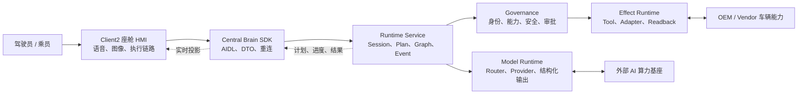

# CougarOS Central Brain

CougarOS Central Brain 是面向 Android 13 座舱域控制器的车载 AIOS 中枢。系统将语音和座舱图像转化为
受治理、可追踪、可审批、可核验的车辆动作。

## 软件架构

## 权威文档

仓库维护三份根级生产软件权威文档；模块级实现细节统一由软件开发文档索引到
`docs/modules/`，不再新增平级专题文档：

| 文档 | 内容 |
| --- | --- |
| [生产软件需求文档](docs/CENTRAL_BRAIN_REQUIREMENTS.md) | 全部 139 个工作包、Req ID、需求说明、验收和进度状态 |
| [生产软件架构文档](docs/CENTRAL_BRAIN_SOFTWARE_ARCHITECTURE.md) | 自上而下的部署、分层、模块、数据、流程、安全和恢复架构 |
| [生产软件开发文档](docs/CENTRAL_BRAIN_SOFTWARE_DEVELOPMENT.md) | 公共开发规则、对外接口摘要，以及 16 份模块详设入口 |

## 当前状态

| 范围 | 状态 |
| --- | --- |
| 仓库软件合同与主模块 | 已形成 |
| P4-R7 HMI 实现 | 当前 Draft 分支已包含，尚未进入 `main` |
| 生产 Model Provider | 待量产准入 |
| 真实 Vehicle/NPU Adapter | 外部接口阻塞 |
| 生产签名、隐私、安全和目标资格 | 待 owner 与目标证据 |
| `production_ready` | `false` |
| `target_hardware_validated` | `false` |

所有局部完成状态和剩余项以需求文档为准。软件检查、界面演示或局部设备证据不能替代量产验收。
