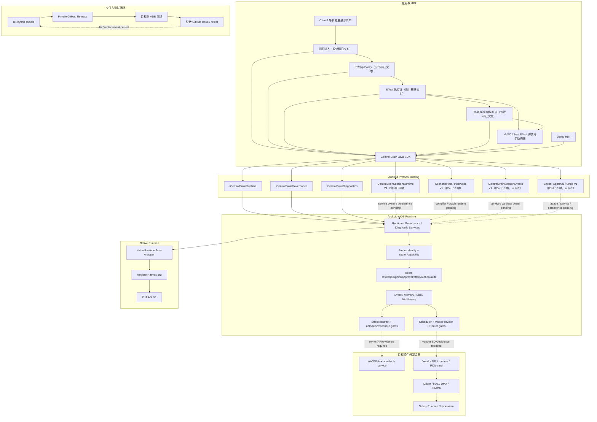

# CougarOS Central Brain

CougarOS 是面向黑盒 Android 13 座舱域控制器的车载中央大脑工程。当前唯一产品开发主线是
Java/AIDL/C Android Runtime、typed Binder SDK、Client2 座舱 HMI 和面向真实车辆/NPU 的
失败关闭适配接口。早期 Python/REST/Linux 仿真原型已于 2026-07-16 退役：
`python_prototype_runtime_maintained=false`。

用户提供的架构图是需求基线，不是示意图。所有实现、接口、交付和偏差必须映射明确 Req ID；
核心映射覆盖 `APP-004`、`XSC-001..006`、`NV-F-001/011/012`、
`NV-G-003/005/006/007`、`NV-P-002`、`KH-003/006`、`DEL-001/003/004/005`、
`S2-HMI-001..006`。

## 当前状态

更新时间：2026-07-16

| 项目 | 当前值 | 含义 |
| --- | --- | --- |
| 目标平台 | Android 13 / API 33 黑盒座舱控制器 | 普通 APK、公开 Android/NDK API；不修改已刷机系统 |
| Android 软件交付 | `hybrid_software_handoff_ready=true` | SDK/Native AAR、Runtime/Demo APK 和可选 Client2 APK 已形成 |
| 物理应用层证据 | `physical_controller_application_evidence_available=true` | Runtime/Demo/Client2 的安装、Binder、UI、恢复已验证 |
| GitHub 基线 | `maintained_project_files_synced=true` | 正式源码/文档已跟踪；首页架构与进度由门禁维护 |
| Python 原型 | `python_prototype_runtime_maintained=false` | 源码、合同、样例、部署和对应门禁已移除 |
| AIOS Stage 2 | `design_baseline_complete=true`；`session_contract_v1_defined=true`；`plan_contract_v1_defined=true`；`event_contract_v1_defined=true`；`effect_contract_v1_defined=true`；`effect_parcel_physical_android13_arm64_verified=true`；`session_runtime_service_published=false`；`plan_runtime_published=false`；`event_runtime_service_published=false`；`event_callback_service_published=false`；`effect_runtime_service_published=false`；`approval_response_service_published=false`；`undo_service_published=false`；`implementation_stage=P1-W05` | P1-W01..P1-W04 Session/Plan/Event/Effect 合同和真机 Parcel 验证完成；下一步为 SDK facade v2 |
| 中控 AIOS UI/UX 设计稿 | `cockpit_hmi_design_mockups_ready=true`；`aios_intent_orchestration_ux_ready=true`；`cockpit_hmi_1920x1080_safe_frame_verified=true`；`cockpit_hmi_translucent_material_ready=true` | 四阶段原型、自动化链、画布内安全框、60% 半透明浅灰玻璃和四张 1920x1080 稿件已形成；仅 HMI-D0 设计基线 |
| 中控 AIOS 闭环 | `cockpit_demo_control_loop_implemented=false` | Client2 四阶段、Effect 详情和闭环合同已规划；P4 预计 24-32 人日 |
| 测试版本 | `android13-hwtest-v0.5.0-rc.2` | 远程硬件测试合同的当前 RC；不是量产版本 |
| 模型/NPU | `vendor_npu_provider_available=false` | Model contract/C ABI 保留，Vendor provider 仍为空 |
| 生产状态 | `production_ready=false` | 生产签名、系统 owner、权限、升级/回滚未关闭 |
| 目标硬件 | `target_hardware_validated=false` | PCIe NPU、VHAL、车辆总线和 Driver/HAL 未验收 |
| Driver/HAL | `driver_development_triggered=false` | 仅在公开能力确认不足后新增最小开发量 |
| 虚拟化 | `virtualization_development_triggered=false` | 只保留外部接口约束，不开发 Hypervisor |

权威进度见 [路线图](docs/CENTRAL_BRAIN_ROADMAP.md)，偏差见
[架构偏差](docs/CENTRAL_BRAIN_ARCHITECTURE_DEVIATIONS.md)，风险见
[架构问题](docs/CENTRAL_BRAIN_ARCHITECTURE_ISSUES.md)。

## GitHub 同步与仓库完整性

[LucasWEIchen/CougarOS](https://github.com/LucasWEIchen/CougarOS) 是本项目正式源码与文档的
唯一远端基线。每个完成的开发增量必须在同一轮完成 Git commit、push 和远端检查；影响架构、
模块、接口或开发状态的变更还必须更新本 README，并在检查通过后进入默认分支 `main`，保证
GitHub 首页展示当前架构和进度，而不是只存在于开发机或临时分支。

```text
github_source_of_truth=true
github_sync_required=true
maintained_project_files_synced=true
github_homepage_architecture_current=true
```

“完整项目”指全部受维护、可评审和可复现的工程内容：

| GitHub 必须承载 | 不得进入 GitHub |
| --- | --- |
| 根 README、`.github/`、`.githooks/` | 签名私钥、keystore、token、账号凭据 |
| `central-brain/` Android Java/AIDL/C/JNI 源码和合同 | `build/`、`.gradle/`、`.cxx/`、生成 APK/AAR 和临时包 |
| `apk-labs/client2-central-brain/` 可复验 patch 工程 | `apks/`、`reverse/` 原始/逆向受控输入 |
| `docs/CENTRAL_BRAIN_*` 产品、架构、接口、交付和验收文档 | 原始设备日志、序列号、fingerprint、车辆/用户/模型 payload |
| Central Brain 构建、安装、测试、打包和门禁工具 | 本机 SDK、环境脚本、未经审查的测试证据 |

推送门禁会拒绝未提交的受维护文件、未跟踪的 Central Brain 正式文件、缺少 README 同步的项目
变更和包含敏感/二进制历史的发布。GitHub Release 只发布经过 manifest/hash/signer 审查的交付包，
不把生成物提交到源码树。

## README 维护规则

以下变化必须同步更新本文件：

- 每个完成的开发增量必须刷新近期记录；状态变化必须同时刷新开发进度总表；
- Android Gradle module、AIDL、Java/C ABI、Room schema、Client2 bridge 或交付物变化；
- Model/NPU、车辆服务、Driver/HAL、权限、签名和目标部署边界变化；
- 新增/删除正式模块或改变 production/hardware readiness；
- 发布新硬件测试 RC 或关闭外部 blocker。

提交前至少运行：

```bash
bash tools/check_central_brain_python_prototype_retirement.sh
bash tools/check_central_brain_github_repository_completeness.sh
bash tools/check_central_brain_root_readme.sh
bash tools/check_central_brain_cockpit_hmi_design.sh
bash tools/check_central_brain_aios_stage2_design.sh
bash tools/check_central_brain_android_session_contract.sh
bash tools/check_central_brain_android_plan_contract.sh
bash tools/check_central_brain_android_event_contract.sh
bash tools/check_central_brain_android_effect_contract.sh
bash tools/check_central_brain_android_runtime_evolution.sh
```

## 软件总架构



不存在 Python gateway、REST fallback 或 Linux daemon 产品路径。跨 SoC 语义通过 AIDL/Java/C
contract 和 adapter 边界保留，未来 Linux 交付必须另建正式非 Python 工作包。

## 开发进度总表

以下状态按最小可验收模块维护。“已开发”只说明对应软件退出条件已通过，不自动提升为量产或
目标硬件资格；“未开发”与“外部阻塞”不得用 test double 或界面演示冒充完成。

### 已开发并验证

| 模块 | 当前交付 | 证据边界 | 状态 |
| --- | --- | --- | --- |
| 架构与产品基线 | Req ID、Stage 2 UX/backlog、完整软件设计、偏差/问题台账 | 文档和静态门禁 | `DEVELOPED` |
| Android SDK 与 Protocol Binding | Java SDK AAR、typed/versioned AIDL、callback/cancel/death | JVM、API 33 Binder | `DEVELOPED` |
| Stage 2 Session 合同 | 5 个有界 DTO、独立 Session Binder V1、Java validator、hash/checksum | JVM + Android Parcel；服务未发布 | `DEVELOPED` |
| Stage 2 Plan/Node 合同 | 4 个有界 DTO、11 类节点 allowlist、DAG/补偿/重试校验、hash/checksum | JVM + Android Parcel；Compiler/Graph Runtime 未发布 | `DEVELOPED` |
| Stage 2 Event 合同 | 5 个有界 DTO、独立 Event/Callback V1、顺序/父链/脱敏/cursor 校验、hash/checksum | JVM + Android Parcel；Event/Callback Service 未发布 | `DEVELOPED` |
| Stage 2 Effect/Approval 合同 | 4 个有界 DTO、typed target、Effect 状态机、stale approval、undo TTL、hash/checksum | JVM + Android Parcel；Effect/Approval/Undo Service 未发布 | `DEVELOPED` |
| Runtime 与 Governance | Binder identity、capability/policy、Job Supervisor、诊断 | JVM、Binder、dumpsys | `DEVELOPED` |
| Durable workflow | Room task/checkpoint/approval/effect/outbox/audit/recovery | repository 和进程恢复 | `DEVELOPED` |
| Model/Event/Memory/Skill 软件合同 | scheduler、ModelProvider、bounded runtime、middleware/readiness | deterministic debug/test；无真实 NPU | `DEVELOPED` |
| Native Runtime | C11 ABI V1、JNI、arm64-v8a/x86_64 AAR、进程生命周期 | host sanitizer、ELF、API 33 load/recovery | `DEVELOPED` |
| Client2 基础演示 HMI 与 Demo HMI | 导航触发悬浮菜单、12 场景、文本回复、typed Binder、故障恢复 | Android 13 ARM64 应用层；尚无 HVAC/Seat 控制页 | `DEVELOPED` |
| Client2 中控 AIOS UI/UX 设计基线 | 可点击意图/计划/执行/结果原型、可观察自动化链、Effect 详情与四张 1920x1080 稿件 | HMI-D0 设计资产；不是 APK、车控或硬件证据 | `DEVELOPED` |
| 构建、交付与远程测试 | 五项 hybrid bundle、安装/回滚、Private Release、Issue 闭环 | 软件交付；非量产资格 | `DEVELOPED` |
| Python 仿真退役 | Python/REST/Linux runtime、旧 Console 和关联门禁已删除 | `central-brain/` Python 文件为 0 | `DEVELOPED` |

### 未开发或外部阻塞

| 模块 | 最小剩余工作 | 阻塞或下一步 | 状态 |
| --- | --- | --- | --- |
| Session Runtime v2 剩余层 | SDK facade、Runtime owner/persistence/callback | `P1-W01..P1-W04` 合同已完成；下一工作包 `P1-W05` | `NOT_STARTED` |
| Context 与 Digital Twin | versioned snapshot、freshness、debug/test twin | Stage 2 P2 | `NOT_STARTED` |
| Durable Agent Graph | plan/step/checkpoint/recovery/compensation | Stage 2 P3 | `NOT_STARTED` |
| 场景与仿真 Effect 编排 | “我冷了/我累了”、approval、simulated readback、undo | Stage 2 P2/P3；不依赖真实车身信号 | `NOT_STARTED` |
| 中控 AIOS 演示闭环 | 将已冻结设计稿实现为 APK 四阶段、自然意图归一化、可观察编排链、HVAC/Seat/Media/Nav Effect 详情、手动和 AI 共用链路 | Stage 2 P4；`S2-HMI-001..006` | `NOT_STARTED` |
| 量产 HMI 加固 | 驾驶分心、多分辨率、性能、长稳、OEM UX 验收 | Stage 2 P9；Client2 当前只是基础演示壳 | `NOT_STARTED` |
| 真实车辆 Effect 编排 | HVAC/Seat/Media/Nav target readback、Safety、rollback | 缺车辆服务、权限与 Safety owner | `EXTERNAL_BLOCKED` |
| Vendor NPU 与模型底座 | Vendor provider、模型格式、内存/取消/故障/性能 | 缺 Vendor SDK、PCIe NPU 和目标证据 | `EXTERNAL_BLOCKED` |
| 车辆/VHAL/SOA adapter | HVAC/Seat/Media/Nav property/service 和权限 | 缺 OEM/Vendor contract | `EXTERNAL_BLOCKED` |
| 生产部署与运维 | production signer、system owner、MDM、OTA、rollback、long-run | 缺目标平台 owner/策略 | `EXTERNAL_BLOCKED` |
| Driver/HAL | 仅在公开/Vendor API 已确认不足后实现最小 gap | 当前未触发 | `EXTERNAL_BLOCKED` |
| Safety/ASIL-QM/虚拟化 | 接入外部 Safety authority；不开发 Hypervisor | 用户明确当前不开发虚拟化 | `OUT_OF_SCOPE` |

## 核心调用链

### 应用任务

```text
Client2 / Demo HMI
  -> CentralBrainClient
  -> ICentralBrainRuntime.submitAgentTask
  -> Binder identity + package/current-signer capability
  -> DurableTaskRepository + JobSupervisor
  -> current deterministic task behavior
  -> TaskUpdate / TaskResult / TaskFailure callback
```

### 车辆 Effect

```text
Agent Graph (planned)
  -> Governance / Safety / Approval
  -> DurableEffectRepository prepare
  -> EffectDeliveryActivationGate
  -> AAOS or Vendor Adapter (currently absent)
  -> readback / verify / reconcile / compensate
```

当前 activation gate 失败关闭，不能把 Client2 文本回复解释成真实空调或座椅动作。

### Client2 AIOS 意图编排与中控控制闭环

```text
Client2 natural scene intent: “我有些疲惫” (planned)
  -> allowlisted bounded scenario normalization
  -> trusted Context snapshot
  -> Session / Governance / Durable Agent Graph
  -> visible Plan + Policy/Approval
  -> EffectCoordinator
  -> debug/test Digital Twin adapter (SIMULATED) or target adapter (future)
  -> EffectObservation / reported state
  -> CockpitHmiReducer
  -> execution chain + HVAC/Seat/Media/Nav details + result evidence + retry/undo
```

控件不得直接调用仿真或真实 adapter，也不得用本地 View 状态伪造回读。无真实车身信号时，
Android debug/test 版本持续显示 `SIMULATED`；release/production 中 adapter 缺失即显示 unavailable。

### 模型/NPU

```text
Runtime policy
  -> InferenceResourceScheduler
  -> ModelProvider contract
  -> vendor.npu.empty (current)
  -> Vendor SDK/JNI/C ABI (future, evidence gated)
  -> PCIe NPU Driver/HAL (external)
```

Android deterministic provider 只用于 unit/debug contract test。它不是 Python 仿真，不进入生产路由，
也不提供 NPU 性能证据。

## 仓库目录与模块映射

| 路径 | 模块 | 职责 |
| --- | --- | --- |
| `central-brain/android-runtime/central-brain-sdk` | SDK/AIDL | 应用公开 Runtime、Governance、Diagnostics、Session、Plan/Node、Event 与 Effect/Approval 合同 |
| `central-brain/android-runtime/runtime-service` | AIOS Runtime | Binder、身份、治理、Room、Model/Event/Memory/Skill/Effect |
| `central-brain/android-runtime/native-runtime` | Native Runtime | C ABI、JNI、provider 生命周期边界 |
| `central-brain/android-runtime/demo-hmi` | 维护 HMI | SDK/Binder 和治理验收 |
| `central-brain/android-runtime/policy-probe` | 负向测试 | testOnly caller/capability 检查 |
| `apk-labs/client2-central-brain/` | 座舱演示 HMI | 当前为 12 场景/文本回复；规划在同一 overlay 增加意图编排四阶段与 Effect 闭环 |
| `docs/ui/cockpit-hmi-design/` | 可点击 UI/UX 原型 | 意图/计划/执行/结果、自动化链、设备详情和可复现渲染脚本；不进入 APK 运行时 |
| `docs/assets/cockpit-hmi-design/` | 高保真设计稿 | Client2 参考画布和意图/计划/执行/结果四张 1920x1080 PNG；不是目标硬件证据 |
| `central-brain/contracts/` | Android 验收合同 | `central_brain_android_b3_blackbox_acceptance.json`、`central_brain_android_r7c_acceptance.json`、`central_brain_github_remote_testing.json` |
| `central-brain/delivery/android-hybrid/` | Android 交付 profile | 五项 artifact、inactive slots、目标输入模板 |
| `docs/CENTRAL_BRAIN_*` | 工程基线 | 需求、设计、Driver/NPU、部署、验收、偏差与风险 |
| `tools/` | 宿主侧工具 | Android build/install/verify/ADB/package/static gate |

Android Gradle 根目录为 `central-brain/android-runtime/`，正式 module 固定为
`central-brain-sdk`、`runtime-service`、`native-runtime`、`demo-hmi`、`policy-probe`。

## 语言与所有权边界

| 语言 | 允许职责 | 禁止职责 |
| --- | --- | --- |
| Java | Binder、身份/Policy、Room、编排、Model/Effect contract、Android API adapter | 猜测私有 ioctl/device node |
| AIDL | 有界 typed IPC、callback、cancel、version/hash | 传原始指针、vendor handle 或无界 payload |
| C | 稳定 Native ABI、JNI 窄桥、vendor C SDK adapter | Binder identity、业务 Policy、Room、UI |
| Bash | 构建、签名、ADB、静态验收和打包 | 承载 Runtime 业务逻辑 |
| Python | 确定性宿主构建工具 | AIOS Runtime、模型推理、车辆仿真、协议服务 |

普通 APK 不修改厂商 Android Framework、VHAL、BSP、SELinux policy 或已编译系统组件。

## Android 交付产物

B4 hybrid bundle 包含：

1. `central-brain-sdk-debug.aar`
2. `native-runtime-debug.aar`
3. `runtime-service-debug.apk`
4. `demo-hmi-debug.apk`
5. 可选 `client2-central-brain.debug.apk`

每项必须进入 manifest、SHA-256、signer/ABI/ELF inventory。安装默认 dry-run；异签 Client2
只有用户明确授权时才允许受控卸载迁移。

## 构建与验证入口

```bash
bash tools/build_central_brain_android_runtime.sh
bash tools/build_client2_central_brain_demo.sh
bash tools/package_central_brain_android_hybrid_delivery.sh
bash tools/install_central_brain_android_hybrid_delivery.sh --dry-run
bash tools/test_client2_central_brain_binder.sh
bash tools/test_client2_central_brain_recovery.sh
```

连接实体 Android 13 设备时，通过 `ADB=/mnt/e/platform-tools/adb.exe` 或 Linux `adb` 选择工具；
设备身份、raw log、签名材料和车辆/模型 payload 不得进入 GitHub。

## 安全和集成边界

- Runtime 三个 Service 使用 signature permission，内部再做 package/current-signer capability。
- 模型不能直接调用 Effect/vehicle/vendor API；所有副作用必须经过治理、持久化和验证。
- Vendor NPU、VHAL 和车辆服务缺失时返回 unavailable，不回退到已退役的 Python mock。
- GitHub 不连接目标 ADB；测试人员在内网本地执行，Issue 只上传脱敏摘要。
- `production_ready=false` 和 `target_hardware_validated=false` 只能由独立目标证据关闭。

## 关键架构文档

| 文档 | 用途 |
| --- | --- |
| [完整软件开发设计](docs/CENTRAL_BRAIN_COMPLETE_SOFTWARE_DEVELOPMENT_DESIGN.md) | 当前模块、接口、状态机和 Stage 2 实现基线 |
| [Stage 2 backlog](docs/CENTRAL_BRAIN_AIOS_STAGE2_DEVELOPMENT_BACKLOG.md) | P0-P9 最小工作包与 DoD |
| [产品 UX](docs/CENTRAL_BRAIN_AIOS_STAGE2_PRODUCT_UX_PLAN.md) | 场景、驾驶状态、审批和 Effect UX |
| [中控 AIOS 闭环](docs/CENTRAL_BRAIN_COCKPIT_HMI_CONTROL_LOOP_PLAN.md) | Client2 意图编排四阶段、Effect 详情、状态、仿真边界和验收矩阵 |
| [中控 UI/UX 设计稿](docs/CENTRAL_BRAIN_COCKPIT_HMI_UX_DESIGN_MOCKUPS.md) | 可点击意图驱动高保真原型、自动化链、Android 映射和四张 1920x1080 稿件 |
| [接口设计](docs/CENTRAL_BRAIN_INTERFACE_DESIGN.md) | Android AIDL/Java/C 当前接口 |
| [NPU Runtime](docs/CENTRAL_BRAIN_NPU_RUNTIME_INTERFACE.md) | Vendor NPU/PCIe 接入合同 |
| [Driver/HAL](docs/CENTRAL_BRAIN_DRIVER_INTERFACE_SUPPORT.md) | 能力矩阵和最小缺口规则 |
| [Python 原型退役](docs/CENTRAL_BRAIN_PYTHON_PROTOTYPE_RETIREMENT.md) | 删除范围、替代关系和保留资产 |
| [安装使用](docs/CENTRAL_BRAIN_ANDROID13_HYBRID_INSTALLATION_AND_USAGE.md) | Android 13 安装、运行、验收 |

## 本地受控输入与非发布内容

`apks/`、`reverse/`、`logs/`、本机 SDK/keystore、设备原始证据和旧环境工具不是正式仓库模块，
不得因本项目变更自动 stage 或发布。Client2 正式 patch 工程只读取受控输入并生成可复验输出。

## 近期修改日志

| 日期 | 提交或版本 | 修改内容 | 状态边界 |
| --- | --- | --- | --- |
| 2026-07-17 | [P1-W04 Effect/Approval contract V1](docs/CENTRAL_BRAIN_ANDROID_AIDL_CONTRACT.md) | 新增 4 个 bounded Effect/Approval/Undo DTO、typed target、状态转移、stale approval/undo 校验、checksum 门禁和 API 33 ARM64 Parcel 验证 | `effect_parcel_physical_android13_arm64_verified=true`；Effect/approval-response/undo Service、Room 和 hardware activation 仍为 false |
| 2026-07-17 | [P1-W03 Event contract V1](docs/CENTRAL_BRAIN_ANDROID_AIDL_CONTRACT.md) | 新增 5 个 bounded Event DTO、独立 Event/Callback V1、顺序/父链/脱敏/cursor/immutability 校验、checksum 门禁和 API 33 ARM64 Parcel 验证 | `event_parcel_physical_android13_arm64_verified=true`；Event/Callback Service、Room 和 hardware activation 仍为 false |
| 2026-07-17 | [P1-W02 Plan/Node contract V1](docs/CENTRAL_BRAIN_ANDROID_AIDL_CONTRACT.md) | 新增 4 个 bounded Plan DTO、11 类节点 allowlist、DAG/补偿/重试校验、独立 checksum 门禁和 API 33 ARM64 Parcel 验证 | `plan_parcel_physical_android13_arm64_verified=true`；Compiler/Graph Runtime/hardware activation 仍为 false |
| 2026-07-17 | [P1-W01 Session contract V1](docs/CENTRAL_BRAIN_ANDROID_AIDL_CONTRACT.md) | 新增 5 个 bounded Session DTO、独立 Binder V1、Java validator、JVM/Android Parcel 测试和 checksum 门禁；API 33 ARM64 控制器验证后卸载临时 test APK | `session_parcel_physical_android13_arm64_verified=true`；Service/hardware activation 仍为 false |
| 2026-07-16 | [HMI 画布与材质修正](docs/CENTRAL_BRAIN_COCKPIT_HMI_UX_DESIGN_MOCKUPS.md) | Panel 收敛到 `(1264,160)-(1888,1048)`，预览只等比缩小；主材质从 0.91 改为 0.60 半透明浅灰玻璃 | `cockpit_hmi_1920x1080_safe_frame_verified=true`；仍是 HMI-D0 设计资产 |
| 2026-07-16 | [AIOS 意图编排 UI/UX](docs/CENTRAL_BRAIN_COCKPIT_HMI_UX_DESIGN_MOCKUPS.md) | 将控制按钮式主导航纠正为“意图/计划/执行/结果”，以“我有些疲惫”驱动自动 Context、Plan、Policy、Effect 与 readback，并显式展示全链路 | `aios_intent_orchestration_ux_ready=true`；HMI-D1/APK/车控仍未实现 |
| 2026-07-16 | [中控 HMI 规划](docs/CENTRAL_BRAIN_COCKPIT_HMI_CONTROL_LOOP_PLAN.md) | 将 HVAC/Seat 作为次级 Effect 详情与手动兜底，冻结四阶段、全 Effect projection、仿真回读和 22 项验收 | 仅完成 HMI-D0 规划；`cockpit_demo_control_loop_implemented=false` |
| 2026-07-16 | [PR #8](https://github.com/LucasWEIchen/CougarOS/pull/8) | 固化 GitHub source-of-truth、完整项目同步、首页架构图和已开发/未开发进度表门禁 | 合并后 `main` 首页为权威状态 |
| 2026-07-16 | [`498e4bd4`](https://github.com/LucasWEIchen/CougarOS/commit/498e4bd40f15525b1d60af0485b870184251c992) | 退役 Python/REST/Linux 仿真运行时及其合同、部署、文档和门禁；Android Model/NPU/C ABI/Driver-HAL 保留 | `python_prototype_runtime_maintained=false`；production/hardware 不变 |
| 2026-07-15 | `7df9620e` | 冻结 AIOS Stage 2 产品、架构、backlog 和完整详设 | 下一实现项 `P1-W01` |
| 2026-07-15 | `8aabc7bc` | Client2 悬浮面板改为底部导航触发并完成真机复测 | 应用层 UI/Binder 范围 |
| 2026-07-14 | `1973e4ea` | 显式 Client2 signer 迁移和物理 Binder/UI 验收 | 仅 debug 应用层 |
| 2026-07-12 | [`5708dfa6`](https://github.com/LucasWEIchen/CougarOS/commit/5708dfa62d91624e9fe81e94077e8b630cb3d70b) | 首次 Issue 轮询验证 | 无硬件资格结论 |
| 2026-07-12 | [`6ca306f4`](https://github.com/LucasWEIchen/CougarOS/commit/6ca306f4bc3adf65111969e4748a8111edec5317) | 激活 Private remote 和 RC2 | production/hardware false |
| 2026-07-12 | [`909dfd83`](https://github.com/LucasWEIchen/CougarOS/commit/909dfd83d4522a5663c901c231ca3588e102aad6) | GitHub 远程硬件测试合同 | GitHub 不连接目标 ADB |
| 2026-07-12 | [`74b71868`](https://github.com/LucasWEIchen/CougarOS/commit/74b71868) | B4 hybrid 软件交付 | 五项 C/Java artifact |
| 2026-07-12 | [`c7e0c9e6`](https://github.com/LucasWEIchen/CougarOS/commit/c7e0c9e6) | B3 Android 13 preflight | 应用层证据 |
| 2026-07-12 | [`e66b09e4`](https://github.com/LucasWEIchen/CougarOS/commit/e66b09e4) | B2 Native Runtime 集成 | native dispatch false |
| 2026-07-12 | [`b2abc1f8`](https://github.com/LucasWEIchen/CougarOS/commit/b2abc1f8) | B1 C11 ABI/JNI | Vendor NPU empty |
| 2026-07-12 | [`78618a7b`](https://github.com/LucasWEIchen/CougarOS/commit/78618a7b) | R7D Android handoff | 外部 blocker 保留 |
| 2026-07-12 | [`3daaede5`](https://github.com/LucasWEIchen/CougarOS/commit/3daaede5) | R7C fault/recovery | API 33 应用集成 |
| 2026-07-12 | [`068eb1b1`](https://github.com/LucasWEIchen/CougarOS/commit/068eb1b1) | Client2 迁移到 typed Binder | 无 HTTP fallback |
