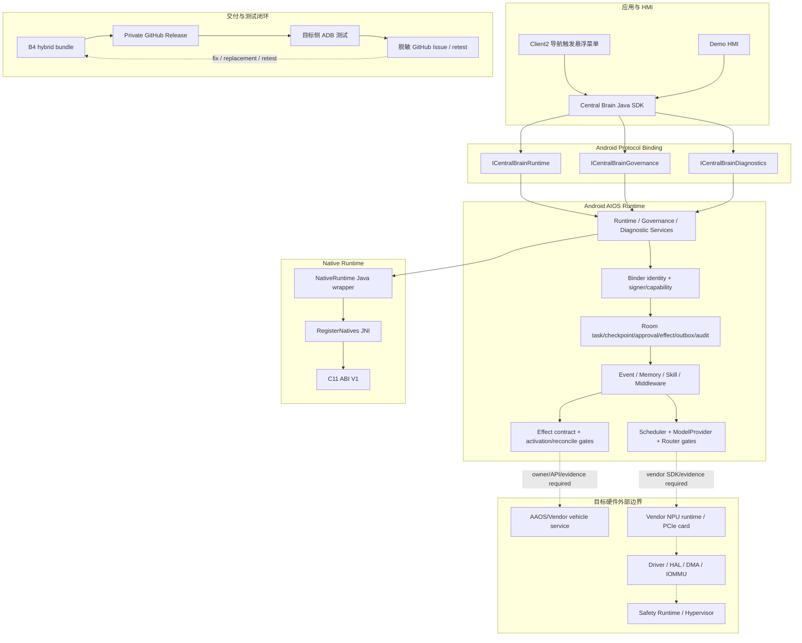

# CougarOS Central Brain

CougarOS 是面向黑盒 Android 13 座舱域控制器的车载中央大脑工程。当前唯一产品开发主线是
Java/AIDL/C Android Runtime、typed Binder SDK、Client2 座舱 HMI 和面向真实车辆/NPU 的
失败关闭适配接口。早期 Python/REST/Linux 仿真原型已于 2026-07-16 退役：
`python_prototype_runtime_maintained=false`。

用户提供的架构图是需求基线，不是示意图。所有实现、接口、交付和偏差必须映射明确 Req ID；
核心映射覆盖 `APP-004`、`XSC-001..006`、`NV-F-001/011/012`、
`NV-G-003/005/006/007`、`NV-P-002`、`KH-003/006`、`DEL-001/003/004/005`。

## 当前状态

更新时间：2026-07-16

| 项目 | 当前值 | 含义 |
| --- | --- | --- |
| 目标平台 | Android 13 / API 33 黑盒座舱控制器 | 普通 APK、公开 Android/NDK API；不修改已刷机系统 |
| Android 软件交付 | `hybrid_software_handoff_ready=true` | SDK/Native AAR、Runtime/Demo APK 和可选 Client2 APK 已形成 |
| 物理应用层证据 | `physical_controller_application_evidence_available=true` | Runtime/Demo/Client2 的安装、Binder、UI、恢复已验证 |
| Python 原型 | `python_prototype_runtime_maintained=false` | 源码、合同、样例、部署和对应门禁已移除 |
| AIOS Stage 2 | `design_baseline_complete=true`；`implementation_stage=P1-W01` | 下一步为 Session DTO/AIDL；P0 设计基线已完成 |
| 测试版本 | `android13-hwtest-v0.5.0-rc.2` | 远程硬件测试合同的当前 RC；不是量产版本 |
| 模型/NPU | `vendor_npu_provider_available=false` | Model contract/C ABI 保留，Vendor provider 仍为空 |
| 生产状态 | `production_ready=false` | 生产签名、系统 owner、权限、升级/回滚未关闭 |
| 目标硬件 | `target_hardware_validated=false` | PCIe NPU、VHAL、车辆总线和 Driver/HAL 未验收 |
| Driver/HAL | `driver_development_triggered=false` | 仅在公开能力确认不足后新增最小开发量 |
| 虚拟化 | `virtualization_development_triggered=false` | 只保留外部接口约束，不开发 Hypervisor |

权威进度见 [路线图](docs/CENTRAL_BRAIN_ROADMAP.md)，偏差见
[架构偏差](docs/CENTRAL_BRAIN_ARCHITECTURE_DEVIATIONS.md)，风险见
[架构问题](docs/CENTRAL_BRAIN_ARCHITECTURE_ISSUES.md)。

## README 维护规则

以下变化必须同步更新本文件：

- Android Gradle module、AIDL、Java/C ABI、Room schema、Client2 bridge 或交付物变化；
- Model/NPU、车辆服务、Driver/HAL、权限、签名和目标部署边界变化；
- 新增/删除正式模块或改变 production/hardware readiness；
- 发布新硬件测试 RC 或关闭外部 blocker。

提交前至少运行：

```bash
bash tools/check_central_brain_python_prototype_retirement.sh
bash tools/check_central_brain_root_readme.sh
bash tools/check_central_brain_aios_stage2_design.sh
bash tools/check_central_brain_android_runtime_evolution.sh
```

## 软件总架构



不存在 Python gateway、REST fallback 或 Linux daemon 产品路径。跨 SoC 语义通过 AIDL/Java/C
contract 和 adapter 边界保留，未来 Linux 交付必须另建正式非 Python 工作包。

## 核心调用链

### 应用任务

```text
Client2 / Demo HMI
  -> CentralBrainClient
  -> ICentralBrainRuntime.submitAgentTask
  -> Binder identity + package/current-signer capability
  -> DurableTaskRepository + JobSupervisor
  -> current deterministic task behavior
  -> TaskUpdate / TaskResult / TaskFailure callback
```

### 车辆 Effect

```text
Agent Graph (planned)
  -> Governance / Safety / Approval
  -> DurableEffectRepository prepare
  -> EffectDeliveryActivationGate
  -> AAOS or Vendor Adapter (currently absent)
  -> readback / verify / reconcile / compensate
```

当前 activation gate 失败关闭，不能把 Client2 文本回复解释成真实空调或座椅动作。

### 模型/NPU

```text
Runtime policy
  -> InferenceResourceScheduler
  -> ModelProvider contract
  -> vendor.npu.empty (current)
  -> Vendor SDK/JNI/C ABI (future, evidence gated)
  -> PCIe NPU Driver/HAL (external)
```

Android deterministic provider 只用于 unit/debug contract test。它不是 Python 仿真，不进入生产路由，
也不提供 NPU 性能证据。

## 仓库目录与模块映射

| 路径 | 模块 | 职责 |
| --- | --- | --- |
| `central-brain/android-runtime/central-brain-sdk` | SDK/AIDL | 应用公开 Runtime、Governance、Diagnostics API |
| `central-brain/android-runtime/runtime-service` | AIOS Runtime | Binder、身份、治理、Room、Model/Event/Memory/Skill/Effect |
| `central-brain/android-runtime/native-runtime` | Native Runtime | C ABI、JNI、provider 生命周期边界 |
| `central-brain/android-runtime/demo-hmi` | 维护 HMI | SDK/Binder 和治理验收 |
| `central-brain/android-runtime/policy-probe` | 负向测试 | testOnly caller/capability 检查 |
| `apk-labs/client2-central-brain/` | 座舱演示 HMI | 导航触发的 12 场景悬浮菜单、typed Binder bridge、UI/恢复测试 |
| `central-brain/contracts/` | Android 验收合同 | `central_brain_android_b3_blackbox_acceptance.json`、`central_brain_android_r7c_acceptance.json`、`central_brain_github_remote_testing.json` |
| `central-brain/delivery/android-hybrid/` | Android 交付 profile | 五项 artifact、inactive slots、目标输入模板 |
| `docs/CENTRAL_BRAIN_*` | 工程基线 | 需求、设计、Driver/NPU、部署、验收、偏差与风险 |
| `tools/` | 宿主侧工具 | Android build/install/verify/ADB/package/static gate |

Android Gradle 根目录为 `central-brain/android-runtime/`，正式 module 固定为
`central-brain-sdk`、`runtime-service`、`native-runtime`、`demo-hmi`、`policy-probe`。

## 语言与所有权边界

| 语言 | 允许职责 | 禁止职责 |
| --- | --- | --- |
| Java | Binder、身份/Policy、Room、编排、Model/Effect contract、Android API adapter | 猜测私有 ioctl/device node |
| AIDL | 有界 typed IPC、callback、cancel、version/hash | 传原始指针、vendor handle 或无界 payload |
| C | 稳定 Native ABI、JNI 窄桥、vendor C SDK adapter | Binder identity、业务 Policy、Room、UI |
| Bash | 构建、签名、ADB、静态验收和打包 | 承载 Runtime 业务逻辑 |
| Python | 确定性宿主构建工具 | AIOS Runtime、模型推理、车辆仿真、协议服务 |

普通 APK 不修改厂商 Android Framework、VHAL、BSP、SELinux policy 或已编译系统组件。

## Android 交付产物

B4 hybrid bundle 包含：

1. `central-brain-sdk-debug.aar`
2. `native-runtime-debug.aar`
3. `runtime-service-debug.apk`
4. `demo-hmi-debug.apk`
5. 可选 `client2-central-brain.debug.apk`

每项必须进入 manifest、SHA-256、signer/ABI/ELF inventory。安装默认 dry-run；异签 Client2
只有用户明确授权时才允许受控卸载迁移。

## 构建与验证入口

```bash
bash tools/build_central_brain_android_runtime.sh
bash tools/build_client2_central_brain_demo.sh
bash tools/package_central_brain_android_hybrid_delivery.sh
bash tools/install_central_brain_android_hybrid_delivery.sh --dry-run
bash tools/test_client2_central_brain_binder.sh
bash tools/test_client2_central_brain_recovery.sh
```

连接实体 Android 13 设备时，通过 `ADB=/mnt/e/platform-tools/adb.exe` 或 Linux `adb` 选择工具；
设备身份、raw log、签名材料和车辆/模型 payload 不得进入 GitHub。

## 安全和集成边界

- Runtime 三个 Service 使用 signature permission，内部再做 package/current-signer capability。
- 模型不能直接调用 Effect/vehicle/vendor API；所有副作用必须经过治理、持久化和验证。
- Vendor NPU、VHAL 和车辆服务缺失时返回 unavailable，不回退到已退役的 Python mock。
- GitHub 不连接目标 ADB；测试人员在内网本地执行，Issue 只上传脱敏摘要。
- `production_ready=false` 和 `target_hardware_validated=false` 只能由独立目标证据关闭。

## 关键架构文档

| 文档 | 用途 |
| --- | --- |
| [完整软件开发设计](docs/CENTRAL_BRAIN_COMPLETE_SOFTWARE_DEVELOPMENT_DESIGN.md) | 当前模块、接口、状态机和 Stage 2 实现基线 |
| [Stage 2 backlog](docs/CENTRAL_BRAIN_AIOS_STAGE2_DEVELOPMENT_BACKLOG.md) | P0-P9 最小工作包与 DoD |
| [产品 UX](docs/CENTRAL_BRAIN_AIOS_STAGE2_PRODUCT_UX_PLAN.md) | 场景、驾驶状态、审批和 Effect UX |
| [接口设计](docs/CENTRAL_BRAIN_INTERFACE_DESIGN.md) | Android AIDL/Java/C 当前接口 |
| [NPU Runtime](docs/CENTRAL_BRAIN_NPU_RUNTIME_INTERFACE.md) | Vendor NPU/PCIe 接入合同 |
| [Driver/HAL](docs/CENTRAL_BRAIN_DRIVER_INTERFACE_SUPPORT.md) | 能力矩阵和最小缺口规则 |
| [Python 原型退役](docs/CENTRAL_BRAIN_PYTHON_PROTOTYPE_RETIREMENT.md) | 删除范围、替代关系和保留资产 |
| [安装使用](docs/CENTRAL_BRAIN_ANDROID13_HYBRID_INSTALLATION_AND_USAGE.md) | Android 13 安装、运行、验收 |

## 本地受控输入与非发布内容

`apks/`、`reverse/`、`logs/`、本机 SDK/keystore、设备原始证据和旧环境工具不是正式仓库模块，
不得因本项目变更自动 stage 或发布。Client2 正式 patch 工程只读取受控输入并生成可复验输出。

## 近期修改日志

| 日期 | 提交或版本 | 修改内容 | 状态边界 |
| --- | --- | --- | --- |
| 2026-07-16 | 当前变更 | 退役 Python/REST/Linux 仿真运行时及其合同、部署、文档和门禁；Android Model/NPU/C ABI/Driver-HAL 保留 | `python_prototype_runtime_maintained=false`；production/hardware 不变 |
| 2026-07-15 | `7df9620e` | 冻结 AIOS Stage 2 产品、架构、backlog 和完整详设 | 下一实现项 `P1-W01` |
| 2026-07-15 | `8aabc7bc` | Client2 悬浮面板改为底部导航触发并完成真机复测 | 应用层 UI/Binder 范围 |
| 2026-07-14 | `1973e4ea` | 显式 Client2 signer 迁移和物理 Binder/UI 验收 | 仅 debug 应用层 |
| 2026-07-12 | [`5708dfa6`](https://github.com/LucasWEIchen/CougarOS/commit/5708dfa62d91624e9fe81e94077e8b630cb3d70b) | 首次 Issue 轮询验证 | 无硬件资格结论 |
| 2026-07-12 | [`6ca306f4`](https://github.com/LucasWEIchen/CougarOS/commit/6ca306f4bc3adf65111969e4748a8111edec5317) | 激活 Private remote 和 RC2 | production/hardware false |
| 2026-07-12 | [`909dfd83`](https://github.com/LucasWEIchen/CougarOS/commit/909dfd83d4522a5663c901c231ca3588e102aad6) | GitHub 远程硬件测试合同 | GitHub 不连接目标 ADB |
| 2026-07-12 | [`74b71868`](https://github.com/LucasWEIchen/CougarOS/commit/74b71868) | B4 hybrid 软件交付 | 五项 C/Java artifact |
| 2026-07-12 | [`c7e0c9e6`](https://github.com/LucasWEIchen/CougarOS/commit/c7e0c9e6) | B3 Android 13 preflight | 应用层证据 |
| 2026-07-12 | [`e66b09e4`](https://github.com/LucasWEIchen/CougarOS/commit/e66b09e4) | B2 Native Runtime 集成 | native dispatch false |
| 2026-07-12 | [`b2abc1f8`](https://github.com/LucasWEIchen/CougarOS/commit/b2abc1f8) | B1 C11 ABI/JNI | Vendor NPU empty |
| 2026-07-12 | [`78618a7b`](https://github.com/LucasWEIchen/CougarOS/commit/78618a7b) | R7D Android handoff | 外部 blocker 保留 |
| 2026-07-12 | [`3daaede5`](https://github.com/LucasWEIchen/CougarOS/commit/3daaede5) | R7C fault/recovery | API 33 应用集成 |
| 2026-07-12 | [`068eb1b1`](https://github.com/LucasWEIchen/CougarOS/commit/068eb1b1) | Client2 迁移到 typed Binder | 无 HTTP fallback |
