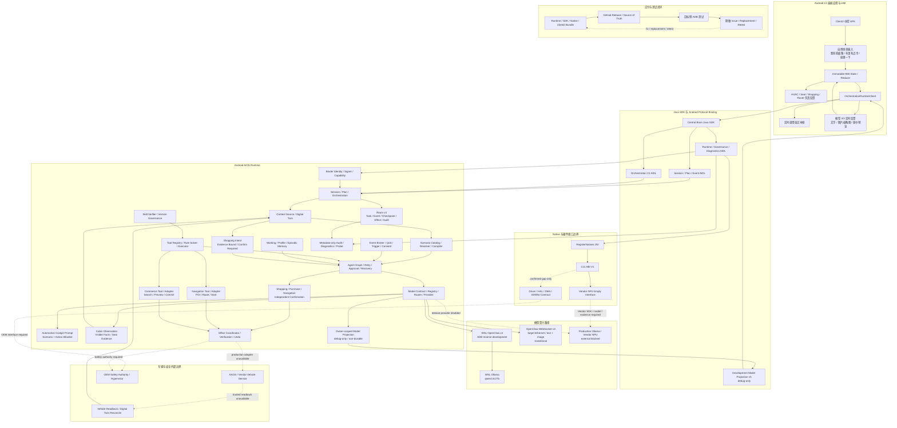

# CougarOS Central Brain

## 软件架构框图

## 开发进度总表：最细颗粒度需求跟进列表

每一行在首页直接保留需求、负责模块、前置输入、验收条件和非目标边界；需求标题继续链接到一一对应的详细目录，
“代码/接口”链接直接定位 GitHub `main` 上的实现、合同、空接口或范围门禁代码段。没有实现的条目必须显式
标注“无实现”或“无执行代码”，不得用设计文档冒充源码。

状态只表示该最小工作包的软件和已注明证据范围；`DONE` 不等于量产，`EXTERNAL_BLOCKED` 不允许用仿真替代，
`SUSPENDED` 不包含可执行安全测试。`github_source_of_truth=true`、`maintained_project_files_synced=true`、
`repository_software_requirements_complete=true`、`open_repository_software_requirement_count=0`、
`unclassified_repository_requirement_count=0`、`production_ready=false`、`target_hardware_validated=false`。

### 已开发并验证

#### P0 设计基线

| 跟进 ID | 详细需求 | Req IDs | 代码/接口 | 已交付与证据 | 状态 |
| --- | --- | --- | --- | --- | --- |
| `P0-W01` | [开源与行业证据基线](docs/CENTRAL_BRAIN_GRANULAR_REQUIREMENT_CATALOG.md#p0-w01) 需求：软件必须交付“开源与行业证据基线”，满足 全部，并以有界、版本化、可审计且失败关闭的方式提供所列能力。 模块：产品/架构文档与需求治理。 输入：用户架构图、公开行业/开源证据、产品与工程约束。 验收：必须能够由专项合同、测试或设备证据复现：AIOS/座舱行业证据、采用与延后边界。 边界：只冻结需求和设计，不形成 Runtime、车辆或 NPU 执行能力。 | 全部 | 设计门禁：[check_central_brain_aios_stage2_design.sh](https://github.com/LucasWEIchen/CougarOS/blob/main/tools/check_central_brain_aios_stage2_design.sh#L4-L22) | AIOS/座舱行业证据、采用与延后边界 | `DONE` |
| `P0-W02` | [产品与 UX 基线](docs/CENTRAL_BRAIN_GRANULAR_REQUIREMENT_CATALOG.md#p0-w02) 需求：软件必须交付“产品与 UX 基线”，满足 `S2-UX-001..003`, `S2-HMI-006`, `S2-SCN-001`, `S2-SAF-001`, `S2-EFF-001`，并以有界、版本化、可审计且失败关闭的方式提供所列能力。 模块：产品/架构文档与需求治理。 输入：用户架构图、公开行业/开源证据、产品与工程约束。 验收：必须能够由专项合同、测试或设备证据复现：意图优先、行驶限制、失败/补偿/撤销 UX。 边界：只冻结需求和设计，不形成 Runtime、车辆或 NPU 执行能力。 | `S2-UX-001..003`, `S2-HMI-006`, `S2-SCN-001`, `S2-SAF-001`, `S2-EFF-001` | 设计门禁：[check_central_brain_cockpit_hmi_design.sh](https://github.com/LucasWEIchen/CougarOS/blob/main/tools/check_central_brain_cockpit_hmi_design.sh#L4-L22) | 意图优先、行驶限制、失败/补偿/撤销 UX | `DONE` |
| `P0-W03` | [工程详设和 backlog](docs/CENTRAL_BRAIN_GRANULAR_REQUIREMENT_CATALOG.md#p0-w03) 需求：软件必须交付“工程详设和 backlog”，满足 全部，并以有界、版本化、可审计且失败关闭的方式提供所列能力。 模块：产品/架构文档与需求治理。 输入：用户架构图、公开行业/开源证据、产品与工程约束。 验收：必须能够由专项合同、测试或设备证据复现：模块、接口、依赖、测试、DoD 与 Req ID 追踪。 边界：只冻结需求和设计，不形成 Runtime、车辆或 NPU 执行能力。 | 全部 | 设计门禁：[check_central_brain_aios_stage2_design.sh](https://github.com/LucasWEIchen/CougarOS/blob/main/tools/check_central_brain_aios_stage2_design.sh#L4-L22) | 模块、接口、依赖、测试、DoD 与 Req ID 追踪 | `DONE` |

#### P1 Runtime Contract v2

| 跟进 ID | 详细需求 | Req IDs | 代码/接口 | 已交付与证据 | 状态 |
| --- | --- | --- | --- | --- | --- |
| `P1-W01` | [Session DTO/AIDL](docs/CENTRAL_BRAIN_GRANULAR_REQUIREMENT_CATALOG.md#p1-w01) 需求：软件必须交付“Session DTO/AIDL”，满足 `S2-SES-001`, `S2-UX-001`，并以有界、版本化、可审计且失败关闭的方式提供所列能力。 模块：central-brain-sdk、runtime-service、Room 持久化。 输入：冻结的 AIDL/DTO 版本、Binder 身份、Session/Plan/Event/Effect 边界和 Room schema。 验收：必须能够由专项合同、测试或设备证据复现：五个有界 DTO；`session_contract_v1_defined=true`、`session_parcel_physical_android13_arm64_verified=true`。 边界：Android 应用层合同/持久化证据不等于 VINTF stable AIDL、车辆/NPU 或量产 authority。 | `S2-SES-001`, `S2-UX-001` | 合同实现：[SessionContract.java](https://github.com/LucasWEIchen/CougarOS/blob/main/central-brain/android-runtime/central-brain-sdk/src/main/java/com/centralbrain/sdk/session/SessionContract.java#L8-L26)；[check_central_brain_android_session_contract.sh](https://github.com/LucasWEIchen/CougarOS/blob/main/tools/check_central_brain_android_session_contract.sh#L1-L19) | 五个有界 DTO；`session_contract_v1_defined=true`、`session_parcel_physical_android13_arm64_verified=true` | `DONE` |
| `P1-W02` | [Plan/Node DTO/AIDL](docs/CENTRAL_BRAIN_GRANULAR_REQUIREMENT_CATALOG.md#p1-w02) 需求：软件必须交付“Plan/Node DTO/AIDL”，满足 `S2-SCN-001`, `S2-GRF-001`，并以有界、版本化、可审计且失败关闭的方式提供所列能力。 模块：central-brain-sdk、runtime-service、Room 持久化。 输入：冻结的 AIDL/DTO 版本、Binder 身份、Session/Plan/Event/Effect 边界和 Room schema。 验收：必须能够由专项合同、测试或设备证据复现：immutable DAG/11 node allowlist；`plan_contract_v1_defined=true`、`plan_parcel_physical_android13_arm64_verified=true`、`plan_runtime_published=false`。 边界：Android 应用层合同/持久化证据不等于 VINTF stable AIDL、车辆/NPU 或量产 authority。 | `S2-SCN-001`, `S2-GRF-001` | 合同实现：[PlanContract.java](https://github.com/LucasWEIchen/CougarOS/blob/main/central-brain/android-runtime/central-brain-sdk/src/main/java/com/centralbrain/sdk/plan/PlanContract.java#L16-L34)；[check_central_brain_android_plan_contract.sh](https://github.com/LucasWEIchen/CougarOS/blob/main/tools/check_central_brain_android_plan_contract.sh#L1-L19) | immutable DAG/11 node allowlist；`plan_contract_v1_defined=true`、`plan_parcel_physical_android13_arm64_verified=true`、`plan_runtime_published=false` | `DONE` |
| `P1-W03` | [Typed Event DTO/AIDL](docs/CENTRAL_BRAIN_GRANULAR_REQUIREMENT_CATALOG.md#p1-w03) 需求：软件必须交付“Typed Event DTO/AIDL”，满足 `S2-SES-001`, `S2-EVT-001`，并以有界、版本化、可审计且失败关闭的方式提供所列能力。 模块：central-brain-sdk、runtime-service、Room 持久化。 输入：冻结的 AIDL/DTO 版本、Binder 身份、Session/Plan/Event/Effect 边界和 Room schema。 验收：必须能够由专项合同、测试或设备证据复现：cursor/replay/callback；`event_contract_v1_defined=true`、`event_parcel_physical_android13_arm64_verified=true`、`event_runtime_service_published=true`、`event_callback_service_published=true`。 边界：Android 应用层合同/持久化证据不等于 VINTF stable AIDL、车辆/NPU 或量产 authority。 | `S2-SES-001`, `S2-EVT-001` | 合同实现：[EventContract.java](https://github.com/LucasWEIchen/CougarOS/blob/main/central-brain/android-runtime/central-brain-sdk/src/main/java/com/centralbrain/sdk/event/EventContract.java#L13-L31)；[check_central_brain_android_event_contract.sh](https://github.com/LucasWEIchen/CougarOS/blob/main/tools/check_central_brain_android_event_contract.sh#L1-L19) | cursor/replay/callback；`event_contract_v1_defined=true`、`event_parcel_physical_android13_arm64_verified=true`、`event_runtime_service_published=true`、`event_callback_service_published=true` | `DONE` |
| `P1-W04` | [Effect/Approval DTO](docs/CENTRAL_BRAIN_GRANULAR_REQUIREMENT_CATALOG.md#p1-w04) 需求：软件必须交付“Effect/Approval DTO”，满足 `S2-EFF-001`, `S2-SAF-001`, `S2-UX-003`，并以有界、版本化、可审计且失败关闭的方式提供所列能力。 模块：central-brain-sdk、runtime-service、Room 持久化。 输入：冻结的 AIDL/DTO 版本、Binder 身份、Session/Plan/Event/Effect 边界和 Room schema。 验收：必须能够由专项合同、测试或设备证据复现：typed target/state/approval/undo；`effect_contract_v1_defined=true`、`effect_parcel_physical_android13_arm64_verified=true`、`effect_runtime_service_published=false`、`approval_response_service_published=false`、`undo_service_published=false`。 边界：Android 应用层合同/持久化证据不等于 VINTF stable AIDL、车辆/NPU 或量产 authority。 | `S2-EFF-001`, `S2-SAF-001`, `S2-UX-003` | 合同实现：[EffectContract.java](https://github.com/LucasWEIchen/CougarOS/blob/main/central-brain/android-runtime/central-brain-sdk/src/main/java/com/centralbrain/sdk/effect/EffectContract.java#L9-L27)；[check_central_brain_android_effect_contract.sh](https://github.com/LucasWEIchen/CougarOS/blob/main/tools/check_central_brain_android_effect_contract.sh#L1-L19) | typed target/state/approval/undo；`effect_contract_v1_defined=true`、`effect_parcel_physical_android13_arm64_verified=true`、`effect_runtime_service_published=false`、`approval_response_service_published=false`、`undo_service_published=false` | `DONE` |
| `P1-W05` | [SDK facade v2](docs/CENTRAL_BRAIN_GRANULAR_REQUIREMENT_CATALOG.md#p1-w05) 需求：软件必须交付“SDK facade v2”，满足 `S2-SES-001`, `S2-UX-001..003`, `S2-EVT-001`, `APP-004`, `XSC-001/006`，并以有界、版本化、可审计且失败关闭的方式提供所列能力。 模块：central-brain-sdk、runtime-service、Room 持久化。 输入：冻结的 AIDL/DTO 版本、Binder 身份、Session/Plan/Event/Effect 边界和 Room schema。 验收：必须能够由专项合同、测试或设备证据复现：`ScenarioClient`/`SessionClient`、replay/resubscribe、Binder death/reconnect；`sdk_facade_v2_available=true`。 边界：Android 应用层合同/持久化证据不等于 VINTF stable AIDL、车辆/NPU 或量产 authority。 | `S2-SES-001`, `S2-UX-001..003`, `S2-EVT-001`, `APP-004`, `XSC-001/006` | 合同实现：[ScenarioClient.java](https://github.com/LucasWEIchen/CougarOS/blob/main/central-brain/android-runtime/central-brain-sdk/src/main/java/com/centralbrain/sdk/ScenarioClient.java#L10-L28)；[check_central_brain_android_sdk_facade.sh](https://github.com/LucasWEIchen/CougarOS/blob/main/tools/check_central_brain_android_sdk_facade.sh#L4-L22) | `ScenarioClient`/`SessionClient`、replay/resubscribe、Binder death/reconnect；`sdk_facade_v2_available=true` | `DONE / ANDROID13_ARM64_VERIFIED` |
| `P1-W06` | [Room v4 schema](docs/CENTRAL_BRAIN_GRANULAR_REQUIREMENT_CATALOG.md#p1-w06) 需求：软件必须交付“Room v4 schema”，满足 `S2-SES-001`, `S2-GRF-001`, `S2-EFF-001`, `S2-EVT-001`，并以有界、版本化、可审计且失败关闭的方式提供所列能力。 模块：central-brain-sdk、runtime-service、Room 持久化。 输入：冻结的 AIDL/DTO 版本、Binder 身份、Session/Plan/Event/Effect 边界和 Room schema。 验收：必须能够由专项合同、测试或设备证据复现：durable Session/Event、v3->v4 migration、process-death rehydration；`room_schema_version=4`。 边界：Android 应用层合同/持久化证据不等于 VINTF stable AIDL、车辆/NPU 或量产 authority。 | `S2-SES-001`, `S2-GRF-001`, `S2-EFF-001`, `S2-EVT-001` | 合同实现：[CentralBrainDatabase.java](https://github.com/LucasWEIchen/CougarOS/blob/main/central-brain/android-runtime/runtime-service/src/main/java/com/centralbrain/runtime/persistence/CentralBrainDatabase.java#L30-L48)；[check_central_brain_android_room_v4.sh](https://github.com/LucasWEIchen/CougarOS/blob/main/tools/check_central_brain_android_room_v4.sh#L4-L22) | durable Session/Event、v3->v4 migration、process-death rehydration；`room_schema_version=4` | `DONE / ANDROID13_ARM64_VERIFIED` |
| `P1-W07` | [Contract v2 aggregate](docs/CENTRAL_BRAIN_GRANULAR_REQUIREMENT_CATALOG.md#p1-w07) 需求：软件必须交付“Contract v2 aggregate”，满足 P1 全部，并以有界、版本化、可审计且失败关闭的方式提供所列能力。 模块：central-brain-sdk、runtime-service、Room 持久化。 输入：冻结的 AIDL/DTO 版本、Binder 身份、Session/Plan/Event/Effect 边界和 Room schema。 验收：必须能够由专项合同、测试或设备证据复现：AIDL hash、capability、bounds、Room、SDK 与 forbidden fallback 聚合门禁。 边界：Android 应用层合同/持久化证据不等于 VINTF stable AIDL、车辆/NPU 或量产 authority。 | P1 全部 | 合同实现：[CentralBrainSdk.java](https://github.com/LucasWEIchen/CougarOS/blob/main/central-brain/android-runtime/central-brain-sdk/src/main/java/com/centralbrain/sdk/CentralBrainSdk.java#L8-L25)；[check_central_brain_runtime_contract_v2.sh](https://github.com/LucasWEIchen/CougarOS/blob/main/tools/check_central_brain_runtime_contract_v2.sh#L4-L22) | AIDL hash、capability、bounds、Room、SDK 与 forbidden fallback 聚合门禁 | `DONE` |
| `P6-EV2` | [Durable Session Event V2](docs/CENTRAL_BRAIN_GRANULAR_REQUIREMENT_CATALOG.md#p6-ev2) 需求：软件必须交付“Durable Session Event V2”，满足 `S2-EVT-001`, `S2-SES-001`，并以有界、版本化、可审计且失败关闭的方式提供所列能力。 模块：runtime-service 的 Event、Trigger、Consent 与主动建议。 输入：typed Event、Context source、Trigger rule、consent policy、QoS 和 HMI projection 输入。 验收：必须能够由专项合同、测试或设备证据复现：terminal cursor、owner/session Room ACK、SDK V2 negotiation/V1 fallback。 边界：主动建议不得自动获得 Effect 权限；production middleware、可信来源和 consent owner 仍需外部输入。 | `S2-EVT-001`, `S2-SES-001` | 合同实现：[EventV2Contract.java](https://github.com/LucasWEIchen/CougarOS/blob/main/central-brain/android-runtime/central-brain-sdk/src/main/java/com/centralbrain/sdk/event/EventV2Contract.java#L7-L25)；[check_central_brain_android_event_v2.sh](https://github.com/LucasWEIchen/CougarOS/blob/main/tools/check_central_brain_android_event_v2.sh#L4-L22) | terminal cursor、owner/session Room ACK、SDK V2 negotiation/V1 fallback | `SOFTWARE_COMPLETE / ARM64_RETEST_OPEN` |

#### P2 Context、Digital Twin、Scenario 与仿真 Effect

| 跟进 ID | 详细需求 | Req IDs | 代码/接口 | 已交付与证据 | 状态 |
| --- | --- | --- | --- | --- | --- |
| `P2-W01` | [Canonical Vehicle Signal Types](docs/CENTRAL_BRAIN_GRANULAR_REQUIREMENT_CATALOG.md#p2-w01) 需求：软件必须交付“Canonical Vehicle Signal Types”，满足 `S2-CTX-001`, `S2-TWN-001`，并以有界、版本化、可审计且失败关闭的方式提供所列能力。 模块：runtime-service 的 Context/Scenario/Digital Twin 与 debug adapter。 输入：canonical signal/capability、受信时间与来源元数据、build-owned scenario asset；仿真项只允许 debug/test profile。 验收：必须能够由专项合同、测试或设备证据复现：12 路径、timestamp/quality/source/schema；`vehicle_signal_schema_defined=true`。 边界：SIMULATED 能力不得进入 release/production registry，也不得作为真实车辆证据。 | `S2-CTX-001`, `S2-TWN-001` | 软件实现：[VehicleSignalPath.java](https://github.com/LucasWEIchen/CougarOS/blob/main/central-brain/android-runtime/runtime-service/src/main/java/com/centralbrain/runtime/vehicle/schema/VehicleSignalPath.java#L9-L27)；[check_central_brain_android_vehicle_signal_schema.sh](https://github.com/LucasWEIchen/CougarOS/blob/main/tools/check_central_brain_android_vehicle_signal_schema.sh#L4-L22) | 12 路径、timestamp/quality/source/schema；`vehicle_signal_schema_defined=true` | `DONE` |
| `P2-W02` | [Vehicle Capability Catalog](docs/CENTRAL_BRAIN_GRANULAR_REQUIREMENT_CATALOG.md#p2-w02) 需求：软件必须交付“Vehicle Capability Catalog”，满足 `S2-TWN-001`, `S2-ADP-001`，并以有界、版本化、可审计且失败关闭的方式提供所列能力。 模块：runtime-service 的 Context/Scenario/Digital Twin 与 debug adapter。 输入：canonical signal/capability、受信时间与来源元数据、build-owned scenario asset；仿真项只允许 debug/test profile。 验收：必须能够由专项合同、测试或设备证据复现：8 capability、area/risk/adapter/authorization；production authorized=0。 边界：SIMULATED 能力不得进入 release/production registry，也不得作为真实车辆证据。 | `S2-TWN-001`, `S2-ADP-001` | 软件实现：[CapabilityCatalog.java](https://github.com/LucasWEIchen/CougarOS/blob/main/central-brain/android-runtime/runtime-service/src/main/java/com/centralbrain/runtime/vehicle/capability/CapabilityCatalog.java#L14-L32)；[check_central_brain_android_vehicle_capability_catalog.sh](https://github.com/LucasWEIchen/CougarOS/blob/main/tools/check_central_brain_android_vehicle_capability_catalog.sh#L4-L22) | 8 capability、area/risk/adapter/authorization；production authorized=0 | `DONE` |
| `P2-W03` | [Vehicle Digital Twin Store](docs/CENTRAL_BRAIN_GRANULAR_REQUIREMENT_CATALOG.md#p2-w03) 需求：软件必须交付“Vehicle Digital Twin Store”，满足 `S2-TWN-001`，并以有界、版本化、可审计且失败关闭的方式提供所列能力。 模块：runtime-service 的 Context/Scenario/Digital Twin 与 debug adapter。 输入：canonical signal/capability、受信时间与来源元数据、build-owned scenario asset；仿真项只允许 debug/test profile。 验收：必须能够由专项合同、测试或设备证据复现：desired/reported/quality/revision；process-local、非 production trust。 边界：SIMULATED 能力不得进入 release/production registry，也不得作为真实车辆证据。 | `S2-TWN-001` | 软件实现：[VehicleDigitalTwinStore.java](https://github.com/LucasWEIchen/CougarOS/blob/main/central-brain/android-runtime/runtime-service/src/main/java/com/centralbrain/runtime/vehicle/twin/VehicleDigitalTwinStore.java#L13-L31)；[check_central_brain_android_vehicle_digital_twin.sh](https://github.com/LucasWEIchen/CougarOS/blob/main/tools/check_central_brain_android_vehicle_digital_twin.sh#L4-L22) | desired/reported/quality/revision；process-local、非 production trust | `DONE` |
| `P2-W04` | [Trusted Context Snapshot](docs/CENTRAL_BRAIN_GRANULAR_REQUIREMENT_CATALOG.md#p2-w04) 需求：软件必须交付“Trusted Context Snapshot”，满足 `S2-CTX-001`, `S2-SAF-001`，并以有界、版本化、可审计且失败关闭的方式提供所列能力。 模块：runtime-service 的 Context/Scenario/Digital Twin 与 debug adapter。 输入：canonical signal/capability、受信时间与来源元数据、build-owned scenario asset；仿真项只允许 debug/test profile。 验收：必须能够由专项合同、测试或设备证据复现：freshness/trust/restricted report；production source 未接。 边界：SIMULATED 能力不得进入 release/production registry，也不得作为真实车辆证据。 | `S2-CTX-001`, `S2-SAF-001` | 软件实现：[ContextSnapshotBuilder.java](https://github.com/LucasWEIchen/CougarOS/blob/main/central-brain/android-runtime/runtime-service/src/main/java/com/centralbrain/runtime/context/ContextSnapshotBuilder.java#L30-L48)；[check_central_brain_android_context_snapshot.sh](https://github.com/LucasWEIchen/CougarOS/blob/main/tools/check_central_brain_android_context_snapshot.sh#L4-L22) | freshness/trust/restricted report；production source 未接 | `DONE` |
| `P2-W05` | [Scenario Manifest](docs/CENTRAL_BRAIN_GRANULAR_REQUIREMENT_CATALOG.md#p2-w05) 需求：软件必须交付“Scenario Manifest”，满足 `S2-SCN-001`, `S2-SAF-001`，并以有界、版本化、可审计且失败关闭的方式提供所列能力。 模块：runtime-service 的 Context/Scenario/Digital Twin 与 debug adapter。 输入：canonical signal/capability、受信时间与来源元数据、build-owned scenario asset；仿真项只允许 debug/test profile。 验收：必须能够由专项合同、测试或设备证据复现：4 个版本化 build-owned 场景、strict schema、catalog digest 和 checksum；production-signed artifact 未接。 边界：SIMULATED 能力不得进入 release/production registry，也不得作为真实车辆证据。 | `S2-SCN-001`, `S2-SAF-001` | 软件实现：[ScenarioManifestParser.java](https://github.com/LucasWEIchen/CougarOS/blob/main/central-brain/android-runtime/runtime-service/src/main/java/com/centralbrain/runtime/scenario/ScenarioManifestParser.java#L38-L56)；[check_central_brain_android_scenario_manifest.sh](https://github.com/LucasWEIchen/CougarOS/blob/main/tools/check_central_brain_android_scenario_manifest.sh#L4-L22) | 4 个版本化场景、strict schema、catalog digest、checksum；production-signed artifact 未接 | `DONE` |
| `P2-W06` | [Deterministic Scenario Resolver](docs/CENTRAL_BRAIN_GRANULAR_REQUIREMENT_CATALOG.md#p2-w06) 需求：软件必须交付“Deterministic Scenario Resolver”，满足 `S2-SCN-001`, `S2-SAF-001`，并以有界、版本化、可审计且失败关闭的方式提供所列能力。 模块：runtime-service 的 Context/Scenario/Digital Twin 与 debug adapter。 输入：canonical signal/capability、受信时间与来源元数据、build-owned scenario asset；仿真项只允许 debug/test profile。 验收：必须能够由专项合同、测试或设备证据复现：fixed selection、availability fail-closed；model 未参与。 边界：SIMULATED 能力不得进入 release/production registry，也不得作为真实车辆证据。 | `S2-SCN-001`, `S2-SAF-001` | 软件实现：[DeterministicScenarioResolver.java](https://github.com/LucasWEIchen/CougarOS/blob/main/central-brain/android-runtime/runtime-service/src/main/java/com/centralbrain/runtime/scenario/DeterministicScenarioResolver.java#L31-L49)；[check_central_brain_android_scenario_resolver.sh](https://github.com/LucasWEIchen/CougarOS/blob/main/tools/check_central_brain_android_scenario_resolver.sh#L4-L22) | fixed selection、availability fail-closed；model 未参与 | `DONE` |
| `P2-W07` | [Scenario Plan Compiler](docs/CENTRAL_BRAIN_GRANULAR_REQUIREMENT_CATALOG.md#p2-w07) 需求：软件必须交付“Scenario Plan Compiler”，满足 `S2-SCN-001`, `S2-GRF-001`, `S2-SAF-001`，并以有界、版本化、可审计且失败关闭的方式提供所列能力。 模块：runtime-service 的 Context/Scenario/Digital Twin 与 debug adapter。 输入：canonical signal/capability、受信时间与来源元数据、build-owned scenario asset；仿真项只允许 debug/test profile。 验收：必须能够由专项合同、测试或设备证据复现：immutable DAG、moving seat branch removal；Runtime publication 未接。 边界：SIMULATED 能力不得进入 release/production registry，也不得作为真实车辆证据。 | `S2-SCN-001`, `S2-GRF-001`, `S2-SAF-001` | 软件实现：[ScenarioPlanCompiler.java](https://github.com/LucasWEIchen/CougarOS/blob/main/central-brain/android-runtime/runtime-service/src/main/java/com/centralbrain/runtime/scenario/ScenarioPlanCompiler.java#L30-L48)；[check_central_brain_android_scenario_plan_compiler.sh](https://github.com/LucasWEIchen/CougarOS/blob/main/tools/check_central_brain_android_scenario_plan_compiler.sh#L4-L22) | immutable DAG、moving seat branch removal；Runtime publication 未接 | `DONE` |
| `P2-W08` | [Simulated Effect Adapter Base](docs/CENTRAL_BRAIN_GRANULAR_REQUIREMENT_CATALOG.md#p2-w08) 需求：软件必须交付“Simulated Effect Adapter Base”，满足 `S2-ADP-001`, `S2-EFF-001`，并以有界、版本化、可审计且失败关闭的方式提供所列能力。 模块：runtime-service 的 Context/Scenario/Digital Twin 与 debug adapter。 输入：canonical signal/capability、受信时间与来源元数据、build-owned scenario asset；仿真项只允许 debug/test profile。 验收：必须能够由专项合同、测试或设备证据复现：typed target、idempotency、desired/reported；debug-only。 边界：SIMULATED 能力不得进入 release/production registry，也不得作为真实车辆证据。 | `S2-ADP-001`, `S2-EFF-001` | Debug 实现：[SimulatedEffectAdapter.java](https://github.com/LucasWEIchen/CougarOS/blob/main/central-brain/android-runtime/runtime-service/src/debug/java/com/centralbrain/runtime/simulation/SimulatedEffectAdapter.java#L15-L33)；[check_central_brain_android_simulated_effect_adapter.sh](https://github.com/LucasWEIchen/CougarOS/blob/main/tools/check_central_brain_android_simulated_effect_adapter.sh#L4-L22) | typed target、idempotency、desired/reported；debug-only | `DONE / ANDROID13_ARM64_VERIFIED` |
| `P2-W09` | [Simulated HVAC Adapter](docs/CENTRAL_BRAIN_GRANULAR_REQUIREMENT_CATALOG.md#p2-w09) 需求：软件必须交付“Simulated HVAC Adapter”，满足 `S2-ADP-001`, `S2-EFF-001`，并以有界、版本化、可审计且失败关闭的方式提供所列能力。 模块：runtime-service 的 Context/Scenario/Digital Twin 与 debug adapter。 输入：canonical signal/capability、受信时间与来源元数据、build-owned scenario asset；仿真项只允许 debug/test profile。 验收：必须能够由专项合同、测试或设备证据复现：power/temp/fan typed simulation/readback。 边界：SIMULATED 能力不得进入 release/production registry，也不得作为真实车辆证据。 | `S2-ADP-001`, `S2-EFF-001` | Debug 实现：[SimulatedHvacEffectAdapter.java](https://github.com/LucasWEIchen/CougarOS/blob/main/central-brain/android-runtime/runtime-service/src/debug/java/com/centralbrain/runtime/simulation/SimulatedHvacEffectAdapter.java#L23-L41)；[check_central_brain_android_simulated_hvac_adapter.sh](https://github.com/LucasWEIchen/CougarOS/blob/main/tools/check_central_brain_android_simulated_hvac_adapter.sh#L4-L22) | power/temp/fan typed simulation/readback | `DONE / ANDROID13_ARM64_VERIFIED` |
| `P2-W10` | [Simulated Seat Adapter](docs/CENTRAL_BRAIN_GRANULAR_REQUIREMENT_CATALOG.md#p2-w10) 需求：软件必须交付“Simulated Seat Adapter”，满足 `S2-ADP-001`, `S2-SAF-001`，并以有界、版本化、可审计且失败关闭的方式提供所列能力。 模块：runtime-service 的 Context/Scenario/Digital Twin 与 debug adapter。 输入：canonical signal/capability、受信时间与来源元数据、build-owned scenario asset；仿真项只允许 debug/test profile。 验收：必须能够由专项合同、测试或设备证据复现：recline/heat typed simulation、dispatch revalidation。 边界：SIMULATED 能力不得进入 release/production registry，也不得作为真实车辆证据。 | `S2-ADP-001`, `S2-SAF-001` | Debug 实现：[SimulatedSeatEffectAdapter.java](https://github.com/LucasWEIchen/CougarOS/blob/main/central-brain/android-runtime/runtime-service/src/debug/java/com/centralbrain/runtime/simulation/SimulatedSeatEffectAdapter.java#L27-L45)；[check_central_brain_android_simulated_seat_adapter.sh](https://github.com/LucasWEIchen/CougarOS/blob/main/tools/check_central_brain_android_simulated_seat_adapter.sh#L4-L22) | recline/heat typed simulation、dispatch revalidation | `DONE / ANDROID13_ARM64_VERIFIED` |
| `P2-W11` | [Simulated Media/Navigation Adapters](docs/CENTRAL_BRAIN_GRANULAR_REQUIREMENT_CATALOG.md#p2-w11) 需求：软件必须交付“Simulated Media/Navigation Adapters”，满足 `S2-ADP-001`，并以有界、版本化、可审计且失败关闭的方式提供所列能力。 模块：runtime-service 的 Context/Scenario/Digital Twin 与 debug adapter。 输入：canonical signal/capability、受信时间与来源元数据、build-owned scenario asset；仿真项只允许 debug/test profile。 验收：必须能够由专项合同、测试或设备证据复现：media state、synthetic navigation observation、digest-only query。 边界：SIMULATED 能力不得进入 release/production registry，也不得作为真实车辆证据。 | `S2-ADP-001` | Debug 实现：[SimulatedMediaEffectAdapter.java](https://github.com/LucasWEIchen/CougarOS/blob/main/central-brain/android-runtime/runtime-service/src/debug/java/com/centralbrain/runtime/simulation/SimulatedMediaEffectAdapter.java#L15-L33)；[check_central_brain_android_simulated_media_navigation_adapters.sh](https://github.com/LucasWEIchen/CougarOS/blob/main/tools/check_central_brain_android_simulated_media_navigation_adapters.sh#L4-L22) | media state、synthetic navigation observation、digest-only query | `DONE / ANDROID13_ARM64_VERIFIED` |
| `P2-W12` | [Debug Simulation Controller](docs/CENTRAL_BRAIN_GRANULAR_REQUIREMENT_CATALOG.md#p2-w12) 需求：软件必须交付“Debug Simulation Controller”，满足 `S2-CTX-001`, `S2-ADP-001`，并以有界、版本化、可审计且失败关闭的方式提供所列能力。 模块：runtime-service 的 Context/Scenario/Digital Twin 与 debug adapter。 输入：canonical signal/capability、受信时间与来源元数据、build-owned scenario asset；仿真项只允许 debug/test profile。 验收：必须能够由专项合同、测试或设备证据复现：signature/capability protected、revision ACK、release absent。 边界：SIMULATED 能力不得进入 release/production registry，也不得作为真实车辆证据。 | `S2-CTX-001`, `S2-ADP-001` | Debug 实现：[DebugSimulationController.java](https://github.com/LucasWEIchen/CougarOS/blob/main/central-brain/android-runtime/runtime-service/src/debug/java/com/centralbrain/runtime/simulation/DebugSimulationController.java#L26-L44)；[check_central_brain_android_debug_simulation_controller.sh](https://github.com/LucasWEIchen/CougarOS/blob/main/tools/check_central_brain_android_debug_simulation_controller.sh#L4-L22) | signature/capability protected、revision ACK、release absent | `DONE / ANDROID13_ARM64_VERIFIED` |

#### P3 Durable Agent Graph 与 Effect 闭环

| 跟进 ID | 详细需求 | Req IDs | 代码/接口 | 已交付与证据 | 状态 |
| --- | --- | --- | --- | --- | --- |
| `P3-W01` | [Agent Graph Runtime state machine](docs/CENTRAL_BRAIN_GRANULAR_REQUIREMENT_CATALOG.md#p3-w01) 需求：软件必须交付“Agent Graph Runtime state machine”，满足 `S2-GRF-001`, `NV-G-004/006/007`，并以有界、版本化、可审计且失败关闭的方式提供所列能力。 模块：runtime-service 的 Agent Graph、Effect 与恢复模块。 输入：已验证的 typed Plan、Context/Policy/Safety digest、checkpoint 和 Effect/approval/undo 合同。 验收：必须能够由专项合同、测试或设备证据复现：10-state bounded control runtime、dependency-ready、failure closed。 边界：软件 Graph/Effect 语义不得越过 production Effect、Safety、材料和 readback authority。 | `S2-GRF-001`, `NV-G-004/006/007` | 软件实现：[AgentGraphRuntime.java](https://github.com/LucasWEIchen/CougarOS/blob/main/central-brain/android-runtime/runtime-service/src/main/java/com/centralbrain/runtime/graph/AgentGraphRuntime.java#L28-L46)；[check_central_brain_android_agent_graph_runtime.sh](https://github.com/LucasWEIchen/CougarOS/blob/main/tools/check_central_brain_android_agent_graph_runtime.sh#L4-L22) | 10-state bounded control runtime、dependency-ready、failure closed | `DONE / DEBUG_RUNTIME` |
| `P3-W02` | [Typed node executors](docs/CENTRAL_BRAIN_GRANULAR_REQUIREMENT_CATALOG.md#p3-w02) 需求：软件必须交付“Typed node executors”，满足 `S2-GRF-001`, `S2-SAF-001`, `S2-EFF-001`，并以有界、版本化、可审计且失败关闭的方式提供所列能力。 模块：runtime-service 的 Agent Graph、Effect 与恢复模块。 输入：已验证的 typed Plan、Context/Policy/Safety digest、checkpoint 和 Effect/approval/undo 合同。 验收：必须能够由专项合同、测试或设备证据复现：11 node schemas、7 deterministic executors；dispatch disabled。 边界：软件 Graph/Effect 语义不得越过 production Effect、Safety、材料和 readback authority。 | `S2-GRF-001`, `S2-SAF-001`, `S2-EFF-001` | 软件实现：[NodeExecutorRegistry.java](https://github.com/LucasWEIchen/CougarOS/blob/main/central-brain/android-runtime/runtime-service/src/main/java/com/centralbrain/runtime/graph/NodeExecutorRegistry.java#L20-L38)；[check_central_brain_android_typed_node_executors.sh](https://github.com/LucasWEIchen/CougarOS/blob/main/tools/check_central_brain_android_typed_node_executors.sh#L4-L22) | 11 node schemas、7 deterministic executors；dispatch disabled | `DONE / CONTRACT` |
| `P3-W03` | [CheckpointSerializer](docs/CENTRAL_BRAIN_GRANULAR_REQUIREMENT_CATALOG.md#p3-w03) 需求：软件必须交付“CheckpointSerializer”，满足 `S2-GRF-001`, `NV-G-003/006/007`，并以有界、版本化、可审计且失败关闭的方式提供所列能力。 模块：runtime-service 的 Agent Graph、Effect 与恢复模块。 输入：已验证的 typed Plan、Context/Policy/Safety digest、checkpoint 和 Effect/approval/undo 合同。 验收：必须能够由专项合同、测试或设备证据复现：registered DTO、canonical JSON、size/depth/digest guards。 边界：软件 Graph/Effect 语义不得越过 production Effect、Safety、材料和 readback authority。 | `S2-GRF-001`, `NV-G-003/006/007` | 软件实现：[CheckpointSerializer.java](https://github.com/LucasWEIchen/CougarOS/blob/main/central-brain/android-runtime/runtime-service/src/main/java/com/centralbrain/runtime/graph/CheckpointSerializer.java#L7-L25)；[check_central_brain_android_checkpoint_serializer.sh](https://github.com/LucasWEIchen/CougarOS/blob/main/tools/check_central_brain_android_checkpoint_serializer.sh#L4-L22) | registered DTO、canonical JSON、size/depth/digest guards | `DONE / CONTRACT` |
| `P3-W04` | [Retry/Timeout policy](docs/CENTRAL_BRAIN_GRANULAR_REQUIREMENT_CATALOG.md#p3-w04) 需求：软件必须交付“Retry/Timeout policy”，满足 `S2-GRF-001`, `NV-G-004`，并以有界、版本化、可审计且失败关闭的方式提供所列能力。 模块：runtime-service 的 Agent Graph、Effect 与恢复模块。 输入：已验证的 typed Plan、Context/Policy/Safety digest、checkpoint 和 Effect/approval/undo 合同。 验收：必须能够由专项合同、测试或设备证据复现：bounded deadline/attempt/backoff；Effect retry requires reconciliation。 边界：软件 Graph/Effect 语义不得越过 production Effect、Safety、材料和 readback authority。 | `S2-GRF-001`, `NV-G-004` | 软件实现：[NodeRetryPolicy.java](https://github.com/LucasWEIchen/CougarOS/blob/main/central-brain/android-runtime/runtime-service/src/main/java/com/centralbrain/runtime/graph/NodeRetryPolicy.java#L9-L27)；[check_central_brain_android_retry_timeout_policy.sh](https://github.com/LucasWEIchen/CougarOS/blob/main/tools/check_central_brain_android_retry_timeout_policy.sh#L4-L22) | bounded deadline/attempt/backoff；Effect retry requires reconciliation | `DONE / CONTRACT` |
| `P3-W05` | [P3 Durable approval interrupt](docs/CENTRAL_BRAIN_GRANULAR_REQUIREMENT_CATALOG.md#p3-w05) 需求：软件必须交付“P3 Durable approval interrupt”，满足 `S2-SAF-001`, `S2-UX-003`, `S2-GRF-001`，并以有界、版本化、可审计且失败关闭的方式提供所列能力。 模块：runtime-service 的 Agent Graph、Effect 与恢复模块。 输入：已验证的 typed Plan、Context/Policy/Safety digest、checkpoint 和 Effect/approval/undo 合同。 验收：必须能够由专项合同、测试或设备证据复现：owner/plan/context/policy/Safety/expiry binding；authority 未发布。 边界：软件 Graph/Effect 语义不得越过 production Effect、Safety、材料和 readback authority。 | `S2-SAF-001`, `S2-UX-003`, `S2-GRF-001` | 软件实现：[ApprovalInterruptExecutor.java](https://github.com/LucasWEIchen/CougarOS/blob/main/central-brain/android-runtime/runtime-service/src/main/java/com/centralbrain/runtime/graph/ApprovalInterruptExecutor.java#L12-L30)；[check_central_brain_android_approval_interrupt.sh](https://github.com/LucasWEIchen/CougarOS/blob/main/tools/check_central_brain_android_approval_interrupt.sh#L4-L22) | owner/plan/context/policy/Safety/expiry binding；authority 未发布 | `DONE / CONTRACT` |
| `P3-W06` | [P3 EffectCoordinator](docs/CENTRAL_BRAIN_GRANULAR_REQUIREMENT_CATALOG.md#p3-w06) 需求：软件必须交付“P3 EffectCoordinator”，满足 `S2-EFF-001`, `S2-SAF-001`，并以有界、版本化、可审计且失败关闭的方式提供所列能力。 模块：runtime-service 的 Agent Graph、Effect 与恢复模块。 输入：已验证的 typed Plan、Context/Policy/Safety digest、checkpoint 和 Effect/approval/undo 合同。 验收：必须能够由专项合同、测试或设备证据复现：prepare-all、dependency waves、exact adapter registry；production dispatch=false。 边界：软件 Graph/Effect 语义不得越过 production Effect、Safety、材料和 readback authority。 | `S2-EFF-001`, `S2-SAF-001` | 软件实现：[EffectCoordinator.java](https://github.com/LucasWEIchen/CougarOS/blob/main/central-brain/android-runtime/runtime-service/src/main/java/com/centralbrain/runtime/effects/EffectCoordinator.java#L19-L37)；[check_central_brain_android_effect_coordinator.sh](https://github.com/LucasWEIchen/CougarOS/blob/main/tools/check_central_brain_android_effect_coordinator.sh#L4-L22) | prepare-all、dependency waves、exact adapter registry；production dispatch=false | `DONE / CONTRACT` |
| `P3-W07` | [P3 Effect verification/reconciliation](docs/CENTRAL_BRAIN_GRANULAR_REQUIREMENT_CATALOG.md#p3-w07) 需求：软件必须交付“P3 Effect verification/reconciliation”，满足 `S2-EFF-001`, `S2-TWN-001`，并以有界、版本化、可审计且失败关闭的方式提供所列能力。 模块：runtime-service 的 Agent Graph、Effect 与恢复模块。 输入：已验证的 typed Plan、Context/Policy/Safety digest、checkpoint 和 Effect/approval/undo 合同。 验收：必须能够由专项合同、测试或设备证据复现：delivered/applied/verified 分离、Twin reconcile、no redispatch。 边界：软件 Graph/Effect 语义不得越过 production Effect、Safety、材料和 readback authority。 | `S2-EFF-001`, `S2-TWN-001` | 软件实现：[EffectVerifier.java](https://github.com/LucasWEIchen/CougarOS/blob/main/central-brain/android-runtime/runtime-service/src/main/java/com/centralbrain/runtime/effects/EffectVerifier.java#L25-L43)；[check_central_brain_android_effect_verification.sh](https://github.com/LucasWEIchen/CougarOS/blob/main/tools/check_central_brain_android_effect_verification.sh#L4-L22) | delivered/applied/verified 分离、Twin reconcile、no redispatch | `DONE / CONTRACT` |
| `P3-W08` | [P3 Compensation/Undo](docs/CENTRAL_BRAIN_GRANULAR_REQUIREMENT_CATALOG.md#p3-w08) 需求：软件必须交付“P3 Compensation/Undo”，满足 `S2-EFF-001`, `S2-UX-003`, `S2-SAF-001`，并以有界、版本化、可审计且失败关闭的方式提供所列能力。 模块：runtime-service 的 Agent Graph、Effect 与恢复模块。 输入：已验证的 typed Plan、Context/Policy/Safety digest、checkpoint 和 Effect/approval/undo 合同。 验收：必须能够由专项合同、测试或设备证据复现：before snapshot、TTL、reverse dependency、new governed task。 边界：软件 Graph/Effect 语义不得越过 production Effect、Safety、材料和 readback authority。 | `S2-EFF-001`, `S2-UX-003`, `S2-SAF-001` | 软件实现：[CompensationPlanner.java](https://github.com/LucasWEIchen/CougarOS/blob/main/central-brain/android-runtime/runtime-service/src/main/java/com/centralbrain/runtime/effects/CompensationPlanner.java#L26-L44)；[check_central_brain_android_compensation_undo.sh](https://github.com/LucasWEIchen/CougarOS/blob/main/tools/check_central_brain_android_compensation_undo.sh#L4-L22) | before snapshot、TTL、reverse dependency、new governed task | `DONE / CONTRACT` |
| `P3-W09` | [P3 Restart recovery](docs/CENTRAL_BRAIN_GRANULAR_REQUIREMENT_CATALOG.md#p3-w09) 需求：软件必须交付“P3 Restart recovery”，满足 `S2-SES-001`, `S2-GRF-001`, `S2-EFF-001`, `S2-SAF-001`，并以有界、版本化、可审计且失败关闭的方式提供所列能力。 模块：runtime-service 的 Agent Graph、Effect 与恢复模块。 输入：已验证的 typed Plan、Context/Policy/Safety digest、checkpoint 和 Effect/approval/undo 合同。 验收：必须能够由专项合同、测试或设备证据复现：Room recovery reducer、reconcile directives、exactly-once audit。 边界：软件 Graph/Effect 语义不得越过 production Effect、Safety、材料和 readback authority。 | `S2-SES-001`, `S2-GRF-001`, `S2-EFF-001`, `S2-SAF-001` | 软件实现：[GraphRestartReconciler.java](https://github.com/LucasWEIchen/CougarOS/blob/main/central-brain/android-runtime/runtime-service/src/main/java/com/centralbrain/runtime/graph/GraphRestartReconciler.java#L25-L43)；[check_central_brain_android_graph_restart_recovery.sh](https://github.com/LucasWEIchen/CougarOS/blob/main/tools/check_central_brain_android_graph_restart_recovery.sh#L4-L22) | Room recovery reducer、reconcile directives、exactly-once audit | `DONE / ANDROID13_ARM64_DEBUG_VERIFIED` |
| `P4-R1` | [Durable Runtime Orchestration V1](docs/CENTRAL_BRAIN_GRANULAR_REQUIREMENT_CATALOG.md#p4-r1) 需求：软件必须交付“Durable Runtime Orchestration V1”，满足 `S2-SES-001`, `S2-SCN-001`, `S2-GRF-001`, `S2-EFF-001`，并以有界、版本化、可审计且失败关闭的方式提供所列能力。 模块：Client2 HMI、Central Brain Java SDK 与 Orchestration Runtime。 输入：owner-scoped Session/Event/Orchestration SDK 投影、驾驶状态和显式 debug simulation profile。 验收：必须能够由专项合同、测试或设备证据复现：owner/session Binder、Plan/Graph/Effect/readback Room projection。 边界：Client2 是演示 HMI；UI 动画和 debug readback 不等于真实车控或量产 HMI 资格。 | `S2-SES-001`, `S2-SCN-001`, `S2-GRF-001`, `S2-EFF-001` | Client2/Runtime 实现：[OrchestrationEndpoint.java](https://github.com/LucasWEIchen/CougarOS/blob/main/central-brain/android-runtime/runtime-service/src/main/java/com/centralbrain/runtime/orchestration/OrchestrationEndpoint.java#L25-L43)；[check_central_brain_android_orchestration_v1.sh](https://github.com/LucasWEIchen/CougarOS/blob/main/tools/check_central_brain_android_orchestration_v1.sh#L4-L22) | owner/session Binder、Plan/Graph/Effect/readback Room projection | `DONE / DEBUG_RUNTIME` |

#### P4 Client2 中控闭环

| 跟进 ID | 详细需求 | Req IDs | 代码/接口 | 已交付与证据 | 状态 |
| --- | --- | --- | --- | --- | --- |
| `P4-W01` | [Bridge Session/Event API migration](docs/CENTRAL_BRAIN_GRANULAR_REQUIREMENT_CATALOG.md#p4-w01) 需求：软件必须交付“Bridge Session/Event API migration”，满足 `S2-UX-001`, `S2-HMI-005`, `XSC-001`，并以有界、版本化、可审计且失败关闭的方式提供所列能力。 模块：Client2 HMI、Central Brain Java SDK 与 Orchestration Runtime。 输入：owner-scoped Session/Event/Orchestration SDK 投影、驾驶状态和显式 debug simulation profile。 验收：必须能够由专项合同、测试或设备证据复现：Client2 typed Session/Event callbacks。 边界：Client2 是演示 HMI；UI 动画和 debug readback 不等于真实车控或量产 HMI 资格。 | `S2-UX-001`, `S2-HMI-005`, `XSC-001` | Client2/Runtime 实现：[Client2ScenarioBridge.java](https://github.com/LucasWEIchen/CougarOS/blob/main/apk-labs/client2-central-brain/bridge/src/com/centralbrain/client2/Client2ScenarioBridge.java#L25-L43)；[check_central_brain_android_client2_binder.sh](https://github.com/LucasWEIchen/CougarOS/blob/main/tools/check_central_brain_android_client2_binder.sh#L4-L22) | Client2 typed Session/Event callbacks | `DONE` |
| `P4-W02` | [Cockpit HMI state/reducer/reconnect](docs/CENTRAL_BRAIN_GRANULAR_REQUIREMENT_CATALOG.md#p4-w02) 需求：软件必须交付“Cockpit HMI state/reducer/reconnect”，满足 `S2-UX-001..003`, `S2-HMI-003/005/006`，并以有界、版本化、可审计且失败关闭的方式提供所列能力。 模块：Client2 HMI、Central Brain Java SDK 与 Orchestration Runtime。 输入：owner-scoped Session/Event/Orchestration SDK 投影、驾驶状态和显式 debug simulation profile。 验收：必须能够由专项合同、测试或设备证据复现：immutable state、single reducer、Binder reconnect。 边界：Client2 是演示 HMI；UI 动画和 debug readback 不等于真实车控或量产 HMI 资格。 | `S2-UX-001..003`, `S2-HMI-003/005/006` | Client2/Runtime 实现：[CockpitHmiReducer.java](https://github.com/LucasWEIchen/CougarOS/blob/main/apk-labs/client2-central-brain/bridge/src/com/centralbrain/client2/CockpitHmiReducer.java#L12-L30)；[check_central_brain_android_client2_hmi_reducer.sh](https://github.com/LucasWEIchen/CougarOS/blob/main/tools/check_central_brain_android_client2_hmi_reducer.sh#L4-L22) | immutable state、single reducer、Binder reconnect | `DONE` |
| `P4-W03` | [Intent-first overlay shell](docs/CENTRAL_BRAIN_GRANULAR_REQUIREMENT_CATALOG.md#p4-w03) 需求：软件必须交付“Intent-first overlay shell”，满足 `S2-HMI-001..003/006`，并以有界、版本化、可审计且失败关闭的方式提供所列能力。 模块：Client2 HMI、Central Brain Java SDK 与 Orchestration Runtime。 输入：owner-scoped Session/Event/Orchestration SDK 投影、驾驶状态和显式 debug simulation profile。 验收：必须能够由专项合同、测试或设备证据复现：Intent/Plan/Execution/Result 工程状态壳。 边界：Client2 是演示 HMI；UI 动画和 debug readback 不等于真实车控或量产 HMI 资格。 | `S2-HMI-001..003/006` | Client2/Runtime 实现：[main_layout.central_brain_panel.xml](https://github.com/LucasWEIchen/CougarOS/blob/main/apk-labs/client2-central-brain/patches/main_layout.central_brain_panel.xml#L2-L20)；[check_central_brain_android_client2_intent_shell.sh](https://github.com/LucasWEIchen/CougarOS/blob/main/tools/check_central_brain_android_client2_intent_shell.sh#L4-L22) | Intent/Plan/Execution/Result 工程状态壳 | `DONE` |
| `P4-W04` | [P4 Client2 HVAC control surface](docs/CENTRAL_BRAIN_GRANULAR_REQUIREMENT_CATALOG.md#p4-w04) 需求：软件必须交付“P4 Client2 HVAC control surface”，满足 `S2-HMI-001/003/004/005`, `S2-ADP-001`，并以有界、版本化、可审计且失败关闭的方式提供所列能力。 模块：Client2 HMI、Central Brain Java SDK 与 Orchestration Runtime。 输入：owner-scoped Session/Event/Orchestration SDK 投影、驾驶状态和显式 debug simulation profile。 验收：必须能够由专项合同、测试或设备证据复现：immutable desired、300 ms debounce、scenario ownership。 边界：Client2 是演示 HMI；UI 动画和 debug readback 不等于真实车控或量产 HMI 资格。 | `S2-HMI-001/003/004/005`, `S2-ADP-001` | Client2/Runtime 实现：[HvacControlIntent.java](https://github.com/LucasWEIchen/CougarOS/blob/main/apk-labs/client2-central-brain/bridge/src/com/centralbrain/client2/HvacControlIntent.java#L9-L27)；[check_central_brain_android_client2_hvac_surface.sh](https://github.com/LucasWEIchen/CougarOS/blob/main/tools/check_central_brain_android_client2_hvac_surface.sh#L4-L22) | immutable desired、300 ms debounce、scenario ownership | `DONE` |
| `P4-W05` | [P4 Client2 Seat control surface](docs/CENTRAL_BRAIN_GRANULAR_REQUIREMENT_CATALOG.md#p4-w05) 需求：软件必须交付“P4 Client2 Seat control surface”，满足 `S2-HMI-002..005`, `S2-SAF-001`, `S2-ADP-001`，并以有界、版本化、可审计且失败关闭的方式提供所列能力。 模块：Client2 HMI、Central Brain Java SDK 与 Orchestration Runtime。 输入：owner-scoped Session/Event/Orchestration SDK 投影、驾驶状态和显式 debug simulation profile。 验收：必须能够由专项合同、测试或设备证据复现：seat typed state、Safety/approval gate。 边界：Client2 是演示 HMI；UI 动画和 debug readback 不等于真实车控或量产 HMI 资格。 | `S2-HMI-002..005`, `S2-SAF-001`, `S2-ADP-001` | Client2/Runtime 实现：[SeatControlIntent.java](https://github.com/LucasWEIchen/CougarOS/blob/main/apk-labs/client2-central-brain/bridge/src/com/centralbrain/client2/SeatControlIntent.java#L8-L26)；[check_central_brain_android_client2_seat_surface.sh](https://github.com/LucasWEIchen/CougarOS/blob/main/tools/check_central_brain_android_client2_seat_surface.sh#L4-L22) | seat typed state、Safety/approval gate | `DONE` |
| `P4-W06` | [P4 Client2 observable execution timeline](docs/CENTRAL_BRAIN_GRANULAR_REQUIREMENT_CATALOG.md#p4-w06) 需求：软件必须交付“P4 Client2 observable execution timeline”，满足 `S2-UX-001`, `S2-HMI-003/006`, `S2-EVT-001`，并以有界、版本化、可审计且失败关闭的方式提供所列能力。 模块：Client2 HMI、Central Brain Java SDK 与 Orchestration Runtime。 输入：owner-scoped Session/Event/Orchestration SDK 投影、驾驶状态和显式 debug simulation profile。 验收：必须能够由专项合同、测试或设备证据复现：七阶段、最多八条 typed event、partial visibility。 边界：Client2 是演示 HMI；UI 动画和 debug readback 不等于真实车控或量产 HMI 资格。 | `S2-UX-001`, `S2-HMI-003/006`, `S2-EVT-001` | Client2/Runtime 实现：[CockpitExecutionTimeline.java](https://github.com/LucasWEIchen/CougarOS/blob/main/apk-labs/client2-central-brain/bridge/src/com/centralbrain/client2/CockpitExecutionTimeline.java#L16-L34)；[check_central_brain_android_client2_execution_timeline.sh](https://github.com/LucasWEIchen/CougarOS/blob/main/tools/check_central_brain_android_client2_execution_timeline.sh#L4-L22) | 七阶段、最多八条 typed event、partial visibility | `DONE` |
| `P4-W07` | [P4 Client2 approval/recovery UX](docs/CENTRAL_BRAIN_GRANULAR_REQUIREMENT_CATALOG.md#p4-w07) 需求：软件必须交付“P4 Client2 approval/recovery UX”，满足 `S2-UX-003`, `S2-HMI-003`, `S2-SAF-001`，并以有界、版本化、可审计且失败关闭的方式提供所列能力。 模块：Client2 HMI、Central Brain Java SDK 与 Orchestration Runtime。 输入：owner-scoped Session/Event/Orchestration SDK 投影、驾驶状态和显式 debug simulation profile。 验收：必须能够由专项合同、测试或设备证据复现：approval/partial/retry/undo projection。 边界：Client2 是演示 HMI；UI 动画和 debug readback 不等于真实车控或量产 HMI 资格。 | `S2-UX-003`, `S2-HMI-003`, `S2-SAF-001` | Client2/Runtime 实现：[CockpitRecoveryState.java](https://github.com/LucasWEIchen/CougarOS/blob/main/apk-labs/client2-central-brain/bridge/src/com/centralbrain/client2/CockpitRecoveryState.java#L8-L26)；[check_central_brain_android_client2_recovery_ux.sh](https://github.com/LucasWEIchen/CougarOS/blob/main/tools/check_central_brain_android_client2_recovery_ux.sh#L4-L22) | approval/partial/retry/undo projection | `DONE` |
| `P4-W08` | [P4 Client2 driving restriction renderer](docs/CENTRAL_BRAIN_GRANULAR_REQUIREMENT_CATALOG.md#p4-w08) 需求：软件必须交付“P4 Client2 driving restriction renderer”，满足 `S2-UX-002`, `S2-HMI-002`，并以有界、版本化、可审计且失败关闭的方式提供所列能力。 模块：Client2 HMI、Central Brain Java SDK 与 Orchestration Runtime。 输入：owner-scoped Session/Event/Orchestration SDK 投影、驾驶状态和显式 debug simulation profile。 验收：必须能够由专项合同、测试或设备证据复现：PARKED/MOVING/UNKNOWN_RESTRICTED rendering。 边界：Client2 是演示 HMI；UI 动画和 debug readback 不等于真实车控或量产 HMI 资格。 | `S2-UX-002`, `S2-HMI-002` | Client2/Runtime 实现：[DrivingUxPolicy.java](https://github.com/LucasWEIchen/CougarOS/blob/main/apk-labs/client2-central-brain/bridge/src/com/centralbrain/client2/DrivingUxPolicy.java#L4-L22)；[check_central_brain_android_client2_driving_restriction.sh](https://github.com/LucasWEIchen/CougarOS/blob/main/tools/check_central_brain_android_client2_driving_restriction.sh#L4-L22) | PARKED/MOVING/UNKNOWN_RESTRICTED rendering | `DONE` |
| `P4-W09` | [P4 Client2 engineer simulation drawer](docs/CENTRAL_BRAIN_GRANULAR_REQUIREMENT_CATALOG.md#p4-w09) 需求：软件必须交付“P4 Client2 engineer simulation drawer”，满足 `S2-HMI-004`, `S2-ADP-001`, `S2-OBS-001`，并以有界、版本化、可审计且失败关闭的方式提供所列能力。 模块：Client2 HMI、Central Brain Java SDK 与 Orchestration Runtime。 输入：owner-scoped Session/Event/Orchestration SDK 投影、驾驶状态和显式 debug simulation profile。 验收：必须能够由专项合同、测试或设备证据复现：debug-only controller、fault/context controls。 边界：Client2 是演示 HMI；UI 动画和 debug readback 不等于真实车控或量产 HMI 资格。 | `S2-HMI-004`, `S2-ADP-001`, `S2-OBS-001` | Client2/Runtime 实现：[DebugSimulationControllerClient.java](https://github.com/LucasWEIchen/CougarOS/blob/main/apk-labs/client2-central-brain/bridge/src/com/centralbrain/client2/DebugSimulationControllerClient.java#L20-L38)；[check_central_brain_android_client2_engineer_simulation.sh](https://github.com/LucasWEIchen/CougarOS/blob/main/tools/check_central_brain_android_client2_engineer_simulation.sh#L4-L22) | debug-only controller、fault/context controls | `DONE` |
| `P4-W10` | [Scenario/manual-control synchronization](docs/CENTRAL_BRAIN_GRANULAR_REQUIREMENT_CATALOG.md#p4-w10) 需求：软件必须交付“Scenario/manual-control synchronization”，满足 `S2-HMI-001..006`, `S2-SCN-001`，并以有界、版本化、可审计且失败关闭的方式提供所列能力。 模块：Client2 HMI、Central Brain Java SDK 与 Orchestration Runtime。 输入：owner-scoped Session/Event/Orchestration SDK 投影、驾驶状态和显式 debug simulation profile。 验收：必须能够由专项合同、测试或设备证据复现：canonical roles、lifecycle、sequence ownership。 边界：Client2 是演示 HMI；UI 动画和 debug readback 不等于真实车控或量产 HMI 资格。 | `S2-HMI-001..006`, `S2-SCN-001` | Client2/Runtime 实现：[CockpitScenarioControlState.java](https://github.com/LucasWEIchen/CougarOS/blob/main/apk-labs/client2-central-brain/bridge/src/com/centralbrain/client2/CockpitScenarioControlState.java#L11-L29)；[check_central_brain_android_client2_scenario_sync.sh](https://github.com/LucasWEIchen/CougarOS/blob/main/tools/check_central_brain_android_client2_scenario_sync.sh#L4-L22) | canonical roles、lifecycle、sequence ownership | `DONE` |
| `P4-W11` | [Accessibility/display matrix](docs/CENTRAL_BRAIN_GRANULAR_REQUIREMENT_CATALOG.md#p4-w11) 需求：软件必须交付“Accessibility/display matrix”，满足 `S2-UX-003`, `S2-HMI-001/002`，并以有界、版本化、可审计且失败关闭的方式提供所列能力。 模块：Client2 HMI、Central Brain Java SDK 与 Orchestration Runtime。 输入：owner-scoped Session/Event/Orchestration SDK 投影、驾驶状态和显式 debug simulation profile。 验收：必须能够由专项合同、测试或设备证据复现：48dp、非颜色单一表达、1920x1080 safe frame。 边界：Client2 是演示 HMI；UI 动画和 debug readback 不等于真实车控或量产 HMI 资格。 | `S2-UX-003`, `S2-HMI-001/002` | Client2/Runtime 实现：[CockpitDisplayPolicy.java](https://github.com/LucasWEIchen/CougarOS/blob/main/apk-labs/client2-central-brain/bridge/src/com/centralbrain/client2/CockpitDisplayPolicy.java#L4-L22)；[check_central_brain_android_client2_accessibility_display.sh](https://github.com/LucasWEIchen/CougarOS/blob/main/tools/check_central_brain_android_client2_accessibility_display.sh#L4-L22) | 48dp、非颜色单一表达、1920x1080 safe frame | `DONE` |
| `P4-W12` | [P4 Android aggregate acceptance](docs/CENTRAL_BRAIN_GRANULAR_REQUIREMENT_CATALOG.md#p4-w12) 需求：软件必须交付“P4 Android aggregate acceptance”，满足 P4 全部，并以有界、版本化、可审计且失败关闭的方式提供所列能力。 模块：Client2 HMI、Central Brain Java SDK 与 Orchestration Runtime。 输入：owner-scoped Session/Event/Orchestration SDK 投影、驾驶状态和显式 debug simulation profile。 验收：必须能够由专项合同、测试或设备证据复现：navigation/scenario/fault/restart/display application acceptance。 边界：Client2 是演示 HMI；UI 动画和 debug readback 不等于真实车控或量产 HMI 资格。 | P4 全部 | Client2/Runtime 实现：[CockpitControlCoordinator.java](https://github.com/LucasWEIchen/CougarOS/blob/main/apk-labs/client2-central-brain/bridge/src/com/centralbrain/client2/CockpitControlCoordinator.java#L31-L49)；[check_central_brain_android_client2_p4_acceptance.sh](https://github.com/LucasWEIchen/CougarOS/blob/main/tools/check_central_brain_android_client2_p4_acceptance.sh#L4-L22) | navigation/scenario/fault/restart/display application acceptance | `DONE / ANDROID13_ARM64_APP_VERIFIED` |
| `P4-D4a` | [Simulated Scenario/Plan/Graph composition](docs/CENTRAL_BRAIN_GRANULAR_REQUIREMENT_CATALOG.md#p4-d4a) 需求：软件必须交付“Simulated Scenario/Plan/Graph composition”，满足 `S2-SCN-001`, `S2-GRF-001`, `S2-EFF-001`，并以有界、版本化、可审计且失败关闭的方式提供所列能力。 模块：Client2 HMI、Central Brain Java SDK 与 Orchestration Runtime。 输入：owner-scoped Session/Event/Orchestration SDK 投影、驾驶状态和显式 debug simulation profile。 验收：必须能够由专项合同、测试或设备证据复现：fixed Cold/Fatigue graph、pending nodes。 边界：Client2 是演示 HMI；UI 动画和 debug readback 不等于真实车控或量产 HMI 资格。 | `S2-SCN-001`, `S2-GRF-001`, `S2-EFF-001` | Debug 实现：[SimulatedScenarioGraph.java](https://github.com/LucasWEIchen/CougarOS/blob/main/central-brain/android-runtime/runtime-service/src/debug/java/com/centralbrain/runtime/scenario/SimulatedScenarioGraph.java#L30-L48)；[check_central_brain_android_simulated_scenario_graph.sh](https://github.com/LucasWEIchen/CougarOS/blob/main/tools/check_central_brain_android_simulated_scenario_graph.sh#L4-L22) | fixed Cold/Fatigue graph、pending nodes | `DONE / DEBUG_ONLY` |
| `P4-D4b` | [Debug Runtime Session/Event projection](docs/CENTRAL_BRAIN_GRANULAR_REQUIREMENT_CATALOG.md#p4-d4b) 需求：软件必须交付“Debug Runtime Session/Event projection”，满足 `S2-SCN-001`, `S2-GRF-001`, `S2-EVT-001`，并以有界、版本化、可审计且失败关闭的方式提供所列能力。 模块：Client2 HMI、Central Brain Java SDK 与 Orchestration Runtime。 输入：owner-scoped Session/Event/Orchestration SDK 投影、驾驶状态和显式 debug simulation profile。 验收：必须能够由专项合同、测试或设备证据复现：bounded Session/Event projection、digest-only payload。 边界：Client2 是演示 HMI；UI 动画和 debug readback 不等于真实车控或量产 HMI 资格。 | `S2-SCN-001`, `S2-GRF-001`, `S2-EVT-001` | Debug 实现：[SimulatedScenarioRuntime.java](https://github.com/LucasWEIchen/CougarOS/blob/main/central-brain/android-runtime/runtime-service/src/debug/java/com/centralbrain/runtime/scenario/SimulatedScenarioRuntime.java#L20-L38)；[check_central_brain_android_simulated_scenario_runtime.sh](https://github.com/LucasWEIchen/CougarOS/blob/main/tools/check_central_brain_android_simulated_scenario_runtime.sh#L4-L22) | bounded Session/Event projection、digest-only payload | `DONE / DEBUG_ONLY` |
| `P4-D4c` | [Signature-protected debug Binder](docs/CENTRAL_BRAIN_GRANULAR_REQUIREMENT_CATALOG.md#p4-d4c) 需求：软件必须交付“Signature-protected debug Binder”，满足 `APP-004`, `XSC-001/004/005/006`，并以有界、版本化、可审计且失败关闭的方式提供所列能力。 模块：Client2 HMI、Central Brain Java SDK 与 Orchestration Runtime。 输入：owner-scoped Session/Event/Orchestration SDK 投影、驾驶状态和显式 debug simulation profile。 验收：必须能够由专项合同、测试或设备证据复现：fixed 2x2 input、same-signer/capability、release absent。 边界：Client2 是演示 HMI；UI 动画和 debug readback 不等于真实车控或量产 HMI 资格。 | `APP-004`, `XSC-001/004/005/006` | Debug 实现：[SimulatedScenarioRuntimeService.java](https://github.com/LucasWEIchen/CougarOS/blob/main/central-brain/android-runtime/runtime-service/src/debug/java/com/centralbrain/runtime/scenario/SimulatedScenarioRuntimeService.java#L30-L48)；[check_central_brain_android_simulated_scenario_binder.sh](https://github.com/LucasWEIchen/CougarOS/blob/main/tools/check_central_brain_android_simulated_scenario_binder.sh#L4-L22) | fixed 2x2 input、same-signer/capability、release absent | `DONE / DEBUG_ONLY` |
| `P4-D4d` | [Debug simulated Effect/readback](docs/CENTRAL_BRAIN_GRANULAR_REQUIREMENT_CATALOG.md#p4-d4d) 需求：软件必须交付“Debug simulated Effect/readback”，满足 `S2-EFF-001`, `S2-SAF-001`, `S2-HMI-003/006`，并以有界、版本化、可审计且失败关闭的方式提供所列能力。 模块：Client2 HMI、Central Brain Java SDK 与 Orchestration Runtime。 输入：owner-scoped Session/Event/Orchestration SDK 投影、驾驶状态和显式 debug simulation profile。 验收：必须能够由专项合同、测试或设备证据复现：4 adapters、7 targets、MATCHED readback、approval projection。 边界：Client2 是演示 HMI；UI 动画和 debug readback 不等于真实车控或量产 HMI 资格。 | `S2-EFF-001`, `S2-SAF-001`, `S2-HMI-003/006` | Debug 实现：[SimulatedScenarioEffectComposition.java](https://github.com/LucasWEIchen/CougarOS/blob/main/central-brain/android-runtime/runtime-service/src/debug/java/com/centralbrain/runtime/scenario/SimulatedScenarioEffectComposition.java#L29-L47)；[check_central_brain_android_simulated_effect_composition.sh](https://github.com/LucasWEIchen/CougarOS/blob/main/tools/check_central_brain_android_simulated_effect_composition.sh#L4-L22) | 4 adapters、7 targets、MATCHED readback、approval projection | `DONE / ANDROID13_ARM64_DEBUG_VERIFIED` |
| `P4-D4e` | [Client2 simulated scenario chain](docs/CENTRAL_BRAIN_GRANULAR_REQUIREMENT_CATALOG.md#p4-d4e) 需求：软件必须交付“Client2 simulated scenario chain”，满足 `APP-004`, `S2-SCN-001`, `S2-GRF-001`, `S2-EFF-001`，并以有界、版本化、可审计且失败关闭的方式提供所列能力。 模块：Client2 HMI、Central Brain Java SDK 与 Orchestration Runtime。 输入：owner-scoped Session/Event/Orchestration SDK 投影、驾驶状态和显式 debug simulation profile。 验收：必须能够由专项合同、测试或设备证据复现：formal chain、seven-stage UI、Cold/Fatigue approve/reject。 边界：Client2 是演示 HMI；UI 动画和 debug readback 不等于真实车控或量产 HMI 资格。 | `APP-004`, `S2-SCN-001`, `S2-GRF-001`, `S2-EFF-001` | Debug 实现：[Client2ScenarioBridge.java](https://github.com/LucasWEIchen/CougarOS/blob/main/apk-labs/client2-central-brain/bridge/src/com/centralbrain/client2/Client2ScenarioBridge.java#L25-L43)；[check_central_brain_android_client2_simulated_scenario_chain.sh](https://github.com/LucasWEIchen/CougarOS/blob/main/tools/check_central_brain_android_client2_simulated_scenario_chain.sh#L1-L19) | formal chain、seven-stage UI、Cold/Fatigue approve/reject | `DONE / ANDROID13_ARM64_DEBUG_VERIFIED` |
| `P4-R2` | [Client2 Orchestration V1 migration](docs/CENTRAL_BRAIN_GRANULAR_REQUIREMENT_CATALOG.md#p4-r2) 需求：软件必须交付“Client2 Orchestration V1 migration”，满足 `APP-004`, `S2-SES-001`, `S2-SCN-001`, `S2-EVT-001`，并以有界、版本化、可审计且失败关闭的方式提供所列能力。 模块：Client2 HMI、Central Brain Java SDK 与 Orchestration Runtime。 输入：owner-scoped Session/Event/Orchestration SDK 投影、驾驶状态和显式 debug simulation profile。 验收：必须能够由专项合同、测试或设备证据复现：legacy scenario Binder removed；formal SDK/Room/Effect projection。 边界：Client2 是演示 HMI；UI 动画和 debug readback 不等于真实车控或量产 HMI 资格。 | `APP-004`, `S2-SES-001`, `S2-SCN-001`, `S2-EVT-001` | Client2/Runtime 实现：[OrchestrationRuntimeClient.java](https://github.com/LucasWEIchen/CougarOS/blob/main/apk-labs/client2-central-brain/bridge/src/com/centralbrain/client2/OrchestrationRuntimeClient.java#L29-L47)；[check_central_brain_android_client2_orchestration_migration.sh](https://github.com/LucasWEIchen/CougarOS/blob/main/tools/check_central_brain_android_client2_orchestration_migration.sh#L4-L22) | legacy scenario Binder removed；formal SDK/Room/Effect projection | `DONE / DEBUG_E2E` |
| `P4-R3` | [Voice-first live cockpit HMI](docs/CENTRAL_BRAIN_GRANULAR_REQUIREMENT_CATALOG.md#p4-r3) 需求：软件必须交付“Voice-first live cockpit HMI”，满足 `S2-HMI-001..006`, `S2-MDL-001`, `S2-EFF-001`，并以有界、版本化、可审计且失败关闭的方式提供所列能力。 模块：Client2 HMI、Central Brain Java SDK 与 Orchestration Runtime。 输入：owner-scoped Session/Event/Orchestration SDK 投影、驾驶状态和显式 debug simulation profile。 验收：必须能够由专项合同、测试或设备证据复现：两个自然触发、32 行调用链、HVAC/Seat 动画；`voice_first_hmi_implemented=true`。 边界：Client2 是演示 HMI；UI 动画和 debug readback 不等于真实车控或量产 HMI 资格。 | `S2-HMI-001..006`, `S2-MDL-001`, `S2-EFF-001` | Client2/Runtime 实现：[CockpitControlCoordinator.java](https://github.com/LucasWEIchen/CougarOS/blob/main/apk-labs/client2-central-brain/bridge/src/com/centralbrain/client2/CockpitControlCoordinator.java#L31-L49)；[check_central_brain_android_voice_first_hmi.sh](https://github.com/LucasWEIchen/CougarOS/blob/main/tools/check_central_brain_android_voice_first_hmi.sh#L4-L22) | 两个自然触发、32 行调用链、HVAC/Seat 动画；`voice_first_hmi_implemented=true` | `DONE / UI_SIMULATION_ONLY` |

#### P5 Tool、Skill 与 Memory

| 跟进 ID | 详细需求 | Req IDs | 代码/接口 | 已交付与证据 | 状态 |
| --- | --- | --- | --- | --- | --- |
| `P5-W01` | [P5 Tool Manifest/Schema](docs/CENTRAL_BRAIN_GRANULAR_REQUIREMENT_CATALOG.md#p5-w01) 需求：软件必须交付“P5 Tool Manifest/Schema”，满足 `S2-TOL-001`，并以有界、版本化、可审计且失败关闭的方式提供所列能力。 模块：runtime-service 的 Tool、Skill、Memory 与 Context Budget。 输入：版本化 Tool/Skill manifest、健康/签名证据、Session owner、Memory consent 与上下文预算。 验收：必须能够由专项合同、测试或设备证据复现：versioned manifest、bounded input/output schema。 边界：process-local/contract-test 能力不得提升为 production Tool、Skill 或 Memory authority。 | `S2-TOL-001` | 软件实现：[ToolManifest.java](https://github.com/LucasWEIchen/CougarOS/blob/main/central-brain/android-runtime/runtime-service/src/main/java/com/centralbrain/runtime/tools/ToolManifest.java#L17-L35)；[check_central_brain_android_tool_manifest.sh](https://github.com/LucasWEIchen/CougarOS/blob/main/tools/check_central_brain_android_tool_manifest.sh#L4-L22) | versioned manifest、bounded input/output schema | `DEVELOPED` |
| `P5-W02` | [P5 Tool Registry/Resolver](docs/CENTRAL_BRAIN_GRANULAR_REQUIREMENT_CATALOG.md#p5-w02) 需求：软件必须交付“P5 Tool Registry/Resolver”，满足 `S2-TOL-001`，并以有界、版本化、可审计且失败关闭的方式提供所列能力。 模块：runtime-service 的 Tool、Skill、Memory 与 Context Budget。 输入：版本化 Tool/Skill manifest、健康/签名证据、Session owner、Memory consent 与上下文预算。 验收：必须能够由专项合同、测试或设备证据复现：version map、health freshness、registered/resolved/usable separation。 边界：process-local/contract-test 能力不得提升为 production Tool、Skill 或 Memory authority。 | `S2-TOL-001` | 软件实现：[ToolRegistry.java](https://github.com/LucasWEIchen/CougarOS/blob/main/central-brain/android-runtime/runtime-service/src/main/java/com/centralbrain/runtime/tools/ToolRegistry.java#L16-L34)；[check_central_brain_android_tool_registry.sh](https://github.com/LucasWEIchen/CougarOS/blob/main/tools/check_central_brain_android_tool_registry.sh#L4-L22) | version map、health freshness、registered/resolved/usable separation | `DEVELOPED` |
| `P5-W03` | [P5 Tool RuleSolver](docs/CENTRAL_BRAIN_GRANULAR_REQUIREMENT_CATALOG.md#p5-w03) 需求：软件必须交付“P5 Tool RuleSolver”，满足 `S2-TOL-001`, `S2-SAF-001`，并以有界、版本化、可审计且失败关闭的方式提供所列能力。 模块：runtime-service 的 Tool、Skill、Memory 与 Context Budget。 输入：版本化 Tool/Skill manifest、健康/签名证据、Session owner、Memory consent 与上下文预算。 验收：必须能够由专项合同、测试或设备证据复现：rule x model x usable intersection、fail-closed。 边界：process-local/contract-test 能力不得提升为 production Tool、Skill 或 Memory authority。 | `S2-TOL-001`, `S2-SAF-001` | 软件实现：[ToolRuleSolver.java](https://github.com/LucasWEIchen/CougarOS/blob/main/central-brain/android-runtime/runtime-service/src/main/java/com/centralbrain/runtime/tools/ToolRuleSolver.java#L13-L31)；[check_central_brain_android_tool_rule_solver.sh](https://github.com/LucasWEIchen/CougarOS/blob/main/tools/check_central_brain_android_tool_rule_solver.sh#L4-L22) | rule x model x usable intersection、fail-closed | `DEVELOPED` |
| `P5-W04` | [P5 Tool Executor boundary](docs/CENTRAL_BRAIN_GRANULAR_REQUIREMENT_CATALOG.md#p5-w04) 需求：软件必须交付“P5 Tool Executor boundary”，满足 `S2-TOL-001`, `S2-SAF-001`, `S2-OBS-001`，并以有界、版本化、可审计且失败关闭的方式提供所列能力。 模块：runtime-service 的 Tool、Skill、Memory 与 Context Budget。 输入：版本化 Tool/Skill manifest、健康/签名证据、Session owner、Memory consent 与上下文预算。 验收：必须能够由专项合同、测试或设备证据复现：signed built-in executor、deadline/output bound、digest-only invocation。 边界：process-local/contract-test 能力不得提升为 production Tool、Skill 或 Memory authority。 | `S2-TOL-001`, `S2-SAF-001`, `S2-OBS-001` | 软件实现：[InProcessBuiltInToolExecutor.java](https://github.com/LucasWEIchen/CougarOS/blob/main/central-brain/android-runtime/runtime-service/src/main/java/com/centralbrain/runtime/tools/InProcessBuiltInToolExecutor.java#L15-L33)；[check_central_brain_android_tool_executor.sh](https://github.com/LucasWEIchen/CougarOS/blob/main/tools/check_central_brain_android_tool_executor.sh#L4-L22) | signed built-in executor、deadline/output bound、digest-only invocation | `DEVELOPED` |
| `P5-W05` | [P5 Skill package verifier](docs/CENTRAL_BRAIN_GRANULAR_REQUIREMENT_CATALOG.md#p5-w05) 需求：软件必须交付“P5 Skill package verifier”，满足 `S2-TOL-001`, `S2-SAF-001`, `S2-OBS-001`，并以有界、版本化、可审计且失败关闭的方式提供所列能力。 模块：runtime-service 的 Tool、Skill、Memory 与 Context Budget。 输入：版本化 Tool/Skill manifest、健康/签名证据、Session owner、Memory consent 与上下文预算。 验收：必须能够由专项合同、测试或设备证据复现：signer/version/digest/anti-downgrade；no dynamic load。 边界：process-local/contract-test 能力不得提升为 production Tool、Skill 或 Memory authority。 | `S2-TOL-001`, `S2-SAF-001`, `S2-OBS-001` | 软件实现：[SkillArtifactVerifier.java](https://github.com/LucasWEIchen/CougarOS/blob/main/central-brain/android-runtime/runtime-service/src/main/java/com/centralbrain/runtime/skills/SkillArtifactVerifier.java#L14-L32)；[check_central_brain_android_skill_package_verifier.sh](https://github.com/LucasWEIchen/CougarOS/blob/main/tools/check_central_brain_android_skill_package_verifier.sh#L4-L22) | signer/version/digest/anti-downgrade；no dynamic load | `DEVELOPED` |
| `P5-W06` | [P5 WorkingMemoryStore](docs/CENTRAL_BRAIN_GRANULAR_REQUIREMENT_CATALOG.md#p5-w06) 需求：软件必须交付“P5 WorkingMemoryStore”，满足 `S2-MEM-001`, `S2-SAF-001`, `S2-OBS-001`，并以有界、版本化、可审计且失败关闭的方式提供所列能力。 模块：runtime-service 的 Tool、Skill、Memory 与 Context Budget。 输入：版本化 Tool/Skill manifest、健康/签名证据、Session owner、Memory consent 与上下文预算。 验收：必须能够由专项合同、测试或设备证据复现：owner/session bounded process-local store。 边界：process-local/contract-test 能力不得提升为 production Tool、Skill 或 Memory authority。 | `S2-MEM-001`, `S2-SAF-001`, `S2-OBS-001` | 软件实现：[WorkingMemoryStore.java](https://github.com/LucasWEIchen/CougarOS/blob/main/central-brain/android-runtime/runtime-service/src/main/java/com/centralbrain/runtime/memory/WorkingMemoryStore.java#L17-L35)；[check_central_brain_android_working_memory_store.sh](https://github.com/LucasWEIchen/CougarOS/blob/main/tools/check_central_brain_android_working_memory_store.sh#L4-L22) | owner/session bounded process-local store | `DEVELOPED / PROCESS_LOCAL` |
| `P5-W07` | [P5 ProfileMemoryStore](docs/CENTRAL_BRAIN_GRANULAR_REQUIREMENT_CATALOG.md#p5-w07) 需求：软件必须交付“P5 ProfileMemoryStore”，满足 `S2-MEM-001`, `S2-SAF-001`, `S2-OBS-001`，并以有界、版本化、可审计且失败关闭的方式提供所列能力。 模块：runtime-service 的 Tool、Skill、Memory 与 Context Budget。 输入：版本化 Tool/Skill manifest、健康/签名证据、Session owner、Memory consent 与上下文预算。 验收：必须能够由专项合同、测试或设备证据复现：consent/field/user-seat binding；contract cipher only。 边界：process-local/contract-test 能力不得提升为 production Tool、Skill 或 Memory authority。 | `S2-MEM-001`, `S2-SAF-001`, `S2-OBS-001` | 软件实现：[ProfileMemoryStore.java](https://github.com/LucasWEIchen/CougarOS/blob/main/central-brain/android-runtime/runtime-service/src/main/java/com/centralbrain/runtime/memory/ProfileMemoryStore.java#L22-L40)；[check_central_brain_android_profile_memory_store.sh](https://github.com/LucasWEIchen/CougarOS/blob/main/tools/check_central_brain_android_profile_memory_store.sh#L4-L22) | consent/field/user-seat binding；contract cipher only | `DEVELOPED / CONTRACT_TEST` |
| `P5-W08` | [P5 EpisodicMemoryStore](docs/CENTRAL_BRAIN_GRANULAR_REQUIREMENT_CATALOG.md#p5-w08) 需求：软件必须交付“P5 EpisodicMemoryStore”，满足 `S2-MEM-001`, `S2-SAF-001`, `S2-OBS-001`，并以有界、版本化、可审计且失败关闭的方式提供所列能力。 模块：runtime-service 的 Tool、Skill、Memory 与 Context Budget。 输入：版本化 Tool/Skill manifest、健康/签名证据、Session owner、Memory consent 与上下文预算。 验收：必须能够由专项合同、测试或设备证据复现：typed bounded scenario summaries；process-local。 边界：process-local/contract-test 能力不得提升为 production Tool、Skill 或 Memory authority。 | `S2-MEM-001`, `S2-SAF-001`, `S2-OBS-001` | 软件实现：[EpisodicMemoryStore.java](https://github.com/LucasWEIchen/CougarOS/blob/main/central-brain/android-runtime/runtime-service/src/main/java/com/centralbrain/runtime/memory/EpisodicMemoryStore.java#L16-L34)；[check_central_brain_android_episodic_memory_store.sh](https://github.com/LucasWEIchen/CougarOS/blob/main/tools/check_central_brain_android_episodic_memory_store.sh#L4-L22) | typed bounded scenario summaries；process-local | `DEVELOPED / PROCESS_LOCAL` |
| `P5-W09` | [P5 ContextBudgetManager](docs/CENTRAL_BRAIN_GRANULAR_REQUIREMENT_CATALOG.md#p5-w09) 需求：软件必须交付“P5 ContextBudgetManager”，满足 `S2-MEM-001`, `S2-MDL-001`, `S2-SAF-001`，并以有界、版本化、可审计且失败关闭的方式提供所列能力。 模块：runtime-service 的 Tool、Skill、Memory 与 Context Budget。 输入：版本化 Tool/Skill manifest、健康/签名证据、Session owner、Memory consent 与上下文预算。 验收：必须能够由专项合同、测试或设备证据复现：metadata-only budget decision；tokenizer/summary execution 未接。 边界：process-local/contract-test 能力不得提升为 production Tool、Skill 或 Memory authority。 | `S2-MEM-001`, `S2-MDL-001`, `S2-SAF-001` | 软件实现：[ContextBudgetManager.java](https://github.com/LucasWEIchen/CougarOS/blob/main/central-brain/android-runtime/runtime-service/src/main/java/com/centralbrain/runtime/memory/ContextBudgetManager.java#L15-L33)；[check_central_brain_android_context_budget_manager.sh](https://github.com/LucasWEIchen/CougarOS/blob/main/tools/check_central_brain_android_context_budget_manager.sh#L4-L22) | metadata-only budget decision；tokenizer/summary execution 未接 | `DEVELOPED / DECISION_ONLY` |
| `P5-W10` | [P5 Memory consent HMI/API](docs/CENTRAL_BRAIN_GRANULAR_REQUIREMENT_CATALOG.md#p5-w10) 需求：软件必须交付“P5 Memory consent HMI/API”，满足 `S2-MEM-001`, `S2-UX-003`，并以有界、版本化、可审计且失败关闭的方式提供所列能力。 模块：runtime-service 的 Tool、Skill、Memory 与 Context Budget。 输入：版本化 Tool/Skill manifest、健康/签名证据、Session owner、Memory consent 与上下文预算。 验收：必须能够由专项合同、测试或设备证据复现：source visibility、disable、clear preference、moving restriction。 边界：process-local/contract-test 能力不得提升为 production Tool、Skill 或 Memory authority。 | `S2-MEM-001`, `S2-UX-003` | 软件实现：[MemoryConsentController.java](https://github.com/LucasWEIchen/CougarOS/blob/main/central-brain/android-runtime/runtime-service/src/main/java/com/centralbrain/runtime/memory/MemoryConsentController.java#L17-L35)；[check_central_brain_android_memory_consent_hmi.sh](https://github.com/LucasWEIchen/CougarOS/blob/main/tools/check_central_brain_android_memory_consent_hmi.sh#L4-L22) | source visibility、disable、clear preference、moving restriction | `DEVELOPED / PROJECTION_ONLY` |
| `P5-R1` | [Debug Runtime composition](docs/CENTRAL_BRAIN_GRANULAR_REQUIREMENT_CATALOG.md#p5-r1) 需求：软件必须交付“Debug Runtime composition”，满足 P5 + `S2-GRF-001`，并以有界、版本化、可审计且失败关闭的方式提供所列能力。 模块：runtime-service 的 Tool、Skill、Memory 与 Context Budget。 输入：版本化 Tool/Skill manifest、健康/签名证据、Session owner、Memory consent 与上下文预算。 验收：必须能够由专项合同、测试或设备证据复现：Tool/Skill/ContextBudget/WorkingMemory combined evidence。 边界：process-local/contract-test 能力不得提升为 production Tool、Skill 或 Memory authority。 | P5 + `S2-GRF-001` | Debug 实现：[DebugRuntimeCompositionBoundary.java](https://github.com/LucasWEIchen/CougarOS/blob/main/central-brain/android-runtime/runtime-service/src/debug/java/com/centralbrain/runtime/orchestration/DebugRuntimeCompositionBoundary.java#L30-L48)；[check_central_brain_android_runtime_composition_v1.sh](https://github.com/LucasWEIchen/CougarOS/blob/main/tools/check_central_brain_android_runtime_composition_v1.sh#L4-L22) | Tool/Skill/ContextBudget/WorkingMemory combined evidence | `DONE / DEBUG_ONLY` |

#### P6 Event 与主动智能

| 跟进 ID | 详细需求 | Req IDs | 代码/接口 | 已交付与证据 | 状态 |
| --- | --- | --- | --- | --- | --- |
| `P6-W01` | [P6 EventBroker interface/in-process](docs/CENTRAL_BRAIN_GRANULAR_REQUIREMENT_CATALOG.md#p6-w01) 需求：软件必须交付“P6 EventBroker interface/in-process”，满足 `S2-EVT-001`, `S2-SAF-001`，并以有界、版本化、可审计且失败关闭的方式提供所列能力。 模块：runtime-service 的 Event、Trigger、Consent 与主动建议。 输入：typed Event、Context source、Trigger rule、consent policy、QoS 和 HMI projection 输入。 验收：必须能够由专项合同、测试或设备证据复现：typed topic、append-before-notify、bounded replay、identity policy。 边界：主动建议不得自动获得 Effect 权限；production middleware、可信来源和 consent owner 仍需外部输入。 | `S2-EVT-001`, `S2-SAF-001` | 软件实现：[InProcessDurableEventBroker.java](https://github.com/LucasWEIchen/CougarOS/blob/main/central-brain/android-runtime/runtime-service/src/main/java/com/centralbrain/runtime/events/InProcessDurableEventBroker.java#L21-L39)；[check_central_brain_android_event_broker.sh](https://github.com/LucasWEIchen/CougarOS/blob/main/tools/check_central_brain_android_event_broker.sh#L4-L22) | typed topic、append-before-notify、bounded replay、identity policy | `DEVELOPED / PROCESS_LOCAL` |
| `P6-W02` | [P6 Event Backpressure/QoS](docs/CENTRAL_BRAIN_GRANULAR_REQUIREMENT_CATALOG.md#p6-w02) 需求：软件必须交付“P6 Event Backpressure/QoS”，满足 `S2-EVT-001`, `NV-G-004`, `S2-SAF-001`，并以有界、版本化、可审计且失败关闭的方式提供所列能力。 模块：runtime-service 的 Event、Trigger、Consent 与主动建议。 输入：typed Event、Context source、Trigger rule、consent policy、QoS 和 HMI projection 输入。 验收：必须能够由专项合同、测试或设备证据复现：4 policies、critical no-silent-drop、consumer isolation。 边界：主动建议不得自动获得 Effect 权限；production middleware、可信来源和 consent owner 仍需外部输入。 | `S2-EVT-001`, `NV-G-004`, `S2-SAF-001` | 软件实现：[InProcessEventBackpressureQueue.java](https://github.com/LucasWEIchen/CougarOS/blob/main/central-brain/android-runtime/runtime-service/src/main/java/com/centralbrain/runtime/events/InProcessEventBackpressureQueue.java#L12-L30)；[check_central_brain_android_event_backpressure_qos.sh](https://github.com/LucasWEIchen/CougarOS/blob/main/tools/check_central_brain_android_event_backpressure_qos.sh#L4-L22) | 4 policies、critical no-silent-drop、consumer isolation | `DEVELOPED / PROCESS_LOCAL` |
| `P6-W03` | [P6 TriggerRule/TriggerEngine](docs/CENTRAL_BRAIN_GRANULAR_REQUIREMENT_CATALOG.md#p6-w03) 需求：软件必须交付“P6 TriggerRule/TriggerEngine”，满足 `S2-EVT-001`, `S2-SCN-001`, `S2-SAF-001`，并以有界、版本化、可审计且失败关闭的方式提供所列能力。 模块：runtime-service 的 Event、Trigger、Consent 与主动建议。 输入：typed Event、Context source、Trigger rule、consent policy、QoS 和 HMI projection 输入。 验收：必须能够由专项合同、测试或设备证据复现：threshold/window/debounce/cooldown、suggestion-only。 边界：主动建议不得自动获得 Effect 权限；production middleware、可信来源和 consent owner 仍需外部输入。 | `S2-EVT-001`, `S2-SCN-001`, `S2-SAF-001` | 软件实现：[TriggerEngine.java](https://github.com/LucasWEIchen/CougarOS/blob/main/central-brain/android-runtime/runtime-service/src/main/java/com/centralbrain/runtime/events/TriggerEngine.java#L16-L34)；[check_central_brain_android_trigger_engine.sh](https://github.com/LucasWEIchen/CougarOS/blob/main/tools/check_central_brain_android_trigger_engine.sh#L4-L22) | threshold/window/debounce/cooldown、suggestion-only | `DEVELOPED / PROCESS_LOCAL` |
| `P6-W04` | [P6 Proactive consent/policy](docs/CENTRAL_BRAIN_GRANULAR_REQUIREMENT_CATALOG.md#p6-w04) 需求：软件必须交付“P6 Proactive consent/policy”，满足 `S2-SAF-001`, `S2-MEM-001`, `S2-EVT-001`，并以有界、版本化、可审计且失败关闭的方式提供所列能力。 模块：runtime-service 的 Event、Trigger、Consent 与主动建议。 输入：typed Event、Context source、Trigger rule、consent policy、QoS 和 HMI projection 输入。 验收：必须能够由专项合同、测试或设备证据复现：exact grant binding、HIGH/CRITICAL hard block、TTL/revoke。 边界：主动建议不得自动获得 Effect 权限；production middleware、可信来源和 consent owner 仍需外部输入。 | `S2-SAF-001`, `S2-MEM-001`, `S2-EVT-001` | 软件实现：[ProactiveConsentPolicy.java](https://github.com/LucasWEIchen/CougarOS/blob/main/central-brain/android-runtime/runtime-service/src/main/java/com/centralbrain/runtime/events/ProactiveConsentPolicy.java#L17-L35)；[check_central_brain_android_proactive_consent_policy.sh](https://github.com/LucasWEIchen/CougarOS/blob/main/tools/check_central_brain_android_proactive_consent_policy.sh#L4-L22) | exact grant binding、HIGH/CRITICAL hard block、TTL/revoke | `DEVELOPED / POLICY_ONLY` |
| `P6-W05` | [P6 Context source adapters](docs/CENTRAL_BRAIN_GRANULAR_REQUIREMENT_CATALOG.md#p6-w05) 需求：软件必须交付“P6 Context source adapters”，满足 `S2-CTX-001`, `S2-EVT-001`, `S2-SAF-001`，并以有界、版本化、可审计且失败关闭的方式提供所列能力。 模块：runtime-service 的 Event、Trigger、Consent 与主动建议。 输入：typed Event、Context source、Trigger rule、consent policy、QoS 和 HMI projection 输入。 验收：必须能够由专项合同、测试或设备证据复现：Runtime health/time/simulated vehicle normalization。 边界：主动建议不得自动获得 Effect 权限；production middleware、可信来源和 consent owner 仍需外部输入。 | `S2-CTX-001`, `S2-EVT-001`, `S2-SAF-001` | 软件实现：[RuntimeHealthContextSourceAdapter.java](https://github.com/LucasWEIchen/CougarOS/blob/main/central-brain/android-runtime/runtime-service/src/main/java/com/centralbrain/runtime/events/RuntimeHealthContextSourceAdapter.java#L8-L26)；[check_central_brain_android_context_source_adapters.sh](https://github.com/LucasWEIchen/CougarOS/blob/main/tools/check_central_brain_android_context_source_adapters.sh#L4-L22) | Runtime health/time/simulated vehicle normalization | `DEVELOPED / NORMALIZATION_ONLY` |
| `P6-W06` | [P6 Active suggestion UX](docs/CENTRAL_BRAIN_GRANULAR_REQUIREMENT_CATALOG.md#p6-w06) 需求：软件必须交付“P6 Active suggestion UX”，满足 `S2-UX-002`, `S2-TRG-002`, `S2-SAF-001`，并以有界、版本化、可审计且失败关闭的方式提供所列能力。 模块：runtime-service 的 Event、Trigger、Consent 与主动建议。 输入：typed Event、Context source、Trigger rule、consent policy、QoS 和 HMI projection 输入。 验收：必须能够由专项合同、测试或设备证据复现：full/minimal card、merge/replay、never-ask。 边界：主动建议不得自动获得 Effect 权限；production middleware、可信来源和 consent owner 仍需外部输入。 | `S2-UX-002`, `S2-TRG-002`, `S2-SAF-001` | 软件实现：[ActiveSuggestionController.java](https://github.com/LucasWEIchen/CougarOS/blob/main/central-brain/android-runtime/runtime-service/src/main/java/com/centralbrain/runtime/suggestion/ActiveSuggestionController.java#L21-L39)；[check_central_brain_android_active_suggestion_ux.sh](https://github.com/LucasWEIchen/CougarOS/blob/main/tools/check_central_brain_android_active_suggestion_ux.sh#L4-L22) | full/minimal card、merge/replay、never-ask | `DEVELOPED / PROJECTION_ONLY` |
| `P6-P7-R1` | [Debug decision composition](docs/CENTRAL_BRAIN_GRANULAR_REQUIREMENT_CATALOG.md#p6-p7-r1) 需求：软件必须交付“Debug decision composition”，满足 P6 + P7 + `S2-GRF-001`，并以有界、版本化、可审计且失败关闭的方式提供所列能力。 模块：runtime-service 的 Event、Trigger、Consent 与主动建议。 输入：typed Event、Context source、Trigger rule、consent policy、QoS 和 HMI projection 输入。 验收：必须能够由专项合同、测试或设备证据复现：Context/Trigger/Consent/Model/Event chain、no action authority。 边界：主动建议不得自动获得 Effect 权限；production middleware、可信来源和 consent owner 仍需外部输入。 | P6 + P7 + `S2-GRF-001` | Debug 实现：[DebugDecisionCompositionBoundary.java](https://github.com/LucasWEIchen/CougarOS/blob/main/central-brain/android-runtime/runtime-service/src/debug/java/com/centralbrain/runtime/orchestration/DebugDecisionCompositionBoundary.java#L58-L76)；[check_central_brain_android_decision_composition_v1.sh](https://github.com/LucasWEIchen/CougarOS/blob/main/tools/check_central_brain_android_decision_composition_v1.sh#L4-L22) | Context/Trigger/Consent/Model/Event chain、no action authority | `DONE / DEBUG_ONLY` |

#### P7 Model Runtime 与模型网关

| 跟进 ID | 详细需求 | Req IDs | 代码/接口 | 已交付与证据 | 状态 |
| --- | --- | --- | --- | --- | --- |
| `P7-W01` | [P7 ModelRequest/Result v2](docs/CENTRAL_BRAIN_GRANULAR_REQUIREMENT_CATALOG.md#p7-w01) 需求：软件必须交付“P7 ModelRequest/Result v2”，满足 `S2-MDL-001`, `S2-SAF-001`, `S2-OBS-001`，并以有界、版本化、可审计且失败关闭的方式提供所列能力。 模块：runtime-service 的 Model Provider/Registry/Router 与模型网关。 输入：ModelRequest/Result、Provider health、routing policy、资源快照、结构化输出 schema 与座舱 prompt。 验收：必须能够由专项合同、测试或设备证据复现：privacy/latency/token/capability/fallback/digest contract。 边界：模型输出只提供候选计划，不能授权 Effect；debug/Ollama/OpenClaw 证据不等于 Vendor NPU 或量产资格。 | `S2-MDL-001`, `S2-SAF-001`, `S2-OBS-001` | 软件实现：[ModelContractV2.java](https://github.com/LucasWEIchen/CougarOS/blob/main/central-brain/android-runtime/runtime-service/src/main/java/com/centralbrain/runtime/model/ModelContractV2.java#L13-L31)；[check_central_brain_android_model_contract_v2.sh](https://github.com/LucasWEIchen/CougarOS/blob/main/tools/check_central_brain_android_model_contract_v2.sh#L4-L22) | privacy/latency/token/capability/fallback/digest contract | `DEVELOPED` |
| `P7-W02` | [P7 ModelProviderRegistry/health](docs/CENTRAL_BRAIN_GRANULAR_REQUIREMENT_CATALOG.md#p7-w02) 需求：软件必须交付“P7 ModelProviderRegistry/health”，满足 `S2-MDL-001`, `S2-SAF-001`, `S2-OBS-001`，并以有界、版本化、可审计且失败关闭的方式提供所列能力。 模块：runtime-service 的 Model Provider/Registry/Router 与模型网关。 输入：ModelRequest/Result、Provider health、routing policy、资源快照、结构化输出 schema 与座舱 prompt。 验收：必须能够由专项合同、测试或设备证据复现：5-provider catalog、health source/freshness/replay。 边界：模型输出只提供候选计划，不能授权 Effect；debug/Ollama/OpenClaw 证据不等于 Vendor NPU 或量产资格。 | `S2-MDL-001`, `S2-SAF-001`, `S2-OBS-001` | 软件实现：[ModelProviderRegistry.java](https://github.com/LucasWEIchen/CougarOS/blob/main/central-brain/android-runtime/runtime-service/src/main/java/com/centralbrain/runtime/model/ModelProviderRegistry.java#L21-L39)；[check_central_brain_android_model_provider_registry.sh](https://github.com/LucasWEIchen/CougarOS/blob/main/tools/check_central_brain_android_model_provider_registry.sh#L4-L22) | 5-provider catalog、health source/freshness/replay | `DEVELOPED` |
| `P7-W03` | [P7 PolicyAwareModelRouter](docs/CENTRAL_BRAIN_GRANULAR_REQUIREMENT_CATALOG.md#p7-w03) 需求：软件必须交付“P7 PolicyAwareModelRouter”，满足 `S2-MDL-001`, `S2-SAF-001`, `S2-OBS-001`，并以有界、版本化、可审计且失败关闭的方式提供所列能力。 模块：runtime-service 的 Model Provider/Registry/Router 与模型网关。 输入：ModelRequest/Result、Provider health、routing policy、资源快照、结构化输出 schema 与座舱 prompt。 验收：必须能够由专项合同、测试或设备证据复现：privacy/network/thermal/latency/quota/fallback decision。 边界：模型输出只提供候选计划，不能授权 Effect；debug/Ollama/OpenClaw 证据不等于 Vendor NPU 或量产资格。 | `S2-MDL-001`, `S2-SAF-001`, `S2-OBS-001` | 软件实现：[PolicyAwareModelRouter.java](https://github.com/LucasWEIchen/CougarOS/blob/main/central-brain/android-runtime/runtime-service/src/main/java/com/centralbrain/runtime/model/PolicyAwareModelRouter.java#L21-L39)；[check_central_brain_android_policy_aware_model_router.sh](https://github.com/LucasWEIchen/CougarOS/blob/main/tools/check_central_brain_android_policy_aware_model_router.sh#L4-L22) | privacy/network/thermal/latency/quota/fallback decision | `DEVELOPED / NO_ACTION_AUTHORITY` |
| `P7-W04` | [P7 LocalModelProvider](docs/CENTRAL_BRAIN_GRANULAR_REQUIREMENT_CATALOG.md#p7-w04) 需求：软件必须交付“P7 LocalModelProvider”，满足 `S2-MDL-001`, `S2-SAF-001`, `S2-OBS-001`，并以有界、版本化、可审计且失败关闭的方式提供所列能力。 模块：runtime-service 的 Model Provider/Registry/Router 与模型网关。 输入：ModelRequest/Result、Provider health、routing policy、资源快照、结构化输出 schema 与座舱 prompt。 验收：必须能够由专项合同、测试或设备证据复现：deadline/cancel/stream limits；debug source only。 边界：模型输出只提供候选计划，不能授权 Effect；debug/Ollama/OpenClaw 证据不等于 Vendor NPU 或量产资格。 | `S2-MDL-001`, `S2-SAF-001`, `S2-OBS-001` | 软件实现：[LocalModelProvider.java](https://github.com/LucasWEIchen/CougarOS/blob/main/central-brain/android-runtime/runtime-service/src/debug/java/com/centralbrain/runtime/model/LocalModelProvider.java#L15-L33)；[check_central_brain_android_local_model_provider.sh](https://github.com/LucasWEIchen/CougarOS/blob/main/tools/check_central_brain_android_local_model_provider.sh#L4-L22) | deadline/cancel/stream limits；debug source only | `DEVELOPED` |
| `P7-W05` | [P7 Structured Model Output](docs/CENTRAL_BRAIN_GRANULAR_REQUIREMENT_CATALOG.md#p7-w05) 需求：软件必须交付“P7 Structured Model Output”，满足 `S2-MDL-001`, `S2-SAF-001`, `S2-OBS-001`，并以有界、版本化、可审计且失败关闭的方式提供所列能力。 模块：runtime-service 的 Model Provider/Registry/Router 与模型网关。 输入：ModelRequest/Result、Provider health、routing policy、资源快照、结构化输出 schema 与座舱 prompt。 验收：必须能够由专项合同、测试或设备证据复现：exact JSON、scenario binding、action allowlist、raw log=false。 边界：模型输出只提供候选计划，不能授权 Effect；debug/Ollama/OpenClaw 证据不等于 Vendor NPU 或量产资格。 | `S2-MDL-001`, `S2-SAF-001`, `S2-OBS-001` | 软件实现：[StructuredModelOutput.java](https://github.com/LucasWEIchen/CougarOS/blob/main/central-brain/android-runtime/runtime-service/src/main/java/com/centralbrain/runtime/model/StructuredModelOutput.java#L31-L49)；[check_central_brain_android_structured_model_output.sh](https://github.com/LucasWEIchen/CougarOS/blob/main/tools/check_central_brain_android_structured_model_output.sh#L4-L22) | exact JSON、scenario binding、action allowlist、raw log=false | `DEVELOPED` |
| `P7-W06` | [P7 Scenario Evaluation](docs/CENTRAL_BRAIN_GRANULAR_REQUIREMENT_CATALOG.md#p7-w06) 需求：软件必须交付“P7 Scenario Evaluation”，满足 `S2-MDL-001`, `S2-SAF-001`, `S2-OBS-001`，并以有界、版本化、可审计且失败关闭的方式提供所列能力。 模块：runtime-service 的 Model Provider/Registry/Router 与模型网关。 输入：ModelRequest/Result、Provider health、routing policy、资源快照、结构化输出 schema 与座舱 prompt。 验收：必须能够由专项合同、测试或设备证据复现：deterministic evaluation harness、bounded metrics。 边界：模型输出只提供候选计划，不能授权 Effect；debug/Ollama/OpenClaw 证据不等于 Vendor NPU 或量产资格。 | `S2-MDL-001`, `S2-SAF-001`, `S2-OBS-001` | 软件实现：[ScenarioEvaluationHarness.java](https://github.com/LucasWEIchen/CougarOS/blob/main/central-brain/android-runtime/runtime-service/src/main/java/com/centralbrain/runtime/model/ScenarioEvaluationHarness.java#L26-L44)；[check_central_brain_android_scenario_evaluation.sh](https://github.com/LucasWEIchen/CougarOS/blob/main/tools/check_central_brain_android_scenario_evaluation.sh#L4-L22) | deterministic evaluation harness、bounded metrics | `DEVELOPED` |
| `P7-W07` | [P7 Resource Admission](docs/CENTRAL_BRAIN_GRANULAR_REQUIREMENT_CATALOG.md#p7-w07) 需求：软件必须交付“P7 Resource Admission”，满足 `S2-MDL-001`, `NV-G-004`，并以有界、版本化、可审计且失败关闭的方式提供所列能力。 模块：runtime-service 的 Model Provider/Registry/Router 与模型网关。 输入：ModelRequest/Result、Provider health、routing policy、资源快照、结构化输出 schema 与座舱 prompt。 验收：必须能够由专项合同、测试或设备证据复现：foreground priority、thermal degradation、fail-closed。 边界：模型输出只提供候选计划，不能授权 Effect；debug/Ollama/OpenClaw 证据不等于 Vendor NPU 或量产资格。 | `S2-MDL-001`, `NV-G-004` | 软件实现：[ModelResourceAdmission.java](https://github.com/LucasWEIchen/CougarOS/blob/main/central-brain/android-runtime/runtime-service/src/main/java/com/centralbrain/runtime/scheduler/ModelResourceAdmission.java#L16-L34)；[check_central_brain_android_model_resource_admission.sh](https://github.com/LucasWEIchen/CougarOS/blob/main/tools/check_central_brain_android_model_resource_admission.sh#L4-L22) | foreground priority、thermal degradation、fail-closed | `DEVELOPED` |
| `P7-R2` | [WSL Ollama development gateway](docs/CENTRAL_BRAIN_GRANULAR_REQUIREMENT_CATALOG.md#p7-r2) 需求：软件必须交付“WSL Ollama development gateway”，满足 `S2-MDL-001`, `S2-SAF-001`, `S2-OBS-001`, `XSC-001/005/006`，并以有界、版本化、可审计且失败关闭的方式提供所列能力。 模块：runtime-service 的 Model Provider/Registry/Router 与模型网关。 输入：ModelRequest/Result、Provider health、routing policy、资源快照、结构化输出 schema 与座舱 prompt。 验收：必须能够由专项合同、测试或设备证据复现：real debug model via ADB reverse、strict output、Client2 projection。 边界：模型输出只提供候选计划，不能授权 Effect；debug/Ollama/OpenClaw 证据不等于 Vendor NPU 或量产资格。 | `S2-MDL-001`, `S2-SAF-001`, `S2-OBS-001`, `XSC-001/005/006` | Debug 实现：[OllamaInferenceEngine.java](https://github.com/LucasWEIchen/CougarOS/blob/main/central-brain/android-runtime/runtime-service/src/debug/java/com/centralbrain/runtime/model/OllamaInferenceEngine.java#L29-L47)；[check_central_brain_android_ollama_gateway.sh](https://github.com/LucasWEIchen/CougarOS/blob/main/tools/check_central_brain_android_ollama_gateway.sh#L4-L22) | real debug model via ADB reverse、strict output、Client2 projection | `DONE / ANDROID13_ARM64_DEBUG_VERIFIED` |
| `P7-R3-OC2` | [OpenClaw target transitional gateway](docs/CENTRAL_BRAIN_GRANULAR_REQUIREMENT_CATALOG.md#p7-r3-oc2) 需求：软件必须交付“OpenClaw target transitional gateway”，满足 `S2-MDL-001/002`, `S2-SAF-001`, `S2-OBS-001/002`，并以有界、版本化、可审计且失败关闭的方式提供所列能力。 模块：runtime-service 的 Model Provider/Registry/Router 与模型网关。 输入：Android 13 车机经目标以太网提交座舱文字及可选的单张有界 PNG/JPEG，文字与图片必须进入同一个已鉴权 `chat.send`。 验收：必须能够由专项合同、测试或设备证据复现：fixed WebSocket v3、challenge/auth/send/history/abort、文字+图片附件合同、Client2 projection；`openclaw_target_integration_implemented=true`、`target_multimodal_protocol_implemented=true`。 边界：当前仅完成目标协议实现；前端图片 Binder、目标以太网多模态实测及量产媒体治理仍未完成，模型输出不能授权 Effect。 | `S2-MDL-001/002`, `S2-SAF-001`, `S2-OBS-001/002` | 过渡实现：[OpenClawInferenceEngine.java](https://github.com/LucasWEIchen/CougarOS/blob/main/central-brain/android-runtime/runtime-service/src/debug/java/com/centralbrain/runtime/model/OpenClawInferenceEngine.java#L38-L56)；[central_brain_android_openclaw_target_gateway_v1.json](https://github.com/LucasWEIchen/CougarOS/blob/main/central-brain/contracts/central_brain_android_openclaw_target_gateway_v1.json#L42-L58)；[check_central_brain_android_openclaw_target_gateway.sh](https://github.com/LucasWEIchen/CougarOS/blob/main/tools/check_central_brain_android_openclaw_target_gateway.sh#L4-L22) | [生产接口文档](docs/CENTRAL_BRAIN_OPENCLAW_INTERFACE_CODE_GUIDE.md)：生产以太网拓扑、文字/图片同 RPC、附件限额、鉴权状态机及失败关闭合同已文档化 | `TRANSITIONAL / TARGET_MULTIMODAL_PROTOCOL_IMPLEMENTED / FRONTEND_AND_TARGET_EVIDENCE_OPEN` |
| `P7-R4-OCDEV` | [WSL OpenClaw via real Android ADB](docs/CENTRAL_BRAIN_GRANULAR_REQUIREMENT_CATALOG.md#p7-r4-ocdev) 需求：软件必须交付“WSL OpenClaw via real Android ADB”，满足 `S2-MDL-001/002`, `S2-SAF-001`, `S2-OBS-001/002`, `XSC-001/005/006`，并以有界、版本化、可审计且失败关闭的方式提供所列能力。 模块：runtime-service 的 Model Provider/Registry/Router 与模型网关。 输入：真实 Android 13 ARM64、ADB reverse、WSL OpenClaw v4、Ollama `qwen3.6:27b`、结构化座舱 prompt 与 action allowlist。 验收：必须能够由专项合同、测试或设备证据复现：Android13 ARM64 -> ADB reverse -> OpenClaw v4 -> Ollama 真实终态；Client2/SDK/Runtime 同源构建，模型终态、编排投影、实时调用链、UI 仿真 Effect 和脱敏证据完整。 边界：ADB reverse 只证明开发模型链路，不是以太网、目标 NPU、车辆 Effect、Driver/HAL 或量产资格证据。 | `S2-MDL-001/002`, `S2-SAF-001`, `S2-OBS-001/002`, `XSC-001/005/006` | Debug 实现：[OpenClawInferenceEngine.java](https://github.com/LucasWEIchen/CougarOS/blob/main/central-brain/android-runtime/runtime-service/src/debug/java/com/centralbrain/runtime/model/OpenClawInferenceEngine.java#L549-L583)；[run_client2_central_brain_openclaw_development_test.sh](https://github.com/LucasWEIchen/CougarOS/blob/main/tools/run_client2_central_brain_openclaw_development_test.sh#L65-L105)；[check_central_brain_android_openclaw_development_gateway.sh](https://github.com/LucasWEIchen/CougarOS/blob/main/tools/check_central_brain_android_openclaw_development_gateway.sh#L4-L22) | Android13 ARM64 -> ADB reverse -> OpenClaw v4 -> Ollama -> Client2 投影与 UI 仿真反馈；脱敏证据完整 | `DONE / ANDROID13_ARM64_CLIENT2_OPENCLAW_VERIFIED` |
| `P7-R5-MMDEV` | [OpenClaw multimodal development channel](docs/CENTRAL_BRAIN_GRANULAR_REQUIREMENT_CATALOG.md#p7-r5-mmdev) 需求：Client2“处理一下”必须把文字与当前受控座舱帧作为同一多模态输入，经 SDK/Binder、Runtime、OpenClaw/Ollama 到白名单执行闭环。 模块：Client2 HMI、debug SDK/Binder、runtime-service 编排、OpenClaw 附件协议。 输入：文字“处理一下”、digest-bound 单张 PNG、OpenClaw v4 与 `qwen3.6:27b` vision。 验收：Android 13 ARM64 必须显示输入缩略图、实际回复、获准动作与 UI 仿真 Effect；独立探针继续验证图片可见事实。 边界：固定受控帧不是实时相机；目标以太网、NPU、车辆 Effect 和量产媒体治理仍开放。 | `S2-MDL-001/002`, `S2-OBS-001/002`, `S2-SAF-001`, `XSC-001/005/006`, `DEL-001/003/004/005` | Debug 实现：[CockpitMultimodalInput.java](https://github.com/LucasWEIchen/CougarOS/blob/main/apk-labs/client2-central-brain/bridge/src/com/centralbrain/client2/CockpitMultimodalInput.java#L19-L45)；[DevelopmentModelProjectionService.java](https://github.com/LucasWEIchen/CougarOS/blob/main/central-brain/android-runtime/runtime-service/src/debug/java/com/centralbrain/runtime/model/DevelopmentModelProjectionService.java#L56-L80)；[OpenClawInferenceEngine.java](https://github.com/LucasWEIchen/CougarOS/blob/main/central-brain/android-runtime/runtime-service/src/debug/java/com/centralbrain/runtime/model/OpenClawInferenceEngine.java#L208-L229)；[run_client2_central_brain_openclaw_development_test.sh](https://github.com/LucasWEIchen/CougarOS/blob/main/tools/run_client2_central_brain_openclaw_development_test.sh#L155-L179) | Android 13 ARM64 真实多模态模型调用与模拟执行闭环通过 | `CONTROLLED_FRAME_BOUND / ARM64_VERIFIED / LIVE_CAMERA_OPEN` |

#### P9 软件接口与调试证据

| 跟进 ID | 详细需求 | Req IDs | 代码/接口 | 已交付与证据 | 状态 |
| --- | --- | --- | --- | --- | --- |
| `P9-W01` | [P9 Performance Budget Contract](docs/CENTRAL_BRAIN_GRANULAR_REQUIREMENT_CATALOG.md#p9-w01) 需求：软件必须交付“P9 Performance Budget Contract”，满足 `S2-OBS-001`，并以有界、版本化、可审计且失败关闭的方式提供所列能力。 模块：质量、隐私、安全、发布与诊断合同/探针。 输入：版本化测试/发布合同、脱敏元数据、目标证据模式和责任人批准输入。 验收：必须能够由专项合同、测试或设备证据复现：7 categories/10 metrics、strict report、synthetic probe。 边界：软件合同和 debug probe 不等于目标性能、72h、安全、隐私、签名、驾驶安全或发布资格。 | `S2-OBS-001` | 合同实现：[PerformanceBudgetContract.java](https://github.com/LucasWEIchen/CougarOS/blob/main/central-brain/android-runtime/runtime-service/src/main/java/com/centralbrain/runtime/performance/PerformanceBudgetContract.java#L21-L39)；[check_central_brain_android_performance_budget.sh](https://github.com/LucasWEIchen/CougarOS/blob/main/tools/check_central_brain_android_performance_budget.sh#L4-L22) | 7 categories/10 metrics、strict report、synthetic probe | `SOFTWARE_COMPLETE / TARGET_MEASUREMENT_OPEN` |
| `P9-W02` | [P9 Stability Fault Matrix Contract](docs/CENTRAL_BRAIN_GRANULAR_REQUIREMENT_CATALOG.md#p9-w02) 需求：软件必须交付“P9 Stability Fault Matrix Contract”，满足 `S2-REL-001`, `S2-OBS-001`，并以有界、版本化、可审计且失败关闭的方式提供所列能力。 模块：质量、隐私、安全、发布与诊断合同/探针。 输入：版本化测试/发布合同、脱敏元数据、目标证据模式和责任人批准输入。 验收：必须能够由专项合同、测试或设备证据复现：3 workloads x 6 faults = 18 cases、strict report。 边界：软件合同和 debug probe 不等于目标性能、72h、安全、隐私、签名、驾驶安全或发布资格。 | `S2-REL-001`, `S2-OBS-001` | 合同实现：[StabilityFaultMatrixContract.java](https://github.com/LucasWEIchen/CougarOS/blob/main/central-brain/android-runtime/runtime-service/src/main/java/com/centralbrain/runtime/reliability/StabilityFaultMatrixContract.java#L21-L39)；[check_central_brain_android_stability_fault_matrix.sh](https://github.com/LucasWEIchen/CougarOS/blob/main/tools/check_central_brain_android_stability_fault_matrix.sh#L4-L22) | 3 workloads x 6 faults = 18 cases、strict report | `SOFTWARE_COMPLETE / 72H_TARGET_OPEN` |
| `P9-W03a` | [P9 Parser Security Corpus](docs/CENTRAL_BRAIN_GRANULAR_REQUIREMENT_CATALOG.md#p9-w03a) 需求：软件必须交付“P9 Parser Security Corpus”，满足 `S2-SAF-001`, `S2-TOL-001`, `S2-SES-001`, `S2-MDL-001`，并以有界、版本化、可审计且失败关闭的方式提供所列能力。 模块：质量、隐私、安全、发布与诊断合同/探针。 输入：版本化测试/发布合同、脱敏元数据、目标证据模式和责任人批准输入。 验收：必须能够由专项合同、测试或设备证据复现：3 parser surfaces/18 hostile cases、deterministic regression。 边界：软件合同和 debug probe 不等于目标性能、72h、安全、隐私、签名、驾驶安全或发布资格。 | `S2-SAF-001`, `S2-TOL-001`, `S2-SES-001`, `S2-MDL-001` | 合同实现：[ParserSecurityCorpusContract.java](https://github.com/LucasWEIchen/CougarOS/blob/main/central-brain/android-runtime/runtime-service/src/main/java/com/centralbrain/runtime/security/ParserSecurityCorpusContract.java#L13-L31)；[check_central_brain_android_parser_security_corpus.sh](https://github.com/LucasWEIchen/CougarOS/blob/main/tools/check_central_brain_android_parser_security_corpus.sh#L4-L22) | 3 parser surfaces/18 hostile cases、deterministic regression | `DONE / HOST_REGRESSION` |
| `P9-W03b` | [P9 Identity/Replay Security Corpus](docs/CENTRAL_BRAIN_GRANULAR_REQUIREMENT_CATALOG.md#p9-w03b) 需求：软件必须交付“P9 Identity/Replay Security Corpus”，满足 `S2-SAF-001`, `S2-SES-001`，并以有界、版本化、可审计且失败关闭的方式提供所列能力。 模块：质量、隐私、安全、发布与诊断合同/探针。 输入：版本化测试/发布合同、脱敏元数据、目标证据模式和责任人批准输入。 验收：必须能够由专项合同、测试或设备证据复现：caller/session/signer 3 surfaces/18 cases。 边界：软件合同和 debug probe 不等于目标性能、72h、安全、隐私、签名、驾驶安全或发布资格。 | `S2-SAF-001`, `S2-SES-001` | 合同实现：[IdentityReplaySecurityCorpusContract.java](https://github.com/LucasWEIchen/CougarOS/blob/main/central-brain/android-runtime/runtime-service/src/main/java/com/centralbrain/runtime/security/IdentityReplaySecurityCorpusContract.java#L13-L31)；[check_central_brain_android_identity_replay_security_corpus.sh](https://github.com/LucasWEIchen/CougarOS/blob/main/tools/check_central_brain_android_identity_replay_security_corpus.sh#L4-L22) | caller/session/signer 3 surfaces/18 cases | `DONE / HOST_POLICY` |
| `P9-W03c` | [P9 Security Boundary Inventory](docs/CENTRAL_BRAIN_GRANULAR_REQUIREMENT_CATALOG.md#p9-w03c) 需求：软件必须交付“P9 Security Boundary Inventory”，满足 `S2-SAF-001`, `S2-OBS-001`，并以有界、版本化、可审计且失败关闭的方式提供所列能力。 模块：质量、隐私、安全、发布与诊断合同/探针。 输入：版本化测试/发布合同、脱敏元数据、目标证据模式和责任人批准输入。 验收：必须能够由专项合同、测试或设备证据复现：37 public AIDL items、8 validation families、debug probe。 边界：软件合同和 debug probe 不等于目标性能、72h、安全、隐私、签名、驾驶安全或发布资格。 | `S2-SAF-001`, `S2-OBS-001` | 合同实现：[SecurityBoundaryInventoryContract.java](https://github.com/LucasWEIchen/CougarOS/blob/main/central-brain/android-runtime/runtime-service/src/main/java/com/centralbrain/runtime/security/SecurityBoundaryInventoryContract.java#L12-L30)；[check_central_brain_android_security_boundary_inventory.sh](https://github.com/LucasWEIchen/CougarOS/blob/main/tools/check_central_brain_android_security_boundary_inventory.sh#L4-L22) | 37 public AIDL items、8 validation families、debug probe | `DONE / ANDROID13_ARM64_DEBUG_VERIFIED` |
| `P9-W03d` | [Binder identity device evidence](docs/CENTRAL_BRAIN_GRANULAR_REQUIREMENT_CATALOG.md#p9-w03d) 需求：软件必须交付“Binder identity device evidence”，满足 `S2-SAF-001`, `S2-OBS-001`，并以有界、版本化、可审计且失败关闭的方式提供所列能力。 模块：质量、隐私、安全、发布与诊断合同/探针。 输入：版本化测试/发布合同、脱敏元数据、目标证据模式和责任人批准输入。 验收：必须能够由专项合同、测试或设备证据复现：UID/package/current signer、spoof negative case。 边界：软件合同和 debug probe 不等于目标性能、72h、安全、隐私、签名、驾驶安全或发布资格。 | `S2-SAF-001`, `S2-OBS-001` | 合同实现：[SecurityIdentityProbeService.java](https://github.com/LucasWEIchen/CougarOS/blob/main/central-brain/android-runtime/runtime-service/src/debug/java/com/centralbrain/runtime/security/SecurityIdentityProbeService.java#L12-L30)；[check_central_brain_android_security_identity.sh](https://github.com/LucasWEIchen/CougarOS/blob/main/tools/check_central_brain_android_security_identity.sh#L4-L22) | UID/package/current signer、spoof negative case | `DONE / ANDROID13_ARM64_DEBUG_VERIFIED` |
| `P9-W03e` | [Callback replay device evidence](docs/CENTRAL_BRAIN_GRANULAR_REQUIREMENT_CATALOG.md#p9-w03e) 需求：软件必须交付“Callback replay device evidence”，满足 `S2-SAF-001`, `S2-TOL-001`, `S2-OBS-001`，并以有界、版本化、可审计且失败关闭的方式提供所列能力。 模块：质量、隐私、安全、发布与诊断合同/探针。 输入：版本化测试/发布合同、脱敏元数据、目标证据模式和责任人批准输入。 验收：必须能够由专项合同、测试或设备证据复现：task/sequence/single-terminal/cross-owner isolation。 边界：软件合同和 debug probe 不等于目标性能、72h、安全、隐私、签名、驾驶安全或发布资格。 | `S2-SAF-001`, `S2-TOL-001`, `S2-OBS-001` | 合同实现：[TaskCallbackReplayGuard.java](https://github.com/LucasWEIchen/CougarOS/blob/main/central-brain/android-runtime/central-brain-sdk/src/main/java/com/centralbrain/sdk/TaskCallbackReplayGuard.java#L9-L27)；[check_central_brain_android_callback_replay_security.sh](https://github.com/LucasWEIchen/CougarOS/blob/main/tools/check_central_brain_android_callback_replay_security.sh#L4-L22) | task/sequence/single-terminal/cross-owner isolation | `DONE / ANDROID13_ARM64_DEBUG_VERIFIED` |
| `P9-W03f` | [Executable parser robustness campaign](docs/CENTRAL_BRAIN_GRANULAR_REQUIREMENT_CATALOG.md#p9-w03f) 需求：“Executable parser robustness campaign”的历史可执行实现必须保持退役，仓库不得重新引入该能力；相关需求只保留审计记录。 模块：质量、隐私、安全、发布与诊断合同/探针。 输入：版本化测试/发布合同、脱敏元数据、目标证据模式和责任人批准输入。 验收：验收要求仓库中无现行执行路径，并保留“历史实现已按用户决定完整撤回”的历史结论。 边界：软件合同和 debug probe 不等于目标性能、72h、安全、隐私、签名、驾驶安全或发布资格。 | `S2-SAF-001` | 无执行代码；撤回门禁：[check_central_brain_android_security_evidence_interface.sh](https://github.com/LucasWEIchen/CougarOS/blob/main/tools/check_central_brain_android_security_evidence_interface.sh#L4-L22) | 历史实现已按用户决定完整撤回 | `RETIRED / NOT_CURRENT_CAPABILITY` |
| `P9-W03g` | [External security evidence interface](docs/CENTRAL_BRAIN_GRANULAR_REQUIREMENT_CATALOG.md#p9-w03g) 需求：“External security evidence interface”只允许保留非执行接口和状态记录，不得在仓库内启用执行器或自动传输。 模块：质量、隐私、安全、发布与诊断合同/探针。 输入：版本化测试/发布合同、脱敏元数据、目标证据模式和责任人批准输入。 验收：验收只检查接口字段、禁止项和执行器缺失；当前交付为“8-field metadata/digest/reference interface；无 executor/transport”。 边界：软件合同和 debug probe 不等于目标性能、72h、安全、隐私、签名、驾驶安全或发布资格。 | `S2-SAF-001`, `S2-OBS-001` | 非执行接口：[central_brain_android_p9_security_evidence_interface.json](https://github.com/LucasWEIchen/CougarOS/blob/main/central-brain/contracts/central_brain_android_p9_security_evidence_interface.json#L2-L20)；[check_central_brain_android_security_evidence_interface.sh](https://github.com/LucasWEIchen/CougarOS/blob/main/tools/check_central_brain_android_security_evidence_interface.sh#L4-L22) | 8-field metadata/digest/reference interface；无 executor/transport | `SUSPENDED / EXTERNAL_INTERFACE_ONLY` |
| `P9-W04a` | [P9 Privacy Data Inventory](docs/CENTRAL_BRAIN_GRANULAR_REQUIREMENT_CATALOG.md#p9-w04a) 需求：软件必须交付“P9 Privacy Data Inventory”，满足 `S2-MEM-001`, `S2-SAF-001`, `S2-OBS-001`，并以有界、版本化、可审计且失败关闭的方式提供所列能力。 模块：质量、隐私、安全、发布与诊断合同/探针。 输入：版本化测试/发布合同、脱敏元数据、目标证据模式和责任人批准输入。 验收：必须能够由专项合同、测试或设备证据复现：12 surfaces、retention/delete/export/log/enforcement classification。 边界：软件合同和 debug probe 不等于目标性能、72h、安全、隐私、签名、驾驶安全或发布资格。 | `S2-MEM-001`, `S2-SAF-001`, `S2-OBS-001` | 合同实现：[PrivacyDataInventoryContract.java](https://github.com/LucasWEIchen/CougarOS/blob/main/central-brain/android-runtime/runtime-service/src/main/java/com/centralbrain/runtime/privacy/PrivacyDataInventoryContract.java#L13-L31)；[check_central_brain_android_privacy_data_inventory.sh](https://github.com/LucasWEIchen/CougarOS/blob/main/tools/check_central_brain_android_privacy_data_inventory.sh#L4-L22) | 12 surfaces、retention/delete/export/log/enforcement classification | `DONE` |
| `P9-W04b` | [P9 Privacy Policy Admission](docs/CENTRAL_BRAIN_GRANULAR_REQUIREMENT_CATALOG.md#p9-w04b) 需求：软件必须交付“P9 Privacy Policy Admission”，满足 `S2-MEM-001`, `S2-SAF-001`，并以有界、版本化、可审计且失败关闭的方式提供所列能力。 模块：质量、隐私、安全、发布与诊断合同/探针。 输入：版本化测试/发布合同、脱敏元数据、目标证据模式和责任人批准输入。 验收：必须能够由专项合同、测试或设备证据复现：owner evidence、delete/hold/export guards；draft denied。 边界：软件合同和 debug probe 不等于目标性能、72h、安全、隐私、签名、驾驶安全或发布资格。 | `S2-MEM-001`, `S2-SAF-001` | 合同实现：[PrivacyLifecyclePolicyAdmission.java](https://github.com/LucasWEIchen/CougarOS/blob/main/central-brain/android-runtime/runtime-service/src/main/java/com/centralbrain/runtime/privacy/PrivacyLifecyclePolicyAdmission.java#L13-L31)；[check_central_brain_android_privacy_policy_admission.sh](https://github.com/LucasWEIchen/CougarOS/blob/main/tools/check_central_brain_android_privacy_policy_admission.sh#L4-L22) | owner evidence、delete/hold/export guards；draft denied | `DONE / OWNER_POLICY_OPEN` |
| `P9-W04c` | [P9 Privacy Redaction/Audit Probe](docs/CENTRAL_BRAIN_GRANULAR_REQUIREMENT_CATALOG.md#p9-w04c) 需求：软件必须交付“P9 Privacy Redaction/Audit Probe”，满足 `S2-SAF-001`, `S2-OBS-001`，并以有界、版本化、可审计且失败关闭的方式提供所列能力。 模块：质量、隐私、安全、发布与诊断合同/探针。 输入：版本化测试/发布合同、脱敏元数据、目标证据模式和责任人批准输入。 验收：必须能够由专项合同、测试或设备证据复现：21 keys、10 forbidden field classes、debug Activity。 边界：软件合同和 debug probe 不等于目标性能、72h、安全、隐私、签名、驾驶安全或发布资格。 | `S2-SAF-001`, `S2-OBS-001` | 合同实现：[PrivacyRedactionAuditProjection.java](https://github.com/LucasWEIchen/CougarOS/blob/main/central-brain/android-runtime/runtime-service/src/main/java/com/centralbrain/runtime/privacy/PrivacyRedactionAuditProjection.java#L8-L26)；[check_central_brain_android_privacy_redaction_audit.sh](https://github.com/LucasWEIchen/CougarOS/blob/main/tools/check_central_brain_android_privacy_redaction_audit.sh#L4-L22) | 21 keys、10 forbidden field classes、debug Activity | `DONE / TARGET_PROBE_OPEN` |
| `P9-W05a` | [P9 Production Release Admission](docs/CENTRAL_BRAIN_GRANULAR_REQUIREMENT_CATALOG.md#p9-w05a) 需求：软件必须交付“P9 Production Release Admission”，满足 `S2-REL-001`，并以有界、版本化、可审计且失败关闭的方式提供所列能力。 模块：质量、隐私、安全、发布与诊断合同/探针。 输入：版本化测试/发布合同、脱敏元数据、目标证据模式和责任人批准输入。 验收：必须能够由专项合同、测试或设备证据复现：exact 3 APK set、same-signer/cohort/version/schema/rollback gate。 边界：软件合同和 debug probe 不等于目标性能、72h、安全、隐私、签名、驾驶安全或发布资格。 | `S2-REL-001` | 合同实现：[ProductionReleaseAdmission.java](https://github.com/LucasWEIchen/CougarOS/blob/main/central-brain/android-runtime/runtime-service/src/main/java/com/centralbrain/runtime/release/ProductionReleaseAdmission.java#L14-L32)；[check_central_brain_android_production_release_admission.sh](https://github.com/LucasWEIchen/CougarOS/blob/main/tools/check_central_brain_android_production_release_admission.sh#L4-L22) | exact 3 APK set、same-signer/cohort/version/schema/rollback gate | `DONE / OWNER_OPEN` |
| `P9-W05b` | [P9 Production Release Metadata Probe](docs/CENTRAL_BRAIN_GRANULAR_REQUIREMENT_CATALOG.md#p9-w05b) 需求：软件必须交付“P9 Production Release Metadata Probe”，满足 `S2-REL-001`, `S2-OBS-001`，并以有界、版本化、可审计且失败关闭的方式提供所列能力。 模块：质量、隐私、安全、发布与诊断合同/探针。 输入：版本化测试/发布合同、脱敏元数据、目标证据模式和责任人批准输入。 验收：必须能够由专项合同、测试或设备证据复现：27-key projection、read-only no-install adapter。 边界：软件合同和 debug probe 不等于目标性能、72h、安全、隐私、签名、驾驶安全或发布资格。 | `S2-REL-001`, `S2-OBS-001` | 合同实现：[ProductionReleaseMetadataProjection.java](https://github.com/LucasWEIchen/CougarOS/blob/main/central-brain/android-runtime/runtime-service/src/main/java/com/centralbrain/runtime/release/ProductionReleaseMetadataProjection.java#L8-L26)；[check_central_brain_android_production_release_metadata_probe.sh](https://github.com/LucasWEIchen/CougarOS/blob/main/tools/check_central_brain_android_production_release_metadata_probe.sh#L4-L22) | 27-key projection、read-only no-install adapter | `DONE / TARGET_REHEARSAL_OPEN` |
| `P9-W06a` | [Driver Safety Admission](docs/CENTRAL_BRAIN_GRANULAR_REQUIREMENT_CATALOG.md#p9-w06a) 需求：软件必须交付“Driver Safety Admission”，满足 `S2-UX-002`, `S2-SAF-001`, `S2-EFF-001`, `S2-OBS-001`，并以有界、版本化、可审计且失败关闭的方式提供所列能力。 模块：质量、隐私、安全、发布与诊断合同/探针。 输入：版本化测试/发布合同、脱敏元数据、目标证据模式和责任人批准输入。 验收：必须能够由专项合同、测试或设备证据复现：12 actions、4 UX profiles、500 ms state、moving hard interlock。 边界：软件合同和 debug probe 不等于目标性能、72h、安全、隐私、签名、驾驶安全或发布资格。 | `S2-UX-002`, `S2-SAF-001`, `S2-EFF-001`, `S2-OBS-001` | 合同实现：[DriverSafetyAdmissionContract.java](https://github.com/LucasWEIchen/CougarOS/blob/main/central-brain/android-runtime/runtime-service/src/main/java/com/centralbrain/runtime/governance/DriverSafetyAdmissionContract.java#L20-L38)；[check_central_brain_android_driver_safety_admission.sh](https://github.com/LucasWEIchen/CougarOS/blob/main/tools/check_central_brain_android_driver_safety_admission.sh#L4-L22) | 12 actions、4 UX profiles、500 ms state、moving hard interlock | `DONE / OEM_OWNER_OPEN` |
| `P9-W06b` | [Driver Safety Redacted Probe](docs/CENTRAL_BRAIN_GRANULAR_REQUIREMENT_CATALOG.md#p9-w06b) 需求：软件必须交付“Driver Safety Redacted Probe”，满足 `S2-SAF-001`, `S2-OBS-001`，并以有界、版本化、可审计且失败关闭的方式提供所列能力。 模块：质量、隐私、安全、发布与诊断合同/探针。 输入：版本化测试/发布合同、脱敏元数据、目标证据模式和责任人批准输入。 验收：必须能够由专项合同、测试或设备证据复现：27-key projection、DUMP Activity、no-install adapter。 边界：软件合同和 debug probe 不等于目标性能、72h、安全、隐私、签名、驾驶安全或发布资格。 | `S2-SAF-001`, `S2-OBS-001` | 合同实现：[DriverSafetyAuditProjection.java](https://github.com/LucasWEIchen/CougarOS/blob/main/central-brain/android-runtime/runtime-service/src/main/java/com/centralbrain/runtime/governance/DriverSafetyAuditProjection.java#L10-L28)；[check_central_brain_android_driver_safety_probe.sh](https://github.com/LucasWEIchen/CougarOS/blob/main/tools/check_central_brain_android_driver_safety_probe.sh#L4-L22) | 27-key projection、DUMP Activity、no-install adapter | `DONE / TARGET_MATRIX_OPEN` |
| `P9-W07a` | [Release Evidence Envelope](docs/CENTRAL_BRAIN_GRANULAR_REQUIREMENT_CATALOG.md#p9-w07a) 需求：软件必须交付“Release Evidence Envelope”，满足 `S2-OBS-001`, `S2-REL-001`, `DEL-001/004/005`，并以有界、版本化、可审计且失败关闭的方式提供所列能力。 模块：质量、隐私、安全、发布与诊断合同/探针。 输入：版本化测试/发布合同、脱敏元数据、目标证据模式和责任人批准输入。 验收：必须能够由专项合同、测试或设备证据复现：release identity、8 diagnostic categories、stable report digest。 边界：软件合同和 debug probe 不等于目标性能、72h、安全、隐私、签名、驾驶安全或发布资格。 | `S2-OBS-001`, `S2-REL-001`, `DEL-001/004/005` | 合同实现：[ReleaseEvidenceEnvelope.java](https://github.com/LucasWEIchen/CougarOS/blob/main/central-brain/android-runtime/runtime-service/src/main/java/com/centralbrain/runtime/release/ReleaseEvidenceEnvelope.java#L12-L30)；[check_central_brain_android_release_evidence_envelope.sh](https://github.com/LucasWEIchen/CougarOS/blob/main/tools/check_central_brain_android_release_evidence_envelope.sh#L4-L22) | release identity、8 diagnostic categories、stable report digest | `DONE / TARGET_OWNER_OPEN` |
| `P9-W07b` | [Field Diagnostics Probe](docs/CENTRAL_BRAIN_GRANULAR_REQUIREMENT_CATALOG.md#p9-w07b) 需求：软件必须交付“Field Diagnostics Probe”，满足 `S2-OBS-001`, `S2-REL-001`，并以有界、版本化、可审计且失败关闭的方式提供所列能力。 模块：质量、隐私、安全、发布与诊断合同/探针。 输入：版本化测试/发布合同、脱敏元数据、目标证据模式和责任人批准输入。 验收：必须能够由专项合同、测试或设备证据复现：31-key projection、5 executed + 3 NOT_RUN adapter。 边界：软件合同和 debug probe 不等于目标性能、72h、安全、隐私、签名、驾驶安全或发布资格。 | `S2-OBS-001`, `S2-REL-001` | 合同实现：[FieldDiagnosticsProjection.java](https://github.com/LucasWEIchen/CougarOS/blob/main/central-brain/android-runtime/runtime-service/src/main/java/com/centralbrain/runtime/release/FieldDiagnosticsProjection.java#L8-L26)；[check_central_brain_android_field_diagnostics_probe.sh](https://github.com/LucasWEIchen/CougarOS/blob/main/tools/check_central_brain_android_field_diagnostics_probe.sh#L4-L22) | 31-key projection、5 executed + 3 NOT_RUN adapter | `DONE / TARGET_REPORT_OPEN` |
| `P9-W07c` | [Release Retest Workflow](docs/CENTRAL_BRAIN_GRANULAR_REQUIREMENT_CATALOG.md#p9-w07c) 需求：软件必须交付“Release Retest Workflow”，满足 `S2-REL-001`, `DEL-004/005`，并以有界、版本化、可审计且失败关闭的方式提供所列能力。 模块：质量、隐私、安全、发布与诊断合同/探针。 输入：版本化测试/发布合同、脱敏元数据、目标证据模式和责任人批准输入。 验收：必须能够由专项合同、测试或设备证据复现：5 states/5 transitions、replacement identity、four-party digest。 边界：软件合同和 debug probe 不等于目标性能、72h、安全、隐私、签名、驾驶安全或发布资格。 | `S2-REL-001`, `DEL-004/005` | 合同实现：[ReleaseRetestWorkflow.java](https://github.com/LucasWEIchen/CougarOS/blob/main/central-brain/android-runtime/runtime-service/src/main/java/com/centralbrain/runtime/release/ReleaseRetestWorkflow.java#L13-L31)；[check_central_brain_android_release_retest_workflow.sh](https://github.com/LucasWEIchen/CougarOS/blob/main/tools/check_central_brain_android_release_retest_workflow.sh#L4-L22) | 5 states/5 transitions、replacement identity、four-party digest | `DONE / RETEST_OPEN` |
| `P10-R1` | [P10-R1 Android repository software completion](docs/CENTRAL_BRAIN_GRANULAR_REQUIREMENT_CATALOG.md#p10-r1) 需求：软件必须交付“P10-R1 Android repository software completion”，满足 全部已分类 Req IDs，并以有界、版本化、可审计且失败关闭的方式提供所列能力。 模块：仓库级需求治理与软件完成度门禁。 输入：全部分类后的 Req ID、工作包状态、专项合同和聚合门禁结果。 验收：必须能够由专项合同、测试或设备证据复现：P4-R5 debug 软件完成后 `repository_software_requirements_complete=true`、`open_repository_software_requirement_count=0`、`unclassified_repository_requirement_count=0`。 边界：仓库软件完成不等于量产激活；OEM Vehicle、Vendor NPU、目标签名/SELinux、目标以太网与资格证据仍为外部阻塞。 | 全部已分类 Req IDs | 聚合门禁：[central_brain_android_software_completion_v1.json](https://github.com/LucasWEIchen/CougarOS/blob/main/central-brain/contracts/central_brain_android_software_completion_v1.json#L2-L20)；[check_central_brain_android_software_completion.sh](https://github.com/LucasWEIchen/CougarOS/blob/main/tools/check_central_brain_android_software_completion.sh#L4-L22) | 必须能够由专项合同、测试或设备证据复现：P4-R5 debug 软件完成后 `repository_software_requirements_complete=true`、`open_repository_software_requirement_count=0`、`unclassified_repository_requirement_count=0`。 | `DONE / EXTERNAL_PRODUCTION_BLOCKED` |

#### 近期完成增量

| 跟进 ID | 详细需求 | Req IDs | 代码/接口 | 已交付与证据 | 状态 |
| --- | --- | --- | --- | --- | --- |
| `P4-R4` | [Multimodal model I/O live HMI](docs/CENTRAL_BRAIN_GRANULAR_REQUIREMENT_CATALOG.md#p4-r4) 需求：软件必须交付“Multimodal model I/O live HMI”，满足 `S2-HMI-003/007/008`, `S2-MDL-002`, `S2-OBS-002`, `S2-SAF-001`, `XSC-001/005/006`，并以有界、版本化、可审计且失败关闭的方式提供所列能力。 模块：Client2 HMI、Central Brain Java SDK 与 Runtime 模型 I/O 投影。 输入：实际模型 transcript、单张受控 PNG/JPEG、实际模型回复、run-bound aggregate digest 和可信 driving state。 验收：`处理一下` 将 2,244,206-byte 座舱帧经 FD Binder 与文字绑定到同一 OpenClaw 请求；Client2 显示缩略图、居中预览、实时输入/输出、白名单动作和模拟 Effect/Readback；Android 13 ARM64 1920x1080 通过。 边界：当前是受控帧调试入口，不是实时摄像头；原始内容不持久化，模型不授权 Effect，车辆总线未访问。 | `S2-HMI-003/007/008`, `S2-MDL-002`, `S2-OBS-002`, `S2-SAF-001`, `XSC-001/005/006` | 合同实现：[CockpitMultimodalInput.java](https://github.com/LucasWEIchen/CougarOS/blob/main/apk-labs/client2-central-brain/bridge/src/com/centralbrain/client2/CockpitMultimodalInput.java#L19-L45)；[DevelopmentModelInput.aidl](https://github.com/LucasWEIchen/CougarOS/blob/main/central-brain/android-runtime/central-brain-sdk/src/debug/aidl/com/centralbrain/sdk/model/DevelopmentModelInput.aidl#L5-L16)；[DevelopmentModelInputStore.java](https://github.com/LucasWEIchen/CougarOS/blob/main/central-brain/android-runtime/runtime-service/src/debug/java/com/centralbrain/runtime/model/DevelopmentModelInputStore.java#L13-L43)；[central_brain_android_multimodal_model_io_hmi_requirement_v1.json](https://github.com/LucasWEIchen/CougarOS/blob/main/central-brain/contracts/central_brain_android_multimodal_model_io_hmi_requirement_v1.json#L2-L20) | 真实 WSL OpenClaw/Ollama 多模态 exchange；模型回复与 `hvac.ventilate` 白名单动作；风量 1→3 UI 仿真；缩略图/放大/图外退出通过 | `DONE / ANDROID13_ARM64_CONTROLLED_FRAME_VERIFIED` |

#### P4-R5 购物与路径规划

| 跟进 ID | 详细需求 | Req IDs | 代码/接口 | 已交付与证据 | 状态 |
| --- | --- | --- | --- | --- | --- |
| `P4-R5a` | [Controlled multimodal input binding](docs/CENTRAL_BRAIN_GRANULAR_REQUIREMENT_CATALOG.md#p4-r5a) 需求：软件必须交付“Controlled multimodal input binding”，满足 `APP-004`, `S2-HMI-008`, `S2-PER-001`, `S2-OBS-001`，把文字、单图 FD、摘要、Session 和场景绑定为一次消费输入。 模块：Client2 多模态输入、SDK debug AIDL 与 Runtime input store。 输入：当前 Session/scenario、文字“处理一下”、单张受控 PNG、byte count 和 SHA-256。 验收：receipt 与 aggregate digest 一致；图片只消费一次；2,244,206-byte 夹具在 ARM64 真机进入同一模型请求。 边界：只完成受控帧 debug 入口；不接 Camera HAL；原图不得持久化或写入普通日志。 | `APP-004`, `S2-HMI-008`, `S2-PER-001`, `S2-OBS-001` | Debug 实现：[CockpitMultimodalInput.java](https://github.com/LucasWEIchen/CougarOS/blob/main/apk-labs/client2-central-brain/bridge/src/com/centralbrain/client2/CockpitMultimodalInput.java#L19-L45)；[DevelopmentModelInputStore.java](https://github.com/LucasWEIchen/CougarOS/blob/main/central-brain/android-runtime/runtime-service/src/debug/java/com/centralbrain/runtime/model/DevelopmentModelInputStore.java#L13-L43) | receipt 与 aggregate digest 一致；图片只消费一次；2,244,206-byte 夹具在 ARM64 真机进入同一模型请求。 | `DONE / CONTROLLED_FRAME_ARM64_VERIFIED` |
| `P4-R5b` | [Cabin observation projection](docs/CENTRAL_BRAIN_GRANULAR_REQUIREMENT_CATALOG.md#p4-r5b) 需求：软件必须交付“Cabin observation projection”，满足 `S2-PER-001`, `S2-MDL-002`, `S2-SAF-001`, `S2-OBS-001`，只投影座位区域占用和可见饮水容器事实。 模块：Runtime model boundary 与 Client2 event projection。 输入：已验证 frame digest、模型图片消费证明和场景节点状态。 验收：调用链显示三个已占用区域和后排右侧饮水容器，并与当前 Run 绑定。 边界：不得输出年龄、身份、家庭关系、容器为空或口渴；观察不能授权 Tool 或 Effect。 | `S2-PER-001`, `S2-MDL-002`, `S2-SAF-001`, `S2-OBS-001` | Debug 实现：[OrchestrationRuntimeClient.java](https://github.com/LucasWEIchen/CougarOS/blob/main/apk-labs/client2-central-brain/bridge/src/com/centralbrain/client2/OrchestrationRuntimeClient.java#L620-L660)；[central_brain_android_cabin_shopping_route_planning_v1.json](https://github.com/LucasWEIchen/CougarOS/blob/main/central-brain/contracts/central_brain_android_cabin_shopping_route_planning_v1.json#L1-L24) | 调用链显示三个已占用区域和后排右侧饮水容器，并与当前 Run 绑定。 | `DONE / DEBUG_PROJECTION` |
| `P4-R5c` | [Controlled multi-seat Context](docs/CENTRAL_BRAIN_GRANULAR_REQUIREMENT_CATALOG.md#p4-r5c) 需求：软件必须交付“Controlled multi-seat Context”，满足 `S2-CTX-001/002`, `S2-TWN-001`, `S2-SAF-001`，使场景支持 CABIN 与四座位区域并投影当前夹具占用。 模块：Scenario manifest、debug decision composition 和 Client2 feedback。 输入：受控图片、车辆坐标区域和 debug simulation profile。 验收：场景 zones 包含四座位；UI 显示三个已占用区域并保持 synthetic 边界。 边界：不声称已融合真实座椅传感器；生产可信占用源缺失时保持 unavailable。 | `S2-CTX-001/002`, `S2-TWN-001`, `S2-SAF-001` | Debug 实现：[scene.cabin.multimodal.assist.v1.json](https://github.com/LucasWEIchen/CougarOS/blob/main/central-brain/android-runtime/runtime-service/src/main/assets/scenarios/scene.cabin.multimodal.assist.v1.json#L1-L30)；[CockpitControlCoordinator.java](https://github.com/LucasWEIchen/CougarOS/blob/main/apk-labs/client2-central-brain/bridge/src/com/centralbrain/client2/CockpitControlCoordinator.java#L1140-L1180) | 场景 zones 包含四座位；UI 显示三个已占用区域并保持 synthetic 边界。 | `DONE / CONTROLLED_CONTEXT` |
| `P4-R5d` | [Shopping semantic model allowlist](docs/CENTRAL_BRAIN_GRANULAR_REQUIREMENT_CATALOG.md#p4-r5d) 需求：软件必须交付“Shopping semantic model allowlist”，满足 `S2-MDL-001/002`, `S2-PER-001`, `S2-INT-001`, `S2-SAF-001`，将多模态输出限制为购物与购买路线候选。 模块：Cockpit prompt、OpenClaw/Ollama provider 和 structured output validator。 输入：文字、图片、汽车座舱上下文、scenario digest 和动作 allowlist。 验收：必须包含 `shopping.search_products` 与 `navigation.plan_purchase_route`；不得要求 HVAC/Media。 边界：模型不能生成订单提交、导航启动、支付授权、Tool receipt 或 Effect grant。 | `S2-MDL-001/002`, `S2-PER-001`, `S2-INT-001`, `S2-SAF-001` | Debug 实现：[CockpitModelPrompt.java](https://github.com/LucasWEIchen/CougarOS/blob/main/central-brain/android-runtime/runtime-service/src/main/java/com/centralbrain/runtime/model/CockpitModelPrompt.java#L75-L115)；[CockpitModelPromptTest.java](https://github.com/LucasWEIchen/CougarOS/blob/main/central-brain/android-runtime/runtime-service/src/test/java/com/centralbrain/runtime/model/CockpitModelPromptTest.java#L1-L35) | 必须包含 `shopping.search_products` 与 `navigation.plan_purchase_route`；不得要求 HVAC/Media。 | `DONE / REAL_MODEL_VERIFIED` |
| `P4-R5e` | [Evidence-bound shopping intent](docs/CENTRAL_BRAIN_GRANULAR_REQUIREMENT_CATALOG.md#p4-r5e) 需求：软件必须交付“Evidence-bound shopping intent”，满足 `S2-INT-001`, `S2-PER-001`, `S2-CTX-002`, `S2-SAF-001`，把购物需求表达为必须确认的候选意图。 模块：Scenario policy node、model action validator 和 Orchestration projection。 输入：图片消费证明、座舱观察投影和模型白名单动作。 验收：`resolve_shopping_intent` 只能进入购物同意中断；未确认不得运行 Tool。 边界：不存在 `AUTO_EXECUTE`；图片不能证明乘员年龄、确定口渴或购买授权。 | `S2-INT-001`, `S2-PER-001`, `S2-CTX-002`, `S2-SAF-001` | Debug 实现：[scene.cabin.multimodal.assist.v1.json](https://github.com/LucasWEIchen/CougarOS/blob/main/central-brain/android-runtime/runtime-service/src/main/assets/scenarios/scene.cabin.multimodal.assist.v1.json#L30-L70)；[SimulatedScenarioGraph.java](https://github.com/LucasWEIchen/CougarOS/blob/main/central-brain/android-runtime/runtime-service/src/debug/java/com/centralbrain/runtime/scenario/SimulatedScenarioGraph.java#L1-L40) | `resolve_shopping_intent` 只能进入购物同意中断；未确认不得运行 Tool。 | `DONE / CONFIRM_REQUIRED` |
| `P4-R5f` | [Shopping and route-planning scenario DAG](docs/CENTRAL_BRAIN_GRANULAR_REQUIREMENT_CATALOG.md#p4-r5f) 需求：软件必须交付“Shopping and route-planning scenario DAG”，满足 `S2-SCN-001`, `S2-GRF-001`, `S2-INT-001`, `S2-TOL-001`，编排观察、购物意图、确认、搜索、预览、提交和总结。 模块：Scenario manifest/schema/catalog、compiler、Graph runtime 和 checksum。 输入：购物候选、导航能力、Tool allowlist 和确认 policy。 验收：交付 `scene.cabin.multimodal.assist.v1` v2 的 13 节点 DAG、六 Tool、三确认和冻结摘要；目录门禁固定该资产为 v2，并保持其他三个内置资产为 v1。 边界：兼容场景 ID 不变；无 `effect.execute` 节点；订单和导航确认相互独立。 | `S2-SCN-001`, `S2-GRF-001`, `S2-INT-001`, `S2-TOL-001` | Debug 实现：[scene.cabin.multimodal.assist.v1.json](https://github.com/LucasWEIchen/CougarOS/blob/main/central-brain/android-runtime/runtime-service/src/main/assets/scenarios/scene.cabin.multimodal.assist.v1.json#L1-L40)；[ScenarioManifestParserTest.java](https://github.com/LucasWEIchen/CougarOS/blob/main/central-brain/android-runtime/runtime-service/src/test/java/com/centralbrain/runtime/scenario/ScenarioManifestParserTest.java#L1-L40)；[check_central_brain_android_scenario_manifest.sh](https://github.com/LucasWEIchen/CougarOS/blob/main/tools/check_central_brain_android_scenario_manifest.sh#L105-L140) | 交付 `scene.cabin.multimodal.assist.v1` v2 的 13 节点 DAG、六 Tool、三确认和冻结摘要；目录门禁固定该资产为 v2，并保持其他三个内置资产为 v1。 | `DONE / MANIFEST_V2` |
| `P4-R5g` | [Independent shopping purchase navigation confirmations](docs/CENTRAL_BRAIN_GRANULAR_REQUIREMENT_CATALOG.md#p4-r5g) 需求：软件必须交付“Independent shopping purchase navigation confirmations”，满足 `S2-SAF-001`, `S2-HMI-003/009`, `S2-NAV-001`, `S2-COM-001`，定义购物同意、订单提交和导航启动三个互不兼容的确认。 模块：Simulated scenario composition、Orchestration approval handling 与 Client2 controls。 输入：当前 run、pending node、projection digest 和用户确认。 验收：三个不同 `pending_node_id` 依次中断；每个 approval digest 只允许对应 Tool 使用。 边界：确认不能覆盖 hard interlock；购买确认不能启动导航，导航确认不能提交订单。 | `S2-SAF-001`, `S2-HMI-003/009`, `S2-NAV-001`, `S2-COM-001` | Debug 实现：[SimulatedScenarioEffectComposition.java](https://github.com/LucasWEIchen/CougarOS/blob/main/central-brain/android-runtime/runtime-service/src/debug/java/com/centralbrain/runtime/scenario/SimulatedScenarioEffectComposition.java#L1-L40)；[OrchestrationRuntimeClient.java](https://github.com/LucasWEIchen/CougarOS/blob/main/apk-labs/client2-central-brain/bridge/src/com/centralbrain/client2/OrchestrationRuntimeClient.java#L390-L430) | 三个不同 `pending_node_id` 依次中断；每个 approval digest 只允许对应 Tool 使用。 | `DONE / THREE_NODE_BOUND_CONFIRMATIONS` |
| `P4-R5h` | [Shopping route Tool orchestration](docs/CENTRAL_BRAIN_GRANULAR_REQUIREMENT_CATALOG.md#p4-r5h) 需求：软件必须交付“Shopping route Tool orchestration”，满足 `S2-TOL-001`, `S2-NAV-001`, `S2-COM-001`, `S2-SAF-001`，按场景节点执行六个 allowlisted 购物与路线 Tool。 模块：Scenario Graph、pending Tool state 和 `SimulatedShoppingPlanningService`。 输入：Tool node ID、input digest 和节点绑定 approval digest。 验收：六个 Tool 都生成有界 result digest；未知 Tool 或缺确认时失败关闭。 边界：Tool 不接收原图；debug service 不得进入 production registry 或产生外部副作用。 | `S2-TOL-001`, `S2-NAV-001`, `S2-COM-001`, `S2-SAF-001` | Debug 实现：[SimulatedShoppingPlanningService.java](https://github.com/LucasWEIchen/CougarOS/blob/main/central-brain/android-runtime/runtime-service/src/debug/java/com/centralbrain/runtime/scenario/SimulatedShoppingPlanningService.java#L1-L40)；[SimulatedScenarioRuntime.java](https://github.com/LucasWEIchen/CougarOS/blob/main/central-brain/android-runtime/runtime-service/src/debug/java/com/centralbrain/runtime/scenario/SimulatedScenarioRuntime.java#L1-L40) | 六个 Tool 都生成有界 result digest；未知 Tool 或缺确认时失败关闭。 | `DONE / DEBUG_TOOL_SERVICE` |
| `P4-R5i` | [Route-planning search preview start](docs/CENTRAL_BRAIN_GRANULAR_REQUIREMENT_CATALOG.md#p4-r5i) 需求：软件必须交付“Route-planning search preview start”，满足 `S2-NAV-001`, `S2-SAF-001`, `S2-TOL-001`, `S2-OBS-002`，拆分商户 POI、路线预览和导航启动。 模块：POI Tool、route preview Tool、navigation start Tool 和 HMI route projection。 输入：商品类别、商户候选、路线约束、route digest 和导航确认。 验收：三个 synthetic 商户候选、2.4 km/4 min 预览及 `NAVIGATION_SIMULATED`。 边界：debug 结果必须标记 synthetic；production 不得声称真实地图或导航已启动。 | `S2-NAV-001`, `S2-SAF-001`, `S2-TOL-001`, `S2-OBS-002` | Debug 实现：[SimulatedShoppingPlanningService.java](https://github.com/LucasWEIchen/CougarOS/blob/main/central-brain/android-runtime/runtime-service/src/debug/java/com/centralbrain/runtime/scenario/SimulatedShoppingPlanningService.java#L15-L45)；[CockpitControlCoordinator.java](https://github.com/LucasWEIchen/CougarOS/blob/main/apk-labs/client2-central-brain/bridge/src/com/centralbrain/client2/CockpitControlCoordinator.java#L1160-L1200) | 三个 synthetic 商户候选、2.4 km/4 min 预览及 `NAVIGATION_SIMULATED`。 | `DONE / NAVIGATION_SIMULATED` |
| `P4-R5j` | [Shopping search prepare commit](docs/CENTRAL_BRAIN_GRANULAR_REQUIREMENT_CATALOG.md#p4-r5j) 需求：软件必须交付“Shopping search prepare commit”，满足 `S2-COM-001`, `S2-SAF-001`, `S2-TOL-001`, `S2-OBS-001`，将商品搜索、商户搜索、订单预览和提交建模为独立 Tool。 模块：debug product/merchant/order service、purchase approval 和 Client2 projection。 输入：商品类别、候选商户、订单预览 digest 和购买确认。 验收：三项商品、三项商户和订单预览；commit 返回 `ORDER_NOT_DISPATCHED`。 边界：Commerce 不进入 Vehicle Capability；本阶段不实现真实支付、凭据存储或自动下单。 | `S2-COM-001`, `S2-SAF-001`, `S2-TOL-001`, `S2-OBS-001` | Debug 实现：[SimulatedShoppingPlanningService.java](https://github.com/LucasWEIchen/CougarOS/blob/main/central-brain/android-runtime/runtime-service/src/debug/java/com/centralbrain/runtime/scenario/SimulatedShoppingPlanningService.java#L15-L45)；[SimulatedShoppingPlanningServiceTest.java](https://github.com/LucasWEIchen/CougarOS/blob/main/central-brain/android-runtime/runtime-service/src/testDebug/java/com/centralbrain/runtime/scenario/SimulatedShoppingPlanningServiceTest.java#L1-L40) | 三项商品、三项商户和订单预览；commit 返回 `ORDER_NOT_DISPATCHED`。 | `DONE / ORDER_NOT_DISPATCHED` |
| `P4-R5k` | [External dispatch fail-closed boundary](docs/CENTRAL_BRAIN_GRANULAR_REQUIREMENT_CATALOG.md#p4-r5k) 需求：软件必须交付“External dispatch fail-closed boundary”，满足 `S2-CTX-002`, `S2-EFF-001`, `S2-ADP-001/002`, `S2-SAF-001`，确保购物、支付、地图和车辆接口缺失时不外发。 模块：Shopping Tool result authority flags、scenario composition 和 HMI boundary labels。 输入：Tool result、confirmation digest 和 build variant。 验收：`externalDispatchPerformed=false`、`paymentMaterialAccessed=false`、`vehicleHardwareAccessed=false`。 边界：UI 仿真不得冒充商户订单、真实导航或车辆 readback；production 不回退 debug service。 | `S2-CTX-002`, `S2-EFF-001`, `S2-ADP-001/002`, `S2-SAF-001` | Debug 实现：[SimulatedShoppingPlanningService.java](https://github.com/LucasWEIchen/CougarOS/blob/main/central-brain/android-runtime/runtime-service/src/debug/java/com/centralbrain/runtime/scenario/SimulatedShoppingPlanningService.java#L45-L85)；[SimulatedScenarioEffectComposition.java](https://github.com/LucasWEIchen/CougarOS/blob/main/central-brain/android-runtime/runtime-service/src/debug/java/com/centralbrain/runtime/scenario/SimulatedScenarioEffectComposition.java#L300-L340) | `externalDispatchPerformed=false`、`paymentMaterialAccessed=false`、`vehicleHardwareAccessed=false`。 | `DONE / PRODUCTION_ADAPTERS_EMPTY` |
| `P4-R5l` | [Client2 event-driven shopping route HMI](docs/CENTRAL_BRAIN_GRANULAR_REQUIREMENT_CATALOG.md#p4-r5l) 需求：软件必须交付“Client2 event-driven shopping route HMI”，满足 `S2-HMI-003/007/008/009`, `S2-OBS-002`, `S2-UX-002/003`，实时显示模型输入/输出、购物意图、确认、商品、订单和路线。 模块：Client2 immutable state/reducer/coordinator/XML、Orchestration callback 和 live trace projection。 输入：Runtime snapshot、模型 projection、三个 pending node、Tool 状态和最终 lifecycle。 验收：交付极简按钮、动态确认条、逐条滚动链、商品/商户/订单/路线反馈；通过 testboard 1920x1080。 边界：不得使用本地 UI 定时器伪造模型/Tool 完成或一次跳到最终结果；HMI 不持有 authority。 | `S2-HMI-003/007/008/009`, `S2-OBS-002`, `S2-UX-002/003` | Debug 实现：[CockpitControlCoordinator.java](https://github.com/LucasWEIchen/CougarOS/blob/main/apk-labs/client2-central-brain/bridge/src/com/centralbrain/client2/CockpitControlCoordinator.java#L1120-L1160)；[main_layout.central_brain_panel.xml](https://github.com/LucasWEIchen/CougarOS/blob/main/apk-labs/client2-central-brain/patches/main_layout.central_brain_panel.xml#L55-L85) | 交付极简按钮、动态确认条、逐条滚动链、商品/商户/订单/路线反馈；通过 testboard 1920x1080。 | `DONE / TESTBOARD_ARM64_VERIFIED` |

### 未开发或外部阻塞

#### P3-P7 量产激活剩余项

| 跟进 ID | 详细需求 | Req IDs | 代码/接口 | 已交付与证据 | 状态 |
| --- | --- | --- | --- | --- | --- |
| `P3-ACT-01` | [Agent Graph production wiring](docs/CENTRAL_BRAIN_GRANULAR_REQUIREMENT_CATALOG.md#p3-act-01) 需求：系统必须在外部输入完整、可审查并通过准入后实现或激活“Agent Graph production wiring”；输入不完整时必须失败关闭，不得用仿真或默认值替代。 模块：对应 Runtime 模块与目标平台集成 owner。 输入：Effect material/authority、retention/encryption、target fault evidence；`ISSUE-022`。 验收：完成条件：取得并审查“Effect material/authority、retention/encryption、target fault evidence；`ISSUE-022`”，随后通过目标 smoke、错误/恢复、权限、安全和回滚证据；在此之前状态不得提升。 边界：禁止在外部 authority、目标接口和证据缺失时激活 production 路径。 | `S2-GRF-001`, `S2-EFF-001` | 空接口/准入：[EmptyEffectMaterialSource.java](https://github.com/LucasWEIchen/CougarOS/blob/main/central-brain/android-runtime/runtime-service/src/main/java/com/centralbrain/runtime/effects/EmptyEffectMaterialSource.java#L6-L24)；[check_central_brain_android_effect_activation_gate.sh](https://github.com/LucasWEIchen/CougarOS/blob/main/tools/check_central_brain_android_effect_activation_gate.sh#L4-L22) | Effect material/authority、retention/encryption、target fault evidence；`ISSUE-022` | `SOFTWARE_COMPLETE / EXTERNAL_BLOCKED` |
| `P4-ACT-01` | [中控 AIOS 真实车辆闭环](docs/CENTRAL_BRAIN_GRANULAR_REQUIREMENT_CATALOG.md#p4-act-01) 需求：系统必须在外部输入完整、可审查并通过准入后实现或激活“中控 AIOS 真实车辆闭环”；输入不完整时必须失败关闭，不得用仿真或默认值替代。 模块：对应 Runtime 模块与目标平台集成 owner。 输入：vehicle service、approval/undo authority、target validation；`ISSUE-019/023/030/033`。 验收：完成条件：取得并审查“vehicle service、approval/undo authority、target validation；`ISSUE-019/023/030/033`”，随后通过目标 smoke、错误/恢复、权限、安全和回滚证据；在此之前状态不得提升。 边界：禁止在外部 authority、目标接口和证据缺失时激活 production 路径。 | `S2-HMI-001..006`, `S2-EFF-001`, `S2-ADP-002` | 空接口/准入：[AdapterRegistry.java](https://github.com/LucasWEIchen/CougarOS/blob/main/central-brain/android-runtime/runtime-service/src/main/java/com/centralbrain/runtime/effects/AdapterRegistry.java#L16-L34)；[check_central_brain_android_effect_gate_wiring.sh](https://github.com/LucasWEIchen/CougarOS/blob/main/tools/check_central_brain_android_effect_gate_wiring.sh#L4-L22) | vehicle service、approval/undo authority、target validation；`ISSUE-019/023/030/033` | `EXTERNAL_BLOCKED` |
| `P5-ACT-01` | [Tool/Skill/Memory production publication](docs/CENTRAL_BRAIN_GRANULAR_REQUIREMENT_CATALOG.md#p5-act-01) 需求：系统必须在外部输入完整、可审查并通过准入后实现或激活“Tool/Skill/Memory production publication”；输入不完整时必须失败关闭，不得用仿真或默认值替代。 模块：对应 Runtime 模块与目标平台集成 owner。 输入：signer、storage、identity、privacy owner；`ISSUE-040..045`。 验收：完成条件：取得并审查“signer、storage、identity、privacy owner；`ISSUE-040..045`”，随后通过目标 smoke、错误/恢复、权限、安全和回滚证据；在此之前状态不得提升。 边界：禁止在外部 authority、目标接口和证据缺失时激活 production 路径。 | `S2-TOL-001`, `S2-MEM-001` | 空接口/准入：[SkillGovernanceReadinessSnapshot.java](https://github.com/LucasWEIchen/CougarOS/blob/main/central-brain/android-runtime/runtime-service/src/main/java/com/centralbrain/runtime/governance/SkillGovernanceReadinessSnapshot.java#L12-L30)；[check_central_brain_android_skill_governance_readiness.sh](https://github.com/LucasWEIchen/CougarOS/blob/main/tools/check_central_brain_android_skill_governance_readiness.sh#L4-L22) | signer、storage、identity、privacy owner；`ISSUE-040..045` | `EXTERNAL_BLOCKED` |
| `P6-ACT-01` | [Durable production Event/Trigger/Consent](docs/CENTRAL_BRAIN_GRANULAR_REQUIREMENT_CATALOG.md#p6-act-01) 需求：系统必须在外部输入完整、可审查并通过准入后实现或激活“Durable production Event/Trigger/Consent”；输入不完整时必须失败关闭，不得用仿真或默认值替代。 模块：对应 Runtime 模块与目标平台集成 owner。 输入：publisher/middleware/source/identity/receipt owner；`ISSUE-031/046`。 验收：完成条件：取得并审查“publisher/middleware/source/identity/receipt owner；`ISSUE-031/046`”，随后通过目标 smoke、错误/恢复、权限、安全和回滚证据；在此之前状态不得提升。 边界：禁止在外部 authority、目标接口和证据缺失时激活 production 路径。 | `S2-EVT-001`, `S2-SAF-001` | 空接口/准入：[EventRuntimeReadinessSnapshot.java](https://github.com/LucasWEIchen/CougarOS/blob/main/central-brain/android-runtime/runtime-service/src/main/java/com/centralbrain/runtime/events/EventRuntimeReadinessSnapshot.java#L10-L28)；[check_central_brain_android_event_runtime_readiness.sh](https://github.com/LucasWEIchen/CougarOS/blob/main/tools/check_central_brain_android_event_runtime_readiness.sh#L4-L22) | publisher/middleware/source/identity/receipt owner；`ISSUE-031/046` | `EXTERNAL_BLOCKED` |
| `P7-ACT-01` | [Production Model Provider](docs/CENTRAL_BRAIN_GRANULAR_REQUIREMENT_CATALOG.md#p7-act-01) 需求：系统必须在外部输入完整、可审查并通过准入后实现或激活“Production Model Provider”；输入不完整时必须失败关闭，不得用仿真或默认值替代。 模块：对应 Runtime 模块与目标平台集成 owner。 输入：TLS、credential owner、health/version、artifact、resource producer、NPU evidence；`ISSUE-024/044/054`。 验收：完成条件：取得并审查“TLS、credential owner、health/version、artifact、resource producer、NPU evidence；`ISSUE-024/044/054`”，随后通过目标 smoke、错误/恢复、权限、安全和回滚证据；在此之前状态不得提升。 边界：禁止在外部 authority、目标接口和证据缺失时激活 production 路径。 | `S2-MDL-001/002`, `S2-OBS-001/002` | 空接口/准入：[ModelRuntimeReadinessSnapshot.java](https://github.com/LucasWEIchen/CougarOS/blob/main/central-brain/android-runtime/runtime-service/src/main/java/com/centralbrain/runtime/model/ModelRuntimeReadinessSnapshot.java#L9-L27)；[check_central_brain_android_model_runtime_readiness.sh](https://github.com/LucasWEIchen/CougarOS/blob/main/tools/check_central_brain_android_model_runtime_readiness.sh#L4-L22) | TLS、credential owner、health/version、artifact、resource producer、NPU evidence；`ISSUE-024/044/054` | `EXTERNAL_BLOCKED` |

#### P8 真实目标 Adapter

| 跟进 ID | 详细需求 | Req IDs | 代码/接口 | 已交付与证据 | 状态 |
| --- | --- | --- | --- | --- | --- |
| `P8-W01` | [P8 Target Capability Discovery](docs/CENTRAL_BRAIN_GRANULAR_REQUIREMENT_CATALOG.md#p8-w01) 需求：系统必须在外部输入完整、可审查并通过准入后实现或激活“P8 Target Capability Discovery”；输入不完整时必须失败关闭，不得用仿真或默认值替代。 模块：目标平台集成 owner、Vehicle/Vendor/NPU adapter。 输入：14-column software contract/collector 已完成；缺 OEM property/service/permission/owner/version evidence；`ISSUE-047`。 验收：完成条件：取得并审查“14-column software contract/collector 已完成；缺 OEM property/service/permission/owner/version evidence；`ISSUE-047`”，随后通过目标 smoke、错误/恢复、权限、安全和回滚证据；在此之前状态不得提升。 边界：不得猜测 OEM/Vendor property、service、ABI、权限、buffer 或 Driver/HAL；缺失时返回 unavailable。 | `S2-ADP-002` | 空接口/准入：[central_brain_android_p8_target_capability_discovery.json](https://github.com/LucasWEIchen/CougarOS/blob/main/central-brain/contracts/central_brain_android_p8_target_capability_discovery.json#L2-L20)；[check_central_brain_android_target_capability_discovery.sh](https://github.com/LucasWEIchen/CougarOS/blob/main/tools/check_central_brain_android_target_capability_discovery.sh#L4-L22) | 14-column software contract/collector 已完成；缺 OEM property/service/permission/owner/version evidence；`ISSUE-047` | `EXTERNAL_BLOCKED` |
| `P8-W02` | [VSS to AAOS mapping](docs/CENTRAL_BRAIN_GRANULAR_REQUIREMENT_CATALOG.md#p8-w02) 需求：系统必须在外部输入完整、可审查并通过准入后实现或激活“VSS to AAOS mapping”；输入不完整时必须失败关闭，不得用仿真或默认值替代。 模块：目标平台集成 owner、Vehicle/Vendor/NPU adapter。 输入：缺公开 CarProperty/service schema、area/type/read-write/permission。 验收：完成条件：取得并审查“缺公开 CarProperty/service schema、area/type/read-write/permission”，随后通过目标 smoke、错误/恢复、权限、安全和回滚证据；在此之前状态不得提升。 边界：不得猜测 OEM/Vendor property、service、ABI、权限、buffer 或 Driver/HAL；缺失时返回 unavailable。 | `S2-ADP-002` | 空接口/准入：[AdapterRegistry.java](https://github.com/LucasWEIchen/CougarOS/blob/main/central-brain/android-runtime/runtime-service/src/main/java/com/centralbrain/runtime/effects/AdapterRegistry.java#L16-L34)；[check_central_brain_android_target_capability_discovery.sh](https://github.com/LucasWEIchen/CougarOS/blob/main/tools/check_central_brain_android_target_capability_discovery.sh#L4-L22) | 缺公开 CarProperty/service schema、area/type/read-write/permission | `EXTERNAL_BLOCKED` |
| `P8-W03` | [AaosCarPropertyEffectAdapter](docs/CENTRAL_BRAIN_GRANULAR_REQUIREMENT_CATALOG.md#p8-w03) 需求：系统必须在外部输入完整、可审查并通过准入后实现或激活“AaosCarPropertyEffectAdapter”；输入不完整时必须失败关闭，不得用仿真或默认值替代。 模块：目标平台集成 owner、Vehicle/Vendor/NPU adapter。 输入：缺 AAOS property contract、权限、readback、fault/rollback evidence。 验收：完成条件：取得并审查“缺 AAOS property contract、权限、readback、fault/rollback evidence”，随后通过目标 smoke、错误/恢复、权限、安全和回滚证据；在此之前状态不得提升。 边界：不得猜测 OEM/Vendor property、service、ABI、权限、buffer 或 Driver/HAL；缺失时返回 unavailable。 | `S2-ADP-002` | 空接口/准入：[AdapterRegistry.java](https://github.com/LucasWEIchen/CougarOS/blob/main/central-brain/android-runtime/runtime-service/src/main/java/com/centralbrain/runtime/effects/AdapterRegistry.java#L16-L34)；[check_central_brain_android_effect_gate_wiring.sh](https://github.com/LucasWEIchen/CougarOS/blob/main/tools/check_central_brain_android_effect_gate_wiring.sh#L4-L22) | 缺 AAOS property contract、权限、readback、fault/rollback evidence | `EXTERNAL_BLOCKED` |
| `P8-W04` | [Vendor service adapter](docs/CENTRAL_BRAIN_GRANULAR_REQUIREMENT_CATALOG.md#p8-w04) 需求：系统必须在外部输入完整、可审查并通过准入后实现或激活“Vendor service adapter”；输入不完整时必须失败关闭，不得用仿真或默认值替代。 模块：目标平台集成 owner、Vehicle/Vendor/NPU adapter。 输入：缺 Vendor service ABI/AIDL、owner、version、permission。 验收：完成条件：取得并审查“缺 Vendor service ABI/AIDL、owner、version、permission”，随后通过目标 smoke、错误/恢复、权限、安全和回滚证据；在此之前状态不得提升。 边界：不得猜测 OEM/Vendor property、service、ABI、权限、buffer 或 Driver/HAL；缺失时返回 unavailable。 | `S2-ADP-002` | 空接口/准入：[EffectAdapter.java](https://github.com/LucasWEIchen/CougarOS/blob/main/central-brain/android-runtime/runtime-service/src/main/java/com/centralbrain/runtime/effects/EffectAdapter.java#L9-L27)；[check_central_brain_android_effect_gate_wiring.sh](https://github.com/LucasWEIchen/CougarOS/blob/main/tools/check_central_brain_android_effect_gate_wiring.sh#L4-L22) | 缺 Vendor service ABI/AIDL、owner、version、permission | `EXTERNAL_BLOCKED` |
| `P8-W05` | [Vendor NPU provider](docs/CENTRAL_BRAIN_GRANULAR_REQUIREMENT_CATALOG.md#p8-w05) 需求：系统必须在外部输入完整、可审查并通过准入后实现或激活“Vendor NPU provider”；输入不完整时必须失败关闭，不得用仿真或默认值替代。 模块：目标平台集成 owner、Vehicle/Vendor/NPU adapter。 输入：缺 Vendor SDK、PCIe runtime、model artifact、memory/cancel/performance evidence。 验收：完成条件：取得并审查“缺 Vendor SDK、PCIe runtime、model artifact、memory/cancel/performance evidence”，随后通过目标 smoke、错误/恢复、权限、安全和回滚证据；在此之前状态不得提升。 边界：不得猜测 OEM/Vendor property、service、ABI、权限、buffer 或 Driver/HAL；缺失时返回 unavailable。 | `S2-MDL-001`, `S2-ADP-002` | 空接口/准入：[ModelProviderProfiles.java](https://github.com/LucasWEIchen/CougarOS/blob/main/central-brain/android-runtime/runtime-service/src/main/java/com/centralbrain/runtime/model/ModelProviderProfiles.java#L6-L24)；[central_brain_native.h](https://github.com/LucasWEIchen/CougarOS/blob/main/central-brain/android-runtime/native-runtime/src/main/cpp/include/central_brain_native.h#L1-L19)；[check_central_brain_npu_interface.sh](https://github.com/LucasWEIchen/CougarOS/blob/main/tools/check_central_brain_npu_interface.sh#L4-L22) | 缺 Vendor SDK、PCIe runtime、model artifact、memory/cancel/performance evidence | `EXTERNAL_BLOCKED` |
| `P8-W06` | [Production activation evidence](docs/CENTRAL_BRAIN_GRANULAR_REQUIREMENT_CATALOG.md#p8-w06) 需求：系统必须在外部输入完整、可审查并通过准入后实现或激活“Production activation evidence”；输入不完整时必须失败关闭，不得用仿真或默认值替代。 模块：目标平台集成 owner、Vehicle/Vendor/NPU adapter。 输入：每项 capability 的 owner/ABI/permission/safety/smoke/rollback 证据未提供。 验收：完成条件：取得并审查“每项 capability 的 owner/ABI/permission/safety/smoke/rollback 证据未提供”，随后通过目标 smoke、错误/恢复、权限、安全和回滚证据；在此之前状态不得提升。 边界：不得猜测 OEM/Vendor property、service、ABI、权限、buffer 或 Driver/HAL；缺失时返回 unavailable。 | `S2-ADP-002`, `DEL-005` | 空接口/准入：[RuntimeAcceptanceSnapshot.java](https://github.com/LucasWEIchen/CougarOS/blob/main/central-brain/android-runtime/runtime-service/src/main/java/com/centralbrain/runtime/acceptance/RuntimeAcceptanceSnapshot.java#L18-L36)；[check_central_brain_android_target_deployment.sh](https://github.com/LucasWEIchen/CougarOS/blob/main/tools/check_central_brain_android_target_deployment.sh#L4-L22) | 每项 capability 的 owner/ABI/permission/safety/smoke/rollback 证据未提供 | `EXTERNAL_BLOCKED` |

#### P9 目标资格剩余项

| 跟进 ID | 详细需求 | Req IDs | 代码/接口 | 已交付与证据 | 状态 |
| --- | --- | --- | --- | --- | --- |
| `P9-EXT-01` | [Target performance measurement](docs/CENTRAL_BRAIN_GRANULAR_REQUIREMENT_CATALOG.md#p9-ext-01) 需求：系统必须在外部输入完整、可审查并通过准入后实现或激活“Target performance measurement”；输入不完整时必须失败关闭，不得用仿真或默认值替代。 模块：目标测试、OEM/Vendor owner 与发布责任人。 输入：owner-approved 30-sample target evidence；`ISSUE-048`。 验收：完成条件：取得并审查“owner-approved 30-sample target evidence；`ISSUE-048`”，随后通过目标 smoke、错误/恢复、权限、安全和回滚证据；在此之前状态不得提升。 边界：只能由命名 owner/tester 提交的受控目标证据关闭，仓库自身不能自动判定通过。 | `S2-OBS-001` | 空接口/准入：[PerformanceBudgetContract.java](https://github.com/LucasWEIchen/CougarOS/blob/main/central-brain/android-runtime/runtime-service/src/main/java/com/centralbrain/runtime/performance/PerformanceBudgetContract.java#L21-L39)；[check_central_brain_android_performance_budget.sh](https://github.com/LucasWEIchen/CougarOS/blob/main/tools/check_central_brain_android_performance_budget.sh#L4-L22) | owner-approved 30-sample target evidence；`ISSUE-048` | `EXTERNAL_BLOCKED` |
| `P9-EXT-02` | [72h stability/fault run](docs/CENTRAL_BRAIN_GRANULAR_REQUIREMENT_CATALOG.md#p9-ext-02) 需求：系统必须在外部输入完整、可审查并通过准入后实现或激活“72h stability/fault run”；输入不完整时必须失败关闭，不得用仿真或默认值替代。 模块：目标测试、OEM/Vendor owner 与发布责任人。 输入：real workload/fault injection/72h evidence；`ISSUE-049`。 验收：完成条件：取得并审查“real workload/fault injection/72h evidence；`ISSUE-049`”，随后通过目标 smoke、错误/恢复、权限、安全和回滚证据；在此之前状态不得提升。 边界：只能由命名 owner/tester 提交的受控目标证据关闭，仓库自身不能自动判定通过。 | `S2-REL-001`, `S2-OBS-001` | 空接口/准入：[StabilityFaultMatrixContract.java](https://github.com/LucasWEIchen/CougarOS/blob/main/central-brain/android-runtime/runtime-service/src/main/java/com/centralbrain/runtime/reliability/StabilityFaultMatrixContract.java#L21-L39)；[check_central_brain_android_stability_fault_matrix.sh](https://github.com/LucasWEIchen/CougarOS/blob/main/tools/check_central_brain_android_stability_fault_matrix.sh#L4-L22) | real workload/fault injection/72h evidence；`ISSUE-049` | `EXTERNAL_BLOCKED` |
| `P9-EXT-03` | [Security external evidence](docs/CENTRAL_BRAIN_GRANULAR_REQUIREMENT_CATALOG.md#p9-ext-03) 需求：系统必须在外部输入完整、可审查并通过准入后实现或激活“Security external evidence”；输入不完整时必须失败关闭，不得用仿真或默认值替代。 模块：目标测试、OEM/Vendor owner 与发布责任人。 输入：executable campaign suspended；只接受批准的非秘密 evidence interface；`ISSUE-050`。 验收：完成条件：取得并审查“executable campaign suspended；只接受批准的非秘密 evidence interface；`ISSUE-050`”，随后通过目标 smoke、错误/恢复、权限、安全和回滚证据；在此之前状态不得提升。 边界：只能由命名 owner/tester 提交的受控目标证据关闭，仓库自身不能自动判定通过。 | `S2-SAF-001` | 空接口/准入：[central_brain_android_p9_security_evidence_interface.json](https://github.com/LucasWEIchen/CougarOS/blob/main/central-brain/contracts/central_brain_android_p9_security_evidence_interface.json#L2-L20)；[check_central_brain_android_security_evidence_interface.sh](https://github.com/LucasWEIchen/CougarOS/blob/main/tools/check_central_brain_android_security_evidence_interface.sh#L4-L22) | executable campaign suspended；只接受批准的非秘密 evidence interface；`ISSUE-050` | `SUSPENDED / EXTERNAL_BLOCKED` |
| `P9-EXT-04` | [Privacy owner policy and enforcement](docs/CENTRAL_BRAIN_GRANULAR_REQUIREMENT_CATALOG.md#p9-ext-04) 需求：系统必须在外部输入完整、可审查并通过准入后实现或激活“Privacy owner policy and enforcement”；输入不完整时必须失败关闭，不得用仿真或默认值替代。 模块：目标测试、OEM/Vendor owner 与发布责任人。 输入：owner ceiling/evidence、repository enforcement、target probe；`ISSUE-051`。 验收：完成条件：取得并审查“owner ceiling/evidence、repository enforcement、target probe；`ISSUE-051`”，随后通过目标 smoke、错误/恢复、权限、安全和回滚证据；在此之前状态不得提升。 边界：只能由命名 owner/tester 提交的受控目标证据关闭，仓库自身不能自动判定通过。 | `S2-MEM-001`, `S2-SAF-001` | 空接口/准入：[PrivacyLifecyclePolicyAdmission.java](https://github.com/LucasWEIchen/CougarOS/blob/main/central-brain/android-runtime/runtime-service/src/main/java/com/centralbrain/runtime/privacy/PrivacyLifecyclePolicyAdmission.java#L13-L31)；[check_central_brain_android_privacy_policy_admission.sh](https://github.com/LucasWEIchen/CougarOS/blob/main/tools/check_central_brain_android_privacy_policy_admission.sh#L4-L22) | owner ceiling/evidence、repository enforcement、target probe；`ISSUE-051` | `EXTERNAL_BLOCKED` |
| `P9-EXT-05` | [Production signer/OTA/rollback](docs/CENTRAL_BRAIN_GRANULAR_REQUIREMENT_CATALOG.md#p9-ext-05) 需求：系统必须在外部输入完整、可审查并通过准入后实现或激活“Production signer/OTA/rollback”；输入不完整时必须失败关闭，不得用仿真或默认值替代。 模块：目标测试、OEM/Vendor owner 与发布责任人。 输入：signer owner、candidate、MDM/OTA、rollback rehearsal；`ISSUE-052`。 验收：完成条件：取得并审查“signer owner、candidate、MDM/OTA、rollback rehearsal；`ISSUE-052`”，随后通过目标 smoke、错误/恢复、权限、安全和回滚证据；在此之前状态不得提升。 边界：只能由命名 owner/tester 提交的受控目标证据关闭，仓库自身不能自动判定通过。 | `S2-REL-001` | 空接口/准入：[ProductionReleaseAdmission.java](https://github.com/LucasWEIchen/CougarOS/blob/main/central-brain/android-runtime/runtime-service/src/main/java/com/centralbrain/runtime/release/ProductionReleaseAdmission.java#L14-L32)；[check_central_brain_android_production_release_admission.sh](https://github.com/LucasWEIchen/CougarOS/blob/main/tools/check_central_brain_android_production_release_admission.sh#L4-L22) | signer owner、candidate、MDM/OTA、rollback rehearsal；`ISSUE-052` | `EXTERNAL_BLOCKED` |
| `P9-EXT-06` | [OEM driver-safety acceptance](docs/CENTRAL_BRAIN_GRANULAR_REQUIREMENT_CATALOG.md#p9-ext-06) 需求：系统必须在外部输入完整、可审查并通过准入后实现或激活“OEM driver-safety acceptance”；输入不完整时必须失败关闭，不得用仿真或默认值替代。 模块：目标测试、OEM/Vendor owner 与发布责任人。 输入：trusted state、DMS/identity、seat/HVAC policy、hard interlock、owner sign-off；`ISSUE-029/030`。 验收：完成条件：取得并审查“trusted state、DMS/identity、seat/HVAC policy、hard interlock、owner sign-off；`ISSUE-029/030`”，随后通过目标 smoke、错误/恢复、权限、安全和回滚证据；在此之前状态不得提升。 边界：只能由命名 owner/tester 提交的受控目标证据关闭，仓库自身不能自动判定通过。 | `S2-UX-002`, `S2-SAF-001`, `S2-EFF-001` | 空接口/准入：[DriverSafetyAdmissionContract.java](https://github.com/LucasWEIchen/CougarOS/blob/main/central-brain/android-runtime/runtime-service/src/main/java/com/centralbrain/runtime/governance/DriverSafetyAdmissionContract.java#L20-L38)；[check_central_brain_android_driver_safety_admission.sh](https://github.com/LucasWEIchen/CougarOS/blob/main/tools/check_central_brain_android_driver_safety_admission.sh#L4-L22) | trusted state、DMS/identity、seat/HVAC policy、hard interlock、owner sign-off；`ISSUE-029/030` | `EXTERNAL_BLOCKED` |
| `P9-EXT-07` | [Complete release/field retest](docs/CENTRAL_BRAIN_GRANULAR_REQUIREMENT_CATALOG.md#p9-ext-07) 需求：系统必须在外部输入完整、可审查并通过准入后实现或激活“Complete release/field retest”；输入不完整时必须失败关闭，不得用仿真或默认值替代。 模块：目标测试、OEM/Vendor owner 与发布责任人。 输入：named replacement release、target report、owner/tester evidence；`ISSUE-052/053`。 验收：完成条件：取得并审查“named replacement release、target report、owner/tester evidence；`ISSUE-052/053`”，随后通过目标 smoke、错误/恢复、权限、安全和回滚证据；在此之前状态不得提升。 边界：只能由命名 owner/tester 提交的受控目标证据关闭，仓库自身不能自动判定通过。 | `S2-OBS-001`, `S2-REL-001`, `DEL-004/005` | 空接口/准入：[ReleaseRetestWorkflow.java](https://github.com/LucasWEIchen/CougarOS/blob/main/central-brain/android-runtime/runtime-service/src/main/java/com/centralbrain/runtime/release/ReleaseRetestWorkflow.java#L13-L31)；[check_central_brain_android_release_retest_workflow.sh](https://github.com/LucasWEIchen/CougarOS/blob/main/tools/check_central_brain_android_release_retest_workflow.sh#L4-L22) | named replacement release、target report、owner/tester evidence；`ISSUE-052/053` | `EXTERNAL_BLOCKED` |

#### 明确挂起或范围外

| 跟进 ID | 详细需求 | Req IDs | 代码/接口 | 已交付与证据 | 状态 |
| --- | --- | --- | --- | --- | --- |
| `SCOPE-01` | [Python simulation runtime](docs/CENTRAL_BRAIN_GRANULAR_REQUIREMENT_CATALOG.md#scope-01) 需求：项目不得把“Python simulation runtime”作为当前 Android 13 交付的一部分；只保留必要的接口、迁移或范围记录。 模块：项目治理；不分配实现模块。 输入：已退役；`python_prototype_runtime_maintained=false`。 验收：通过仓库静态门禁证明当前交付中不存在被禁止的实现；范围结论保持 OUT_OF_SCOPE。 边界：该条目不创建可执行工作包；需要恢复时必须重新立项并分配 Req ID。 | 用户批准的范围约束 | 无实现；范围门禁：[check_central_brain_python_prototype_retirement.sh](https://github.com/LucasWEIchen/CougarOS/blob/main/tools/check_central_brain_python_prototype_retirement.sh#L4-L22) | 已退役；`python_prototype_runtime_maintained=false` | `OUT_OF_SCOPE` |
| `SCOPE-02` | [Linux frontend](docs/CENTRAL_BRAIN_GRANULAR_REQUIREMENT_CATALOG.md#scope-02) 需求：项目不得把“Linux frontend”作为当前 Android 13 交付的一部分；只保留必要的接口、迁移或范围记录。 模块：项目治理；不分配实现模块。 输入：本阶段只交付 Android 13 座舱应用。 验收：通过仓库静态门禁证明当前交付中不存在被禁止的实现；范围结论保持 OUT_OF_SCOPE。 边界：该条目不创建可执行工作包；需要恢复时必须重新立项并分配 Req ID。 | 用户批准的范围约束 | 无实现；范围门禁：[check_central_brain_python_prototype_retirement.sh](https://github.com/LucasWEIchen/CougarOS/blob/main/tools/check_central_brain_python_prototype_retirement.sh#L4-L22) | 本阶段只交付 Android 13 座舱应用 | `OUT_OF_SCOPE` |
| `SCOPE-03` | [Hypervisor / ASIL-QM partition implementation](docs/CENTRAL_BRAIN_GRANULAR_REQUIREMENT_CATALOG.md#scope-03) 需求：项目不得把“Hypervisor / ASIL-QM partition implementation”作为当前 Android 13 交付的一部分；只保留必要的接口、迁移或范围记录。 模块：项目治理；不分配实现模块。 输入：用户明确不开发虚拟化；只保留外部 Safety 接口。 验收：通过仓库静态门禁证明当前交付中不存在被禁止的实现；范围结论保持 OUT_OF_SCOPE。 边界：该条目不创建可执行工作包；需要恢复时必须重新立项并分配 Req ID。 | 用户批准的范围约束 | 无实现；范围门禁：[check_central_brain_virtualization_docs.sh](https://github.com/LucasWEIchen/CougarOS/blob/main/tools/check_central_brain_virtualization_docs.sh#L1-L19) | 用户明确不开发虚拟化；只保留外部 Safety 接口 | `OUT_OF_SCOPE` |
| `SCOPE-04` | [Unapproved kernel/Driver/HAL extension](docs/CENTRAL_BRAIN_GRANULAR_REQUIREMENT_CATALOG.md#scope-04) 需求：在未取得独立批准和明确接口基线前，项目不得实现或推断“Unapproved kernel/Driver/HAL extension”。 模块：项目治理；不分配实现模块。 输入：仅在公开/Vendor API 经证明确有缺口时创建最小工作包。 验收：通过仓库静态门禁证明当前交付中不存在被禁止的实现；范围结论保持 SUSPENDED。 边界：该条目不创建可执行工作包；需要恢复时必须重新立项并分配 Req ID。 | 用户批准的范围约束 | 无实现；范围门禁：[check_central_brain_npu_interface.sh](https://github.com/LucasWEIchen/CougarOS/blob/main/tools/check_central_brain_npu_interface.sh#L4-L22) | 仅在公开/Vendor API 经证明确有缺口时创建最小工作包 | `SUSPENDED` |
| `SCOPE-05` | [Unconfirmed protocol binding](docs/CENTRAL_BRAIN_GRANULAR_REQUIREMENT_CATALOG.md#scope-05) 需求：在未取得独立批准和明确接口基线前，项目不得实现或推断“Unconfirmed protocol binding”。 模块：项目治理；不分配实现模块。 输入：架构图未确认的协议不得推断实现。 验收：通过仓库静态门禁证明当前交付中不存在被禁止的实现；范围结论保持 SUSPENDED。 边界：该条目不创建可执行工作包；需要恢复时必须重新立项并分配 Req ID。 | 用户批准的范围约束 | 无实现；范围门禁：[check_central_brain_android_aidl_contract.sh](https://github.com/LucasWEIchen/CougarOS/blob/main/tools/check_central_brain_android_aidl_contract.sh#L1-L19) | 架构图未确认的协议不得推断实现 | `SUSPENDED` |
