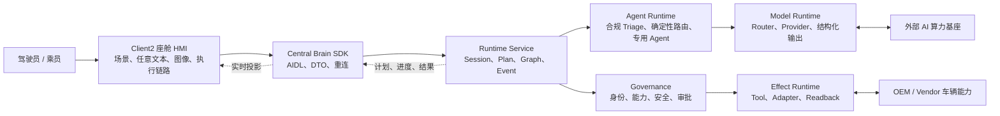

# CougarOS Central Brain

CougarOS Central Brain 是面向 Android 13 座舱域控制器的车载 AIOS 中枢。系统将语音和座舱图像转化为
受治理、可追踪、可审批、可核验的车辆动作。

## 软件架构

## 权威文档

仓库维护三份根级生产软件权威文档；模块级实现细节统一由软件开发文档索引到
`docs/modules/`，不再新增平级专题文档：

| 文档 | 内容 |
| --- | --- |
| [生产软件需求文档](docs/CENTRAL_BRAIN_REQUIREMENTS.md) | 全部 141 个工作包、Req ID、需求说明、验收和进度状态 |
| [生产软件架构文档](docs/CENTRAL_BRAIN_SOFTWARE_ARCHITECTURE.md) | 自上而下的部署、分层、模块、数据、流程、安全和恢复架构 |
| [生产软件开发文档](docs/CENTRAL_BRAIN_SOFTWARE_DEVELOPMENT.md) | 公共开发规则、对外接口摘要，以及 17 份模块详设入口 |

## 当前状态

| 范围 | 状态 |
| --- | --- |
| 仓库软件合同与主模块 | 已形成 |
| P4-R7/P4-R8/P4-R9/P4-R10/P4-R11 HMI 与模型链路 | 当前 Draft 分支已包含厂商三 APK 架构恢复、双入口、任意文本、吸烟合规多 Agent 与 TY1100 vLLM 链路；RenderService 已回到原版只读基线，物理触摸旋转仍需目标硬件复验 |
| Client2 集成合同 | `0.23.0`，保留 P4-R9 “检测吸烟”图文入口并完成 P4-R11 厂商渲染边界恢复 |
| Scenario Catalog | 6 个版本化场景；吸烟检测场景为无 Tool/Effect 的 response-only DAG |
| 唯一原型模型环境 | [TY1100 vLLM 原型说明](central-brain/integration/ty1100-vllm-prototype/README.md)：Android 实机经受控桥接访问 `Qwen3.5-9B-AWQ`，文字和单图已验证；WSL Ollama 不再用于后续原型验收 |
| Model Prompt API | vLLM Debug Provider 与生产 OpenClaw 路径接收受控 `CockpitModelPrompt`，Provider 不获得执行权限 |
| 座舱吸烟合规 Agent | 确定性 Router、版本化 Agent 指令、五字段严格校验已形成；[720p/24-token 快速通道 + 原图回退评测](central-brain/evaluation/smoking-detection/README.md)已请求级关闭 thinking，100 张正样本召回率 99%、P95 2,615.207 ms；阴性集与目标摄像头验收待完成 |
| 任意文本动作权限 | 当前仅投影模型回复与白名单候选，动态 Tool/Effect 编译保持关闭 |
| OpenClaw 生产以太网文字/图片接口 | [客户 ETH 联调说明与 Java/Python 示例](central-brain/integration/openclaw-eth-client/README.md)已形成，release Provider 待实现与准入 |
| 生产配置隔离 | Release 仍为 `target_openclaw_transitional`、`ws://169.254.208.110:18789`、协议 3、路由禁用；本次未修改 |
| 真实 Vehicle/NPU Adapter | 外部接口阻塞 |
| 生产签名、隐私、安全和目标资格 | 待 owner 与目标证据 |
| `production_ready` | `false` |
| `target_hardware_validated` | `false` |

所有局部完成状态和剩余项以需求文档为准。软件检查、界面演示或局部设备证据不能替代量产验收。
