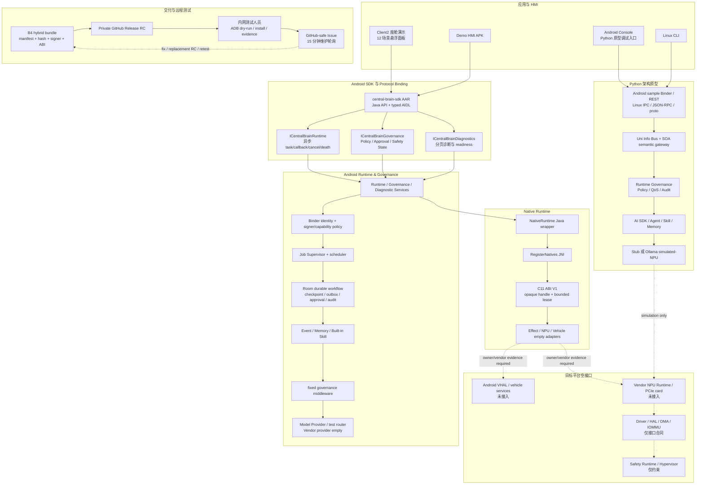

# CougarOS Central Brain

CougarOS 是面向黑盒 Android 13 座舱域控制器的车载中央大脑工程。仓库同时保留两条相互约束、
但部署目的不同的实现路径：

1. **Android 实际工程路径**：以 Java、AIDL、C/JNI 为主，交付 SDK AAR、Native AAR、Runtime APK、
   Demo APK 和可选 Client2 演示 APK。
2. **Python 架构原型路径**：验证 AI SDK、Uni Info Bus、SOA、Runtime & Governance、Protocol Binding、
   Linux 同步样例和 Ollama simulated-NPU，不作为量产 Android Runtime。

用户提供的架构图是需求基线，不是示意图。所有实现、接口、交付和偏差必须映射到明确的 Req ID；
核心映射覆盖 `APP-004`、`XSC-001..006`、`NV-F-001/011/012`、`NV-G-003/005/006/007`、
`NV-P-002`、`KH-003/006`、`DEL-001/003/004/005`。

## 当前状态

更新时间：2026-07-14

| 项目 | 当前值 | 含义 |
| --- | --- | --- |
| 目标平台 | Android 13 / API 33 黑盒座舱控制器 | 只依赖普通 APK 安装和公开 Android/NDK API |
| Android 软件交付 | `hybrid_software_handoff_ready=true` | B0-B4 C/Java 软件交付已形成 |
| 模拟器验收 | `b3_emulator_acceptance_complete=true` | API 33 x86_64 应用层、Binder、Native 和恢复测试通过 |
| GitHub 闭环 | `github_repository_configured=true`、`github_issue_intake_active=true` | Private Release、Issue Form、Actions 和 15 分钟轮询已激活 |
| 当前测试版本 | `android13-hwtest-v0.5.0-rc.2` | RC1 已撤回且没有 Release 资产，只允许使用 RC2 |
| 物理控制器证据 | `physical_controller_evidence_available=false` | 尚无目标内网 Android 13 设备证据 |
| 生产状态 | `production_ready=false` | 生产签名、系统 owner、后台策略和 vendor contract 未关闭 |
| 目标硬件状态 | `target_hardware_validated=false` | PCIe NPU、VHAL、车辆总线和 Driver/HAL 未验证 |
| 新增 Driver/HAL | `driver_development_triggered=false` | 当前能力缺口只记录接口，不新增推测性驱动代码 |
| 虚拟化开发 | `virtualization_development_triggered=false` | 只记录 ASIL/QM 和跨域接口约束，不开发 Hypervisor |

权威进度见 [路线图](docs/CENTRAL_BRAIN_ROADMAP.md)，当前偏差见
[架构偏差表](docs/CENTRAL_BRAIN_ARCHITECTURE_DEVIATIONS.md)，未关闭问题见
[架构疑点表](docs/CENTRAL_BRAIN_ARCHITECTURE_ISSUES.md)。

## README 维护规则

本文件是仓库级技术架构索引。以下变化必须同步更新本文件：

- 新增、删除或重命名正式模块、Android Gradle module、协议绑定、契约或交付产物；
- 修改应用到 Runtime 的调用链、语言职责、硬件边界、部署方式或安全门禁；
- 发布新的硬件测试 RC、关闭或新增关键 blocker；
- 合入影响架构、接口或交付的提交后，在“近期修改日志”保留最近记录。

提交前运行：

```bash
bash tools/check_central_brain_root_readme.sh
bash tools/check_central_brain_software_detailed_design.sh
```

上述检查已接入 Android 演化门禁和 GitHub Actions。

## 软件总架构



### 两条工程路径的关系

| 路径 | 目的 | 允许的实现 | 不允许的解释 |
| --- | --- | --- | --- |
| Android 实际工程 | 在无厂商源码、无私有 SDK 的 Android 13 设备上形成可安装应用层 Runtime | Java/AIDL、Room、C/JNI、普通 APK/AAR、公开 Android API | 不能声称已修改 Android Framework、VHAL、BSP 或厂商服务 |
| Python 架构原型 | 快速验证语义接口、治理、协议绑定和 simulated-NPU | Python、REST、Unix socket、JSON-RPC、Ollama debug adapter | 不能替代 Android Runtime，也不能作为真实 NPU 或量产性能证据 |
| Client2 APK patch | 在真实座舱 UI 壳中验证 SDK/Binder 交互 | 隔离 patch、资源/smali、`classes2.dex` Binder bridge | 不修改原始 APK、RenderService 或 Unity/Tuanjie 资产 |
| 目标硬件空接口 | 固定未来 Vendor NPU/VHAL/Driver/HAL 接入责任 | 接口、状态机、错误码、owner checklist、fail-closed gate | 不扫描 device node，不实现推测性 ioctl、DMA、共享内存或虚拟化 |

## 核心调用链

### Android 任务执行

```text
Client2 / Demo HMI
  -> CentralBrainClient
  -> ICentralBrainRuntime.submitAgentTask(AgentTaskRequest, callback)
  -> Binder caller identity + package/current-signer capability policy
  -> DurableTaskRepository + JobSupervisor
  -> deterministic task stub
  -> TaskUpdate / TaskResult / TaskFailure callback
```

Runtime 进程死亡、callback death、cancel/completion race 和 Client2 重连已有 API 33 测试。生产 Effect、
Scheduler、Model Router、Governance middleware、Vendor NPU 和车辆动作尚未接入该 production task path；
Effect 和硬件路径继续由 activation gate 阻断。

### Native 生命周期

```text
CentralBrainRuntimeApplication
  -> process-owned NativeRuntimeProcess
  -> NativeRuntime Java wrapper
  -> RegisterNatives JNI bridge
  -> central_brain_native C ABI V1
  -> readiness / bounded slot lease / deterministic status
```

C 层不拥有 Binder identity、Policy、Room 或业务编排，不执行文件/网络 I/O，也不访问 NPU、VHAL、
device node、DMA 或 vendor SDK。

### Python 语义原型

```text
Android Console / Linux CLI / Linux IPC or JSON-RPC client
  -> Protocol Binding
  -> mock_npu_service semantic gateway
  -> Uni Info Bus / SOA / Runtime Governance
  -> AI SDK / Agent / Skill / Memory
  -> deterministic stub or Ollama simulated-NPU
```

### 远程硬件测试

```text
controlled workstation package
  -> immutable Private Release + external SHA-256
  -> target tester verifies and runs ADB locally
  -> github-safe summary only
  -> structured Issue
  -> 15-minute maintenance poll
  -> Req-ID fix / PR / replacement RC
  -> target retest before close
```

GitHub 不连接目标 ADB。原始 serial、fingerprint、target-input、签名材料、未审查日志以及用户、模型、
Memory、token、车辆 payload 均不得上传。

## 仓库目录与模块映射

### 顶层目录

| 路径 | 对应模块 | 说明 |
| --- | --- | --- |
| `.github/` | 远程测试控制面 | Hardware-test Issue Form、标签约定和只读 Actions 合同门禁 |
| `.githooks/pre-push` | 发布历史保护 | 阻止 internal ref、错误 main 来源和污染历史推送 |
| `apk-labs/client2-central-brain/` | Client2 Binder 演示 | 隔离 APK patch、悬浮面板、SDK bridge、构建和验证脚本 |
| `central-brain/` | 中央大脑源码与合同 | Android Runtime、Python 原型、bindings、delivery、deploy |
| `docs/CENTRAL_BRAIN_*` | 架构与验收文档 | 需求、接口、偏差、问题、部署、NPU、Driver/HAL、验收证据 |
| `tools/` | 构建、安装和门禁 | Android/Python/Linux 构建、静态检查、smoke、设备验收和打包 |

### Android 实际工程

Android Gradle 根目录为 `central-brain/android-runtime/`。

| Gradle module | 关键文件或包 | 职责 | 产物 |
| --- | --- | --- | --- |
| `central-brain-sdk` | `CentralBrainSdk.java`、`CentralBrainClient.java`、`CentralBrainGovernanceClient.java`、`src/main/aidl/` | 对应用公开 typed/async Runtime、Governance、Diagnostics API | `central-brain-sdk-debug.aar` |
| `runtime-service` | `CentralBrainRuntimeService.java`、`CentralBrainGovernanceService.java`、`CentralBrainDiagnosticService.java` | 三个 signature-permission Binder Service 和进程级 Runtime owner | `runtime-service-debug.apk` |
| `native-runtime` | `central_brain_native.h/.c`、`central_brain_jni.c`、`NativeRuntime.java` | C11 ABI V1、JNI、arm64/x86_64 bounded lifecycle | `native-runtime-debug.aar` |
| `demo-hmi` | `DemoActivity.java` | SDK/Binder 功能和治理验收界面 | `demo-hmi-debug.apk` |
| `policy-probe` | `CapabilityPolicyProbeActivity.java` | `testOnly`、DUMP-protected 负向策略探针 | 测试 APK，不属于生产交付 |

`runtime-service` 内部包按职责拆分：

| 包 | 代表文件 | 模块职责 |
| --- | --- | --- |
| `identity/`、`policy/` | `AndroidCallerIdentityResolver`、`CallerCapabilityPolicy` | Binder 身份、调用方 package/signer 和 default-deny capability |
| `supervisor/`、`scheduler/` | `JobSupervisor`、`InferenceResourceScheduler` | task 生命周期、优先级、deadline、quota 和资源准入 |
| `persistence/` | `CentralBrainDatabase`、`DurableTaskRepository`、`DurableEffectRepository` | Room checkpoint、approval、event cursor、outbox、audit 和重启恢复 |
| `governance/` | `ActionGovernancePolicy`、`FixedGovernanceMiddlewareChain` | Safety State、Policy、QoS、trace、output guard 和 audit |
| `effects/` | `EffectAdapterContract`、`EffectDeliveryActivationGate`、`EmptyEffectMaterialSource` | 真实动作前的 fail-closed activation 和空实现 |
| `model/` | `ModelProvider`、`DeterministicStubModelProvider`、`TestOnlyModelRouter` | 模型 provider 合同、确定性测试和测试路由 |
| `events/`、`memory/`、`skills/` | `BoundedEventRuntime`、`BoundedMemoryLifecycle`、`BoundedBuiltInSkillRuntime` | 有界 Event、Memory 和内置 Skill 软件基线 |
| `nativebridge/` | `NativeRuntimeProcess`、`NativeRuntimeProcessSnapshot` | Runtime 进程唯一 native handle 和只读 readiness |
| `acceptance/` | `RuntimeAcceptanceSnapshot` | 汇总软件 readiness，并保留生产/硬件 blocker |

### Client2 座舱演示

| 路径 | 职责 |
| --- | --- |
| `apk-labs/client2-central-brain/bridge/` | 编译进 `classes2.dex` 的 `Client2ScenarioBridge` 和 callback |
| `apk-labs/client2-central-brain/patches/` | 右侧约 1/3 半透明悬浮面板、12 个稳定场景按钮和 smali controller |
| `apk-labs/client2-central-brain/scripts/` | 从本地受控基线复制、patch、重建、签名和验证 |
| `tools/build_client2_central_brain_demo.sh` | 生成 Runtime 同 signer 的 debug APK |
| `tools/test_client2_central_brain_binder.sh` | API 33 真实按钮、Binder callback 和 UI reply 验收 |
| `tools/test_client2_central_brain_recovery.sh` | Runtime death、single-flight、重连和 Client2 重启矩阵 |

当前 Client2 不申请网络权限，不包含直接 HTTP fallback；所有 12 个场景通过公开 SDK/AIDL 进入
Runtime。原始 APK 和逆向基线只在本地作为受控输入，不进入 Git 发布历史。

### Python 架构原型

| 文件 | 对应架构模块 | 主要职责 |
| --- | --- | --- |
| `central-brain/backend/mock_npu_service.py` | Semantic Gateway | HTTP 路由入口，组合 UIB、SOA、Governance、Agent 和 NPU 状态 |
| `runtime_governance.py` | Runtime & Governance | Registry、Policy、QoS、lifecycle、audit 和迁移/部署 readiness |
| `ai_sdk.py`、`agent_scenarios.py` | AI SDK / Agent | task graph、Skill、Memory 和 12 场景编排 mock |
| `protocol_bindings.py` | Protocol Binding registry | Android Binder、Linux IPC、JSON-RPC/proto 和语义路径成熟度 |
| `native_adapters.py` | Native adapter registry | AIOS Kernel、SOA、Vehicle Signal、Model Runtime、Security/Policy adapter |
| `hardware_interfaces.py` | Hardware empty-interface | NPU、Vehicle、Camera/Audio/Sensor、Ethernet、Safety 的空方法和 owner gate |
| `vehicle_signals.py` | Vehicle Signal adapter | VSS-style signal catalog、只读桥激活和验证 envelope |
| `ollama_simulated_npu.py` | Model Runtime debug adapter | 调用本机 Ollama HTTP API，不接触 PCIe NPU 或 Driver/HAL |
| `delivery_readiness.py`、`prototype_readiness.py` | Delivery/observability | 汇总 Android/Linux binding、blocker 和原型成熟度 |

### Protocol Binding 与部署

| 路径 | 模块 | 状态 |
| --- | --- | --- |
| `central-brain/bindings/android/` | 第一阶段 Android Binder service/client sample | 原型样例，不是实际 `android-runtime` SDK |
| `central-brain/bindings/linux/ipc/` | Unix socket gateway、共享 Governance daemon/client | active sample |
| `central-brain/bindings/linux/grpc/` | 标准库 JSON-RPC 风格 server/client | active contract sample，当前不依赖 grpcio |
| `central-brain/bindings/linux/proto/` | `central_brain_gateway.proto` | protobuf/正式 RPC 迁移合同 |
| `central-brain/linux-cli/` | Linux 同步原型 CLI | 调用与 Android 原型一致的语义入口 |
| `central-brain/deploy/linux/` | systemd、环境模板、package profile | Python/Linux 原型交付，不是当前 Android B0-B5 前端范围 |

### 契约、交付和文档

| 路径 | 关键文件 | 用途 |
| --- | --- | --- |
| `central-brain/contracts/` | `central_brain_api.json` | Python 语义 API 主合同 |
|  | `central_brain_android_b3_blackbox_acceptance.json` | 黑盒 Android 13 应用层验收合同 |
|  | `central_brain_android_r7c_acceptance.json` | Client2/Runtime fault-recovery 场景合同 |
|  | `central_brain_github_remote_testing.json` | Release、Issue、证据和轮询状态合同 |
| `central-brain/delivery/android-hybrid/` | delivery profile、target-input template、README | 五项 C/Java artifact 的 B4/B5 交付定义 |
| `central-brain/delivery/android/` | 历史 R7D no-native profile | 保留历史证据，不被 B4 hybrid 结果改写 |
| `docs/` | 需求、接口、偏差、问题、平台边界和验收文档 | 架构决策和 Req ID 权威记录 |

### 工具分组

| 工具族 | 代表脚本 | 作用 |
| --- | --- | --- |
| Android 构建 | `build_central_brain_android_runtime.sh`、`build_client2_central_brain_demo.sh` | 构建 AAR/APK 和 Client2 patch |
| Android 安装 | `install_central_brain_android_runtime.sh`、`install_central_brain_android_hybrid_delivery.sh` | 默认门禁、显式安装和固定顺序 |
| Android 演化门禁 | `check_central_brain_android_runtime_evolution.sh` | 汇总 R1-R7、B0-B5 静态和单元门禁 |
| Native 验证 | `test_central_brain_native_runtime_host.sh`、`verify_central_brain_native_runtime_aar.sh` | ASan/UBSan、ABI、ELF、导出和 hardening |
| 黑盒验收 | `preflight_central_brain_android13_blackbox.sh`、`test_central_brain_android_blackbox_acceptance.sh` | API/ABI/signer/PackageManager/恢复证据 |
| 交付打包 | `package_central_brain_android_hybrid_delivery.sh` | manifest、SHA-256、signer、ABI 和可复现 tar |
| Python smoke | `smoke_central_brain_semantic_gateway.sh`、`smoke_central_brain_linux_ipc.sh` | UIB/SOA/Governance/binding 回归 |
| GitHub 远程闭环 | `run_central_brain_android_remote_acceptance.sh`、`check_central_brain_github_remote_testing.sh` | 目标侧 dry-run、脱敏证据和 B5 合同 |
| 发布保护 | `check_central_brain_github_publication_tree.sh`、`.githooks/pre-push` | 检查完整可达历史并限制发布 ref |
| README 门禁 | `check_central_brain_root_readme.sh` | 检查模块映射、状态边界和变更日志 |

## 语言与所有权边界

| 语言或格式 | 所有权 | 禁止承担的职责 |
| --- | --- | --- |
| Java | Android lifecycle、Binder identity、Policy、Room、调度、错误和 UI | 不直接访问 PCIe NPU、device node 或车辆总线 |
| AIDL | App/SDK 与 Runtime/Governance/Diagnostics 的 typed async contract | 不承载未经治理的 raw hardware channel |
| C11 | 平台中立 native lifecycle、ABI、bounded provider slot | 不拥有 Binder identity、业务 Policy、Room 或 target vendor contract |
| JNI | Java 与 C ABI 的窄桥接 | 不缓存 `JNIEnv*`，不形成第二套 Runtime |
| Python | 架构语义、mock、Linux sample、Ollama debug adapter | 不作为量产 Android Runtime 或真 NPU 证据 |
| Shell/JSON/Proto | 构建、验收、发布、契约和部署自动化 | 不绕过安装、签名、隐私和硬件 activation gate |
| XML/smali | 隔离 Client2 APK UI patch | 不修改原始 APK、RenderService、Unity/Tuanjie 资产或系统软件 |

## Android 交付产物

B4 hybrid profile 固定五项产物：

| 顺序 | 产物 | 包名或用途 | Native payload |
| --- | --- | --- | --- |
| 不安装 | `native-runtime-debug.aar` | C ABI/JNI 集成输入 | 仅 `arm64-v8a`、`x86_64` |
| 不安装 | `central-brain-sdk-debug.aar` | 应用公开 SDK/AIDL | 禁止 |
| 1 | `runtime-service-debug.apk` | `com.centralbrain.runtime` | 仅 `arm64-v8a`、`x86_64` |
| 2 | `demo-hmi-debug.apk` | `com.centralbrain.demo` | 禁止 |
| 3，可选 | `client2-central-brain.debug.apk` | `com.tuanjie.urasclient2` | 禁止新增 native payload |

Runtime、Demo 和 Client2 必须属于同一 signer cohort。当前产物是 debug 签名，只用于测试；生产签名、
升级策略和 Client2/RenderService 信任由目标系统 owner 决定。

## 构建与验证入口

### Android 实际工程

```bash
bash tools/build_central_brain_android_runtime.sh
bash tools/check_central_brain_android_runtime_evolution.sh
```

构建 Client2 Binder 演示：

```bash
bash tools/build_client2_central_brain_demo.sh
bash tools/check_client2_central_brain_demo.sh
```

生成 B4/B5 hybrid 交付包：

```bash
bash tools/package_central_brain_android_hybrid_delivery.sh
```

安装和目标侧验收必须遵循
[Android 13 安装与使用指南](docs/CENTRAL_BRAIN_ANDROID13_HYBRID_INSTALLATION_AND_USAGE.md) 和
[GitHub 远程硬件测试指南](docs/CENTRAL_BRAIN_GITHUB_REMOTE_HARDWARE_TESTING.md)。

### Python 原型

```bash
bash tools/run_central_brain_backend.sh
bash tools/smoke_central_brain_semantic_gateway.sh
```

使用本机 Ollama 作为 simulated-NPU：

```bash
CENTRAL_BRAIN_SIMULATED_NPU_BACKEND=ollama \
CENTRAL_BRAIN_OLLAMA_MODEL=qwen3.5:27b-optimized \
bash tools/run_central_brain_backend.sh
```

详细命令见 [Python 原型使用说明](docs/CENTRAL_BRAIN_PROTOTYPE_USAGE.md)。

## 安全和集成边界

- 不修改厂商 Android Framework、已刷机系统、BSP、VHAL 或私有 SDK。
- 不开发 Hypervisor 或跨 VM 共享内存；只维护部署与 Safety 约束。
- Driver/HAL 仅在公开 Android/Linux 能力无法满足且目标接口明确时增加最小实现。
- Vendor NPU、VHAL、Vehicle bus、Camera/Audio/Sensor、Ethernet/SOME-IP/DDS/TSN 和 Safety Runtime
  当前均为 fail-closed empty interface。
- `runtime.npu` 或 Ollama 返回成功只证明软件模拟链路，不证明 PCIe NPU、GPU 性能或目标硬件通过。
- 模拟器或物理设备上的 debug signer 和普通 `/data/app` 应用层证据不能关闭生产签名、后台存活、
  RenderService trust、vendor ABI、NPU/VHAL 或整机硬件 blocker。

当前两个 GitHub 控制面阻塞项：测试人员用户名/access list 未提供；当前 Private 仓库套餐无法启用
所需服务端 branch protection。tracked pre-push hook 和 Actions 只是临时风险控制，不等价于服务端保护。

## 关键架构文档

| 文档 | 内容 |
| --- | --- |
| [产品设计](docs/CENTRAL_BRAIN_PRODUCT_DESIGN.md) | 用户、场景、产品边界和参考能力 |
| [软件总架构](docs/CENTRAL_BRAIN_SOFTWARE_ARCHITECTURE.md) | 架构图分层、职责和目标拓扑 |
| [软件详细设计](docs/CENTRAL_BRAIN_SOFTWARE_DETAILED_DESIGN.md) | Android、C/JNI、Room、Python、Binding 各模块的实现级接口、状态机和扩展规则 |
| [需求拆解](docs/CENTRAL_BRAIN_REQUIREMENTS_BREAKDOWN.md) | Req ID 与任务拆解 |
| [架构需求基线](docs/CENTRAL_BRAIN_ARCHITECTURE_REQUIREMENTS.md) | 每个增量的不可变需求和退出条件 |
| [接口设计](docs/CENTRAL_BRAIN_INTERFACE_DESIGN.md) | Envelope、UIB、SOA、AIDL、Runtime 和硬件接口 |
| [Python 模块接口图](docs/CENTRAL_BRAIN_PROTOTYPE_MODULE_INTERFACE_MAP.md) | Python 原型模块、接口族和调用链 |
| [Android Runtime 演化计划](docs/CENTRAL_BRAIN_ANDROID_RUNTIME_EVOLUTION_PLAN.md) | R0-R7 Android 软件演进 |
| [黑盒 Android 13 工程计划](docs/CENTRAL_BRAIN_BLACKBOX_ANDROID13_ENGINEERING_PLAN.md) | B0-B5 C/Java 实际工程范围 |
| [物理 Android 13 测试报告](docs/CENTRAL_BRAIN_ANDROID13_PHYSICAL_TARGET_TEST_REPORT.md) | WSL/Windows ADB、Runtime/Demo 真机证据、Client2 signer blocker 和修复记录 |
| [Native C ABI](docs/CENTRAL_BRAIN_NATIVE_RUNTIME_C_ABI.md) | C11 ABI V1、JNI 和生命周期 |
| [NPU Runtime 接口](docs/CENTRAL_BRAIN_NPU_RUNTIME_INTERFACE.md) | 未来 PCIe NPU adapter/driver 合同 |
| [Driver/HAL 支持矩阵](docs/CENTRAL_BRAIN_DRIVER_INTERFACE_SUPPORT.md) | Android/Linux 能力、缺口和新增开发量 |
| [平台差异](docs/CENTRAL_BRAIN_PLATFORM_DELTA.md) | Android 与 Linux 原型交付差异 |
| [模块 Use Case 图](docs/CENTRAL_BRAIN_MODULE_USE_CASE_DIAGRAM.md) | 系统参与者和模块调用关系 |

## 本地受控输入与非发布内容

以下路径可能存在于开发工作区，但不属于 GitHub 正式源码树，也不应被 `git add -A` 纳入发布：

| 本地路径 | 用途 |
| --- | --- |
| `apks/original/` | 原始 Client/Service APK，只用于指纹和隔离 patch 输入 |
| `reverse/` | apktool/JADX/资源逆向工作目录 |
| `builds/` | APK/AAR、bundle、签名输出和临时工作目录 |
| `logs/` | 本地模拟器、ADB、截图和调试证据 |
| `.tools/`、`env.sh` | 本地自包含工具链和环境配置 |

正式仓库只跟踪 `apk-labs/client2-central-brain/` 中的可复现 patch、bridge 和脚本，不跟踪原始 APK、
逆向产物、生成包、密钥或原始设备证据。

## 近期修改日志

该表记录影响架构、接口、交付或远程测试闭环的近期修改。普通格式化和生成物变化不进入此表。

| 日期 | 提交或版本 | 修改内容 | 状态边界 |
| --- | --- | --- | --- |
| 2026-07-14 | 当前变更 | Runtime/Demo 首轮物理 API 33 ARM64 验收；修复 Windows ADB CRLF 与嵌套 ADB 选择 | Client2 signer blocked；production/NPU/hardware false |
| 2026-07-12 | 当前变更 | 新增面向软件工程师的模块级详设、源码一致性门禁和开发扩展步骤 | 仅文档与门禁，不启用 Scheduler、Model、Effect 或硬件 |
| 2026-07-12 | 当前变更 | 根 README 升级为仓库级技术架构、模块文件映射和维护门禁 | 仅文档与门禁，不改变 Runtime/hardware 状态 |
| 2026-07-12 | [`5708dfa6`](https://github.com/LucasWEIchen/CougarOS/commit/5708dfa62d91624e9fe81e94077e8b630cb3d70b) | 首次 15 分钟 Issue 轮询验证经 PR #2 合入，Issue #1 转入 `state/retest` | `CONTROL_PLANE_ONLY`，无物理证据 |
| 2026-07-12 | [`6ca306f4`](https://github.com/LucasWEIchen/CougarOS/commit/6ca306f4bc3adf65111969e4748a8111edec5317) | 激活 Private CougarOS remote、labels、Actions、pre-push guard 和 RC2 | production/hardware 仍为 false |
| 2026-07-12 | `android13-hwtest-v0.5.0-rc.2` | 发布首个可测试 B4 hybrid bundle，修复 portable `.sha256` | RC1 撤回且无 Release 资产 |
| 2026-07-12 | [`909dfd83`](https://github.com/LucasWEIchen/CougarOS/commit/909dfd83d4522a5663c901c231ca3588e102aad6) | 新增 B5 GitHub Release、Issue Form、脱敏证据和远程验收合同 | GitHub 不连接目标 ADB |
| 2026-07-12 | [`74b71868`](https://github.com/LucasWEIchen/CougarOS/commit/74b71868) | 完成 B4 五项 C/Java hybrid 软件交付和可复现打包 | `hybrid_software_handoff_ready=true` |
| 2026-07-12 | [`c7e0c9e6`](https://github.com/LucasWEIchen/CougarOS/commit/c7e0c9e6) | 完成 B3 API 33 黑盒 preflight、signer guard 和应用层验收 | 仅模拟器证据 |
| 2026-07-12 | [`e66b09e4`](https://github.com/LucasWEIchen/CougarOS/commit/e66b09e4) | B2 Native Runtime 接入 Runtime 进程、dumpsys 和 Diagnostics | native dispatch/hardware false |
| 2026-07-12 | [`b2abc1f8`](https://github.com/LucasWEIchen/CougarOS/commit/b2abc1f8) | B1 C11 ABI V1、JNI、双 ABI AAR 和 host sanitizer 验证 | Vendor NPU provider empty |
| 2026-07-12 | [`78618a7b`](https://github.com/LucasWEIchen/CougarOS/commit/78618a7b) | R7D Android 软件 handoff、manifest、signer 和 rollback 工具 | 七项生产/硬件 blocker 保留 |
| 2026-07-12 | [`3daaede5`](https://github.com/LucasWEIchen/CougarOS/commit/3daaede5) | R7C Client2/Runtime fault-recovery 验收矩阵 | API 33 应用集成完成 |
| 2026-07-12 | [`068eb1b1`](https://github.com/LucasWEIchen/CougarOS/commit/068eb1b1) | Client2 从临时 HTTP 迁移到 SDK/typed Binder | APK 无 INTERNET/cleartext fallback |
