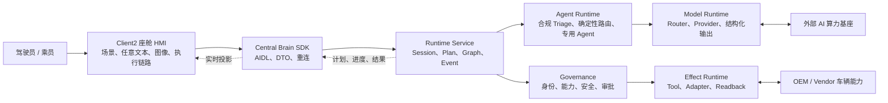

# CougarOS Central Brain

CougarOS Central Brain 是面向 Android 13 座舱域控制器的车载 AIOS 中枢。系统将语音和座舱图像转化为
受治理、可追踪、可审批、可核验的车辆动作。

## 软件架构

## 权威文档

仓库维护三份根级生产软件权威文档；模块级实现细节统一由软件开发文档索引到
`docs/modules/`，不再新增平级专题文档：

| 文档 | 内容 |
| --- | --- |
| [生产软件需求文档](docs/CENTRAL_BRAIN_REQUIREMENTS.md) | 全部生产 Req ID、工作包、需求说明、验收和进度状态 |
| [生产软件架构文档](docs/CENTRAL_BRAIN_SOFTWARE_ARCHITECTURE.md) | 自上而下的部署、分层、模块、数据、流程、安全和恢复架构 |
| [生产软件开发文档](docs/CENTRAL_BRAIN_SOFTWARE_DEVELOPMENT.md) | 公共开发规则、对外接口摘要，以及 17 份模块详设入口 |

## 当前状态

| 范围 | 状态 |
| --- | --- |
| 仓库软件合同与主模块 | 已形成 |
| P4-R7/P4-R8/P4-R9/P4-R10/P4-R11/P4-R13 HMI 与模型链路 | 当前 Draft 分支已包含厂商三 APK 架构恢复、双入口、任意文本、吸烟合规多 Agent 与 TY1100 vLLM 链路；生产板直连模型集成已验证，RenderService 保持原版只读基线，物理触摸旋转仍需正式验收 |
| Client2 集成合同 | `0.23.0`，保留 P4-R9 “检测吸烟”图文入口并完成 P4-R11 厂商渲染边界恢复 |
| Scenario Catalog | 6 个版本化场景；吸烟检测场景为无 Tool/Effect 的 response-only DAG |
| 当前生产目标模型环境 | [TY1100 生产以太网接口详设](docs/modules/11b-vllm-production-ethernet-api.md)：Android `169.254.202.100` 直连 TY1100 `169.254.202.110:8000`；当前唯一模型为 `Qwen3.5-2B-AWQ`，通用/吸烟逻辑路由分别保留 8192/4096 token 上限，强制身份检查、预热且不静默 fallback |
| Model Prompt API | 直连 vLLM Provider 接收受控 `CockpitModelPrompt`，支持文字与单帧图文输入；Provider 不获得执行权限 |
| 座舱吸烟合规 Agent | 确定性 Agent Router、Model Profile Router、版本化指令、五字段严格校验和三分支条件 Schema 已形成；[正反例平衡评测及逐项优化证据](central-brain/evaluation/smoking-detection/README.md)覆盖固定 200 张。TY1100 2B 原型保持 `longest_edge=786432`，prefix caching 因 0 命中已关闭；快速通道用保留 `]` 的 stop 扩展把 completion 从 12 降到 11 token，测试集准确率仍为 100%，端到端均值 1407 ms、P95 1898 ms。Android 13 `testboard` 单场景实链路为 1073 ms；模型自报置信度仍不可校准，目标摄像头、并发和长稳验收待完成 |
| 任意文本动作权限 | 当前仅投影模型回复与白名单候选，动态 Tool/Effect 编译保持关闭 |
| Android 生产板直连 TY1100 | [P4-R13 需求](docs/CENTRAL_BRAIN_REQUIREMENTS.md)和[机器可读合同](central-brain/contracts/central_brain_android_ty1100_ethernet_target_v1.json)已记录真实文字/图文链路、APK 摘要和局部时延；未使用 ADB reverse，未修改 TY1100 |
| 发布配置边界 | `target_ty1100_vllm_ethernet` 已完成目标集成构建与安装；release Provider 激活、生产签名、安全/隐私和长稳准入仍未完成 |
| 真实 Vehicle/NPU Adapter | 外部接口阻塞 |
| 生产签名、隐私、安全和目标资格 | 待 owner 与目标证据 |
| `production_ready` | `false` |
| `target_hardware_validated` | `false` |

所有局部完成状态和剩余项以需求文档为准。软件检查、界面演示或局部设备证据不能替代量产验收。
