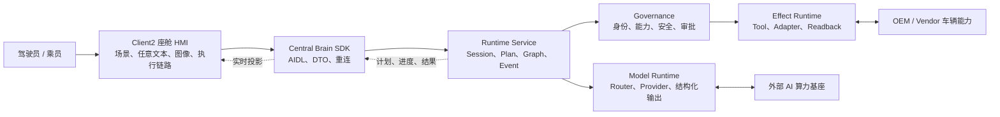

# CougarOS Central Brain

CougarOS Central Brain 是面向 Android 13 座舱域控制器的车载 AIOS 中枢。系统将语音和座舱图像转化为
受治理、可追踪、可审批、可核验的车辆动作。

## 软件架构

## 权威文档

仓库维护三份根级生产软件权威文档；模块级实现细节统一由软件开发文档索引到
`docs/modules/`，不再新增平级专题文档：

| 文档 | 内容 |
| --- | --- |
| [生产软件需求文档](docs/CENTRAL_BRAIN_REQUIREMENTS.md) | 全部 140 个工作包、Req ID、需求说明、验收和进度状态 |
| [生产软件架构文档](docs/CENTRAL_BRAIN_SOFTWARE_ARCHITECTURE.md) | 自上而下的部署、分层、模块、数据、流程、安全和恢复架构 |
| [生产软件开发文档](docs/CENTRAL_BRAIN_SOFTWARE_DEVELOPMENT.md) | 公共开发规则、对外接口摘要，以及 17 份模块详设入口 |

## 当前状态

| 范围 | 状态 |
| --- | --- |
| 仓库软件合同与主模块 | 已形成 |
| P4-R7/P4-R8 HMI 实现 | 当前 Draft 分支已包含渲染修订、双入口和任意文本模型链路，尚未进入 `main` |
| Client2 集成合同 | `0.21.0`，新增 P4-R8 任意文本输入与第五个场景资产 |
| Scenario Catalog | 5 个版本化场景；任意文本场景当前只产生回复和白名单候选动作 |
| Ollama 开发投影 | AIDL v3 已在 Android 13 ARM64 上完成文字请求与模型回复投影 |
| Model Prompt API | Ollama/OpenClaw 统一接收受控 `CockpitModelPrompt`，Provider 不获得执行权限 |
| 任意文本动作权限 | 当前仅投影模型回复与白名单候选，动态 Tool/Effect 编译保持关闭 |
| OpenClaw 生产以太网文字/图片接口 | [客户 ETH 联调说明与 Java/Python 示例](central-brain/integration/openclaw-eth-client/README.md)已形成，release Provider 待实现与准入 |
| 真实 Vehicle/NPU Adapter | 外部接口阻塞 |
| 生产签名、隐私、安全和目标资格 | 待 owner 与目标证据 |
| `production_ready` | `false` |
| `target_hardware_validated` | `false` |

所有局部完成状态和剩余项以需求文档为准。软件检查、界面演示或局部设备证据不能替代量产验收。
