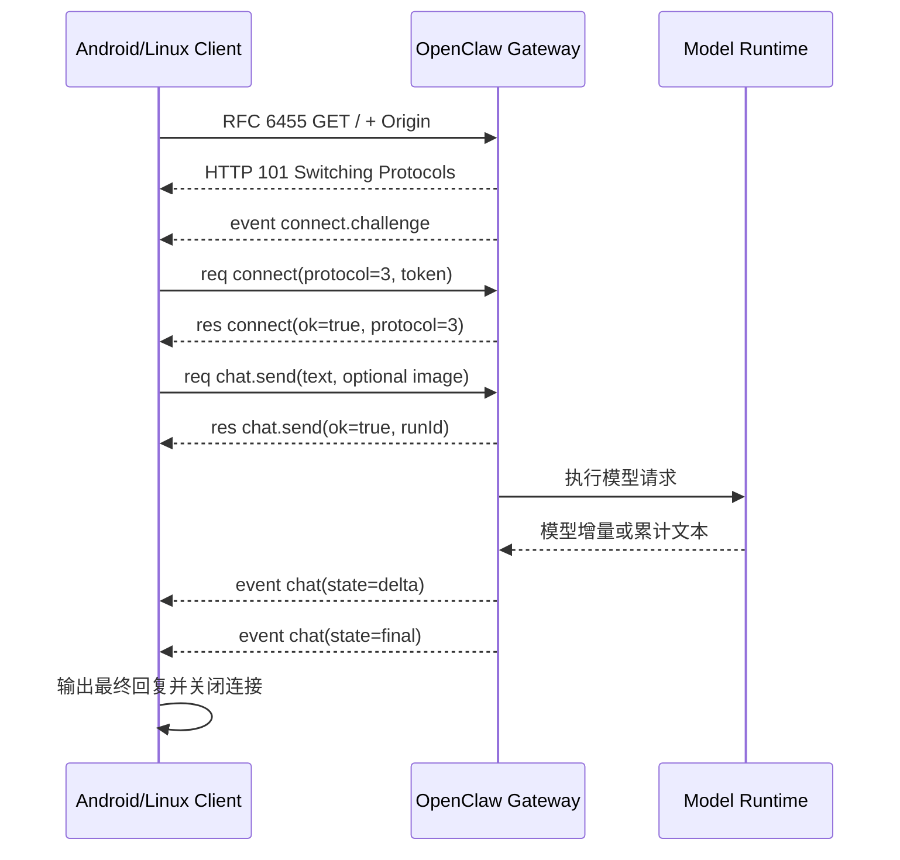

# OpenClaw 外置算力节点以太网接口调用说明

版本：1.0

适用对象：负责外置 NPU 算力节点、Android 客户端或 Linux 客户端联调的软件工程师。

本文只描述客户端如何经以太网访问 OpenClaw，不包含任何具体业务、上层任务编排或末端设备控制逻辑。

参考实现：

- [Android Java 客户端](examples/android/OpenClawEthClient.java)
- [Linux Python 客户端](examples/linux/openclaw_eth_client.py)
- [Linux Python 依赖](examples/linux/requirements.txt)

## 1. 接口结论

OpenClaw 的程序调用入口是 WebSocket RPC，不是 `/chat` 网页：

| 参数 | 生产联调值 | 说明 |
| --- | --- | --- |
| NPU IPv4 | `169.254.208.110` | 外置算力节点的链路本地地址 |
| TCP 端口 | `18789` | OpenClaw Gateway 监听端口 |
| WebSocket URI | `ws://169.254.208.110:18789/` | Java/Python 程序必须连接此地址 |
| HTTP 控制页 | `http://169.254.208.110:18789/chat` | 只用于浏览器人工检查，不是模型 RPC |
| WebSocket Origin | `http://169.254.208.110:18789` | 握手时发送，用于 Gateway 来源校验 |
| OpenClaw 协议 | `3` | `connect.minProtocol` 和 `maxProtocol` 均为 `3` |
| 认证方式 | `connect.params.auth.token` | Token 放在认证帧中，不放在 WebSocket URI 中 |
| 文本调用 | `chat.send` | `message` 为 UTF-8 文字 |
| 多模态调用 | `chat.send` | 文字与图片必须位于同一个 RPC 帧 |
| 图片格式 | `image/png`、`image/jpeg` | 每次最多一张 |
| 图片原始字节上限 | `6 MiB` | 编码前检查 |
| 多模态 JSON 帧上限 | `8,500,000 bytes` | Base64 编码后再次检查 |
| 连接超时建议 | `3 s` | 只约束 TCP/WebSocket 建链 |
| 单次推理总超时建议 | `120 s` | 包含认证、排队和模型推理 |

> 当前接口使用明文 `ws://`。它只适用于隔离、受控的设备以太网链路。不得把该端口桥接到办公网、互联网或不可信网段。跨越非受控网络时必须由部署方提供 `wss://`、证书校验和新的凭据策略。

## 2. 网络前置条件

### 2.1 IPv4 与路由

客户端以太网口必须配置为与 NPU 同一链路本地网段中的不同地址。例如：

```text
NPU:    169.254.208.110/16
Client: 169.254.208.20/16
```

该点对点链路通常不需要默认网关。不得把客户端地址也配置成 `169.254.208.110`。

Linux 可用以下命令检查链路；接口名以实际设备为准：

```bash
ip -br link
ip -br address
ip route get 169.254.208.110
ping -c 3 169.254.208.110
nc -vz -w 3 169.254.208.110 18789
```

期望结果：

1. 以太网接口为 `UP`，并具有正确的 IPv4 地址和 `/16` 前缀。
2. `ip route get` 显示流量从外置 NPU 所在的物理以太网口发出。
3. `ping` 能收到响应；若设备禁用了 ICMP，可继续以 TCP 检查为准。
4. `nc` 显示 TCP 18789 可连接。

只打开控制页可用于检查 Gateway 是否存活：

```bash
curl --noproxy '*' --connect-timeout 3 \
  -I http://169.254.208.110:18789/chat
```

HTTP 页面可访问只代表 TCP/HTTP 服务可用，不代表 WebSocket 协议、Token 或模型推理已经通过。

### 2.2 Android 网络选择

Android 设备可能同时启用 Wi-Fi、蜂窝和以太网。应用不能假设系统默认网络就是外置 NPU 所在网络，必须：

1. 通过 `ConnectivityManager` 请求 `TRANSPORT_ETHERNET`。
2. 在 `NetworkCallback.onAvailable(Network)` 中获得目标 `Network`。
3. 使用 `network.getSocketFactory()` 创建 OpenClaw 客户端。
4. 网络丢失时停止提交新请求，并使在途请求失败。
5. 退出页面或服务时调用 `unregisterNetworkCallback`。

请求网络示例：

```java
ConnectivityManager cm = context.getSystemService(ConnectivityManager.class);
NetworkRequest request = new NetworkRequest.Builder()
        .addTransportType(NetworkCapabilities.TRANSPORT_ETHERNET)
        .build();

ConnectivityManager.NetworkCallback callback =
        new ConnectivityManager.NetworkCallback() {
            @Override
            public void onAvailable(Network network) {
                OpenClawEthClient client = new OpenClawEthClient(
                        network,
                        "ws://169.254.208.110:18789/",
                        token,
                        120_000);
                // 在后台线程调用 client.queryText(...) 或 queryTextAndImage(...)。
            }

            @Override
            public void onLost(Network network) {
                // 关闭绑定到该 Network 的客户端，并通知调用方链路中断。
            }
        };

cm.requestNetwork(request, callback);
```

应用 Manifest 至少需要：

```xml
<uses-permission android:name="android.permission.INTERNET" />
<uses-permission android:name="android.permission.ACCESS_NETWORK_STATE" />
```

当前端点是明文 WebSocket。Android 9 及以上应只对目标 IP 放行明文：

```xml
<application
    android:networkSecurityConfig="@xml/network_security_config">
    ...
</application>
```

`res/xml/network_security_config.xml`：

```xml
<?xml version="1.0" encoding="utf-8"?>
<network-security-config>
    <base-config cleartextTrafficPermitted="false" />
    <domain-config cleartextTrafficPermitted="true">
        <domain includeSubdomains="false">169.254.208.110</domain>
    </domain-config>
</network-security-config>
```

## 3. 协议状态机

一次请求使用一条 WebSocket 连接，最小状态机如下：



客户端必须关联以下 ID：

| ID | 产生方 | 用途 |
| --- | --- | --- |
| `connect request id` | 客户端 | 匹配 `connect` 响应 |
| `chat request id` | 客户端 | 匹配 `chat.send` ACK |
| `sessionKey` | 客户端 | 隔离会话并过滤无关 `chat` 事件 |
| `idempotencyKey` | 客户端 | 防止同一请求被重复执行 |
| `runId` | OpenClaw | 关联 ACK、流式事件和取消 |

调试客户端宜为每次 query 生成唯一 `sessionKey`。需要多轮上下文时，才复用同一个 `sessionKey`。

## 4. WebSocket 握手与认证

### 4.1 RFC 6455 握手

关键请求头如下，WebSocket 库会生成其余字段：

```http
GET / HTTP/1.1
Host: 169.254.208.110:18789
Upgrade: websocket
Connection: Upgrade
Sec-WebSocket-Version: 13
Origin: http://169.254.208.110:18789
```

不要将 WebSocket 路径改为 `/chat`，也不要将浏览器 URL 中的
`?token=...` 原样拼到 WebSocket URI。

### 4.2 等待 challenge

握手成功后，服务端先发送：

```json
{
  "type": "event",
  "event": "connect.challenge",
  "payload": {
    "nonce": "<server-nonce>"
  }
}
```

客户端必须确认 `payload.nonce` 是非空字符串。当前 protocol 3 的 Token 模式不要求客户端把 nonce
回传；如果后续 Gateway 启用设备签名认证，应按新协议扩展认证字段，不能自行忽略 challenge。

### 4.3 `connect` 认证

客户端随后发送：

```json
{
  "type": "req",
  "id": "4c54e548-67a2-4c5f-ae5c-4f6e3be214cc",
  "method": "connect",
  "params": {
    "minProtocol": 3,
    "maxProtocol": 3,
    "client": {
      "id": "openclaw-control-ui",
      "version": "eth-debug-client/1.0",
      "platform": "android",
      "mode": "webchat"
    },
    "role": "operator",
    "scopes": [
      "operator.read",
      "operator.write"
    ],
    "caps": [],
    "auth": {
      "token": "<OPENCLAW_TOKEN>"
    },
    "locale": "zh-CN",
    "userAgent": "OpenClaw-Eth-Debug/1.0"
  }
}
```

当前目标 Gateway 使用 `openclaw-control-ui` 作为已准入的客户端 ID。若客户侧修改 OpenClaw 的客户端
准入配置，必须同步修改 `client.id`，而不是绕过认证。

成功响应：

```json
{
  "type": "res",
  "id": "4c54e548-67a2-4c5f-ae5c-4f6e3be214cc",
  "ok": true,
  "payload": {
    "protocol": 3
  }
}
```

客户端只在以下条件全部成立时进入可调用状态：

- `type == "res"`；
- `id` 与本次 connect request id 相同；
- `ok == true`；
- `payload.protocol == 3`。

## 5. 文字 Query

认证成功后发送：

```json
{
  "type": "req",
  "id": "2d306e67-4d9f-4ff7-829c-ed35059a1f81",
  "method": "chat.send",
  "params": {
    "sessionKey": "agent:main:eth-debug-60c65fb78e784a50",
    "message": "请概括这段文字。",
    "deliver": false,
    "idempotencyKey": "bfa8f3b4-b1e4-41b3-9130-a8ebbd3ee0be"
  }
}
```

字段要求：

| 字段 | 要求 |
| --- | --- |
| `sessionKey` | 非空；并发请求不得误用同一调试会话 |
| `message` | 非空 UTF-8 文字；建议不超过 `16 KiB` |
| `deliver` | 调试客户端固定为 `false` |
| `idempotencyKey` | 每个逻辑请求稳定且唯一；重试同一逻辑请求时保持不变 |

## 6. 图片与文字 Query

图片必须与文字放在同一个 `chat.send` 的 `attachments` 中：

```json
{
  "type": "req",
  "id": "80ae3d17-bd0a-4679-bc88-d950352132db",
  "method": "chat.send",
  "params": {
    "sessionKey": "agent:main:eth-debug-ae5780e7f73b48e5",
    "message": "请描述图片中可见的主要内容。",
    "deliver": false,
    "idempotencyKey": "044daea5-8ffd-4149-a4c3-ea44244a1f4c",
    "attachments": [
      {
        "type": "image",
        "mimeType": "image/png",
        "fileName": "input.png",
        "content": "<BASE64_IMAGE_BYTES>"
      }
    ]
  }
}
```

图片约束：

1. 每个请求最多一张图片。
2. `mimeType` 只能是 `image/png` 或 `image/jpeg`。
3. PNG 必须有正确的 8 字节 PNG magic；JPEG 必须以 `FFD8` 开始并以 `FFD9` 结束。
4. 原始图片不得超过 `6 MiB`。
5. `content` 使用标准 Base64，不加入 `data:image/...;base64,` 前缀。
6. 完整 JSON UTF-8 编码后不得超过 `8,500,000 bytes`。
7. 不允许把图片拆成第二次 RPC；文字、图片和幂等键必须属于同一请求。

## 7. ACK、流式回复与终态

`chat.send` ACK：

```json
{
  "type": "res",
  "id": "80ae3d17-bd0a-4679-bc88-d950352132db",
  "ok": true,
  "payload": {
    "runId": "<openclaw-run-id>"
  }
}
```

模型事件：

```json
{
  "type": "event",
  "event": "chat",
  "payload": {
    "sessionKey": "agent:main:eth-debug-ae5780e7f73b48e5",
    "runId": "<openclaw-run-id>",
    "state": "delta",
    "message": {
      "content": "正在生成的文字"
    }
  }
}
```

`state` 的处理规则：

| `state` | 客户端行为 |
| --- | --- |
| `delta` | 提取 `message` 文字并刷新调试 UI；兼容累计文本与增量文本 |
| `final` | 提取最终文字，完成 Future/函数返回，并关闭 WebSocket |
| `error` | 立即标记请求失败；不得继续等待结果 |

不同 OpenClaw 版本的 `message` 可能是字符串、带 `text`/`content` 的对象，或由 text part
组成的数组。两个参考客户端都兼容这些形态。

客户端必须按 `sessionKey` 过滤事件，并在取得 `runId` 后校验 `runId`。不能把同一连接或历史会话中的
无关回复作为本次结果。

## 8. Java 参考客户端

### 8.1 Gradle 依赖

在 Android application/library 模块中加入：

```kotlin
dependencies {
    implementation("com.squareup.okhttp3:okhttp:4.12.0")
}
```

完整类见 [OpenClawEthClient.java](examples/android/OpenClawEthClient.java)。该类：

- 使用传入的 Android `Network.getSocketFactory()`，确保 TCP 走以太网；
- 等待 challenge 并完成 protocol 3 认证；
- 同时提供 `queryText` 和 `queryTextAndImage`；
- 通过 `Listener` 上报阶段和流式文本；
- 通过 `CompletableFuture<String>` 返回最终回复；
- 检查图片 magic、大小和完整多模态帧大小；
- 在超时、认证失败、网络中断或协议异常时失败关闭。

调用示例：

```java
OpenClawEthClient client = new OpenClawEthClient(
        ethernetNetwork,
        "ws://169.254.208.110:18789/",
        openClawToken,
        120_000);

OpenClawEthClient.Listener listener = new OpenClawEthClient.Listener() {
    @Override
    public void onStage(String stage) {
        Log.i("OpenClawProbe", "stage=" + stage);
    }

    @Override
    public void onDelta(String text) {
        runOnUiThread(() -> outputTextView.setText(text));
    }
};

client.queryText("请用一句话回复连接测试结果。", listener)
        .whenComplete((reply, failure) -> runOnUiThread(() -> {
            if (failure != null) {
                outputTextView.setText("调用失败: " + failure.getMessage());
            } else {
                outputTextView.setText(reply);
            }
        }));
```

图片调用：

```java
byte[] imageBytes = readBoundedImage(contentResolver, imageUri, 6 * 1024 * 1024);

OpenClawEthClient.ImageInput image = new OpenClawEthClient.ImageInput(
        "image/jpeg",
        "input.jpg",
        imageBytes);

client.queryTextAndImage(
        "请描述图片中可见的主要内容。",
        image,
        listener);
```

网络回调失效、Activity/Service 销毁或不再使用时调用：

```java
client.close();
connectivityManager.unregisterNetworkCallback(callback);
```

不得在 Android 主线程读取图片或等待 Future。

## 9. Linux Python 参考客户端

### 9.1 安装

```bash
cd central-brain/integration/openclaw-eth-client/examples/linux
python3 -m venv .venv
source .venv/bin/activate
python -m pip install -r requirements.txt
```

将 Token 通过环境变量注入，避免写入 shell history、脚本或 Git：

```bash
read -rsp "OpenClaw token: " OPENCLAW_TOKEN
echo
export OPENCLAW_TOKEN
export NO_PROXY=169.254.208.110
export no_proxy=169.254.208.110
```

### 9.2 文字调用

```bash
python openclaw_eth_client.py \
  --endpoint ws://169.254.208.110:18789/ \
  --text "请用一句话回复连接测试结果。"
```

### 9.3 图片与文字调用

```bash
python openclaw_eth_client.py \
  --endpoint ws://169.254.208.110:18789/ \
  --text "请描述图片中可见的主要内容。" \
  --image /path/to/input.png
```

阶段信息输出到 `stderr`，最终模型回复输出到 `stdout`，因此可分别重定向：

```bash
python openclaw_eth_client.py --text "返回 OK" \
  >reply.txt 2>protocol-stages.log
```

日志不输出 Token、图片 Base64 或完整请求帧。

## 10. 取消请求

已获得 `runId` 时，客户端可发送：

```json
{
  "type": "req",
  "id": "<abort-request-id>",
  "method": "chat.abort",
  "params": {
    "sessionKey": "<current-session-key>",
    "runId": "<current-run-id>"
  }
}
```

本地取消或总超时必须立即停止向上层交付增量。`chat.abort` 是远端资源清理请求，其 ACK
不能覆盖本地已经生效的取消状态。

## 11. 错误处理

OpenClaw RPC 失败帧通常具有以下外层结构：

```json
{
  "type": "res",
  "id": "<request-id>",
  "ok": false,
  "error": {
    "code": "<error-code>",
    "message": "<bounded-message>"
  }
}
```

参考客户端只将有界错误码和简短错误信息交给调试人员，不打印凭据或原始输入。

| 现象 | 优先检查 |
| --- | --- |
| `No route to host` | 客户端 IPv4、`/16` 前缀、物理接口、路由选路 |
| `Connection refused` | NPU 上 OpenClaw 是否监听 `0.0.0.0:18789`，防火墙是否放行 |
| TCP 可达但握手不是 `101` | URI 是否为 WebSocket 根路径 `/`，端口和反向代理是否正确 |
| WebSocket `403` | `Origin`、OpenClaw 客户端准入配置 |
| 收不到 `connect.challenge` | 连接到了错误服务或 Gateway 协议版本不匹配 |
| `AUTH_*` / connect `ok=false` | Token、`client.id`、role 和 scopes |
| `protocol mismatch` | 客户端与 Gateway 是否都固定 protocol `3` |
| 文字成功但图片失败 | 模型是否支持视觉、MIME/magic、6 MiB 和 8.5 MB 帧限制 |
| Android 只有 Wi-Fi 下成功 | 客户端未绑定 `TRANSPORT_ETHERNET` 的 `Network` |
| Android 报 cleartext 禁止 | Manifest 的 Network Security Config 未定向放行目标 IP |
| 推理超时 | 模型未加载、NPU 资源不足、排队过长或总时限太短 |
| 收到 ACK 但无 final | 检查模型进程、Gateway `chat` 事件和 `runId` 关联 |

## 12. 联调验收清单

### 12.1 网络

- [ ] 客户端和 NPU 的 IPv4 地址不冲突，且位于同一 `/16`。
- [ ] 路由明确从目标物理以太网口发往 `169.254.208.110`。
- [ ] TCP `169.254.208.110:18789` 可连接。
- [ ] Android 客户端显式绑定 Ethernet `Network`。

### 12.2 协议

- [ ] WebSocket 根路径握手返回 HTTP `101`。
- [ ] 收到非空 `connect.challenge.payload.nonce`。
- [ ] `connect` 返回 `ok=true` 和 `protocol=3`。
- [ ] `chat.send` 返回 ACK 和 `runId`。
- [ ] 收到同一 `sessionKey`/`runId` 的 `final`。

### 12.3 模型

- [ ] 纯文字 query 返回非空回复。
- [ ] PNG 图片和文字 query 返回非空回复。
- [ ] JPEG 图片和文字 query 返回非空回复。
- [ ] 非法 Token、超大图片和错误 MIME 均被明确拒绝。
- [ ] 超时或拔线后客户端能结束请求，不无限等待。

### 12.4 数据边界

- [ ] Token 不写入源码、APK 资源、Git、命令行参数或日志。
- [ ] 日志不记录图片 Base64、完整原始图片和完整模型输入输出。
- [ ] 调试完成后清除 shell 环境变量、临时图片和回复文件。
- [ ] 明文接口只存在于隔离的设备以太网链路。

## 13. 最小成功判定

一次联调只有同时满足以下条件才算成功：

1. 网络流量确实经指定以太网接口到达外置 NPU；
2. WebSocket challenge 和 protocol 3 认证成功；
3. `chat.send` ACK 与当前 request id 匹配；
4. 最终 `chat` 事件与当前 `sessionKey`、`runId` 匹配；
5. 最终回复非空；
6. 多模态测试时图片和文字位于同一个 `chat.send`；
7. 客户端没有在日志中泄露 Token 或图片内容。
