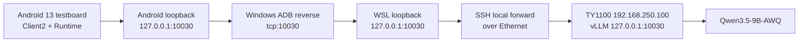

# TY1100 vLLM 原型验证环境

本目录定义 Central Brain Android 原型的唯一大模型验证环境。它复用
`UNICORE_BOX` 已部署的 TY1100-NX-PRO 算力设备与 `Qwen3.5-9B-AWQ` vLLM
服务，取代 WSL 内的 Ollama。此配置只用于 Debug 原型验证，不改变生产
Release 中的 OpenClaw 配置。

## 固定拓扑



TY1100 的 vLLM 保持 loopback 绑定，不修改设备服务、监听地址或系统配置。
Android 当前没有可用的直连以太网接口，因此测试链路前半段使用 ADB reverse；
这不是 Android 直连以太网或生产验收证据。

## 启动与检查

前置条件：

- Windows ADB 位于 `E:\\platform-tools`，ADB server 端口为 `5038`；
- Android 测试板序列号为 `testboard`；
- WSL 可通过以太网访问 `192.168.250.100:22`；
- 本机存在 `~/.ssh/unicore_ty1100_ed25519`。

```bash
cd /home/normad400/appDev
bash tools/manage_central_brain_ty1100_vllm_bridge.sh start
bash tools/manage_central_brain_ty1100_vllm_bridge.sh status
```

停止本工程创建的桥接和 ADB reverse：

```bash
bash tools/manage_central_brain_ty1100_vllm_bridge.sh stop
```

桥接工具只接受 `start|status|stop`，固定核验 `/health` 和 `/v1/models`，且
模型目录必须精确为 `Qwen3.5-9B-AWQ`。工具不会接受任意主机、端口或模型参数。

## Android 构建与探针

Debug 默认构建配置为 `development_ty1100_vllm`：

```bash
bash tools/build_central_brain_android_runtime.sh
bash tools/run_central_brain_android_ty1100_vllm_probe.sh
```

探针验证 Android 13 ARM64、真实网络请求、Provider ID、模型回复边界和无执行
权限。它不会记录原始 Prompt、模型回复或图片内容。

## 请求合同

Android 使用 OpenAI 兼容 HTTP 接口：

- `GET /health`
- `GET /v1/models`
- `POST /v1/chat/completions`
- `model=Qwen3.5-9B-AWQ`
- `stream=false`
- `response_format.type=json_schema`
- 文字输入使用字符串 `content`
- 图文输入使用 `text` 与一个 `image_url` Data URL

单张图片只允许 PNG/JPEG，最大 `6 MiB`。图片按输入摘要绑定，推理完成、取消或
失败后清零内存副本。模型输出必须再次经过本地严格解析、场景绑定、动作白名单、
必要动作和重复动作校验。该 vLLM 的 xgrammar 不支持 `uniqueItems`，因此重复动作
由本地校验拒绝，不依赖模型语法引擎。

## 生产隔离

Release 仍保留：

- profile: `target_openclaw_transitional`
- endpoint: `ws://169.254.208.110:18789`
- protocol: `3`
- routing: disabled

原型 vLLM Provider 不编入 Release 路由，不具备工具、Safety、Effect、车身总线、
驱动或 NPU API 权限。完整机器合同位于
[`central_brain_android_ty1100_vllm_prototype_v1.json`](../../contracts/central_brain_android_ty1100_vllm_prototype_v1.json)。

## 当前证据

2026-08-13 已验证：

- `/health` 与唯一模型身份；
- 结构化文字推理；
- PNG + 文字的结构化多模态推理；
- Android Runtime 实机探针，模型延迟 `3566 ms`；
- Client2 “检测吸烟”完整链路，图片被消费，模型延迟 `4246 ms`；
- UI 实时显示 Agent 路由、模型输入、模型输出和无车身执行边界。

证据等级是 Android 实机 + 外部算力设备原型验证。尚未验证 Android 直连以太网、
车身执行、生产 Release 或目标量产验收。
