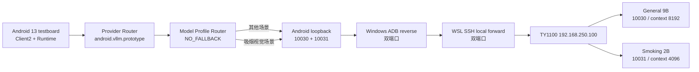

# TY1100 vLLM 原型验证环境

本目录定义 Central Brain Android 原型的唯一大模型验证环境。它复用
`UNICORE_BOX` 已部署的 TY1100-NX-PRO 算力设备，在一张卡上常驻
`Qwen3.5-9B-AWQ` 与 `Qwen3.5-2B-AWQ` 两个 vLLM 服务，取代 WSL 内的
Ollama。此配置只用于 Debug 原型验证，不改变生产 Release 中的 OpenClaw 配置。

Runtime 先由 `PolicyAwareModelRouter` 选择 Provider，再由
`ModelProfileRouter` 在该 Provider 内确定模型：吸烟合规视觉场景固定选择 2B，
其余场景固定选择 9B。路由不允许静默 fallback，任一目标的身份、健康或预热状态
不满足合同即失败关闭。结果见
[吸烟检测评测第 14 节](../../evaluation/smoking-detection/README.md#14-qwen35-2b-awq-小模型候选测试)。

## 固定拓扑



TY1100 的 vLLM 保持 loopback 绑定，不修改设备服务、监听地址或系统配置。
Android 当前没有可用的直连以太网接口，因此测试链路前半段使用 ADB reverse；
这不是 Android 直连以太网或生产验收证据。

## 启动与检查

前置条件：

- Windows ADB 位于 `E:\\platform-tools`，ADB server 端口为 `5038`；
- Android 测试板序列号为 `testboard`；
- WSL 可通过以太网访问 `192.168.250.100:22`；
- 本机存在 `~/.ssh/unicore_ty1100_ed25519`。

```bash
cd /home/normad400/appDev
bash tools/manage_central_brain_ty1100_routed_vllm.sh start
bash tools/manage_central_brain_ty1100_routed_vllm.sh status
```

停止本工程创建的桥接和 ADB reverse：

```bash
bash tools/manage_central_brain_ty1100_routed_vllm.sh stop
```

`start` 按顺序启动并验证 9B、2B，建立双端口桥接，执行两轮真实预热，再配置
Android reverse。两个容器使用 `restart=always` 保持常驻；启动失败会恢复原始 9B
基线容器。`status` 同时核验 `/health`、`/v1/models`、模型 ID、最大上下文和两个
Android reverse。`restore` 用于退出双模型原型并恢复原始基线。

Android Service 创建阶段只登记固定 Profile，禁止在主线程发起网络。每个 Engine 的首次推理在
模型工作线程先执行 `/health` 与 `/v1/models` 身份探测，再发送业务请求；探测失败时该请求失败关闭。
服务端真实模型预热由上述 `start` 流程在 Activity 启动前完成。

工具固定模型、端口和上下文，不接受任意 endpoint 或模型参数：

| 路由 | Profile ID | 模型 | 端口 | 最大上下文 |
| --- | --- | --- | ---: | ---: |
| 通用座舱 | `model.general-cockpit.9b.v1` | `Qwen3.5-9B-AWQ` | 10030 | 8192 |
| 吸烟合规 | `model.cabin-smoking.2b.v1` | `Qwen3.5-2B-AWQ` | 10031 | 4096 |

## Android 构建与探针

Debug 默认构建配置为 `development_ty1100_vllm`：

```bash
bash tools/build_central_brain_android_runtime.sh
bash tools/run_central_brain_android_ty1100_vllm_probe.sh
```

探针验证 Android 13 ARM64、真实网络请求、Provider ID、模型回复边界和无执行
权限。它不会记录原始 Prompt、模型回复或图片内容。

## 请求合同

Android 使用 OpenAI 兼容 HTTP 接口：

- `GET /health`
- `GET /v1/models`
- `POST /v1/chat/completions`
- `model` 必须与路由目标精确一致；禁止请求侧覆盖
- `stream=false`
- `chat_template_kwargs.enable_thinking=false`
- `response_format.type=json_schema`
- 文字输入使用字符串 `content`
- 图文输入使用 `text` 与一个 `image_url` Data URL

单张图片只允许 PNG/JPEG，最大 `6 MiB`。图片按输入摘要绑定，推理完成、取消或
失败后清零内存副本。模型输出必须再次经过本地严格解析、场景绑定、动作白名单、
必要动作和重复动作校验。该 vLLM 的 xgrammar 不支持 `uniqueItems`，因此重复动作
由本地校验拒绝，不依赖模型语法引擎。

## 生产隔离

Release 仍保留：

- profile: `target_openclaw_transitional`
- endpoint: `ws://169.254.208.110:18789`
- protocol: `3`
- routing: disabled

原型 vLLM Provider 不编入 Release 路由，不具备工具、Safety、Effect、车身总线、
驱动或 NPU API 权限。完整机器合同位于
[`central_brain_android_ty1100_vllm_prototype_v1.json`](../../contracts/central_brain_android_ty1100_vllm_prototype_v1.json)。

## 当前证据

2026-08-22 已验证：

- 两个常驻服务的 `/health`、唯一模型身份和上下文上限；
- 两轮真实预热：9B 分别 `4666.593 ms`、`4632.581 ms`，2B 分别
  `1303.213 ms`、`1174.737 ms`；
- 结构化文字推理；
- PNG + 文字的结构化多模态推理；
- Android Runtime 通用场景路由到 9B，模型延迟 `3519 ms`；
- Client2 “检测吸烟”完整链路路由到 2B，图片被消费，模型延迟 `1155 ms`；
- UI 实时显示 Agent 路由、模型输入、模型输出和无车身执行边界。

证据等级是 Android 实机 + 外部算力设备原型验证。尚未验证 Android 直连以太网、
车身执行、生产 Release 或目标量产验收。

同日完成了常驻、预热和路由启用后的 2B 200 张离线平衡集回归：独立测试集准确率
`98.33%`，唯一漏检仍为 `096-positive`；端到端均值 `1360.964 ms`、P95
`2211.615 ms`，与路由前 2B 基线无实质回退。该结果不包含 Android Runtime，
也不构成量产准入结论；模型自报置信度全部为 1.0，校准器继续保持不可部署。
