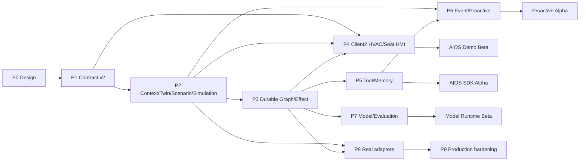

# Central Brain AIOS Stage 2 开发计划与最小工作包

版本：1.3

日期：2026-07-16

状态：Implementation backlog baseline

目标平台：黑盒 Android 13 座舱域控制器

主要语言：Java、AIDL、C；构建/验收脚本使用 Bash；Python AIOS 原型已退役且不得作为兼容参考或测试 oracle

## 1. 计划摘要

Stage 2 分为九个阶段。P0-P3 交付可恢复的 AIOS Runtime 场景闭环，P4 在 Client2 APK 中完成
HVAC/Seat 中控 UI 和演示闭环，P5-P7 扩展 Tool/Memory/Event/Model 平台，P8 在外部条件满足后
接真实车辆/NPU adapter，P9 做量产化加固。

| 阶段 | 目标 | 预计人日 | 外部依赖 | 出口版本 |
| --- | --- | ---: | --- | --- |
| P0 | 需求、调研、UX、详设、门禁冻结 | 6-8 | 无 | Design Baseline |
| P1 | typed Session/Plan/Event/Effect SDK 与 Room v4 | 12-16 | 无 | Runtime Contract v2 |
| P2 | Context/Digital Twin/Scenario/Simulated Effect | 20-26 | 无 | AIOS Demo Alpha |
| P3 | Durable Agent Graph、恢复、确认、补偿 | 18-24 | 无 | AIOS Demo Beta |
| P4 | Client2 HVAC/Seat 中控闭环、执行 UX、工程模式 | 24-32 | Client2 maintained patch pipeline | Cockpit UX Beta |
| P5 | Tool/Skill 平台与分层 Memory | 24-32 | signer/update policy 的量产部分可延后 | AIOS SDK Alpha |
| P6 | Event Trigger、主动智能、跨模块消息 | 16-22 | 目标事件源可用性 | Proactive Alpha |
| P7 | Model Router、local/NPU/cloud profile、评测 | 16-24 | NPU SDK/云策略可延后 | Model Runtime Beta |
| P8 | AAOS/Vendor/NPU 真实 adapter | 20-40+ | OEM property/service/permission/ABI | Target Integration RC |
| P9 | 性能、长稳、安全、发布、OTA/回滚 | 30-45 | 生产 signer/MDM/整车测试 | Production Candidate |

估算基于 1 名熟悉当前仓库的 Android/系统工程师和 1 名可兼职测试工程师。P0-P7 总计约
136-184 人日；P8-P9 受厂商接口、签名、车辆权限和整车验证影响，不承诺固定完成日期。若 3 名
开发并行且接口及时冻结，P0-P7 约 11-16 个日历周；单人串行约 7-9 个月。

## 2. 交付优先级

### 2.1 必须先完成的用户闭环

```text
HMI scenario request
 -> trusted ContextSnapshot
 -> deterministic ScenarioPlan
 -> Policy/Safety decision
 -> persistent approval when required
 -> durable multi-effect execution
 -> simulated VehicleDigitalTwin feedback
 -> action-by-action HMI timeline
 -> retry/partial failure/undo/restart recovery
```

这条闭环完成前，不优先扩展模型数量、联网 Agent 或动态插件。

### 2.2 依赖真实平台的后置工作

- AAOS `CarPropertyManager` 写权限；
- 标准/Vendor property 目录和 area mapping；
- 生产 signer、privileged permission、MDM/background policy；
- Vendor NPU userspace SDK、ABI、模型格式、内存和取消语义；
- 整车 Safety owner 对座椅/HVAC/主动触发策略的批准。

这些工作在 P8 前保持 interface/empty adapter，不阻塞 P0-P7 的仿真闭环。

Stage 2 设计和 P0-P7 用户态实现固定：`production_ready=false`、
`target_hardware_validated=false`、`driver_development_triggered=false`、
`virtualization_development_triggered=false`。只有 P8/P9 的独立目标证据和 owner 批准可以改变相应状态。

## 3. 派生需求编号

派生需求不是架构图的新顶层模块。每项必须映射回原有 Req ID。

| 派生 ID | 要求 | 基线 Req ID |
| --- | --- | --- |
| `S2-UX-001` | 面板显示 session、plan、node、effect 状态 | `APP-001`、`APP-004`、`XSC-001` |
| `S2-UX-002` | driving state 自适应布局和交互限制 | `APP-001`、`FW-S-005`、`NV-G-005` |
| `S2-UX-003` | approval/cancel/retry/undo/partial failure UX | `FW-U-004`、`FW-U-007`、`NV-G-005..007` |
| `S2-HMI-001` | Client2 APK 内中控 HVAC 控制页 | `APP-001/003/004`、`FW-S-003`、`XSC-001` |
| `S2-HMI-002` | Client2 APK 内中控 Seat 页和驾驶态限制 | `APP-001/003`、`FW-S-003/005`、`NV-G-005` |
| `S2-HMI-003` | desired/reported/timeline/partial/undo/recovery 可见 | `FW-U-001/003/004`、`NV-G-006/007` |
| `S2-HMI-004` | 无真实信号时显式标注 Android debug/test Digital Twin | `NV-F-004`、`DEL-001/004` |
| `S2-HMI-005` | 场景与手动控制复用 SDK/Governance/Effect 链路 | `APP-004`、`NV-F-001/003/009`、`NV-P-002` |
| `S2-HMI-006` | 自然场景意图为主入口并展示完整自动化链 | `APP-001/003/004`、`FW-U-001/004`、`NV-F-001`、`NV-G-005..007` |
| `S2-SES-001` | 持久 session 与 action/observation event tree | `FW-U-003`、`NV-F-001`、`NV-G-003`、`NV-G-007` |
| `S2-CTX-001` | 统一、带新鲜度和质量的 ContextSnapshot | `FW-U-001`、`FW-U-002`、`NV-F-004` |
| `S2-TWN-001` | desired/reported last-known Vehicle Digital Twin | `FW-U-001..003`、`NV-F-004`、`NV-G-006` |
| `S2-SCN-001` | 场景目录、模板、参数与确定性计划编译 | `APP-003`、`FW-S-001`、`NV-F-001` |
| `S2-GRF-001` | durable agent graph、retry/timeout/interrupt | `NV-F-001`、`NV-F-008`、`NV-G-004..007` |
| `S2-SAF-001` | risk、driving state、approval、capability 强制治理 | `FW-U-007`、`FW-S-005`、`NV-F-009`、`NV-G-005` |
| `S2-EFF-001` | 多 Effect prepare/dispatch/verify/reconcile/compensate | `FW-U-004`、`FW-S-003`、`NV-F-003..005`、`NV-G-006..007` |
| `S2-ADP-001` | HVAC/Seat/Nav/Media 仿真 adapter | `NV-F-003..005`、`DEL-001`、`DEL-005` |
| `S2-TOL-001` | Tool/Skill manifest、registry、rule、executor | `FW-U-006..008`、`NV-F-001`、`NV-G-001..006` |
| `S2-MEM-001` | working/profile/episodic memory + consent/retention | `FW-U-001`、`FW-U-006..007`、`NV-F-001`、`NV-G-005..007` |
| `S2-EVT-001` | typed event broker、cursor、trigger、backpressure | `FW-U-003`、`NV-P-006`、`NV-G-004..007` |
| `S2-MDL-001` | model provider/router/budget/fallback/evaluation | `APP-004`、`NV-F-001`、`NV-F-011..012`、`NV-G-004..007` |
| `S2-ADP-002` | production AAOS/Vendor/NPU adapter gate | `NV-F-003..005`、`NV-F-011`、`KH-003`、`KH-006`、`DEL-005` |
| `S2-OBS-001` | trace、metric、audit、scenario evaluation | `APP-009`、`NV-F-012`、`NV-G-007` |
| `S2-REL-001` | signer、升级、回滚、长稳和发布证据 | `NV-G-006..007`、`DEL-001`、`DEL-003..005` |

## 4. P0 设计冻结

### `P0-W01` 开源与行业证据基线

- 状态：`DONE`；预计/实际：2 人日；派生需求：全部。
- 交付：`CENTRAL_BRAIN_AIOS_OPEN_SOURCE_AND_INDUSTRY_RESEARCH.md`。
- DoD：记录项目 commit、源码入口、采纳/拒绝决策、AAOS/VSS/uProtocol 安全边界。
- 验证：Stage 2 文档检查器验证 commit marker、来源和结论标题。

### `P0-W02` 产品与 UX 基线

- 状态：`DONE`；预计/实际：2 人日；需求：`S2-UX-001..003`、`S2-HMI-006`、`S2-SCN-001`、`S2-SAF-001`、`S2-EFF-001`。
- 交付：`CENTRAL_BRAIN_AIOS_STAGE2_PRODUCT_UX_PLAN.md`。
- DoD：“我累了/我冷了”均有 Context、计划图、Effect、失败/撤销、验收；moving seat recline 明确 fail closed。

### `P0-W03` 工程详设和 backlog

- 状态：`DONE`；预计/实际：2-4 人日；需求：全部。
- 交付：本文档、`CENTRAL_BRAIN_COMPLETE_SOFTWARE_DEVELOPMENT_DESIGN.md`、requirements/roadmap/deviation/issue 同步。
- DoD：每个计划模块有源码路径、接口、状态、依赖、测试和完成定义。

## 5. P1 Runtime Contract v2 与 Room v4

### `P1-W01` Session DTO/AIDL

- 状态：`DONE`（contract layer，2026-07-17）；1.5 人日；需求：`S2-SES-001`、`S2-UX-001`。
- 新增路径：`central-brain-sdk/src/main/aidl/com/centralbrain/sdk/session/`。
- 文件：`SessionRequest.aidl`、`SessionHandle.aidl`、`SessionSnapshot.aidl`、`SessionQuery.aidl`、
  `SessionPage.aidl`、`ICentralBrainSessionRuntime.aidl`、`SessionContract.java`。
- 接口：`openSession`、`getSession`、`listSessions`、`cancelSession`。
- DoD：DTO 使用定长/有界字段；未知 enum/version fail closed；AIDL hash 更新。
- 测试：JVM oversize/enum/version/deadline reject；Android Parcel round-trip；独立 interface hash 和
  `session-v1.sha256` 冻结；既有 Runtime/Governance V1 checksum 保持不变。
- 边界：`session_contract_v1_defined=true`，`session_runtime_service_published=false`。原计划放在本包的
  SDK disconnected/reconnect 验收移至拥有连接生命周期的 `P1-W05`，不得为 DTO-only 合同伪造服务证据。
- 设备证据：Android 13/API 33 ARM64 物理控制器 Parcel/oversize/version 验证通过；临时 test APK 已卸载，
  `session_parcel_physical_android13_arm64_verified=true`，不表示 Session Service 或车辆硬件已接入。

### `P1-W02` Plan/Node DTO/AIDL

- 状态：`DONE`（contract layer，2026-07-17）；1.5 人日；需求：`S2-SCN-001`、`S2-GRF-001`。
- 路径：`central-brain-sdk/src/main/aidl/com/centralbrain/sdk/plan/`。
- 文件：`ScenarioPlan.aidl`、`PlanNode.aidl`、`NodeDependency.aidl`、`NodePolicy.aidl`、
  `PlanContract.java`。
- DoD：node type 只允许 allowlist；每个 node 含 timeout/retry/idempotency/required/compensation metadata。
- 测试：DAG schema、节点/边/深度/并行度/deadline 上限、cycle/unknown type/missing dependency、
  retry without idempotency 和 compensation loop reject；独立 `plan-v1.sha256` 与 checker 冻结。
- 边界：`plan_contract_v1_defined=true`、`plan_runtime_published=false`；本包不实现
  `ScenarioPlanCompiler`、`PlanGraphValidator` Runtime owner、Graph 调度、Room 或车辆/NPU adapter。
- 设备证据：Android 13/API 33 ARM64 物理控制器完成四个 DTO Parcel round-trip 及 cycle/unknown type
  reject；临时 test APK 已卸载，`plan_parcel_physical_android13_arm64_verified=true`。该证据只证明
  Android wire contract，不表示 Plan 执行或目标硬件集成。

### `P1-W03` Typed Event DTO/AIDL

- 状态：`DONE`（contract layer，2026-07-17）；2 人日；需求：`S2-SES-001`、`S2-EVT-001`。
- 路径：`central-brain-sdk/src/main/aidl/com/centralbrain/sdk/event/`。
- 文件：`RuntimeEvent.aidl`、`ActionEvent.aidl`、`ObservationEvent.aidl`、`MessageEvent.aidl`、
  `EventPage.aidl`、`ICentralBrainSessionEvents.aidl`、`ICentralBrainSessionEventCallback.aidl`、
  `EventContract.java`。
- 接口合同：独立 `ICentralBrainSessionEvents` V1 的 `getEvents(sessionId,cursor,limit)`、
  `registerSessionCallback`、`unregisterSessionCallback`；不修改 Session V1 checksum。
- DoD：event immutable、UUID/timestamp/source/parent/schemaVersion 完整；page limit <= 100。
- 测试：typed payload/schema/source/enum、contiguous ordering、parent ID+sequence、page limit、redaction、
  immutable replay 和 cursor continuation；独立 `events-v1.sha256` 与 checker 冻结。
- 边界：callback 只是 commit 后提示，`EventPage` replay 才是权威恢复路径；
  `event_runtime_service_published=false`、`event_callback_service_published=false`。P1-W05 才实现 Binder
  principal/capability、Service、callback death/overflow/reattach；P1-W06 才接 Room v4。
- 设备证据：Android 13/API 33 ARM64 物理控制器完成五个 DTO Parcel、ordering/parent/redaction reject
  和 cursor replay；临时 test APK 已卸载，`event_parcel_physical_android13_arm64_verified=true`。

### `P1-W04` Effect/Approval DTO 扩展

- 状态：`DONE`（contract layer，2026-07-17）；1.5 人日；需求：`S2-EFF-001`、`S2-SAF-001`、`S2-UX-003`。
- 文件：`EffectIntent.aidl`、`EffectObservation.aidl`、`ApprovalPrompt.aidl`、`UndoHandle.aidl`。
- DoD：`EffectIntent` 使用单一 typed scalar、digest/idempotency/deadline/verification/compensation；
  `EffectObservation` 区分 dispatched/delivered/applied/verified 并保持 simulation/source/terminal 明确；
  approval 绑定 plan/action/target/Context/policy，Undo 只表示有 TTL 的补偿资格。
- 测试：typed-value inactive field、verification、完整 transition/retry table、terminal skip、stale/expired
  approval、expired/regressed undo、simulation marker；独立 `effect-v1.sha256` 与 checker 冻结。
- 边界：本包不新增 Binder interface，不提供 approval response/grant 或 undo execution，不修改 Room，
  `effect_runtime_service_published=false`、`approval_response_service_published=false`、
  `undo_service_published=false`；现有 Governance V1 无 grant 方法。
- 设备证据：Android 13/API 33 ARM64 物理控制器完成四个 DTO Parcel round-trip、完整 Effect 状态链、
  illegal terminal/stale approval/expired undo reject；临时 test APK 已卸载，
  `effect_parcel_physical_android13_arm64_verified=true`、`hardware_accessed=false`。

### `P1-W05` SDK facade v2

- 状态：`DONE`；2026-07-17 完成；需求：`S2-SES-001`、`S2-UX-001..003`、`S2-EVT-001`、
  `APP-004`、`XSC-001/006`、`NV-G-003/004`。
- SDK：`ScenarioClient`、`SessionClient`、`RuntimeEventListener` 不暴露 `IBinder`/`RemoteException`；
  内部 `AndroidScenarioTransport` 用同一显式 Runtime component 的 Session/Event action 建立双 Binder。
- Runtime：同一 `CentralBrainRuntimeService` 发布 Session/Event V1，不新增 Manifest Service；七项
  default-deny capability 从 Binder UID/package/current signer 派生 owner。进程级 transient registry
  有界、幂等、按 owner 隔离，不保留原始 utterance。
- 生命周期：authoritative cursor replay 后注册 notification callback；重复 replay 按 sequence 去重；
  Service rebind 后重新读取 snapshot 并订阅 active session。进程死亡恢复仍为
  `session_runtime_process_death_rehydration=false`，由 P1-W06 持久化关闭。
- 测试：fake transport、callback race、协议拒绝、close/reconnect 幂等、registry owner/capacity/
  cursor；Android 13/API 33 ARM64 真实 Binder 验证通过，`hardware_accessed=false`。
- 边界：`scenario_execution_enabled=false`，不发布 Effect/approval response/undo executor，不接车辆、
  NPU 或 Driver/HAL。Event V1 terminal page cursor 限制登记于 `ISSUE-034`。

### `P1-W06` Room v4 schema

- 状态：`DONE`（schema + Session/Event durable wiring，2026-07-17）；2.5 人日；需求：
  `S2-SES-001`、`S2-GRF-001`、`S2-EFF-001`、`S2-EVT-001`。
- 新增 entity：`SessionEntity`、`PlanEntity`、`PlanNodeEntity`、`RuntimeEventEntity`、`EffectObservationEntity`、`CompensationEntity`。
- 约束：FK、unique idempotency key、terminal state immutability、payload size limit。
- DoD：v3->v4 migration 不丢现有 durable task/effect；schema JSON committed。
- 测试：migration fixture、crash transaction、query index plan。
- Runtime：`DurableSessionRegistry` 已替换生产 Session/Event 端点的 transient Map；session + initial event
  和 cancel + terminal event 均在 Room transaction 内提交，callback 只在 commit 后通知。
- 设备证据：Android 13/API 33 ARM64 完成 v1->v4 fixture、已有 v3 生产库升级、Runtime 进程杀死后的
  session identity/event replay 恢复和 terminal cancel 幂等；测试 APK 验证后卸载，未访问硬件。
- 边界：Plan/Node/EffectObservation/Compensation 本包只建 schema，不发布 Compiler/Graph/Effect/
  approval-response/undo；Event V1 terminal cursor 缺口继续由 `ISSUE-034`/P1-W07 跟踪。

### `P1-W07` Contract v2 aggregate check

- 状态：`DONE`（2026-07-17）；1 人日；需求：P1 全部。
- 新增：`central_brain_runtime_contract_v2.json`、`RuntimeContractV2`、JVM regression 和
  `tools/check_central_brain_runtime_contract_v2.sh`。
- DoD：AIDL API/hash、capability、稳定错误类别、payload/page/callback/latency、Room v4、SDK tests 和
  forbidden fallback 一次校验；四组 V1 hash 未改变。
- 设备证据：Android 13/API 33 ARM64 累计 instrumentation 通过 aggregate constants、V1 wire version、
  bounds 和未发布边界，测试 APK 随后卸载，`hardware_accessed=false`。
- Event 决策：V1 terminal page 限制保留；未来必须发布独立 Event V2 terminal resume cursor +
  monotonic owner/session-scoped ACK。P1-W07 不发布该 Binder，也不声称 production broker ready。

## 6. P2 Context、Digital Twin、Scenario 与仿真 Effect

### `P2-W01` Canonical vehicle signal types

- 状态：`DONE`（2026-07-17）；1.5 人日；需求：`S2-CTX-001`、`S2-TWN-001`。
- 新增包：`runtime-service/.../vehicle/schema/`。
- 类：`VehicleSignalPath`、`SignalValue`、`SignalQuality`、`SignalSource`、`SignalTimestamp`。
- DoD：12 项 VSS-style path allowlist、boolean/integer/decimal/text typed scalar、精确 unit/area、
  source/quality、receive-side monotonic freshness；禁止 arbitrary object/JSON/Parcelable。
- 测试：JVM path/area/unit/type/stale/quality/future-time/invalid payload；Android 13/API 33 ARM64
  DUMP-protected debug probe 验证相同合同。
- 边界：`vehicle_signal_provider_wired=false`、`vehicle_property_mapping_configured=false`、
  `hardware_accessed=false`；AAOS/Vendor 仅是 provenance enum，不是激活证据。

### `P2-W02` Vehicle capability catalog

- 状态：`DONE`（2026-07-17）；1.5 人日；需求：`S2-TWN-001`、`S2-ADP-001`。
- 类：`VehicleCapability`、`CapabilityCatalog`、`CapabilityAvailability`。
- 初始 capability：HVAC temperature/power/fan、seat heating/ventilation/recline、media playback、navigation POI。
- DoD：8 项 immutable metadata 均声明 readable/writable/simulatable/productionAvailable/
  productionAuthorized、typed target ranges、areas、risk、reported signal 和 required fresh signals。
- 测试：catalog ordering/immutability、range/step/text、readback/safety dependency、duplicate/mismatch；
  Android 13/API 33 ARM64 debug probe 验证相同合同。
- 边界：全部 production available/authorized 为 false，`vehicle_capability_adapter_registry_wired=false`、
  `vehicle_property_mapping_configured=false`、`hardware_accessed=false`。

### `P2-W03` Vehicle Digital Twin store

- 状态：`DONE`（2026-07-17）；2.5 人日；需求：`S2-TWN-001`。
- 类：`VehicleDigitalTwinStore`、`DigitalTwinSnapshot`、`DesiredStateRecord`、`ReportedStateRecord`。
- DoD：thread-safe、monotonic revision、desired/reported 分离、TTL/quality、snapshot atomicity。
- 测试：24-thread CAS、stale/conflict rejection、idempotent replay、TTL/freshness、filtered immutable
  snapshot、desired/reported reconciliation；Android 13/API 33 ARM64 debug probe 验证相同合同。
- 边界：当前仅进程内，不持久化，不接入 production Service/adapter/property mapping，
  `vehicle_digital_twin_persistence_wired=false`、`vehicle_digital_twin_adapter_wired=false`、
  `hardware_accessed=false`。

### `P2-W04` ContextSnapshotBuilder

- 状态：`DONE`（2026-07-17）；2 人日；需求：`S2-CTX-001`、`S2-SAF-001`。
- 类：`ContextSnapshotBuilder`、`ContextFieldPolicy`、`ContextSnapshot`。
- 输入：Digital Twin、Runtime state、seat zone、profile memory availability。
- DoD：关键 safety field 缺失进入 restricted；snapshot 有 digest/version/freshness report。
- 实现：general/seat comfort/seat recline 三类固定 policy；同一 Twin revision、Runtime state freshness、
  driving/safety/source mode、missing/stale/conflict/non-production-trusted report 和 SHA-256 context identity。
- 测试：complete/missing/stale/conflict、moving/runtime conflict、seat area、digest binding、stale/future Runtime
  state、AAOS source unverified；Android 13/API 33 ARM64 debug probe 验证相同合同。
- 边界：`context_snapshot_production_trusted=false`、`context_snapshot_production_wired=false`、
  `vehicle_signal_provider_wired=false`、`hardware_accessed=false`。

### `P2-W05` Scenario manifest/schema

- 状态：`DONE`（2026-07-17）；2 人日；需求：`S2-SCN-001`、`S2-SAF-001`。
- 新增：`runtime-service/src/main/assets/scenarios/*.json`。
- 类：`ScenarioManifest`、`ScenarioManifestParser`、`ScenarioCatalog`。
- DoD：JSON schema、version、supported zones、required context/capabilities、plan template、risk、fallback、UI metadata。
- 测试：unknown field policy、oversize、duplicate ID、invalid DAG。
- 实现：cold/fatigue/rest 三份 build-owned v1 asset、Gson strict streaming parser、draft-2020-12 schema、
  SHA-256 sidecar、bounded node/dependency/depth/parallelism/capability/risk/fallback/UI validator 和 invalid
  asset isolation；fatigue/rest seat recline 固定 `PARKED_ONLY` + approval-required metadata。
- 边界：sidecar 不是 artifact 密码学签名；`scenario_manifest_artifact_crypto_verified=false`、
  `scenario_catalog_production_trusted=false`、`scenario_runtime_wired=false`、
  `scenario_graph_execution_enabled=false`、`hardware_accessed=false`。

### `P2-W06` DeterministicScenarioResolver

- 状态：`DONE`（2026-07-17）；2 人日；需求：`S2-SCN-001`、`S2-SAF-001`。
- 类：`ScenarioResolver`、`DeterministicScenarioResolver`、`ScenarioResolution`。
- DoD：按钮 ID 直接解析，不依赖模型；文本意图只选择已注册场景，不创建 capability。
- 测试：cold/fatigue/rest branches、unknown intent。
- 实现：显式 ID 优先；<=256 字符 NFKC/Locale.ROOT 固定中英文 alias；unknown/多段 ambiguous
  fail-closed；source/zone/fixed Context policy/required fresh field/capability availability/PARKED_ONLY gate；
  immutable `ACCEPTED/DEGRADED/REJECTED`、稳定 reason code 和 request/Context/capability/manifest-bound digest。
- 证据：7 组 JVM tests、DUMP-protected Android 13 ARM64 probe、独立 checker、累计 installer 和 CI。
- 边界：`scenario_resolver_model_invoked=false`、`scenario_resolver_runtime_wired=false`、
  `scenario_compiler_wired=false`、`scenario_graph_execution_enabled=false`、`effect_dispatch_enabled=false`、
  `hardware_accessed=false`；software simulation profile 不构成 production trust。

### `P2-W07` ScenarioPlanCompiler

- 状态：`DONE`（2026-07-17）；3 人日；需求：`S2-SCN-001`、`S2-GRF-001`、`S2-SAF-001`。
- 类：`ScenarioPlanCompiler`、`PlanGraphValidator`、`PlanDigest`。
- DoD：Context branch、node dependencies、required/optional、approval、compensation 编译为 immutable DAG。
- 测试：golden plan、cycle、unsafe moving seat node absent。
- 实现：只接受 `ACCEPTED/DEGRADED` Resolution；复验 resolution/Context/capability/manifest digest 与
  version；把 manifest template 编译为 P1 typed Plan DTO，并以 immutable owner + deep-copy transport
  暴露；optional-only fallback 精确裁剪，required Effect 必须可达 verify，HIGH Effect 必须存在 approval
  前驱，MOVING/UNKNOWN 不含 `PARKED_ONLY` 或驾驶席 recline dispatch。
- 证据：7 组 JVM tests、DUMP-protected Android 13 ARM64 probe、独立 checker、累计 installer 和 CI。
- 边界：不生成 Effect target、不发布/执行 Graph，不接 Session/Room/production Service；
  `scenario_plan_compiler_runtime_wired=false`、`scenario_plan_runtime_published=false`、
  `scenario_graph_execution_enabled=false`、`effect_dispatch_enabled=false`、`hardware_accessed=false`。

### `P2-W08` SimulatedVehicleAdapter base

- 状态：`DONE`（2026-07-17）；1.5 人日；需求：`S2-ADP-001`、`S2-EFF-001`。
- 类：`SimulatedEffectAdapter`、`SimulationClock`、`FaultInjectionProfile`。
- DoD：debug/test build only；production source set 不注册；支持 delay/timeout/failure/readback mismatch。
- 实现：三类均只存在于 `src/debug`；adapter 复用 typed `EffectAdapter` token contract，固定
  `simulation=true`、`productionAuthorized=false`、`SignalSource.SIMULATED`，最多 128 条 process-memory
  record；手动 monotonic clock 不 sleep；每个 invocation 冻结 fault profile，区分 delivery 与 readback。
- 故障：NONE、DELAY、TIMEOUT、RETRYABLE_FAILURE、TERMINAL_FAILURE、READBACK_MISMATCH；duplicate token
  返回原始 apply result，token 绑定不同 invocation 时失败关闭。
- 证据：7 组 JVM tests、debug/release Java compile、DUMP-protected Android 13 ARM64 probe、独立 checker、
  累计 installer 和 CI。
- 边界：HVAC/Seat/Media/Nav typed target/state 属于 P2-W09..W11；不注册 production Service/adapter，
  `simulated_effect_adapter_runtime_wired=false`、`effect_dispatch_enabled=false`、`hardware_accessed=false`。

### `P2-W09` Simulated HVAC adapter

- 状态：`DONE`（2026-07-17）；1.5 人日；需求：`S2-ADP-001`、`S2-EFF-001`。
- 类：`SimulatedHvacEffectAdapter`。
- DoD：range/zone/availability、desired/report delay、idempotency、absolute target。
- 测试：success/timeout/out-of-range/retry/readback。
- 实现：debug-only fixed-binary `HvacTarget` 支持 power、target-temperature、fan absolute target；严格绑定
  capability ID/action、area、16..30/0.5 celsius 和 0..7/1 fan range。admission 写 desired，manual clock
  完成后写 source SIMULATED reported；timeout/retry/terminal 不伪造 reported，mismatch 写可观察的不一致值。
- 状态：`simulated_hvac_adapter_defined=true`、`simulated_hvac_android13_arm64_verified=true`、
  `simulated_hvac_debug_only=true`、`simulated_hvac_production_registered=false`、
  `simulated_hvac_runtime_wired=false`、`effect_dispatch_enabled=false`、`hardware_accessed=false`。

### `P2-W10` Simulated Seat adapter

- 状态：`DONE`（2026-07-17）；2 人日；需求：`S2-ADP-001`、`S2-SAF-001`。
- 类：`SimulatedSeatEffectAdapter`。
- DoD：heat/vent/recline；recline 再次检查 fresh safety state；moving permanently rejects.
- 测试：parked approval、moving reject、belt change race、partial progress。
- 实现：debug-only version 1 fixed-binary `SeatTarget` 支持 heating、ventilation 和 recline absolute target；
  action/capability/area/range/step 复用 P2-W02 catalog。recline 在 admission 和 dispatch 各重验 fresh
  NORMAL+PARKED、driver availability、occupancy、belt 和 simulation approval digest；状态变化产生永久
  REJECTED/TERMINAL_FAILURE，不写 reported。manual clock 提供有界 progress observation，完成时才写
  source SIMULATED reported。
- 证据：8 组 JVM tests、debug/release compile、DUMP-protected Android 13 ARM64 probe、独立 checker、累计
  installer 与 CI。production Service/adapter/真实车身接口仍不注册、不访问。

### `P2-W11` Simulated Media/Nav adapters

- 状态：`DONE`（2026-07-17）；2 人日；需求：`S2-ADP-001`。
- 类：`SimulatedMediaEffectAdapter`、`SimulatedNavigationEffectAdapter`。
- DoD：只模拟 state/observation，不启动未知第三方 Activity；接口可替换。
- 实现：两个 adapter 均只在 `src/debug`。Media 使用 version 1 typed `PLAY/PAUSE/STOP` target 和可替换
  simulation-only backend，只维护 immutable player state。Navigation 将 NFKC canonical POI 文本缩减为
  SHA-256，再由可替换 deterministic backend 返回 synthetic POI/route ID、距离、时长和 label key；observation
  不保留原始 query，不上传位置、不联网、不启动 Activity。
- 证据：8 组 JVM tests、debug/release compile、DUMP-protected Android 13 ARM64 probe、独立 checker、累计
  installer 与 CI；delay/timeout/failure/mismatch/idempotency 与 unsafe backend rejection 均覆盖。

### `P2-W12` Debug Context Controller

- 状态：`DONE`（2026-07-17）；1.5 人日；需求：`S2-CTX-001`、`S2-ADP-001`。
- 类：`DebugSimulationController`，debug AIDL/service endpoint。
- DoD：仅 debug signer/capability 可调用；production build 不含 exported controller。
- 实现：Runtime `src/debug` 提供 `IDebugSimulationController` V1 和独立 Service；debug-only signature
  permission 是外层边界，Binder UID/package/current-signer 派生的 `debug.simulation.control` capability 是
  内层 default-deny 边界。控制器只接受 PARKED/MOVING/UNKNOWN、P2-W01 canonical typed signal、四个固定
  simulated adapter ID、六类 fault 和有界 clock advance；snapshot/audit 只对外返回 revision/count/digest。
- 安全边界：128 条 audit ring 只保留 command/outcome/target digest，不保留原始 signal text；reset 清理
  state/signal/fault/adapter record 并保留审计。release variant 无 AIDL source、permission、Service、Activity
  或 production policy grant；不接 shared Context/Room/Graph/Effect、Vehicle/VHAL/NPU/Driver-HAL。
- 证据：7 组 JVM tests、debug/release compile、shell signature rejection、同签名 capability allowlisted
  Android 13 ARM64 真实 Binder probe、独立 checker、累计 installer 与 CI。

## 7. P3 Durable Agent Graph 与 Effect 闭环

### `P3-W01` AgentGraphRuntime state machine

- 状态：`DONE`（process-local state-machine foundation，2026-07-17）；3 人日；需求：`S2-GRF-001`、
  `NV-G-004/006/007`、`DEL-001/003..005`。
- 类：`AgentGraphRuntime`、`GraphRunState`、`NodeRunState`、`NodeExecutorRegistry`。
- 状态：CREATED/PLANNING/WAITING/EXECUTING/PARTIAL/COMPENSATING/COMPLETED/FAILED/CANCELLED/STUCK。
- DoD：只有合法 transition；单 session FIFO；不同 session 可按 supervisor 并发。
- 实现：Runtime main source 提供同步、最多 64 run/8 active session/256 retained event 的确定性状态机；
  admission 深拷贝并复验 P1/P2 typed Plan，node 按依赖变 READY，claim/suspend/resume/terminal outcome 只推进
  状态，不调用 executor。`PARTIAL` 是 optional skip/failure 后的终态；required failure/deadline 失败关闭。
- 边界：`NodeExecutorRegistry` 在本包只有 control-only node-type registration；typed executor 属于 P3-W02。
  Graph 不接 Binder/Room/Session Service，不执行 Effect/model/tool/memory，不调用 P2 adapter 或车辆/NPU。
- 证据：7 组 JVM tests、debug/release compile、Android 13 ARM64 debug probe、独立 checker、累计 installer/CI。

### `P3-W02` Typed node executors

- 状态：`DONE`（typed contract + debug/test deterministic implementation，2026-07-17）；3 人日；需求：
  `S2-GRF-001`、`S2-SAF-001`、`S2-EFF-001`、`DEL-001/003..005`。
- executor：Context、Policy、ApprovalInterrupt、Effect、Verification、Summary、Compensation。
- DoD：registry allowlist；executor 不反序列化任意类；input/output schema 固定。
- 实现：Runtime main source 提供 immutable `NodeExecutionInput/Output/Result`、11 类 Plan node exact-class
  schema、`TypedNodeExecutor<I,O>` 安全声明与只验证不调度的 `NodeExecutorRegistry`。所有输入只含有界 ID、
  enum、count 和 SHA-256，不接收 JSON/Bundle/Parcel blob/Java serialization/reflection。
- debug/test：`DeterministicNodeExecutors` 只实现 Context/Policy/Approval/Effect/Verification/Summary/
  Compensation 七类。Context/Verification 不提升 production trust；Policy/Approval 缺可信 authority 失败关闭；
  Effect 固定 WAITING/NOT_DISPATCHED，Compensation 固定 REJECTED/NOT_DISPATCHED。
- 未实现：Model/Tool/Memory 只有 digest-only fixed schema，无 executor 或 fallback。Graph/Binder/Room/checkpoint/
  adapter/model/hardware wiring 均未接，`dispatchEnabled=false`。
- 证据：8 组 JVM tests、debug/release compile、Android 13 ARM64 probe、独立 checker、累计 installer/CI。

### `P3-W03` CheckpointSerializer

- 状态：`DONE`（registered DTO + canonical JSON security contract，2026-07-17）；2 人日；需求：
  `S2-GRF-001`、`NV-G-003/006/007`、`DEL-001/003..005`。
- 类：`CheckpointSerializer`、`JsonPrimitiveCheckpointSerializer`、`CheckpointEnvelope`。
- DoD：allowlist type/version、size/depth limit、digest；拒绝 Java serialization。
- 测试：malformed/unknown/oversize/security corpus。
- 实现：main source 新增 immutable `CheckpointValue` primitive tree、exact-class `Registration<T>` 与显式
  `PayloadCodec<T>`。Envelope 固定 `schemaVersion/type/nodeId/planDigest/contextDigest/payload/digest/createdAt`，
  payload map key 排序、number 归一化，SHA-256 使用独立 domain；反序列化要求 byte-for-byte canonical JSON。
- 边界：strict streaming `JsonReader` 只生成 bounded primitive tree，不调用 Gson object mapping、Java
  serialization、class-name loading/reflection、Binder/Parcel blob、file/native pointer。未知 type/version、重复/
  未知字段、null、错误 class、摘要篡改、非 canonical、64 KiB、8 层和 1024 token 越界均失败关闭。
- 未实现：不接 `AgentGraphRuntime`、Room v4、Session/Binder 或 restart recovery；因此 mismatch 只返回稳定错误，
  P3-W09 才负责把恢复失败映射为 STUCK。Effect/model/vehicle/NPU/hardware 仍不执行。
- 证据：8 组 JVM tests、debug/release compile、Android 13 ARM64 probe、独立 checker、累计 installer/CI。

### `P3-W04` Retry/Timeout policy

- 状态：`DONE`（process-local policy contract，2026-07-17）；1.5 人日；需求：`S2-GRF-001`、
  `NV-G-004`、`DEL-001/003..005`。
- 类：`NodeRetryPolicy`、`NodeTimeoutPolicy`、`BackoffCalculator`。
- DoD：bounded attempts/deadline/jitter；Effect retry 需要 idempotency key。
- 实现：`NodeTimeoutPolicy` 只接收 caller 提供的 monotonic elapsed time，把 attempt timeout 截断到 plan
  deadline；`BackoffCalculator` 使用 domain-separated SHA-256 生成确定性 jitter，delay 不超过既有
  `PlanContract.MAX_NODE_TIMEOUT_MS`。`NodeRetryPolicy` 只允许 attempt 2..3；terminal/cancel 不重试，backoff
  完成时间必须严格早于 plan deadline。
- Effect 门禁：`effect.execute`/`compensate` 除 typed idempotency key 外，还必须取得
  `CONFIRMED_NOT_APPLIED` reconcile 结果才能重试；unknown delivery 返回 `RECONCILE`，已应用返回
  `STOP_EFFECT_ALREADY_APPLIED`，禁止盲重放。
- 边界：三个类均为 pure Java policy，不持有 clock/thread/executor，不接 `AgentGraphRuntime`、Room、Binder、
  production Effect/model/vehicle/NPU/Driver-HAL；`retry_timeout_policy_runtime_wired=false`。
- 证据：8 组 JVM tests、debug/release compile、Android 13 ARM64 probe、独立 checker、累计 installer/CI。

### `P3-W05` Durable approval interrupt

- 状态：`DONE`（checkpoint-ready process-local contract，2026-07-17）；2 人日；需求：`S2-SAF-001`、
  `S2-UX-003`、`S2-GRF-001`、`NV-G-005/006/007`、`DEL-001/003..005`。
- 类：`ApprovalInterruptExecutor`、`ApprovalResumeValidator`。
- DoD：approval 绑定 caller/plan/context/policy digest 和 expiry；resume 时重新检查 Safety State。
- 实现：immutable `ApprovalInterruptRecord` 绑定 owner/session/plan/node/action/plan/context/policy/Safety digest、
  plan deadline、最多 5 分钟 expiry、decision 与 trusted authority digest；pending、terminal replay、过期边界均
  fail-closed。注册 codec 通过 P3-W03 serializer 做 canonical checkpoint roundtrip，当前 epoch 以 decimal string
  表达，并修正 envelope `createdAt` 的同类边界缺陷。
- Resume：只接受 trusted APPROVED 且未过期记录；逐项重验 owner/plan/action、context freshness/digest、policy
  authorization/digest、capability 与 trusted SAFE/unchanged Safety digest；结果只有 allow/reason/digest。
- 边界：不接 `AgentGraphRuntime`、Room v4、Binder/grant Service、production Effect/model/vehicle/NPU/Driver-HAL；
  `approval_interrupt_persistence_wired=false`，durable Room/restart wiring 保留给 P3-W09。

### `P3-W06` EffectCoordinator

- 状态：`DONE`（process-local two-phase contract，2026-07-17）；3 人日；需求：`S2-EFF-001`、
  `S2-SAF-001`、`NV-G-005/006/007`、`DEL-001/003..005`。
- 类：`EffectCoordinator`、`EffectBatch`、`EffectDependencyPlanner`、`AdapterRegistry`。
- DoD：prepare-all before dispatch required effects；并发无冲突；每项独立 observation。
- 实现：`EffectBatch` 最多 16 项，冻结 P1 typed `EffectIntent`，绑定同一 session/plan/action/plan digest、
  唯一 effect/idempotency key、dependency/resource 和 batch digest。`EffectDependencyPlanner` 拒绝环，并把同资源
  Effect 分配到不同 wave；Coordinator 先对全部项 prepare，任一 required prepare 失败则零 dispatch，optional 失败
  可降级，再按 dependency wave 逐项调用既有幂等 `EffectAdapter`。
- Registry：按 capability+area+profile 精确查找；DEBUG 只接受 simulation registration，PRODUCTION 只接受显式
  authorized non-simulation registration，不做 debug/production fallback。当前仓库没有 production registration。
- 结果：每项返回 defensive typed `EffectObservation`；APPLIED adapter result 只映射到 DELIVERED，UNKNOWN 不重试，
  applied/verified/readback/reconciliation 保留给 P3-W07。对象不保存 payload/envelope，只暴露 before-state/evidence digest。
- 边界：不接 `AgentGraphRuntime`、Room/outbox、Binder/Service、P2 simulation adapter、production vehicle/NPU/
  Driver-HAL；`effect_coordinator_graph_wired=false`、`effect_coordinator_persistence_wired=false`、
  `production_effect_dispatch_enabled=false`。证据为 9 组 JVM tests、API 33 ARM64 probe、checker、installer/CI。

### `P3-W07` Effect verification/reconciliation

- 状态：`DONE`（process-local verification/reconciliation contract，2026-07-17）；2 人日；需求：
  `S2-EFF-001`、`S2-TWN-001`、`NV-G-005/006/007`、`DEL-001/003..005`。
- 类：`EffectVerifier`、`DigitalTwinEffectReconciler`。
- DoD：delivered/applied/verified 分开；unknown state 定时 reconcile；不重复 dispatch verified effect。
- 实现：`EffectVerifier` 消费 P1 typed intent/observation 与 bounded typed callback/readback evidence，强制
  capability/area/risk/unit/range、target digest、source/profile 和 deadline 绑定；支持 CALLBACK_ONLY、
  REPORTED_EQUALS、REPORTED_TOLERANCE、STATE_TRANSITION、COMPOSITE，并按合法状态链分别生成 APPLIED/VERIFIED。
- Reconcile：`DigitalTwinEffectReconciler` 只调用 linearizable `queryStatus`，不调用 apply；APPLIED status 可与同一
  immutable Twin snapshot 的 fresh reported value 对账，UNKNOWN/缺失读回返回 caller-owned next reconcile time，
  VERIFIED 直接去重且不 query。NOT_APPLIED 只返回确认事实，不自行重试或下发。
- Production：process-local Twin 不具 production trust，PRODUCTION profile 在 query 前失败关闭；当前无 production
  readback/adapter。STATE_TRANSITION/COMPOSITE 的 direct verifier 合同已完成，但 Twin reconciler 缺 before/composite
  snapshot 时保持 UNKNOWN。
- 边界：不接 `EffectCoordinator`、`AgentGraphRuntime`、Room/outbox、Binder/Service、后台 scheduler 或 production
  vehicle/NPU/Driver-HAL；证据为 9 组 JVM tests、API 33 ARM64 probe、checker、installer/CI。P3-W09 负责 durable
  scheduler/restart wiring，P8 负责真实读回。

### `P3-W08` Compensation/Undo

- 状态：`NOT_STARTED`；2 人日；需求：`S2-EFF-001`、`S2-UX-003`。
- 类：`CompensationPlanner`、`UndoService`。
- DoD：before snapshot、TTL、new governed task、reverse dependency order；不可逆动作不宣称可撤销。

### `P3-W09` Restart recovery

- 状态：`NOT_STARTED`；2.5 人日；需求：`S2-SES-001`、`S2-GRF-001`、`S2-EFF-001`。
- 类：`GraphRestartReconciler`。
- DoD：恢复 WAITING/EXECUTING/UNKNOWN；先 reconcile 再继续；process death test 无重复副作用。

## 8. P4 Client2 HVAC/Seat 中控演示闭环

### `P4-W01` Bridge session/event API migration

- 状态：`NOT_STARTED`；2 人日；需求：`S2-UX-001`、`S2-HMI-005`、`XSC-001`。
- 修改：`Client2ScenarioBridge.java`、`ScenarioCallback.java`。
- DoD：从单 reply callback 迁移为 session/event stream；旧 API 只保留兼容层。

### `P4-W02` Cockpit HMI state/reducer/reconnect

- 状态：`NOT_STARTED`；2.5 人日；需求：`S2-UX-001..003`、`S2-HMI-003/005/006`。
- 新增 maintained Java source：`CockpitHmiState.java`、`CockpitHmiReducer.java`、
  `CockpitControlCoordinator.java`。
- DoD：UI state 只由 immutable event reduce；snapshot+cursor 重连；隐藏/recreate 不丢 state。

### `P4-W03` Intent-first four-stage overlay shell

- 状态：`NOT_STARTED`；2 人日；需求：`S2-HMI-001..003/006`。
- 修改 maintained XML/vector resources 和最小 Smali bootstrap，不手改 build/reverse output。
- DoD：现有 overlay 顶层提供“意图/计划/执行/结果”；Header 固定 source/driving/connection；
  HVAC/Seat 位于 Effect 详情和手动兜底抽屉；1920x1080 安全框固定为
  `(1264,160)-(1888,1048)`，主玻璃 alpha=0.60；仍由底部导航显示/隐藏，面板外点击关闭。

### `P4-W04` HVAC control surface

- 状态：`NOT_STARTED`；3 人日；需求：`S2-HMI-001/003/004/005`、`S2-ADP-001`。
- 控件：power、zone、temperature stepper、fan、AUTO、A/C、SYNC、airflow、comfort presets。
- DoD：desired/reported/source/quality 分离；300 ms debounce；手动操作创建 governed scenario；
  readback 前不显示 verified。

### `P4-W05` Seat control surface

- 状态：`NOT_STARTED`；3.5 人日；需求：`S2-HMI-002..005`、`S2-SAF-001`。
- 控件：zone、heat/vent 0-3、massage、recline、upright/comfort/rest presets。
- DoD：heat/vent 互斥；UNKNOWN_RESTRICTED/MOVING 禁止驾驶席 recline；UI 不是安全 authority；
  parked rest 进入 approval 并在 dispatch 前重查 Context。

### `P4-W06` Plan/effect execution timeline

- 状态：`NOT_STARTED`；2.5 人日；需求：`S2-UX-001`、`S2-HMI-003/006`。
- DoD：HVAC/Seat/Media/Navigation 每个 node/effect 显示
  requested/policy/approval/prepared/dispatched/applied/verified/failed/skipped/compensated，附带
  target/source/result；Intent -> Context -> Plan -> Policy -> Effect -> readback 主链始终可见；
  Media/Nav 场景至少提供 stop/cancel projection；全局状态不得掩盖 partial。

### `P4-W07` Approval/partial/retry/undo UX

- 状态：`NOT_STARTED`；2.5 人日；需求：`S2-UX-003`、`S2-HMI-003`、`S2-SAF-001`。
- DoD：approval reason/target/expiry，partial success/failure，retry failed，governed compensation；
  outside dismiss 不取消 session。

### `P4-W08` Driving restriction renderer

- 状态：`NOT_STARTED`；1.5 人日；需求：`S2-UX-002`、`S2-HMI-002`。
- 类：`DrivingUxPolicy`、`PanelPresentationMode`。
- DoD：unknown treated restricted；moving 隐藏长文本并禁用高风险控件；Runtime policy 独立存在。

### `P4-W09` Engineer simulation drawer

- 状态：`NOT_STARTED`；2 人日；需求：`S2-HMI-004`、`S2-ADP-001`、`S2-OBS-001`。
- DoD：debug-only；signature/capability protected；可设置 PARKED/MOVING/UNKNOWN、occupancy、belt、
  delay/timeout/failure/mismatch；每次更新 Context revision；release absent。

### `P4-W10` Scenario/manual-control synchronization

- 状态：`NOT_STARTED`；2 人日；需求：`S2-HMI-001..006`、`S2-SCN-001`。
- DoD：自然场景输入先归一化为 bounded scenario；cold/fatigue/rest 与 manual HVAC/Seat 都通过
  `ScenarioClient`；同一 session event 同步意图、计划、执行、结果和设备详情；HMI 不直调 adapter。

### `P4-W11` Accessibility/display matrix

- 状态：`NOT_STARTED`；1.5-2.5 人日；需求：`S2-UX-003`、`S2-HMI-001/002`。
- DoD：48dp target、content description、状态不只靠颜色、最长中文不重叠；1920x1080 不越界，
  1280x720、2560x1440 只按定义的显示矩阵适配；Web 设计预览 scale 不得大于 1。

### `P4-W12` Android device acceptance/fault/recovery

- 状态：`NOT_STARTED`；2.5-4 人日；需求：P4 全部。
- DoD：Android 13 ARM64 真机完成 navigation/show/hide、自然场景输入、自动计划链、manual HVAC/Seat、cold/fatigue/rest、
  Media/Nav Effect projection、moving/unknown rejection、approval、partial、mismatch、undo、Runtime
  restart、UI tree/crash buffer；
  release build 无 simulation drawer/adapter。

## 9. P5 Tool/Skill 与 Memory

### `P5-W01` Tool manifest/schema

- 状态：`NOT_STARTED`；2 人日；需求：`S2-TOL-001`。
- 类：`ToolManifest`、`ToolSchemaValidator`；字段包含 ID/version/input/output/capability/risk/timeout/idempotency/health。

### `P5-W02` ToolRegistry/Resolver

- 状态：`NOT_STARTED`；2 人日；需求：`S2-TOL-001`。
- DoD：registered/resolved/usable 分离；版本冲突 deterministic；unhealthy tool 不可执行。

### `P5-W03` ToolRuleSolver

- 状态：`NOT_STARTED`；2.5 人日；需求：`S2-TOL-001`、`S2-SAF-001`。
- 规则：init/child/conditional/terminal/required-before-exit/requires-approval。
- DoD：模型选择结果与规则允许集合取交集，空集 fail closed。

### `P5-W04` ToolExecutor boundary

- 状态：`NOT_STARTED`；3 人日；需求：`S2-TOL-001`。
- 类：`ToolExecutor`、`InProcessBuiltInToolExecutor`、`ToolInvocationContext`。
- DoD：首版仅 signed built-in/allowlist；deadline/cancel/output limit/audit；不实现 OS 虚拟化。

### `P5-W05` Skill package verifier

- 状态：`NOT_STARTED`；3 人日；需求：`S2-TOL-001`、`FW-U-008`。
- 类：`SkillArtifactVerifier`、`SkillSignerPolicy`、`SkillVersionPolicy`。
- DoD：hash/signer/manifest/runtime version/capability static check；量产动态 load 保持 false 直到 owner 批准。

### `P5-W06` WorkingMemoryStore

- 状态：`NOT_STARTED`；2 人日；需求：`S2-MEM-001`。
- DoD：session-scoped、TTL、byte/token/item limit、terminal cleanup。

### `P5-W07` ProfileMemoryStore

- 状态：`NOT_STARTED`；3 人日；需求：`S2-MEM-001`、`S2-SAF-001`。
- DoD：explicit consent、field allowlist、read/update/delete/export、seat/user scope、encryption-at-rest owner gate。

### `P5-W08` EpisodicMemoryStore

- 状态：`NOT_STARTED`；2.5 人日；需求：`S2-MEM-001`。
- DoD：只存场景摘要/结果，不存原始连续信号；retention/capacity/erase。

### `P5-W09` ContextBudgetManager

- 状态：`NOT_STARTED`；2 人日；需求：`S2-MEM-001`、`S2-MDL-001`。
- DoD：按 system/context/profile/episode/history 分配预算；超限 deterministic truncate/summarize。

### `P5-W10` Memory consent HMI/API

- 状态：`NOT_STARTED`；2 人日；需求：`S2-MEM-001`、`S2-UX-003`。
- DoD：用户可查看来源、关闭记忆、清除偏好；moving 状态不可执行复杂管理。

## 10. P6 Event 与主动智能

### `P6-W01` EventBroker interface/in-process implementation

- 状态：`NOT_STARTED`；3 人日；需求：`S2-EVT-001`。
- 类：`EventBroker`、`InProcessDurableEventBroker`、`EventSubscription`。
- DoD：typed topic、cursor、bounded replay、filter、identity/policy；不宣称 DDS。

### `P6-W02` Backpressure/QoS

- 状态：`NOT_STARTED`；2 人日；需求：`S2-EVT-001`、`NV-G-004`。
- 策略：drop-old/coalesce/reject/disconnect；关键 Action Observation 不允许静默 drop。

### `P6-W03` TriggerRule manifest/engine

- 状态：`NOT_STARTED`；3 人日；需求：`S2-EVT-001`、`S2-SCN-001`。
- 类：`TriggerRule`、`TriggerEngine`、`CooldownStore`。
- DoD：deterministic threshold/window/debounce/cooldown；输出 suggestion，不直接 Effect。

### `P6-W04` Proactive consent/policy

- 状态：`NOT_STARTED`；2 人日；需求：`S2-SAF-001`、`S2-MEM-001`。
- DoD：auto-execute grant 有 scenario/capability/zone/TTL；HIGH/CRITICAL 不允许通用 grant。

### `P6-W05` Context source adapters

- 状态：`NOT_STARTED`；3 人日；需求：`S2-CTX-001`、`S2-EVT-001`。
- 首批：Runtime health、simulated vehicle signal、time；真实 vehicle source 后置 P8。

### `P6-W06` Active suggestion UX

- 状态：`NOT_STARTED`；2 人日；需求：`S2-UX-002`。
- DoD：why/cooldown/never ask；moving banner/voice minimal；suggestion 合并。

## 11. P7 Model Runtime 与评测

### `P7-W01` ModelRequest/Result v2

- 状态：`NOT_STARTED`；2 人日；需求：`S2-MDL-001`。
- 字段：purpose、privacyClass、latencyBudget、tokenBudget、requiredCapability、fallbackPolicy、traceId。

### `P7-W02` ModelProviderRegistry/health

- 状态：`NOT_STARTED`；2 人日；需求：`S2-MDL-001`。
- provider：deterministic Android test provider、可选 Android 本地开发 provider、vendor NPU placeholder、cloud placeholder。
- DoD：production readiness 与 test availability 分离。

### `P7-W03` PolicyAwareModelRouter

- 状态：`NOT_STARTED`；3 人日；需求：`S2-MDL-001`、`S2-SAF-001`。
- DoD：隐私/网络/热/延迟/能力/配额决策；fallback bounded；模型不可改变 action authorization。

### `P7-W04` LocalModelProvider

- 状态：`NOT_STARTED`；2.5 人日；需求：`S2-MDL-001`。
- DoD：Android 进程内本地开发 provider 支持 deadline/cancel/streaming limit；仅允许开发 profile，禁止作为生产路径或 Vendor NPU 的隐式回退。

### `P7-W05` Prompt/Output schema

- 状态：`NOT_STARTED`；2 人日；需求：`S2-MDL-001`。
- DoD：模型只返回 registered scenario/parameters/summary；JSON schema validation；未知 capability reject。

### `P7-W06` Scenario evaluation harness

- 状态：`NOT_STARTED`；3 人日；需求：`S2-MDL-001`、`S2-OBS-001`。
- 数据：脱敏 synthetic contexts；指标：intent accuracy、unsafe proposal rate、latency、fallback、token cost。

### `P7-W07` Resource/thermal admission

- 状态：`NOT_STARTED`；2 人日；需求：`S2-MDL-001`、`NV-G-004`。
- DoD：复用 `InferenceResourceScheduler`；foreground vehicle task priority；过热/资源不足降级。

## 12. P8 真实目标 Adapter

P8 每个 adapter 都必须单独立项，禁止打包成“接一下 VHAL”。

### `P8-W01` Target capability discovery

- 状态：`EXTERNAL_BLOCKED`；2-5 人日；需求：`S2-ADP-002`。
- 输入：公开 `CarPropertyManager` list、Vendor service AIDL/API、permission/signature 文档。
- DoD：property/service/area/type/read-write/permission/owner/version matrix；不访问私有 node。

### `P8-W02` VSS to AAOS mapping

- 状态：`EXTERNAL_BLOCKED`；3-6 人日；需求：`S2-ADP-002`。
- 交付：versioned mapping file、unit/area conversion、unsupported list。
- DoD：优先 standard property；vendor property 有正式 owner/version。

### `P8-W03` AaosCarPropertyEffectAdapter

- 状态：`EXTERNAL_BLOCKED`；5-10 人日；需求：`S2-ADP-002`。
- DoD：async result/readback、permission failure、binder death/reconnect、idempotency、rollback；activation gate 默认 false。

### `P8-W04` Vendor service adapter

- 状态：`EXTERNAL_BLOCKED`；按接口 5-15 人日；需求：`S2-ADP-002`。
- DoD：仅基于公开 SDK/AIDL；binder identity、death、version、timeout、error mapping。

### `P8-W05` Vendor NPU provider

- 状态：`EXTERNAL_BLOCKED`；10-20+ 人日；需求：`S2-MDL-001`、`S2-ADP-002`。
- DoD：vendor SDK lifecycle、model load/unload/infer/cancel/health、memory ownership、timeout、thermal、fallback；无 Driver/HAL 修改除非公开环境明确缺口。

### `P8-W06` Production activation evidence

- 状态：`EXTERNAL_BLOCKED`；3-6 人日；需求：`S2-ADP-002`、`DEL-005`。
- DoD：owner/ABI/permission/safety/smoke/rollback evidence 完整后才打开单 capability feature flag；不可全局打开。

## 13. P9 加固与发布

### `P9-W01` Performance budgets

- 3 人日；`S2-OBS-001`。定义/验证 binder latency、plan latency、effect dispatch、DB size、memory、CPU、startup。

### `P9-W02` 72h stability and fault matrix

- 5-8 人日；`S2-REL-001`。循环场景、adapter death、Runtime restart、storage pressure、callback churn、network loss。

### `P9-W03` Security review/fuzz

- 6-10 人日；`S2-SAF-001`、`S2-TOL-001`。AIDL/manifest/checkpoint/schema fuzz，caller spoof，replay，oversize，path traversal，signature policy。

### `P9-W04` Privacy/data lifecycle

- 4-6 人日；`S2-MEM-001`。consent、retention、delete/export、redaction、audit data classification。

### `P9-W05` Production signer/upgrade/rollback

- 4-8 人日；`S2-REL-001`。same-signer upgrade、DB migration、APK set compatibility、rollback decision、data compatibility。

### `P9-W06` Driver distraction/vehicle safety acceptance

- 5-8 人日；`S2-UX-002`、`S2-SAF-001`。真实 driving state、UX restriction、seat/HVAC policy、OEM owner sign-off。

### `P9-W07` Release evidence and field diagnostics

- 3-5 人日；`S2-OBS-001`、`S2-REL-001`。版本、commit、hash、signer、脱敏 diagnostics、issue/retest workflow。

## 14. 依赖图



## 15. 每轮开发规则

每个自动连续增量仍只完成一个可验证工作包：

1. `git status`，读取固定架构/路线图/偏差/问题/交付/Driver 文档；
2. 从当前阶段选择最前面的未阻塞 work package；
3. 在 commit/PR 描述中列出派生 ID 和基线 Req ID；
4. 只编辑该 work package 所需源码、测试、文档和 checker；
5. 单元测试、模块测试、聚合 checker、`git diff --check`；
6. 更新本 backlog 状态、Roadmap、Deviation/Issue；
7. 小 commit，保持 `production_ready=false`、`target_hardware_validated=false`，除非有独立批准的目标证据；
8. 下一轮自动选择下一 work package，不等待确认。

## 16. 阶段性完成定义

### AIOS Demo Alpha 完成

- P1、P2 全部 DONE；
- Demo HMI/diagnostics 能展示 deterministic plan 和 simulated HVAC/Seat/Nav/Media snapshot；
- Client2 中控 HVAC/Seat 页尚不在 Alpha 完成声明内；
- moving fatigue plan 无 seat recline；
- 无真实 Driver/HAL/NPU 访问。

### AIOS Demo Beta 完成

- P3、P4 全部 DONE；
- Client2 APK 的意图/计划/执行/结果四阶段与 HVAC/Seat Effect 详情形成闭环；
- 手动控制和 cold/fatigue/rest 场景的 approval、partial、retry、undo、restart recovery 真机通过；
- 同一 Effect 不因恢复重复执行；
- Client2 只通过 SDK/Binder 与 Runtime 交互。

### Complete AIOS Prototype 完成

- P0-P7 全部 DONE；
- Tool/Skill、分层 Memory、Event Trigger、Model Router/evaluation 闭环；
- 所有 production adapter 仍可为 inactive empty interface，但接口、激活门禁和测试完整；
- 文档状态与代码一致。

### Target Integration RC 完成

- P8 所需 capability 分项通过，不要求一次接入所有车辆能力；
- 每个 activated adapter 有公开 contract、权限、owner、smoke、fault、rollback 证据；
- 未接入 capability 继续明确为 unavailable，不使用仿真伪装量产结果。

### Production Candidate 完成

- P9 全部通过；
- 生产 signer/升级/回滚、长稳、性能、安全、隐私、驾驶分心和整车策略有 owner 签署；
- 只有此时才可评估 `production_ready=true`。
