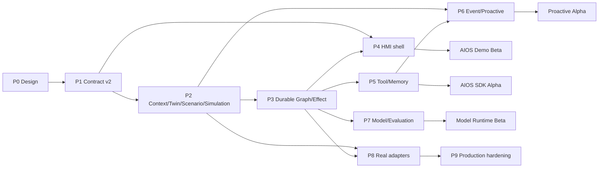

# Central Brain AIOS Stage 2 开发计划与最小工作包

版本：1.0

日期：2026-07-15

状态：Implementation backlog baseline

目标平台：黑盒 Android 13 座舱域控制器

主要语言：Java、AIDL、C；构建/验收脚本使用 Bash；Python AIOS 原型已退役且不得作为兼容参考或测试 oracle

## 1. 计划摘要

Stage 2 分为九个阶段。P0-P3 先交付可演示且可恢复的 AIOS 场景闭环，P4-P7 扩展成完整的 Tool/Memory/Event/Model 平台，P8 在外部条件满足后接真实车辆/NPU adapter，P9 做量产化加固。

| 阶段 | 目标 | 预计人日 | 外部依赖 | 出口版本 |
| --- | --- | ---: | --- | --- |
| P0 | 需求、调研、UX、详设、门禁冻结 | 6-8 | 无 | Design Baseline |
| P1 | typed Session/Plan/Event/Effect SDK 与 Room v4 | 12-16 | 无 | Runtime Contract v2 |
| P2 | Context/Digital Twin/Scenario/Simulated Effect | 20-26 | 无 | AIOS Demo Alpha |
| P3 | Durable Agent Graph、恢复、确认、补偿 | 18-24 | 无 | AIOS Demo Beta |
| P4 | Client2 产品化 HMI、驾驶态 UX、工程模式 | 12-16 | Client2 maintained patch pipeline | UX Beta |
| P5 | Tool/Skill 平台与分层 Memory | 24-32 | signer/update policy 的量产部分可延后 | AIOS SDK Alpha |
| P6 | Event Trigger、主动智能、跨模块消息 | 16-22 | 目标事件源可用性 | Proactive Alpha |
| P7 | Model Router、local/NPU/cloud profile、评测 | 16-24 | NPU SDK/云策略可延后 | Model Runtime Beta |
| P8 | AAOS/Vendor/NPU 真实 adapter | 20-40+ | OEM property/service/permission/ABI | Target Integration RC |
| P9 | 性能、长稳、安全、发布、OTA/回滚 | 30-45 | 生产 signer/MDM/整车测试 | Production Candidate |

估算基于 1 名熟悉当前仓库的 Android/系统工程师和 1 名可兼职测试工程师。P0-P7 总计约 124-168 人日；P8-P9 受厂商接口、签名、车辆权限和整车验证影响，不承诺固定完成日期。若 3 名开发并行且接口及时冻结，P0-P7 约 10-14 个日历周；单人串行约 6-8 个月。

## 2. 交付优先级

### 2.1 必须先完成的用户闭环

```text
HMI scenario request
 -> trusted ContextSnapshot
 -> deterministic ScenarioPlan
 -> Policy/Safety decision
 -> persistent approval when required
 -> durable multi-effect execution
 -> simulated VehicleDigitalTwin feedback
 -> action-by-action HMI timeline
 -> retry/partial failure/undo/restart recovery
```

这条闭环完成前，不优先扩展模型数量、联网 Agent 或动态插件。

### 2.2 依赖真实平台的后置工作

- AAOS `CarPropertyManager` 写权限；
- 标准/Vendor property 目录和 area mapping；
- 生产 signer、privileged permission、MDM/background policy；
- Vendor NPU userspace SDK、ABI、模型格式、内存和取消语义；
- 整车 Safety owner 对座椅/HVAC/主动触发策略的批准。

这些工作在 P8 前保持 interface/empty adapter，不阻塞 P0-P7 的仿真闭环。

Stage 2 设计和 P0-P7 用户态实现固定：`production_ready=false`、
`target_hardware_validated=false`、`driver_development_triggered=false`、
`virtualization_development_triggered=false`。只有 P8/P9 的独立目标证据和 owner 批准可以改变相应状态。

## 3. 派生需求编号

派生需求不是架构图的新顶层模块。每项必须映射回原有 Req ID。

| 派生 ID | 要求 | 基线 Req ID |
| --- | --- | --- |
| `S2-UX-001` | 面板显示 session、plan、node、effect 状态 | `APP-001`、`APP-004`、`XSC-001` |
| `S2-UX-002` | driving state 自适应布局和交互限制 | `APP-001`、`FW-S-005`、`NV-G-005` |
| `S2-UX-003` | approval/cancel/retry/undo/partial failure UX | `FW-U-004`、`FW-U-007`、`NV-G-005..007` |
| `S2-SES-001` | 持久 session 与 action/observation event tree | `FW-U-003`、`NV-F-001`、`NV-G-003`、`NV-G-007` |
| `S2-CTX-001` | 统一、带新鲜度和质量的 ContextSnapshot | `FW-U-001`、`FW-U-002`、`NV-F-004` |
| `S2-TWN-001` | desired/reported last-known Vehicle Digital Twin | `FW-U-001..003`、`NV-F-004`、`NV-G-006` |
| `S2-SCN-001` | 场景目录、模板、参数与确定性计划编译 | `APP-003`、`FW-S-001`、`NV-F-001` |
| `S2-GRF-001` | durable agent graph、retry/timeout/interrupt | `NV-F-001`、`NV-F-008`、`NV-G-004..007` |
| `S2-SAF-001` | risk、driving state、approval、capability 强制治理 | `FW-U-007`、`FW-S-005`、`NV-F-009`、`NV-G-005` |
| `S2-EFF-001` | 多 Effect prepare/dispatch/verify/reconcile/compensate | `FW-U-004`、`FW-S-003`、`NV-F-003..005`、`NV-G-006..007` |
| `S2-ADP-001` | HVAC/Seat/Nav/Media 仿真 adapter | `NV-F-003..005`、`DEL-001`、`DEL-005` |
| `S2-TOL-001` | Tool/Skill manifest、registry、rule、executor | `FW-U-006..008`、`NV-F-001`、`NV-G-001..006` |
| `S2-MEM-001` | working/profile/episodic memory + consent/retention | `FW-U-001`、`FW-U-006..007`、`NV-F-001`、`NV-G-005..007` |
| `S2-EVT-001` | typed event broker、cursor、trigger、backpressure | `FW-U-003`、`NV-P-006`、`NV-G-004..007` |
| `S2-MDL-001` | model provider/router/budget/fallback/evaluation | `APP-004`、`NV-F-001`、`NV-F-011..012`、`NV-G-004..007` |
| `S2-ADP-002` | production AAOS/Vendor/NPU adapter gate | `NV-F-003..005`、`NV-F-011`、`KH-003`、`KH-006`、`DEL-005` |
| `S2-OBS-001` | trace、metric、audit、scenario evaluation | `APP-009`、`NV-F-012`、`NV-G-007` |
| `S2-REL-001` | signer、升级、回滚、长稳和发布证据 | `NV-G-006..007`、`DEL-001`、`DEL-003..005` |

## 4. P0 设计冻结

### `P0-W01` 开源与行业证据基线

- 状态：`DONE`；预计/实际：2 人日；派生需求：全部。
- 交付：`CENTRAL_BRAIN_AIOS_OPEN_SOURCE_AND_INDUSTRY_RESEARCH.md`。
- DoD：记录项目 commit、源码入口、采纳/拒绝决策、AAOS/VSS/uProtocol 安全边界。
- 验证：Stage 2 文档检查器验证 commit marker、来源和结论标题。

### `P0-W02` 产品与 UX 基线

- 状态：`DONE`；预计/实际：2 人日；需求：`S2-UX-001..003`、`S2-SCN-001`、`S2-SAF-001`、`S2-EFF-001`。
- 交付：`CENTRAL_BRAIN_AIOS_STAGE2_PRODUCT_UX_PLAN.md`。
- DoD：“我累了/我冷了”均有 Context、计划图、Effect、失败/撤销、验收；moving seat recline 明确 fail closed。

### `P0-W03` 工程详设和 backlog

- 状态：`DONE`；预计/实际：2-4 人日；需求：全部。
- 交付：本文档、`CENTRAL_BRAIN_COMPLETE_SOFTWARE_DEVELOPMENT_DESIGN.md`、requirements/roadmap/deviation/issue 同步。
- DoD：每个计划模块有源码路径、接口、状态、依赖、测试和完成定义。

## 5. P1 Runtime Contract v2 与 Room v4

### `P1-W01` Session DTO/AIDL

- 状态：`NOT_STARTED`；1.5 人日；需求：`S2-SES-001`、`S2-UX-001`。
- 新增路径：`central-brain-sdk/src/main/aidl/com/centralbrain/sdk/session/`。
- 文件：`SessionRequest.aidl`、`SessionHandle.aidl`、`SessionSnapshot.aidl`、`SessionQuery.aidl`。
- 接口：`openSession`、`getSession`、`listSessions`、`cancelSession`。
- DoD：DTO 使用定长/有界字段；未知 enum/version fail closed；AIDL hash 更新。
- 测试：parcel round-trip、oversize reject、SDK disconnected/reconnect。

### `P1-W02` Plan/Node DTO/AIDL

- 状态：`NOT_STARTED`；1.5 人日；需求：`S2-SCN-001`、`S2-GRF-001`。
- 文件：`ScenarioPlan.aidl`、`PlanNode.aidl`、`NodeDependency.aidl`、`NodePolicy.aidl`。
- DoD：node type 只允许 allowlist；每个 node 含 timeout/retry/idempotency/required/compensation metadata。
- 测试：DAG schema validation、cycle/unknown type reject。

### `P1-W03` Typed Event DTO/AIDL

- 状态：`NOT_STARTED`；2 人日；需求：`S2-SES-001`、`S2-EVT-001`。
- 文件：`RuntimeEvent.aidl`、`ActionEvent.aidl`、`ObservationEvent.aidl`、`MessageEvent.aidl`、`EventPage.aidl`。
- 接口：`getEvents(sessionId, cursor, limit)`、`registerSessionCallback`。
- DoD：event immutable、UUID/timestamp/source/parent/schemaVersion 完整；page limit <= 100。
- 测试：ordering、parent validation、redaction、cursor replay。

### `P1-W04` Effect/Approval DTO 扩展

- 状态：`NOT_STARTED`；1.5 人日；需求：`S2-EFF-001`、`S2-SAF-001`、`S2-UX-003`。
- 文件：`EffectIntent.aidl`、`EffectObservation.aidl`、`ApprovalPrompt.aidl`、`UndoHandle.aidl`。
- DoD：状态区分 dispatched/delivered/applied/verified；approval 绑定 plan digest 和 Context version。
- 测试：stale approval reject、terminal transition table。

### `P1-W05` SDK facade v2

- 状态：`NOT_STARTED`；2 人日；需求：`S2-UX-001..003`、`XSC-001`。
- 修改：`CentralBrainClient.java`、`CentralBrainSdk.java`。
- 新增：`SessionClient.java`、`ScenarioClient.java`、`RuntimeEventListener.java`。
- DoD：UI 不需要操作 Binder primitive；death/reconnect 后可重新订阅 active session。
- 测试：fake Binder、callback race、close/reconnect idempotency。

### `P1-W06` Room v4 schema

- 状态：`NOT_STARTED`；2.5 人日；需求：`S2-SES-001`、`S2-GRF-001`、`S2-EFF-001`。
- 新增 entity：`SessionEntity`、`PlanEntity`、`PlanNodeEntity`、`RuntimeEventEntity`、`EffectObservationEntity`、`CompensationEntity`。
- 约束：FK、unique idempotency key、terminal state immutability、payload size limit。
- DoD：v3->v4 migration 不丢现有 durable task/effect；schema JSON committed。
- 测试：migration fixture、crash transaction、query index plan。

### `P1-W07` Contract v2 aggregate check

- 状态：`NOT_STARTED`；1 人日；需求：P1 全部。
- 新增：`tools/check_central_brain_runtime_contract_v2.sh`。
- DoD：AIDL API/hash、Room schema、SDK tests 和 forbidden fallback 一次校验。

## 6. P2 Context、Digital Twin、Scenario 与仿真 Effect

### `P2-W01` Canonical vehicle signal types

- 状态：`NOT_STARTED`；1.5 人日；需求：`S2-CTX-001`、`S2-TWN-001`。
- 新增包：`runtime-service/.../vehicle/schema/`。
- 类：`VehicleSignalPath`、`SignalValue`、`SignalQuality`、`SignalSource`、`SignalTimestamp`。
- DoD：path allowlist、typed scalar、unit、area、freshness；禁止 arbitrary object。
- 测试：VSS path/area/unit validation、stale/invalid quality。

### `P2-W02` Vehicle capability catalog

- 状态：`NOT_STARTED`；1.5 人日；需求：`S2-TWN-001`、`S2-ADP-001`。
- 类：`VehicleCapability`、`CapabilityCatalog`、`CapabilityAvailability`。
- 初始 capability：HVAC temperature/power/fan、seat heating/ventilation/recline、media playback、navigation POI。
- DoD：每项声明 readable/writable/simulatable/productionAuthorized 和 target ranges。

### `P2-W03` VehicleDigitalTwinStore

- 状态：`NOT_STARTED`；2.5 人日；需求：`S2-TWN-001`。
- 类：`VehicleDigitalTwinStore`、`DigitalTwinSnapshot`、`DesiredStateRecord`、`ReportedStateRecord`。
- DoD：thread-safe、monotonic revision、desired/reported 分离、TTL/quality、snapshot atomicity。
- 测试：concurrent update、stale rejection、desired/report reconciliation。

### `P2-W04` ContextSnapshotBuilder

- 状态：`NOT_STARTED`；2 人日；需求：`S2-CTX-001`、`S2-SAF-001`。
- 类：`ContextSnapshotBuilder`、`ContextFieldPolicy`、`ContextSnapshot`。
- 输入：Digital Twin、Runtime state、seat zone、profile memory availability。
- DoD：关键 safety field 缺失进入 restricted；snapshot 有 digest/version/freshness report。

### `P2-W05` Scenario manifest/schema

- 状态：`NOT_STARTED`；2 人日；需求：`S2-SCN-001`。
- 新增：`runtime-service/src/main/assets/scenarios/*.json`。
- 类：`ScenarioManifest`、`ScenarioManifestParser`、`ScenarioCatalog`。
- DoD：JSON schema、version、supported zones、required context/capabilities、plan template、risk、fallback、UI metadata。
- 测试：unknown field policy、oversize、duplicate ID、invalid DAG。

### `P2-W06` DeterministicScenarioResolver

- 状态：`NOT_STARTED`；2 人日；需求：`S2-SCN-001`。
- 类：`ScenarioResolver`、`DeterministicScenarioResolver`、`ScenarioResolution`。
- DoD：按钮 ID 直接解析，不依赖模型；文本意图只选择已注册场景，不创建 capability。
- 测试：cold/fatigue/rest branches、unknown intent。

### `P2-W07` ScenarioPlanCompiler

- 状态：`NOT_STARTED`；3 人日；需求：`S2-SCN-001`、`S2-GRF-001`。
- 类：`ScenarioPlanCompiler`、`PlanGraphValidator`、`PlanDigest`。
- DoD：Context branch、node dependencies、required/optional、approval、compensation 编译为 immutable DAG。
- 测试：golden plan、cycle、unsafe moving seat node absent。

### `P2-W08` SimulatedVehicleAdapter base

- 状态：`NOT_STARTED`；1.5 人日；需求：`S2-ADP-001`、`S2-EFF-001`。
- 类：`SimulatedEffectAdapter`、`SimulationClock`、`FaultInjectionProfile`。
- DoD：debug/test build only；production source set 不注册；支持 delay/timeout/failure/readback mismatch。

### `P2-W09` Simulated HVAC adapter

- 状态：`NOT_STARTED`；1.5 人日；需求：`S2-ADP-001`。
- 类：`SimulatedHvacEffectAdapter`。
- DoD：range/zone/availability、desired/report delay、idempotency、absolute target。
- 测试：success/timeout/out-of-range/retry/readback。

### `P2-W10` Simulated Seat adapter

- 状态：`NOT_STARTED`；2 人日；需求：`S2-ADP-001`、`S2-SAF-001`。
- 类：`SimulatedSeatEffectAdapter`。
- DoD：heat/vent/recline；recline 再次检查 fresh safety state；moving permanently rejects.
- 测试：parked approval、moving reject、belt change race、partial progress。

### `P2-W11` Simulated Media/Nav adapters

- 状态：`NOT_STARTED`；2 人日；需求：`S2-ADP-001`。
- 类：`SimulatedMediaEffectAdapter`、`SimulatedNavigationEffectAdapter`。
- DoD：只模拟 state/observation，不启动未知第三方 Activity；接口可替换。

### `P2-W12` Debug Context Controller

- 状态：`NOT_STARTED`；1.5 人日；需求：`S2-CTX-001`、`S2-ADP-001`。
- 类：`DebugSimulationController`，debug AIDL/service endpoint。
- DoD：仅 debug signer/capability 可调用；production build 不含 exported controller。

## 7. P3 Durable Agent Graph 与 Effect 闭环

### `P3-W01` AgentGraphRuntime state machine

- 状态：`NOT_STARTED`；3 人日；需求：`S2-GRF-001`。
- 类：`AgentGraphRuntime`、`GraphRunState`、`NodeRunState`、`NodeExecutorRegistry`。
- 状态：CREATED/PLANNING/WAITING/EXECUTING/PARTIAL/COMPENSATING/COMPLETED/FAILED/CANCELLED/STUCK。
- DoD：只有合法 transition；单 session FIFO；不同 session 可按 supervisor 并发。

### `P3-W02` Typed node executors

- 状态：`NOT_STARTED`；3 人日；需求：`S2-GRF-001`、`S2-SAF-001`、`S2-EFF-001`。
- executor：Context、Policy、ApprovalInterrupt、Effect、Verification、Summary、Compensation。
- DoD：registry allowlist；executor 不反序列化任意类；input/output schema 固定。

### `P3-W03` CheckpointSerializer

- 状态：`NOT_STARTED`；2 人日；需求：`S2-GRF-001`。
- 类：`CheckpointSerializer`、`JsonPrimitiveCheckpointSerializer`、`CheckpointEnvelope`。
- DoD：allowlist type/version、size/depth limit、digest；拒绝 Java serialization。
- 测试：malformed/unknown/oversize/security corpus。

### `P3-W04` Retry/Timeout policy

- 状态：`NOT_STARTED`；1.5 人日；需求：`S2-GRF-001`、`NV-G-004`。
- 类：`NodeRetryPolicy`、`NodeTimeoutPolicy`、`BackoffCalculator`。
- DoD：bounded attempts/deadline/jitter；Effect retry 需要 idempotency key。

### `P3-W05` Durable approval interrupt

- 状态：`NOT_STARTED`；2 人日；需求：`S2-SAF-001`、`S2-UX-003`。
- 类：`ApprovalInterruptExecutor`、`ApprovalResumeValidator`。
- DoD：approval 绑定 caller/plan/context/policy digest 和 expiry；resume 时重新检查 Safety State。

### `P3-W06` EffectCoordinator

- 状态：`NOT_STARTED`；3 人日；需求：`S2-EFF-001`。
- 类：`EffectCoordinator`、`EffectBatch`、`EffectDependencyPlanner`、`AdapterRegistry`。
- DoD：prepare-all before dispatch required effects；并发无冲突；每项独立 observation。

### `P3-W07` Effect verification/reconciliation

- 状态：`NOT_STARTED`；2 人日；需求：`S2-EFF-001`、`S2-TWN-001`。
- 类：`EffectVerifier`、`DigitalTwinEffectReconciler`。
- DoD：delivered/applied/verified 分开；unknown state 定时 reconcile；不重复 dispatch verified effect。

### `P3-W08` Compensation/Undo

- 状态：`NOT_STARTED`；2 人日；需求：`S2-EFF-001`、`S2-UX-003`。
- 类：`CompensationPlanner`、`UndoService`。
- DoD：before snapshot、TTL、new governed task、reverse dependency order；不可逆动作不宣称可撤销。

### `P3-W09` Restart recovery

- 状态：`NOT_STARTED`；2.5 人日；需求：`S2-SES-001`、`S2-GRF-001`、`S2-EFF-001`。
- 类：`GraphRestartReconciler`。
- DoD：恢复 WAITING/EXECUTING/UNKNOWN；先 reconcile 再继续；process death test 无重复副作用。

## 8. P4 Client2 产品化 HMI

### `P4-W01` Bridge session API migration

- 状态：`NOT_STARTED`；2 人日；需求：`S2-UX-001`、`XSC-001`。
- 修改：`Client2ScenarioBridge.java`、`ScenarioCallback.java`。
- DoD：从单 reply callback 迁移为 session/event stream；旧 API 只保留兼容层。

### `P4-W02` Panel state reducer

- 状态：`NOT_STARTED`；2 人日；需求：`S2-UX-001..003`。
- 新增 maintained Java source：`CentralBrainPanelState.java`、`CentralBrainPanelReducer.java`。
- DoD：UI state 只由 immutable event reduce；旋转/recreate/reconnect 不丢 timeline。

### `P4-W03` Plan timeline UI

- 状态：`NOT_STARTED`；2 人日；需求：`S2-UX-001`。
- 修改 maintained XML/smali generation inputs，不手改 build/reverse output。
- DoD：每 node/effect 显示 pending/running/waiting/verified/failed/skipped。

### `P4-W04` Approval/Undo/Partial UX

- 状态：`NOT_STARTED`；2 人日；需求：`S2-UX-003`。
- DoD：approval reason/expiry，partial result，retry failed，undo verified；outside dismiss 不取消 session。

### `P4-W05` Driving restriction renderer

- 状态：`NOT_STARTED`；1.5 人日；需求：`S2-UX-002`。
- 类：`DrivingUxPolicy`、`PanelPresentationMode`。
- DoD：unknown treated restricted；moving 隐藏长文本/参数；Runtime policy 独立存在。

### `P4-W06` Engineer simulation drawer

- 状态：`NOT_STARTED`；1.5 人日；需求：`S2-ADP-001`、`S2-OBS-001`。
- DoD：debug-only；可设置 Context/故障；无原始设备标识导出。

### `P4-W07` Device UI acceptance

- 状态：`NOT_STARTED`；2-4 人日；需求：P4 全部。
- DoD：Android 13 ARM64 实机 P0 场景、导航显示/隐藏、outside dismiss、restart、partial/undo 通过；截图/UI tree 脱敏。

## 9. P5 Tool/Skill 与 Memory

### `P5-W01` Tool manifest/schema

- 状态：`NOT_STARTED`；2 人日；需求：`S2-TOL-001`。
- 类：`ToolManifest`、`ToolSchemaValidator`；字段包含 ID/version/input/output/capability/risk/timeout/idempotency/health。

### `P5-W02` ToolRegistry/Resolver

- 状态：`NOT_STARTED`；2 人日；需求：`S2-TOL-001`。
- DoD：registered/resolved/usable 分离；版本冲突 deterministic；unhealthy tool 不可执行。

### `P5-W03` ToolRuleSolver

- 状态：`NOT_STARTED`；2.5 人日；需求：`S2-TOL-001`、`S2-SAF-001`。
- 规则：init/child/conditional/terminal/required-before-exit/requires-approval。
- DoD：模型选择结果与规则允许集合取交集，空集 fail closed。

### `P5-W04` ToolExecutor boundary

- 状态：`NOT_STARTED`；3 人日；需求：`S2-TOL-001`。
- 类：`ToolExecutor`、`InProcessBuiltInToolExecutor`、`ToolInvocationContext`。
- DoD：首版仅 signed built-in/allowlist；deadline/cancel/output limit/audit；不实现 OS 虚拟化。

### `P5-W05` Skill package verifier

- 状态：`NOT_STARTED`；3 人日；需求：`S2-TOL-001`、`FW-U-008`。
- 类：`SkillArtifactVerifier`、`SkillSignerPolicy`、`SkillVersionPolicy`。
- DoD：hash/signer/manifest/runtime version/capability static check；量产动态 load 保持 false 直到 owner 批准。

### `P5-W06` WorkingMemoryStore

- 状态：`NOT_STARTED`；2 人日；需求：`S2-MEM-001`。
- DoD：session-scoped、TTL、byte/token/item limit、terminal cleanup。

### `P5-W07` ProfileMemoryStore

- 状态：`NOT_STARTED`；3 人日；需求：`S2-MEM-001`、`S2-SAF-001`。
- DoD：explicit consent、field allowlist、read/update/delete/export、seat/user scope、encryption-at-rest owner gate。

### `P5-W08` EpisodicMemoryStore

- 状态：`NOT_STARTED`；2.5 人日；需求：`S2-MEM-001`。
- DoD：只存场景摘要/结果，不存原始连续信号；retention/capacity/erase。

### `P5-W09` ContextBudgetManager

- 状态：`NOT_STARTED`；2 人日；需求：`S2-MEM-001`、`S2-MDL-001`。
- DoD：按 system/context/profile/episode/history 分配预算；超限 deterministic truncate/summarize。

### `P5-W10` Memory consent HMI/API

- 状态：`NOT_STARTED`；2 人日；需求：`S2-MEM-001`、`S2-UX-003`。
- DoD：用户可查看来源、关闭记忆、清除偏好；moving 状态不可执行复杂管理。

## 10. P6 Event 与主动智能

### `P6-W01` EventBroker interface/in-process implementation

- 状态：`NOT_STARTED`；3 人日；需求：`S2-EVT-001`。
- 类：`EventBroker`、`InProcessDurableEventBroker`、`EventSubscription`。
- DoD：typed topic、cursor、bounded replay、filter、identity/policy；不宣称 DDS。

### `P6-W02` Backpressure/QoS

- 状态：`NOT_STARTED`；2 人日；需求：`S2-EVT-001`、`NV-G-004`。
- 策略：drop-old/coalesce/reject/disconnect；关键 Action Observation 不允许静默 drop。

### `P6-W03` TriggerRule manifest/engine

- 状态：`NOT_STARTED`；3 人日；需求：`S2-EVT-001`、`S2-SCN-001`。
- 类：`TriggerRule`、`TriggerEngine`、`CooldownStore`。
- DoD：deterministic threshold/window/debounce/cooldown；输出 suggestion，不直接 Effect。

### `P6-W04` Proactive consent/policy

- 状态：`NOT_STARTED`；2 人日；需求：`S2-SAF-001`、`S2-MEM-001`。
- DoD：auto-execute grant 有 scenario/capability/zone/TTL；HIGH/CRITICAL 不允许通用 grant。

### `P6-W05` Context source adapters

- 状态：`NOT_STARTED`；3 人日；需求：`S2-CTX-001`、`S2-EVT-001`。
- 首批：Runtime health、simulated vehicle signal、time；真实 vehicle source 后置 P8。

### `P6-W06` Active suggestion UX

- 状态：`NOT_STARTED`；2 人日；需求：`S2-UX-002`。
- DoD：why/cooldown/never ask；moving banner/voice minimal；suggestion 合并。

## 11. P7 Model Runtime 与评测

### `P7-W01` ModelRequest/Result v2

- 状态：`NOT_STARTED`；2 人日；需求：`S2-MDL-001`。
- 字段：purpose、privacyClass、latencyBudget、tokenBudget、requiredCapability、fallbackPolicy、traceId。

### `P7-W02` ModelProviderRegistry/health

- 状态：`NOT_STARTED`；2 人日；需求：`S2-MDL-001`。
- provider：deterministic Android test provider、可选 Android 本地开发 provider、vendor NPU placeholder、cloud placeholder。
- DoD：production readiness 与 test availability 分离。

### `P7-W03` PolicyAwareModelRouter

- 状态：`NOT_STARTED`；3 人日；需求：`S2-MDL-001`、`S2-SAF-001`。
- DoD：隐私/网络/热/延迟/能力/配额决策；fallback bounded；模型不可改变 action authorization。

### `P7-W04` LocalModelProvider

- 状态：`NOT_STARTED`；2.5 人日；需求：`S2-MDL-001`。
- DoD：Android 进程内本地开发 provider 支持 deadline/cancel/streaming limit；仅允许开发 profile，禁止作为生产路径或 Vendor NPU 的隐式回退。

### `P7-W05` Prompt/Output schema

- 状态：`NOT_STARTED`；2 人日；需求：`S2-MDL-001`。
- DoD：模型只返回 registered scenario/parameters/summary；JSON schema validation；未知 capability reject。

### `P7-W06` Scenario evaluation harness

- 状态：`NOT_STARTED`；3 人日；需求：`S2-MDL-001`、`S2-OBS-001`。
- 数据：脱敏 synthetic contexts；指标：intent accuracy、unsafe proposal rate、latency、fallback、token cost。

### `P7-W07` Resource/thermal admission

- 状态：`NOT_STARTED`；2 人日；需求：`S2-MDL-001`、`NV-G-004`。
- DoD：复用 `InferenceResourceScheduler`；foreground vehicle task priority；过热/资源不足降级。

## 12. P8 真实目标 Adapter

P8 每个 adapter 都必须单独立项，禁止打包成“接一下 VHAL”。

### `P8-W01` Target capability discovery

- 状态：`EXTERNAL_BLOCKED`；2-5 人日；需求：`S2-ADP-002`。
- 输入：公开 `CarPropertyManager` list、Vendor service AIDL/API、permission/signature 文档。
- DoD：property/service/area/type/read-write/permission/owner/version matrix；不访问私有 node。

### `P8-W02` VSS to AAOS mapping

- 状态：`EXTERNAL_BLOCKED`；3-6 人日；需求：`S2-ADP-002`。
- 交付：versioned mapping file、unit/area conversion、unsupported list。
- DoD：优先 standard property；vendor property 有正式 owner/version。

### `P8-W03` AaosCarPropertyEffectAdapter

- 状态：`EXTERNAL_BLOCKED`；5-10 人日；需求：`S2-ADP-002`。
- DoD：async result/readback、permission failure、binder death/reconnect、idempotency、rollback；activation gate 默认 false。

### `P8-W04` Vendor service adapter

- 状态：`EXTERNAL_BLOCKED`；按接口 5-15 人日；需求：`S2-ADP-002`。
- DoD：仅基于公开 SDK/AIDL；binder identity、death、version、timeout、error mapping。

### `P8-W05` Vendor NPU provider

- 状态：`EXTERNAL_BLOCKED`；10-20+ 人日；需求：`S2-MDL-001`、`S2-ADP-002`。
- DoD：vendor SDK lifecycle、model load/unload/infer/cancel/health、memory ownership、timeout、thermal、fallback；无 Driver/HAL 修改除非公开环境明确缺口。

### `P8-W06` Production activation evidence

- 状态：`EXTERNAL_BLOCKED`；3-6 人日；需求：`S2-ADP-002`、`DEL-005`。
- DoD：owner/ABI/permission/safety/smoke/rollback evidence 完整后才打开单 capability feature flag；不可全局打开。

## 13. P9 加固与发布

### `P9-W01` Performance budgets

- 3 人日；`S2-OBS-001`。定义/验证 binder latency、plan latency、effect dispatch、DB size、memory、CPU、startup。

### `P9-W02` 72h stability and fault matrix

- 5-8 人日；`S2-REL-001`。循环场景、adapter death、Runtime restart、storage pressure、callback churn、network loss。

### `P9-W03` Security review/fuzz

- 6-10 人日；`S2-SAF-001`、`S2-TOL-001`。AIDL/manifest/checkpoint/schema fuzz，caller spoof，replay，oversize，path traversal，signature policy。

### `P9-W04` Privacy/data lifecycle

- 4-6 人日；`S2-MEM-001`。consent、retention、delete/export、redaction、audit data classification。

### `P9-W05` Production signer/upgrade/rollback

- 4-8 人日；`S2-REL-001`。same-signer upgrade、DB migration、APK set compatibility、rollback decision、data compatibility。

### `P9-W06` Driver distraction/vehicle safety acceptance

- 5-8 人日；`S2-UX-002`、`S2-SAF-001`。真实 driving state、UX restriction、seat/HVAC policy、OEM owner sign-off。

### `P9-W07` Release evidence and field diagnostics

- 3-5 人日；`S2-OBS-001`、`S2-REL-001`。版本、commit、hash、signer、脱敏 diagnostics、issue/retest workflow。

## 14. 依赖图



## 15. 每轮开发规则

每个自动连续增量仍只完成一个可验证工作包：

1. `git status`，读取固定架构/路线图/偏差/问题/交付/Driver 文档；
2. 从当前阶段选择最前面的未阻塞 work package；
3. 在 commit/PR 描述中列出派生 ID 和基线 Req ID；
4. 只编辑该 work package 所需源码、测试、文档和 checker；
5. 单元测试、模块测试、聚合 checker、`git diff --check`；
6. 更新本 backlog 状态、Roadmap、Deviation/Issue；
7. 小 commit，保持 `production_ready=false`、`target_hardware_validated=false`，除非有独立批准的目标证据；
8. 下一轮自动选择下一 work package，不等待确认。

## 16. 阶段性完成定义

### AIOS Demo Alpha 完成

- P1、P2 全部 DONE；
- HMI 能展示 deterministic plan 和 simulated HVAC/Seat/Nav/Media 状态；
- moving fatigue plan 无 seat recline；
- 无真实 Driver/HAL/NPU 访问。

### AIOS Demo Beta 完成

- P3、P4 全部 DONE；
- approval、partial failure、retry、undo、restart recovery 真机通过；
- 同一 Effect 不因恢复重复执行；
- Client2 只通过 SDK/Binder 与 Runtime 交互。

### Complete AIOS Prototype 完成

- P0-P7 全部 DONE；
- Tool/Skill、分层 Memory、Event Trigger、Model Router/evaluation 闭环；
- 所有 production adapter 仍可为 inactive empty interface，但接口、激活门禁和测试完整；
- 文档状态与代码一致。

### Target Integration RC 完成

- P8 所需 capability 分项通过，不要求一次接入所有车辆能力；
- 每个 activated adapter 有公开 contract、权限、owner、smoke、fault、rollback 证据；
- 未接入 capability 继续明确为 unavailable，不使用仿真伪装量产结果。

### Production Candidate 完成

- P9 全部通过；
- 生产 signer/升级/回滚、长稳、性能、安全、隐私、驾驶分心和整车策略有 owner 签署；
- 只有此时才可评估 `production_ready=true`。
