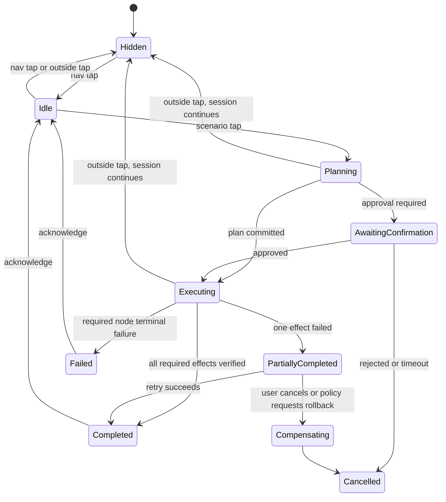
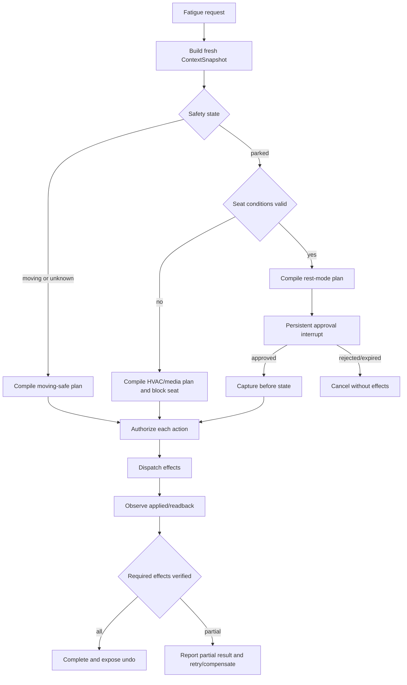

# Central Brain AIOS Stage 2 产品与 UI/UX 计划

版本：1.0

日期：2026-07-15

状态：Approved for implementation planning

输入：架构图需求基线、当前 Client2 演示、`CENTRAL_BRAIN_AIOS_OPEN_SOURCE_AND_INDUSTRY_RESEARCH.md`

映射需求：`APP-001`、`APP-003`、`APP-004`、`FW-U-001`、`FW-U-003..007`、`FW-S-001..005`、`NV-F-001`、`NV-F-003..005`、`NV-F-008..012`、`NV-G-003..007`、`NV-P-002`、`XSC-001..006`、`DEL-001`、`DEL-003..005`

## 1. 产品目标

Stage 2 的目标不是把聊天窗口做得更复杂，而是让用户看到 AIOS 的四个核心特征：

1. **理解上下文**：同一句“我累了”会根据车速、挡位、座椅占用、安全带、时间和用户偏好生成不同计划；
2. **编排多能力**：一次请求可组合空调、座椅、媒体、导航等多个受治理动作；
3. **过程可见且可控**：用户能看到计划、确认高风险动作、观察每项动作状态并撤销可逆动作；
4. **失败可恢复**：部分失败、Runtime 重启、adapter 暂不可用时不谎报成功，能够重试、降级或补偿。

## 2. 非目标

- 不把模型回复当作车辆已执行的证据；
- 不在普通 APK 中实现或修改厂商 VHAL、framework、Driver/HAL；
- 不因演示需要绕过 signature permission、Safety State 或 Effect activation gate；
- 不在行驶状态执行驾驶席大角度后仰/放平；
- 不开发虚拟机或 Hypervisor；
- 不在本阶段开放公网动态 Skill/MCP 下载；
- 不将 Client2 逆向工程产物定义为量产 HMI 源码。

本设计增量状态边界：`production_ready=false`、`target_hardware_validated=false`、
`driver_development_triggered=false`、`virtualization_development_triggered=false`。UI 中出现的
HVAC/Seat/Nav/Media 结果在 P0-P7 只能来自明确标注的 simulation profile。

## 3. 目标用户与使用环境

| 角色 | 主要目标 | UI 形态 | 允许操作 |
| --- | --- | --- | --- |
| 驾驶员 | 最少分心地触发舒适/休息场景 | 行驶态精简面板、语音优先 | 低风险场景、确认驻车后动作 |
| 前排乘员 | 独立舒适与娱乐 | 乘员席面板 | 受座位/区域策略约束的 seat/HVAC/media |
| 驻车用户 | 查看完整计划、偏好、历史和调试信息 | 展开面板 | 参数编辑、记忆授权、详细结果、撤销 |
| 座舱工程师 | 验证 Runtime/Policy/Effect/Adapter | 工程模式 diagnostics | 选择仿真状态、注入故障、导出脱敏证据 |
| OEM 集成工程师 | 替换仿真 adapter、配置权限与映射 | 配置/测试工具 | 不直接面向终端用户 |

## 4. 驾驶状态与全局 UX 规则

### 4.1 驾驶状态

```text
PARKED
IDLE
MOVING_RESTRICTED
UNKNOWN_RESTRICTED
FAULT_RESTRICTED
```

状态来源为 `SafetyVehicleStateProvider` 和 `VehicleDigitalTwin`。任意关键输入缺失、陈旧或冲突时进入 `UNKNOWN_RESTRICTED`，行为按行驶态处理。

### 4.2 UI 限制矩阵

| 能力 | PARKED | IDLE | MOVING_RESTRICTED | UNKNOWN/FAULT |
| --- | --- | --- | --- | --- |
| 场景快捷按钮 | 全量 | 全量 | 最多 4 个常用项 | 仅低风险项 |
| 长文本回复 | 可展开 | 可展开 | 仅一行摘要 | 仅错误/降级摘要 |
| 参数编辑 | 允许 | 限制 | 禁止 | 禁止 |
| 多步骤确认 | 允许 | 单步骤 | 单步骤且仅低/中风险 | 仅取消/关闭 |
| 驾驶席大角度座椅动作 | 驻车安全条件满足后确认 | 禁止 | 禁止 | 禁止 |
| 计划详情 | 完整 | 摘要 | 进度图标 | 最小错误状态 |
| 工程诊断 | 工程模式 | 工程模式 | 禁止 | 驻车后可用 |

### 4.3 全局交互规则

- 底部 Central Brain 导航按钮单击显示/隐藏悬浮面板；
- 点击面板外区域隐藏面板，不取消正在运行的场景；
- 面板隐藏后，底部按钮以小型状态点显示 running/waiting/error；
- 再次打开时恢复同一 session 和事件时间线；
- 同一座位同一 actuator 的冲突场景不能并发，后到请求进入 replace/queue/reject 决策；
- 任何模型生成文本均使用“建议/计划”语气，只有 verified Effect 可使用“已完成”；
- 所有用户可见动作必须提供来源：系统规则、用户请求、已保存偏好或主动触发。

## 5. 悬浮面板信息架构

### 5.1 正常布局

```text
+----------------------------------+
| Central Brain  [状态]       [关闭] |
| [我冷了] [我热了] [我累了] [休息] |
|----------------------------------|
| 计划：休息建议                    |
| [✓] 读取车辆状态                  |
| [●] 调整温度到 23 C               |
| [ ] 查找最近休息区                |
| [!] 座椅放平：驻车后可用           |
|----------------------------------|
| 需要确认：驻车后进入休息模式       |
| [取消]                    [确认]   |
|----------------------------------|
| 回复/摘要                         |
| ...                              |
| [撤销可逆动作]                    |
+----------------------------------+
```

### 5.2 组件拆分

| UI 模块 | 最小组件 | 输入 | 输出 |
| --- | --- | --- | --- |
| `BrainNavEntry` | icon、状态点、badge | active session summary | toggle event |
| `BrainOverlay` | scrim、panel、outside touch | visibility state | dismiss request |
| `ScenarioQuickGrid` | 2xN icon button | available scenario list | scenario request |
| `SessionHeader` | title、runtime state、cancel | session summary | cancel/open detail |
| `PlanTimeline` | node row list | plan + node state | inspect node |
| `EffectRow` | device icon、target、state | effect observation | retry/inspect |
| `ApprovalBar` | risk、reason、timeout | approval request | approve/reject |
| `AssistantSummary` | concise text、expand | model/system message | expand/collapse |
| `UndoBar` | undoable action count | compensation plan | undo request |
| `FaultBanner` | fault code、next action | terminal/recoverable fault | retry/dismiss |
| `EngineerDrawer` | mock context、fault injection | debug entitlement | test command |

### 5.3 UI 状态



## 6. “我累了”场景详设

场景 ID：`scene.fatigue.assist.v1`

派生需求：`S2-UX-001`、`S2-SCN-001`、`S2-EFF-001`、`S2-SAF-001`

基线映射：`APP-001`、`APP-003`、`FW-U-001`、`FW-U-004`、`FW-U-006`、`FW-U-007`、`FW-S-001`、`FW-S-005`、`NV-F-001`、`NV-F-003..005`、`NV-G-005..007`

### 6.1 Context 输入

| 字段 | 类型 | 新鲜度 | 缺失处理 |
| --- | --- | --- | --- |
| `vehicle.motionState` | enum | 500 ms | restricted |
| `vehicle.gear` | enum | 500 ms | restricted |
| `vehicle.speedKph` | float | 500 ms | restricted |
| `seat.driver.occupied` | boolean | 2 s | 禁止驾驶席动作 |
| `seat.driver.beltBuckled` | boolean | 2 s | 禁止放平 |
| `seat.driver.reclineDeg` | float | 2 s | 不执行相对动作，只允许绝对 target |
| `cabin.temperatureC` | float | 10 s | 使用 conservative default，不自动大幅调温 |
| `hvac.power` | boolean | 10 s | unavailable 时降级 |
| `navigation.routeActive` | boolean | 5 s | 可省略导航动作 |
| `user.driver.restPreference` | profile block | session | 无偏好时使用模板默认值 |
| `local.time` | timestamp | 1 min | 只影响建议，不影响安全门禁 |

### 6.2 分支规则

#### A. 行驶中

前置：`motionState=MOVING` 或状态未知。

计划：

1. 设置舱温到用户舒适区，单次变化不超过策略阈值；
2. 可开启驾驶席通风或低档按摩，前提是目标 vehicle capability 可用且 OEM 策略允许；
3. 降低非关键媒体音量或播放提神列表，用户偏好允许时执行；
4. 请求导航查找路线附近休息区并给出建议；
5. 明确显示“行驶中不会调整驾驶席靠背”；
6. 若 DMS/ADAS 公开服务报告严重疲劳，只发布安全提醒/停车建议，不接管驾驶。

禁止：驾驶席 recline/position 大动作、复杂参数编辑、连续长文本。

#### B. 已驻车但安全带未解开

计划：先提示解开安全带。HVAC/media 可执行；座椅放平节点保持 `BLOCKED_BY_SAFETY_STATE`。安全带状态变化后重新构建 Context，不沿用旧授权。

#### C. 驻车且休息条件满足

前置：`PARKED`、挡位 P、速度 0、驾驶席占用、belt unbuckled、seat capability available。

计划：

1. 显示“休息模式”动作明细；
2. 对座椅目标角度、HVAC 目标温度、媒体动作进行一次明确确认；
3. 先记录可逆动作的 before snapshot；
4. 并行调节 HVAC 与媒体；
5. 座椅采用限速/分段 target，等待 adapter applied callback；
6. readback 验证 target tolerance；
7. 创建可撤销 compensation plan；
8. 返回简短完成摘要。

### 6.3 场景执行图



### 6.4 Effect 列表

| Effect ID | Capability | 风险 | moving | parked | 验证 |
| --- | --- | --- | --- | --- | --- |
| `fatigue.hvac.temperature` | `vehicle.hvac.temperature.set` | LOW/MEDIUM | 有界允许 | 允许 | reported temp target/tolerance |
| `fatigue.seat.ventilation` | `vehicle.seat.ventilation.set` | LOW | OEM 允许时 | 允许 | reported level |
| `fatigue.seat.massage` | `vehicle.seat.massage.set` | MEDIUM | 默认禁止，OEM 可配置 | 允许 | reported active |
| `fatigue.seat.recline` | `vehicle.seat.recline.set` | HIGH | 永久禁止 | 安全条件 + 确认 | reported angle/tolerance |
| `fatigue.media.playlist` | `media.playback.request` | LOW | 允许 | 允许 | player state |
| `fatigue.nav.rest_stop` | `navigation.poi.search` | LOW | 允许 | 允许 | route/POI observation |

### 6.5 UI 文案规则

- Planning：`正在根据车辆状态生成休息建议`；
- Moving：`行驶中已启用安全方案，不会调整驾驶席靠背`；
- Approval：`车辆已驻车。是否调整座椅至休息位置并设置空调？`；
- Partial：`空调已调整，座椅接口不可用；未执行座椅动作`；
- Verified：`休息模式已完成，可在 5 分钟内撤销座椅和空调设置`；
- Unknown：`无法确认车辆状态，已限制为低风险建议`。

### 6.6 验收条件

- 行驶/未知状态永远不产生可 dispatch 的驾驶席 recline Effect；
- 驻车 seat Effect 必须有 fresh Context、HIGH risk decision 和 durable approval；
- 点击确认前 `PendingEffectEntity` 不得进入 dispatchable；
- HVAC 成功、Seat 失败时 session 为 `PARTIALLY_COMPLETED`，不得显示全量完成；
- Runtime 被 force-stop 后可恢复 approval 或 execution timeline，不能重复执行已 verified Effect；
- 点击撤销生成新的 governed compensation task，不直接调用 adapter；
- 仿真和真实 adapter 使用同一 Effect contract 和 HMI 状态。

## 7. “我冷了”场景详设

场景 ID：`scene.comfort.cold.v1`

派生需求：`S2-UX-002`、`S2-SCN-002`、`S2-EFF-002`

基线映射：`APP-001`、`APP-003`、`FW-U-001`、`FW-U-004`、`FW-U-006`、`FW-S-001`、`FW-S-003`、`NV-F-003..005`

### 7.1 计划规则

1. 读取座位、分区温度、HVAC/seat heating capability 和用户偏好；
2. 目标温度优先使用 profile comfort band，否则以当前设定上调策略允许幅度；
3. 已占用座位且 seat heating 可用时请求低档加热；
4. 不自动开启前风挡除霜，除非 fog/dew Context 明确触发对应安全场景；
5. 所有动作显示独立进度，支持单项失败；
6. 记录 before state，允许撤销。

### 7.2 动作顺序

```text
context.read
  -> plan.compile
  -> policy.evaluate(hvac)
  -> policy.evaluate(seat_heat)
  -> effect.prepare(all)
  -> parallel[hvac.set, seat_heat.set]
  -> readback.verify
  -> summary.render
```

### 7.3 验收条件

- 没有 seat occupancy 时不加热该座位；
- capability unavailable 时仍可只执行 HVAC，并说明降级；
- 模型不可自行生成超出 policy range 的温度；
- 相同 target 的重复点击通过 idempotency 合并，不重复写入 adapter；
- readback 不一致时显示 `正在确认` 或失败，不显示完成。

## 8. Stage 2 场景目录

| 场景 ID | UI 名称 | Context | 主要动作 | 最高风险 | 首期 |
| --- | --- | --- | --- | --- | --- |
| `scene.comfort.cold.v1` | 我冷了 | 温度、占用、偏好 | HVAC、座椅加热 | MEDIUM | P0 |
| `scene.comfort.hot.v1` | 我热了 | 温度、占用、光照 | HVAC、通风、遮阳建议 | MEDIUM | P1 |
| `scene.fatigue.assist.v1` | 我累了 | motion/gear/belt/seat/time | HVAC、座椅、媒体、休息区 | HIGH | P0 |
| `scene.rest.nap.v1` | 休息模式 | parked/belt/occupancy | 座椅、HVAC、媒体、勿扰 | HIGH | P0 |
| `scene.commute.start.v1` | 通勤 | 时间、路线、天气、日程 | 导航、媒体、舒适 | MEDIUM | P1 |
| `scene.child.sleep.v1` | 儿童休息 | 后排占用、温度、媒体 | 后排温控、媒体、灯光 | HIGH | P2 |
| `scene.privacy.v1` | 隐私模式 | 用户/连接/摄像头状态 | 通知、麦克风/摄像头策略 | HIGH | P2 |
| `scene.charging.v1` | 充电休息 | SOC、充电、驻车 | HVAC、媒体、计时 | MEDIUM | P2 |
| `scene.defog.v1` | 除雾 | 湿度/玻璃状态 | HVAC/defrost | HIGH | P2，需要真实 capability |
| `scene.emergency.assist.v1` | 紧急协助 | crash/health/connectivity | 通知/呼叫/定位请求 | CRITICAL | 不在演示首期 |

CRITICAL 场景不能由通用模型模板直接上线，必须由 OEM 安全/法规 owner 单独评审。

## 9. 场景请求与结果契约

### 9.1 请求

```json
{
  "requestId": "uuid",
  "sessionId": "uuid",
  "scenarioId": "scene.fatigue.assist.v1",
  "source": "HMI_BUTTON",
  "seatZone": "ROW1_DRIVER",
  "locale": "zh-CN",
  "requestedAtMs": 0,
  "clientContextVersion": 1
}
```

HMI 不提交伪造的车速、挡位或安全带状态。Runtime 必须从受信 Context provider 读取这些字段。

### 9.2 计划摘要

```json
{
  "planId": "uuid",
  "planVersion": 1,
  "scenarioId": "scene.fatigue.assist.v1",
  "safetyState": "PARKED",
  "status": "WAITING_FOR_CONFIRMATION",
  "nodes": [],
  "approvals": [],
  "degradedCapabilities": [],
  "generatedAtMs": 0
}
```

### 9.3 用户可见结果

```json
{
  "sessionId": "uuid",
  "status": "PARTIALLY_COMPLETED",
  "summary": "空调已调整，座椅接口不可用",
  "verifiedEffects": ["effect-hvac"],
  "failedEffects": ["effect-seat"],
  "undoAvailable": true,
  "nextActions": ["RETRY_FAILED", "UNDO_VERIFIED", "DISMISS"]
}
```

## 10. 失败、补偿和撤销 UX

| 情况 | Runtime 决策 | UI 表现 | 用户操作 |
| --- | --- | --- | --- |
| adapter unavailable | node skipped/failed by required flag | `此车辆暂不支持` | 继续其他动作 |
| dispatch timeout | unknown + reconcile | `正在确认执行结果` | 等待/取消后续动作 |
| readback mismatch | retry or terminal failure | 显示目标/当前值 | 重试/保留当前 |
| policy changed during run | block pending nodes | `车辆状态变化，已停止后续动作` | 查看/关闭 |
| Runtime restart | restore checkpoint, reconcile outbox | `正在恢复上次任务` | 等待/取消 |
| partial success | `PARTIALLY_COMPLETED` | 每项独立状态 | 重试失败项/撤销成功项 |
| user undo | new compensation task | `正在恢复之前设置` | 取消未 dispatch 节点 |
| compensation fails | terminal observation | `部分设置无法恢复` | 显示人工处理建议 |

撤销不是数据库回滚。它是新的 ActionRequest，必须重新读取 Safety State、重新授权，并允许因当前状态变化而拒绝。

## 11. 主动智能 UX

Stage 2 后半程增加受控主动触发，规则如下：

- trigger 只创建 `ScenarioSuggestion`，默认不直接 dispatch Effect；
- 用户可将低风险、可逆场景设为“自动执行”，该授权有 scope、TTL 和 seat zone；
- 高频传感器事件先由 deterministic TriggerEngine 过滤，不能把原始流直接输入模型；
- 相同建议在 cooldown 内合并；
- moving 状态只使用语音/简短 banner，不弹出遮挡式 dialog；
- 所有主动建议提供“为什么出现”和“一段时间内不再提示”。

示例：舱温低于用户 comfort band 5 分钟，可提示“是否开启驾驶席加热”；不能只因模型推测用户冷了就自动执行。

## 12. 工程演示模式

工程模式仅 debug build 可见，至少支持：

- 切换仿真 `PARKED/MOVING/UNKNOWN`；
- 设置 cabin temperature、seat occupied、belt、adapter availability；
- 注入 HVAC timeout、Seat failure、readback mismatch、Runtime restart；
- 查看 session/plan/node/effect/event IDs；
- 一键重置仿真 Digital Twin；
- 导出脱敏 JSON summary，不包含 ADB serial、fingerprint、用户原文或车辆 payload。

工程模式命令同样进入 Runtime debug-only API，HMI 不能直接修改生产 Context provider。

## 13. 产品验收指标

### 13.1 功能

- P0 四个场景按钮均生成可视计划，不再只显示模型文本；
- “我累了”至少编排两个不同 capability，并按 driving state 产生不同计划；
- 每个 Effect 都有独立 lifecycle 和最终 observation；
- Runtime restart 后 session 不丢失、不重复执行；
- 用户确认、取消和撤销可追踪到 audit event。

### 13.2 体验

- 按钮到 skeleton plan 首帧小于 200 ms；
- deterministic P0 场景计划生成小于 500 ms，不依赖模型完成；
- 行驶态主要操作不超过一次点击；
- 状态文案不把 dispatched 误报为 completed；
- 面板隐藏/重开不丢失当前任务状态；
- partial failure 明确到设备和动作。

### 13.3 安全与隐私

- 安全状态未知时 fail closed；
- 行驶中驾驶席 recline dispatch 次数为 0；
- profile memory 默认关闭，显式授权后才写入；
- 所有 production adapter 默认 inactive；
- 模型输出不能生成未经 manifest 注册的 capability；
- 原始连续车身信号不写入会话长期记录。

## 14. 开发阶段

| 阶段 | 产品可见结果 | 依赖 |
| --- | --- | --- |
| UX-P0 | 冻结状态、场景、交互、文案、安全规则 | 本文档 |
| UX-P1 | Client2 面板显示 session/plan/action 状态 | SDK typed session/event API |
| UX-P2 | 仿真 HVAC/Seat/Nav/Media 可观察执行 | Digital Twin + Effect adapters |
| UX-P3 | “我冷了”“我累了”“休息模式”完整闭环 | Scenario/Graph/Policy/Approval |
| UX-P4 | partial failure、retry、undo、restart recovery | durable graph/reconcile |
| UX-P5 | 主动建议、偏好记忆和驾驶态精简 UI | Trigger/Memory/UX restriction |
| UX-P6 | 目标公开接口的真实 adapter 灰度激活 | OEM/Vendor contract + permission |

详细工程任务、路径、接口、测试和工作量见 `CENTRAL_BRAIN_AIOS_STAGE2_DEVELOPMENT_BACKLOG.md`。

## 15. Client2 中控 HVAC/Seat 界面闭环

用户确认空调和座椅必须成为 APK 中控屏可操作内容，而不是仅显示模型回复。现有右侧半透明悬浮
菜单因此扩展为“关怀/空调/座椅/执行”四视图；底部导航入口、二次点击关闭和面板外关闭保持。

手动 HVAC/Seat 控件与“我冷了”“我累了”“休息模式”必须复用 `ScenarioClient -> Governance ->
Durable Effect -> Adapter -> readback -> Runtime Event -> HMI reducer`。无真实车身信号时，Android
debug/test 使用持续标注 `SIMULATED` 的 Digital Twin；release/production 在 adapter 不可用时禁用
控件并显示 unavailable，不允许本地 View 动画或模拟 readback 冒充真实车辆动作。

空调首版包含 power、zone、temperature、fan、AUTO、A/C、SYNC、airflow 和 comfort preset；座椅
首版包含 zone、heating、ventilation、massage、recline 和 upright/comfort/rest preset。驾驶状态
UNKNOWN/MOVING 时驾驶席 recline 禁用且 Runtime fail closed；驻车动作仍需 fresh Context、policy、
approval 和 readback。

完整布局、状态模型、planned Java/Resource 文件、24-32 人日工作包和 20 项验收矩阵见
`CENTRAL_BRAIN_COCKPIT_HMI_CONTROL_LOOP_PLAN.md`。派生需求：`S2-HMI-001..005`。

中控闭环还覆盖所有场景 Effect 的可观察 projection：Media/Navigation 首版可在“执行”视图使用
通用状态卡，但场景涉及它们时必须显示目标、当前状态、source、失败和停止/取消，不能只在模型文本
中描述。Profile/Memory 偏好入口纳入 P5，主动建议 inbox 纳入 P6，模型澄清/降级纳入 P7；这些
后续界面同样不得绕过 Session/Governance/Effect 或用 View 状态伪造结果。

`cockpit_hvac_surface_implemented=false`、`cockpit_seat_surface_implemented=false`、
`cockpit_demo_control_loop_implemented=false`、`real_vehicle_effect_adapter_available=false`、
`driver_development_triggered=false`、`virtualization_development_triggered=false`。
