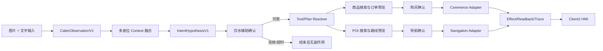

# 座舱饮水辅助多模态场景软件详设

版本：1.0

日期：2026-07-24

状态：`REQUIREMENT_DEFINED / SOFTWARE_OPEN`

工作包：`P4-R5a..P4-R5l`

Req IDs：`APP-001/003/004`、`S2-HMI-003/006/007/008/009`、`S2-CTX-001/002`、
`S2-TWN-001`、`S2-PER-001`、`S2-INT-001`、`S2-SCN-001`、`S2-GRF-001`、
`S2-SAF-001`、`S2-EFF-001`、`S2-ADP-001/002`、`S2-TOL-001`、`S2-NAV-001`、
`S2-COM-001`、`S2-MDL-001/002`、`S2-OBS-001/002`、`XSC-001/005/006`、
`DEL-001/003/004/005`。

## 1. 目的

本文把“处理一下”从固定图片触发固定 HVAC/Media 动作的演示，升级为一个可实现、可审计、可验收的
座舱多模态智能场景。目标场景为：

1. Android HMI 将当前座舱图片和文字“处理一下”提交给模型；
2. 系统提取座位占用和可见物体等事实；
3. 系统形成“后排乘员可能需要饮水”的候选假设；
4. 系统向驾驶员确认是否提供饮水帮助；
5. 确认后搜索饮用水商品以及可购买饮用水的便利店或服务区；
6. 系统生成订单预览和路线预览；
7. 下单与启动导航分别要求显式确认；
8. 当前无真实商户、支付和地图执行接口时，以明确的 `SIMULATED` UI 反馈完成演示闭环。

本文只定义并拆解软件需求，不宣称这些增量已经实现。

## 2. 现状与差距

当前 `P4-R4` 已具备文字加单图输入、OpenClaw/Ollama 真实模型交换、Client2 图片预览、模型回复、
白名单动作和模拟 Effect/Readback。当前实现存在以下确定差距：

| 差距 | 当前行为 | 本需求要求 |
| --- | --- | --- |
| 多模态语义 | 图片只作为模型附件 | 输出版本化、证据绑定的座舱观察 |
| 座位上下文 | 场景只支持 `ROW1_DRIVER`，仿真只写驾驶席占用 | 四座位独立占用、来源、时效、冲突和可信度 |
| 模型动作 | 必须包含 `hvac.ventilate`，可选 `media.pause` | 不预设 HVAC；先输出事实、假设和候选目标 |
| 意图判断 | 没有独立意图假设合同 | “饮水需求”必须是可拒绝、可确认的候选假设 |
| 场景计划 | 固定执行 HVAC/Media | 支持确认、搜索、预览、提交和导航分支 |
| 导航 | 只有不联网的合成 POI | 搜索、路线预览、启动导航三阶段分离 |
| 购买 | 无商品、订单或支付能力 | 搜索和订单预览可仿真；提交订单必须确认；支付保持空接口 |
| HMI | 显示模型输入/输出与固定执行链 | 显示事实、证据、假设、确认、工具、计划、执行和 readback |

## 3. 产品判断边界

### 3.1 可以直接使用的事实

对于当前受控图片，视觉模块可以产生以下候选事实，但必须带区域、证据和置信度：

- `ROW1_DRIVER` 可见乘员；
- `ROW1_PASSENGER` 可见乘员；
- `ROW2_RIGHT` 可见乘员；
- `ROW2_RIGHT` 乘员手部附近存在透明饮水容器。

座位方向必须以车辆坐标系为准，不得以图片左右坐标直接替代车辆区域。

### 3.2 禁止直接生成的结论

模型不得仅凭图片直接断言：

- 乘员是儿童、具体年龄、身份或家庭关系；
- 容器为空；
- 乘员口渴或明确希望购买饮用水；
- 驾驶员已经授权购买、支付或改变导航；
- 商户库存、价格、路线或车辆执行结果真实存在。

若产品测试必须验证“后排儿童需要饮水”，测试夹具必须把该信息作为显式场景标签或语音输入提供，不能把它
伪装成视觉事实。生产路径仍需由驾驶员确认。

### 3.3 自动化等级

| 操作 | 自动执行 | 是否确认 | 当前交付 |
| --- | --- | --- | --- |
| 解析可见事实 | 是 | 否 | 仓库软件待开发 |
| 形成饮水辅助假设 | 是 | 否 | 仓库软件待开发 |
| 向驾驶员提出饮水帮助 | 是 | 否 | 仓库软件待开发 |
| 搜索商品/POI | 驾驶员同意帮助后自动 | 第一次场景确认 | 仓库可做合成结果 |
| 生成订单预览 | 是 | 不形成副作用 | 仓库可做合成结果 |
| 提交订单 | 否 | 独立购买确认 | 量产接口为空 |
| 生成路线预览 | 是 | 不启动导航 | 仓库可做合成结果 |
| 启动导航 | 否 | 独立导航确认 | 量产接口为空 |
| 支付 | 否 | 独立且不可复用的支付确认 | 本阶段不实现 |

购买确认与导航确认不能合并，不能由同一个旧确认结果重放，不能由模型回复替代。

## 4. 总体调用关系



模型只生成 `Observation`、`Hypothesis` 和候选 `Goal`。Tool、Plan、Policy、Approval 和 Effect
继续由确定性 Runtime 边界负责。

## 5. 十二个模块

| 工作包 | 模块 | 类型 | 主要输出 | 当前状态 |
| --- | --- | --- | --- | --- |
| `P4-R5a` | 多模态输入元数据 | 修改 | `CabinFrameInputV2` | `SOFTWARE_OPEN` |
| `P4-R5b` | 座舱观察合同 | 新增 | `CabinObservationBatchV1` | `SOFTWARE_OPEN` |
| `P4-R5c` | 多座位 Context/Digital Twin 融合 | 修改 | `CabinOccupancyContextV1` | `SOFTWARE_OPEN` |
| `P4-R5d` | 模型 prompt 与结构化输出 | 修改 | `ModelSemanticProposalV2` | `SOFTWARE_OPEN` |
| `P4-R5e` | 意图假设解析器 | 新增 | `IntentHypothesisV1` | `SOFTWARE_OPEN` |
| `P4-R5f` | 场景目录与 Plan Graph | 修改 | `scene.cabin.hydration.assist.v1` | `SOFTWARE_OPEN` |
| `P4-R5g` | Safety/Governance/确认 | 修改 | `ConfirmationRequestV1` | `SOFTWARE_OPEN` |
| `P4-R5h` | Tool Registry/RuleSolver/Executor | 修改 | 工具选择与调用合同 | `SOFTWARE_OPEN` |
| `P4-R5i` | 导航适配器 | 修改 | POI、路线预览、导航提交 | `SOFTWARE_OPEN` |
| `P4-R5j` | 商业服务适配器 | 新增 | 商品、订单预览、订单提交 | `SOFTWARE_OPEN` |
| `P4-R5k` | 区域化末端执行组合 | 修改 | 仅面向已占用区域的受治理 Effect | `SOFTWARE_OPEN` |
| `P4-R5l` | Client2 HMI 与实时链路 | 修改 | 确认卡、座位事实、工具/执行/readback | `SOFTWARE_OPEN` |

测试、文档、指标和隐私检查是十二个工作包的横切验收要求，不作为第十三个运行模块。

## 6. 数据合同

### 6.1 `CabinFrameInputV2`

`P4-R5a` 在现有 `DevelopmentModelInput` 基础上增加版本化元数据。建议字段：

| 字段 | 类型 | 约束 |
| --- | --- | --- |
| `schemaVersion` | int | 固定为 2 |
| `sessionId` | UUID string | 绑定调用者 owner |
| `scenarioId` | string | 固定允许场景 |
| `inputText` | string | 最多 64 Unicode code points |
| `frameId` | UUID string | 单次帧身份 |
| `capturedAtEpochMs` | long | 必须为正 |
| `capturedAtElapsedMs` | long | 用于时效判断 |
| `sourceKind` | enum | `CONTROLLED_ASSET`、`ANDROID_PUBLIC_CAMERA`、`OEM_OMS` |
| `vehicleCoordinateSystem` | enum | 固定 `CABIN_V1` |
| `imageMimeType` | string | PNG/JPEG |
| `imageByteCount` | long | 单图不超过 6 MiB |
| `imageSha256` | lowercase hex | 64 字符 |
| `imageFd` | PFD | 一次消费、不可重放 |

`sourceKind` 只表达来源，不授予信任。`OEM_OMS` 在缺少 OEM 合同时必须返回 `SOURCE_UNAVAILABLE`。

### 6.2 `CabinObservationBatchV1`

`P4-R5b` 新增独立观察合同，禁止把自由文本描述直接送入执行层。

| 字段 | 类型 | 约束 |
| --- | --- | --- |
| `schemaVersion` | int | 固定为 1 |
| `frameId` | UUID string | 必须与输入一致 |
| `frameDigest` | SHA-256 | 不包含原图 |
| `observedAtElapsedMs` | long | 不早于接收时间 |
| `observations` | list | 最多 32 项 |
| `batchDigest` | SHA-256 | 覆盖排序后的规范字段 |

单项 `CabinObservationV1`：

| 字段 | 类型 | 允许值/约束 |
| --- | --- | --- |
| `observationId` | UUID string | 批次内唯一 |
| `kind` | enum | `SEAT_OCCUPANCY`、`VISIBLE_OBJECT`、`BODY_POSE_COARSE` |
| `seatZone` | enum | `ROW1_DRIVER`、`ROW1_PASSENGER`、`ROW2_LEFT`、`ROW2_RIGHT`、`UNKNOWN` |
| `state` | enum | `PRESENT`、`ABSENT`、`UNKNOWN`、`CONFLICT` |
| `objectClass` | enum | 首版仅 `DRINK_CONTAINER`、`UNKNOWN_OBJECT` |
| `confidencePermille` | int | 0..1000 |
| `evidenceRegion` | normalized rect | 每个坐标 0..10000 |
| `sourceKind` | enum | 继承输入来源 |
| `evidenceDigest` | SHA-256 | 覆盖区域和分类，不包含像素 |

不得增加姓名、年龄、性别、情绪、健康、家庭关系或身份字段。

### 6.3 `CabinOccupancyContextV1`

`P4-R5c` 将视觉观察与 `Vehicle.Cabin.Seat.IsOccupied` 融合：

| 字段 | 类型 | 说明 |
| --- | --- | --- |
| `revision` | long | 单调递增 |
| `seatZone` | enum | 一个记录对应一个座位 |
| `occupancyState` | enum | `OCCUPIED`、`EMPTY`、`UNKNOWN`、`CONFLICT` |
| `sourceMode` | enum | `SENSOR`、`VISION`、`FUSED`、`SIMULATED` |
| `trustLevel` | enum | 复用 Context 信任等级 |
| `freshnessState` | enum | `FRESH`、`STALE`、`MISSING` |
| `sourceEvidenceDigests` | list | 最多 4 个 digest |

融合规则：

1. 可信座椅传感器为 `OCCUPIED` 时，可确认该区域有人；
2. 仅视觉观察时状态可为 `OCCUPIED`，但信任等级不得高于 `DERIVED_UNVERIFIED`；
3. 可信传感器与视觉冲突时必须为 `CONFLICT`；
4. `UNKNOWN/CONFLICT/STALE` 不得授权区域化座椅动作；
5. 一个座位的状态不得推导其他座位状态；
6. debug 固定图片必须持续显示 `SIMULATED` 或 `DERIVED_UNVERIFIED`。

### 6.4 `ModelSemanticProposalV2`

`P4-R5d` 将模型输出从车辆参数列表升级为语义候选：

| 字段 | 类型 | 约束 |
| --- | --- | --- |
| `schemaVersion` | int | 固定为 2 |
| `scenarioId` | string | 与请求一致 |
| `frameDigest` | SHA-256 | 与输入一致 |
| `observationReferences` | list | 只能引用已验证 observation ID |
| `hypothesisCandidates` | list | 最多 8 项 |
| `goalCandidates` | list | 最多 8 项 |
| `summary` | string | 最多 256 字符 |

模型不得输出 Tool invocation、订单号、支付令牌、导航启动令牌或 Effect grant。旧
`hvac.ventilate` 必选约束必须从饮水场景移除。

### 6.5 `IntentHypothesisV1`

`P4-R5e` 的意图假设字段：

| 字段 | 类型 | 约束 |
| --- | --- | --- |
| `hypothesisId` | UUID string | 单次 Run 内唯一 |
| `type` | enum | 首版 `HYDRATION_SUPPORT` |
| `subjectSeatZone` | enum | 必须来自观察或 Context |
| `evidenceRefs` | list | 1..8 个 observation ID |
| `confidencePermille` | int | 0..1000 |
| `decision` | enum | `ASK_CONFIRMATION`、`SUPPRESS`、`INSUFFICIENT_EVIDENCE` |
| `reasonCode` | enum | 版本化、非自由文本 |
| `expiresAtElapsedMs` | long | 防止陈旧假设重放 |

首版不得存在 `AUTO_EXECUTE`。缺少占用证据、饮水容器证据或驾驶员交互能力时必须
`INSUFFICIENT_EVIDENCE`。

### 6.6 `ConfirmationRequestV1`

`P4-R5g` 定义三种互不兼容的确认：

| 类型 | 目标 | 允许结果 |
| --- | --- | --- |
| `ASSISTANCE_CONSENT` | 是否继续饮水辅助 | `APPROVE`、`REJECT`、`EXPIRE` |
| `PURCHASE_COMMIT` | 是否提交指定订单预览 | `APPROVE`、`REJECT`、`EXPIRE` |
| `NAVIGATION_START` | 是否启动指定路线 | `APPROVE`、`REJECT`、`EXPIRE` |

字段必须包含 `requestId`、`sessionId`、`runId`、`confirmationType`、`targetDigest`、
`policyId`、`createdAtElapsedMs`、`expiresAtElapsedMs` 和 `displayProjection`。确认结果必须绑定
同一个 `targetDigest`；商品、价格、商户或路线变化后旧确认失效。

### 6.7 Tool 输入输出

工具不进入 `VehicleCapability`，避免把商业服务错误建模成车辆属性。

| Tool family | 输入 | 输出 | 副作用 |
| --- | --- | --- | --- |
| `catalog.water.search.v1` | 类别、数量、区域偏好 digest | 商品候选、价格状态、库存状态 | 无 |
| `commerce.order.prepare.v1` | 商品候选 ID、数量 | 订单预览、总价、过期时间 | 无 |
| `commerce.order.commit.v1` | 订单预览 digest、确认 receipt | 订单结果 | 有，当前量产接口为空 |
| `navigation.poi.search.v1` | 类别、路线约束 digest | POI 候选 | 无 |
| `navigation.route.preview.v1` | POI ID、当前位置 digest | 距离、时间、绕行估计 | 无 |
| `navigation.route.start.v1` | 路线 digest、确认 receipt | 导航状态 | 有，当前量产接口为空 |

位置、商品 query、用户文字和原图不得进入普通日志；审计只保留版本、状态、时延和 digest。

## 7. 场景与 Plan Graph

`P4-R5f` 新增 `scene.cabin.hydration.assist.v1`，不直接改变已冻结的
`scene.cabin.multimodal.assist.v1` 行为。新场景支持 `CABIN` 以及四个座位区域。

建议节点：

| 顺序 | Node ID | 类型 | 必选 | 失败策略 |
| --- | --- | --- | --- | --- |
| 1 | `capture_multimodal_input` | `context.capture` | 是 | `FAIL_SCENARIO` |
| 2 | `derive_cabin_observations` | `model.observe` | 是 | `FAIL_SCENARIO` |
| 3 | `fuse_occupancy_context` | `context.fuse` | 是 | `FAIL_SCENARIO` |
| 4 | `resolve_hydration_hypothesis` | `intent.resolve` | 是 | `FAIL_SCENARIO` |
| 5 | `request_assistance_consent` | `approval.interrupt` | 是 | `END_NO_ACTION` |
| 6 | `search_water_catalog` | `tool.execute` | 否 | `SKIP_OPTIONAL` |
| 7 | `search_purchase_poi` | `tool.execute` | 是 | `FAIL_SCENARIO` |
| 8 | `prepare_order_preview` | `tool.execute` | 否 | `SKIP_OPTIONAL` |
| 9 | `preview_route` | `tool.execute` | 是 | `FAIL_SCENARIO` |
| 10 | `request_purchase_confirmation` | `approval.interrupt` | 否 | `SKIP_OPTIONAL` |
| 11 | `request_navigation_confirmation` | `approval.interrupt` | 是 | `END_NO_ACTION` |
| 12 | `commit_order` | `effect.execute` | 否 | `SKIP_OPTIONAL` |
| 13 | `start_navigation` | `effect.execute` | 是 | `FAIL_SCENARIO` |
| 14 | `verify_order` | `effect.verify` | 否 | `MARK_INCONCLUSIVE` |
| 15 | `verify_navigation` | `effect.verify` | 是 | `MARK_INCONCLUSIVE` |
| 16 | `render_summary` | `summary.render` | 是 | `FAIL_SCENARIO` |

订单和导航是并行但独立的分支。订单失败不得自动取消用户已经确认的导航；导航失败也不得自动重试购买。

## 8. 状态机

```text
IDLE
  -> CAPTURING_INPUT
  -> OBSERVING
  -> FUSING_CONTEXT
  -> HYPOTHESIS_READY
  -> WAITING_ASSISTANCE_CONFIRMATION
      -> REJECTED | EXPIRED -> COMPLETED_NO_ACTION
      -> APPROVED -> SEARCHING_OPTIONS
  -> OPTIONS_READY
  -> WAITING_PURCHASE_CONFIRMATION (optional)
  -> WAITING_NAVIGATION_CONFIRMATION
  -> EXECUTING_APPROVED_BRANCHES
  -> VERIFYING
  -> COMPLETED | PARTIAL | FAILED | CANCELLED
```

状态约束：

- 任意模型或 Tool 失败都不得跳过确认；
- `MOVING/UNKNOWN` 使用最小化确认投影，不显示需要长时间阅读的详细订单；
- Activity 重建后只能恢复 metadata 和 digest，不能恢复原图、支付材料或自动提交副作用；
- 过期确认、旧 Run 确认和 target digest 不匹配必须拒绝；
- `COMPLETED` 必须区分 `SIMULATED`、`NOT_DISPATCHED`、`VERIFIED` 和 `INCONCLUSIVE`。

## 9. 座位占用对执行的影响

座位占用不是装饰信息，必须参与以下决策：

1. 意图主体必须绑定一个 `seatZone`；
2. 空座位不得成为饮水辅助主体；
3. 座位占用冲突时停止区域化动作并请求澄清；
4. 语音提示应称为“后排右侧乘员”等区域描述，不称呼身份或年龄；
5. 后续若增加座椅通风、加热等舒适动作，只能对已占用且策略允许的区域生成候选；
6. 当前 HVAC 风量只支持 `cabin/row1` 时，不得伪造后排分区执行；
7. 安全带、车速、挡位和驻车状态继续约束座椅等高风险动作；
8. 商品数量不能直接等于座舱人数，必须由订单预览或驾驶员选择确认。

## 10. HMI/UX 详设

`P4-R5l` 继续保持极简场景按钮和实时文本链，不增加传统多页商城。

### 10.1 实时链路条目

必须按实际发生顺序显示：

1. `MODEL INPUT`：文字和图片缩略图；
2. `PERCEPTION`：例如“三个座位存在乘员；后排右侧可见饮水容器”；
3. `CONTEXT`：每个座位的状态、来源模式和冲突状态；
4. `HYPOTHESIS`：饮水辅助候选、目标区域、需要确认；
5. `CONFIRMATION`：请求、同意、拒绝或超时；
6. `TOOL`：商品搜索、POI 搜索、路线预览；
7. `PLAN`：被选择和被裁剪的节点；
8. `POLICY/SAFETY`：驾驶限制和确认绑定；
9. `EFFECT`：订单/导航的 `SIMULATED` 或 `NOT_DISPATCHED` 状态；
10. `READBACK`：验证、失败或不确定；
11. `RESULT`：实际完成范围和未执行范围。

### 10.2 确认文案

首个确认建议：

> 后排右侧乘员手持饮水容器。是否查找附近可购买饮用水的便利店或服务区？

导航确认必须包含 POI 名称、距离、预计时间和绕行信息。购买确认必须包含商品、数量、商户、价格状态、
订单过期时间和“当前为仿真/真实”的明确标识。

### 10.3 动画反馈

开发环境至少提供：

- 座位俯视图点亮三个已占用区域，目标区域脉冲一次；
- 商品搜索显示有界的三项候选；
- 订单预览从 `PREPARED` 到 `SIMULATED_NOT_DISPATCHED`；
- 路线预览在左侧弹出，确认后显示导航箭头和预计时间；
- 实时链路逐条滚动，不允许一次性直接跳到最终结果；
- 每个阶段使用 Runtime 事件驱动，不使用纯 UI 定时器伪造模型或工具完成。

## 11. 错误与降级

| 条件 | 结果 |
| --- | --- |
| 图片缺失、摘要错误或过期 | `FAILED_INPUT`，不调用模型 |
| 模型只输出自由文本 | `MODEL_SCHEMA_REJECTED` |
| 模型声称年龄、身份或确定口渴 | 丢弃该字段，记录有界 policy reason |
| 座位区域无法映射 | `INSUFFICIENT_EVIDENCE`，只显示观察，不建议购买 |
| 视觉与传感器冲突 | `CONTEXT_CONFLICT`，禁止区域 Effect |
| 驾驶员拒绝饮水辅助 | `COMPLETED_NO_ACTION` |
| 商品服务不可用 | 可继续只提供 POI/导航建议 |
| POI 服务不可用 | 不提交订单，不启动导航 |
| 订单预览变化 | 旧购买确认失效 |
| 路线变化 | 旧导航确认失效 |
| 商业提交空接口 | `NOT_DISPATCHED_EXTERNAL_ADAPTER_UNAVAILABLE` |
| 导航提交空接口 | `NOT_DISPATCHED_EXTERNAL_ADAPTER_UNAVAILABLE` |
| Client2 重建 | 恢复 metadata，原图和确认凭据不恢复 |

## 12. 外部接口与空实现

| 外部接口 | 当前要求 | 仓库行为 |
| --- | --- | --- |
| 实时 OMS/Camera 帧 | OEM/Public Camera API、权限、坐标、时序、媒体生命周期 | 保留 provider 接口；缺失时使用明确受控帧 |
| 可信座椅占用源 | signal/property、area、freshness、quality、owner | production 返回 unavailable，debug 可模拟 |
| 量产导航 | POI、路线预览、启动/取消、readback、权限 | 搜索/预览可合成；启动接口 fail closed |
| 商户订单/支付 | catalog、库存、价格、订单、支付、撤销、owner | 订单预览可合成；commit/payment 接口 fail closed |

这些接口缺失不触发芯片厂商 SDK、Android 系统、HAL、Kernel 或 Driver 修改。只有公开或 Vendor API 被证明
不足并记录最小缺口后，才允许新增 Driver/HAL 工作包。

## 13. 工作包详细拆解

### 13.1 `P4-R5a` 多模态输入元数据

- 修改点：`DevelopmentModelInput`、`CockpitMultimodalInput`、Runtime input store。
- 输入：当前文字、单图、Session、场景、来源和采集时钟。
- 输出：`CabinFrameInputV2` receipt 和 aggregate digest。
- 测试：PFD 长度/摘要/签名、source allowlist、过期帧、重复消费、进程销毁清理。
- DoD：新字段版本化；旧 v1 路径兼容；没有原图持久化和日志。

### 13.2 `P4-R5b` 座舱观察合同

- 修改点：新增 SDK/Runtime DTO、validator、canonical digest。
- 输入：已验证图片和模型观察结果。
- 输出：有界 `CabinObservationBatchV1`。
- 测试：座位/物体 allowlist、区域范围、置信度、重复 ID、未知字段、敏感字段拒绝。
- DoD：观察与意图完全分离；fixture 可复现；模型自由文本不能进入 Context。

### 13.3 `P4-R5c` 多座位 Context 融合

- 修改点：Context builder、Digital Twin、debug input factory、source adapter。
- 输入：四区域座椅信号和视觉观察。
- 输出：原子 revision 的 `CabinOccupancyContextV1`。
- 测试：四座位、stale、missing、conflict、vision-only、sensor-only、fused。
- DoD：场景不再只写驾驶席；冲突 fail closed；来源和信任可见。

### 13.4 `P4-R5d` 模型 prompt 与结构化输出

- 修改点：`CockpitModelPrompt`、`StructuredModelOutput`、OpenClaw/Ollama adapter。
- 输入：图片、文字、座位 Context、允许的语义目标。
- 输出：`ModelSemanticProposalV2`。
- 测试：移除强制 HVAC、敏感推断拒绝、未知 goal 拒绝、digest/scenario 绑定。
- DoD：模型不能生成 Tool receipt、Effect authority、支付或导航授权。

### 13.5 `P4-R5e` 意图假设解析器

- 修改点：新增 deterministic resolver 和 reason-code catalog。
- 输入：观察、Context 和模型候选。
- 输出：`IntentHypothesisV1`。
- 测试：证据充分、证据不足、空座位、冲突、过期、重复、低置信度。
- DoD：首版唯一可执行决策为 `ASK_CONFIRMATION` 或抑制。

### 13.6 `P4-R5f` 场景目录与 Plan Graph

- 修改点：新增场景资产、schema、catalog checksum、resolver/compiler/probe。
- 输入：饮水辅助假设和能力快照。
- 输出：确定性 DAG。
- 测试：16 节点、依赖、可选订单分支、导航必选确认、能力裁剪、恢复。
- DoD：不改变 P4-R4 既有场景；新场景版本和摘要冻结。

### 13.7 `P4-R5g` Safety/Governance/确认

- 修改点：approval DTO、orchestration approval handling、driving UX policy。
- 输入：三个确认类型和目标 digest。
- 输出：一次性 confirmation receipt。
- 测试：类型隔离、目标变化、过期、重放、跨 Session、MOVING/UNKNOWN、拒绝。
- DoD：任何确认都不能覆盖 hard interlock；购买和导航确认不可互换。

### 13.8 `P4-R5h` Tool Registry/RuleSolver/Executor

- 修改点：Tool manifest、registry、health、rule solver、built-in executor。
- 输入：语义 goal、能力、健康、deadline、确认前置条件。
- 输出：商品/POI/路线/订单预览的有界结果。
- 测试：签名/digest、health stale、timeout、cancel、幂等、partial failure。
- DoD：工具执行不接收原图；production Tool 缺 owner 时不可发布。

### 13.9 `P4-R5i` 导航适配器

- 修改点：拆分现有 `navigation.poi` 的搜索、预览和启动边界。
- 输入：POI 类别、位置 digest、路线约束、导航确认 receipt。
- 输出：POI 列表、路线预览、启动状态和 readback。
- 测试：合成 POI、路线稳定性、确认缺失、路线变更、取消、adapter unavailable。
- DoD：debug 结果明确 synthetic；production 不静默回退模拟。

### 13.10 `P4-R5j` 商业服务适配器

- 修改点：新增独立 Commerce Tool/Adapter，不进入 Vehicle Capability。
- 输入：商品搜索、订单预览和购买确认。
- 输出：商品候选、订单预览、提交状态。
- 测试：价格/库存 unknown、预览过期、确认重放、commit unavailable、无支付材料日志。
- DoD：仓库提供 debug preview 和 fail-closed production interface；不实现真实支付。

### 13.11 `P4-R5k` 区域化末端执行组合

- 修改点：Scenario effect composition、Capability target、readback projection。
- 输入：占用 Context、策略和已批准动作。
- 输出：目标区域、desired/reported 和执行状态。
- 测试：空座位、冲突座位、后排 HVAC 不支持、车辆状态变化、partial/inconclusive。
- DoD：不得把 cabin HVAC 冒充 row2 分区；不得用 UI 动画冒充车辆 readback。

### 13.12 `P4-R5l` Client2 HMI 与实时链路

- 修改点：immutable state/reducer/coordinator/XML、审批回调和 trace projection。
- 输入：Observation、Context、Hypothesis、Approval、Tool、Plan、Effect、Readback 事件。
- 输出：极简按钮、逐阶段实时链路、座位图、确认卡、仿真反馈。
- 测试：1920x1080、受限驾驶态、屏幕外点击、Back、旋转/重建、重复事件、32 行上限。
- DoD：链路按真实事件逐条出现；不能一次性跳到最终结果；所有仿真明确标识。

## 14. 开发顺序

```text
P4-R5a
  -> P4-R5b
  -> P4-R5c
  -> P4-R5d
  -> P4-R5e
  -> P4-R5f
  -> P4-R5g
  -> P4-R5h
      -> P4-R5i
      -> P4-R5j
  -> P4-R5k
  -> P4-R5l
```

每个工作包必须独立提交、运行相关 JVM/static/Android 验证并更新需求跟踪。不得先做 HMI 假动画再补 Runtime
事件，也不得在确认合同完成前接入有副作用的适配器。

## 15. 验收矩阵

| 用例 | 输入 | 预期 |
| --- | --- | --- |
| H01 正常受控图片 | 当前图片 + “处理一下” | 三座位观察、后排饮水容器、饮水帮助确认 |
| H02 驾驶员拒绝 | H01 + `REJECT` | 无 Tool/Effect，`COMPLETED_NO_ACTION` |
| H03 同意并导航 | H01 + assistance approve + navigation approve | synthetic POI/route，导航模拟启动 |
| H04 同意购买 | H01 + purchase approve | synthetic order preview，commit 返回外部接口不可用 |
| H05 图片无容器 | 三乘员、无饮水容器 | `INSUFFICIENT_EVIDENCE` 或不建议饮水 |
| H06 空座位 | 后排座椅 source=`EMPTY` | 不以该座位为主体 |
| H07 来源冲突 | sensor empty + vision occupied | `CONTEXT_CONFLICT`，禁止区域执行 |
| H08 模型敏感推断 | 输出年龄/身份 | schema/policy 拒绝相关字段 |
| H09 确认重放 | 使用旧 receipt | `APPROVAL_STALE_OR_MISMATCH` |
| H10 路线变化 | 确认后 route digest 改变 | 旧确认失效并重新确认 |
| H11 MOVING | 可信行驶状态 | 最小确认投影，不显示大图/长订单 |
| H12 生产适配器缺失 | release profile | typed unavailable，无模拟回退 |
| H13 进程重建 | 等待确认时重启 HMI | 恢复 metadata；原图/确认凭据不自动恢复 |
| H14 调用链真实性 | 任意正常流 | 每一条 UI 状态有对应 Runtime 事件 |

## 16. 完成定义

仓库软件完成需要同时满足：

1. `P4-R5a..P4-R5l` 全部达到各自 DoD；
2. 新合同、schema、checksum、JVM 测试和静态门禁通过；
3. Client2 在 Android 13 ARM64、1920x1080 上完成 H01..H14 中适用的软件/仿真用例；
4. WSL OpenClaw/Ollama 实际消费图片和文字，返回符合新语义合同的输出；
5. 购买和导航的每次确认都由真实状态机中断和恢复，不由 UI 本地变量伪造；
6. 生产空接口保持 fail closed，所有仿真证据标记 `SIMULATED`；
7. README、需求基线、路线图、偏差、风险、交付与 Driver/HAL 文档同步。

当前状态：

`hydration_assistance_requirement_defined=true`、
`hydration_assistance_software_implemented=false`、
`p4_r5_open_work_package_count=12`、
`repository_software_requirements_complete=false`、
`open_repository_software_requirement_count=12`、
`unclassified_repository_requirement_count=0`、
`production_navigation_adapter_wired=false`、
`production_commerce_adapter_wired=false`、
`production_payment_implemented=false`、
`production_ready=false`、
`target_hardware_validated=false`。
