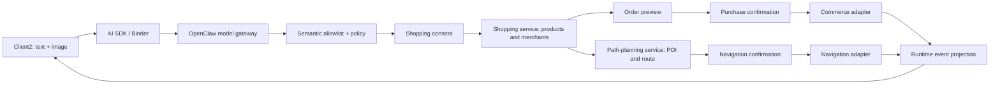

# 座舱购物与路径规划多模态场景软件详设

版本：2.0

日期：2026-07-24

状态：`DEBUG_SOFTWARE_IMPLEMENTED / PRODUCTION_ADAPTERS_EMPTY`

工作包：`P4-R5a..P4-R5l`

Req IDs：`APP-001/003/004`、`S2-HMI-003/006/007/008/009`、`S2-CTX-001/002`、
`S2-TWN-001`、`S2-PER-001`、`S2-INT-001`、`S2-SCN-001`、`S2-GRF-001`、
`S2-SAF-001`、`S2-EFF-001`、`S2-ADP-001/002`、`S2-TOL-001`、`S2-NAV-001`、
`S2-COM-001`、`S2-MDL-001/002`、`S2-OBS-001/002`、`XSC-001/005/006`、
`DEL-001/003/004/005`。

## 1. 需求修订

顶层业务能力是“购物服务”和“路径规划服务”，不是“饮水服务”。图片中可见的饮水容器只允许
产生一个待确认的购物意图；模型在本测试夹具中将 `productCategory` 推断为饮用水，但该类别可以
替换为药品、餐食或其他商品，而不改变购物编排接口。

系统不得把以下内容当作视觉事实：乘员年龄、身份、家庭关系、容器是否为空、乘员是否口渴、是否
已经授权购买、支付或导航。模型只提出候选目标，确定性 Runtime 负责 Tool 选择、确认、订单和导航
状态机。

## 2. 产品流程

1. Client2 提交文字“处理一下”和单张座舱图片；
2. OpenClaw/Ollama 在汽车座舱系统提示词下输出图片观察摘要和白名单语义动作；
3. Runtime 投影座位占用、可见物体和购物候选，不执行车辆 Effect；
4. 驾驶员确认是否搜索商品、商户和购买路线；
5. 购物服务产生有界商品候选、商户候选和订单预览；
6. 路径规划服务产生候选 POI 和路线预览；
7. 订单提交和导航启动分别要求独立确认；
8. debug 实现返回 `ORDER_NOT_DISPATCHED` 和 `NAVIGATION_SIMULATED`；
9. Client2 按实际 Runtime 节点事件滚动显示调用链和结果。

## 3. 模块和代码映射

| 工作包 | 模块 | 设计意图 | 当前代码 | 状态 |
| --- | --- | --- | --- | --- |
| `P4-R5a` | 多模态输入 | 将文字、图片 FD、摘要和 Session 绑定 | `CockpitMultimodalInput`、`DevelopmentModelInputStore` | `CONTROLLED_FRAME_IMPLEMENTED` |
| `P4-R5b` | 座舱观察投影 | 只投影区域占用和可见物体，不输出身份结论 | `OrchestrationRuntimeClient.publishShoppingMilestones` | `DEBUG_PROJECTION_IMPLEMENTED` |
| `P4-R5c` | 多座位 Context | 对四座位区域建模；当前夹具投影三个已占用区域 | 场景 zones、Client2 shopping projection | `CONTROLLED_CONTEXT_IMPLEMENTED` |
| `P4-R5d` | 模型提示词 | 把模型限制在购物和路径规划语义动作 | `CockpitModelPrompt` | `IMPLEMENTED` |
| `P4-R5e` | 购物意图解析 | 将模型候选转换为需确认的购物目标 | `resolve_shopping_intent` graph node | `IMPLEMENTED` |
| `P4-R5f` | 场景 Graph | 编排 Context、Model、Policy、Approval、Tool 和 Summary | `scene.cabin.multimodal.assist.v1.json` v2 | `IMPLEMENTED` |
| `P4-R5g` | 三段确认 | 购物同意、订单提交和导航启动不可复用 | `SimulatedScenarioEffectComposition` | `IMPLEMENTED` |
| `P4-R5h` | Tool 编排 | 只执行 allowlisted、digest-bound Tool 节点 | `SimulatedShoppingPlanningService` | `DEBUG_IMPLEMENTED` |
| `P4-R5i` | 路径规划服务 | 商户 POI、路线预览和导航启动 | `search_purchase_poi`、`preview_purchase_route`、`start_purchase_navigation` | `DEBUG_IMPLEMENTED` |
| `P4-R5j` | 购物服务 | 商品搜索、订单预览和订单提交 | `search_product_catalog`、`prepare_order_preview`、`commit_order` | `DEBUG_IMPLEMENTED` |
| `P4-R5k` | 外部执行边界 | 商户、支付、地图未接入时失败关闭 | Tool result authority flags | `EMPTY_PRODUCTION_INTERFACE` |
| `P4-R5l` | Client2 HMI | 场景按钮、实时链路、动态确认条和购物/路线反馈 | `CockpitControlCoordinator`、panel XML | `IMPLEMENTED` |

## 4. 模型接口

### 4.1 输入

`CockpitModelPrompt.forMultimodal()` 生成同一个模型请求：

- `context.domain=AUTOMOTIVE_COCKPIT`
- `inputText=处理一下`
- `imageMimeType=image/png`
- `imageByteCount<=6 MiB`
- `imageSha256` 和 `inputAggregateDigest` 必须匹配 Binder receipt
- 图片只能消费一次，不写入普通日志或持久化存储

### 4.2 允许的输出

多模态场景的动作 allowlist：

- `shopping.search_products`
- `shopping.prepare_order`
- `navigation.plan_purchase_route`

模型不得授权 `shopping.commit_order`、`navigation.start`、支付或车辆 Effect。Runtime 要求至少存在
`shopping.search_products` 和 `navigation.plan_purchase_route`，未知动作导致 schema 拒绝。

## 5. 场景 Graph

场景 ID 保持 `scene.cabin.multimodal.assist.v1`，以兼容已经交付的 Client2/SDK wire ID；资产版本
升级为 2，摘要由 `scenarios-v1.sha256` 冻结。节点如下：

| 顺序 | Node ID | 类型 | 作用 |
| --- | --- | --- | --- |
| 1 | `capture_multimodal_context` | `context.capture` | 绑定图片、文字和 Session |
| 2 | `derive_cabin_observations` | `model.invoke` | 运行真实多模态模型 |
| 3 | `resolve_shopping_intent` | `policy.evaluate` | 形成待确认购物目标 |
| 4 | `request_shopping_consent` | `approval.interrupt` | 是否搜索商品、商户和路线 |
| 5 | `search_product_catalog` | `tool.invoke` | 商品候选 |
| 6 | `search_purchase_poi` | `tool.invoke` | 商户/POI 候选 |
| 7 | `prepare_order_preview` | `tool.invoke` | 无副作用订单预览 |
| 8 | `preview_purchase_route` | `tool.invoke` | 无副作用路线预览 |
| 9 | `request_purchase_confirmation` | `approval.interrupt` | 是否提交当前订单摘要 |
| 10 | `commit_order` | `tool.invoke` | debug 返回未外发 |
| 11 | `request_navigation_confirmation` | `approval.interrupt` | 是否启动当前路线摘要 |
| 12 | `start_purchase_navigation` | `tool.invoke` | debug 返回 UI 导航仿真 |
| 13 | `render_summary` | `summary.render` | 形成最终有界结果 |

三类确认分别绑定其节点和当前 digest。旧 Session、旧节点或摘要变化后的确认不能复用。

## 6. 购物服务

`SimulatedShoppingPlanningService` 是 debug source-set 中的确定性服务：

| Tool | 结果码 | debug 输出 |
| --- | --- | --- |
| `search_product_catalog` | `SHOPPING_PRODUCTS_READY` | 三项饮用水候选 |
| `search_purchase_poi` | `SHOPPING_MERCHANTS_READY` | 三项便利店/服务区候选 |
| `prepare_order_preview` | `SHOPPING_ORDER_PREPARED` | 500 ml 一件，价格待确认 |
| `commit_order` | `ORDER_NOT_DISPATCHED` | 外部购物接口未接入 |

当前商品、商户、数量、距离和价格状态都是 `SYNTHETIC` 测试夹具。服务结果同时声明：

- `externalDispatchPerformed=false`
- `paymentMaterialAccessed=false`
- `vehicleHardwareAccessed=false`
- `synthetic=true`

release/production 不得自动回退到该实现。真实购物 adapter 需要由产品/OEM 提供商品目录、库存、价格、
订单提交、取消、readback、身份、权限、超时和幂等合同。

## 7. 路径规划服务

| Tool | 结果码 | debug 输出 |
| --- | --- | --- |
| `preview_purchase_route` | `ROUTE_PREVIEW_READY` | 最近候选约 2.4 km / 4 min |
| `start_purchase_navigation` | `NAVIGATION_SIMULATED` | Client2 UI 导航仿真 |

路径规划属于 Foundation/Business Service，不属于车辆 `VehicleCapability`。场景只把
`navigation.poi` 作为治理所需的导航能力标识。真实 Navigation adapter 必须提供当前位置 digest、
POI 搜索、路线约束、路线预览、启动、取消和 readback；缺失时返回 typed unavailable。

## 8. HMI/UX

主界面保持三个场景按钮和滚动调用链。“处理一下”触发后：

1. 右侧链路显示输入文字、图片摘要、模型运行和实际模型回复；
2. 左侧半透明反馈区显示三座位占用、商品、商户、订单和路线；
3. 只有 Runtime 进入 `WAITING_APPROVAL` 时，右侧动态显示“确认继续/取消任务”；
4. 三次确认分别显示购物同意、订单提交和导航启动语义；
5. 完成后订单显示 `NOT_DISPATCHED`，路线显示 `UI SIMULATION ONLY`；
6. 所有商品/路线状态变化由实际 Orchestration snapshot 驱动，不以 UI 定时器伪造 Tool 完成。

目标显示固定为 Android 13 ARM64、1920x1080。反馈区不得超出 1080 高度，图片点击后居中放大，
点击图片外区域关闭。

## 9. 测试环境与生产环境

### 9.1 测试板 `testboard`

- profile：`development_wsl_openclaw`
- 传输：`adb reverse tcp:18789 tcp:18789`
- Runtime endpoint：`ws://127.0.0.1:18789`
- 后端：WSL OpenClaw -> Ollama
- 证据：真实图片和文字进入模型，三个确认节点及最终 UI 已通过

### 9.2 生产板

- profile：`target_openclaw_transitional`
- 传输：Android 以太网直连
- Runtime endpoint：`ws://169.254.208.110:18789`
- token：由现有 `OpenClawEndpointConfig` 固定
- 不允许以 ADB reverse 证据替代目标以太网证据

2026-07-24 现场先确认生产板 `eth0` 链路 UP 但没有 IPv4。测试会话临时配置
`169.254.208.100/24` 后，生产板不经 ADB reverse 直连目标 OpenClaw，完成 protocol v3
图片+文字请求，模型耗时 44908 ms，三个确认节点依次通过并在 Graph revision 77 完成。
该结果证明目标以太与受控帧多模态链路；不证明厂商系统已经交付持久 IPv4 配置。

## 10. 验收

| 用例 | 预期 |
| --- | --- |
| 图片 + “处理一下” | 同一模型请求消费图片和文字 |
| 模型动作 | 只出现购物搜索、订单预览和路径规划 allowlist |
| 购物同意 | 未确认前不运行任何购物 Tool |
| 商品/商户搜索 | 各返回三个有界 synthetic 候选 |
| 订单确认 | 绑定订单节点 digest；结果为 `ORDER_NOT_DISPATCHED` |
| 导航确认 | 与订单确认分离；结果为 `NAVIGATION_SIMULATED` |
| UI 调用链 | 出现三个不同 `pending_node_id` 并逐事件滚动 |
| 权限边界 | 模型不授权订单、导航、支付或车辆 Effect |
| 隐私边界 | 原图、prompt、reply、token 不进入普通日志 |
| 生产缺口 | 无外部 adapter 或网络时失败关闭，不回退 synthetic |

当前声明：

`shopping_route_planning_requirement_defined=true`、
`shopping_route_planning_debug_software_implemented=true`、
`testboard_android13_arm64_verified=true`、
`production_commerce_adapter_wired=false`、
`production_navigation_adapter_wired=false`、
`production_payment_implemented=false`、
`production_openclaw_ethernet_verified=true`、
`production_openclaw_multimodal_verified=true`、
`production_target_ipv4_configuration_persistent=false`、
`driver_hal_development_required=false`、
`production_ready=false`、
`target_hardware_validated=false`。
