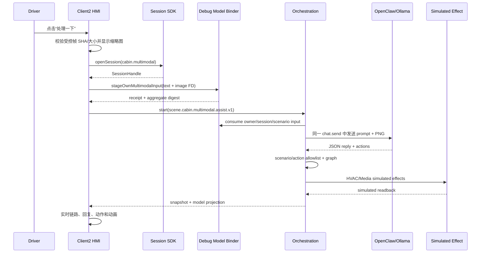

# Client2 多模态座舱闭环详设

Req IDs：`APP-004`、`S2-HMI-003/007/008`、`S2-MDL-002`、`S2-OBS-002`、
`S2-SAF-001`、`XSC-001/005/006`、`DEL-001/003/004`。工作包：`P4-R4`。

## 1. 范围

Client2 的“处理一下”按钮把文字 `处理一下` 和构建内受控座舱帧作为同一次真实模型输入，经
Session、调试态模型输入 Binder、OpenClaw/Ollama、结构化动作白名单、Scenario Graph 和模拟
Effect/Readback 完成闭环。该路径用于 Android 13 开发验收，不是实时摄像头、车辆总线或量产媒体通道。

## 2. 模块

| 模块 | 设计职责 |
| --- | --- |
| `CockpitMultimodalInput` | 从 APK `res/raw` 读取受控 PNG，校验固定大小、SHA-256 和 PNG 签名；创建 FD 输入 DTO；解码当前任务预览；替换或销毁时清零原始字节 |
| `CockpitControlCoordinator` | 处理按钮、缩略图/大图、实时链路文本、模型 I/O、白名单动作和模拟执行动画 |
| `OrchestrationRuntimeClient` | 在 Orchestration start 前提交多模态输入；校验 receipt 与模型输出投影中的 aggregate digest、`imageConsumed` 和场景绑定 |
| `ICentralBrainDevelopmentModelProjection` v2 | 调试态输入/输出侧信道；`stageOwnMultimodalInput` 接收 FD，`getOwnProjection` 返回模型回复和获准动作 |
| `DevelopmentModelInputStore` | Runtime 进程内、owner/session/scenario 绑定、最多 4 项/12 MiB、一次消费、驱逐/消费后清零 |
| `DebugDecisionCompositionBoundary` | 消费 staged input，把 aggregate digest 纳入模型 input digest，把同一 prompt 和图片注册给 OpenClaw，校验结构化回复 |
| `CockpitModelPrompt` | 固定汽车座舱上下文、图片可见事实和隐私限制；仅允许 `hvac.ventilate`、`media.pause` |
| `scene.cabin.multimodal.assist.v1` | Context、Policy、Graph、HVAC/Media 模拟 Effect 与 HVAC readback 的版本化场景清单 |

## 3. SDK 接口

### 3.1 `DevelopmentModelInput`

字段：`schemaVersion`、`sessionId`、`scenarioId`、`inputText`、`imageMimeType`、
`imageFileName`、`imageByteCount`、`imageSha256`、`ParcelFileDescriptor imageFd`。

限制：文字最多 64 字符；只接受 PNG/JPEG；单图最大 6 MiB。图片不放入 Binder transaction，
避免 transaction-size 失败。服务端在读取 FD 后校验声明长度、额外尾字节、SHA-256 和文件签名。

### 3.2 `DevelopmentModelInputReceipt`

返回输入元数据、`inputAggregateDigest`、`acceptedAtEpochMs` 和 `receiptDigest`。
Aggregate digest 覆盖 session、scenario、文字、MIME、文件名、字节数和图片 SHA-256。

### 3.3 `DevelopmentModelProjection` v2

在原回复字段上增加 `inputAggregateDigest`、`imageConsumed` 和 `admittedActions`。Client2 对
多模态任务要求投影存在、aggregate digest 与 receipt 一致且 `imageConsumed=true`；否则失败关闭，
不显示执行动画。

## 4. 调用顺序

## 5. 动作到执行器映射

| 模型动作 | Graph capability | UI 仿真反馈 |
| --- | --- | --- |
| `hvac.ventilate` | `vehicle.hvac.power`、`vehicle.hvac.fan_level` | 风量 `1 -> 3`，HVAC 进度条同步 |
| `media.pause` | `media.playback` | “媒体 播放中”变为“媒体 已暂停” |

模型必须至少选择 `hvac.ventilate`；`media.pause` 可选。动作只决定可用模拟分支，不能直接授权
Effect。安全接口仍为空，`vehicle_bus_accessed=false`。

## 6. UI 与生命周期

按钮与原两个场景并列。模型输入区同时显示文字和 `240dp x 135dp` `FIT_CENTER` 缩略图；点击后
显示有边距的全屏居中预览。点击图片外区域或 Back 退出，图片本身消费点击。可信 `MOVING` 状态
始终拒绝大图并追加 `PREVIEW_BLOCKED` 链路记录。当前无整车状态的 debug 演示只在座椅安全上下文为
`UNKNOWN_RESTRICTED`、Runtime 投影为本次多模态场景且明确声明 `PARKED` 时允许预览；该例外不授予
Safety 或 Effect authority。

原始图片和 decoded bitmap 只在 Client2 当前进程内。下一任务或 Activity destroy 时清除图片引用、
回收 bitmap 并清零原始字节；Runtime staged input 一次消费，驱逐和 close 时清零。Room、
SharedPreferences、checkpoint、日志和 GitHub 证据均不保存原始文字或图片。

## 7. Android 13 ARM64 证据

设备别名 `testboard`，API 33、`arm64-v8a`、1920x1080。受控图片 2,244,206 bytes，SHA-256
`93441797b96c512a7b87905e4d326fbacdbf3a80e4d336d018a41224a0cd8438`。开发链路为
Android -> ADB reverse -> WSL OpenClaw v4 -> Ollama。

实测模型返回 `hvac.ventilate`，Client2 将风量从 1 动画更新到 3；媒体保持播放。模型输入绑定、
图片消费投影、结构化回复、Graph、两个 simulated effect record、readback、缩略图、居中预览和
图外退出均通过。该证据不证明目标以太网、实时摄像头、真实 HVAC、NPU 或量产资格。
