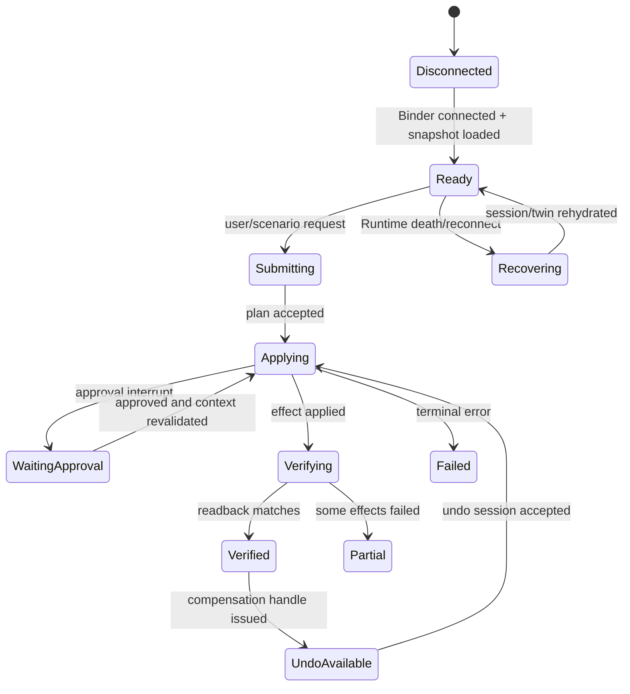

# Central Brain 中控屏 HVAC/Seat 演示闭环规划

版本：1.3

日期：2026-07-16

状态：Implementation plan + high-fidelity design baseline

目标平台：黑盒 Android 13 座舱域控制器上的 Client2 APK

## 1. 决策与需求映射

AIOS 的主入口不是设备按钮集合。用户应只表达“我有些疲惫”等场景目标，Runtime 自动完成意图
归一化、Context 读取、Plan 编译、Policy/Approval、Effect 调度和 readback。座椅与空调仍必须作为
Client2 中可观察、可失败、可撤销的 Effect 详情与手动兜底界面，但不得取代 AIOS 主调用链。

本规划新增派生需求：

| Req ID | 要求 | 原架构映射 |
| --- | --- | --- |
| `S2-HMI-001` | Client2 APK 内提供中控 HVAC 控制页 | `APP-001/003/004`、`FW-S-003`、`XSC-001` |
| `S2-HMI-002` | Client2 APK 内提供中控 Seat 控制页和驾驶态限制 | `APP-001/003`、`FW-S-003/005`、`NV-G-005` |
| `S2-HMI-003` | desired/reported、effect timeline、partial、retry、undo、recovery 可见 | `FW-U-001/003/004`、`NV-G-006/007` |
| `S2-HMI-004` | 无真实信号时使用显式 Android debug/test Digital Twin，禁止伪装真实车控 | `S2-TWN-001`、`S2-ADP-001`、`DEL-001/004` |
| `S2-HMI-005` | 场景操作与手动操作复用同一 SDK/Governance/Effect 链路 | `APP-004`、`NV-F-001/003/004/009`、`NV-P-002` |
| `S2-HMI-006` | 自然场景意图为主入口并显示自动化调用链 | `APP-001/003/004`、`FW-U-001/004`、`NV-F-001`、`NV-G-005..007` |

状态边界：

```text
cockpit_hmi_design_mockups_ready=true
aios_intent_orchestration_ux_ready=true
cockpit_hvac_surface_implemented=false
cockpit_seat_surface_implemented=false
cockpit_demo_control_loop_implemented=false
simulated_vehicle_state_clearly_labeled=true
real_vehicle_effect_adapter_available=false
production_ready=false
target_hardware_validated=false
driver_development_triggered=false
virtualization_development_triggered=false
```

### 1.1 高保真设计基线

`CENTRAL_BRAIN_COCKPIT_HMI_UX_DESIGN_MOCKUPS.md` 已按现有 Client2 1920x1080 车模、底部导航
入口和右侧半透明悬浮面板完成“意图、计划、执行、结果”四阶段设计。首屏只接收自然场景表达，
HVAC/Seat 降为 Effect 详情与手动兜底抽屉。仓库同时提供可点击 HTML/CSS/JS 原型、四张
1920x1080 PNG、视觉 token、Android 类/资源映射和可复现渲染脚本。

Panel 在固定画布中的基线为 `x=1264, y=160, w=624, h=888`，右/下安全边距均为 32px；
内容通过 Panel 内滚动承载，不允许扩高画布。主玻璃为 `rgba(238,242,243,0.60)` 与 14px blur，
Header/导航/底栏使用低 alpha 叠层，保证车模背景仍可辨认。

该资产补全 HMI-D0 视觉基线，不是 HMI-D1 的 Android resource/Java controller，也不能证明
HVAC/Seat 控制、Effect readback、目标硬件或量产能力已经实现。

## 2. 交付范围

### 2.1 本阶段必须交付

1. Client2 底部导航继续作为 Central Brain 菜单入口。
2. 现有半透明右侧悬浮面板保留，不改回分屏，不遮断原车模主体交互。
3. 面板顶层增加“意图”“计划”“执行”“结果”四阶段，持续展示 Intent -> Context -> Plan ->
   Policy -> Effect -> readback。
4. HVAC/Seat 状态和手动微调从 Effect 详情打开；控件产生真实 typed SDK 请求，而不是只改变本地
   控件颜色或文本。
5. Android debug/test Runtime 使用 Vehicle Digital Twin 和 Simulated Effect Adapter 生成 desired、
   reported、delay、failure、readback mismatch 和 restart recovery。
6. Runtime 事件驱动 HMI reducer 更新当前值、目标值、进度、失败、撤销和来源标识。
7. “我冷了”“我累了”和手动调节在同一页面反映相同 Effect 状态。
8. Android 13 ARM64 设备完成 UI、Binder、进程恢复和无真实硬件访问验收。

### 2.2 不属于本阶段

- 不猜测或写入 AAOS/Vendor HVAC/Seat property。
- 不修改厂商 Framework、VHAL、RenderService、Tuanjie/Unity 资源或系统镜像。
- 不把 Client2 本地 View 状态作为车身 readback。
- 不在 release/production profile 自动启用模拟 adapter。
- 不因演示界面可操作而声明车辆、VHAL、NPU、Driver/HAL 或量产通过。
- 不在驾驶状态未知时模拟允许驾驶席大角度靠背动作。

### 2.3 中控屏闭环 UI/UX 全量清单

“中控闭环”不等同于增加两张设置页。所有在演示中产生用户可感知副作用的能力，都必须在
Client2 中有可观察 projection；否则模型或 Runtime 说“已经完成”仍然只是文本演示。

| 中控能力 | 最小闭环 UI | 阶段/工作包 | HMI-D4 要求 |
| --- | --- | --- | --- |
| 全局入口与状态 | 底部入口、连接、source、驾驶态、active plan badge、关闭/恢复 | P4-W02/W03/W08 | 必须完整 |
| 自然场景意图 | voice/text、bounded suggestion、归一化 scenario、可信 Context | P4-W03/W10 | 必须完整 |
| 自动化调用链 | Intent/Context/Plan/Policy/Effect/readback 阶段和实时事件 | P4-W02/W03/W06 | 必须完整 |
| HVAC | Effect 详情、desired/reported、模式、失败、undo、手动兜底 | P4-W04 | 必须完整 |
| Seat | Effect 详情、安全限制、desired/reported、失败、undo、手动兜底 | P4-W05/W08 | 必须完整 |
| 通用 Effect 执行 | HVAC/Seat/Media/Navigation 每项 timeline、target、source、result | P4-W06/W07 | 必须完整 |
| Media | now-playing/volume/pause/stop 的 compact projection | P4-W06/W10；完整媒体页可后续扩展 | 场景涉及时必须可见 |
| Navigation | destination/route state/confirm/cancel 的 compact projection | P4-W06/W10；真实导航由 P8 接入 | 场景涉及时必须可见 |
| Approval/错误/恢复 | reason、expiry、partial、retry、mismatch、undo、reconnect | P4-W06/W07/W12 | 必须完整 |
| 工程仿真 | context/fault profile、revision、clear reset；只在 debug/test | P4-W09 | 必须完整且受保护 |
| Profile/记忆偏好 | 温度带、座椅偏好、同意/撤销/删除入口 | P5 Memory | HMI-D4 不要求，必须规划 |
| 主动建议 | suggestion inbox、接受/忽略、cooldown、禁止自动高风险动作 | P6 Event/Trigger | HMI-D4 不要求，必须规划 |
| 模型交互 | 文本、澄清、provider/source、不可用/降级，不直接宣称 Effect 成功 | P7 Model | 基础文本已有；闭环状态以 Effect 为准 |
| 真实目标能力 | capability/permission/readback/owner 状态和不可用原因 | P8 | HMI-D5，当前外部阻塞 |

Media 和 Navigation 在 HMI-D4 可以先复用“执行”视图的通用 Effect card，不要求首轮新增独立 tab；
但当场景实际包含这两类动作时，card 必须提供用户可理解的目标、当前状态和停止/取消入口。未来新增
完整 Media/Nav 页面时仍复用相同 projection，不新增直连 adapter 的旁路。

### 2.4 单项能力的闭环完成定义

任一中控能力只有同时具备以下八项才可标记 closed-loop：

1. 可发现入口和 capability unavailable 呈现；
2. bounded 用户意图或场景目标；
3. desired state 和请求来源；
4. policy/approval/执行进度；
5. adapter observation 产生的 reported state；
6. timeout、failure、partial 和 mismatch 行为；
7. cancel/retry/undo 中适用的控制；
8. 面板重开与 Runtime 重启后的 snapshot/cursor 恢复。

缺少其中任何一项，只能标记为 surface/projection partial，不得使用
`cockpit_demo_control_loop_implemented=true`。

## 3. APK 集成形态

中控闭环必须位于 `com.tuanjie.urasclient2` APK 内，而不是另启 Demo HMI：

```text
Client2 Activity / Tuanjie vehicle scene
  -> existing bottom-navigation touch target
  -> translucent Central Brain overlay
  -> patched Android XML/vector resources
  -> minimal Smali lifecycle bootstrap
  -> classes2.dex maintained Java HMI controller
  -> Central Brain SDK AAR classes
  -> typed Binder Runtime/Governance/Diagnostics
```

Smali 只负责在不可获得源码的 Activity 中完成 bootstrap、show/hide 和生命周期转发。新增业务状态、
事件 reducer、控件规则、请求协调和 renderer 必须位于可维护 Java secondary-dex 源码，避免继续扩大
手写 Smali 业务逻辑。

## 4. 信息架构

### 4.1 面板层级

```text
Central Brain Overlay
  Header
    connection state
    data source: SIMULATED / TARGET / UNAVAILABLE
    current driving presentation: PARKED / MOVING / RESTRICTED
    close icon
  Segmented navigation
    意图 | 计划 | 执行 | 结果
  Content viewport
    IntentComposer / ContextDigest
    OrchestrationChain / PlanTimeline
    EffectTimeline / LiveTrace
    ResultEvidence / Undo
  Secondary device drawer
    HVAC / Seat / Media / Navigation detail and governed manual fallback
  Persistent execution strip
    active plan summary / approval / partial failure / undo
```

面板在 1920x1080 基准设备上占右侧约三分之一；宽度使用屏幕约束而不是固定像素。所有固定格式
控件必须有稳定高度和网格轨道，按钮状态变化不得引发面板跳动。容器圆角不超过 8dp，不使用嵌套
卡片；用全宽 section、分隔线、图标、开关、步进器、slider 和 segmented control 表达操作类型。

### 4.2 线框

```text
+------------------------------------------------+
| Central Brain   SIMULATED  PARKED           [x]|
| [意图] [计划] [执行] [结果]                    |
|------------------------------------------------|
| 你现在需要什么？                                |
| “我有些疲惫”                         [语音]     |
|                                  [交给 AIOS]    |
|------------------------------------------------|
| 可信上下文：P 挡 / 0 km/h / 26.5 C / 仅主驾     |
| Intent > Context > Plan > Policy > Effect       |
|                                     > Readback  |
+------------------------------------------------+
```

Effect 行的“详情”打开 HVAC/Seat 状态与手动微调抽屉；Header、四阶段导航和执行条保持位置不变。

## 5. HVAC 控制页（Effect 详情与手动兜底）

### 5.1 首版能力

| 控件 | UI 类型 | Debug demo 范围 | 请求语义 |
| --- | --- | --- | --- |
| HVAC power | toggle | on/off | absolute boolean target |
| Zone | segmented control | 主驾/副驾 | seat-zone allowlist |
| Temperature | stepper | 16.0-30.0 C，0.5 C | absolute target |
| Fan | stepper/slider | 0-7 | absolute level |
| AUTO | toggle | on/off | mode target |
| A/C | toggle | on/off | compressor request |
| SYNC | toggle | on/off | zone synchronization intent |
| Airflow | segmented icons | face/feet/face+feet | allowlisted mode |
| Quick comfort | command buttons | warmer/cooler/auto comfort | deterministic scenario |

上述范围是 `debug/demo` capability profile，不是 OEM property 范围。Target adapter 接入后，控件
min/max/step、zone、可写性和 mode 必须由 `CapabilityCatalog` 提供；不支持项显示 unavailable，
不得沿用 demo 数值写入真实车辆。

### 5.2 状态显示

每个 HVAC 值同时保留：

- `reportedValue`：Digital Twin 或真实 adapter 的最近回读；
- `desiredValue`：当前已接受计划的目标值；
- `quality`：VALID/STALE/INVALID/UNKNOWN；
- `source`：SIMULATED/TARGET/UNAVAILABLE；
- `revision` 和 `updatedElapsedMs`；
- `effectState`：IDLE/PENDING/APPLYING/VERIFYING/VERIFIED/FAILED。

用户点击后先显示目标和 pending，不得立即把 reported 改成目标。只有 Effect Observation 或 Twin
readback 到达后才显示 verified；超时或 mismatch 必须保留目标/当前差异并进入失败或确认中状态。

### 5.3 请求合并

- 温度/风量连续操作采用 300 ms debounce。
- 同 zone、同 capability 只保留一个尚未 dispatch 的最新 absolute target。
- 已 dispatch 请求不做本地覆盖；新值生成新的 idempotency key 和 plan node。
- 切换页面、隐藏面板或 Activity pause 不取消已接受 session。
- 显式 Cancel 只取消尚未产生不可逆副作用的节点。

## 6. Seat 控制页（Effect 详情与手动兜底）

### 6.1 首版能力

| 控件 | UI 类型 | Debug demo 范围 | 安全等级 |
| --- | --- | --- | --- |
| Seat zone | segmented control | 主驾/副驾 | LOW |
| Heating | 0-3 segmented level | 与 ventilation 互斥 | LOW |
| Ventilation | 0-3 segmented level | 与 heating 互斥 | LOW |
| Massage | toggle | capability 可用时显示 | MEDIUM |
| Recline angle | slider + presets | demo profile absolute angle | HIGH for driver |
| Preset | upright/comfort/rest | absolute multi-capability plan | MEDIUM/HIGH |

Demo profile 可使用 `upright=18`、`comfort=28`、`rest=42` 度作为仿真数据，但这些数字不得进入
production capability 默认值。真实目标只能使用 OEM 提供的角度、速度、限位和 occupant policy。

### 6.2 驾驶席靠背规则

| Context | UI | Runtime 规则 |
| --- | --- | --- |
| MOVING | recline slider/preset disabled | 永久拒绝驾驶席大角度动作 |
| UNKNOWN_RESTRICTED | disabled，显示状态不可确认 | fail closed |
| PARKED + belt buckled | 可预览，不可执行 rest | 等待 fresh Context |
| PARKED + belt unbuckled + occupied | 可提交 | HIGH risk approval + recheck |
| passenger seat | 按 occupant/vehicle policy | 不继承 driver 规则，仍受 capability/policy |

UI 的 enable/disable 不是安全 authority。Runtime 在 plan compile、approval resume 和 adapter dispatch
前都必须重新读取 fresh Safety/Vehicle Context。面板无法通过篡改参数提供 speed、gear 或 belt。

### 6.3 Heating/Ventilation 互斥

选择 heating level > 0 时，计划必须显式把同座位 ventilation 设为 0；反向亦然。UI 可以预览两项
Effect，但只有 Runtime 编译后的 plan 是权威顺序。partial failure 时必须显示哪一项已经 verified，
不得只显示“座椅已调整”。

## 7. 自然场景意图与手动控制统一

### 7.1 场景意图入口

- “车里有点冷”归一化为 `scene.comfort.cold.v1`，生成 HVAC/Seat plan；
- “我有些疲惫”归一化为 `scene.fatigue.assist.v1`，根据 driving state 生成 HVAC/Seat/Media plan；
- “我想休息一会”归一化为 `scene.rest.nap.v1`，驻车条件满足后只确认高风险节点；
- `scene.manual.hvac.adjust.v1`：手动 HVAC 控件的确定性场景；
- `scene.manual.seat.adjust.v1`：手动 Seat 控件的确定性场景。

自然语言只负责选择 allowlisted scenario 和 bounded parameter。模型不能创建未注册 capability，
不能直接生成 Effect，也不能把回复文本标记为执行成功。

HMI 不允许直接调用 `SimulatedHvacEffectAdapter` 或 `SimulatedSeatEffectAdapter`。手动控件同样通过
`ScenarioClient.openSession` 创建场景 session，进入 policy、approval、durable effect、readback 和
audit。区别只在 `source=HMI_CONTROL` 和 bounded parameters。

### 7.2 同步规则

1. 提交自然场景后自动切换到“计划”，展示归一化意图、Context、Plan 和 Policy 状态。
2. LOW/MEDIUM Effect 经策略允许后自动执行；HIGH Effect 仅请求一次明确确认。
3. session event 到达后由 reducer 一次更新四阶段、Effect timeline 和设备详情。
4. 从 Effect 详情发起的手动操作产生新 session，同样出现在“执行”和审计中。
5. 同 capability 冲突时，Runtime 根据 session priority/owner/policy 决策，HMI 不在本地抢占。

## 8. 执行、结果与反馈页

### 8.1 Effect timeline

每个 Effect 显示：

```text
REQUESTED -> POLICY_CHECKED -> WAITING_APPROVAL -> PREPARED
 -> DISPATCHED -> APPLIED -> VERIFIED
 -> FAILED / SKIPPED / COMPENSATED
```

`DISPATCHED`、`APPLIED` 和 `VERIFIED` 必须分开。Digital Twin 的 delayed report 用于展示真实异步
感；不能在 dispatch 时直接跳到 verified。

### 8.2 全局结果

| 结果 | UI 行为 |
| --- | --- |
| COMPLETED | 显示 verified capability 和 undo TTL |
| PARTIALLY_COMPLETED | 分列成功/失败，允许重试失败项或撤销成功项 |
| WAITING_APPROVAL | 展示理由、目标、Context 摘要、expiry、确认/取消 |
| READBACK_MISMATCH | 显示当前/目标，允许 reconcile 或保留当前 |
| ADAPTER_UNAVAILABLE | 控件保持不可用，明确未执行 |
| RECOVERING | 从 Runtime 查询 session/twin，不清空本地页面 |
| FAILED | 显示稳定错误码与安全用户文案，不显示原始 exception |

### 8.3 Undo

撤销生成新的 governed compensation session。它必须重新读取当前 driving state 和 capability；即使
原动作可逆，当前状态变化也可以拒绝撤销。UI 只有收到 `UndoHandle` 后才显示撤销按钮。

## 9. HMI 状态模型

### 9.1 根状态

```text
CockpitHmiState
  connectionState
  presentationMode
  dataSourceBadge
  selectedSurface
  intentDraft
  normalizedScenario
  contextDigest
  planSummary
  activeSessionId
  climateState
  seatState
  executionState
  resultEvidence
  approvalState
  undoState
  lastError
```

### 9.2 Reducer 规则



Renderer 只能消费 immutable `CockpitHmiState`。View listener 只发出 `CockpitHmiIntent`，不得直接
修改 reported state。重连后先加载 Runtime session 和 Twin snapshot，再消费增量事件，避免回退。

## 10. 无真实车身信号时的运行模式

### 10.1 Android Demo profile

- Runtime debug/test 注册 `SimulatedHvacEffectAdapter`、`SimulatedSeatEffectAdapter`。
- Header 永久显示 `SIMULATED`，执行详情显示 `source=SIMULATED`。
- 默认 driving state 是 `UNKNOWN_RESTRICTED`，不是 PARKED。
- 工程抽屉可通过受保护 debug endpoint 设置 PARKED/MOVING、occupancy、belt 和 fault profile。
- 每次切换工程状态递增 Context revision，旧 approval 失效。
- 模拟 adapter 产生真实延迟、timeout、failure 和 mismatch，不允许 UI 本地动画直接宣称成功。

### 10.2 Target integration profile

- 没有真实 adapter 时显示 `UNAVAILABLE`，HVAC/Seat 控件禁用。
- 只有目标 owner 提供 capability、权限、readback、fault、rollback 和 Safety 证据后，才能逐项将
  source 切换到 `TARGET`。
- 不允许 SIMULATED 和 TARGET 对同一 capability 同时注册。
- release/production 不得把 TARGET unavailable 隐式回退到 SIMULATED。

## 11. 代码模块与计划文件

### 11.1 Client2 APK patch

| 计划路径 | 职责 |
| --- | --- |
| `patches/main_layout.central_brain_panel.xml` | 意图/计划/执行/结果四阶段容器、稳定 layout slot、content description |
| `patches/res/drawable/` | power/fan/HVAC/seat/heat/vent/undo 等 vector/state drawable |
| `bridge/src/com/centralbrain/client2/CockpitControlCoordinator.java` | 已实现 View、Session、Activity lifecycle、process recreation、四阶段 intent shell 和 device drawer；P4-W04 扩展 HVAC controls |
| `bridge/src/com/centralbrain/client2/CockpitHmiState.java` | 已实现 immutable 根状态和 text-free checkpoint projection |
| `bridge/src/com/centralbrain/client2/CockpitHmiReducer.java` | 已实现唯一 typed event -> state authority |
| `bridge/src/com/centralbrain/client2/hmi/CockpitHmiRenderer.java` | state -> Android Views |
| `bridge/src/com/centralbrain/client2/hmi/IntentComposerBinder.java` | voice/text -> bounded intent request |
| `bridge/src/com/centralbrain/client2/hmi/ContextDigestBinder.java` | source/freshness/trust projection |
| `bridge/src/com/centralbrain/client2/hmi/PlanSurfaceBinder.java` | orchestration chain/plan/approval |
| `bridge/src/com/centralbrain/client2/hmi/ClimateSurfaceBinder.java` | HVAC 控件与 intent |
| `bridge/src/com/centralbrain/client2/hmi/SeatSurfaceBinder.java` | Seat 控件与 intent |
| `bridge/src/com/centralbrain/client2/hmi/ExecutionSurfaceBinder.java` | timeline/approval/undo |
| `bridge/src/com/centralbrain/client2/hmi/ResultSurfaceBinder.java` | verified evidence/feedback/undo |
| `bridge/src/com/centralbrain/client2/hmi/DeviceDetailDrawer.java` | Effect 详情和受治理手动兜底 |
| `bridge/src/com/centralbrain/client2/Client2ScenarioBridge.java` | 已实现 SDK session/event/snapshot 与 existing Session resume |
| `MainActivity.smali` generated hook | 只调用 `CockpitControlCoordinator.install(Activity)`；旧 Smali controller 已删除 |

Java 代码通过 `Resources.getIdentifier` 或生成的稳定 ID 映射绑定 patched resource，禁止依赖逆向
输出中的瞬时整数 ID。所有资源和 Java 源码进入正式 patch 工程；`reverse/` 仍是受控输入。

### 11.2 SDK/Runtime

| 计划模块 | 关键接口 |
| --- | --- |
| Session contract v2 | `openSession/getSession/registerSessionCallback/cancelSession` |
| Cockpit projection | bounded `CockpitControlSnapshot` 或等价 SDK facade |
| Scenario | manual HVAC/Seat + cold/fatigue/rest manifests |
| Context/Twin | `ContextSnapshot`、`DigitalTwinSnapshot`、capability catalog |
| Effect | `EffectIntent`、`EffectObservation`、`UndoHandle` |
| Debug simulation | protected `DebugSimulationController`，release absent |

HMI 只获取展示所需的 projection，不能查询原始连续车身信号、完整内部 audit 或无界 event history。

## 12. 线程、性能和可访问性

- Binder callback 立即转换为 immutable event，reducer 在单线程 executor 顺序处理。
- View 渲染只在 main thread；不得在 UI thread 做 Binder 阻塞查询。
- 每个 session callback 队列有界，重连使用 snapshot + cursor。
- slider/stepper 输入 debounce，renderer 使用 distinct state 避免重复布局。
- 目标首次操作反馈小于 100 ms；simulated readback 延迟配置为 300-1500 ms。
- 所有图标控件提供 contentDescription；状态不能只靠颜色表达。
- 触控目标至少 48dp；最长中文文案允许换行，不覆盖其他控件。
- 1920x1080 为首个物理验收尺寸，后续至少验证 1280x720 和 2560x1440 layout screenshot。

## 13. 安全、隐私与审计

1. HMI 不提交 speed、gear、belt、occupancy 等可信状态。
2. 每次控制记录 session、effect、zone、desired digest、source、decision 和 terminal result。
3. 不记录原始用户/模型文本或连续车身 payload；UI 截图必须脱敏。
4. 驾驶状态未知时使用 restricted UX，驾驶席 recline dispatch 必须为 0。
5. 工程抽屉只存在 debug build，并受 signature/capability 保护。
6. HMI 本地状态、动画和截图不能关闭 `ISSUE-030` 或任何 Driver/HAL gap。

## 14. 最小工作包与工作量

本规划对应 P4 的 12 个最小工作包，预计 24-32 人日：

| 工作包 | 内容 | 人日 |
| --- | --- | ---: |
| P4-W01 | Bridge session/event API migration | 2 |
| P4-W02 | Cockpit state/reducer/reconnect | 2.5 |
| P4-W03 | 意图/计划/执行/结果四阶段 overlay shell 和资源 | 2 |
| P4-W04 | HVAC control surface | 3 |
| P4-W05 | Seat control surface + restriction preview | 3.5 |
| P4-W06 | Plan/effect execution timeline | 2.5 |
| P4-W07 | Approval/partial/retry/undo UX | 2.5 |
| P4-W08 | Driving restriction renderer | 1.5 |
| P4-W09 | Engineer simulation drawer | 2 |
| P4-W10 | Scenario/manual control synchronization | 2 |
| P4-W11 | Accessibility/display matrix | 1.5-2.5 |
| P4-W12 | Android device acceptance/fault/recovery | 2.5-4 |

P4 依赖 P1 typed contracts、P2 Digital Twin/simulated adapter 和 P3 durable graph/effect。可在 P1
完成后并行开发 P4-W02/W03 静态壳，但 P4-W04..W10 的完成证据必须来自 Runtime 闭环，不能用
本地 fake controller 代替。

当前实施状态：P4-W01..P4-W10 已完成应用层交付。P4-W08 对 UNKNOWN/MOVING/untrusted Context 使用
MOVING_RESTRICTED，隐藏长文本并禁用参数编辑和高风险场景；呈现 mode 不授权 Effect。P4-W09 已交付
signature/capability protected engineer simulation drawer 和实体 PARKED/MOVING/UNKNOWN 呈现复测，不改变 production
Context/Safety authority。下一工作包为 P4-W11 Accessibility/display matrix。

## 15. 验收矩阵

| ID | 场景 | 必须结果 |
| --- | --- | --- |
| HMI-AC-01 | 手动主驾温度 22 -> 24 | desired 先变，reported 延迟后 verified |
| HMI-AC-02 | 连续温度步进 | debounce 后单一最终未 dispatch target |
| HMI-AC-03 | HVAC timeout | 不显示完成；显示 retry/保留当前 |
| HMI-AC-04 | “我冷了” | HVAC + occupied seat heat timeline，页面同步 |
| HMI-AC-05 | capability unavailable | partial completed，明确未执行项 |
| HMI-ST-01 | seat heat/vent 互斥 | plan 显式归零冲突 capability |
| HMI-ST-02 | MOVING 驾驶席 recline | UI disabled 且 Runtime dispatch count=0 |
| HMI-ST-03 | UNKNOWN_RESTRICTED | rest preset fail closed |
| HMI-ST-04 | PARKED 安全条件满足 | approval 后 applied/readback/verified |
| HMI-ST-05 | belt 在 approval 后变化 | stale approval reject，重新构建 Context |
| HMI-CL-01 | HVAC 成功、Seat 失败 | PARTIALLY_COMPLETED，不显示全量完成 |
| HMI-CL-02 | readback mismatch | 显示目标/当前差异和 reconcile 状态 |
| HMI-CL-03 | undo | 新 compensation session，最终 readback verified |
| HMI-CL-04 | Runtime process death | 重连后 snapshot/cursor 恢复，不重复 effect |
| HMI-CL-05 | 隐藏/重开 overlay | session 继续，页面状态恢复 |
| HMI-CL-06 | release build | simulation drawer/adapters absent；无 target 时 unavailable |
| HMI-CL-07 | source label | 所有 simulated 控制持续显示 SIMULATED |
| HMI-CL-08 | 物理 Android 13 | Client2 scene、导航、overlay、Binder、UI tree、crash buffer 通过 |
| HMI-CL-09 | fatigue plan 含 Media | 执行页显示目标/播放状态/source，并可 stop；不只显示文本 |
| HMI-CL-10 | plan 含 Navigation | 执行页显示目的地/route state/source，并可 cancel；真实 adapter 缺失时 unavailable |
| HMI-AI-01 | 输入“我有些疲惫” | 无设备级前置操作；归一化 scenario 并展示 Context/Plan/Policy/Effect/readback 链 |
| HMI-AI-02 | fatigue plan 含 HIGH seat node | LOW/MEDIUM 自动执行；仅 seat node 请求一次明确确认 |

## 16. 交付阶段

| 里程碑 | 结果 | 完成条件 |
| --- | --- | --- |
| HMI-D0 | 需求/UX/模块/验收和高保真视觉基线冻结 | 规划、设计稿、四张 PNG 和 checker 通过 |
| HMI-D1 | Client2 意图/计划/执行/结果四阶段静态壳和设备详情抽屉 | 资源、Java controller、layout screenshot |
| HMI-D2 | 手动 HVAC/Seat 仿真闭环 | P1/P2 + HMI-AC/ST 基础场景通过 |
| HMI-D3 | AI 场景多 Effect 闭环 | P3 + cold/fatigue/rest/partial/undo |
| HMI-D4 | 设备演示验收 | P4 全部 + Android 13 ARM64 fault/recovery |
| HMI-D5 | 真实目标逐项激活 | P8 capability 独立 evidence；当前外部阻塞 |

HMI-D4 才表示“演示级中控闭环完成”。HMI-D5、production signer、OEM UX/Safety 审批和整车
验证是独立退出条件，不能从 HMI-D4 推断。

## 17. 当前实现进度（2026-07-17）

P4-W01..P4-W05 已完成：Session/Event bridge、immutable HMI lifecycle、四阶段 shell、HVAC 和 Seat control surface 已进入
Client2。Seat 新增四座区、heat/vent 互斥、massage、recline、upright/comfort/rest presets、300 ms debounce、
`scene.manual.seat.adjust.v1` governed Session admission，以及 desired/safety/request/reported/source/quality/effect 分层。
未知可信 Context 或行驶中主驾位置调整保持 `BLOCKED` 且 dispatch count 为 0；无 readback 时保持
`UNAVAILABLE/NO_EVIDENCE`，Session acceptance 只显示 REQUESTED。

HMI-D2 尚未完成，因为 Runtime Scenario/Graph/Effect wiring、Digital Twin observation、partial/retry/undo/approval 均未
连接。下一工作包为 P4-W06 Plan/effect execution timeline。Session V1 HVAC/Seat 参数兼容边界由 `DEV-054/055` 跟踪；
不得将 `cockpit_hvac_surface_implemented=true` 或 `cockpit_seat_surface_implemented=true` 解释为车辆硬件已执行。
