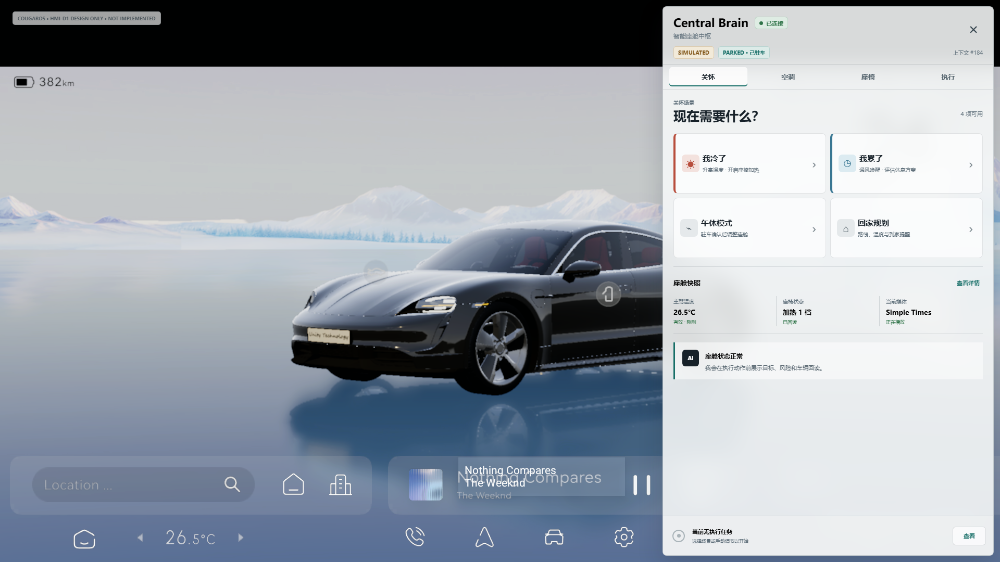
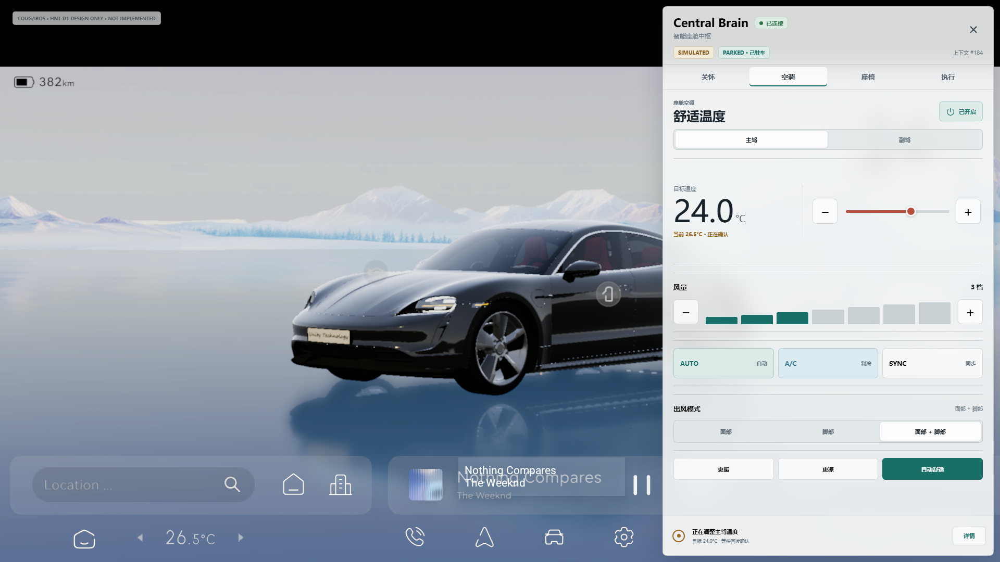
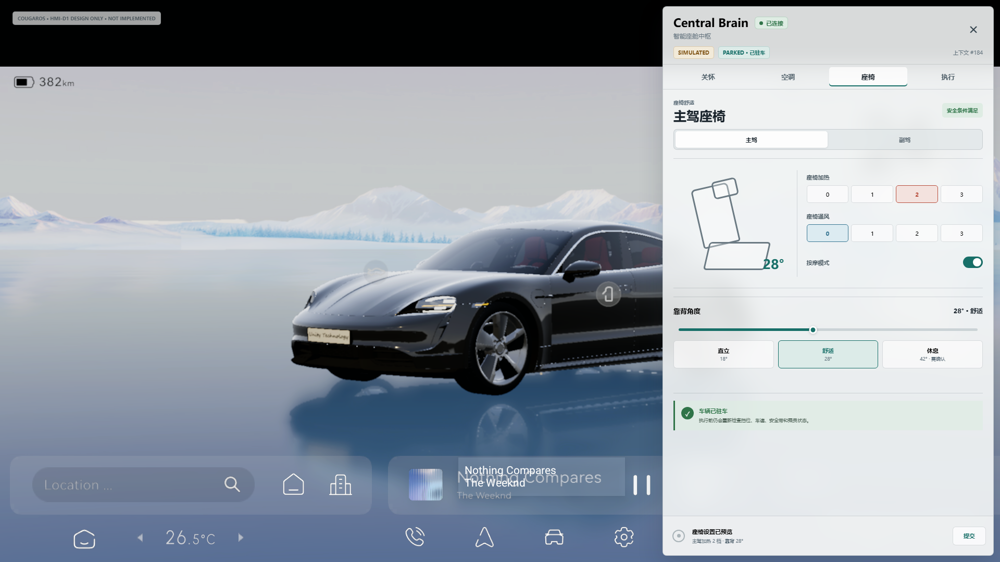
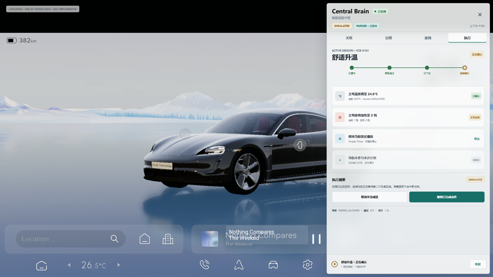

# Central Brain Client2 中控 UI/UX 设计稿

版本：1.0

日期：2026-07-16

状态：High-fidelity design baseline；非 APK 实现

Req ID：`APP-001/003/004`、`FW-U-001/003/004`、`FW-S-003/005`、`XSC-001`、
`NV-F-001/003/004/009`、`NV-G-005/006/007`、`NV-P-002`、`DEL-001/004`、
`S2-UX-001..003`、`S2-HMI-001..005`。

## 1. 交付结论

本设计稿把当前 Client2 的右侧半透明测试面板升级为可开发的中控闭环视觉基线，保留以下现有
产品特征：

- 1920x1080 横屏和全屏车模；
- 底部导航触发，二次点击或面板外点击关闭；
- 右侧约三分之一悬浮，不把车模改为分屏；
- 浅灰高透明材质，底层车模和原有导航仍可辨认；
- Client2 内承载，不另起产品 HMI APK。

新增“关怀、空调、座椅、执行”四个主视图。设计图中的状态、按钮和车身回读均为设计示例，
不代表 Runtime、Digital Twin、Effect adapter 或真实车辆已经接入。

```text
cockpit_hmi_design_mockups_ready=true
cockpit_hvac_surface_implemented=false
cockpit_seat_surface_implemented=false
cockpit_demo_control_loop_implemented=false
real_vehicle_effect_adapter_available=false
production_ready=false
target_hardware_validated=false
```

## 2. 设计资产

| 资产 | 用途 |
| --- | --- |
| [`index.html`](ui/cockpit-hmi-design/index.html) | 可点击高保真原型；支持四 tab、面板开关和部分控件交互 |
| [`styles.css`](ui/cockpit-hmi-design/styles.css) | 1920x1080 几何、组件、视觉 token 和响应缩放 |
| [`app.js`](ui/cockpit-hmi-design/app.js) | tab、场景、温度、模式、座椅等级和面板交互 |
| [`render_mockups.sh`](ui/cockpit-hmi-design/render_mockups.sh) | 自动选择 Windows Chrome 或 Playwright 复现四张 1920x1080 PNG |
| [`01-care.png`](assets/cockpit-hmi-design/01-care.png) | 关怀场景首页 |
| [`02-hvac.png`](assets/cockpit-hmi-design/02-hvac.png) | HVAC 手动控制与 desired/reported |
| [`03-seat.png`](assets/cockpit-hmi-design/03-seat.png) | Seat 舒适控制与驾驶状态限制 |
| [`04-execution.png`](assets/cockpit-hmi-design/04-execution.png) | Effect timeline、逐项回读、停止与撤销 |

参考背景来自 API 33 模拟器 Client2 截图，SHA-256：
`ea67855e9ec184559546c35f8be0d3a87abc5fc7f8edff02d5e411fe98479e80`。仓库中的副本只作为
设计画布，不是目标硬件证据，也不得用于关闭 B3/P8/Driver-HAL gate。

## 3. 总体画布与几何

| 对象 | 1920x1080 基准值 | Android 实现建议 |
| --- | --- | --- |
| Panel bounds | x=1272，y=12，w=636，h=1056 | 右侧 1/3，外边距 12dp，宽度使用约束而非硬编码像素 |
| Panel radius | 8px | 8dp |
| Panel material | `rgba(246,248,248,0.88)` + blur | Android 低版本不支持 blur 时使用 90% 实色降级 |
| Panel padding | 20px 横向 | 20dp；紧凑屏降至 16dp |
| Header | 108px，含 Runtime 状态 | 标题、连接、source、driving state 固定，不随内容滚动 |
| Tabs | 48px | 四等分 segmented navigation |
| Execution strip | 76px | 所有页面固定可见；隐藏面板不 cancel session |
| Touch target | 最小 48px | 图标和主操作均不低于 48dp |

Panel 只覆盖右侧区域，车模不 resize。背景点击发出 Dismiss；Panel 自身消费点击。底部原有
Central Brain 触发区保持透明，不增加第二个可见导航按钮。

## 4. 视觉语言

### 4.1 Color token

| Token | 值 | 语义 |
| --- | --- | --- |
| Ink | `#172129` | 主文字 |
| Muted | `#60707B` | 次级文字、metadata |
| Teal | `#176F68` | active、manual control、primary action |
| Warm | `#B84E3D` | 加热、升温 |
| Cool | `#397793` | 制冷、通风、疲劳唤醒 |
| Amber | `#9A6A22` | SIMULATED、pending、verifying |
| Success | `#2F7448` | connected、verified、safe context |
| Divider | `rgba(49,64,74,0.16)` | section 分隔 |

状态不得只依赖颜色；所有状态同时使用中文文案、source 和图形/位置。全局不使用装饰性渐变、
大圆角卡片或嵌套 card。重复场景和 Effect 使用 8px card；其他内容使用全宽 section 和分隔线。

### 4.2 Typography

- H1：22px/700；页面 H2：25px/700；section：13px/800；正文：10-12px；
- 中文优先 `Microsoft YaHei/Noto Sans SC/PingFang SC`，Android 实现使用系统 sans-serif；
- 不随 viewport 宽度缩放字号；长文案换行，值和状态使用稳定网格防止跳动。

## 5. 四个主视图

### 5.1 关怀



- 首屏只保留四个高频入口：“我冷了”“我累了”“午休模式”“回家规划”；
- 每个入口同时显示确定性结果摘要，不能只显示场景名字；
- 座舱快照显示 HVAC、Seat、Media 最近回读；
- AI 文本仅解释状态，Effect 是否完成以执行页和 reported state 为准；
- 点击场景进入执行页，不能在关怀页直接把控件改成成功状态。

### 5.2 空调



- 首版包含 power、主驾/副驾、temperature、fan、AUTO、A/C、SYNC、airflow 和快捷 preset；
- 目标 24.0°C 与当前 26.5°C 分开显示，并明确“正在确认”；
- 连续温度/风量输入在实现中使用 300ms debounce；
- target 范围由 `CapabilityCatalog` 提供，设计中的 16-30°C 和 0.5°C 只属于 debug/demo；
- 底部执行条在 tab 切换后仍显示 active session。

### 5.3 座椅



- 主驾/副驾独立；加热、通风互斥；按摩为 toggle；
- 靠背使用稳定 slider 和直立/舒适/休息 preset，不使用自由拖拽车模作为唯一输入；
- `PARKED` 只表示 HMI 允许提交，Runtime 仍需重新检查 speed/gear/belt/occupancy；
- `MOVING` 或 `UNKNOWN_RESTRICTED` 时驾驶席靠背和休息 preset disabled；
- HIGH risk preset 在真正实现时进入 durable approval，而不是简单确认弹窗后直达 adapter。

### 5.4 执行



- 顶部 timeline 区分 request、policy、dispatch 和 verify；
- HVAC、Seat、Media、Navigation 使用通用 Effect row，逐项显示 target/source/result；
- `DISPATCHED` 不显示“已完成”；只有回读匹配后才显示“已确认”；
- Media/Navigation 即使没有独立 tab，也必须提供 stop/cancel projection；
- partial、retry、readback mismatch、cancel 和 governed undo 在该页统一呈现；
- 面板隐藏和 Activity recreate 后从 Session snapshot + cursor 恢复。

## 6. 核心 UX 流程

```mermaid
flowchart LR
    Entry["底部导航打开面板"] --> Care["关怀 / 手动控制"]
    Care --> Intent["bounded HMI intent"]
    Intent --> Session["Session + Policy + Approval"]
    Session --> Effect["Durable Effect"]
    Effect --> Adapter["SIMULATED / TARGET adapter"]
    Adapter --> Readback["EffectObservation + reported state"]
    Readback --> Execute["执行页逐项确认"]
    Execute --> Undo["retry / cancel / governed undo"]
```



### 6.1 “我冷了”

1. 点击关怀入口，立即进入执行页；
2. 显示 HVAC 目标和 occupied seat heating 目标；
3. policy 通过后逐项进入 applying；
4. HVAC/Seat 页同步 desired，但 reported 只由 observation 更新；
5. partial failure 时保留成功项，展示失败项 retry/undo。

### 6.2 “我累了”

1. MOVING/UNKNOWN：只能使用允许的通风、媒体和建议；驾驶席 recline dispatch count=0；
2. PARKED：可生成 rest preview，满足 fresh Context 后进入 approval；
3. approval 后 Context revision 变化时拒绝旧批准并重新展示原因；
4. 所有 Media/Navigation 动作在执行页提供停止/取消。

## 7. Android 开发映射

| 设计区域 | 计划 Java/Resource | 事件/状态 |
| --- | --- | --- |
| Header/Tabs/Strip | `main_layout.central_brain_panel.xml` | connection/source/driving/session aggregate |
| 关怀 | `Client2CockpitHmiController` + scenario resources | `OpenSessionIntent` |
| 空调 | `ClimateSurfaceBinder` | `ManualHvacIntent`、ClimateState |
| 座椅 | `SeatSurfaceBinder` | `ManualSeatIntent`、SeatState |
| 执行 | `ExecutionSurfaceBinder` | SessionSnapshot、EffectObservation、UndoHandle |
| 全局状态 | `CockpitHmiState/Reducer/Renderer` | immutable state + single-thread reducer |
| SDK 协调 | `CockpitControlCoordinator` | snapshot -> cursor replay -> callback attach |

Smali 只保留 Activity bootstrap/show/hide/lifecycle forwarding。设计稿中的业务状态、控件规则和
renderer 不进入 Smali，也不直接调用 Simulated/Target adapter。

## 8. 分辨率与可访问性

- 基准：1920x1080；后续验收：1280x720、2560x1440；
- 宽屏保持右侧约 1/3，最小 panel 宽 480dp，最大 680dp；
- 小于最小宽度时减少双列场景为单列，不缩小触控目标或动态缩放字体；
- 所有图标按钮需要 contentDescription；状态必须有文字；focus 顺序 Header -> Tabs -> Content -> Strip；
- moving presentation 减少长文本和可操作项，但不隐藏安全拒绝原因。

## 9. 设计验收

1. 四张 PNG 必须是 1920x1080，车模保持全屏且 panel 不改变底层布局；
2. Panel bounds、12px margin、8px radius、四 tab 和固定 execution strip 一致；
3. 页面无文本溢出、卡片嵌套、纯颜色状态或小于 48px 的关键触控目标；
4. HVAC 和 Seat 页面同时显示 desired/reported 或明确的回读状态；
5. 执行页覆盖 HVAC/Seat/Media/Navigation projection；
6. 所有稿件持续显示 `SIMULATED` 和 `DESIGN ONLY`；
7. 设计稿不得把 `cockpit_demo_control_loop_implemented` 改为 true。

复现设计稿：`bash docs/ui/cockpit-hmi-design/render_mockups.sh`。WSL 环境默认复用 Windows
Chrome；其他 Linux 环境使用 Playwright，也可通过 `RENDER_BACKEND` 显式选择。

验证入口：`bash tools/check_central_brain_cockpit_hmi_design.sh`。
