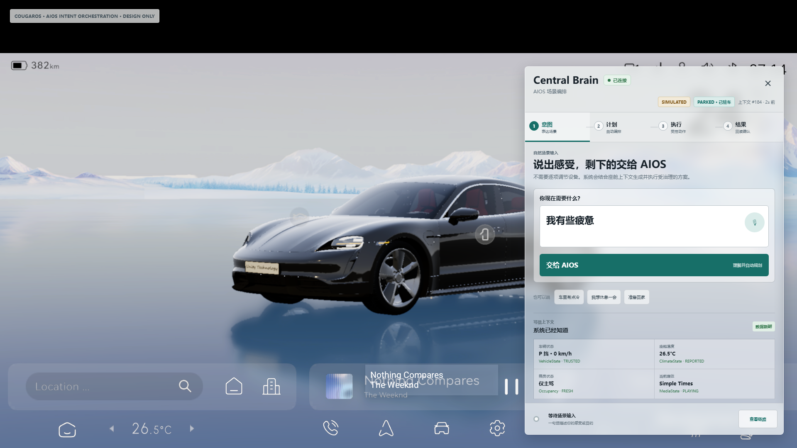
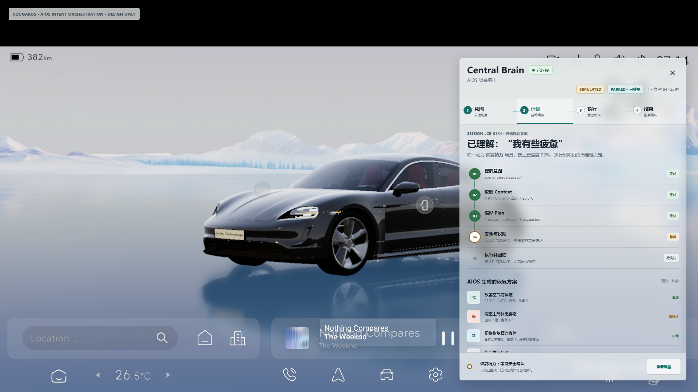
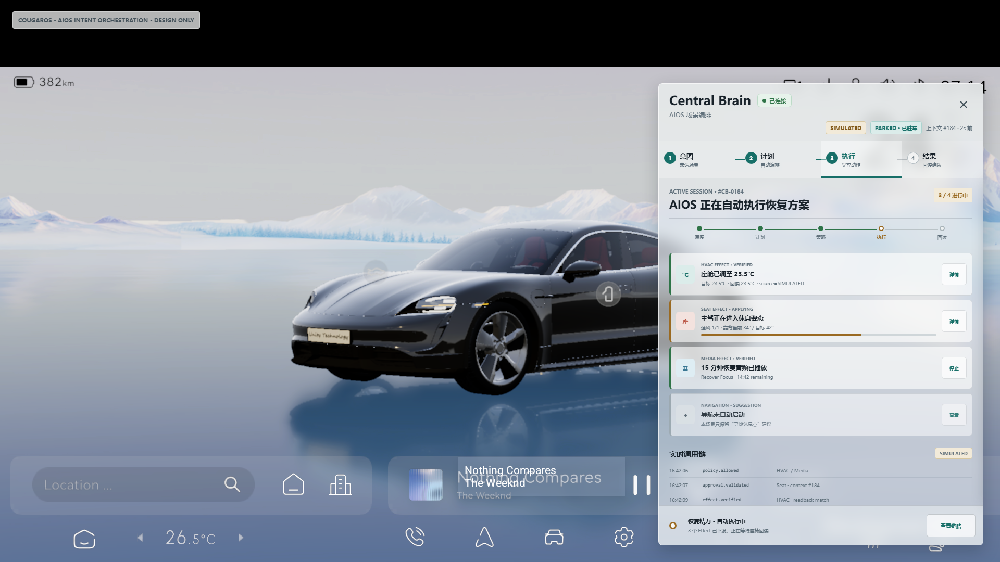
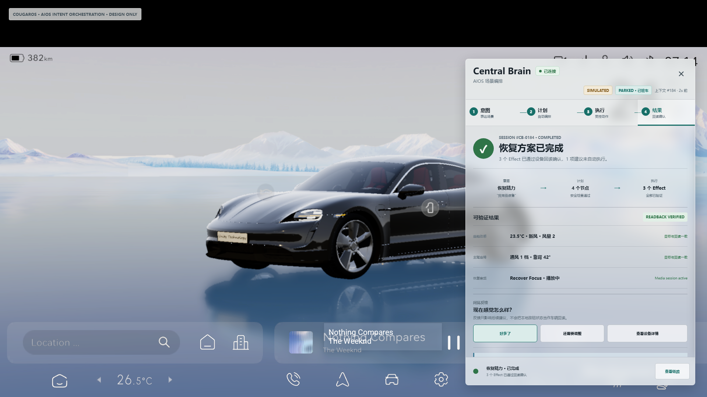

# Central Brain Client2 中控 UI/UX 设计稿

版本：2.1

日期：2026-07-16

状态：Intent-first high-fidelity design baseline；非 APK 实现

Req ID：`APP-001/003/004`、`FW-U-001/003/004`、`FW-S-001/003/005`、`XSC-001`、
`NV-F-001/003/004/009`、`NV-G-005/006/007`、`NV-P-002`、`DEL-001/004`、
`S2-UX-001..003`、`S2-HMI-001..006`。

## 1. 设计纠偏

首版设计把“关怀、空调、座椅、执行”作为顶层 tab，虽然覆盖了设备控制，却把 AIOS 表现成按钮
较多的智能中控。用户审查明确指出：AIOS 的输入应是“我有些疲惫”这类简单场景表达，其余动作
由系统自动完成，同时 UI 必须清晰呈现自动化执行链。

第二版将顶层信息架构改为：

```text
意图 -> 计划 -> 执行 -> 结果
          |
          +-> Intent -> Context -> Plan -> Policy/Approval -> Effect -> Readback
```

用户不需要先选择 HVAC 或 Seat。设备界面仍然保留，但降为 Effect 详情与受治理的手动兜底抽屉，
从而同时满足 AIOS 主叙事和中控闭环要求。

第三次视觉审查指出原 Panel `y=12, h=1056` 几乎占满 1080px 高度，浏览器或 Android 非全屏
内容区中容易产生越界观感；`alpha=0.91` 及其叠加层也过于接近实色。当前基线改为经过 Client2
界面证据校准的安全框 `x=1264, y=160, w=624, h=888`，并采用 60% 浅灰玻璃主材质。

```text
cockpit_hmi_design_mockups_ready=true
aios_intent_orchestration_ux_ready=true
cockpit_hmi_1920x1080_safe_frame_verified=true
cockpit_hmi_translucent_material_ready=true
cockpit_hvac_surface_implemented=false
cockpit_seat_surface_implemented=false
cockpit_demo_control_loop_implemented=false
real_vehicle_effect_adapter_available=false
production_ready=false
target_hardware_validated=false
```

## 2. 产品原则

1. **一句话表达目标**：voice/text 只描述感受或目的，不暴露设备参数作为前置条件。
2. **自动生成方案**：系统读取可信 Context，归一化 allowlisted scenario，编译可审计 Plan。
3. **默认自动执行**：LOW/MEDIUM Effect 经 Policy 允许后自动调度；只确认 HIGH 风险节点。
4. **完整链路可见**：Intent、Context、Plan、Policy、Effect、Readback 必须在 UI 中有明确投影。
5. **结果由回读决定**：模型回复、按钮状态和动画都不能替代 adapter observation。
6. **设备控制是次级入口**：HVAC/Seat 详情用于解释、诊断和手动兜底，不是产品首页。
7. **可恢复可撤销**：隐藏面板不停止 Session；失败、partial、retry、undo 和重连均可见。
8. **画布内安全呈现**：1920x1080 是唯一设计坐标系；Panel 必须完全位于画布内，预览只能等比缩小。

## 3. 设计资产

| 资产 | 用途 |
| --- | --- |
| [`index.html`](ui/cockpit-hmi-design/index.html) | 可点击高保真原型；支持自然输入、四阶段、Effect 详情和面板开关 |
| [`styles.css`](ui/cockpit-hmi-design/styles.css) | 1920x1080 几何、视觉 token、稳定组件和响应缩放 |
| [`app.js`](ui/cockpit-hmi-design/app.js) | intent submit、阶段切换、approval、result 和设备详情交互 |
| [`render_mockups.sh`](ui/cockpit-hmi-design/render_mockups.sh) | Windows Chrome/Playwright 可复现渲染 |
| [`01-intent.png`](assets/cockpit-hmi-design/01-intent.png) | 一句话场景意图和可信 Context |
| [`02-plan.png`](assets/cockpit-hmi-design/02-plan.png) | 意图归一化、自动编排和安全门 |
| [`03-execution.png`](assets/cockpit-hmi-design/03-execution.png) | 多 Effect 自动执行和实时调用链 |
| [`04-result.png`](assets/cockpit-hmi-design/04-result.png) | readback evidence、反馈和 governed undo |

参考背景来自 API 33 模拟器 Client2 截图，SHA-256：
`ea67855e9ec184559546c35f8be0d3a87abc5fc7f8edff02d5e411fe98479e80`。该副本仅作为设计画布，
不是目标硬件证据，不得用于关闭 B3/P8/Driver-HAL gate。

## 4. 画布与视觉规范

| 对象 | 1920x1080 基准 | Android 实现建议 |
| --- | --- | --- |
| Canvas | x=0，y=0，w=1920，h=1080 | 固定设计坐标；预览 `scale <= 1`，不改写 Android 资源尺寸 |
| Panel | x=1264，y=160，w=624，h=888 | 对齐 Client2 已验证安全区；right=32、bottom=32，内容区独立滚动 |
| Radius | 8px | 8dp，重复 Effect row 使用 6dp |
| Material | `rgba(238,242,243,0.60)` + 14px blur | 支持 blur 时保持背景可辨；不支持时 82% 浅灰降级 |
| Header | 110px | connection/source/driving/context revision 固定 |
| Stage nav | 72px | 意图/计划/执行/结果四等分，显示已完成阶段 |
| Session strip | 76px | 全局固定；隐藏面板不 cancel Session |
| Touch target | 最小 48px | 图标、主命令和详情操作均不低于 48dp |

主色 `#176F68` 表示 AIOS active/primary；`#2F7448` 表示 verified；`#9A6A22` 表示 approval/
applying；`#397793` 表示 readback/secondary information；`#B84E3D` 仅用于座椅/热相关提示。
状态必须同时使用文字、位置和 source，不能只依赖颜色。

边界计算固定为 `1264 + 624 = 1888 <= 1920`、`160 + 888 = 1048 <= 1080`。浏览器预览使用
`min(1, viewportWidth/1920, viewportHeight/1080)`，任何窗口尺寸都不得裁切或放大设计画布。

## 5. 四个主视图

### 5.1 意图



- 首屏主操作是 voice/text composer，示例值为“我有些疲惫”；
- “车里有点冷”“我想休息一会”“准备回家”只是表达示例，不是设备操作按钮；
- Context 摘要显示车辆状态、座舱温度、乘员和媒体，并携带 source/trust/freshness；
- 文案明确区分模型理解、Runtime 计划、Policy 授权和车辆回读；
- 提交后自动进入计划阶段，不要求用户逐项配置设备。

### 5.2 计划



- 显示原始表达、归一化场景 `scene.fatigue.assist.v1` 和模型置信度；
- 自动化链固定展示“理解意图、读取 Context、编译 Plan、安全与权限、执行并回读”；
- 恢复方案包含 HVAC、Seat、Media 和 Navigation，每项标记自动/需确认/建议；
- LOW/MEDIUM 节点默认自动执行，只有驾驶席靠背等 HIGH 节点要求一次确认；
- approval 展示目标、原因和重检条件，不允许确认覆盖 hard interlock。

### 5.3 执行



- 顶部阶段 rail 显示 Intent、Plan、Policy、Effect 和 Readback 当前进度；
- HVAC/Seat/Media/Navigation 使用通用 Effect row，显示 state、target、current、source；
- `DISPATCHED/APPLYING/VERIFIED/SKIPPED` 不合并为一个“已完成”；
- 实时调用链展示 `policy.allowed`、`approval.validated`、`effect.verified/applying`；
- Effect “详情”打开设备抽屉，用户无需回到顶层设备 tab；
- 用户可以停止未完成项，但隐藏面板不会停止 Session。

### 5.4 结果



- 结果摘要重新串联“自然意图 -> 计划节点 -> 已验证 Effect”；
- HVAC、Seat、Media 逐项显示 desired/reported 一致性，只有 readback matched 才显示 verified；
- 用户反馈只影响后续建议，不会覆盖设备回读；
- “查看设备详情”打开同一 DeviceDetailDrawer；
- 撤销创建 governed compensation Session，并再次等待 readback。

## 6. AIOS 自动化调用链

| UI 阶段 | Runtime 对象 | 用户需要看到 | 用户可操作 |
| --- | --- | --- | --- |
| 意图 | `IntentRequest` / normalized scenario | 原始表达、识别结果、Context freshness | 修改或提交表达 |
| Context | `ContextSnapshot` | source、trust、revision、关键值 | 查看；不能自报 speed/gear/belt |
| Plan | `PlanSnapshot` / nodes | 自动选择的能力、顺序、预计时间 | 查看计划 |
| Policy | decision / approval | 自动允许项、拒绝原因、高风险确认 | 只确认/拒绝 HIGH 节点 |
| Effect | `EffectObservation` | requested/prepared/dispatched/applied 状态 | stop/retry/inspect |
| Readback | Digital Twin reported state | desired/reported/source/quality | feedback/undo |

```mermaid
flowchart LR
    Phrase["我有些疲惫"] --> Intent["Bounded intent resolver"]
    Intent --> Context["Fresh ContextSnapshot"]
    Context --> Plan["Scenario + Plan compiler"]
    Plan --> Policy["Policy / Safety / Approval"]
    Policy --> Effects["HVAC / Seat / Media / Nav Effects"]
    Effects --> Adapter["SIMULATED or TARGET adapter"]
    Adapter --> Readback["Observation + reported state"]
    Readback --> Result["Verified result / partial / undo"]
```



## 7. HVAC/Seat 次级详情

Effect 详情抽屉必须显示 Plan -> Policy -> Adapter -> Readback 链，以及 target、reported、quality、
source 和 context revision。HVAC 可包含 power/zone/temp/fan/AUTO/A/C/SYNC/airflow；Seat 可包含
heat/vent/massage/recline/preset。手动修改产生新的 bounded intent，经 `ScenarioClient` 进入同一
Governance/Effect 链，不允许 View 直调 adapter。

在 `MOVING/UNKNOWN_RESTRICTED` 时，驾驶席 recline/休息姿态在抽屉内 disabled，Runtime dispatch
count 仍必须为 0。抽屉禁用仅是呈现层，不能替代 Runtime Safety authority。

## 8. Android 开发映射

| 设计模块 | 计划 Java/Resource | 输入/输出 |
| --- | --- | --- |
| Header/StageNav/Strip | `main_layout.central_brain_panel.xml` | connection/source/driving/session aggregate |
| IntentComposer | `IntentComposerBinder` | voice/text -> bounded intent request |
| ContextDigest | `ContextDigestBinder` | `ContextSnapshot` projection |
| Plan | `PlanSurfaceBinder` | normalized scenario、PlanSnapshot、approval |
| Execution | `ExecutionSurfaceBinder` | Session event、EffectObservation、live trace |
| Result | `ResultSurfaceBinder` | verified evidence、feedback、UndoHandle |
| Device detail | `DeviceDetailDrawer` + Climate/Seat binders | effect detail -> governed manual intent |
| Global state | `CockpitHmiState/Reducer/Renderer` | immutable state + single-thread reducer |
| SDK coordinator | `CockpitControlCoordinator` | snapshot -> cursor replay -> callback attach |

Smali 只保留 Activity bootstrap/show/hide/lifecycle forwarding。自然语言 resolver、业务状态、控件规则、
renderer 和 SDK 协调进入 maintained Java secondary dex。

## 9. 设计验收

1. 四张 PNG 均为 1920x1080，Client2 车模保持全屏，Panel 仍是右侧悬浮层；
2. 首屏唯一主命令是自然场景输入，“我有些疲惫”无需先操作 HVAC/Seat；
3. 四阶段固定为意图、计划、执行、结果，计划/执行页可追踪完整自动化链；
4. LOW/MEDIUM 自动执行，HIGH 节点只请求一次有理由的确认；
5. HVAC/Seat/Media/Navigation 全部有 Effect projection，设备控件只在次级详情中出现；
6. 结果页逐项区分 desired/reported/source，不能用模型文本或本地按钮宣称完成；
7. partial、stop、retry、approval、undo、reconnect 有明确位置；
8. 所有稿件持续显示 `SIMULATED` 和 `DESIGN ONLY`；
9. Panel 边界固定为 `(1264,160)-(1888,1048)`，四张稿件不得越过 1920x1080 画布；
10. 主玻璃 alpha 为 0.60，背景车模在 Panel 下仍可辨认；fallback 不得影响硬件/量产结论；
11. 设计稿不得把 `cockpit_demo_control_loop_implemented` 或硬件/量产状态改为 true。

复现：`bash docs/ui/cockpit-hmi-design/render_mockups.sh`。

验证：`bash tools/check_central_brain_cockpit_hmi_design.sh`。
