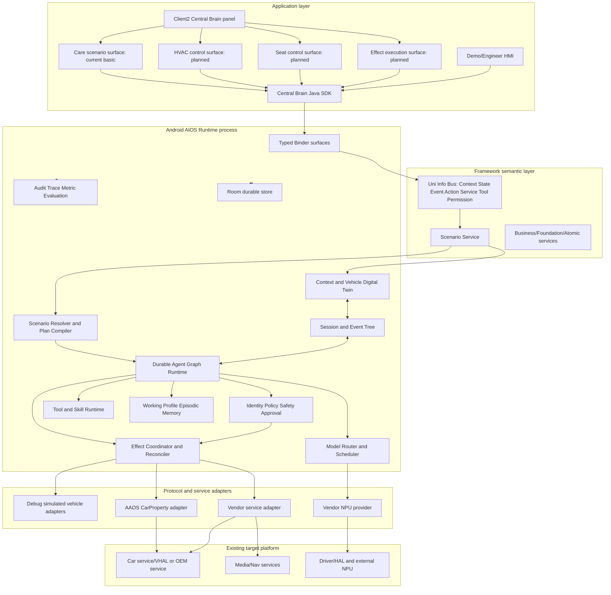
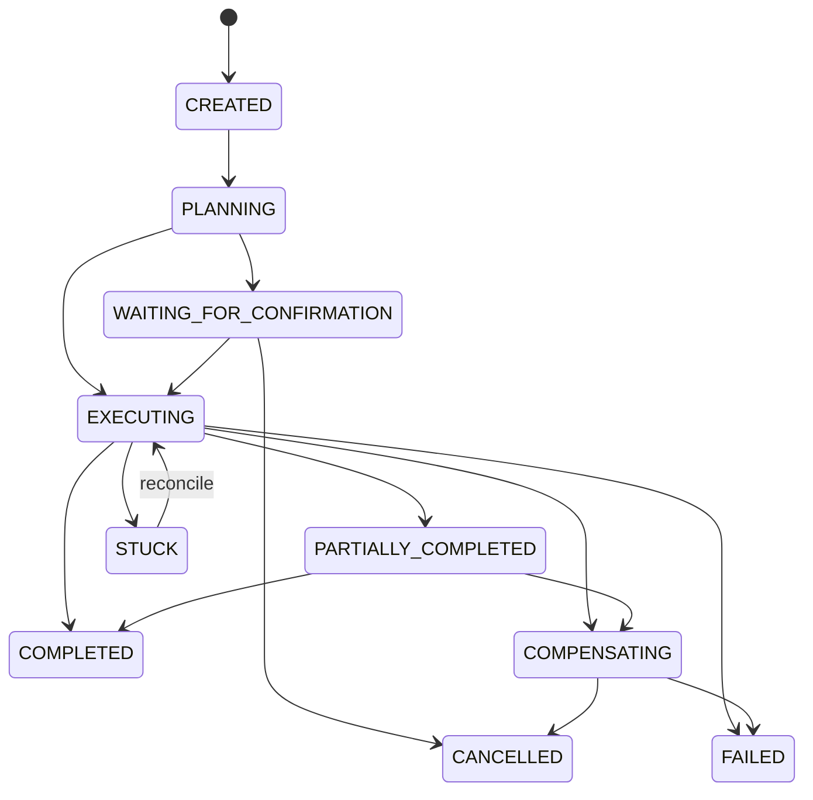
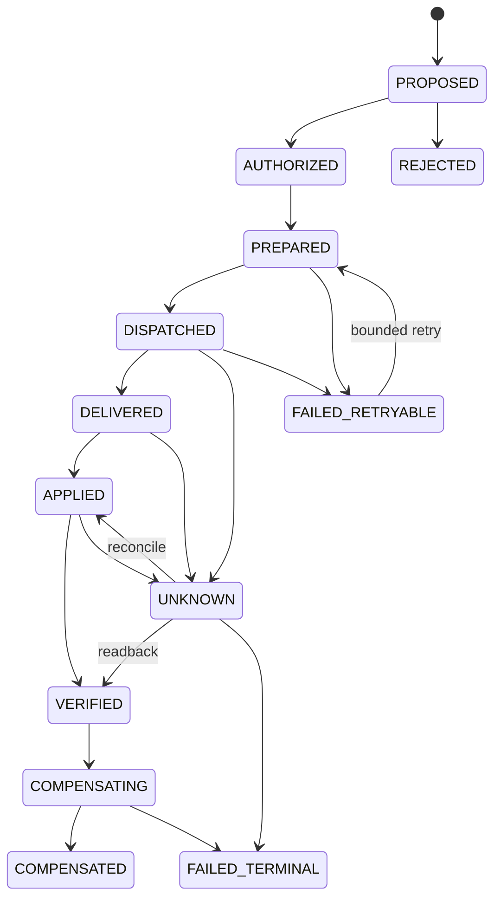
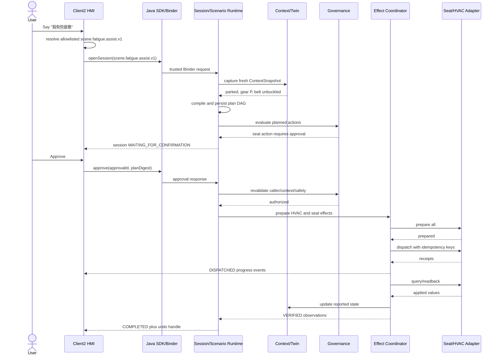

# Central Brain AIOS 完整软件开发设计说明

版本：2.6

日期：2026-07-16

状态：Stage 2 implementation baseline

面向对象：Android 座舱应用、平台 Runtime、AI/Agent、车辆服务、测试与集成工程师

目标平台：黑盒 Android 13 座舱域控制器

主要语言：Java/AIDL/C；Bash 用于构建与验收；仓库不再维护 Python AIOS 运行时

## 1. 文档目的

本文是整个 Central Brain AIOS 的实现级设计基线，统一描述：

- 当前仓库已经开发的模块及其真实成熟度；
- Stage 2 必须新增的最小颗粒度模块；
- 模块之间的调用、数据、线程、权限、状态和故障关系；
- 无真实 VHAL/NPU 时的仿真边界；
- 真实 Android 车辆/NPU 接口到位后的替换方式；
- 开发人员可直接采用的目录、类、AIDL、Room schema 和测试设计。

本文是当前唯一实现级总详设。发生冲突时，架构图 Req ID 优先，其次是本文，再其次是分模块接口和验收文档。Python 原型退役边界见 `CENTRAL_BRAIN_PYTHON_PROTOTYPE_RETIREMENT.md`。

## 2. 状态定义

| 状态 | 含义 | 可否作为产品能力宣称 |
| --- | --- | --- |
| `DEVELOPED` | 代码、测试和指定环境验证已存在 | 仅在文档明确的验证范围内可以 |
| `PROTOTYPE` | 可运行或可测试，但实现、容量或部署不满足量产 | 不可宣称量产 |
| `CONTRACT_ONLY` | 只有 DTO/API/registry/gate/empty interface | 不可宣称已执行 |
| `NOT_STARTED` | 设计已冻结，尚无实现 | 不可 |
| `EXTERNAL_BLOCKED` | 需要 OEM/vendor/目标硬件/权限/签名输入 | 不可，且不得以猜测实现 |
| `OUT_OF_SCOPE` | 用户明确排除或不属于本阶段 | 不开发 |

全局状态保持：`production_ready=false`、`target_hardware_validated=false`、
`driver_development_triggered=false`、`virtualization_development_triggered=false`。Android 13
物理设备应用层验收通过不等于车辆/NPU/整车硬件验收。

中控闭环状态保持：`cockpit_hvac_surface_implemented=false`、
`cockpit_seat_surface_implemented=false`、`cockpit_demo_control_loop_implemented=false`。
Client2 当前的基础悬浮面板不能作为 HVAC/Seat 闭环完成证据。

## 3. 架构原则

1. **架构图为需求基线**：所有 Stage 2 模块必须映射到原有 `APP/FW/NV/KH/XSC/DEL` Req ID。
2. **模型不是执行主体**：模型只做意图候选、参数建议、摘要；不能直接访问 EffectAdapter、CarPropertyManager 或 vendor service。
3. **所有副作用受治理**：车辆、媒体、导航、诊断和外部 Tool 必须经过 Action、Policy、Safety State、持久化 Effect 和 Audit。
4. **状态未知即限制**：车速、挡位、安全带、权限、adapter result 或 checkpoint 类型未知时 fail closed。
5. **发送不等于完成**：Effect 至少区分 `DISPATCHED`、`DELIVERED`、`APPLIED`、`VERIFIED`。
6. **仿真与量产同 contract**：仿真 adapter 可以改变 Digital Twin，但不能伪装成 production adapter。
7. **可恢复优先**：approval、plan、node、effect、observation 必须可在进程重启后恢复和 reconcile。
8. **黑盒平台边界**：不修改已刷机 Android/framework/VHAL，不猜私有设备节点/ioctl，不需要 root。
9. **无虚拟化开发**：不开发 Hypervisor/VM；Tool containment 是应用进程/allowlist 级边界，不称为虚拟化安全。
10. **Android 当前主线**：Stage 2 不开发 Linux 前端；跨 SoC contract 保持平台无关，早期 Python/Linux 样例已经退役。
11. **中控操作不直连设备**：Client2 中的 HVAC/Seat 手动控件与 AI 场景必须复用 Session、Governance、Effect 和 readback 链路；View 本地状态不是车辆状态。

## 4. 总体架构



## 5. 进程和部署

| 进程/制品 | package/模块 | 当前状态 | 职责 | 禁止职责 |
| --- | --- | --- | --- | --- |
| AIOS Runtime APK | `central-brain/android-runtime/runtime-service` | `DEVELOPED/PROTOTYPE` | Binder、治理、持久任务、模型/事件/记忆/技能骨架、native lifecycle | 不直接包含 Client2 UI，不访问私有硬件 node |
| Java SDK AAR | `central-brain-sdk` | `DEVELOPED` v1 | typed AIDL DTO/client、重连、callback | 不含 Policy/vehicle action 实现 |
| Native Runtime AAR | `native-runtime` | `DEVELOPED` lifecycle | C ABI、JNI、process-owned handle/capacity | 不读取 Binder identity，不加载 vendor NPU |
| Client2 Demo APK | `apk-labs/client2-central-brain` | `DEVELOPED` basic / HMI control `NOT_STARTED` | 当前入口、悬浮面板、场景请求和文本回复；规划意图/计划/执行/结果四阶段与 Effect 详情抽屉 | 不直连模型/vehicle adapter，不把 View 状态当回读 |
| Demo HMI APK | `demo-hmi` | `DEVELOPED` maintenance | SDK/Runtime/Governance 调试与验收 | 不作为产品 HMI |
| Policy probe | `policy-probe` | `DEVELOPED` test | caller/capability negative tests | 不随产品发布 |
| Retired prototype | none | `OUT_OF_SCOPE` | 不再提供 gateway、模型仿真或 Linux runtime | 不得恢复为 Android fallback |
| AAOS adapter | planned Runtime package | `EXTERNAL_BLOCKED` | 公开 CarProperty API 映射 | 不修改 VHAL/framework |
| Vendor NPU adapter | planned Runtime/native package | `EXTERNAL_BLOCKED` | 公开 vendor SDK lifecycle | 不自行开发未知 PCIe driver |

## 6. 仓库模块状态总表

### 6.1 已开发代码

| 最小模块 | 现有路径 | 状态 | 已验证边界 |
| --- | --- | --- | --- |
| Runtime AIDL v1 | `central-brain-sdk/.../production/ICentralBrainRuntime.aidl` | `DEVELOPED` | submit/cancel/status、version/hash |
| Governance AIDL v1 | `.../governance/ICentralBrainGovernance.aidl` | `DEVELOPED` | evaluate/request/status/cancel，故意没有 grant API |
| Diagnostic AIDL | `.../diagnostics/ICentralBrainDiagnostics.aidl` | `DEVELOPED` | 分页只读 diagnostics |
| Java SDK facade | `CentralBrainClient.java`、`CentralBrainGovernanceClient.java` | `DEVELOPED` | Binder connect/death/reconnect、typed DTO |
| Runtime Service | `CentralBrainRuntimeService.java` | `DEVELOPED/PROTOTYPE` | trusted task admission、callback、lifecycle |
| Governance Service | `CentralBrainGovernanceService.java` | `DEVELOPED/PROTOTYPE` | caller capability、action policy、approval contract |
| Diagnostic Service | `CentralBrainDiagnosticService.java` | `DEVELOPED` | read-only snapshots |
| Caller identity | `identity/*` | `DEVELOPED` | PackageManager signer/caller fingerprint |
| Capability policy | `policy/*`、`central_brain_capability_policy.xml` | `DEVELOPED` | signature permission + action capability |
| Job supervision | `supervisor/JobSupervisor.java` | `DEVELOPED` | bounded admission/cancel/deadline |
| Inference scheduling | `scheduler/InferenceResourceScheduler.java` | `DEVELOPED/PROTOTYPE` | bounded priority resource queue |
| Room v3 | `persistence/*`、`schemas/.../3.json` | `DEVELOPED` schema foundation | task/session/checkpoint/approval/outbox/effect/event cursor |
| Durable repositories | `DurableTaskRepository`、`DurableApprovalRepository`、`DurableEffectRepository`、`DurableEventCursorRepository` | `DEVELOPED/PROTOTYPE` | transaction and restart probes |
| Effect contract | `effects/EffectAdapter*.java` | `DEVELOPED` contract | adapter shape and delivery gate |
| Effect activation | `EffectDeliveryActivationGate`、`EmptyEffectMaterialSource` | `DEVELOPED` | production fail closed |
| Effect reconcile | `EffectStatusReconciler.java` | `PROTOTYPE` | existing effect status reconciliation skeleton |
| Model provider | `model/ModelProvider.java`、profiles/readiness | `DEVELOPED` contract | provider shape/readiness |
| Deterministic model | `DeterministicStubModelProvider`、`TestOnlyModelRouter` | `PROTOTYPE` test only | no production activation |
| Event runtime | `events/BoundedEventRuntime.java` | `PROTOTYPE` | bounded in-process event behavior |
| Memory lifecycle | `memory/BoundedMemoryLifecycle.java` | `PROTOTYPE` | capacity/TTL contract, no layered durable memory |
| Built-in Skill | `skills/BoundedBuiltInSkillRuntime.java` | `PROTOTYPE` | bounded signed built-in concept |
| Governance middleware | `governance/FixedGovernanceMiddlewareChain.java` | `PROTOTYPE` | fixed order and readiness |
| Safety snapshot | `SafetyVehicleStateSnapshot/Provider` | `CONTRACT_ONLY/PROTOTYPE` | runtime-owned state, no real vehicle source |
| Native C ABI | `native-runtime/src/main/cpp/*` | `DEVELOPED` lifecycle | arm64/x86_64 ABI, no vendor/hardware linkage |
| Client2 bridge | `bridge/src/com/centralbrain/client2/*` | `DEVELOPED` simple | Binder request/reply/recovery |
| Client2 panel | maintained XML/smali patch inputs | `DEVELOPED` simple | navigation toggle、outside dismiss、transparent overlay |

### 6.2 Stage 2 新增模块

| 域 | 最小模块 | 状态 | 派生需求 |
| --- | --- | --- | --- |
| Session contract | 5 个 Session DTO、`ICentralBrainSessionRuntime` V1、`SessionContract` | `CONTRACT_ONLY`（P1-W01） | `S2-SES-001` |
| Plan/Node contract | 4 个 Plan DTO、`PlanContract`、DAG/补偿/重试边界 | `CONTRACT_ONLY`（P1-W02） | `S2-SCN-001`、`S2-GRF-001` |
| Event contract | 5 个 Event DTO、`ICentralBrainSessionEvents`/callback V1、`EventContract` | `CONTRACT_ONLY`（P1-W03） | `S2-SES-001`、`S2-EVT-001` |
| Effect/Approval contract | 4 个 Effect/Approval/Undo DTO、`EffectContract`、状态/过期/绑定边界 | `CONTRACT_ONLY`（P1-W04） | `S2-EFF-001`、`S2-SAF-001`、`S2-UX-003` |
| Session runtime | SessionManager、EventTreeStore、SessionCallbackHub | `NOT_STARTED` | `S2-SES-001` |
| Context | VehicleSignal schema、ContextSnapshotBuilder | `NOT_STARTED` | `S2-CTX-001` |
| Twin | CapabilityCatalog、VehicleDigitalTwinStore | `NOT_STARTED` | `S2-TWN-001` |
| Scenario | ScenarioCatalog、Resolver、PlanCompiler、GraphValidator | `NOT_STARTED` | `S2-SCN-001` |
| Graph | AgentGraphRuntime、NodeExecutorRegistry、CheckpointSerializer | `NOT_STARTED` | `S2-GRF-001` |
| Safety | RiskClassifier、DrivingSafetyPolicy、ApprovalResumeValidator | `NOT_STARTED` | `S2-SAF-001` |
| Effect | EffectCoordinator、Verifier、CompensationPlanner、AdapterRegistry | `NOT_STARTED` | `S2-EFF-001` |
| Simulation | HVAC/Seat/Media/Nav adapters、DebugSimulationController | `NOT_STARTED` | `S2-ADP-001` |
| Tool | ToolManifest/Registry/RuleSolver/Executor | `NOT_STARTED` | `S2-TOL-001` |
| Skill | SkillArtifactVerifier、SkillSignerPolicy、SkillLifecycle | `NOT_STARTED` | `S2-TOL-001` |
| Memory | Working/Profile/Episodic stores、Consent、Budget | `NOT_STARTED` | `S2-MEM-001` |
| Event | DurableEventBroker、Subscription、Backpressure、TriggerEngine | `NOT_STARTED` | `S2-EVT-001` |
| Model | ProviderRegistry、PolicyAwareRouter、LocalProvider、Evaluator | `NOT_STARTED` | `S2-MDL-001` |
| Observability | TraceContext、MetricRecorder、ScenarioEvaluator | `NOT_STARTED` | `S2-OBS-001` |
| Product HMI state | state reducer、plan timeline、session/effect renderer | `NOT_STARTED` | `S2-UX-001` |
| Product HMI driving mode | moving/parked/unknown presentation policy | `NOT_STARTED` | `S2-UX-002` |
| Product HMI control | approval/cancel/retry/partial/undo controls | `NOT_STARTED` | `S2-UX-003` |
| Cockpit HVAC surface | power/zone/temp/fan/mode/preset controls | `NOT_STARTED` | `S2-HMI-001` |
| Cockpit Seat surface | heat/vent/massage/recline/preset/restriction | `NOT_STARTED` | `S2-HMI-002` |
| Cockpit control loop | reducer、desired/reported、timeline、recovery | `NOT_STARTED` | `S2-HMI-003` |
| Cockpit simulation presentation | SIMULATED/UNAVAILABLE source and engineer fault profile | `NOT_STARTED` | `S2-HMI-004` |
| Cockpit unified command path | manual and AI scenario share governed Effect flow | `NOT_STARTED` | `S2-HMI-005` |
| Cockpit intent orchestration UX | natural intent、Context/Plan/Policy/Effect/readback chain、device detail drawer | `NOT_STARTED` | `S2-HMI-006` |
| Real adapters | AAOS/Vendor/NPU | `EXTERNAL_BLOCKED` | `S2-ADP-002` |
| Release qualification | signer/migration/rollback/long-run/target evidence | `EXTERNAL_BLOCKED` | `S2-REL-001` |

## 7. 公共数据契约

### 7.1 Envelope

所有跨模块对象使用同一元数据，不允许传递 runtime implementation object。

```java
public final class Envelope<T> {
    public final String messageId;       // UUID, required
    public final String correlationId;   // request/session trace
    public final String causationId;     // parent event/action
    public final String type;            // allowlisted type
    public final int schemaVersion;
    public final long createdAtEpochMs;
    public final String sourcePrincipal;
    public final T payload;
}
```

限制：单个 Binder DTO 序列化后默认不超过 64 KiB；列表分页；字符串有字段级长度上限；未知 type/version 返回 `CB_ERR_SCHEMA_UNSUPPORTED`。

### 7.2 ID 与幂等

| ID | 产生方 | 稳定范围 | 用途 |
| --- | --- | --- | --- |
| `requestId` | SDK | 单次用户/系统请求 | 重放检测 |
| `sessionId` | SessionManager | 一次用户目标 | UI/事件/恢复主键 |
| `planId` | PlanCompiler | 一次计划版本 | approval digest 和 checkpoint |
| `nodeId` | PlanCompiler | plan 内稳定 | DAG dependency |
| `effectId` | EffectCoordinator | 一次逻辑副作用 | lifecycle/reconcile |
| `idempotencyKey` | Runtime | capability+target+scope+plan revision | adapter 重试去重 |
| `eventId` | EventTreeStore | 每个不可变事件 | cursor/parent/audit |
| `approvalId` | Governance | 一次批准请求 | resume/expiry |

## 8. SDK 与 Binder 设计

### 8.1 保留 v1

现有 `ICentralBrainRuntime`、`ICentralBrainGovernance`、`ICentralBrainDiagnostics` 保持 binary contract，不直接修改 hash 表示兼容。Stage 2 新增独立 scenario/session surface，SDK 对调用方组合为单 facade。

### 8.2 新增 AIDL 文件

实现路径：`central-brain-sdk/src/main/aidl/com/centralbrain/sdk/session/`。P1-W01 先冻结
`ICentralBrainSessionRuntime` V1 的 `open/get/list/cancel` 和 5 个有界 DTO。P1-W03 通过独立
`com.centralbrain.sdk.event` surface 冻结 Event/callback V1；approval/undo 继续使用后续独立版本，
不能改变任何已冻结 V1 事务顺序或 checksum。

```aidl
interface ICentralBrainSessionRuntime {
    const int INTERFACE_VERSION = 1;
    const String INTERFACE_HASH = "<generated-by-checker>";

    int getProtocolVersion();
    String getProtocolHash();
    SessionHandle openSession(in SessionRequest request);
    SessionSnapshot getSession(in SessionHandle handle);
    SessionPage listSessions(in SessionQuery query);
    boolean cancelSession(in SessionHandle handle, int reasonCode);
}
```

P1-W03 已定义 callback/event 合同；P1-W04 定义 Effect/Approval/undo DTO；P1-W05 才拥有 SDK
bind/death/reconnect/resubscribe 生命周期。把 reconnect 测试放在 DTO-only 层没有可测试 owner，因此
已在 backlog 中纠正，不降低最终 P1 验收要求。

P1-W03 的 callback 是提示，不是权威数据源。overflow、Binder death 或重连后客户端必须用
`ICentralBrainSessionEvents.getEvents` 的 opaque cursor 补齐，不能从 callback 队列推断完整状态。

### 8.3 SessionRequest

字段：

```text
requestId            String UUID required
scenarioId           String allowlisted, optional only for text intent
utterance             String max 1024, optional
source                HMI_BUTTON | VOICE | TRIGGER | API
seatZone              enum allowlist
locale                BCP-47 max 32
deadlineEpochMs       bounded future
clientContextVersion  int, informational only
```

HMI 不得提交 `speed/gear/belt` 作为权威输入。

Runtime admission 后将 `SessionRequest` 的场景目标映射为内部 immutable `ScenarioRequest`，供
`ScenarioResolver` 使用。AIDL 不暴露内部 resolver object。

P1-W01 的 `SessionContract.validateRequest(request, nowEpochMs)` 强制：schema=1、canonical UUID、
scenario ID 形状、source/seat allowlist、utterance <= 1024、locale <= 32、deadline 位于未来 5 分钟内，
且 HMI 不得提交 speed/gear/belt/permission/caller/signer 字段。`requestId` 是 admission 幂等键；owner
只能由未来 Session Service 的 Binder caller principal 派生。

### 8.4 Handle、Snapshot、Query 与 Page

- `SessionHandle`：canonical `sessionId`、accepted/expires wall-clock；TTL 由 Runtime 创建，客户端不能
  自报 owner。
- `SessionSnapshot`：session/request/scenario、完整 Session state allowlist、active plan revision、
  last event sequence、created/updated/deadline 和 <=512 字符摘要；UNKNOWN state 不可作为有效 snapshot。
- `SessionQuery`：state filter、includeTerminal、opaque cursor <=256、pageSize 1..50；owner scope 由
  Binder identity 隐式固定。
- `SessionPage`：最多 50 个已校验 snapshot、opaque next cursor、hasMore、generated timestamp；
  `hasMore=true` 时 next cursor 必填。

这些限制将单次典型 Session 页控制在 64 KiB 目标内。所有 DTO 是 Gradle application structured
AIDL，不是 VINTF stable AIDL；V1 文件由 `aidl-api/session-v1.sha256` 冻结，interface hash 由
`tools/check_central_brain_android_session_contract.sh` 对规范化源文件重算。

### 8.5 Plan/Node contract V1

实现路径：`central-brain-sdk/src/main/aidl/com/centralbrain/sdk/plan/`。P1-W02 冻结
`ScenarioPlan`、`PlanNode`、`NodeDependency` 和 `NodePolicy` 四个 structured parcelable，AIDL 合并
hash 为 `8dbf27424a09ecac969aff444e7fc9e3c939c7bc5c6687de2d8a5a627d60dabd`，逐文件 checksum 位于
`aidl-api/plan-v1.sha256`。

`ScenarioPlan` 字段固定为 schemaVersion、canonical plan/session ID、scenario ID、positive revision、
context/plan SHA-256 digest、compiled/deadline 和 bounded node/dependency 数组。`PlanNode` 固定携带
node/type/capability/input digest/resource key、timeout、maxAttempts、idempotencyKey、required、
compensationNodeId 和 `NodePolicy`；这些字段不得隐藏在 JSON、Bundle 或任意 Parcel blob 中。

`PlanContract` 的 V1 上限和拒绝规则：

- nodes 1..64、dependencies 0..256、graph depth <=16、同层 width <=8；plan deadline <=15 分钟；
- node timeout 1..120000 ms、maxAttempts 1..3；retryable 或 side-effect node 必须有 idempotency key；
- node ID、edge 和非空 idempotency key 在 plan 内唯一；dependency 必须引用存在节点且不可 self-edge；
- node type 只允许 13.2 节列出的 11 类 executor；schema、dependency condition、risk 和 failure mode
  未知时失败关闭；
- compensation 必须引用 plan 内 `compensate` node，不可 self-reference 或形成 compensation loop；
- HIGH/CRITICAL policy 必须携带 approval-required metadata，但最终 approval、Safety、Context 和
  capability 必须由 Runtime 在 dispatch 前重新求值，DTO 不能授予权限。

本工作包只实现 wire contract 与结构校验。P2-W07 才实现 `ScenarioPlanCompiler`、完整语义
`PlanGraphValidator`、required-effect verify、approval predecessor 和 moving branch 检查；P3 才实现
durable Graph 执行。`plan_runtime_published=false`，不得由 Client2 动画或本地 DTO 构造宣称已执行。

### 8.6 Event contract V1

实现路径：`central-brain-sdk/src/main/aidl/com/centralbrain/sdk/event/`。P1-W03 冻结
`RuntimeEvent`、`ActionEvent`、`ObservationEvent`、`MessageEvent`、`EventPage`、
`ICentralBrainSessionEvents` 和 one-way `ICentralBrainSessionEventCallback`，七文件合并 hash 为
`bb3618ca5f5818ce70b3a889a928b54ad83c70f0e439db5b62c67eb3234957d5`。

`RuntimeEvent` 的 canonical key 是 `(sessionId, sequence, eventId)`；`eventDigest` 绑定不可变 replay
identity，`parentEventId/parentSequence` 建立因果树。每个事件必须且只能包含匹配 `payloadKind` 的一个
typed payload。`EventPage` 要求 sequence 严格连续，页内 parent 必须先于 child，initial/subsequent
cursor 语义、`nextCursor/nextSequence/hasMore` 必须一致。每页最多 100，display text 最多 1024。

```aidl
interface ICentralBrainSessionEvents {
    int getProtocolVersion();
    String getProtocolHash();
    EventPage getEvents(String sessionId, String cursor, int limit);
    boolean registerSessionCallback(String sessionId, String cursor,
        ICentralBrainSessionEventCallback callback);
    boolean unregisterSessionCallback(String sessionId,
        ICentralBrainSessionEventCallback callback);
}

oneway interface ICentralBrainSessionEventCallback {
    void onEvent(in RuntimeEvent event);
    void onOverflow(String resumeCursor);
    void onClosed(int reasonCode, String resumeCursor);
}
```

P1-W03 不发布 Service、不写 Room、不执行 Effect。未来 Service 必须从 Binder principal 派生 session
owner/capability；query/callback 参数不得携带 caller、signer、permission、speed、gear 或 belt 断言。
`event_runtime_service_published=false`、`event_callback_service_published=false`。

### 8.7 Effect/Approval contract V1

实现路径：`central-brain-sdk/src/main/aidl/com/centralbrain/sdk/effect/`。P1-W04 冻结
`EffectIntent`、`EffectObservation`、`ApprovalPrompt` 和 `UndoHandle`，四文件合并 hash 为
`709828114422595f1889dad58e8e60daf4d5e4f98c962a6145f2f8a39b0c178d`，逐文件 checksum 位于
`aidl-api/effect-v1.sha256`。本工作包没有 Binder interface。

`EffectIntent` 以 `valueKind` 激活 boolean/integer/decimal/text 中且仅一个 bounded scalar；其余字段
必须保持默认，target digest 绑定 canonical value。Intent 同时绑定 session/plan/node/action/capability、
idempotency、plan/Context digest + Context version、risk、verification、compensation 与 15 分钟 deadline。

`EffectObservation` 的状态不可合并：`DISPATCHED` 只表示已提交，`DELIVERED` 表示 adapter 已接收，
`APPLIED` 必须有 reported digest，`VERIFIED` 才可作为原 Effect 终态。UNKNOWN 只能 reconcile 到
APPLIED/VERIFIED/FAILED_TERMINAL；FAILED_RETRYABLE 只能以相同 binding、递增一次 attempt 回到 PREPARED。
任何 terminal observation 都不可继续变更。Simulation source 与 `simulated=true` 必须成对出现。

`ApprovalPrompt` 只供 HMI 展示 reason/prompt code 和 expiry；它把 approval 精确绑定到
plan/action/target/Context/policy。Resume 使用 Runtime 当前权威摘要逐项比较，过期或 stale 时拒绝，
不能把 prompt 当 grant。`UndoHandle` 只在 verified reversible Effect 后出现，有独立 TTL；undo 生成新的
governed compensation session，重新读取 Safety/Context/capability，绝不是数据库回滚。

状态固定：`effect_runtime_service_published=false`、`approval_response_service_published=false`、
`undo_service_published=false`。P1-W05 才组合 SDK facade；P1-W06 才持久化这些对象。

### 8.8 Java SDK facade

计划类：

```java
public interface ScenarioClient extends AutoCloseable {
    SessionHandle openSession(SessionRequest request, SessionListener listener);
    SessionSnapshot get(SessionHandle handle);
    SessionPage list(SessionQuery query);
    EventPage events(SessionHandle handle, long afterSequence, int limit);
    boolean approve(ApprovalResponse response);
    boolean reject(ApprovalResponse response);
    UndoHandle undo(SessionHandle handle, UndoRequest request);
    void reconnect();
}
```

SDK 必须：

- 在 Binder death 后通知 `disconnected`，有界重连；
- 重连后先读 snapshot/page，再 attach callback；
- 不自行重发未知结果的 scenario request；
- 对 listener 使用调用方提供的 `Executor`，不在 Binder thread 运行 UI；
- `close()` 幂等并释放 callback。

## 9. HMI 模块详设

### 9.1 BrainNavEntry

- 路径：Client2 maintained patch source；状态：Stage 1 `DEVELOPED`，Stage 2 badge `NOT_STARTED`。
- 输入：`PanelState.visibility`、active session aggregate state。
- 输出：`TogglePanel`。
- 规则：第二次点击隐藏；running/waiting/error 以不同状态点显示；不得通过 visibility 控制 Runtime session。

### 9.2 BrainOverlay

- 状态：基础 `DEVELOPED`，Stage 2 无障碍/驾驶态适配 `NOT_STARTED`。
- 组成：透明 scrim + 浅灰半透明 panel；outside touch 发出 dismiss。
- 规则：panel touch 消费事件；outside dismiss 不 cancel；Activity 重建后由 reducer 恢复。

### 9.3 IntentComposer

- 状态：当前简单场景按钮 `DEVELOPED`；自然场景输入和 bounded resolver `NOT_STARTED`。
- 输入：voice/text phrase、`ScenarioAvailabilitySnapshot`、driving presentation。
- 输出：`IntentRequest`，经 allowlisted resolver 归一化为 immutable scenario ID 和 bounded parameter，
  再创建 `SessionRequest`。
- 模型不能从自然文本直接创建 capability/Effect；moving 使用语音优先且只允许低风险 scenario。
- 原快捷按钮降为示例短语，不作为顶层设备导航。

### 9.4 CentralBrainPanelState

计划路径：`apk-labs/client2-central-brain/bridge/src/com/centralbrain/client2/ui/`。

```java
final class CentralBrainPanelState {
    boolean visible;
    PanelPresentationMode mode;
    ConnectionState connection;
    SessionSnapshot activeSession;
    List<PlanNodeViewState> nodes;
    ApprovalViewState approval;
    UndoViewState undo;
    IntentDraftViewState intentDraft;
    ContextDigestViewState contextDigest;
    PlanSummaryViewState planSummary;
    ResultEvidenceViewState resultEvidence;
    String conciseSummary;
    FaultViewState fault;
}
```

状态只能由 `CentralBrainPanelReducer.reduce(oldState, UiEvent)` 更新。View/smali controller 不保存权威 Runtime state。

### 9.5 PlanTimeline

每行固定高度/最小宽度，字段为 icon、短标题、目标、状态、可选 detail。状态映射：

| Runtime | UI |
| --- | --- |
| PENDING | 空心圆 |
| RUNNING/DISPATCHED | 进度指示，文案“正在执行” |
| WAITING_FOR_CONFIRMATION | 警示图标，approval bar |
| VERIFIED | 勾选，文案“已完成” |
| SKIPPED | 灰色，显示原因 |
| FAILED_RETRYABLE | 错误 + 重试 |
| FAILED_TERMINAL | 错误 + 说明 |
| UNKNOWN | “正在确认结果” |
| COMPENSATED | “已恢复” |

### 9.6 ApprovalBar

- 显示动作、设备区域、风险原因、过期时间，不显示内部 policy dump。
- `approve` 发送 approvalId + planDigest + displayedRevision；Runtime 重新验证 caller/context。
- 连点由 request ID 幂等；按钮提交后 disabled，直到 observation 或 timeout。

### 9.7 DrivingUxPolicy

```java
PanelPresentationMode modeFor(DrivingState state,
                              SessionSnapshot session,
                              ScenarioCatalogSnapshot catalog);
```

`UNKNOWN` 和异常按 `MOVING_RESTRICTED`。该类只控制呈现，不授权 Effect。

### 9.8 Client2 AIOS 四阶段信息架构

`BrainOverlay` 保留原有右侧半透明悬浮形态，在同一 APK 内增加稳定的 segmented navigation：

| 视图 | 责任 | 不允许承担的责任 |
| --- | --- | --- |
| 意图 | 自然场景 voice/text、示例短语、可信 Context 摘要 | 不直接生成 Effect 或把模型文本当权威计划 |
| 计划 | normalized scenario、Context、Plan、Policy、HIGH-risk approval | 不由 HMI 本地决定 capability 或安全授权 |
| 执行 | Effect timeline、live trace、partial、retry、stop | 不把 DISPATCHED 显示成 VERIFIED |
| 结果 | desired/reported/source/quality、feedback、undo | 不用本地 feedback 覆盖设备 readback |

Header 固定显示 connection、`SIMULATED/TARGET/UNAVAILABLE` source 和
`PARKED/MOVING/UNKNOWN_RESTRICTED` presentation。Intent -> Context -> Plan -> Policy -> Effect ->
readback 主链在计划/执行/结果阶段持续可见。Persistent execution strip 在所有视图可见；
隐藏 overlay 只影响呈现，不取消已接受 session。

HMI-D0/HMI-D1 使用固定 1920x1080 设计坐标。`BrainOverlay` 的安全框为
`left=1264, top=160, width=624, height=888`，右边界 1888、下边界 1048；Panel 内 Surface 独立滚动，
不得通过扩大根 View 或超出 RenderService 画布承载内容。主玻璃 alpha 为 0.60，Android blur 不可用
时才切换到 0.82 浅灰 fallback。浏览器原型只负责等比预览，不改变 Android layout contract。

HVAC 和 Seat 不再占据顶层 tab，而是由 Effect row 打开 `DeviceDetailDrawer`。抽屉保留完整
desired/reported 和手动微调，但手动请求仍创建 governed scenario。“执行”视图是通用 Effect
projection，不只服务 HVAC/Seat。任何 cold/fatigue/rest plan 中的
Media/Navigation Effect 也必须显示 target、source、progress、reported result 和适用的 stop/cancel；
专用 Media/Nav 页面可以后续增加，但文本回复不能替代该最小中控闭环。

### 9.9 ClimateSurfaceBinder

计划路径：`bridge/src/com/centralbrain/client2/hmi/ClimateSurfaceBinder.java`；需求：
`S2-HMI-001`、`S2-HMI-003..005`。

- listener 将控件变更转换为 bounded `CockpitHmiIntent`，温度/风量连续输入使用 300 ms debounce；
- coordinator 将 intent 转换为 `scene.manual.hvac.adjust.v1`，通过 `ScenarioClient` 提交；
- renderer 同时显示 `desiredValue`、`reportedValue`、quality、source、revision 和 effect state；
- debug demo 范围可为 16.0-30.0 C、0.5 C step、fan 0-7，但 target 范围只能来自
  `CapabilityCatalog`，不支持项显示 unavailable；
- pending 可以更新 desired，不得提前更新 reported；只有 observation/readback 匹配后进入 VERIFIED。

### 9.10 SeatSurfaceBinder

计划路径：`bridge/src/com/centralbrain/client2/hmi/SeatSurfaceBinder.java`；需求：
`S2-HMI-002..005`。

- heating 和 ventilation 互斥必须被编译为显式多 Effect plan，而非 UI 本地互斥动画；
- recline 与 rest preset 在 `MOVING` 或 `UNKNOWN_RESTRICTED` 时 disabled；
- `PARKED` 只允许用户预览/提交，Runtime 仍在 plan compile、approval resume、dispatch 前读取 fresh
  Context 并 fail closed；
- 驾驶席大角度动作使用 HIGH risk approval，approval 后 Context revision 改变必须拒绝旧批准；
- passenger 行为独立使用 occupant/capability policy，不默认继承驾驶席规则。

### 9.11 CockpitHmiState、Reducer 与 Renderer

计划根状态包含 connection、presentation、source badge、selected surface、intent draft、context
digest、plan summary、active session、climate、seat、execution、result evidence、approval、undo 和
last error。`CockpitHmiReducer` 在单线程 executor 顺序消费 SDK
snapshot/event；`CockpitHmiRenderer` 只在 main thread 将 immutable state 渲染到 View。

重连顺序固定为 Binder connected -> session/twin snapshot -> cursor replay -> callback attach。页面重开、
Activity recreate 或 Runtime process death后，不允许从控件默认值覆盖恢复状态，也不自动重发结果未知的
Effect。`PARTIALLY_COMPLETED` 必须逐项显示成功/失败；undo 是新的 governed compensation session。

### 9.12 CockpitControlCoordinator 与运行 profile

```text
Natural scene phrase or governed manual detail
 -> IntentResolver / allowlisted scenario
 -> ScenarioClient
 -> Session / Policy / Approval / Durable Graph
 -> EffectCoordinator
 -> Simulated adapter (debug/test) or target adapter (future)
 -> EffectObservation / DigitalTwin reported state
 -> CockpitHmiReducer
 -> intent / plan / execution / result render
```

Debug/test profile 注册 `SimulatedHvacEffectAdapter` 和 `SimulatedSeatEffectAdapter`，永久显示
`SIMULATED`，默认驾驶态为 `UNKNOWN_RESTRICTED`，并可通过受保护工程入口注入 delay、timeout、
failure 和 mismatch。Release/production profile 不包含工程入口或隐式模拟 fallback；真实 adapter
缺失时 source=`UNAVAILABLE` 且控件禁用。详细控件、状态机、工作包和 22 项验收见
`CENTRAL_BRAIN_COCKPIT_HMI_CONTROL_LOOP_PLAN.md`。

## 10. Session 与 Event Tree

### 10.1 SessionManager

计划路径：`runtime-service/.../session/SessionManager.java`。

职责：

- create/get/list/cancel session；
- 将 caller principal 固定到 session；
- 控制同一 seat/actuator 冲突策略；
- 保存 active plan revision；
- 聚合 graph/effect/approval 状态为 snapshot；
- 终态后按 retention policy 清理 working memory。

不负责：解析模型、授权动作、调用 adapter。

### 10.2 Session 状态机



终态：COMPLETED/FAILED/CANCELLED。`PARTIALLY_COMPLETED` 可终止展示，也可在用户重试/撤销时继续产生新 revision。

### 10.3 EventTreeStore

事件基类：`RuntimeEvent(eventId, sequence, sessionId, parentEventId, type, source, timestamp, payloadDigest, payload)`。

事件类型：

- `UserMessageReceived`、`ScenarioRequested`；
- `ContextCaptured`、`PlanCompiled`；
- `ActionProposed`、`ActionAuthorized`、`ActionRejected`；
- `ApprovalRequested`、`ApprovalResolved`、`ApprovalExpired`；
- `EffectPrepared`、`EffectDispatched`、`EffectObserved`、`EffectVerified`、`EffectFailed`；
- `ToolInvoked`、`ToolObserved`；
- `ModelRequested`、`ModelObserved`；
- `CompensationStarted/Observed`；
- `AssistantSummaryCreated`、`SessionStateChanged`。

事件 immutable；修正通过新事件表达，不能 update 旧事件。P1-W03 已冻结上述 23 类事件的 wire
合同和结构校验，但 `EventTreeStore`、durable sequence source、Room v4、Service publication 仍未实现。

### 10.4 SessionCallbackHub

- 按 session 维护 callback weak registration；
- callback death 只移除订阅，不取消 session；
- per-callback bounded queue；overflow 发 close reason，客户端 cursor replay；
- callback 不在 DB transaction 内调用；
- caller 只能订阅自己有 capability 的 session。

## 11. Context 与 Vehicle Digital Twin

### 11.1 SignalValue

```java
final class SignalValue {
    VehicleSignalPath path;
    SignalScalar value;
    String unit;
    String area;
    long sourceTimestampMs;
    long receivedTimestampMs;
    SignalQuality quality; // VALID, STALE, UNAVAILABLE, ERROR, CONFLICT
    SignalSource source;   // SIMULATED, AAOS, VENDOR, DERIVED
    long revision;
}
```

不使用 untyped `Object` 或任意 JSON 作为安全关键值。

### 11.2 CapabilityCatalog

每个 capability 记录：

```text
capabilityId, version, areas, readable, writable,
simulatedAvailable, productionAvailable, productionAuthorized,
valueType, unit, min, max, step,
riskClass, requiresFreshSignals[], adapterId, adapterVersion
```

`productionAvailable=true` 不等于 `productionAuthorized=true`。只有 activation evidence 通过后才能授权。

### 11.3 VehicleDigitalTwinStore

API：

```java
DigitalTwinSnapshot snapshot(Set<VehicleSignalPath> paths);
Optional<SignalValue> reported(VehicleSignalPath path, String area);
Optional<DesiredStateRecord> desired(VehicleSignalPath path, String area);
long updateReported(SignalValue value);
long setDesired(DesiredStateRecord desired);
boolean compareAndSetDesired(long expectedRevision, DesiredStateRecord desired);
```

规则：

- desired 和 reported 分离；
- adapter callback 只更新 reported；
- old source timestamp 不覆盖新值；
- source conflict 标记 `CONFLICT`；
- safety-critical snapshot 要求同一 revision window；
- Stage 2 仿真状态在 debug profile 可持久化，production 不自动继承。

### 11.4 ContextSnapshotBuilder

输出包含：

```text
contextId, schemaVersion, twinRevision, capturedAt,
drivingState, safetyState, seatZone, fields[],
missingRequiredFields[], staleFields[], conflictFields[],
restricted, digest
```

关键字段 policy：speed/gear/motion 任一 unavailable/stale/conflict，则 `restricted=true`。Seat recline 还要求 occupancy/belt/reported angle fresh。

## 12. Scenario Service

### 12.1 ScenarioManifest

存放路径：`runtime-service/src/main/assets/scenarios/<scenario-id>.json`。

字段：

```json
{
  "scenarioId": "scene.fatigue.assist.v1",
  "version": 1,
  "displayKey": "scenario_fatigue",
  "supportedSources": ["HMI_BUTTON", "VOICE"],
  "supportedZones": ["ROW1_DRIVER"],
  "requiredContext": [],
  "optionalContext": [],
  "requiredCapabilities": [],
  "optionalCapabilities": [],
  "branches": [],
  "nodes": [],
  "fallback": {},
  "memoryPolicy": {},
  "uxPolicy": {}
}
```

Manifest 必须有 JSON schema、artifact digest 和 build-time validation。Runtime 不接受 HMI 提交的新 manifest。

### 12.2 ScenarioCatalog

职责：load/validate/index manifest；按 device capability/driving state/seat zone 输出 availability。重复 ID、未知 node type、无效 capability 或 cycle 导致整个 manifest disabled，不影响其他场景。

### 12.3 ScenarioResolver

```java
ScenarioResolution resolve(ScenarioRequest request,
                           ScenarioCatalogSnapshot catalog,
                           ContextSnapshot context);
```

优先级：显式 scenario ID > deterministic intent rule > policy-approved model candidate。模型候选必须存在于 catalog。

### 12.4 ScenarioPlanCompiler

```java
ScenarioPlan compile(ScenarioManifest manifest,
                     ContextSnapshot context,
                     CapabilityCatalogSnapshot capabilities,
                     UserPreferenceSnapshot preferences);
```

输出 immutable DAG。Compiler 做结构和 range 校验，不做最终授权；Graph 执行每个 action 前由 Governance 重验。

### 12.5 PlanGraphValidator

检查：

- node ID 唯一；
- 无环；
- dependency 存在；
- node type allowlisted；
- required effect 有 verify node；
- HIGH effect 前存在 approval node；
- compensation 引用合法且无 compensation loop；
- moving/unknown branch 不含 driver recline dispatch；
- 最大节点数、深度、并行度、总 deadline 受限。

## 13. Durable Agent Graph Runtime

### 13.1 AgentGraphRuntime

```java
interface AgentGraphRuntime {
    GraphRunHandle start(ScenarioPlan plan, RuntimePrincipal principal);
    GraphRunSnapshot get(GraphRunHandle handle);
    boolean resume(GraphRunHandle handle, ResumeInput input);
    boolean cancel(GraphRunHandle handle, CancelReason reason);
    ReconcileResult reconcile(GraphRunHandle handle);
}
```

### 13.2 NodeExecutor

```java
interface NodeExecutor<I extends NodeInput, O extends NodeOutput> {
    String nodeType();
    Class<I> inputType();
    NodeExecutionResult<O> execute(NodeExecutionContext context, I input);
    NodeReconcileResult reconcile(NodeExecutionContext context,
                                  NodeCheckpoint checkpoint);
    CancelResult cancel(NodeExecutionContext context,
                        NodeCheckpoint checkpoint);
}
```

首批 executor：

| type | 类 | 副作用 | checkpoint durability |
| --- | --- | --- | --- |
| `context.capture` | `ContextNodeExecutor` | 无 | SYNC |
| `policy.evaluate` | `PolicyNodeExecutor` | audit | SYNC |
| `approval.interrupt` | `ApprovalInterruptExecutor` | durable approval | SYNC |
| `effect.execute` | `EffectNodeExecutor` | 有 | SYNC |
| `effect.verify` | `EffectVerificationExecutor` | readback | SYNC |
| `tool.invoke` | `ToolNodeExecutor` | 取决于 tool | manifest 指定，副作用必须 SYNC |
| `model.invoke` | `ModelNodeExecutor` | 无车辆副作用 | ASYNC/SYNC by purpose |
| `memory.query` | `MemoryQueryNodeExecutor` | 无 | ASYNC |
| `memory.write` | `MemoryWriteNodeExecutor` | 数据副作用 | SYNC |
| `summary.render` | `SummaryNodeExecutor` | event only | ON_EXIT 可接受 |
| `compensate` | `CompensationNodeExecutor` | 有 | SYNC |

### 13.3 调度和并发

- 同一 session 使用串行 state reducer；
- 无资源冲突的 READY node 可由 bounded executor 并发；
- resource key 形如 `vehicle:seat:row1-driver:recline`；
- 同 resource key 必须互斥；
- DB transaction 不持有 adapter/model 网络调用；
- prepare/checkpoint -> commit -> dispatch -> observation 是分段事务；
- JobSupervisor 负责 deadline/cancel，Graph Runtime 负责语义状态。

### 13.4 CheckpointSerializer

允许：String、boolean、bounded integer/float、enum、list/map of primitives、已注册 DTO。禁止：Java serialization、class name reflection、file path、Binder object、native pointer、arbitrary parcel blob。

Envelope：`schemaVersion/type/nodeId/planDigest/contextDigest/payload/digest/createdAt`。恢复时任一 digest/type/version 不匹配，session 进入 STUCK 并等待人工清理或兼容 migration。

### 13.5 Retry/Timeout

- retryable error 必须显式枚举；
- Effect retry 必须有相同 idempotencyKey；
- 默认 maxAttempts=1，只有 manifest/policy allowlist 可提高；
- 总 deadline 优先于 node deadline；
- timeout 后若 adapter outcome unknown，先 reconcile，禁止立即盲重试；
- backoff 上限固定，Runtime 重启后继续计算绝对 nextAttemptAt。

## 14. Governance 与 Safety

### 14.1 固定中间件顺序

```text
CallerIdentity
 -> CapabilityPolicy
 -> SchemaValidation
 -> Scenario/Tool Availability
 -> DrivingSafetyPolicy
 -> RiskClassifier
 -> Consent/ApprovalPolicy
 -> RateLimit/QoS
 -> EffectActivationGate
 -> AuditDecision
```

任何 middleware deny/unknown 后停止，不执行后续副作用。

### 14.2 RiskClassifier

```java
RiskAssessment classify(ActionDescriptor action,
                        ContextSnapshot context,
                        CapabilityCatalogSnapshot catalog);
```

输出：READ_ONLY/LOW/MEDIUM/HIGH/CRITICAL、reason codes、approval requirement、hard interlock。异常/超时/未知 action 返回 HIGH 或 CRITICAL deny，而不是 allow。

### 14.3 DrivingSafetyPolicy

硬规则优先于配置：

- moving/unknown 驾驶席 recline/large movement `DENY_HARD_INTERLOCK`；
- parked seat movement 需要 gear P、speed 0、occupancy valid、belt unbuckled、fresh reported angle；
- driving state 变化会使未 dispatch authorization 失效；
- UI approval 不能覆盖 hard interlock；
- CRITICAL 场景必须有 OEM 专用 policy module，不由通用 manifest 开启。

### 14.4 ApprovalResumeValidator

批准对象包含：approvalId、principalFingerprint、sessionId、planDigest、nodeId、actionDigest、contextDigest、policyVersion、createdAt、expiresAt。Resume 时重读 caller capability、Safety State、Context freshness 和 adapter activation；变化时批准失效并产生 `ApprovalInvalidated`。

### 14.5 ConsentManager

区分：一次动作确认、场景自动执行授权、profile memory 同意、外部网络/云模型同意。不同 scope 不能互相替代。Consent record 有 subject/scope/purpose/version/TTL/revokedAt/auditId。

## 15. Effect 系统

### 15.1 EffectIntent

```java
final class EffectIntent {
    String effectId;
    String actionId;
    String capabilityId;
    String targetArea;
    TypedValue targetValue;
    String unit;
    String idempotencyKey;
    String planDigest;
    String contextDigest;
    RiskClass risk;
    boolean required;
    VerificationPolicy verification;
    CompensationDescriptor compensation;
    long deadlineEpochMs;
}
```

P1-W04 已将上述概念压缩为四个 Android structured parcelable 和 `EffectContract`。当前 typed scalar
直接内嵌于 `EffectIntent`，没有 JSON、Bundle 或额外 `TypedValue` Parcelable；Adapter/coordinator 尚未
消费该 DTO，真实 effect delivery 仍由 production fail-closed gate 阻塞。

### 15.2 Effect 状态机



### 15.3 EffectAdapter v2

```java
interface EffectAdapter {
    AdapterDescriptor descriptor();
    Set<VehicleCapability> capabilities();
    PrepareResult prepare(EffectContext context, EffectIntent intent);
    DispatchReceipt dispatch(EffectContext context,
                             PreparedEffect prepared);
    EffectObservation query(EffectContext context,
                            DispatchReceipt receipt);
    CancelResult cancel(EffectContext context,
                        DispatchReceipt receipt);
    CompensationResult compensate(EffectContext context,
                                  CompensationIntent intent);
    AdapterHealth health();
}
```

`prepare` 不产生设备副作用。`dispatch` 必须接受 idempotencyKey。Adapter 不自行决定用户许可，但必须做最后的 capability/range/safety sanity check。

### 15.4 AdapterRegistry

选择键：capability + area + profile。优先级不能把 simulated adapter 当 production fallback：

```text
DEBUG_SIMULATION profile -> simulated allowlist
PRODUCTION profile -> activated production adapter only
```

没有 activated adapter 返回 `CB_ERR_ADAPTER_UNAVAILABLE`，不能自动使用 simulation。

### 15.5 EffectCoordinator

职责：

- 校验一批 Effect dependency/resource conflict；
- required effects 全部 prepare 成功后才 dispatch；
- 可独立降级的 optional effect prepare 失败不阻塞 batch；
- 将 before state 保存为 compensation material；
- 写 outbox/claim，调用 adapter，记录 receipt；
- 聚合 `all/partial/failed/unknown`；
- 调用 verifier/reconciler。

不负责：自然语言计划、UI 文案、改变 policy decision。

### 15.6 EffectVerifier

验证策略：

- `CALLBACK_ONLY`：只适用于无 readback 的低风险服务；
- `REPORTED_EQUALS`：reported value 等于 target；
- `REPORTED_TOLERANCE`：数值在 tolerance；
- `STATE_TRANSITION`：目标状态转换；
- `COMPOSITE`：多字段一致。

Seat recline 和 HVAC 量产路径至少需要 readback。超过 verification deadline 进入 UNKNOWN/FAILED，不显示 completed。

### 15.7 CompensationPlanner

仅为 reversible capability 生成 compensation。使用 before snapshot 的绝对 target，不做相对反向动作。执行 compensation 前重新走完整 Governance。Undo handle 有 TTL；过期或当前 Safety State 不允许时拒绝。

## 16. 仿真 Adapter

### 16.1 SimulatedEffectAdapter

只能注册在 debug/test profile；descriptor 必须含 `simulation=true`、`productionAuthorized=false`。所有 observation 标注 source `SIMULATED`，HMI 工程模式显示“仿真”。

### 16.2 SimulatedHvacEffectAdapter

支持：power、target temperature、fan level。检查 area/range/step，更新 desired，按 simulation clock 延迟更新 reported。故障：UNAVAILABLE/TIMEOUT/REPORTED_MISMATCH/TERMINAL_FAILURE。

### 16.3 SimulatedSeatEffectAdapter

支持：heating、ventilation、recline。Recline dispatch 前调用 `SafetyVehicleStateProvider` 取 fresh snapshot；moving/unknown/belt buckled 拒绝。仿真角度分段变化并发布 progress observation。

### 16.4 SimulatedMedia/Navigation

Media 只更新 simulated player state；Navigation 返回 synthetic POI/route observation。不得启动未知外部 package 或上传位置。

### 16.5 DebugSimulationController

API 仅 debug build/signature capability：setDrivingState、setSignal、setAdapterFault、advanceSimulationClock、reset。每个命令写 debug audit。Production manifest 不 exported、不注册 service。

## 17. Tool 与 Skill 平台

### 17.1 ToolManifest

字段：toolId/version/provider/inputSchema/outputSchema/capabilities/risk/timeout/maxOutputBytes/idempotent/sideEffect/requiredBeforeExit/requiresApproval/healthCheck/allowedCallers。

### 17.2 ToolRegistry

状态：REGISTERED、RESOLVED、USABLE、UNHEALTHY、DISABLED、INCOMPATIBLE。`resolve` 只选版本；`isUsable` 还检查 signer、health、capability、Safety State、runtime version。

### 17.3 ToolRuleSolver

输入：scenario manifest rules、completed tool events、current context、model candidate。输出允许 tool ID 集合和必须执行项。模型候选必须与允许集合求交集；空集返回 no-tool plan。

### 17.4 ToolExecutor

首版 `InProcessBuiltInToolExecutor` 只调用编译期 allowlist Java implementation。边界：独立 bounded executor、deadline/cancel、输入输出 schema、output size、audit。动态 package/process/MCP executor 分别作为未来 binding，不能绕过同一接口。

### 17.5 SkillArtifactVerifier

验证 artifact hash、signer certificate digest、manifest schema、minimum runtime、declared tools/capabilities、dependency DAG、forbidden API static list。验证成功不等于动态加载批准；production dynamic loader 默认为 disabled。

## 18. Memory 系统

### 18.1 WorkingMemoryStore

- scope：session；默认随 terminal + grace period 删除；
- 内容：当前目标、已确认参数、node outputs、临时摘要；
- 限制：items/bytes/tokens/TTL；
- 不保存原始连续车辆信号，仅保存 Context digest 和必要 snapshot fields。

### 18.2 ProfileMemoryStore

- scope：user + seat zone + purpose；
- 字段 allowlist：comfort temperature band、seat heat level、media preference、rest mode preferences；
- 写入前 explicit consent；
- 支持 list/read/update/delete/export/revoke；
- user identity 不可用时禁用持久 profile，不退化成全车共享身份。

### 18.3 EpisodicMemoryStore

保存结构化场景摘要：scenarioId、time bucket、context class、actions requested、verified outcomes、user feedback、retention expiry。不保存完整用户原文、精确位置轨迹或高频 signal stream。

### 18.4 ContextBudgetManager

分配顺序：system safety instructions > current Context > scenario manifest > user-approved profile > relevant episode summaries > conversation history。超限时先删旧 history，再压缩 episode；不能截断 safety policy 或 schema。

### 18.5 MemoryConsentService

接口：`getConsent`、`grantConsent`、`revokeConsent`、`deleteScope`、`exportScope`。所有调用经过 caller identity/policy/audit；moving UI 不暴露复杂管理。

## 19. Event Broker 与主动触发

### 19.1 EventBroker

```java
interface EventBroker {
    PublishResult publish(RuntimeEvent event);
    SubscriptionHandle subscribe(SubscriptionRequest request,
                                 EventConsumer consumer);
    EventPage replay(String topic, long afterCursor, int limit);
    boolean cancel(SubscriptionHandle handle);
}
```

Stage 2 首版是 `InProcessDurableEventBroker`，不宣称 DDS/SOME-IP。Event 写入成功后再通知 callback；关键事件 notification overflow 时关闭消费者并要求 cursor replay。

### 19.2 BackpressurePolicy

| topic class | 策略 |
| --- | --- |
| Action/Approval/Effect terminal | durable + no silent drop |
| Context latest value | coalesce by signal path |
| UI progress | bounded drop-old + final state durable |
| Diagnostic metric | sample/drop with counter |

### 19.3 TriggerEngine

规则支持 threshold、duration、debounce、edge、cooldown、time window 和 context predicate。输出 `ScenarioSuggestion`，默认不 dispatch。自动执行必须有 scope/TTL consent，且不得覆盖 HIGH/CRITICAL hard rule。

## 20. Model Runtime

### 20.1 ModelProvider

现有 contract 保留并扩展：

```java
interface ModelProvider {
    ModelProviderDescriptor descriptor();
    ModelHealth health();
    ModelResult infer(ModelRequest request, CancellationToken token);
    boolean supports(ModelRequirement requirement);
}
```

Provider 类型：deterministic Android test、可选 Android local-development provider、vendor NPU、cloud。每个 profile 独立 readiness；local-development provider 当前未实现且不得成为 production fallback，不以 GPU/CPU 使用率推断成功。

### 20.2 PolicyAwareModelRouter

决策输入：purpose、privacyClass、latency budget、token budget、network、thermal/resource、provider health、user cloud consent。输出 provider + fallback chain + reason。车辆动作 authorization 不属于 router。

### 20.3 模型允许输出

- registered scenario ID candidate；
- schema-bounded parameters；
- natural-language summary；
- clarification question。

模型禁止输出可直接 dispatch 的 vendor property、shell command、device node、arbitrary Tool ID 或 approval decision。

### 20.4 ResultValidator

JSON/schema/type/range/known scenario/known tool validation。失败可执行一次受限 repair prompt，仍失败回 deterministic fallback。所有 unsafe proposal 计入 evaluation metric，但不进入 Effect。

### 20.5 Evaluation

synthetic Context cases 覆盖 parked/moving/unknown、capability missing、stale safety、prompt injection、oversize、partial adapter。指标：intent accuracy、unsafe proposal rate、invalid schema rate、latency、fallback rate、token/energy proxy。

## 21. Native C 运行时

### 21.1 当前 C ABI

`central_brain_native.h/.c` 提供 versioned struct、handle lifecycle、capacity/status；JNI 仅做 Java wrapper。状态 `DEVELOPED`，不含 Agent graph、vehicle action 或 NPU driver。

### 21.2 Stage 2 使用原则

- Java 持有唯一 process-owned native handle；
- C 层可承载 vendor NPU adapter 的纯 ABI wrapper、buffer ownership 和性能关键转换；
- Binder identity、Policy、Session、Graph、Effect authority 保持 Java Runtime；
- native callback 回 Java 前复制/校验长度，禁止保存 JNI local ref；
- crash 由 process death/recovery 处理，不能在 signal handler 中继续业务。

### 21.3 计划 Vendor NPU C 接口

```c
typedef struct cb_npu_provider cb_npu_provider_t;

cb_status_t cb_npu_create(const cb_npu_config_t *config,
                          cb_npu_provider_t **out_provider);
cb_status_t cb_npu_load_model(cb_npu_provider_t *provider,
                              const cb_model_desc_t *model,
                              cb_model_handle_t *out_model);
cb_status_t cb_npu_infer(cb_npu_provider_t *provider,
                         cb_model_handle_t model,
                         const cb_tensor_set_t *inputs,
                         cb_tensor_set_t *outputs,
                         const cb_deadline_t *deadline);
cb_status_t cb_npu_cancel(cb_npu_provider_t *provider,
                          cb_request_id_t request_id);
cb_status_t cb_npu_health(cb_npu_provider_t *provider,
                          cb_npu_health_t *out_health);
void cb_npu_destroy(cb_npu_provider_t *provider);
```

该接口为 planned adapter contract。Vendor SDK/ABI/memory model 未提供前不实现 backend，不新增 Driver/HAL。

## 22. AAOS 与 Vendor Adapter

### 22.1 Canonical mapping

内部使用 VSS-style capability/path；mapping 文件包含 canonical ID、AAOS property ID 或 vendor method、area conversion、unit conversion、permission、min/max、readback、owner/version。

### 22.2 AaosCarPropertyEffectAdapter

激活前置：Android Automotive feature、Car API 可见、property list 包含目标、读写权限已批准、signer/privileged policy 明确、area/type 验证、真实车辆 smoke/rollback 通过。

流程：

```text
prepare: validate mapping/property/area/range/permission/readiness
dispatch: async set with idempotency receipt
observe: callback plus get/readback
verify: canonical converted reported state
reconcile: query after timeout/binder death
compensate: set absolute before value after fresh policy
```

### 22.3 VendorServiceEffectAdapter

仅使用 OEM 发布的 AIDL/SDK。必须处理 service version/hash、Binder death、timeout、caller permission、vendor error mapping。未知 error 映射为 UNKNOWN/TERMINAL，不假设成功。

### 22.4 Driver/HAL 边界

普通 APK 不实现 Drivers/HAL。只有公开 Android 或 Vendor SDK 能力明确不足、接口 owner 和最小缺口经 `CENTRAL_BRAIN_DRIVER_INTERFACE_SUPPORT.md` 审核后，才新增单独 Driver/HAL 项。Android debug/test Digital Twin 不触发 driver development。

## 23. Room v4 数据设计

### 23.1 表

| 表 | 主键/索引 | 关键字段 | 保留规则 |
| --- | --- | --- | --- |
| `sessions` | sessionId；principal+updatedAt | state、scenario、activePlan、summary、revision | 按产品 retention |
| `plans` | planId；sessionId+revision unique | manifest/digests/status | 与 session |
| `plan_nodes` | planId+nodeId | type、state、attempt、deadline、checkpoint ref | 与 plan |
| `runtime_events` | eventId；sessionId+sequence unique | type/source/parent/payload/digest | 分层 retention |
| `effect_observations` | effectId+sequence | state/source/receipt/reported/digest | audit retention |
| `compensations` | compensationId | before snapshot ref、state、expiry | undo TTL + audit |
| `working_memory` | sessionId+label | encrypted payload/limits/expiry | terminal cleanup |
| `profile_memory` | subject+scope+label | consentId/value/version/expiry | user-controlled |
| `episodic_memory` | episodeId；subject+scenario+time | structured summary/outcome | bounded TTL |
| `tool_registry` | toolId+version | manifest digest/signer/state | artifact lifecycle |
| `trigger_cooldowns` | ruleId+scope | lastTriggered/nextAllowed | rule lifecycle |

保留现有 task/checkpoint/approval/outbox/pending_effect/event_cursor 表，并通过 migration 映射；不做 destructive migration。

### 23.2 事务边界

- session + initial plan + initial event 原子提交；
- node state + checkpoint + event 原子提交；
- effect prepare material + outbox 原子提交；
- adapter 调用在事务外；
- adapter observation + effect state + runtime event 原子提交；
- callback 只在 commit 后发送。

### 23.3 数据限制

DB 不保存 native pointer、Binder object、arbitrary serialized class、生产签名材料、ADB serial/fingerprint、原始模型 token stream、连续高频车辆 payload。大 artifact 只保存受控 URI + digest + owner metadata。

## 24. 错误码

| 范围 | 示例 | 处理 |
| --- | --- | --- |
| `1000-1099` request/schema | `CB_ERR_INVALID_ARGUMENT`、`SCHEMA_UNSUPPORTED`、`TOO_LARGE` | 客户端修正，不重试 |
| `1100-1199` identity/capability | `CALLER_UNTRUSTED`、`CAPABILITY_DENIED` | fail closed + audit |
| `1200-1299` safety/policy | `SAFETY_UNKNOWN`、`HARD_INTERLOCK`、`APPROVAL_REQUIRED/EXPIRED` | 不 dispatch，可能重新请求 |
| `1300-1399` scenario/graph | `SCENARIO_UNKNOWN`、`PLAN_INVALID`、`CHECKPOINT_INCOMPATIBLE` | fallback/mark STUCK |
| `1400-1499` tool/skill | `TOOL_UNAVAILABLE`、`TOOL_UNHEALTHY`、`ARTIFACT_REJECTED` | skip/deny |
| `1500-1599` model | `MODEL_UNAVAILABLE`、`OUTPUT_INVALID`、`BUDGET_EXCEEDED` | deterministic fallback |
| `1600-1699` effect/adapter | `ADAPTER_UNAVAILABLE`、`DISPATCH_TIMEOUT`、`OUTCOME_UNKNOWN`、`READBACK_MISMATCH` | reconcile/retry/partial |
| `1700-1799` storage | `DB_UNAVAILABLE`、`CONFLICT`、`CAPACITY_EXCEEDED` | fail side effect admission |
| `1800-1899` service/lifecycle | `SERVICE_DIED`、`NOT_READY`、`SHUTTING_DOWN` | bounded reconnect |

错误对象必须含 code、category、retryable、userMessageKey、technicalReasonCode、correlationId；不得把 stack trace 直接回传产品 HMI。

## 25. 端到端调用关系

### 25.1 “我累了”驻车执行



### 25.2 行驶中拦截

Context 返回 moving 后，Compiler 直接生成 moving-safe plan，不包含 seat recline node。即使恶意/错误 manifest 产生该 node，PlanGraphValidator 和 DrivingSafetyPolicy 仍会分别拒绝；adapter 再做最后 sanity check。三层防线全部测试。

### 25.3 Runtime 重启

Client2 收 Binder death -> 显示 recovering -> SDK bounded reconnect -> Runtime Application 恢复 native handle/DB -> GraphRestartReconciler 扫描 WAITING/EXECUTING/UNKNOWN -> Effect reconcile readback -> SessionCallbackHub 接受 attach -> SDK cursor replay -> reducer 恢复 UI。任何 unknown Effect 在 readback 前不重发。

## 26. 线程和资源模型

| Executor | 线程数/边界 | 任务 | 禁止 |
| --- | --- | --- | --- |
| Binder pool | Android managed | parse bounded DTO、identity、enqueue | DB long transaction、model/adapter blocking call |
| Session reducer | striped single-thread | session state transition | 跨 session global blocking |
| Graph worker | bounded configurable | ready nodes | unbounded thread creation |
| Effect I/O | bounded by adapter/resource | dispatch/query | UI/Binder callback inline |
| Model scheduler | existing resource scheduler | infer | vehicle action |
| DB executor | Room managed bounded | transaction/query | network/vendor calls |
| Callback dispatcher | bounded per client | one-way callback | authoritative state mutation |

全局上限配置：active sessions、nodes/session、parallel nodes、pending effects、callbacks/client、event queue、DB bytes、model concurrency。达到上限返回明确容量错误，不 OOM。

## 27. 安全与隐私设计

### 27.1 信任边界

- Client2/Demo 是不可信输入端；
- Binder caller identity 由 OS UID/package/signer 得出，不相信 DTO 中 callerName；
- Runtime 是 action authority；
- model/tool/adapter 输出均是不可信数据，必须 schema/range/state 校验；
- vendor service 是外部 dependency，其 success 仍需 readback；
- diagnostics 默认只读、分页、脱敏。

### 27.2 主要威胁和控制

| 威胁 | 控制 |
| --- | --- |
| 恶意 APK 调车控 | signature permission + signer capability + action policy |
| 重放 approval/effect | request ID、digest、expiry、idempotency、principal binding |
| Prompt injection 生成危险 action | known scenario/tool schema + hard safety policy + adapter gate |
| checkpoint 反序列化 | primitive/registered DTO allowlist、size/depth/digest |
| Tool 供应链 | artifact hash/signer/manifest/runtime version、dynamic load disabled |
| callback flood | bounded queue、cursor replay、rate limit |
| 数据泄漏到模型 | privacy class、context minimization、cloud consent、redaction |
| 仿真假冒量产 | profile separation、source label、production registry excludes simulation |
| Binder/vendor death | death recipient、unknown outcome、reconcile before retry |

### 27.3 数据分类

- Public/config：scenario/tool schema；
- Internal：runtime metrics、non-identifying capability status；
- Personal：user preference、conversation summary，需要 consent/retention；
- Vehicle-sensitive：精确位置、车辆状态历史，最小化且默认不持久；
- Secret：signing material、tokens，不进入 Room/diagnostics/git。

## 28. 可观测性

### 28.1 TraceContext

贯穿 request/session/plan/node/effect/model/tool，字段：traceId/spanId/parentSpanId/correlationId/principalHash。不能用原始 serial/VIN 作为 ID。

### 28.2 Metrics

最低指标：session started/completed/failed/partial；plan latency；approval wait/expiry；node retry/timeout；effect dispatched/verified/unknown；adapter health；unsafe action rejected；model latency/fallback/invalid output；DB size；callback overflow；restart recovery duration。

### 28.3 Audit

Policy/approval/effect/tool/memory consent 事件不可省略。Audit failure 对有副作用动作应 fail closed 或进入受批准的 bounded emergency fallback；Stage 2 默认 fail closed。

### 28.4 Diagnostics

产品 HMI 只显示摘要。工程 diagnostics 使用 typed page、redaction 和 capability；不得导出用户/model 原文、原始 vehicle payload、signing material 或内部目标输入文件。

## 29. 配置和 Feature Flag

| 配置 | 默认 | 说明 |
| --- | --- | --- |
| `scenario_runtime_enabled` | debug true / production false until acceptance | Stage 2 总开关 |
| `simulation_profile_enabled` | debug true / production false | 仿真 adapter |
| `profile_memory_enabled` | false | 用户 consent 后按 scope 开启 |
| `proactive_suggestions_enabled` | false | P6 后开启 |
| `proactive_auto_execute_enabled` | false | 单场景 grant，不允许 global true |
| `local_model_provider_enabled` | debug false | 配置 endpoint/health 后开启 |
| `aaos_vehicle_adapter_enabled` | false | activation evidence 后 capability-by-capability |
| `vendor_npu_provider_enabled` | false | SDK/ABI/smoke/rollback 后开启 |
| `dynamic_skill_loading_enabled` | false | signer/update/sandbox owner 未决 |

Flag 只能缩小 capability，不能覆盖 hard safety rule。

## 30. 测试设计

### 30.1 单元测试

- DTO/schema/range/size；
- Plan DAG/cycle/hard rule；
- state transition table；
- Risk/Driving policy；
- idempotency/retry/backoff；
- Digital Twin freshness/conflict；
- Memory consent/TTL/budget；
- Tool rule intersection；
- model output validator；
- checkpoint security corpus。

### 30.2 Room/migration

- v3->v4 fixture；
- transaction crash points；
- duplicate idempotency key；
- terminal immutability；
- DB full/corrupt/read-only；
- retention/delete/export。

### 30.3 Binder/instrumentation

- trusted/untrusted caller；
- parcel oversize；
- callback death/overflow/replay；
- Runtime force-stop/reconnect；
- approval stale/replay；
- Client2 UI timeline/rotation/background。

### 30.4 场景 golden tests

至少包括：

```text
fatigue + moving -> no driver recline node
fatigue + unknown motion -> restricted plan
fatigue + parked + belt buckled -> seat blocked
fatigue + parked + approved -> HVAC/seat verified
cold + seat unoccupied -> no seat heat
cold + HVAC unavailable -> partial/degraded result
adapter timeout -> UNKNOWN then reconcile
Runtime death after dispatch -> no duplicate effect
undo after safety state change -> deny compensation
model proposes unknown capability -> reject/fallback
```

### 30.5 真机验收

P0-P7 可在当前 Android 13 ARM64 上用 simulation profile 验收 Binder/Room/HMI/recovery，但必须显示 simulated。P8 才使用真实 car/vendor API。真机记录只上传脱敏摘要和版本/hash/signer evidence。

## 31. 构建和发布

### 31.1 构建顺序

```text
central-brain-sdk AAR
 -> native-runtime AAR
 -> runtime-service APK
 -> demo-hmi/policy-probe APK
 -> Client2 maintained patch build
 -> signer cohort/hash/ABI checks
 -> install dry-run
 -> application-layer acceptance
```

### 31.2 升级约束

- AIDL v1 保持；新 surface 独立 version/hash；
- Room 只做 forward non-destructive migration；
- Runtime 与 Client2 SDK compatibility matrix 写入 release manifest；
- signer mismatch 默认 fail，只有用户明确授权的受控迁移才能卸载旧普通 APK；
- rollback 要考虑 DB schema，不能只回滚 APK。

## 32. 开发完成度

### 32.1 当前阶段已完成

- 架构图需求追踪、平台/Driver/HAL/虚拟化边界；
- Python 架构原型和 Python Ollama gateway 已退役；Android Model/NPU contract 继续保留；
- Android C/Java/AIDL Runtime 工程基础；
- typed task/governance/diagnostics Binder；
- identity/capability/policy/approval 骨架；
- Room v3 durable task/effect/outbox/checkpoint/event cursor；
- model/event/memory/skill bounded Android software foundation；
- production Effect adapter fail-closed contract；
- Native C ABI/JNI lifecycle；
- Demo HMI/Client2 SDK Binder 集成；
- 物理 Android 13 应用层安装、UI、Binder、恢复和 signer migration 验收；
- Client2 底部导航触发的悬浮面板。
- Client2 HVAC/Seat 中控闭环的需求、意图驱动四阶段、模块、状态、验收和高保真 UI/UX 设计基线（HMI-D0）。
- P1-W01 Session、P1-W02 Plan/Node 与 P1-W03 Event/callback typed contract、checksum/JVM/API 33 ARM64 Parcel 证据。
- P1-W04 Effect/Approval/Undo typed contract、状态机、stale/TTL 校验、checksum/JVM/API 33 ARM64 Parcel 证据。

### 32.2 下一阶段未完成

- Session/Event/Effect Service、approval response/undo execution 与 SDK facade；
- Room v4 session/plan/event/observation/memory schema；
- Vehicle Digital Twin 和 trusted Context；
- deterministic Scenario/Plan/DAG；
- durable Graph Runtime、interrupt/retry/timeout/compensation；
- Android debug/test-only HVAC/Seat/Nav/Media Effect adapter；
- Client2 意图/计划/执行/结果四阶段、Effect 设备详情抽屉与 state reducer；
- Client2 manual/AI 共用 Session/Effect 链路、desired/reported、approval、partial、retry、undo、recovery；
- Tool/Skill registry/rules/executor/artifact verifier；
- working/profile/episodic Memory 与 consent；
- durable Event Broker/Trigger/主动建议；
- production model router/local provider/evaluation；
- AAOS/Vendor/NPU 真实 adapter；
- 性能、长稳、安全、隐私、生产签名、整车验收。

### 32.3 完成判定

“Stage 2 软件闭环完成”指 P0-P7 全部通过，可在无真实硬件接口时以明确标注的 Android debug/test profile 展示可恢复的场景闭环。“目标平台集成完成”还要求 P8 分项通过。“可量产”必须额外完成 P9 和 OEM/整车 owner 审批，三者不能混用。

## 33. 开发人员起始点

`P1-W01 Session DTO/AIDL`、`P1-W02 Plan/Node DTO/AIDL`、`P1-W03 Typed Event DTO/AIDL` 和
`P1-W04 Effect/Approval DTO 扩展` 已完成 contract layer：18 个有界 DTO、独立 Session 与
Event/Callback Binder V1、四组校验器、JVM/Android 13 ARM64 Parcel 测试和独立 checksum 门禁已进入
工程。Session/Event/Effect Service、approval response/undo execution、Plan Compiler 和 Graph Runtime
均未发布。下一实现工作包固定为 `P1-W05 SDK facade v2`；不得越过 contract 层
直接在 Client2 中硬编码仿真动画。

全部工作包和人日见 `CENTRAL_BRAIN_AIOS_STAGE2_DEVELOPMENT_BACKLOG.md`；产品行为和文案见
`CENTRAL_BRAIN_AIOS_STAGE2_PRODUCT_UX_PLAN.md`；Client2 中控闭环见
`CENTRAL_BRAIN_COCKPIT_HMI_CONTROL_LOOP_PLAN.md`；可点击原型、视觉 token、Android 映射和
1920x1080 稿件见 `CENTRAL_BRAIN_COCKPIT_HMI_UX_DESIGN_MOCKUPS.md`；设计来源和采纳边界见
`CENTRAL_BRAIN_AIOS_OPEN_SOURCE_AND_INDUSTRY_RESEARCH.md`。

## 34. Client2 中控闭环实施顺序

| Gate | 必须完成 | 可验收输出 | 当前状态 |
| --- | --- | --- | --- |
| HMI-D0 | `S2-HMI-001..006`、意图驱动四阶段、状态机、工作包、验收和高保真稿件冻结 | 设计文档、可点击原型、四张 PNG 与静态 checker | `DONE` |
| HMI-D1 | 四阶段 overlay shell、Effect 详情抽屉、资源、Java controller/reducer/renderer | 1920x1080 安全框 layout/UI tree、alpha/blur fallback | `NOT_STARTED` |
| HMI-D2 | manual HVAC/Seat -> simulated Effect -> delayed readback | `HMI-AC-*`、`HMI-ST-*` 基础用例 | `NOT_STARTED` |
| HMI-D3 | cold/fatigue/rest 多 Effect、approval、partial、undo | graph/effect/recovery instrumentation | `NOT_STARTED` |
| HMI-D4 | Android 13 ARM64 UI/Binder/fault/restart 全矩阵 | Client2 APK 演示闭环证据 | `NOT_STARTED` |
| HMI-D5 | target capability 分项接入 | P8 owner/API/permission/Safety/readback/rollback | `EXTERNAL_BLOCKED` |

HMI-D4 是“不接真实车身信号情况下的演示级中控闭环”完成点。HMI-D5 才是实体车辆控制集成；
两者不得使用同一个完成标志。P4 预计 24-32 人日，并依赖 P1 Session contract、P2 Context/Twin/
Simulated Effect 和 P3 Durable Graph/Effect。P1 完成后可并行实现静态壳与 reducer，但控件闭环的
完成证据不能由本地 fake controller 生成。
