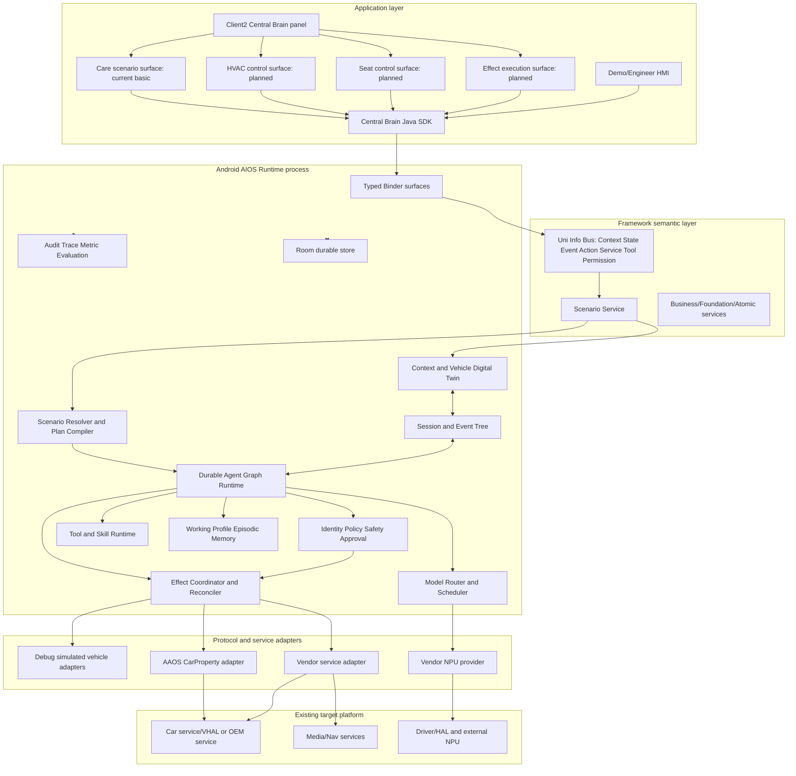
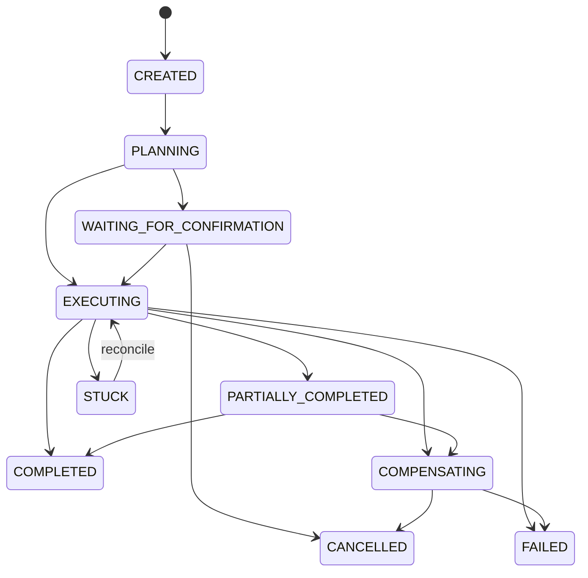
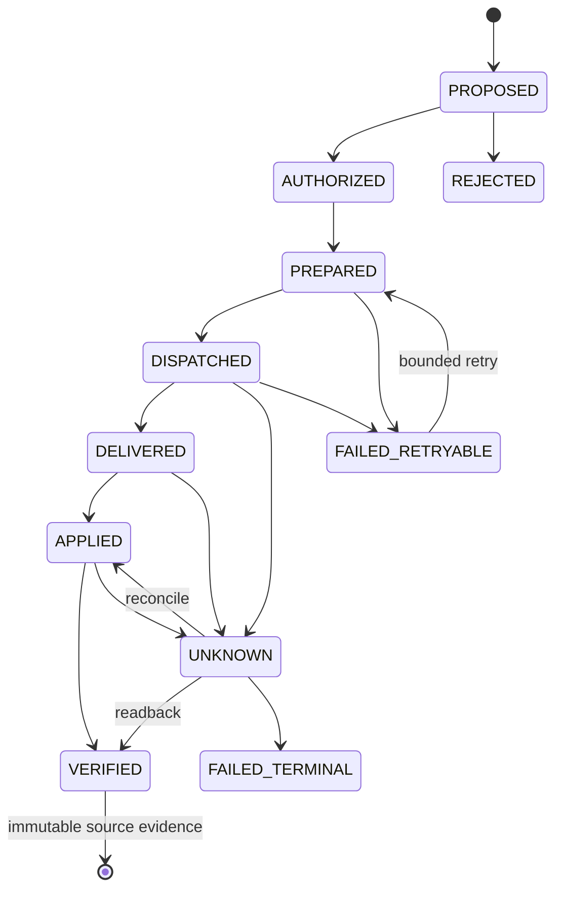
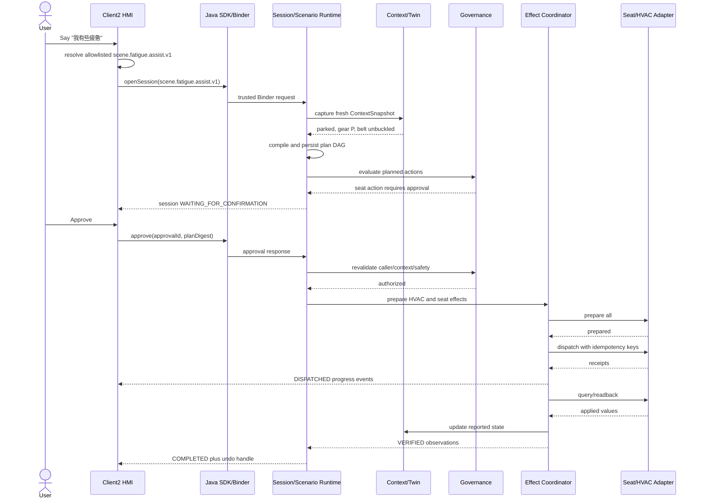

# Central Brain AIOS 完整软件开发设计说明

版本：2.7

日期：2026-07-17

状态：Stage 2 implementation baseline

面向对象：Android 座舱应用、平台 Runtime、AI/Agent、车辆服务、测试与集成工程师

目标平台：黑盒 Android 13 座舱域控制器

主要语言：Java/AIDL/C；Bash 用于构建与验收；仓库不再维护 Python AIOS 运行时

## 1. 文档目的

本文是整个 Central Brain AIOS 的实现级设计基线，统一描述：

- 当前仓库已经开发的模块及其真实成熟度；
- Stage 2 必须新增的最小颗粒度模块；
- 模块之间的调用、数据、线程、权限、状态和故障关系；
- 无真实 VHAL/NPU 时的仿真边界；
- 真实 Android 车辆/NPU 接口到位后的替换方式；
- 开发人员可直接采用的目录、类、AIDL、Room schema 和测试设计。

本文是当前唯一实现级总详设。发生冲突时，架构图 Req ID 优先，其次是本文，再其次是分模块接口和验收文档。Python 原型退役边界见 `CENTRAL_BRAIN_PYTHON_PROTOTYPE_RETIREMENT.md`。

## 2. 状态定义

| 状态 | 含义 | 可否作为产品能力宣称 |
| --- | --- | --- |
| `DEVELOPED` | 代码、测试和指定环境验证已存在 | 仅在文档明确的验证范围内可以 |
| `PROTOTYPE` | 可运行或可测试，但实现、容量或部署不满足量产 | 不可宣称量产 |
| `CONTRACT_ONLY` | 只有 DTO/API/registry/gate/empty interface | 不可宣称已执行 |
| `NOT_STARTED` | 设计已冻结，尚无实现 | 不可 |
| `EXTERNAL_BLOCKED` | 需要 OEM/vendor/目标硬件/权限/签名输入 | 不可，且不得以猜测实现 |
| `OUT_OF_SCOPE` | 用户明确排除或不属于本阶段 | 不开发 |

全局状态保持：`production_ready=false`、`target_hardware_validated=false`、
`driver_development_triggered=false`、`virtualization_development_triggered=false`。Android 13
物理设备应用层验收通过不等于车辆/NPU/整车硬件验收。

中控闭环状态保持：`cockpit_hvac_surface_implemented=true`、
`cockpit_seat_surface_implemented=true`、`cockpit_demo_control_loop_implemented=false`。
Client2 当前的 HVAC/Seat surface 只证明 governed Session admission 与 Seat safety fail-closed；没有 Effect/readback，
不能作为车辆 HVAC/Seat 闭环完成证据。

## 3. 架构原则

1. **架构图为需求基线**：所有 Stage 2 模块必须映射到原有 `APP/FW/NV/KH/XSC/DEL` Req ID。
2. **模型不是执行主体**：模型只做意图候选、参数建议、摘要；不能直接访问 EffectAdapter、CarPropertyManager 或 vendor service。
3. **所有副作用受治理**：车辆、媒体、导航、诊断和外部 Tool 必须经过 Action、Policy、Safety State、持久化 Effect 和 Audit。
4. **状态未知即限制**：车速、挡位、安全带、权限、adapter result 或 checkpoint 类型未知时 fail closed。
5. **发送不等于完成**：Effect 至少区分 `DISPATCHED`、`DELIVERED`、`APPLIED`、`VERIFIED`。
6. **仿真与量产同 contract**：仿真 adapter 可以改变 Digital Twin，但不能伪装成 production adapter。
7. **可恢复优先**：approval、plan、node、effect、observation 必须可在进程重启后恢复和 reconcile。
8. **黑盒平台边界**：不修改已刷机 Android/framework/VHAL，不猜私有设备节点/ioctl，不需要 root。
9. **无虚拟化开发**：不开发 Hypervisor/VM；Tool containment 是应用进程/allowlist 级边界，不称为虚拟化安全。
10. **Android 当前主线**：Stage 2 不开发 Linux 前端；跨 SoC contract 保持平台无关，早期 Python/Linux 样例已经退役。
11. **中控操作不直连设备**：Client2 中的 HVAC/Seat 手动控件与 AI 场景必须复用 Session、Governance、Effect 和 readback 链路；View 本地状态不是车辆状态。

## 4. 总体架构



## 5. 进程和部署

| 进程/制品 | package/模块 | 当前状态 | 职责 | 禁止职责 |
| --- | --- | --- | --- | --- |
| AIOS Runtime APK | `central-brain/android-runtime/runtime-service` | `DEVELOPED/PROTOTYPE` | Binder、治理、持久任务、模型/事件/记忆/技能骨架、native lifecycle | 不直接包含 Client2 UI，不访问私有硬件 node |
| Java SDK AAR | `central-brain-sdk` | `DEVELOPED` v1 | typed AIDL DTO/client、重连、callback | 不含 Policy/vehicle action 实现 |
| Native Runtime AAR | `native-runtime` | `DEVELOPED` lifecycle | C ABI、JNI、process-owned handle/capacity | 不读取 Binder identity，不加载 vendor NPU |
| Client2 Demo APK | `apk-labs/client2-central-brain` | `DEVELOPED` basic / HMI control `NOT_STARTED` | 当前入口、悬浮面板、场景请求和文本回复；规划意图/计划/执行/结果四阶段与 Effect 详情抽屉 | 不直连模型/vehicle adapter，不把 View 状态当回读 |
| Demo HMI APK | `demo-hmi` | `DEVELOPED` maintenance | SDK/Runtime/Governance 调试与验收 | 不作为产品 HMI |
| Policy probe | `policy-probe` | `DEVELOPED` test | caller/capability negative tests | 不随产品发布 |
| Retired prototype | none | `OUT_OF_SCOPE` | 不再提供 gateway、模型仿真或 Linux runtime | 不得恢复为 Android fallback |
| AAOS adapter | planned Runtime package | `EXTERNAL_BLOCKED` | 公开 CarProperty API 映射 | 不修改 VHAL/framework |
| Vendor NPU adapter | planned Runtime/native package | `EXTERNAL_BLOCKED` | 公开 vendor SDK lifecycle | 不自行开发未知 PCIe driver |

## 6. 仓库模块状态总表

### 6.1 已开发代码

| 最小模块 | 现有路径 | 状态 | 已验证边界 |
| --- | --- | --- | --- |
| Runtime AIDL v1 | `central-brain-sdk/.../production/ICentralBrainRuntime.aidl` | `DEVELOPED` | submit/cancel/status、version/hash |
| Governance AIDL v1 | `.../governance/ICentralBrainGovernance.aidl` | `DEVELOPED` | evaluate/request/status/cancel，故意没有 grant API |
| Diagnostic AIDL | `.../diagnostics/ICentralBrainDiagnostics.aidl` | `DEVELOPED` | 分页只读 diagnostics |
| Java SDK facade | `CentralBrainClient`、`CentralBrainGovernanceClient`、`ScenarioClient`、`SessionClient` | `DEVELOPED` | Binder connect/death/reconnect、Session/Event replay/resubscribe、typed DTO |
| Stage 2 facade transport | `ScenarioTransport`、`AndroidScenarioTransport` | `DEVELOPED/PROTOTYPE` | 同一 Runtime component 的 Session/Event 双 action Binder；不对 HMI 暴露 |
| Runtime Service | `CentralBrainRuntimeService.java` | `DEVELOPED/PROTOTYPE` | trusted task admission、Session/Event publication、callback、lifecycle |
| Durable Session Runtime | `runtime/session/SessionRegistry`、`DurableSessionRegistry`、`TransientSessionEndpoint` | `DEVELOPED/PROTOTYPE` | owner 隔离、幂等、Room v4、process-death replay；无 scenario execution |
| Governance Service | `CentralBrainGovernanceService.java` | `DEVELOPED/PROTOTYPE` | caller capability、action policy、approval contract |
| Diagnostic Service | `CentralBrainDiagnosticService.java` | `DEVELOPED` | read-only snapshots |
| Caller identity | `identity/*` | `DEVELOPED` | PackageManager signer/caller fingerprint |
| Capability policy | `policy/*`、`central_brain_capability_policy.xml` | `DEVELOPED` | signature permission + action capability |
| Job supervision | `supervisor/JobSupervisor.java` | `DEVELOPED` | bounded admission/cancel/deadline |
| Inference scheduling | `scheduler/InferenceResourceScheduler.java` | `DEVELOPED/PROTOTYPE` | bounded priority resource queue |
| Room v4 | `persistence/*`、`schemas/.../4.json` | `DEVELOPED` durable Session/Event + schema foundation | task/session/plan/node/checkpoint/approval/outbox/effect/event/observation/compensation/cursor |
| Durable repositories | `DurableTaskRepository`、`DurableApprovalRepository`、`DurableEffectRepository`、`DurableEventCursorRepository` | `DEVELOPED/PROTOTYPE` | transaction and restart probes |
| Effect contract | `effects/EffectAdapter*.java` | `DEVELOPED` contract | adapter shape and delivery gate |
| Effect activation | `EffectDeliveryActivationGate`、`EmptyEffectMaterialSource` | `DEVELOPED` | production fail closed |
| Effect reconcile | `EffectStatusReconciler.java` | `PROTOTYPE` | existing effect status reconciliation skeleton |
| Model provider | `model/ModelProvider.java`、profiles/readiness | `DEVELOPED` contract | provider shape/readiness |
| Deterministic model | `DeterministicStubModelProvider`、`TestOnlyModelRouter` | `PROTOTYPE` test only | no production activation |
| Event runtime | `events/BoundedEventRuntime.java` | `PROTOTYPE` | bounded in-process event behavior |
| Memory runtime foundation | `memory/BoundedMemoryLifecycle.java`、`memory/WorkingMemoryStore.java` | `DEVELOPED/PROTOTYPE` | digest lifecycle + session-scoped bounded opaque payload；无 Runtime wiring/durable layered memory |
| Built-in Skill | `skills/BoundedBuiltInSkillRuntime.java` | `PROTOTYPE` | bounded signed built-in concept |
| Governance middleware | `governance/FixedGovernanceMiddlewareChain.java` | `PROTOTYPE` | fixed order and readiness |
| Safety snapshot | `SafetyVehicleStateSnapshot/Provider` | `CONTRACT_ONLY/PROTOTYPE` | runtime-owned state, no real vehicle source |
| Native C ABI | `native-runtime/src/main/cpp/*` | `DEVELOPED` lifecycle | arm64/x86_64 ABI, no vendor/hardware linkage |
| Client2 bridge | `bridge/src/com/centralbrain/client2/*` | `DEVELOPED` Session/Event | typed open/snapshot/event/replay/reconnect；legacy text compatibility only |
| Client2 panel | maintained XML/smali patch inputs | `DEVELOPED` simple | navigation toggle、outside dismiss、transparent overlay |

### 6.2 Stage 2 新增模块

| 域 | 最小模块 | 状态 | 派生需求 |
| --- | --- | --- | --- |
| Session contract | 5 个 Session DTO、`ICentralBrainSessionRuntime` V1、`SessionContract` | `CONTRACT_ONLY`（P1-W01） | `S2-SES-001` |
| Plan/Node contract | 4 个 Plan DTO、`PlanContract`、DAG/补偿/重试边界 | `CONTRACT_ONLY`（P1-W02） | `S2-SCN-001`、`S2-GRF-001` |
| Event contract | 5 个 Event DTO、`ICentralBrainSessionEvents`/callback V1、`EventContract` | `CONTRACT_ONLY`（P1-W03） | `S2-SES-001`、`S2-EVT-001` |
| Effect/Approval contract | 4 个 Effect/Approval/Undo DTO、`EffectContract`、状态/过期/绑定边界 | `CONTRACT_ONLY`（P1-W04） | `S2-EFF-001`、`S2-SAF-001`、`S2-UX-003` |
| Session runtime | SessionManager、EventTreeStore、SessionCallbackHub | `NOT_STARTED` | `S2-SES-001` |
| Context | VehicleSignal schema、ContextSnapshotBuilder | `FOUNDATION`（P2-W01/P2-W04 完成；production trust/wiring 未接） | `S2-CTX-001` |
| Twin | CapabilityCatalog、VehicleDigitalTwinStore | `FOUNDATION`（P2-W02/P2-W03 完成；persistence/adapter 未接） | `S2-TWN-001` |
| Scenario | ScenarioManifest/Parser/Catalog、Resolver、PlanCompiler、GraphValidator | `FOUNDATION`（P2-W05..W07 完成；Runtime publication/execution 未接） | `S2-SCN-001` |
| Graph | AgentGraphRuntime、NodeExecutorRegistry、CheckpointSerializer、Retry/Timeout policy | `FOUNDATION`（P3-W01..W04 状态/typed schema/checkpoint/retry 完成；dispatch/Room 未接） | `S2-GRF-001` |
| Safety | RiskClassifier、DrivingSafetyPolicy、ApprovalResumeValidator | `NOT_STARTED` | `S2-SAF-001` |
| Effect | EffectCoordinator、Verifier、CompensationPlanner、UndoService、AdapterRegistry | `FOUNDATION`（P3-W06..W08 coordinator/verification/compensation/undo admission 完成；runtime/durable/production wiring 未接） | `S2-EFF-001`、`S2-SAF-001`、`S2-UX-003` |
| Simulation | HVAC/Seat/Media/Nav adapters、DebugSimulationController | `FOUNDATION`（P2-W08..W12 完成；production/runtime wiring 未接） | `S2-ADP-001` |
| Tool | ToolManifest/Registry/RuleSolver/Executor | `FOUNDATION`（P5-W01 manifest/schema 完成；Registry/Resolver/RuleSolver/Executor 未接） | `S2-TOL-001` |
| Skill | SkillArtifactVerifier、SkillSignerPolicy、SkillLifecycle | `NOT_STARTED` | `S2-TOL-001` |
| Memory | Working/Profile/Episodic stores、Consent、Budget | `NOT_STARTED` | `S2-MEM-001` |
| Event | DurableEventBroker、Subscription、Backpressure、TriggerEngine | `NOT_STARTED` | `S2-EVT-001` |
| Model | ProviderRegistry、PolicyAwareRouter、LocalProvider、Evaluator | `NOT_STARTED` | `S2-MDL-001` |
| Observability | TraceContext、MetricRecorder、ScenarioEvaluator | `NOT_STARTED` | `S2-OBS-001` |
| Product HMI state | immutable state/reducer、plan timeline、session/effect renderer | `FOUNDATION`（P4-W02 state/reducer/lifecycle 完成；四阶段 timeline/effect renderer 未接） | `S2-UX-001` |
| Product HMI driving mode | moving/parked/unknown presentation policy | `NOT_STARTED` | `S2-UX-002` |
| Product HMI control | approval/cancel/retry/partial/undo controls | `NOT_STARTED` | `S2-UX-003` |
| Cockpit HVAC surface | power/zone/temp/fan/mode/preset controls | `NOT_STARTED` | `S2-HMI-001` |
| Cockpit Seat surface | heat/vent/massage/recline/preset/restriction | `NOT_STARTED` | `S2-HMI-002` |
| Cockpit control loop | reducer、desired/reported、timeline、recovery | `FOUNDATION`（P4-W02 reducer 与 Session recovery 完成；desired/reported/timeline 未接） | `S2-HMI-003` |
| Cockpit simulation presentation | SIMULATED/UNAVAILABLE source and engineer fault profile | `NOT_STARTED` | `S2-HMI-004` |
| Cockpit unified command path | manual and AI scenario share governed Effect flow | `NOT_STARTED` | `S2-HMI-005` |
| Cockpit intent orchestration UX | natural intent、Context/Plan/Policy/Effect/readback chain、device detail drawer | `NOT_STARTED` | `S2-HMI-006` |
| Real adapters | AAOS/Vendor/NPU | `EXTERNAL_BLOCKED` | `S2-ADP-002` |
| Release qualification | signer/migration/rollback/long-run/target evidence | `EXTERNAL_BLOCKED` | `S2-REL-001` |

## 7. 公共数据契约

### 7.1 Envelope

所有跨模块对象使用同一元数据，不允许传递 runtime implementation object。

```java
public final class Envelope<T> {
    public final String messageId;       // UUID, required
    public final String correlationId;   // request/session trace
    public final String causationId;     // parent event/action
    public final String type;            // allowlisted type
    public final int schemaVersion;
    public final long createdAtEpochMs;
    public final String sourcePrincipal;
    public final T payload;
}
```

限制：单个 Binder DTO 序列化后默认不超过 64 KiB；列表分页；字符串有字段级长度上限；未知 type/version 返回 `CB_ERR_SCHEMA_UNSUPPORTED`。

### 7.2 ID 与幂等

| ID | 产生方 | 稳定范围 | 用途 |
| --- | --- | --- | --- |
| `requestId` | SDK | 单次用户/系统请求 | 重放检测 |
| `sessionId` | SessionManager | 一次用户目标 | UI/事件/恢复主键 |
| `planId` | PlanCompiler | 一次计划版本 | approval digest 和 checkpoint |
| `nodeId` | PlanCompiler | plan 内稳定 | DAG dependency |
| `effectId` | EffectCoordinator | 一次逻辑副作用 | lifecycle/reconcile |
| `idempotencyKey` | Runtime | capability+target+scope+plan revision | adapter 重试去重 |
| `eventId` | EventTreeStore | 每个不可变事件 | cursor/parent/audit |
| `approvalId` | Governance | 一次批准请求 | resume/expiry |

## 8. SDK 与 Binder 设计

### 8.1 保留 v1

现有 `ICentralBrainRuntime`、`ICentralBrainGovernance`、`ICentralBrainDiagnostics` 保持 binary contract，不直接修改 hash 表示兼容。Stage 2 新增独立 scenario/session surface，SDK 对调用方组合为单 facade。

### 8.2 新增 AIDL 文件

实现路径：`central-brain-sdk/src/main/aidl/com/centralbrain/sdk/session/`。P1-W01 先冻结
`ICentralBrainSessionRuntime` V1 的 `open/get/list/cancel` 和 5 个有界 DTO。P1-W03 通过独立
`com.centralbrain.sdk.event` surface 冻结 Event/callback V1；approval/undo 继续使用后续独立版本，
不能改变任何已冻结 V1 事务顺序或 checksum。

```aidl
interface ICentralBrainSessionRuntime {
    const int INTERFACE_VERSION = 1;
    const String INTERFACE_HASH = "<generated-by-checker>";

    int getProtocolVersion();
    String getProtocolHash();
    SessionHandle openSession(in SessionRequest request);
    SessionSnapshot getSession(in SessionHandle handle);
    SessionPage listSessions(in SessionQuery query);
    boolean cancelSession(in SessionHandle handle, int reasonCode);
}
```

P1-W03 已定义 callback/event 合同；P1-W04 定义 Effect/Approval/undo DTO；P1-W05 才拥有 SDK
bind/death/reconnect/resubscribe 生命周期。把 reconnect 测试放在 DTO-only 层没有可测试 owner，因此
已在 backlog 中纠正，不降低最终 P1 验收要求。

P1-W03 的 callback 是提示，不是权威数据源。overflow、Binder death 或重连后客户端必须用
`ICentralBrainSessionEvents.getEvents` 的 opaque cursor 补齐，不能从 callback 队列推断完整状态。

### 8.3 SessionRequest

字段：

```text
requestId            String UUID required
scenarioId           String allowlisted, optional only for text intent
utterance             String max 1024, optional
source                HMI_BUTTON | VOICE | TRIGGER | API
seatZone              enum allowlist
locale                BCP-47 max 32
deadlineEpochMs       bounded future
clientContextVersion  int, informational only
```

HMI 不得提交 `speed/gear/belt` 作为权威输入。

Runtime admission 后将 `SessionRequest` 的场景目标映射为内部 immutable `ScenarioRequest`，供
`ScenarioResolver` 使用。AIDL 不暴露内部 resolver object。

P1-W01 的 `SessionContract.validateRequest(request, nowEpochMs)` 强制：schema=1、canonical UUID、
scenario ID 形状、source/seat allowlist、utterance <= 1024、locale <= 32、deadline 位于未来 5 分钟内，
且 HMI 不得提交 speed/gear/belt/permission/caller/signer 字段。`requestId` 是 admission 幂等键；owner
只能由未来 Session Service 的 Binder caller principal 派生。

### 8.4 Handle、Snapshot、Query 与 Page

- `SessionHandle`：canonical `sessionId`、accepted/expires wall-clock；TTL 由 Runtime 创建，客户端不能
  自报 owner。
- `SessionSnapshot`：session/request/scenario、完整 Session state allowlist、active plan revision、
  last event sequence、created/updated/deadline 和 <=512 字符摘要；UNKNOWN state 不可作为有效 snapshot。
- `SessionQuery`：state filter、includeTerminal、opaque cursor <=256、pageSize 1..50；owner scope 由
  Binder identity 隐式固定。
- `SessionPage`：最多 50 个已校验 snapshot、opaque next cursor、hasMore、generated timestamp；
  `hasMore=true` 时 next cursor 必填。

这些限制将单次典型 Session 页控制在 64 KiB 目标内。所有 DTO 是 Gradle application structured
AIDL，不是 VINTF stable AIDL；V1 文件由 `aidl-api/session-v1.sha256` 冻结，interface hash 由
`tools/check_central_brain_android_session_contract.sh` 对规范化源文件重算。

### 8.5 Plan/Node contract V1

实现路径：`central-brain-sdk/src/main/aidl/com/centralbrain/sdk/plan/`。P1-W02 冻结
`ScenarioPlan`、`PlanNode`、`NodeDependency` 和 `NodePolicy` 四个 structured parcelable，AIDL 合并
hash 为 `8dbf27424a09ecac969aff444e7fc9e3c939c7bc5c6687de2d8a5a627d60dabd`，逐文件 checksum 位于
`aidl-api/plan-v1.sha256`。

`ScenarioPlan` 字段固定为 schemaVersion、canonical plan/session ID、scenario ID、positive revision、
context/plan SHA-256 digest、compiled/deadline 和 bounded node/dependency 数组。`PlanNode` 固定携带
node/type/capability/input digest/resource key、timeout、maxAttempts、idempotencyKey、required、
compensationNodeId 和 `NodePolicy`；这些字段不得隐藏在 JSON、Bundle 或任意 Parcel blob 中。

`PlanContract` 的 V1 上限和拒绝规则：

- nodes 1..64、dependencies 0..256、graph depth <=16、同层 width <=8；plan deadline <=15 分钟；
- node timeout 1..120000 ms、maxAttempts 1..3；retryable 或 side-effect node 必须有 idempotency key；
- node ID、edge 和非空 idempotency key 在 plan 内唯一；dependency 必须引用存在节点且不可 self-edge；
- node type 只允许 13.2 节列出的 11 类 executor；schema、dependency condition、risk 和 failure mode
  未知时失败关闭；
- compensation 必须引用 plan 内 `compensate` node，不可 self-reference 或形成 compensation loop；
- HIGH/CRITICAL policy 必须携带 approval-required metadata，但最终 approval、Safety、Context 和
  capability 必须由 Runtime 在 dispatch 前重新求值，DTO 不能授予权限。

本工作包只实现 wire contract 与结构校验。P2-W07 才实现 `ScenarioPlanCompiler`、完整语义
`PlanGraphValidator`、required-effect verify、approval predecessor 和 moving branch 检查；P3 才实现
durable Graph 执行。`plan_runtime_published=false`，不得由 Client2 动画或本地 DTO 构造宣称已执行。

### 8.6 Event contract V1

实现路径：`central-brain-sdk/src/main/aidl/com/centralbrain/sdk/event/`。P1-W03 冻结
`RuntimeEvent`、`ActionEvent`、`ObservationEvent`、`MessageEvent`、`EventPage`、
`ICentralBrainSessionEvents` 和 one-way `ICentralBrainSessionEventCallback`，七文件合并 hash 为
`bb3618ca5f5818ce70b3a889a928b54ad83c70f0e439db5b62c67eb3234957d5`。

`RuntimeEvent` 的 canonical key 是 `(sessionId, sequence, eventId)`；`eventDigest` 绑定不可变 replay
identity，`parentEventId/parentSequence` 建立因果树。每个事件必须且只能包含匹配 `payloadKind` 的一个
typed payload。`EventPage` 要求 sequence 严格连续，页内 parent 必须先于 child，initial/subsequent
cursor 语义、`nextCursor/nextSequence/hasMore` 必须一致。每页最多 100，display text 最多 1024。

```aidl
interface ICentralBrainSessionEvents {
    int getProtocolVersion();
    String getProtocolHash();
    EventPage getEvents(String sessionId, String cursor, int limit);
    boolean registerSessionCallback(String sessionId, String cursor,
        ICentralBrainSessionEventCallback callback);
    boolean unregisterSessionCallback(String sessionId,
        ICentralBrainSessionEventCallback callback);
}

oneway interface ICentralBrainSessionEventCallback {
    void onEvent(in RuntimeEvent event);
    void onOverflow(String resumeCursor);
    void onClosed(int reasonCode, String resumeCursor);
}
```

P1-W03 不发布 Service、不写 Room、不执行 Effect。未来 Service 必须从 Binder principal 派生 session
owner/capability；query/callback 参数不得携带 caller、signer、permission、speed、gear 或 belt 断言。
`event_runtime_service_published=false`、`event_callback_service_published=false`。

### 8.7 Effect/Approval contract V1

实现路径：`central-brain-sdk/src/main/aidl/com/centralbrain/sdk/effect/`。P1-W04 冻结
`EffectIntent`、`EffectObservation`、`ApprovalPrompt` 和 `UndoHandle`，四文件合并 hash 为
`709828114422595f1889dad58e8e60daf4d5e4f98c962a6145f2f8a39b0c178d`，逐文件 checksum 位于
`aidl-api/effect-v1.sha256`。本工作包没有 Binder interface。

`EffectIntent` 以 `valueKind` 激活 boolean/integer/decimal/text 中且仅一个 bounded scalar；其余字段
必须保持默认，target digest 绑定 canonical value。Intent 同时绑定 session/plan/node/action/capability、
idempotency、plan/Context digest + Context version、risk、verification、compensation 与 15 分钟 deadline。

`EffectObservation` 的状态不可合并：`DISPATCHED` 只表示已提交，`DELIVERED` 表示 adapter 已接收，
`APPLIED` 必须有 reported digest，`VERIFIED` 才可作为原 Effect 终态。UNKNOWN 只能 reconcile 到
APPLIED/VERIFIED/FAILED_TERMINAL；FAILED_RETRYABLE 只能以相同 binding、递增一次 attempt 回到 PREPARED。
任何 terminal observation 都不可继续变更。Simulation source 与 `simulated=true` 必须成对出现。

`ApprovalPrompt` 只供 HMI 展示 reason/prompt code 和 expiry；它把 approval 精确绑定到
plan/action/target/Context/policy。Resume 使用 Runtime 当前权威摘要逐项比较，过期或 stale 时拒绝，
不能把 prompt 当 grant。`UndoHandle` 只在 verified reversible Effect 后出现，有独立 TTL；undo 生成新的
governed compensation session，重新读取 Safety/Context/capability，绝不是数据库回滚。

状态固定：`effect_runtime_service_published=false`、`approval_response_service_published=false`、
`undo_service_published=false`。P1-W05 才组合 SDK facade；P1-W06 才持久化这些对象。

### 8.8 Java SDK facade

P1-W05 实际交付三个 public 类型：

```java
public interface ScenarioClient extends AutoCloseable {
    boolean connect();
    boolean reconnect();
    boolean isConnected();
    SessionHandle openSession(SessionRequest request, RuntimeEventListener listener);
    SessionSnapshot getSession(SessionHandle handle);
    SessionPage listSessions(SessionQuery query);
    boolean cancelSession(SessionHandle handle, int reasonCode);
    void observeSession(SessionHandle handle, String resumeCursor,
                        RuntimeEventListener listener);
    void stopObserving(SessionHandle handle);
    void close();
}

public interface RuntimeEventListener {
    default void onSnapshot(SessionSnapshot snapshot) {}
    default void onEvent(RuntimeEvent event) {}
    default void onReplayComplete(long lastSequence) {}
    default void onOverflow(String resumeCursor) {}
    default void onClosed(int reasonCode, String resumeCursor) {}
    default void onError(String code, String message) {}
}
```

`ScenarioClient.Failure` 是 public 稳定异常，只允许 `NOT_CONNECTED`、`PROTOCOL_MISMATCH`、
`TRANSPORT`、`SUBSCRIPTION`、`CLOSED` code。public API 禁止出现 `IBinder`、AIDL Stub/Proxy、
`RemoteException`；合同字段错误继续使用对应 `CB_SESSION_CONTRACT`/`CB_EVENT_CONTRACT`
`IllegalArgumentException`，便于开发阶段立即发现调用错误。

文件与职责：

| 文件 | 可见性 | 职责 |
| --- | --- | --- |
| `ScenarioClient.java` | public interface | HMI/应用命令面和稳定错误合同 |
| `SessionClient.java` | public final | version/hash 协商、validation、subscription 状态、sequence 去重、listener 串行化 |
| `RuntimeEventListener.java` | public interface | snapshot/replay/event/overflow/closed/error 投影 |
| `ScenarioTransport.java` | package-private | fake transport 与 Android transport 的可测试边界 |
| `AndroidScenarioTransport.java` | package-private final | explicit component bind、双 Binder generation、death recipient、AIDL callback bridge |
| `CentralBrainClient.createScenarioClient()` | public factory | 复用 application context 和 callback executor，返回独立拥有/关闭的 facade |

#### 8.8.1 连接与协议协商

`AndroidScenarioTransport` 对同一
`com.centralbrain.runtime.CentralBrainRuntimeService` 建立两个 filter-distinct binding：

```text
com.centralbrain.runtime.action.SESSION_RUNTIME -> ICentralBrainSessionRuntime V1
com.centralbrain.runtime.action.SESSION_EVENTS  -> ICentralBrainSessionEvents V1
```

两个 Binder 均存活后才发 `onConnected`。`SessionClient` 必须精确比较两个
`INTERFACE_VERSION` 和 `INTERFACE_HASH`；任一不匹配或 capability 拒绝都不得进入 connected。每次 bind
generation 使用新的 `ServiceConnection` 和 `DeathRecipient`，旧 generation 的晚到 callback 必须忽略。
任一 Binder 死亡使这一代整体失效并清除 transport callback bridge；active subscription metadata
保留在 facade，等待显式 reconnect。

#### 8.8.2 subscription 状态与恢复算法

每个 `sessionId` 最多一个 active `Subscription`，保存 handle、listener、resume cursor、
`lastSequence`、active/recovering flag 和不对外暴露的 callback sink。恢复顺序固定：
public resume cursor 在 Binder 前限制为 256 字符且禁止控制字符。

1. `getSession(handle)`，不存在则 `onError(SUBSCRIPTION)`；
2. 从保存 cursor 调用 `getEvents(..., MAX_PAGE_SIZE)`，每页都执行 `EventContract.validatePage`；
3. 仅交付 `sequence > lastSequence`，拒绝 cross-session 或非连续 sequence；
4. terminal page 后以该页 request cursor 注册 callback；
5. callback 的重复 replay 继续按 sequence 丢弃，再发送 `onReplayComplete(lastSequence)`。

Event V1 terminal page 禁止返回 `nextCursor`，因此当前实现无法在 terminal page 后前移 opaque cursor，
会在 reconnect/register 时重复读取一段历史并依赖 sequence 去重。该限制记录为 `ISSUE-034`；P1-W07
只能新增 V2/ack cursor，不能修改冻结的 V1 hash。

#### 8.8.3 线程、竞态和关闭

调用方注入的 `Executor` 被 `SerialExecutor` 包装，connection/listener 回调按单一顺序执行，不在 Binder
thread 更新 UI。`observeSession` 替换旧 subscription，`stopObserving`/`close` 先使 subscription inactive；
已排队的旧 sink callback 在执行时再次做 identity/current 检查并丢弃。`close()` 可重复调用；close 后
connect/reconnect 固定抛 `CLOSED`。SDK 不自动重发 open request，避免 Binder 结果未知时创建重复场景。

#### 8.8.4 Runtime publication 与 owner

Runtime 不新增 Service component。`CentralBrainRuntimeService.onBind(Intent)` 对两个 action 返回
`TransientSessionEndpoint` 的 Session/Event Stub；无 action 时继续返回旧 `ICentralBrainRuntime`。
每个 Stub 方法在读取 request 前先按 operation 要求 capability：

```text
runtime.session.protocol.read  runtime.session.open
runtime.session.read.own       runtime.session.cancel.own
runtime.event.protocol.read    runtime.event.read.own
runtime.event.subscribe.own
```

通过 Binder UID -> package/current signer default-deny policy 后，使用
`DurablePrincipalFingerprint.from(caller)` 生成 owner。owner 不读取 request body。生产 XML 只授权
Demo/Client2；instrumentation principal 只存在于 debug XML overlay，并要求 Runtime current signer。

#### 8.8.5 transient registry

`TransientSessionRegistry` 进程级 singleton 上限为 64 session、每 session 8 个当前合同事件。它只保存
owner fingerprint、request digest、handle、snapshot 和 typed RuntimeEvent；原始 utterance 仅在 open
调用栈中参与 domain-separated SHA-256，不能成为字段、summary、event 或 log。owner+requestId 同
digest 返回原 handle，不同 digest 报幂等冲突。容量满时只可逐出最旧 terminal record；全部 active
时失败关闭。list/event cursor 是 bounded opaque token，non-owner 返回不可用或空 owner view。

该 registry 是 P1-W05 的原始实现，可跨 Service instance rebind，但进程死亡即丢失。P1-W06 已让
production endpoint 注入 `DurableSessionRegistry`；transient 实现只保留为 deterministic JVM fixture。
Endpoint 同时限制每 session 最多 4 个 callback、全进程最多 128 个 callback；达到上限返回 false，
facade 转为 `SUBSCRIPTION`，不得无限注册或静默逐出仍活跃的 observer。

P1-W05 不定义 `ApprovalResponse`、`UndoRequest`、approve/reject/undo facade：这些类型和 authority 尚未
冻结，现有 `ApprovalPrompt` 不是 grant，`UndoHandle` 不是执行命令。当前固定边界：

```text
sdk_facade_v2_available=true
session_runtime_service_published=true
event_runtime_service_published=true
event_callback_service_published=true
room_schema_version=4
session_runtime_persistence_wired=true
session_runtime_process_death_rehydration=true
scenario_execution_enabled=false
approval_response_service_published=false
undo_service_published=false
```

SDK 必须继续满足：

- 在 Binder death 后通知 `disconnected`，有界重连；
- 重连后先读 snapshot/page，再 attach callback；
- 不自行重发未知结果的 scenario request；
- 对 listener 使用调用方提供的 `Executor`，不在 Binder thread 运行 UI；
- `close()` 幂等并释放 callback。

## 9. HMI 模块详设

### 9.1 BrainNavEntry

- 路径：Client2 maintained patch source；状态：Stage 1 `DEVELOPED`，Stage 2 badge `NOT_STARTED`。
- 输入：`PanelState.visibility`、active session aggregate state。
- 输出：`TogglePanel`。
- 规则：第二次点击隐藏；running/waiting/error 以不同状态点显示；不得通过 visibility 控制 Runtime session。

### 9.2 BrainOverlay

- 状态：基础 `DEVELOPED`，Stage 2 无障碍/驾驶态适配 `NOT_STARTED`。
- 组成：透明 scrim + 浅灰半透明 panel；outside touch 发出 dismiss。
- 规则：panel touch 消费事件；outside dismiss 不 cancel；Activity 重建后由 reducer 恢复。

### 9.3 IntentComposer

- 状态：当前简单场景按钮 `DEVELOPED`；自然场景输入和 bounded resolver `NOT_STARTED`。
- 输入：voice/text phrase、`ScenarioAvailabilitySnapshot`、driving presentation。
- 输出：`IntentRequest`，经 allowlisted resolver 归一化为 immutable scenario ID 和 bounded parameter，
  再创建 `SessionRequest`。
- 模型不能从自然文本直接创建 capability/Effect；moving 使用语音优先且只允许低风险 scenario。
- 原快捷按钮降为示例短语，不作为顶层设备导航。

### 9.4 CentralBrainPanelState

计划路径：`apk-labs/client2-central-brain/bridge/src/com/centralbrain/client2/ui/`。

```java
final class CentralBrainPanelState {
    boolean visible;
    PanelPresentationMode mode;
    ConnectionState connection;
    SessionSnapshot activeSession;
    List<PlanNodeViewState> nodes;
    ApprovalViewState approval;
    UndoViewState undo;
    IntentDraftViewState intentDraft;
    ContextDigestViewState contextDigest;
    PlanSummaryViewState planSummary;
    ResultEvidenceViewState resultEvidence;
    String conciseSummary;
    FaultViewState fault;
}
```

状态只能由 `CentralBrainPanelReducer.reduce(oldState, UiEvent)` 更新。View/smali controller 不保存权威 Runtime state。

### 9.5 PlanTimeline

每行固定高度/最小宽度，字段为 icon、短标题、目标、状态、可选 detail。状态映射：

| Runtime | UI |
| --- | --- |
| PENDING | 空心圆 |
| RUNNING/DISPATCHED | 进度指示，文案“正在执行” |
| WAITING_FOR_CONFIRMATION | 警示图标，approval bar |
| VERIFIED | 勾选，文案“已完成” |
| SKIPPED | 灰色，显示原因 |
| FAILED_RETRYABLE | 错误 + 重试 |
| FAILED_TERMINAL | 错误 + 说明 |
| UNKNOWN | “正在确认结果” |
| COMPENSATED | “已恢复” |

### 9.6 ApprovalBar

- 显示动作、设备区域、风险原因、过期时间，不显示内部 policy dump。
- `approve` 发送 approvalId + planDigest + displayedRevision；Runtime 重新验证 caller/context。
- 连点由 request ID 幂等；按钮提交后 disabled，直到 observation 或 timeout。

#### 9.6.1 P4-W07 Client2 recovery projection implementation

当前 APK 在 `bridge/src/com/centralbrain/client2/CockpitRecoveryState.java` 实现 presentation-only 状态：

- `ApprovalStatus`：`UNAVAILABLE/REQUESTED/RESOLVED/EXPIRED`；
- `AggregateStatus`：`NO_EVIDENCE/IN_PROGRESS/VERIFIED/PARTIALLY_COMPLETED/FAILED/INCONCLUSIVE/COMPLETED`；
- `CompensationStatus`：`UNAVAILABLE/COMPENSATING/COMPENSATED/INCONCLUSIVE`；
- `verifiedCount/failedCount/inconclusiveCount` 只统计 reducer 已验证、已脱敏的 typed terminal event；
- 不保存 approval/effect/observation/undo ID、digest、用户/模型文本、车辆 payload。

调用关系固定为 `RuntimeEvent -> EventContract.validateEvent -> ProjectedEvent -> CockpitExecutionTimeline.TraceItem ->
CockpitRecoveryState -> CockpitHmiState -> CockpitControlCoordinator`。`CockpitRecoveryState` 不引用 Android View/Binder，
Coordinator 不根据文本推断结果。

当前 Event V1 的 Approval event 无 payload，Client2 也未获得完整 `EffectObservation` 或 `UndoHandle`。因此 reason/expiry、
retryable、undo eligibility 缺失时必须显示 UNAVAILABLE，approve/reject/retry/undo 必须 disabled。后续服务发布后，应新增
versioned reducer event 并绑定 owner/session/plan/context/policy revision、TTL 和幂等 request ID；禁止直接把按钮接到
Effect adapter。outside dismiss 只改变 `PanelVisibility`，不清除该状态或取消 Session。

Req IDs：`S2-UX-003`、`S2-HMI-003`、`S2-SAF-001`、`S2-EFF-001`、`APP-004`、`XSC-001/005/006`。

### 9.7 DrivingUxPolicy

```java
PanelPresentationMode modeFor(DrivingState state,
                              SessionSnapshot session,
                              ScenarioCatalogSnapshot catalog);
```

`UNKNOWN` 和异常按 `MOVING_RESTRICTED`。该类只控制呈现，不授权 Effect。

#### 9.7.1 P4-W08 maintained driving restriction implementation

实际实现将输入收敛为 `CockpitSeatState.SafetyContext`，而不是接受独立、可能互相矛盾的 driving/session/catalog 参数。
`DrivingUxPolicy.modeFor(context)` 只在 source 可用、quality=OBSERVED、revision>0 且 driving=PARKED 时返回
`PARKED_FULL`；null、UNKNOWN、MOVING、unavailable、非 OBSERVED 或无有效 revision 均返回
`MOVING_RESTRICTED`。该类和 `PanelPresentationMode` 不依赖 Android View。

`CockpitHmiState` 保存 immutable mode。`SEAT_SAFETY_CONTEXT_CHANGED` reducer event 在同一 revision 中更新 Seat Context
和 mode；RESTORED 明确恢复受限默认值。Coordinator 只消费 state：受限模式显示 fail-closed banner、把回复限制为单行、
隐藏 Intent/Context/Plan/Execution/Result 长详情和 trace，禁用 HVAC/Seat 参数按钮与 `skill.nap`。每个参数/high-risk click
入口还会重新检查 mode，防止 View enabled state 与 reducer state 短暂不同步。

任何 mode 的 `isEffectAuthorizationSource()` 都返回 false。PARKED_FULL 只恢复 UI 呈现和输入入口，不构造 approval、
不改变 Runtime policy、不调用 Adapter、不推进 Effect state。Runtime 必须在后续真实 dispatch 前重新读取和验证可信
Context/Safety revision。当前实体未接可信 provider，故默认受限；P4-W09 通过受保护 debug Controller 入口覆盖实体
PARKED/MOVING/UNKNOWN 测试，production provider 仍由 P8 交付。

Host test 覆盖 null/unavailable/unknown/moving/parked、长文本/参数/high-risk 三类开关和 no-authorization invariant；静态门禁
拒绝 Android Car、device node、Vendor/HAL 引用；实体门禁验证 restricted banner、隐藏长文本、disabled controls、无新增
manual Session/Effect/hardware dispatch。Req IDs：`S2-UX-002`、`S2-HMI-002`、`S2-SAF-001`、`APP-004`、
`XSC-001/005/006`；tracking：`DEV-058`、`ISSUE-023/029/030/033`。

#### 9.7.2 P4-W09 engineer simulation drawer implementation

P4-W09 在现有 reducer-owned HMI 上增加 `CockpitEngineerState` 和 `DebugSimulationControllerClient`。前者是纯 Java immutable
domain state，包含 `ConnectionState`、driving、occupancy、belt、selected adapter、fault profile、bounded status 和
Controller revision；后者是唯一 Android/Binder adapter。`CockpitHmiState` 嵌入 engineer state，所有变化必须通过
`CockpitHmiReducer` 的 CONNECTED/DRIVING/OCCUPANCY/BELT/FAULT/RESET/FAILED events。

`DebugSimulationControllerClient` 只 bind Runtime debug manifest 中的显式 component。连接顺序为：Android signature
permission -> Binder caller identity -> `debug.simulation.control` capability -> generated AIDL `INTERFACE_VERSION/HASH` ->
initial revision。Binder 调用在单线程 executor 执行，callback 通过 main Handler 回到 Coordinator。任一 admission/transport/
protocol 失败都会清空 controller reference、隐藏入口或显示 FAILED，不重试写命令、不切换 presentation。

命令集合完全固定：driving `UNKNOWN/PARKED/MOVING`；canonical signal
`Vehicle.Cabin.Seat.IsOccupied`/`Vehicle.Cabin.Seat.IsBelted` + `row1.driver`；adapter
`debug.simulated.hvac.v1`/`debug.simulated.seat.v1`；fault `NONE/DELAY/TIMEOUT/RETRYABLE_FAILURE/TERMINAL_FAILURE/
READBACK_MISMATCH`；reset。不得从 UI 文本构造 path/adapter/fault。每次命令保存 expected state 和当前 revision；只有成功
且返回 revision 严格增加时 reducer 才提交新 state，stale/out-of-order/duplicate 响应失败关闭。

`CockpitEngineerState.toSafetyContext()` 仅在 CONNECTED、revision>0 且 driving=PARKED/MOVING 时生成
source=SIMULATED、quality=OBSERVED 的 Client2-local Context；UNKNOWN/reset/disconnect 返回 unavailable。该 Context 只调用
`DrivingUxPolicy` 决定完整或受限呈现，不写 shared ContextSnapshot/Room，不进入 Graph、Policy、EffectCoordinator 或
Adapter。`isProductionAvailable()` 和 `isEffectAuthorizationSource()` 永远为 false。

资源层在 Plan 页提供默认 `gone` 的工程入口，抽屉使用既有 1920x1080 safe frame 内 ScrollView。Coordinator 只负责把
button tag 映射为 typed event、render reducer state 和生命周期 connect/close。Activity/process restore 不恢复 debug
PARKED；重建后必须重新握手，直到成功前维持 UNKNOWN restricted。

测试分四层：JVM reducer 覆盖 immutable transition/revision/reset；静态 gate 检查 XML、AIDL 单一来源、debug/release
隔离、permission/capability 和禁止硬件/网络 API；APK 构建验证 generated AIDL 与 secondary dex；Android 13/API 33 ARM64
验证完整 UI/故障矩阵及 release Service absent。所有证据只输出 bounded marker，不提交设备身份或 raw payload。

状态：`cockpit_engineer_simulation_drawer_implemented=true`、
`cockpit_engineer_signature_permission_required=true`、`cockpit_engineer_capability_required=true`、
`cockpit_engineer_context_revisioned=true`、`cockpit_engineer_runtime_release_service_absent=true`、
`cockpit_engineer_effect_authorization_source=false`、`cockpit_engineer_production_available=false`、
`vehicle_signal_provider_wired=false`、`hardware_accessed=false`、`implementation_stage=P9-W03`。
Req IDs：`S2-HMI-004`、`S2-ADP-001`、`S2-OBS-001`、`APP-004`、`XSC-001/005/006`；tracking：
`DEV-059`、`ISSUE-023/029/030/033`。

### 9.8 Client2 AIOS 四阶段信息架构

`BrainOverlay` 保留原有右侧半透明悬浮形态，在同一 APK 内增加稳定的 segmented navigation：

| 视图 | 责任 | 不允许承担的责任 |
| --- | --- | --- |
| 意图 | 自然场景 voice/text、示例短语、可信 Context 摘要 | 不直接生成 Effect 或把模型文本当权威计划 |
| 计划 | normalized scenario、Context、Plan、Policy、HIGH-risk approval | 不由 HMI 本地决定 capability 或安全授权 |
| 执行 | Effect timeline、live trace、partial、retry、stop | 不把 DISPATCHED 显示成 VERIFIED |
| 结果 | desired/reported/source/quality、feedback、undo | 不用本地 feedback 覆盖设备 readback |

Header 固定显示 connection、`SIMULATED/TARGET/UNAVAILABLE` source 和
`PARKED/MOVING/UNKNOWN_RESTRICTED` presentation。Intent -> Context -> Plan -> Policy -> Effect ->
readback 主链在计划/执行/结果阶段持续可见。Persistent execution strip 在所有视图可见；
隐藏 overlay 只影响呈现，不取消已接受 session。

HMI-D0/HMI-D1 使用固定 1920x1080 设计坐标。`BrainOverlay` 的安全框为
`left=1264, top=160, width=624, height=888`，右边界 1888、下边界 1048；Panel 内 Surface 独立滚动，
不得通过扩大根 View 或超出 RenderService 画布承载内容。主玻璃 alpha 为 0.60，Android blur 不可用
时才切换到 0.82 浅灰 fallback。浏览器原型只负责等比预览，不改变 Android layout contract。

HVAC 和 Seat 不再占据顶层 tab，而是由 Effect row 打开 `DeviceDetailDrawer`。抽屉保留完整
desired/reported 和手动微调，但手动请求仍创建 governed scenario。“执行”视图是通用 Effect
projection，不只服务 HVAC/Seat。任何 cold/fatigue/rest plan 中的
Media/Navigation Effect 也必须显示 target、source、progress、reported result 和适用的 stop/cancel；
专用 Media/Nav 页面可以后续增加，但文本回复不能替代该最小中控闭环。

### 9.9 ClimateSurfaceBinder

计划路径：`bridge/src/com/centralbrain/client2/hmi/ClimateSurfaceBinder.java`；需求：
`S2-HMI-001`、`S2-HMI-003..005`。

- listener 将控件变更转换为 bounded `CockpitHmiIntent`，温度/风量连续输入使用 300 ms debounce；
- coordinator 将 intent 转换为 `scene.manual.hvac.adjust.v1`，通过 `ScenarioClient` 提交；
- renderer 同时显示 `desiredValue`、`reportedValue`、quality、source、revision 和 effect state；
- debug demo 范围可为 16.0-30.0 C、0.5 C step、fan 0-7，但 target 范围只能来自
  `CapabilityCatalog`，不支持项显示 unavailable；
- pending 可以更新 desired，不得提前更新 reported；只有 observation/readback 匹配后进入 VERIFIED。

### 9.10 SeatSurfaceBinder

计划路径：`bridge/src/com/centralbrain/client2/hmi/SeatSurfaceBinder.java`；需求：
`S2-HMI-002..005`。

- heating 和 ventilation 互斥必须被编译为显式多 Effect plan，而非 UI 本地互斥动画；
- recline 与 rest preset 在 `MOVING` 或 `UNKNOWN_RESTRICTED` 时 disabled；
- `PARKED` 只允许用户预览/提交，Runtime 仍在 plan compile、approval resume、dispatch 前读取 fresh
  Context 并 fail closed；
- 驾驶席大角度动作使用 HIGH risk approval，approval 后 Context revision 改变必须拒绝旧批准；
- passenger 行为独立使用 occupant/capability policy，不默认继承驾驶席规则。

### 9.11 CockpitHmiState、Reducer 与 Renderer

计划根状态包含 connection、presentation、source badge、selected surface、intent draft、context
digest、plan summary、active session、climate、seat、execution、result evidence、approval、undo 和
last error。`CockpitHmiReducer` 在单线程 executor 顺序消费 SDK
snapshot/event；`CockpitHmiRenderer` 只在 main thread 将 immutable state 渲染到 View。

重连顺序固定为 Binder connected -> session/twin snapshot -> cursor replay -> callback attach。页面重开、
Activity recreate 或 Runtime process death后，不允许从控件默认值覆盖恢复状态，也不自动重发结果未知的
Effect。`PARTIALLY_COMPLETED` 必须逐项显示成功/失败；undo 是新的 governed compensation session。

### 9.12 CockpitControlCoordinator 与运行 profile

```text
Natural scene phrase or governed manual detail
 -> IntentResolver / allowlisted scenario
 -> ScenarioClient
 -> Session / Policy / Approval / Durable Graph
 -> EffectCoordinator
 -> Simulated adapter (debug/test) or target adapter (future)
 -> EffectObservation / DigitalTwin reported state
 -> CockpitHmiReducer
 -> intent / plan / execution / result render
```

Debug/test profile 注册 `SimulatedHvacEffectAdapter` 和 `SimulatedSeatEffectAdapter`，永久显示
`SIMULATED`，默认驾驶态为 `UNKNOWN_RESTRICTED`，并可通过受保护工程入口注入 delay、timeout、
failure 和 mismatch。Release/production profile 不包含工程入口或隐式模拟 fallback；真实 adapter
缺失时 source=`UNAVAILABLE` 且控件禁用。详细控件、状态机、工作包和 22 项验收见
`CENTRAL_BRAIN_COCKPIT_HMI_CONTROL_LOOP_PLAN.md`。

## 10. Session 与 Event Tree

### 10.1 SessionManager

计划路径：`runtime-service/.../session/SessionManager.java`。

职责：

- create/get/list/cancel session；
- 将 caller principal 固定到 session；
- 控制同一 seat/actuator 冲突策略；
- 保存 active plan revision；
- 聚合 graph/effect/approval 状态为 snapshot；
- 终态后按 retention policy 清理 working memory。

不负责：解析模型、授权动作、调用 adapter。

### 10.2 Session 状态机



终态：COMPLETED/FAILED/CANCELLED。`PARTIALLY_COMPLETED` 可终止展示，也可在用户重试/撤销时继续产生新 revision。

### 10.3 EventTreeStore

事件基类：`RuntimeEvent(eventId, sequence, sessionId, parentEventId, type, source, timestamp, payloadDigest, payload)`。

事件类型：

- `UserMessageReceived`、`ScenarioRequested`；
- `ContextCaptured`、`PlanCompiled`；
- `ActionProposed`、`ActionAuthorized`、`ActionRejected`；
- `ApprovalRequested`、`ApprovalResolved`、`ApprovalExpired`；
- `EffectPrepared`、`EffectDispatched`、`EffectObserved`、`EffectVerified`、`EffectFailed`；
- `ToolInvoked`、`ToolObserved`；
- `ModelRequested`、`ModelObserved`；
- `CompensationStarted/Observed`；
- `AssistantSummaryCreated`、`SessionStateChanged`。

事件 immutable；修正通过新事件表达，不能 update 旧事件。P1-W03 已冻结上述 23 类事件的 wire
合同和结构校验；P1-W05/P1-W06 已实现 app-layer Service 与 Session 范围的 Room v4 durable sequence/
replay。通用 `EventTreeStore`、production broker、retention/ACK 和主动触发仍未实现。

### 10.4 SessionCallbackHub

- 按 session 维护 callback weak registration；
- callback death 只移除订阅，不取消 session；
- per-callback bounded queue；overflow 发 close reason，客户端 cursor replay；
- callback 不在 DB transaction 内调用；
- caller 只能订阅自己有 capability 的 session。

## 11. Context 与 Vehicle Digital Twin

### 11.1 SignalValue（P2-W01 已实现）

```java
SignalValue ofBoolean(VehicleSignalPath path, boolean value, String unit,
                      String area, SignalTimestamp timestamp,
                      SignalQuality quality, SignalSource source, long revision);
SignalValue ofInteger(... long value ...);
SignalValue ofDecimal(... double finiteValue ...);
SignalValue ofText(... String boundedValue ...);
SignalValue withoutValue(VehicleSignalPath path, String unit, String area,
                         SignalTimestamp timestamp, SignalQuality quality,
                         SignalSource source, long revision);
void validateFreshness(long nowElapsedRealtimeMs);
```

对象 immutable，工厂按 path 固定 scalar type。Text 为 1..64 字符且不含 control character；decimal
必须 finite；revision 从 1 单调递增。`VALID/STALE` 必须有值，`UNAVAILABLE/ERROR/CONFLICT` 必须无值。
不使用 untyped `Object`、任意 JSON、Bundle 或 Parcel 作为安全关键值。

`SignalTimestamp` 同时保存 `sourceEpochMs` 和 `receivedElapsedRealtimeMs`；age/freshness 只基于后者，
拒绝 future receive time。`VehicleSignalPath` 是精确 12 项 allowlist：speed、gear、parking brake、
HVAC active/ambient/target/fan、seat occupied/belted/heating/ventilation/recline。每项固定 unit、area 和
maximum age。该 schema 是内部 contract，不是 VHAL/vendor mapping。

### 11.2 CapabilityCatalog（P2-W02 已实现）

```java
CapabilityCatalog catalog = CapabilityCatalog.stage2Defaults();
List<VehicleCapability> capabilities = catalog.all();
VehicleCapability capability = catalog.require(CapabilityId id);
int authorized = catalog.productionAuthorizedCount();
```

每个 `VehicleCapability` immutable 记录 id/version/areas、`CapabilityAvailability`、unit、typed
`TargetRange`、risk、optional reported signal 和 required fresh signals。Availability 将 readable/
writable/simulatable 与 productionAvailable/productionAuthorized 分离；authorized 必须同时满足 available
和 writable。当前 8 项默认值的 production available/authorized 全部 false。

Target range 使用 type-specific validator：boolean；integer/decimal min/max/step；bounded text 和 optional
allowlist。Vehicle readback path 必须与 target scalar/unit/area 一致。Catalog 精确包含：HVAC temperature
16..30/0.5、power boolean、fan 0..7；seat heat/vent 0..3、recline 0..60 degree；media
PLAY/PAUSE/STOP；navigation POI 128 字符。Seat recline 为 HIGH risk，要求 speed/gear/parking brake/
occupancy/belt fresh。

Range/risk/dependency 是 debug/test 软件合同，不是 OEM 标定或 Safety authority。P2-W02 不含 adapterId/
adapterVersion，因为 adapter registry 尚未实现；P8 activation evidence 必须另建版本化 mapping，不能
静默改变 catalog 或把 `simulatable=true` 当作 production authorization。

### 11.3 VehicleDigitalTwinStore（P2-W03 已实现）

API：

```java
long getRevision();
long updateReported(SignalValue value, long nowElapsedRealtimeMs);
long setDesired(DesiredStateRecord desired, long nowElapsedRealtimeMs);
boolean compareAndSetDesired(long expectedStoreRevision,
                            DesiredStateRecord desired,
                            long nowElapsedRealtimeMs);
boolean clearDesired(VehicleSignalPath path, String area, long expectedStoreRevision);
Optional<ReportedStateRecord> reported(VehicleSignalPath path,
                                       String area,
                                       long nowElapsedRealtimeMs);
Optional<DesiredStateRecord> desired(VehicleSignalPath path,
                                     String area,
                                     long nowElapsedRealtimeMs);
DigitalTwinSnapshot snapshot(Set<VehicleSignalPath> paths,
                             long nowElapsedRealtimeMs);
```

实现规则：

- Store 使用 synchronized 临界区保护 desired/reported 两张 map 和全局 revision；每个改变状态的写入只
  分配一次新 revision，同一 payload/同一 desired request 重放幂等，不推进 revision。
- Key 是结构化 `(VehicleSignalPath, area)`，不拼接字符串。desired 和 reported 永远分表；调用者不能用
  desired 冒充 readback，也不能直接改 snapshot collection。
- Reported update 必须先通过 `SignalValue.validateFreshness(now)`；source time 或 receive monotonic time
  回退、同 timestamp 不同 payload 均拒绝，不覆盖新值。P2-W03 不自行把冲突 source 合并为一个值；
  provider 需要显式提交无 scalar 的 `CONFLICT` observation。
- `ReportedStateRecord` 保存 accepted revision 和有效期，snapshot capture 时把过期 `VALID` 投影为
  effective `STALE`，不修改原始 observation。`DesiredStateRecord` 使用 type-specific factory，TTL 最大
  15 分钟，过期 desired 不在 active query 中返回。
- `snapshot(paths, now)` 在同一锁内复制同一 revision window，并返回 immutable list/map view。
  Reconciliation 固定为 `NO_DESIRED/DESIRED_EXPIRED/PENDING_REPORTED/REPORTED_STALE/`
  `REPORTED_UNAVAILABLE/MATCHED/MISMATCH`。
- `compareAndSetDesired`/`clearDesired` 以该 key 当前 desired store revision 为 compare token；用于避免
  HMI/Graph 并发覆盖，不是跨进程事务或车辆硬件 CAS。

当前边界：store 仅为 Runtime 进程内纯 Java 组件，未接入 Room、production Service、adapter registry、
VHAL/vendor property 或 Effect runtime。debug probe 只使用 `SignalSource.SIMULATED` 的内存值。
`vehicle_digital_twin_persistence_wired=false`、`vehicle_digital_twin_adapter_wired=false`、
`hardware_accessed=false`。P2-W04 只能消费 immutable snapshot；P3-W07/P8 分别负责 Effect reconcile 与
真实 target mapping。

### 11.4 ContextSnapshotBuilder（P2-W04 已实现）

API：

```java
ContextSnapshot build(DigitalTwinSnapshot twin,
                      SafetyVehicleStateSnapshot runtimeState,
                      ContextFieldPolicy policy,
                      ContextSnapshot.SeatZone seatZone,
                      boolean profileMemoryAvailable);
```

输出包含：

```text
contextId, schemaVersion, twinRevision, capturedAt,
drivingState, safetyState, seatZone, fields[],
missingRequiredFields[], staleFields[], conflictFields[],
restricted, digest
```

`ContextFieldPolicy` 是 Runtime-owned immutable allowlist，不接受 HMI/模型提交任意字段。首版 profile：

- `general`：speed、gear、parking brake required；HVAC active/cabin temperature optional；
- `seatComfort`：在 general 上要求 selected-seat occupancy，heat/vent 为 optional；
- `seatRecline`：在 general 上要求 selected-seat occupancy、belt 和 reported recline angle。

Builder 只读取一个已捕获的 `DigitalTwinSnapshot`，因此所有 Context field 绑定同一 Twin revision 和
capture elapsed realtime。Runtime state 不能晚于 Twin capture，最大 age 为 1000 ms；超时后 Safety 与
Driving 均进入 UNKNOWN/restricted。每个 field 显式记录 AVAILABLE/MISSING/STALE/UNAVAILABLE/ERROR/
CONFLICT、effective quality、source 和 `SIMULATED/PLATFORM_UNVERIFIED/DERIVED_UNVERIFIED` trust。

Driving state 由 speed/gear/parking brake 与 Runtime motion 交叉校验：speed > 0.5 km/h 为 MOVING；只有
speed <= 0.5、P/PARK 且 parking brake engaged 才由 signals 证明 PARKED。两路已知状态不一致时选择
MOVING 等更保守状态并设置 motionConflict/restricted。完整的 MOVING Context 本身不等于 restricted；
后续 action-specific Safety Policy 必须禁止行驶中驾驶席 recline。

`restricted=true` 条件为 required field 不可决策、Runtime state stale、Safety 非 NORMAL、Driving UNKNOWN
或 motion conflict。Missing required、stale、conflict 和 non-production-trusted list 分开，不能把缺失与
冲突合并。Digest 使用 domain-separated length-framed SHA-256，绑定 policy、Twin/Runtime revision、seat、
memory bit、派生状态和每个 typed scalar；contextId 从 digest 前缀确定性派生。

P2-W04 不建立 production trust：即使 source enum 是 AAOS/VENDOR、Runtime test object 标记 trusted，
snapshot 仍 `productionTrusted=false`，因为 property mapping/provider activation 尚无 P8 evidence。当前未
接 Runtime/Governance Service，不持久化 raw signal/context，不访问 Vehicle/VHAL/NPU/Driver/HAL。

## 12. Scenario Service

### 12.1 ScenarioManifest（P2-W05 已实现）

存放路径：`runtime-service/src/main/assets/scenarios/<scenario-id>.json`。

字段：

```json
{
  "scenarioId": "scene.fatigue.assist.v1",
  "version": 1,
  "displayKey": "scenario_fatigue",
  "supportedSources": ["HMI_BUTTON", "VOICE"],
  "supportedZones": ["ROW1_DRIVER"],
  "requiredContext": [],
  "optionalContext": [],
  "requiredCapabilities": [],
  "optionalCapabilities": [],
  "branches": [],
  "nodes": [],
  "fallback": {},
  "memoryPolicy": {},
  "uxPolicy": {}
}
```

当前工程资产与类型：

- `runtime-service/src/main/assets/scenarios/scene.comfort.cold.v1.json`；
- `runtime-service/src/main/assets/scenarios/scene.fatigue.assist.v1.json`；
- `runtime-service/src/main/assets/scenarios/scene.rest.nap.v1.json`；
- `schema/scenario-manifest-v1.schema.json` 与 `scenarios-v1.sha256`；
- `ScenarioManifest` immutable 类型及其 `PolicyTemplate/NodeTemplate/DependencyTemplate/PlanTemplate/
  FallbackPolicy/UiMetadata` nested typed values。

实际 v1 字段固定为 schema/scenario/version、source/zone、contextPolicy、required/optional Context、
required/optional capability、最高 risk、planTemplate、fallback 与 UI resource key。Template node 复用
`PlanContract` 11 类 node allowlist，并固定 timeout/retry/idempotency/required/compensation 与 risk/
driving/approval/failure policy；它不携带 target value，不是 compiled `ScenarioPlan`。

`ScenarioManifestParser` 使用 Gson 2.11 `Strictness.STRICT` streaming parser，input <=64 KiB、depth <=16、
token <=4096；拒绝 duplicate/unknown field、null、trailing content、类型错误、unknown enum/path/capability、
oversize 与 unsupported version。Typed validation 限制 node<=64、edge<=256、depth<=16、parallel<=8，
并拒绝 duplicate ID/edge、unknown dependency、cycle、无效 compensation、undeclared capability、risk 不一致、
HIGH 无 approval metadata 和 fallback 引用 required/unknown node。

Manifest 只由 APK build asset 提供，Runtime 不接受 HMI/模型提交的新 manifest。SHA-256 sidecar 与 Git/CI
提供 build identity，但尚未配置 artifact 独立密码学签名/证书/revoke，必须保持
`scenario_manifest_artifact_crypto_verified=false` 与 `scenario_catalog_production_trusted=false`。

### 12.2 ScenarioCatalog（P2-W05 已实现 foundation）

职责：load/validate/index manifest；按 device capability/driving state/seat zone 输出 availability。重复 ID、未知 node type、无效 capability 或 cycle 导致整个 manifest disabled，不影响其他场景。

当前 `ScenarioCatalog.load(Map<String, byte[]>)` 只实现 deterministic filename order、strict parse、按
scenario ID 分组、duplicate ID 的所有副本禁用、invalid asset reason code 隔离、immutable ID index 和
length-framed SHA-256 catalog digest。目录精确包含 cold/fatigue/rest 三项。fatigue/rest 的 seat recline
template 固定 `PARKED_ONLY` 和 approval-required metadata；这只是后续 Compiler 的输入约束，不能授权或
执行动作。

P2-W05 不实现 capability/Context 动态 availability，也不接 production Service；P2-W06 Resolver 已消费
catalog/Context/capability immutable snapshot，P2-W07 仍负责 Compiler/Validator。当前 `scenario_runtime_wired=false`、
`scenario_graph_execution_enabled=false`、`hardware_accessed=false`。

### 12.3 ScenarioResolver（P2-W06 已实现 foundation）

```java
ScenarioResolution resolve(ScenarioResolver.Request request,
                           ScenarioCatalog catalog,
                           ContextSnapshot context,
                           ScenarioResolver.CapabilitySnapshot capabilities);
```

#### 12.3.1 Request 与匹配优先级

`Request` 是 Runtime 内部 immutable value object，不进入 AIDL。字段为：

| 字段 | 约束 | authority |
| --- | --- | --- |
| `explicitScenarioId` | empty 或 canonical <=96 字符 | 只选择 catalog；不能创建 scene |
| `textIntent` | trim 后 <=256 字符；禁止 control character | 只进入固定 alias matcher；Resolution 不保留原文 |
| `source` | `HMI_BUTTON/VOICE/TRIGGER/API` | 必须被 manifest 支持 |
| `zone` | `ROW1_DRIVER/.../CABIN` | 必须同时匹配 manifest 和 Context seat zone |
| `digest` | length-framed SHA-256 | 绑定以上四项；供 P2-W07 防漂移 |

优先级严格为非空显式 ID > deterministic text rule。P2-W06 不接受 model candidate。文本先执行 NFKC、
`Locale.ROOT` lowercase、空白折叠和末尾标点移除，再按固定 alias 精确匹配。alias 分属
`intent.cold.v1`、`intent.fatigue.v1`、`intent.rest.v1`；unknown 返回 `UNKNOWN_INTENT`，受控分隔符中
命中多个不同场景返回 `AMBIGUOUS_INTENT`。两者均无 selected manifest。

#### 12.3.2 CapabilitySnapshot

`CapabilitySnapshot.capture(catalog, profile, revision, runtimeUnavailable)` 将一个 Runtime-owned availability
view 冻结为 immutable enum map 和 SHA-256 digest。`SOFTWARE_SIMULATION` 只有 catalog 标记 writable 且
simulatable、并且未被 Runtime unavailable 集合删除时可用；`PRODUCTION` 必须同时 production available +
authorized。当前 catalog 全部 production false，snapshot 的 `isProductionTrusted()` 也固定 false，防止
后续代码把 software metadata 解释为硬件授权。HMI/Session request 不得提交 profile/revision/unavailable。

#### 12.3.3 Gate 与 decision

Resolver 在同一调用中检查：catalog membership、source、manifest zone、Context seat zone、fixed Context
policy、`context.restricted`、required fresh canonical field、capability availability/area，以及 manifest node
的 `PARKED_ONLY`。生产 profile 还要求 Context/capability production trust；当前必然 fail closed。

| Decision | 条件 | 下游含义 |
| --- | --- | --- |
| `ACCEPTED` | 全部 required/optional resolver gate 可用 | 仅允许 P2-W07 尝试编译；未授权执行 |
| `DEGRADED` | required 全部通过，至少一个 optional capability/policy branch 不可用 | Compiler 必须剔除对应 optional branch |
| `REJECTED` | 任一 required/source/zone/Context/trust/policy gate 失败 | 不携带 selected manifest，不得编译 |

moving fatigue 中 seat recline 是 optional，所以 Resolution 降级；moving rest 中 recline 是 required，所以
Resolution 拒绝。approval-required metadata 不能覆盖该判断。

`ScenarioResolution` 输出 decision、match type/rule、scenario/candidate IDs、stable `ReasonCode`、required
Context 缺失、required/optional capability 缺失、request/Context/capability digest 和最终 resolution digest。
最终摘要还绑定 manifest artifact digest。集合全部 immutable/排序去重；同一输入必须生成相同摘要。
`isExecutable=false`、`isProductionTrusted=false` 为硬边界。

P2-W06 不接 `CentralBrainRuntimeService`/Room，不调用 ModelProvider/Scheduler，不生成 target、不编译 Plan、
不创建 Graph/Effect，不访问 Vehicle/VHAL/NPU/Driver-HAL。P2-W07 必须复验 Resolution 及其全部 digest，不能
只按 scenario ID 编译。

### 12.4 ScenarioPlanCompiler

```java
ScenarioPlanCompiler.CompiledPlan compile(
    ScenarioPlanCompiler.CompileRequest request,
    ScenarioResolution resolution,
    ContextSnapshot context,
    ScenarioResolver.CapabilitySnapshot capabilities);
```

P2-W07 实际实现不允许调用方单独传入 manifest 或 scenario ID：selected manifest 必须来自同一个
`ScenarioResolution`，并复算 resolution digest，核对 Context/capability digest、manifest schema/version/
artifact、Context policy、freshness 和 required capability。`REJECTED`、snapshot drift、required blocked 或
未声明 fallback 均以 `CB_SCENARIO_COMPILE` 失败关闭。

输出由 immutable `CompiledPlan` 持有，`toScenarioPlan()` 每次返回 P1-W02 typed DTO 的 deep copy。node
input digest 和 plan digest 绑定 Resolution、manifest、Context、Capability、IDs、deadline、node policy、
edge 和 excluded optional branch。manifest 不含 target scalar，因此本阶段不生成温度/风量/座椅角度；
`isExecutable=false`、`isProductionTrusted=false`。Compiler 做结构与编译时 policy 校验，不做最终授权；
Graph 执行每个 action 前仍必须由 Governance 重验 fresh Context/Safety。

### 12.5 PlanGraphValidator

检查：

- node ID 唯一；
- 无环；
- dependency 存在；
- node type allowlisted；
- required effect 有 verify node；
- HIGH effect 前存在 approval node；
- compensation 引用合法且无 compensation loop；
- moving/unknown branch 不含 driver recline dispatch；
- 最大节点数、深度、并行度、总 deadline 受限。

P2-W07 还要求 `DEGRADED` 只裁剪 manifest `DEGRADED_OPTIONAL_ONLY` 列出的 optional node；失去唯一输出的
optional approval 前驱一并裁剪。required Effect 必须可达相同 capability 的 verify node；HIGH Effect 必须
具有 approval predecessor。任何 MOVING/UNKNOWN compiled graph 都不能包含 `PARKED_ONLY` node，驾驶席
不能包含 `vehicle.seat.recline` dispatch。该校验不发布或运行 Graph。

## 13. Durable Agent Graph Runtime

### 13.1 AgentGraphRuntime

```java
final class AgentGraphRuntime {
    GraphRunSnapshot start(ScenarioPlan plan);
    void pump();
    NodeRunSnapshot claimNextReadyNode(String runId);
    GraphRunSnapshot suspendClaimedNode(String runId);
    GraphRunSnapshot resumeNode(String runId, String nodeId);
    GraphRunSnapshot completeClaimedNode(String runId, NodeExecutionOutcome outcome);
    GraphRunSnapshot completeWaitingNode(
        String runId, String nodeId, NodeExecutionOutcome outcome);
    GraphRunSnapshot cancel(String runId);
    GraphRunSnapshot get(String runId);
    List<GraphRunSnapshot> list();
}
```

P3-W01 的实际实现是 Runtime main source 中的同步 process-local reducer，不是 Binder Service。构造参数固定
run record、active session 与 retained event 上限以及可注入 epoch/elapsed clock；硬上限分别是 64、8、256。
`start` 先执行 `PlanGraphValidator.validateTransport`、control-only registry 检查和 DTO deep copy，planId 即
runId。相同 session 只有一个 active run，后续 CREATED run 按 admission FIFO；不同 session 最多 8 个 active。

`pump` 只处理 deadline、PLANNING->WAITING 和 root READY，不启动线程或 executor。`claimNextReadyNode` 只将
READY node 标为 EXECUTING；调用方必须显式提交 SUCCEEDED/FAILED/SKIPPED，或 suspend/resume WAITING。
required failure 进入 FAILED；optional `SKIP_OPTIONAL` 继续满足 ON_TERMINAL dependency 并最终进入终态
PARTIAL；required dependency 不可满足进入 STUCK。P3-W08 只定义独立的新 compensation governed task，尚未把
该任务接入 Graph dispatch；原 Graph run 与原 VERIFIED Effect 均不被补偿请求原地改写。

`GraphRunSnapshot` 和 `NodeRunSnapshot` 是 immutable projection，不返回 Plan/input。每条 `GraphEvent` 只含
sequence、elapsed、nodeId、Graph/Node enum、ReasonCode 和前一事件绑定的 SHA-256；projection 超过上限丢弃
最老 entry，但累计 count 和链式摘要保留。状态机固定 `executorDispatchEnabled=false`、
`productionAuthorized=false`，未接 Room/Session/Binder/Effect/model/P2 adapter/hardware。P3-W03/P3-W09 分别
负责 checkpoint/重启 durability；当前类名中的 Runtime 不等于 durable 或 production wiring。

### 13.2 NodeExecutor

```java
interface TypedNodeExecutor<I extends NodeExecutionInput,
                            O extends NodeExecutionOutput> {
    String nodeType();
    Class<I> inputType();
    Class<O> outputType();
    NodeExecutionResult<O> execute(I input);
}
```

P3-W02 已实现固定 schema 与 debug/test executor：

| type | exact input/output | P3-W02 debug result | production wiring |
| --- | --- | --- | --- |
| `context.capture` | ContextInput/ContextOutput | digest match；trust 不提升 | 无 |
| `policy.evaluate` | PolicyInput/PolicyOutput | authority gate；allow/deny | 无 |
| `approval.interrupt` | ApprovalInput/ApprovalOutput | pending/approve/reject/expire；authority gate | 无 |
| `effect.execute` | EffectInput/EffectOutput | WAITING/NOT_DISPATCHED | 无 |
| `effect.verify` | VerificationInput/VerificationOutput | unavailable/match/mismatch；trust 不提升 | 无 |
| `summary.render` | SummaryInput/SummaryOutput | message key/count/digest | 无 |
| `compensate` | CompensationInput/CompensationOutput | REJECTED/NOT_DISPATCHED | 无 |
| `tool.invoke` | DigestOnlyInput/DigestOnlyOutput | executor unavailable | 无 |
| `model.invoke` | DigestOnlyInput/DigestOnlyOutput | executor unavailable | 无 |
| `memory.query` | DigestOnlyInput/DigestOnlyOutput | executor unavailable | 无 |
| `memory.write` | DigestOnlyInput/DigestOnlyOutput | executor unavailable | 无 |

`NodeExecutorRegistry` 只保存 node type 与 exact schema descriptor，并验证 executor 的 class 与安全声明；
不保存 executor object，也不提供 dispatch API。input identity 只允许 UUID/node ID/digest/attempt/deadline，
派生字段只允许有界 ID、enum、count、boolean 和 digest。禁止任意 JSON、Map、Bundle、Parcel blob、Java
serialization、class name 或 reflection。Result 只含 Status、ReasonCode、fixed output 和 digest。

P3-W03 才提供 checkpoint serializer；P3-W04 提供 retry/timeout；P3-W05..W08 才逐步替换 approval/effect/
verification/compensation placeholder。P3-W02 不提供 reconcile/cancel/checkpoint 方法，以免在 durability 合同
冻结前形成不可恢复的副作用接口。

### 13.3 调度和并发

- 同一 session 使用串行 state reducer；
- 无资源冲突的 READY node 可由 bounded executor 并发；
- resource key 形如 `vehicle:seat:row1-driver:recline`；
- 同 resource key 必须互斥；
- DB transaction 不持有 adapter/model 网络调用；
- prepare/checkpoint -> commit -> dispatch -> observation 是分段事务；
- JobSupervisor 负责 deadline/cancel，Graph Runtime 负责语义状态。

### 13.4 CheckpointSerializer

允许：String、boolean、bounded integer/float、enum、list/map of primitives、已注册 DTO。禁止：Java serialization、class name reflection、file path、Binder object、native pointer、arbitrary parcel blob。

Envelope：`schemaVersion/type/nodeId/planDigest/contextDigest/payload/digest/createdAt`。恢复时任一 digest/type/version 不匹配，session 进入 STUCK 并等待人工清理或兼容 migration。

P3-W03 implemented checkpoint contract：

- `Registration<T>` 在 serializer 构造时冻结 exact type/version/class 与显式 `PayloadCodec<T>`；不根据 JSON
  字段或类名发现类型；
- `CheckpointValue` 是 immutable primitive tree，限制 number/string/key/container；map 在工厂中按 key 排序；
- `JsonPrimitiveCheckpointSerializer` 用 Gson strict `JsonReader` 流式读取，不使用 Gson object mapper；总长
  64 KiB、payload 8 层、1024 token，每 list/map 最大 64 项；
- canonical envelope 使用固定字段顺序与归一化 decimal，digest 使用
  `central-brain.checkpoint.v1` domain-separated SHA-256；反序列化要求 byte-for-byte canonical；
- duplicate/unknown/null/trailing/malformed/type/version/class/size/depth/token/digest/non-canonical 和 Java
  serialization/class metadata corpus 全部失败关闭。

P3-W03 只提供 process-local codec。`AgentGraphRuntime`、Room、Session/Binder 和 restart recovery 未接；因此
当前 mismatch 抛稳定 `CheckpointException`，P3-W09 才把它映射到 durable Session/Graph STUCK 和 migration。

### 13.5 Retry/Timeout

P3-W04 implemented retry/timeout contract：

- `NodeTimeoutPolicy.from(PlanNode)` 复用 P1 `PlanContract`；attempt window 使用 monotonic elapsed time，effective
  deadline 固定为 node timeout 与 plan deadline 的较早者，到点即过期，溢出采用 saturated add；
- `BackoffCalculator` 只允许 attempt 2..3，base/max/jitter 均有界。jitter 不使用随机源，而由 node ID、
  retry seed digest 和 attempt 经 `graph.retry.jitter.v1` SHA-256 确定，保证 replay 一致；
- `NodeRetryPolicy` 的输入 failure 固定为 RETRYABLE/TIMEOUT/TERMINAL/CANCELLED/DELIVERY_UNKNOWN，输出固定为
  RETRY/RECONCILE/STOP_*；decision 只暴露 attempt、delay、eligible time 和 digest；
- terminal/cancel 不重试；attempt budget 耗尽、plan deadline 到期或 backoff 完成时间不早于 deadline 均停止；
- `effect.execute`/`compensate` 必须带 P1 typed idempotency key，且只有 reconcile 为
  `CONFIRMED_NOT_APPLIED` 才可进入 RETRY。UNKNOWN 强制 RECONCILE，APPLIED 强制停止；
- 三个类均不持有 clock/thread/executor，不调用 Graph、Effect adapter、Room、Binder、模型或硬件。

当前 `retry_timeout_policy_runtime_wired=false`。P3-W06 才把 policy 接入 durable EffectCoordinator，P3-W09
才把 attempt/nextAttemptAt 纳入 restart recovery；在此前 API 33 probe 只证明策略合同，不证明副作用重试闭环。

## 14. Governance 与 Safety

### 14.1 固定中间件顺序

```text
CallerIdentity
 -> CapabilityPolicy
 -> SchemaValidation
 -> Scenario/Tool Availability
 -> DrivingSafetyPolicy
 -> RiskClassifier
 -> Consent/ApprovalPolicy
 -> RateLimit/QoS
 -> EffectActivationGate
 -> AuditDecision
```

任何 middleware deny/unknown 后停止，不执行后续副作用。

### 14.2 RiskClassifier

```java
RiskAssessment classify(ActionDescriptor action,
                        ContextSnapshot context,
                        CapabilityCatalogSnapshot catalog);
```

输出：READ_ONLY/LOW/MEDIUM/HIGH/CRITICAL、reason codes、approval requirement、hard interlock。异常/超时/未知 action 返回 HIGH 或 CRITICAL deny，而不是 allow。

### 14.3 DrivingSafetyPolicy

硬规则优先于配置：

- moving/unknown 驾驶席 recline/large movement `DENY_HARD_INTERLOCK`；
- parked seat movement 需要 gear P、speed 0、occupancy valid、belt unbuckled、fresh reported angle；
- driving state 变化会使未 dispatch authorization 失效；
- UI approval 不能覆盖 hard interlock；
- CRITICAL 场景必须有 OEM 专用 policy module，不由通用 manifest 开启。

### 14.4 ApprovalResumeValidator

批准对象包含：approvalId、principalFingerprint、sessionId、planDigest、nodeId、actionDigest、contextDigest、policyVersion、createdAt、expiresAt。Resume 时重读 caller capability、Safety State、Context freshness 和 adapter activation；变化时批准失效并产生 `ApprovalInvalidated`。

### 14.5 ConsentManager

区分：一次动作确认、场景自动执行授权、profile memory 同意、外部网络/云模型同意。不同 scope 不能互相替代。Consent record 有 subject/scope/purpose/version/TTL/revokedAt/auditId。

## 15. Effect 系统

### 15.1 EffectIntent

```java
final class EffectIntent {
    String effectId;
    String actionId;
    String capabilityId;
    String targetArea;
    TypedValue targetValue;
    String unit;
    String idempotencyKey;
    String planDigest;
    String contextDigest;
    RiskClass risk;
    boolean required;
    VerificationPolicy verification;
    CompensationDescriptor compensation;
    long deadlineEpochMs;
}
```

P1-W04 已将上述概念压缩为四个 Android structured parcelable 和 `EffectContract`。当前 typed scalar
直接内嵌于 `EffectIntent`，没有 JSON、Bundle 或额外 `TypedValue` Parcelable；Adapter/coordinator 尚未
消费该 DTO，真实 effect delivery 仍由 production fail-closed gate 阻塞。

### 15.2 Effect 状态机



P1 `EffectContract` 将 VERIFIED 作为不可变终态；虽然 V1 enum 为兼容后续设计预留了 COMPENSATING 与
COMPENSATED，V1 transition validator 不允许 VERIFIED 原地进入 COMPENSATING。P3-W08 因此不修改原 observation，
而是从其 VALID before snapshot 生成新的 compensation `EffectIntent` 和新的 governed task。新 task 必须重新经过
Context、Capability、Policy、Governance authority 与 Safety 校验，并由未来 P3-W09 durable runtime 负责状态投影。
该约束记录为 `DEV-049`；后续若需要对外发布独立 compensation operation/state，必须新增版本化合同，不得修改冻结
的 Effect V1 wire/hash。

### 15.3 EffectAdapter v2

```java
interface EffectAdapter {
    AdapterDescriptor descriptor();
    Set<VehicleCapability> capabilities();
    PrepareResult prepare(EffectContext context, EffectIntent intent);
    DispatchReceipt dispatch(EffectContext context,
                             PreparedEffect prepared);
    EffectObservation query(EffectContext context,
                            DispatchReceipt receipt);
    CancelResult cancel(EffectContext context,
                        DispatchReceipt receipt);
    CompensationResult compensate(EffectContext context,
                                  CompensationIntent intent);
    AdapterHealth health();
}
```

`prepare` 不产生设备副作用。`dispatch` 必须接受 idempotencyKey。Adapter 不自行决定用户许可，但必须做最后的 capability/range/safety sanity check。

### 15.4 AdapterRegistry

选择键：capability + area + profile。优先级不能把 simulated adapter 当 production fallback：

```text
DEBUG_SIMULATION profile -> simulated allowlist
PRODUCTION profile -> activated production adapter only
```

没有 activated adapter 返回 `CB_ERR_ADAPTER_UNAVAILABLE`，不能自动使用 simulation。

### 15.5 EffectCoordinator

职责：

- 校验一批 Effect dependency/resource conflict；
- required effects 全部 prepare 成功后才 dispatch；
- 可独立降级的 optional effect prepare 失败不阻塞 batch；
- 将 before state 保存为 compensation material；
- 写 outbox/claim，调用 adapter，记录 receipt；
- 聚合 `all/partial/failed/unknown`；
- 调用 verifier/reconciler。

不负责：自然语言计划、UI 文案、改变 policy decision。

### 15.6 EffectVerifier

验证策略：

- `CALLBACK_ONLY`：只适用于无 readback 的低风险服务；
- `REPORTED_EQUALS`：reported value 等于 target；
- `REPORTED_TOLERANCE`：数值在 tolerance；
- `STATE_TRANSITION`：目标状态转换；
- `COMPOSITE`：多字段一致。

Seat recline 和 HVAC 量产路径至少需要 readback。超过 verification deadline 进入 UNKNOWN/FAILED，不显示 completed。

P3-W07 已实现这一 verifier contract：`VerificationEvidence` 不接收 match boolean，而是接收 bounded typed
expected/before/reported field，由 verifier 内部执行 exact/tolerance/transition/composite。CALLBACK_ONLY 会复验 catalog
是否无 readback 且 LOW risk。每次成功都形成独立 APPLIED 与 VERIFIED observation；mismatch 只到 APPLIED，缺失或
不可信读回到 UNKNOWN，deadline 到 FAILED_TERMINAL。`DigitalTwinEffectReconciler` 只 query status/read immutable
snapshot，返回 caller-owned next reconcile time，VERIFIED 时在 query 前去重。当前 production Twin/readback 为空，
PRODUCTION profile 失败关闭。

### 15.7 CompensationPlanner

仅为同时满足 manifest reversible、CapabilityCatalog readback 与显式 compensation allowlist 的 capability 生成
compensation。使用 VERIFIED source Effect 对应 VALID before snapshot 的绝对 target，不做相对反向动作；任一 required
source Effect 不可逆、缺失 snapshot、digest 漂移或 catalog 不匹配时，整个 undo 计划失败关闭，不宣称部分撤销成功。

`CompensationPlanner.plan` 输入原 `EffectBatch`、每项 terminal source state 和 caller 提供的 epoch。它复验 source
observation、compensation descriptor、prepared before digest、Context version/capture window、area/risk/unit/range 和
readback path，然后为每项生成新的 session/plan/action/effect ID、`reversible=false` 的绝对 target intent 及绑定 source
Effect 的 idempotency key。执行 wave 是原依赖 wave 的逆序，同资源冲突仍串行；输出 DTO 全部 defensive copy 并带
step/plan SHA-256。

`UndoService.issueHandles` 为每个 compensation step 生成 digest-bound handle，TTL 不超过 15 分钟且不能超过
compensation deadline。`requestUndo` 在 DEBUG profile 中重新检查 trusted Governance authority、fresh exact Context、
Capability allowlist、Policy authorization 与 trusted SAFE Safety State，成功后只创建新的 immutable `GovernedTask`；
同一 material 可幂等重放，不同 material 复用 key 时拒绝。PRODUCTION profile 在 durable authority/adapter 未接入前固定
失败关闭。该 service 是 process-local domain admission，不是 Android Service，不调用 adapter、不持有 clock/thread/
repository，也不发布 Binder。

P3-W08 implemented Compensation/Undo：JVM tests 与 debug probe 覆盖绝对 before target、逆依赖顺序、不可逆拒绝、
source VERIFIED 不变、handle TTL/digest、Context/Policy/Safety 复验、新 governed task、幂等重放和 production fail-closed。
当前 `compensation_undo_runtime_wired=false`、`compensation_undo_persistence_wired=false`、
`undo_binder_service_published=false`、`compensation_dispatch_enabled=false`；P3-W09 才能提供 durable recovery/outbox，
P8 仍需真实 Vehicle/VHAL/Vendor readback 与 authority 证据。

## 16. 仿真 Adapter

### 16.1 SimulatedEffectAdapter

只能注册在 debug/test profile；descriptor 必须含 `simulation=true`、`productionAuthorized=false`。所有 observation 标注 source `SIMULATED`，HMI 工程模式显示“仿真”。

P2-W08 已在 Runtime `src/debug` 建立该公共仿真基类，main/release source 和 production Service 均不包含或
注册它。该层复用 P1 typed `EffectAdapter` destination/token/material-digest defensive-copy contract，
保存最多 128 条 process-memory invocation record；同 token/同 invocation 返回首次 apply result，同 token/
不同 invocation fail closed。

`SimulationClock` 是手动 monotonic clock，测试通过 `advanceBy` 驱动完成，不使用 wall clock 或
`Thread.sleep`。`FaultInjectionProfile` 是 immutable SHA-256-bound profile：NONE、DELAY、TIMEOUT、
RETRYABLE_FAILURE、TERMINAL_FAILURE、READBACK_MISMATCH，timing fault 限制 1..60000 ms。profile 在
invocation 首次 admission 时冻结，之后修改 next profile 不改变已有 record。

delivery 与 readback 是两个状态面：delay 到期前为 UNKNOWN/PENDING，到期后 callback 只执行一次；
timeout 保持 delivery UNKNOWN 且 readback TIMED_OUT；readback mismatch 保持 delivery APPLIED 但 observation
为 MISMATCH；所有 observation 固定 source SIMULATED、productionTrusted=false。子类只可通过
`validateSimulationInvocation`、`onSimulationApplied`、`onSimulationReset` 增加 domain 逻辑。

本工作包不包含 typed HVAC/Seat/Media/Nav target、Twin update、Room、Plan/Graph/Effect Service wiring 或
Vehicle/VHAL/NPU/Driver-HAL。JVM、release source compile 与 Android 13/API 33 ARM64 probe 已通过；状态为
`simulated_effect_adapter_base_defined=true`、`simulated_effect_adapter_android13_arm64_verified=true`、
`simulated_effect_adapter_production_registered=false`、`simulated_effect_adapter_runtime_wired=false`。
Req IDs：`S2-ADP-001`、`S2-EFF-001`、`DEL-001/003..005`；偏差/问题：`DEV-037`、
`ISSUE-030/033`。

### 16.2 SimulatedHvacEffectAdapter

支持：power、target temperature、fan level。检查 area/range/step，更新 desired，按 simulation clock 延迟更新 reported。故障：UNAVAILABLE/TIMEOUT/REPORTED_MISMATCH/TERMINAL_FAILURE。

P2-W09 已实现该 debug-only adapter。version 1 fixed-binary `HvacTarget` 由 magic、schema、stable capability
code、UTF-8 area、scalar kind 和完整 64-bit value 组成；decoder 要求 exact length/canonical round-trip，
`Invocation.actionId` 必须与 capability canonical ID 一致。仅支持 absolute power、16..30/0.5 celsius
target temperature 和 0..7/1 fan level，不接受相对动作或自由文本。

adapter 在 P2-W08 admission hook 中先验证 writable+simulatable/non-production capability、area/range/step，
再向隔离的 P2-W03 Twin 写 desired；validation 失败无 record/Twin side effect。NONE/DELAY 到期写一次 source
SIMULATED reported；timeout/retryable/terminal 不写 reported；mismatch 写 deterministic valid different value，
使 base observation 与 Twin reconciliation 同时为 MISMATCH。duplicate token 不增加 Twin revision，reset
清除 adapter records 和隔离 Twin。

状态：`simulated_hvac_adapter_defined=true`、`simulated_hvac_android13_arm64_verified=true`、
`simulated_hvac_debug_only=true`、`simulated_hvac_production_registered=false`、
`simulated_hvac_runtime_wired=false`。无 shared Runtime/Room/Plan/Graph/Effect Service、Client2 HVAC 页面或
真实 Vehicle/VHAL/NPU/Driver-HAL。Req IDs：`S2-ADP-001`、`S2-EFF-001`、`DEL-001/003..005`；
偏差/问题：`DEV-038`、`ISSUE-030/033`。

### 16.3 SimulatedSeatEffectAdapter

支持：heating、ventilation、recline。P2-W10 已实现为 Runtime `src/debug` 内部 adapter，不进入
main/release 或 production Service registry。

`SeatTarget` 使用 version 1 fixed-binary canonical payload：magic、schema、stable capability code、UTF-8
area、scalar kind、完整 64-bit scalar、approval digest length/value。decoder 要求 exact length 与 canonical
round-trip。heating/ventilation 的 digest 必须为空；recline 必须携带 lowercase SHA-256 digest。Invocation
destination 固定 `vehicle.seat`，action 必须与 capability canonical ID 一致。

| 输入 | 范围 | Admission | Dispatch |
| --- | --- | --- | --- |
| heating | driver/passenger, 0..3 level | fresh occupied seat | 无额外运动校验 |
| ventilation | driver/passenger, 0..3 level | fresh occupied seat | 无额外运动校验 |
| recline | driver/passenger, 0..60 degree | fresh NORMAL+PARKED、driver availability、occupied、unbelted、approval | 重新读取并复验全部 Safety/occupant/belt/approval revision |

`SeatOccupantStateProvider` 与 `SeatApprovalVerifier` 是构造注入的 debug/test 接口。approval verifier 必须
`isSimulationOnly=true` 且 `isProductionAuthorized=false`，否则构造失败。Safety 与 occupant snapshot 最大
年龄均为 1000 ms。dispatch race 通过 P2-W08 新增的 dedicated rejection hook 原子映射为 delivery
`REJECTED`、readback `TERMINAL_FAILURE`，不调用 apply callback、不写 reported。

admission 写 adapter-owned Twin desired，TTL 180 秒。NONE/DELAY 成功只在完成时写 source SIMULATED
reported。`querySeatProgress` 对 delayed recline 返回 0..99 的中间 projected angle，成功终态为 100；progress
不是 authoritative readback。timeout/retry/terminal 不写 reported；mismatch 写合法但不同的值并由 Twin
reconciliation 暴露。duplicate token 不增加 revision，reset 清除 records、operations 和 Twin。

状态：`simulated_seat_adapter_defined=true`、`simulated_seat_recline_safety_verified=true`、
`simulated_seat_dispatch_revalidation_verified=true`、`simulated_seat_progress_verified=true`、
`simulated_seat_android13_arm64_verified=true`、`simulated_seat_production_registered=false`、
`simulated_seat_runtime_wired=false`。无 OEM Safety/approval authority、shared Runtime/Room/Plan/Graph/Effect
Service、Client2 Seat 页面或真实 Vehicle/VHAL/NPU/Driver-HAL。Req IDs：`S2-ADP-001`、`S2-SAF-001`、
`DEL-001/003..005`；偏差/问题：`DEV-039`、`ISSUE-029/030/033`。

### 16.4 SimulatedMedia/Navigation

P2-W11 已实现为两个 Runtime `src/debug` adapter。Media 只更新 simulated player state；Navigation 只返回
synthetic POI/route observation，不启动未知外部 package、不上传位置、不联网。

`MediaTarget` 是 version 1 fixed-binary cabin PLAY/PAUSE/STOP enum，严格绑定 `media.player` destination 与
`media.playback` action。`MediaStateBackend.apply(command, revision, elapsed, mismatch)` 是可替换 debug 接口；
constructor 要求 simulation-only、production unauthorized、no Activity、no network。结果必须是 immutable
source SIMULATED/non-production state，revision 与 adapter 一致。

`NavigationTarget` 在 factory 边界执行 NFKC+trim，decoder 只接受已 canonical、control-free、1..128 chars
的 exact payload，并绑定 `navigation.poi`。admission 只额外保存 query SHA-256；
`SyntheticNavigationBackend.resolve` 只接收 digest/revision/time/mismatch，不接收 raw query 或坐标。结果固定
为 synthetic POI/route ID、label key、100..100000 m、60..14400 s、source SIMULATED，并声明不上传位置、
不启动 Activity、不具备 production trust。

NONE/DELAY 成功只调用 backend 一次；delay 到期前不发布 state/observation。timeout/retry/terminal 不伪造
结果；mismatch 明确标记且 base observation 为 MISMATCH；duplicate token 不增加 revision。reset 清除当前
state、query digest、observation 和 backend 状态。

状态：`simulated_media_adapter_defined=true`、`simulated_navigation_adapter_defined=true`、
`simulated_navigation_query_digest_only=true`、`simulated_media_nav_replaceable_backend_verified=true`、
`simulated_media_nav_android13_arm64_verified=true`、`simulated_media_nav_production_registered=false`、
`simulated_media_nav_runtime_wired=false`、`external_activity_started=false`、`location_uploaded=false`、
`network_accessed=false`。无 Android/vendor media/navigation、真实 location/route、shared Runtime/Room/
Plan/Graph/Effect Service 或 Vehicle/VHAL/NPU/Driver-HAL。Req IDs：`S2-ADP-001`、`DEL-001/003..005`；
偏差/问题：`DEV-040`、`ISSUE-030/031/033`。

### 16.5 DebugSimulationController

P2-W12 已实现为 Runtime `src/debug` 内部 AIDL/Service；release source set 不生成 AIDL，也不声明 permission、
Service 或 probe Activity。接口 V1：`setDrivingState`、`setSignal`、`setAdapterFault`、
`advanceSimulationClock`、`reset`，以及只读 revision/count/elapsed/digest。AIDL 不接收 Bundle、Parcelable、
JSON、文件描述符、坐标、vendor property 或任意对象。

调用具有双层授权：Manifest `CONTROL_DEBUG_SIMULATION` 为 debug-only signature permission；每个 Binder 方法
再次从 calling UID 解析 package/current signer，并通过 APK-owned default-deny policy 检查
`debug.simulation.control`。只有 debug runtime 自身 principal 获得 capability；production policy 不包含该 grant。

控制状态固定为 PARKED/MOVING/UNKNOWN、P2-W01 的 12 项 canonical signal 与 exact area/scalar union、四个
固定 simulated adapter ID 和 P2-W08 六类 fault。四个 P2-W09..W11 domain adapter 共享手动 clock；fault
命令直接更新这些 debug adapter，不注册 production registry。signal source 固定 SIMULATED，snapshot 固定
simulation-only/production-untrusted。

每个 accepted/rejected Service command 写 debug log audit；controller 另保存最多 128 条 command/outcome/
target SHA-256/revision/elapsed audit，不保存原始 text scalar。reset 清理 driving/signal/fault/adapter record 并
将 clock 复位，但保留 bounded audit。snapshot 只返回 deterministic SHA-256 和计数，避免通过控制面外泄
原始 payload。

状态：`debug_simulation_controller_defined=true`、`debug_simulation_controller_aidl_version=1`、
`debug_simulation_controller_signature_permission_enforced=true`、
`debug_simulation_controller_capability_enforced=true`、
`debug_simulation_controller_android13_arm64_verified=true`、
`debug_simulation_controller_debug_only=true`、`debug_simulation_controller_release_source_absent=true`、
`debug_simulation_controller_production_exported=false`、`debug_simulation_controller_runtime_wired=false`、
`vehicle_signal_provider_wired=false`、`hardware_accessed=false`。Req IDs：`S2-CTX-001`、`S2-ADP-001`、
`DEL-001/003..005`；偏差/问题：`DEV-041`、`ISSUE-030/033`。

## 17. Tool 与 Skill 平台

### 17.1 ToolManifest

字段：toolId/version/provider/inputSchema/outputSchema/capabilities/risk/timeout/maxOutputBytes/idempotent/sideEffect/requiredBeforeExit/requiresApproval/healthCheck/allowedCallers。

### 17.2 ToolRegistry

状态：REGISTERED、RESOLVED、USABLE、UNHEALTHY、DISABLED、INCOMPATIBLE。`resolve` 只选版本；`isUsable` 还检查 signer、health、capability、Safety State、runtime version。

### 17.3 ToolRuleSolver

输入：scenario manifest rules、completed tool events、current context、model candidate。输出允许 tool ID 集合和必须执行项。模型候选必须与允许集合求交集；空集返回 no-tool plan。

### 17.4 ToolExecutor

首版 `InProcessBuiltInToolExecutor` 只调用编译期 allowlist Java implementation。边界：独立 bounded executor、deadline/cancel、输入输出 schema、output size、audit。动态 package/process/MCP executor 分别作为未来 binding，不能绕过同一接口。

### 17.5 SkillArtifactVerifier

验证 artifact hash、signer certificate digest、manifest schema、minimum runtime、declared tools/capabilities、dependency DAG、forbidden API static list。验证成功不等于动态加载批准；production dynamic loader 默认为 disabled。

## 18. Memory 系统

### 18.1 WorkingMemoryStore

- scope：session；默认随 terminal + grace period 删除；
- 内容：当前目标、已确认参数、node outputs、临时摘要；
- 限制：items/bytes/tokens/TTL；
- 不保存原始连续车辆信号，仅保存 Context digest 和必要 snapshot fields。

### 18.2 ProfileMemoryStore

- scope：user + seat zone + purpose；
- 字段 allowlist：comfort temperature band、seat heat level、media preference、rest mode preferences；
- 写入前 explicit consent；
- 支持 list/read/update/delete/export/revoke；
- user identity 不可用时禁用持久 profile，不退化成全车共享身份。

### 18.3 EpisodicMemoryStore

保存结构化场景摘要：scenarioId、time bucket、context class、actions requested、verified outcomes、user feedback、retention expiry。不保存完整用户原文、精确位置轨迹或高频 signal stream。

### 18.4 ContextBudgetManager

分配顺序：system safety instructions > current Context > scenario manifest > user-approved profile > relevant episode summaries > conversation history。超限时先删旧 history，再压缩 episode；不能截断 safety policy 或 schema。

### 18.5 MemoryConsentService

接口：`getConsent`、`grantConsent`、`revokeConsent`、`deleteScope`、`exportScope`。所有调用经过 caller identity/policy/audit；moving UI 不暴露复杂管理。

## 19. Event Broker 与主动触发

### 19.1 EventBroker

```java
interface EventBroker {
    PublishResult publish(RuntimeEvent event);
    SubscriptionHandle subscribe(SubscriptionRequest request,
                                 EventConsumer consumer);
    EventPage replay(String topic, long afterCursor, int limit);
    boolean cancel(SubscriptionHandle handle);
}
```

Stage 2 首版是 `InProcessDurableEventBroker`，不宣称 DDS/SOME-IP。Event 写入成功后再通知 callback；关键事件 notification overflow 时关闭消费者并要求 cursor replay。

### 19.1.1 P6-W01 EventBroker interface/in-process detailed design

**类型约束**：`EventBroker.Topic<T>` 构造器不公开，catalog 只有 Task state、Policy decision、Model health。每个 payload
类只含 subject SHA-256、单个 fixed enum 和 canonical digest。`Topic.validate` 同时比较 exact payload class 与 kind allowlist，
raw generic 绕过编译期时仍在运行期拒绝。`EventFilter` 只含 topic-kind 子集和最多 16 个 subject digest。

**发布算法**：校验证据 shape/window -> 调用 AccessAuthority -> 检查 owner+requestId replay/conflict -> 检查 cursor overflow ->
构造 immutable EventRecord -> append per-topic deque -> 更新 cursor -> 执行 retention eviction -> 写 bounded replay tombstone ->
迭代 subscription snapshot 并同步 callback。callback 异常只关闭该 subscription、增加 failure counter，不回滚 event。

**订阅算法**：校验证据 -> exact owner/client replay/conflict -> future/gap -> global/per-owner limit -> 最多 16 次生成唯一 handle ->
登记 activeById/activeByClientKey。新订阅不隐式伪造历史成功，历史由显式 replay 获取。owner cancel 清除 active index并留下
bounded close tombstone；其他 owner 统一返回 NOT_FOUND_OR_NOT_OWNER。

**重放算法**：校验证据与 broker page limit -> future/gap -> 顺序扫描 bounded retained deque -> 应用 kind/subject filter ->
返回最多 limit 条 immutable EventRecord，并给出 earliest/latest/next/hasMore。gap 返回空页，禁止从中间伪装连续历史。

**并发约束**：首版公共操作 synchronized；consumer callback 内禁止 publish/subscribe/cancel mutation，允许只读 snapshot/replay。
P6-W02 才能引入 bounded async queue、drop/coalesce/reject/disconnect 与关键事件 no-silent-drop policy。

**非功能边界**：无 Room/file/SharedPreferences、Binder/AIDL Service、DDS/SOME-IP/network、Thread/Executor、Runtime/Graph/
Effect/Vehicle/Model/NPU/Driver-HAL。required 类名不是 durability evidence。debug probe 只输出 nonce/boolean；release 不注册。

**测试矩阵**：typed mismatch/filter mismatch；append-before-notify；per-topic cursor；retention gap/future；page/filter/hasMore；
identity/policy deny/unavailable/expired/mismatch；publication/subscription exact replay/conflict；owner cancel；callback failure close；
all production false boundaries。`implementation_stage=P9-W03`; tracking: `DEV-073`, `ISSUE-046`。

### 19.1.2 P6-W02 Event Backpressure/QoS detailed design

**设计意图**：把 slow consumer 的 queue-full 处理冻结为可测试、可审计的确定性合同。该组件只接收 P6-W01 immutable
`EventRecord` 与 digest-only QoS metadata，不读取 payload 内容，不自行成为 Broker、identity 或 Safety authority。

**模块分配**：

| Module | Responsibility | Explicit non-responsibility |
| --- | --- | --- |
| `EventDeliveryQoS` | policy/class/priority/deadline/config/result/snapshot immutable contract | transport、durable ACK、payload parser |
| `InProcessEventBackpressureQueue` | single-subscription bounded queue、pressure decision、drain、counter | Broker attachment、thread scheduler、production service |
| `DeliveryRequest` | event/request/class/priority/deadline/coalesce-key binding | arbitrary payload、caller authorization |
| `OfferResult/DrainResult` | explicit accepted/displaced/expired/discarded/replay outcome | durable receipt or middleware ACK |
| `EventBackpressureProbeActivity` | debug-only nonce/boolean API 33 probe | release component or production telemetry |

**Offer 顺序**：topic-handle match -> request replay/conflict -> disconnected/deadline -> cursor monotonic -> capacity -> overflow policy ->
write bounded request tombstone -> immutable snapshot。exact replay 不重复入队；conflict 不改变队列。deadline 使用 injected elapsed
clock，`deadline <= now` 或超过 300 秒窗口显式拒绝。

**压力算法**：`DROP_OLD` 扫描 queued list，候选必须非关键且 priority rank 不高于 incoming；先选最低 rank，同 rank 保持最早。
`COALESCE` 从尾部找相同 digest key、非关键、priority 不高于 incoming 的候选，删除后把新 event 放到尾部。`REJECT` 不改队列；
`DISCONNECT` 清空当前 queue、记录 discarded count/reason 并锁定 disconnected。所有四条路径都返回恢复游标。

**关键事件**：`CRITICAL_ACTION_OBSERVATION` 构造时禁止 coalesce key，任何 pressure policy 都不能 drop/coalesce 已排队关键 event。
关键 head 过期时 queue 进入 `CRITICAL_DEADLINE_EXPIRED` disconnect，返回 expired/discarded count 和 replay-required。该行为是
显式失败，不是丢弃成功；真正 no-loss 仍要求未来 durable repository/ACK。

**Drain 算法**：owner 精确匹配 -> batch 上限 -> disconnected gate -> FIFO head deadline -> callback。标准 expired head 显式跳过并
保持 replay-required；callback 异常时 head 不移除，返回 `CONSUMER_FAILED`。成功后才移除并推进 last delivered cursor。callback
内 offer/drain reentry 抛出并按 consumer failure 处理。

**并发和隔离**：每实例 synchronized，状态不跨 subscription 共享；没有 thread/executor/timer。不同 consumer 各自 queue/counters，
一个实例 disconnect 或 callback failure 不影响另一个实例。

**测试矩阵**：priority drop-old/displaced cursor；key coalesce/critical reject；reject/disconnect/replay；critical full/expiry；deadline、
idempotency/conflict、owner、callback failure；dual-queue isolation；production false boundaries。debug/release 编译同一 main source。

**剩余边界**：`event_qos_broker_wired=false`，没有 P6-W01 callback adapter、Room/process-death persistence、Binder/DDS/SOME-IP、
Runtime/Graph/Effect/Vehicle/Model/NPU/Driver-HAL。`implementation_stage=P9-W03`; tracking: `DEV-073`, `ISSUE-046`。

### 19.2 BackpressurePolicy

| topic class | 策略 |
| --- | --- |
| Action/Approval/Effect terminal | durable + no silent drop |
| Context latest value | coalesce by signal path |
| UI progress | bounded drop-old + final state durable |
| Diagnostic metric | sample/drop with counter |

### 19.3 TriggerEngine

规则支持 threshold、duration、debounce、edge、cooldown、time window 和 context predicate。输出 `ScenarioSuggestion`，默认不 dispatch。自动执行必须有 scope/TTL consent，且不得覆盖 HIGH/CRITICAL hard rule。

### 19.3.1 P6-W03 TriggerRule/TriggerEngine detailed design

**设计意图**：把高频 Context/车辆 observation 到主动场景建议之间的第一层确定性过滤器做成 bounded、可重放、可解释合同。
该层不调用模型，不读取 vendor property，也不自动执行场景；它只判断 build-owned rule 是否满足并生成 suggestion metadata。

**模块分配**：

| Module | Responsibility | Explicit non-responsibility |
| --- | --- | --- |
| `TriggerRule` | metric/zone/threshold/window/sample/debounce/cooldown/age immutable bounds | 动态表达式、source adapter、Policy grant |
| `TriggerRule.Manifest` | rule uniqueness/order/canonical digest/epoch | artifact signature、production activation |
| `TriggerEngine.Observation` | quality/scalar/time/scope/evidence digest binding | raw signal stream、user/model text |
| `TriggerEngine` | deterministic state machine、replay/order/freshness、suggestion | Session/Plan/Effect dispatch |
| `CooldownStore` | rule+scope atomic reservation、expiry/capacity/idempotency | Room/file persistence、跨进程 suppression |
| `ScenarioSuggestion` | target scenario/source/evidence digest projection | auto-execution request、Effect target/payload |
| `TriggerEngineProbeActivity` | debug-only nonce/boolean API 33 probe | release component、production telemetry |

**Manifest canonicalization**：构造时校验 schema V1、manifest ID/epoch 和 1..64 rules；rule ID 必须唯一，按 ID 排序后依次拼接
rule digest 计算 manifest digest。每个 rule 绑定 scenario manifest SHA-256，保证 suggestion 不只引用可变 scenario 名称。固定 metric
enum 同时给出数值范围；threshold 和 observation scalar 均按 exact metric range 校验。

**Observation admission**：observation constructor 固定 ID、metric、zone、scope digest、elapsed timestamp、quality、可选 scalar 和
source evidence digest。VALID/STALE 必须携带 scalar，UNAVAILABLE/ERROR/CONFLICT 禁止携带 scalar。evaluate 先做 observation ID
replay/conflict，再按 metric+zone 找规则；future 不创建状态，out-of-order 不推进状态，invalid/stale 会推进 last timestamp 但重置
continuous condition，避免之后错误延续。

**Window/debounce algorithm**：threshold false 立即清空 condition/debounce/sample count。threshold true 的首样本建立
`conditionSince`；相邻样本超过 `maximumSampleGapMs` 时重新开始。只有 condition duration 达到 sustain window 且 matching sample
达到 minimum 后才进入 debounce；debounce 期仍需新的 matching observation。所有计时基于 injected elapsed clock 与 observation
elapsed timestamp，不使用 wall clock。

**Cooldown algorithm**：suggestion digest 绑定 rule-manifest/rule/observation/scope。`CooldownStore.reserve` 以 rule+scope 为 key，
先清理 `blockedUntil <= now`，再原子判断 replay/active/capacity/reserve。同 suggestion digest 返回 REPLAYED；其他 digest 在窗口内
返回剩余时间；不同 scope 独立。store 最多 256 条，满载不淘汰 active entry而是显式 fail closed。

**Suggestion safety**：输出固定 source=TRIGGER，只含 ID/digest/enum/time，不含原始 scalar、用户/模型文本或 vehicle payload。
`isAutoExecutionRequested=false` 与 `isEffectDispatchRequested=false` 是合同常量。P6-W04 proactive consent/policy 仍必须独立判断，
HIGH/CRITICAL 不能由本 suggestion 绕过。

**测试矩阵**：manifest order/duplicate/invalid；threshold-window-debounce；false/gap reset；cooldown replay/scope/capacity/expiry；
quality/stale/future/out-of-order/observation replay-conflict；no matching rule 和全部 production false boundaries。debug/release 编译同一
main source，release manifest 不注册 probe。

**剩余边界**：rule state、replay 和 cooldown 均 process-local；无 EventBroker、Runtime/Graph/Binder/Room、production source adapter、
Effect/Vehicle/Model/NPU/Driver-HAL。上一 P6-W02 进度文档中的 P6-W03 durable append/cursor 标签是已纠正的跟踪漂移，不是代码。
`implementation_stage=P9-W03`; tracking: `DEV-074`, `ISSUE-031`。

## 20. Model Runtime

### 20.1 ModelProvider

现有 contract 保留并扩展：

```java
interface ModelProvider {
    ModelProviderDescriptor descriptor();
    ModelHealth health();
    ModelResult infer(ModelRequest request, CancellationToken token);
    boolean supports(ModelRequirement requirement);
}
```

Provider 类型：deterministic Android test、可选 Android local-development provider、vendor NPU、cloud。每个 profile 独立 readiness；local-development provider 当前未实现且不得成为 production fallback，不以 GPU/CPU 使用率推断成功。

### 20.2 PolicyAwareModelRouter

决策输入：purpose、privacyClass、latency budget、token budget、network、thermal/resource、provider health、user cloud consent。输出 provider + fallback chain + reason。车辆动作 authorization 不属于 router。

### 20.3 模型允许输出

- registered scenario ID candidate；
- schema-bounded parameters；
- natural-language summary；
- clarification question。

模型禁止输出可直接 dispatch 的 vendor property、shell command、device node、arbitrary Tool ID 或 approval decision。

### 20.4 ResultValidator

JSON/schema/type/range/known scenario/known tool validation。失败可执行一次受限 repair prompt，仍失败回 deterministic fallback。所有 unsafe proposal 计入 evaluation metric，但不进入 Effect。

### 20.5 Evaluation

synthetic Context cases 覆盖 parked/moving/unknown、capability missing、stale safety、prompt injection、oversize、partial adapter。指标：intent accuracy、unsafe proposal rate、invalid schema rate、latency、fallback rate、token/energy proxy。

## 21. Native C 运行时

### 21.1 当前 C ABI

`central_brain_native.h/.c` 提供 versioned struct、handle lifecycle、capacity/status；JNI 仅做 Java wrapper。状态 `DEVELOPED`，不含 Agent graph、vehicle action 或 NPU driver。

### 21.2 Stage 2 使用原则

- Java 持有唯一 process-owned native handle；
- C 层可承载 vendor NPU adapter 的纯 ABI wrapper、buffer ownership 和性能关键转换；
- Binder identity、Policy、Session、Graph、Effect authority 保持 Java Runtime；
- native callback 回 Java 前复制/校验长度，禁止保存 JNI local ref；
- crash 由 process death/recovery 处理，不能在 signal handler 中继续业务。

### 21.3 计划 Vendor NPU C 接口

```c
typedef struct cb_npu_provider cb_npu_provider_t;

cb_status_t cb_npu_create(const cb_npu_config_t *config,
                          cb_npu_provider_t **out_provider);
cb_status_t cb_npu_load_model(cb_npu_provider_t *provider,
                              const cb_model_desc_t *model,
                              cb_model_handle_t *out_model);
cb_status_t cb_npu_infer(cb_npu_provider_t *provider,
                         cb_model_handle_t model,
                         const cb_tensor_set_t *inputs,
                         cb_tensor_set_t *outputs,
                         const cb_deadline_t *deadline);
cb_status_t cb_npu_cancel(cb_npu_provider_t *provider,
                          cb_request_id_t request_id);
cb_status_t cb_npu_health(cb_npu_provider_t *provider,
                          cb_npu_health_t *out_health);
void cb_npu_destroy(cb_npu_provider_t *provider);
```

该接口为 planned adapter contract。Vendor SDK/ABI/memory model 未提供前不实现 backend，不新增 Driver/HAL。

## 22. AAOS 与 Vendor Adapter

### 22.1 Canonical mapping

内部使用 VSS-style capability/path；mapping 文件包含 canonical ID、AAOS property ID 或 vendor method、area conversion、unit conversion、permission、min/max、readback、owner/version。

### 22.2 AaosCarPropertyEffectAdapter

激活前置：Android Automotive feature、Car API 可见、property list 包含目标、读写权限已批准、signer/privileged policy 明确、area/type 验证、真实车辆 smoke/rollback 通过。

流程：

```text
prepare: validate mapping/property/area/range/permission/readiness
dispatch: async set with idempotency receipt
observe: callback plus get/readback
verify: canonical converted reported state
reconcile: query after timeout/binder death
compensate: set absolute before value after fresh policy
```

### 22.3 VendorServiceEffectAdapter

仅使用 OEM 发布的 AIDL/SDK。必须处理 service version/hash、Binder death、timeout、caller permission、vendor error mapping。未知 error 映射为 UNKNOWN/TERMINAL，不假设成功。

### 22.4 Driver/HAL 边界

普通 APK 不实现 Drivers/HAL。只有公开 Android 或 Vendor SDK 能力明确不足、接口 owner 和最小缺口经 `CENTRAL_BRAIN_DRIVER_INTERFACE_SUPPORT.md` 审核后，才新增单独 Driver/HAL 项。Android debug/test Digital Twin 不触发 driver development。

## 23. Room v4 数据设计

### 23.1 表

| 表 | 主键/索引 | 关键字段 | 保留规则 |
| --- | --- | --- | --- |
| `sessions` | sessionId；owner+clientRequestId unique；owner+updatedAt | requestDigest、state、scenario、activePlan、summary、revision、deadline | 最大 64；容量满只逐出最旧 terminal |
| `plans` | planId；sessionId+revision unique | manifest/digests/status | 与 session |
| `plan_nodes` | planId+nodeId | type、state、attempt、deadline、checkpoint ref | 与 plan |
| `runtime_events` | eventId；sessionId+sequence unique | type/source/parent/payload/digest | 分层 retention |
| `effect_observations` | effectId+sequence | state/source/receipt/reported/digest | audit retention |
| `compensations` | compensationId | before snapshot ref、state、expiry | undo TTL + audit |
| `working_memory` | sessionId+label | encrypted payload/limits/expiry | terminal cleanup |
| `profile_memory` | subject+scope+label | consentId/value/version/expiry | user-controlled |
| `episodic_memory` | episodeId；subject+scenario+time | structured summary/outcome | bounded TTL |
| `tool_registry` | toolId+version | manifest digest/signer/state | artifact lifecycle |
| `trigger_cooldowns` | ruleId+scope | lastTriggered/nextAllowed | rule lifecycle |

保留现有 task/checkpoint/approval/outbox/pending_effect/event_cursor 表，并通过 migration 映射；不做 destructive migration。

P1-W06 实际 Room schema version 为 4，共 13 张表。`MIGRATION_3_4` 将旧
`runtime_session.session_key` 映射到 `sessions.client_request_id`，把已知 textual state 映射到 Session
V1 integer，并使用固定 legacy digest marker；旧表从未保存 request content，因此不能也不需要在迁移中
重建原始 utterance。`COMPLETED/CANCELLED` 保持 terminal，其余 legacy state 失败关闭为 `FAILED`；所有
owner-scoped Session V1 DAO 查询排除 legacy digest marker，避免不符合 UUID/canonical request 合同的旧行
进入新 Binder 接口。无 owner 的 DAO 查询仅供 migration probe/internal audit。迁移后仅删除已被
`sessions` 替代的 `runtime_session`，其余 v3 表原样保留。

六类新增 entity 与关系：

- `SessionEntity`：owner+request unique；保存 request digest，不保存 utterance；
- `PlanEntity`：FK session，session+revision unique；当前只是 Compiler/Graph 的 schema foundation；
- `PlanNodeEntity`：复合主键 plan+node，FK plan，plan+idempotency unique；
- `RuntimeEventEntity`：FK session，session+sequence unique，event immutable；
- `EffectObservationEntity`：复合主键 effect+sequence，FK session，observationId unique；
- `CompensationEntity`：FK session，idempotency unique；不是 approval grant 或 DB rollback。

`SessionRegistry` 是 Binder endpoint 的 persistence boundary。production Service 注入
`DurableSessionRegistry`；`TransientSessionRegistry` 只保留为 deterministic JVM contract test fixture。
Endpoint class 名 `TransientSessionEndpoint` 因 P1-W05 审查引用暂保留，但它不再决定数据持久性。

### 23.2 事务边界

- session + initial plan + initial event 原子提交；
- node state + checkpoint + event 原子提交；
- effect prepare material + outbox 原子提交；
- adapter 调用在事务外；
- adapter observation + effect state + runtime event 原子提交；
- callback 只在 commit 后发送。

P1-W06 已实现前两类当前可达事务：session + initial Event、cancel state + terminal Event。Plan/Node/
EffectObservation/Compensation transaction 要等 P2/P3 对应 authority 和执行器发布后接入，不能由 HMI
或 debug test 直接伪造为已执行。

### 23.3 数据限制

DB 不保存 native pointer、Binder object、arbitrary serialized class、生产签名材料、ADB serial/fingerprint、原始模型 token stream、连续高频车辆 payload。大 artifact 只保存受控 URI + digest + owner metadata。

`RuntimeEventEntity.payload_canonical` 只预留给未来 typed canonical codec，上限为 8192 UTF-8 bytes；
当前 P1-W06 repository 只编码 `PAYLOAD_NONE`，遇到尚未发布 codec 的 typed payload 失败关闭，不能用
Java serialization 或 Parcel blob 绕过。

### 23.4 进程死亡恢复

1. Runtime 进程启动时打开 Room v4；Binder callback/death recipient 不进入 DB。
2. SDK 重新 bind Session/Event actions 并精确协商 V1 version/hash。
3. SDK 读取 durable `SessionSnapshot`，以 cursor replay `runtime_events`，按 sequence 去重。
4. replay 完成后重新注册 callback；注册失败返回 `SUBSCRIPTION`，不取消 durable Session。
5. Android 13 验收必须使用 debug-only DUMP receiver 真正杀死 Runtime process，再证明 sessionId、event
   history 和 terminal cancel 幂等；Service unbind/rebind 不足以作为该证据。

### 23.5 migration 与门禁

- 独立 probe 从 v1 fixture 依次走 1->2->3->4，验证 task/approval/event cursor/legacy session 数据；
- `PRAGMA foreign_key_check` 必须为空；owner+request 查询计划必须命中
  `index_sessions_owner_request`；
- 模拟在 Session 和首 Event 插入后 crash、未 `setTransactionSuccessful()`，两行必须全部回滚；
- `schemas/.../4.json` 必须提交，历史 `2.json`、`3.json` 保留；
- 不允许 `fallbackToDestructiveMigration`。

## 24. 错误码

| 范围 | 示例 | 处理 |
| --- | --- | --- |
| `1000-1099` request/schema | `CB_ERR_INVALID_ARGUMENT`、`SCHEMA_UNSUPPORTED`、`TOO_LARGE` | 客户端修正，不重试 |
| `1100-1199` identity/capability | `CALLER_UNTRUSTED`、`CAPABILITY_DENIED` | fail closed + audit |
| `1200-1299` safety/policy | `SAFETY_UNKNOWN`、`HARD_INTERLOCK`、`APPROVAL_REQUIRED/EXPIRED` | 不 dispatch，可能重新请求 |
| `1300-1399` scenario/graph | `SCENARIO_UNKNOWN`、`PLAN_INVALID`、`CHECKPOINT_INCOMPATIBLE` | fallback/mark STUCK |
| `1400-1499` tool/skill | `TOOL_UNAVAILABLE`、`TOOL_UNHEALTHY`、`ARTIFACT_REJECTED` | skip/deny |
| `1500-1599` model | `MODEL_UNAVAILABLE`、`OUTPUT_INVALID`、`BUDGET_EXCEEDED` | deterministic fallback |
| `1600-1699` effect/adapter | `ADAPTER_UNAVAILABLE`、`DISPATCH_TIMEOUT`、`OUTCOME_UNKNOWN`、`READBACK_MISMATCH` | reconcile/retry/partial |
| `1700-1799` storage | `DB_UNAVAILABLE`、`CONFLICT`、`CAPACITY_EXCEEDED` | fail side effect admission |
| `1800-1899` service/lifecycle | `SERVICE_DIED`、`NOT_READY`、`SHUTTING_DOWN` | bounded reconnect |

错误对象必须含 code、category、retryable、userMessageKey、technicalReasonCode、correlationId；不得把 stack trace 直接回传产品 HMI。

## 25. 端到端调用关系

### 25.1 “我累了”驻车执行



### 25.2 行驶中拦截

Context 返回 moving 后，Compiler 直接生成 moving-safe plan，不包含 seat recline node。即使恶意/错误 manifest 产生该 node，PlanGraphValidator 和 DrivingSafetyPolicy 仍会分别拒绝；adapter 再做最后 sanity check。三层防线全部测试。

### 25.3 Runtime 重启

Client2 收 Binder death -> 显示 recovering -> SDK bounded reconnect -> Runtime Application 恢复 native handle/DB -> GraphRestartReconciler 扫描 WAITING/EXECUTING/UNKNOWN -> Effect reconcile readback -> SessionCallbackHub 接受 attach -> SDK cursor replay -> reducer 恢复 UI。任何 unknown Effect 在 readback 前不重发。

## 26. 线程和资源模型

| Executor | 线程数/边界 | 任务 | 禁止 |
| --- | --- | --- | --- |
| Binder pool | Android managed | parse bounded DTO、identity、enqueue | DB long transaction、model/adapter blocking call |
| Session reducer | striped single-thread | session state transition | 跨 session global blocking |
| Graph worker | bounded configurable | ready nodes | unbounded thread creation |
| Effect I/O | bounded by adapter/resource | dispatch/query | UI/Binder callback inline |
| Model scheduler | existing resource scheduler | infer | vehicle action |
| DB executor | Room managed bounded | transaction/query | network/vendor calls |
| Callback dispatcher | bounded per client | one-way callback | authoritative state mutation |

全局上限配置：active sessions、nodes/session、parallel nodes、pending effects、callbacks/client、event queue、DB bytes、model concurrency。达到上限返回明确容量错误，不 OOM。

## 27. 安全与隐私设计

### 27.1 信任边界

- Client2/Demo 是不可信输入端；
- Binder caller identity 由 OS UID/package/signer 得出，不相信 DTO 中 callerName；
- Runtime 是 action authority；
- model/tool/adapter 输出均是不可信数据，必须 schema/range/state 校验；
- vendor service 是外部 dependency，其 success 仍需 readback；
- diagnostics 默认只读、分页、脱敏。

### 27.2 主要威胁和控制

| 威胁 | 控制 |
| --- | --- |
| 恶意 APK 调车控 | signature permission + signer capability + action policy |
| 重放 approval/effect | request ID、digest、expiry、idempotency、principal binding |
| Prompt injection 生成危险 action | known scenario/tool schema + hard safety policy + adapter gate |
| checkpoint 反序列化 | primitive/registered DTO allowlist、size/depth/digest |
| Tool 供应链 | artifact hash/signer/manifest/runtime version、dynamic load disabled |
| callback flood | bounded queue、cursor replay、rate limit |
| 数据泄漏到模型 | privacy class、context minimization、cloud consent、redaction |
| 仿真假冒量产 | profile separation、source label、production registry excludes simulation |
| Binder/vendor death | death recipient、unknown outcome、reconcile before retry |

### 27.3 数据分类

- Public/config：scenario/tool schema；
- Internal：runtime metrics、non-identifying capability status；
- Personal：user preference、conversation summary，需要 consent/retention；
- Vehicle-sensitive：精确位置、车辆状态历史，最小化且默认不持久；
- Secret：signing material、tokens，不进入 Room/diagnostics/git。

## 28. 可观测性

### 28.1 TraceContext

贯穿 request/session/plan/node/effect/model/tool，字段：traceId/spanId/parentSpanId/correlationId/principalHash。不能用原始 serial/VIN 作为 ID。

### 28.2 Metrics

最低指标：session started/completed/failed/partial；plan latency；approval wait/expiry；node retry/timeout；effect dispatched/verified/unknown；adapter health；unsafe action rejected；model latency/fallback/invalid output；DB size；callback overflow；restart recovery duration。

### 28.3 Audit

Policy/approval/effect/tool/memory consent 事件不可省略。Audit failure 对有副作用动作应 fail closed 或进入受批准的 bounded emergency fallback；Stage 2 默认 fail closed。

### 28.4 Diagnostics

产品 HMI 只显示摘要。工程 diagnostics 使用 typed page、redaction 和 capability；不得导出用户/model 原文、原始 vehicle payload、signing material 或内部目标输入文件。

## 29. 配置和 Feature Flag

| 配置 | 默认 | 说明 |
| --- | --- | --- |
| `scenario_runtime_enabled` | debug true / production false until acceptance | Stage 2 总开关 |
| `simulation_profile_enabled` | debug true / production false | 仿真 adapter |
| `profile_memory_enabled` | false | 用户 consent 后按 scope 开启 |
| `proactive_suggestions_enabled` | false | P6 后开启 |
| `proactive_auto_execute_enabled` | false | 单场景 grant，不允许 global true |
| `local_model_provider_enabled` | debug false | 配置 endpoint/health 后开启 |
| `aaos_vehicle_adapter_enabled` | false | activation evidence 后 capability-by-capability |
| `vendor_npu_provider_enabled` | false | SDK/ABI/smoke/rollback 后开启 |
| `dynamic_skill_loading_enabled` | false | signer/update/sandbox owner 未决 |

Flag 只能缩小 capability，不能覆盖 hard safety rule。

## 30. 测试设计

### 30.1 单元测试

- DTO/schema/range/size；
- Plan DAG/cycle/hard rule；
- state transition table；
- Risk/Driving policy；
- idempotency/retry/backoff；
- Digital Twin freshness/conflict；
- Memory consent/TTL/budget；
- Tool rule intersection；
- model output validator；
- checkpoint security corpus。

### 30.2 Room/migration

- v3->v4 fixture；
- transaction crash points；
- duplicate idempotency key；
- terminal immutability；
- DB full/corrupt/read-only；
- retention/delete/export。

### 30.3 Binder/instrumentation

- trusted/untrusted caller；
- parcel oversize；
- callback death/overflow/replay；
- Runtime force-stop/reconnect；
- approval stale/replay；
- Client2 UI timeline/rotation/background。

### 30.4 场景 golden tests

至少包括：

```text
fatigue + moving -> no driver recline node
fatigue + unknown motion -> restricted plan
fatigue + parked + belt buckled -> seat blocked
fatigue + parked + approved -> HVAC/seat verified
cold + seat unoccupied -> no seat heat
cold + HVAC unavailable -> partial/degraded result
adapter timeout -> UNKNOWN then reconcile
Runtime death after dispatch -> no duplicate effect
undo after safety state change -> deny compensation
model proposes unknown capability -> reject/fallback
```

### 30.5 真机验收

P0-P7 可在当前 Android 13 ARM64 上用 simulation profile 验收 Binder/Room/HMI/recovery，但必须显示 simulated。P8 才使用真实 car/vendor API。真机记录只上传脱敏摘要和版本/hash/signer evidence。

## 31. 构建和发布

### 31.1 构建顺序

```text
central-brain-sdk AAR
 -> native-runtime AAR
 -> runtime-service APK
 -> demo-hmi/policy-probe APK
 -> Client2 maintained patch build
 -> signer cohort/hash/ABI checks
 -> install dry-run
 -> application-layer acceptance
```

### 31.2 升级约束

- AIDL v1 保持；新 surface 独立 version/hash；
- Room 只做 forward non-destructive migration；
- Runtime 与 Client2 SDK compatibility matrix 写入 release manifest；
- signer mismatch 默认 fail，只有用户明确授权的受控迁移才能卸载旧普通 APK；
- rollback 要考虑 DB schema，不能只回滚 APK。

## 32. 开发完成度

### 32.1 当前阶段已完成

- 架构图需求追踪、平台/Driver/HAL/虚拟化边界；
- Python 架构原型和 Python Ollama gateway 已退役；Android Model/NPU contract 继续保留；
- Android C/Java/AIDL Runtime 工程基础；
- typed task/governance/diagnostics Binder；
- identity/capability/policy/approval 骨架；
- Room v4 durable task/effect/outbox/checkpoint/event cursor 与 Session/Plan/Node/Event/Observation/Compensation schema；
- model/event/memory/skill bounded Android software foundation；
- production Effect adapter fail-closed contract；
- Native C ABI/JNI lifecycle；
- Demo HMI/Client2 SDK Binder 集成；
- 物理 Android 13 应用层安装、UI、Binder、恢复和 signer migration 验收；
- Client2 底部导航触发的悬浮面板。
- Client2 HVAC/Seat 中控闭环的需求、意图驱动四阶段、模块、状态、验收和高保真 UI/UX 设计基线（HMI-D0）。
- P1-W01 Session、P1-W02 Plan/Node 与 P1-W03 Event/callback typed contract、checksum/JVM/API 33 ARM64 Parcel 证据。
- P1-W04 Effect/Approval/Undo typed contract、状态机、stale/TTL 校验、checksum/JVM/API 33 ARM64 Parcel 证据。
- P1-W05 SDK facade、Session/Event app-layer Service、capability 和 rebind/resubscribe；
- P1-W06 Room v4、durable Session/Event repository、migration/transaction/index gate 和 Android 13 ARM64
  Runtime process-death recovery 证据。
- P1-W07 machine-readable Runtime Contract v2 aggregate、SDK constants/JVM regression、capability/error/bounds/
  Room/compatibility/forbidden-fallback gate 与 Android 13 ARM64 aggregate instrumentation；四组 V1 hash 未改变。
- P2-W01 12 项 canonical vehicle signal、typed scalar、unit/area/source/quality/monotonic freshness、JVM 与
  Android 13 ARM64 debug probe；production provider/property mapping 保持关闭。
- P2-W02 8 项 Vehicle capability、typed target range、readback/safety dependency、fail-closed activation、
  JVM 与 Android 13 ARM64 debug probe；production authorized count 为 0。
- P2-W03 进程内 Vehicle Digital Twin：desired/reported 分离、monotonic revision、TTL/quality、atomic
  snapshot、并发 CAS、stale/conflict rejection 和 reconciliation；JVM 与 Android 13 ARM64 probe 通过。
- P2-W04 Context snapshot foundation：固定 general/seat policy、同 Twin revision、Runtime state
  freshness、driving/safety/source/trust report、restricted 与 deterministic SHA-256 identity；JVM/API 33
  ARM64 probe 通过，production trust/wiring 保持 false。
- P2-W05 Scenario manifest foundation：cold/fatigue/rest build-owned v1 asset、strict Gson parser、JSON
  schema、SHA-256 sidecar、bounded template/DAG/capability/risk/fallback/UI validator 与 invalid isolation；
  JVM/API 33 ARM64 assets probe 通过，artifact crypto/trust/Runtime/Graph/Effect 保持 false。
- P2-W06 deterministic Resolver：固定 ID/有界文本规则、Context/capability/policy gate、accept/degrade/reject
  与 digest；JVM/API 33 ARM64 probe 通过，model/production Service/Graph 保持关闭。
- P2-W07 Scenario Plan Compiler：digest-bound immutable typed DAG、optional-only fallback、required verify、
  HIGH approval 与 moving-seat semantic gate；JVM/API 33 ARM64 probe 通过，Plan publication/Effect 保持关闭。
- P2-W08 Simulated Effect Adapter base：debug-only typed adapter、manual clock、immutable fault matrix、有界
  token 幂等与 delivery/readback 分离；JVM/release compile/API 33 ARM64 probe 通过，production registration/
  Runtime/hardware 保持关闭。
- P2-W09 Simulated HVAC adapter：versioned typed absolute target、catalog action/area/range/step、isolated
  desired/reported Twin、manual delay 与 timeout/failure/mismatch/idempotency；JVM/release compile/API 33
  ARM64 probe 通过，production registration/Runtime/hardware 保持关闭。
- P2-W10 Simulated Seat adapter：versioned heat/vent/recline target、admission+dispatch fresh Safety/occupancy/
  belt/approval gate、永久 race reject、bounded progress 和 isolated Twin；JVM/release compile/API 33 ARM64
  probe 通过，production Safety authority/registration/Runtime/hardware 保持关闭。
- P2-W11 Simulated Media/Navigation adapters：versioned playback/POI target、immutable media state、digest-only
  synthetic POI/route、replaceable backend 与 no Activity/network/location gate；JVM/release compile/API 33 ARM64
  probe 通过，production registration/Runtime/platform integration 保持关闭。

### 32.2 下一阶段未完成

- Event V2 terminal resume cursor/ACK Binder、Room ACK retention、SDK negotiation 和高吞吐 fault tests；
- Scenario/Plan/Effect execution、approval response/undo execution；
- working/profile/episodic Memory schema 与 encrypted/consent lifecycle；
- Digital Twin persistence/production wiring 与 Context production trust/wiring（软件 foundation 已完成）；
- durable Graph Runtime、interrupt/retry/timeout/compensation；
- Android debug/test Context/fault/clock controller（P2-W08 base、P2-W09 HVAC、P2-W10 Seat、P2-W11 Media/Nav 已完成）；
- Client2 意图/计划/执行/结果四阶段、Effect 设备详情抽屉与 state reducer；
- Client2 manual/AI 共用 Session/Effect 链路、desired/reported、approval、partial、retry、undo、recovery；
- Tool/Skill registry/rules/executor/artifact verifier；
- working/profile/episodic Memory 与 consent；
- durable Event Broker/Trigger/主动建议；
- production model router/local provider/evaluation；
- AAOS/Vendor/NPU 真实 adapter；
- 性能、长稳、安全、隐私、生产签名、整车验收。

### 32.3 完成判定

“Stage 2 软件闭环完成”指 P0-P7 全部通过，可在无真实硬件接口时以明确标注的 Android debug/test profile 展示可恢复的场景闭环。“目标平台集成完成”还要求 P8 分项通过。“可量产”必须额外完成 P9 和 OEM/整车 owner 审批，三者不能混用。

## 33. 开发人员起始点

`P1-W01 Session DTO/AIDL`、`P1-W02 Plan/Node DTO/AIDL`、`P1-W03 Typed Event DTO/AIDL` 和
`P1-W04 Effect/Approval DTO 扩展`、`P1-W05 SDK facade v2`、`P1-W06 Room v4 schema` 和
`P1-W07 Contract v2 aggregate check`、`P2-W01 Canonical vehicle signal types` 和
`P2-W02 Vehicle capability catalog`、`P2-W03 VehicleDigitalTwinStore` 和
`P2-W04 ContextSnapshotBuilder`、`P2-W05 Scenario manifest/schema`、
`P2-W06 DeterministicScenarioResolver`、`P2-W07 ScenarioPlanCompiler` 和
`P2-W08 SimulatedVehicleAdapter base`、`P2-W09 Simulated HVAC adapter`、
`P2-W10 Simulated Seat adapter`、`P2-W11 Simulated Media/Nav adapters` 和
`P2-W12 Debug Context Controller` 已完成：18 个有界 DTO、独立 Session 与
Event/Callback Binder V1、四组校验器、无 Binder primitive 的 facade、Session/Event app-layer Service、
owner/capability、Room v4 durable registry、JVM/Android 13 ARM64 Parcel、真实 Binder 与 process-death
测试、独立 checksum、aggregate gate、canonical signal schema、fail-closed capability catalog 与
进程内 desired/reported Twin、versioned Context/freshness/trust foundation、三项 strict build-owned Scenario
manifest catalog、显式/固定文本 selector、Context/capability/policy gate、immutable resolution 和
digest-bound typed Plan compiler、debug-only simulated Effect adapter/manual clock/fault matrix、HVAC/Seat
typed absolute target、isolated desired/reported Twin、Seat Safety race reject/progress、Media state 和 digest-only
synthetic POI/route、debug-only signature/capability-protected state/signal/fault/clock/reset AIDL 控制面已进入工程。
Effect Service、approval response/undo execution 和 Plan Runtime publication 均未发布。`P3-W01
AgentGraphRuntime state machine` 已完成 process-local graph 状态；`P3-W02 Typed node executors` 已完成 11 类
exact schema、7 类 debug deterministic executor、authority/trust gate 与 Effect/Compensation/unsupported
fail-closed；`P3-W03 CheckpointSerializer` 已完成 registered DTO、bounded primitive canonical JSON、digest 和
security corpus；`P3-W04 Retry/Timeout policy` 已完成 monotonic deadline、bounded attempt/backoff/jitter 和
Effect reconcile-before-retry；`P3-W05 Durable approval interrupt` 已完成 binding/expiry/checkpoint/resume Safety
revalidation；`P3-W06 EffectCoordinator` 已完成 prepare/dependency coordinator；`P3-W07 Effect verification` 已完成
process-local verification/reconciliation；`P3-W08 Compensation/Undo` 已完成 absolute before target、reverse wave、
TTL handle 和新 governed task admission。Graph 仍不调用 executor/serializer/policy/approval/effect/compensation，
main/release 无 deterministic executor，Binder/Room/recovery/production adapter/model/Vehicle/VHAL/NPU 均未接。
下一实现工作包固定为 `P3-W09 Restart recovery`。

全部工作包和人日见 `CENTRAL_BRAIN_AIOS_STAGE2_DEVELOPMENT_BACKLOG.md`；产品行为和文案见
`CENTRAL_BRAIN_AIOS_STAGE2_PRODUCT_UX_PLAN.md`；Client2 中控闭环见
`CENTRAL_BRAIN_COCKPIT_HMI_CONTROL_LOOP_PLAN.md`；可点击原型、视觉 token、Android 映射和
1920x1080 稿件见 `CENTRAL_BRAIN_COCKPIT_HMI_UX_DESIGN_MOCKUPS.md`；设计来源和采纳边界见
`CENTRAL_BRAIN_AIOS_OPEN_SOURCE_AND_INDUSTRY_RESEARCH.md`。

## 34. Client2 中控闭环实施顺序

| Gate | 必须完成 | 可验收输出 | 当前状态 |
| --- | --- | --- | --- |
| HMI-D0 | `S2-HMI-001..006`、意图驱动四阶段、状态机、工作包、验收和高保真稿件冻结 | 设计文档、可点击原型、四张 PNG 与静态 checker | `DONE` |
| HMI-D1 | 四阶段 overlay shell、Effect 详情抽屉、资源、Java controller/reducer/renderer | 1920x1080 安全框 layout/UI tree、alpha/blur fallback | `NOT_STARTED` |
| HMI-D2 | manual HVAC/Seat -> simulated Effect -> delayed readback | `HMI-AC-*`、`HMI-ST-*` 基础用例 | `NOT_STARTED` |
| HMI-D3 | cold/fatigue/rest 多 Effect、approval、partial、undo | graph/effect/recovery instrumentation | `NOT_STARTED` |
| HMI-D4 | Android 13 ARM64 UI/Binder/fault/restart 全矩阵 | Client2 APK 演示闭环证据 | `NOT_STARTED` |
| HMI-D5 | target capability 分项接入 | P8 owner/API/permission/Safety/readback/rollback | `EXTERNAL_BLOCKED` |

HMI-D4 是“不接真实车身信号情况下的演示级中控闭环”完成点。HMI-D5 才是实体车辆控制集成；
两者不得使用同一个完成标志。P4 预计 24-32 人日，并依赖 P1 Session contract、P2 Context/Twin/
Simulated Effect 和 P3 Durable Graph/Effect。P1 完成后可并行实现静态壳与 reducer，但控件闭环的
完成证据不能由本地 fake controller 生成。

## P3-W05 implemented approval interrupt contract

### 模块意图

`ApprovalInterruptRecord` 是 Graph 遇到 approval node 时可写入 checkpoint 的 immutable DTO。它把审批结论与
owner/session/plan/node/action、编译 Plan、Context、Policy 和 Safety State 的 digest 绑定，防止旧审批被另一个
caller、计划、上下文或策略重放。记录不保存提示词、车辆值、模型回复、用户内容或 authority token。

`ApprovalInterruptExecutor` 是纯状态转换器。`Request` 由上层提供 ID、digest、TTL、plan deadline 和当前 epoch；
`createPending` 将 expiry 截断到 plan deadline。`recordDecision` 只接受 trusted authority 的 APPROVED、REJECTED、
CANCELLED，且 decision time 必须在有效窗口内；`expire` 只能在窗口结束后执行。它不读系统时钟、不持久化、
不发布 UI/Binder，也不 dispatch node/Effect。

`checkpointRegistration()` 注册 `graph.approval.interrupt` schema v1。Codec 使用显式 18 字段 primitive map，epoch
long 写成 canonical decimal string，decode 后通过 constructor 重做全部校验，并比对 payload `recordDigest`。
P3-W05 同时把 P3-W03 envelope `createdAt` 改成 canonical string；这是当前 epoch 已超过 `10^12` primitive bound
后发现的必要修正。Graph/Room 尚未接 serializer，因此没有既有 durable row migration。

`ApprovalResumeValidator` 按固定顺序检查 decision/expiry/authority、owner 与执行绑定、Context freshness/digest、
Policy authorization/digest、capability、Safety trust/state/digest。UNSAFE 与 UNKNOWN 都返回 `SAFETY_UNSAFE`，
任一 mismatch 都不恢复。`ResumeResult` 仅含 boolean、reason、digest，供未来 Graph audit/event projection 使用。

### 接口与错误

- `createPending(Request,long) -> ApprovalInterruptRecord`
- `recordDecision(record,decision,authorityDigest,authorityTrusted,decidedAt) -> record`
- `expire(record,authorityDigest,authorityTrusted,now) -> record`
- `checkpointRegistration() -> Registration<ApprovalInterruptRecord>`
- `ApprovalResumeValidator.validate(record, ResumeContext) -> ResumeResult`
- 输入合同错误前缀：`CB_APPROVAL_RECORD`、`CB_APPROVAL_INTERRUPT`、`CB_APPROVAL_RESUME`；checkpoint parser 继续使用
  `CB_CHECKPOINT_*`。

### 并发、持久化与安全边界

对象不可变、无共享可变状态，caller 负责串行化同 approval ID 的写入；未来 P3-W09 必须用 Room transaction/
unique key 关闭并发 terminal race，并把 checkpoint mismatch 映射 STUCK。当前
`approval_interrupt_persistence_wired=false`、`approval_grant_service_published=false`、
`agent_graph_executor_dispatch_enabled=false`、`effect_dispatch_enabled=false`。P3-W05 不修改既有
`DurableApprovalRepository`/Room v4，不代表已有 Governance approval grant 已接 Graph。

验证包括 8 组 JVM tests、debug/release build/lint、release probe isolation、独立 checker、累计 installer 和
Android 13 ARM64 probe。Req IDs：`S2-SAF-001`、`S2-UX-003`、`S2-GRF-001`、`NV-G-005/006/007`、
`DEL-001/003..005`；tracking：`DEV-046`、`ISSUE-022/026/029`。

## P3-W06 implemented EffectCoordinator contract

### 模块意图

`EffectBatch` 把 Scenario/Graph 后续生成的一组 P1 typed `EffectIntent` 收敛为 immutable 执行单元。它不信任
AIDL mutable DTO：构造和 getter 都 deep-copy，并将 session/plan/action/plan digest、effect/idempotency identity、
resource、dependency 与 required flag 纳入 `effect.batch.v1` digest。16 项/每项 16 依赖的上限用于约束座舱任务
资源和证据规模，不是车辆 ECU 能力上限。

`EffectDependencyPlanner` 用稳定输入顺序生成 wave。只有全部 dependency 已排入更早 wave 的项才可进入候选；
同 resource 的候选只保留第一个，其余推迟。没有候选但仍有 pending 时判定环。Plan 是控制数据，不调度线程；
当前 Coordinator 顺序执行 wave，未来 executor 可在同 wave 内并发，但必须保持 resource 唯一约束。

`AdapterRegistry` 是显式静态注册表，不扫描 Service、不动态加载类、不猜 OEM property。Key 为 capability+area+
profile。DEBUG registration 必须 simulation-only；PRODUCTION 必须 activated、non-simulation、productionAuthorized。
Descriptor 在 registration 构造时通过既有 `EffectAdapterContract` 验证并冻结，resolve 不重新相信 mutable adapter
metadata。仓库当前只在 test/debug probe 构造 registration，production 注册数为 0。

`EffectCoordinator` 分为 prepare 与 dispatch。Prepare 对批次每项都执行，以证明 required prepare-all；每项产物
绑定 action/destination、payload/envelope digest、before-state/evidence digest。任何 required prepare failure 都进入
`abortBeforeDispatch`，apply 调用数必须为 0。只有 optional failure 时继续，并按 dependency wave 调用既有幂等
adapter。父项未 DELIVERED 时子项输出 DEPENDENCY_BLOCKED 而不 apply。

### 状态与错误语义

Adapter APPLIED 只说明 destination 已接收，因此输出 `STATE_DELIVERED`，不能直接宣称 APPLIED/VERIFIED。
UNKNOWN、RETRYABLE_FAILURE、TERMINAL_FAILURE 保持独立；本包不在异常后重试。每项 observation 使用 batch、effect、
outcome、state、failure/evidence 的 deterministic ID seed，带 P1 完整绑定并经 `EffectContract.validateObservation`。
Batch aggregate 优先 required terminal failure，其次 unknown/retryable，再判 optional partial。

输入错误前缀为 `CB_EFFECT_BATCH`、`CB_EFFECT_DEPENDENCY`、`CB_ADAPTER_REGISTRY`、
`CB_ERR_ADAPTER_UNAVAILABLE`、`CB_EFFECT_COORDINATOR`；adapter response 继续使用 `EffectAdapterContract` 的
fail-closed token/descriptor 校验。Prepare adapter 异常只投影稳定 `PREPARE_EXCEPTION`，不泄漏异常文本。

### 并发、持久化与安全边界

四个 main 类不持有 clock/thread/executor、Context、Binder、Room、fd、vehicle/NPU handle。Caller 提供 epoch；
对象除注册时持有 adapter 引用外均不可变。Payload/envelope 只存在于 transient `PreparedMaterial` 和单次
`Invocation`，result 只保留 digest；当前 before-state 没有 durable row。P3-W07 必须实现 query/readback、
delivered/applied/verified 和 unknown reconcile，P3-W09 才能把 prepare/outbox/restart 合并到 transaction。

验证包括 9 组 JVM tests、debug/release build/lint、release probe isolation、独立 checker、累计 installer 和
Android 13 ARM64 probe。状态：`effect_coordinator_graph_wired=false`、
`effect_coordinator_persistence_wired=false`、`production_effect_adapter_registered=false`、
`production_effect_dispatch_enabled=false`、`effect_verification_reconciliation_wired=false`、
`hardware_accessed=false`。Req IDs：`S2-EFF-001`、`S2-SAF-001`、`NV-G-005/006/007`、
`DEL-001/003..005`；tracking：`DEV-047`、`ISSUE-022/026/030/033`。

## P3-W07 implemented Effect verification/reconciliation

### 模块意图

`EffectVerifier` 把 adapter callback 或车辆 reported state 转换为受 P1 Effect 状态机约束的证据，而不是把“请求已发送”
显示为“执行完成”。它重新校验 intent/previous binding、CapabilityCatalog 的 area/risk/unit/range、source/profile、
evidence time、deadline 和 target specification digest。Typed value 只支持 boolean/integer/finite decimal/bounded text；
COMPOSITE 最多 8 个 canonical signal field。

`DigitalTwinEffectReconciler` 解决 delivery UNKNOWN 与 readback 延迟。它从 P3 registry 精确解析 debug adapter，使用与
Coordinator 相同的 idempotency token 调用 linearizable `queryStatus`，再读取 caller 提供的一份 immutable
`DigitalTwinSnapshot`。类中没有 `apply`、timer、thread 或 repository；返回 250 ms..30 s 的下一调用时间供 P3-W09
durable scheduler 使用。

### 状态和失败语义

- CALLBACK_ONLY 只允许无 readback 的 LOW-risk service；HVAC/Seat fail closed。
- REPORTED_EQUALS exact；REPORTED_TOLERANCE 只对 numeric；STATE_TRANSITION 要求 before != target 且 report == target；
  COMPOSITE 要求所有 field 匹配各自 tolerance。
- DELIVERED/UNKNOWN 成功时固定 APPLIED -> VERIFIED；mismatch 保持 APPLIED，unavailable 保持/进入 UNKNOWN。
- NOT_APPLIED 只返回确认事实给 retry policy，不在 reconciler 内重试；APPLIED -> NOT_APPLIED 为 terminal regression。
- VERIFIED replay 在 resolve/query 前返回，确保 query/apply 计数均不增长；PRODUCTION profile 在 query 前失败关闭。

### 并发、持久化和安全边界

两个 main 类只处理 defensive typed DTO、immutable catalog/snapshot 和 SHA-256，不保存 raw vehicle/model/user data。
调用方负责串行化同一 Effect、clock、scheduler、Room transaction 和 restart recovery。P3-W07 不接
`EffectCoordinator`、`AgentGraphRuntime`、Room/outbox、Binder Service 或 P2 debug registry；API 33 probe 只构造
nested fake adapter 与 SIMULATED Twin，不能提升 target hardware 或 production。

验证包括 9 组 JVM tests、debug/release build/lint、release probe isolation、独立 checker、累计 installer 和
Android 13 ARM64 probe。状态：`effect_verifier_defined=true`、`effect_verification_policies_verified=true`、
`effect_state_separation_verified=true`、`effect_unknown_reconciliation_verified=true`、
`effect_verified_redispatch_blocked=true`、`effect_production_readback_fail_closed=true`、
`effect_verification_reconciliation_runtime_wired=false`、`effect_verification_scheduler_wired=false`、
`effect_verification_persistence_wired=false`、`effect_verification_production_readback_wired=false`、
`production_effect_dispatch_enabled=false`、`hardware_accessed=false`。Req IDs：`S2-EFF-001`、`S2-TWN-001`、
`NV-G-005/006/007`、`DEL-001/003..005`；tracking：`DEV-048`、`ISSUE-022/026/030/033`。

## P3-W08 implemented Compensation/Undo

### 模块意图与接口

`CompensationPlanner` 将已经 VERIFIED 的 source Effect 投影为独立 compensation plan。构造器接收 immutable
`CapabilityCatalog` 和显式 `ReversibleTarget` policy；`plan(EffectBatch, List<SourceState>, long)` 要求 batch 每项恰有
一个 terminal source state。`SourceState` 绑定 source observation、prepared before digest、typed `BeforeSnapshot` 与
Context capture window；`Plan` 只暴露 immutable `Wave/Step`、binding digest 和 source/new task ID，不返回 mutable
adapter material。

`UndoService.issueHandles(...)` 接收 compensation plan、owner、issued/expiry epoch，为每个 step 产生 P1 `UndoHandle`；
`requestUndo(...)` 接收 handle、step、当前 Context/Policy/Safety/Governance evidence 和 profile，返回
`UndoAdmission`。成功 admission 只包含新的 `GovernedTask` 与 REQUESTED handle，不产生 dispatch side effect。
process-local idempotency cache 上限 64；同 request digest 返回首次 task，不同 material 使用同 key 抛稳定错误。

### 顺序、失败语义与状态所有权

- source dependency wave 先拓扑排序再整体逆序；同 wave 的 resource conflict 继续拆分，避免并发补偿同一 actuator；
- target 必须精确等于 before snapshot scalar，禁止 delta、toggle、inverse command 或根据当前 report 猜回原值；
- 任一 verified source 不在 allowlist、无 readback、snapshot 非 VALID、digest/context/catalog 不匹配时，整批计划拒绝；
- Undo request 重新执行 Capability、Policy、Governance authority、Context freshness/binding 与 Safety SAFE 校验；
- 原 VERIFIED observation 保持不可变，新 compensation Effect 使用新 ID 和 source-bound idempotency key；
- PRODUCTION 始终返回 `PRODUCTION_COMPENSATION_UNAVAILABLE`，直到 P3-W09/P8 提供 durable authority、outbox 和 adapter；
- `CompensationPlanner` 与 `UndoService` 都不拥有线程、时钟、Binder、Room、网络、Vehicle/VHAL/NPU/Driver-HAL handle。

验证包括 8 组 JVM tests、debug/release compile、release probe isolation、独立 checker、累计 installer 与 Android 13
ARM64 probe。状态：`compensation_planner_defined=true`、`compensation_absolute_before_verified=true`、
`compensation_reverse_dependency_verified=true`、`compensation_irreversible_rejected=true`、
`undo_ttl_governance_verified=true`、`undo_new_governed_task_verified=true`、
`undo_idempotent_replay_verified=true`、`undo_production_fail_closed=true`、
`compensation_undo_runtime_wired=false`、`compensation_undo_persistence_wired=false`、
`undo_binder_service_published=false`、`compensation_dispatch_enabled=false`、`hardware_accessed=false`。
Req IDs：`S2-EFF-001`、`S2-SAF-001`、`S2-UX-003`、`NV-G-005/006/007`、`DEL-001/003..005`；tracking：
`DEV-049`、`ISSUE-022/026/030/033`。

## P3-W09 implemented Restart recovery

### 设计意图

P3-W09 将“进程重新打开数据库后该做什么”从执行器中分离为两个边界：纯 Java reducer
`GraphRestartReconciler` 负责确定目标状态与待处理 directive；Room v4 repository
`DurableGraphRecoveryRepository` 负责有界加载、身份复验、原子状态提交和 exactly-once 摘要审计。二者均不拥有
executor、adapter 或生产 authority，从结构上禁止在恢复入口盲目重复副作用。

这不是早期 R4C1 `runtime_task` fail-closed cleanup 的替代品。R4C1 处理旧任务/回调结算；P3-W09 处理 Stage 2
`plans/plan_nodes/effect_observations/compensations` projection。两条路径的数据模型、状态码和审计类型不同，不得互相
冒充覆盖。

### Reducer 模块

`reconcile(PersistentRun, Evidence, nowEpochMs)` 的输入均由 caller 注入。持久化 Graph 已终态时原样返回；deadline
到期时 Graph FAILED、非终态 Node STUCK。WAITING/EXECUTING/COMPENSATING Node 的 checkpoint 不是 VALID 时，整张图
STUCK，避免跳过一个不可信 Node 后继续执行其依赖项。

Effect/approval/compensation/model/tool/memory-write 均被视为可能产生外部或治理副作用：恢复结果只能 WAITING，并
产生 `RECONCILE_*`/`REVALIDATE_*` directive。UNKNOWN Effect 根据 caller 提供的 delivery evidence 区分 status query、
readback verification 和 retry-policy admission，但 reducer 自身永不 query/apply/retry。Control Node 只有在
checkpoint VALID 和 Governance revalidated 时回 READY；Result 仍固定 dispatch disabled。

所有嵌套对象在构造时检查 canonical UUID/SHA-256、node ID/type、idempotency、state code、sequence、deadline、
最大数量和唯一性。Graph/Node state 与 Room integer code 使用显式映射方法，不使用 enum ordinal，避免 enum 重排破坏
持久化兼容性。

### Repository 模块

Repository 复用 Room v4 预留表，因此没有 schema bump。DAO 新增 Plan/Node、Effect history 和 Compensation 的 bounded
read/write 方法。加载先 count 再 query：Node 1..64；Effect history <=1024，按 effect ID/sequence 选 latest；
Compensation <=64。数量、顺序、session/plan foreign identity 或 digest 不一致均抛
`CB_GRAPH_RECOVERY_REPOSITORY` 稳定前缀异常。

`persistInitial` 要求 Session 已存在且 deadline 一致，并在一个 transaction 写完整 recovery baseline。
`applyRecovery` 再次加载当前 durable state，要求 Result 完整覆盖所有 Node 且 source identity 未漂移。只对变化的
Plan/Node row 执行 update；Effect observation 和 Compensation 永远不回写。审计 detail 只有 result digest；repository
按 plan+result digest 派生确定性 event ID，命中任意历史同 ID 时复验完整审计身份并返回 replay，不新增审计。Result
digest 排除恢复前瞬时 state，使首次 EXECUTING -> WAITING 与重开后 WAITING -> WAITING 的同 material 具有稳定 replay
identity。

### 进程死亡测试

Debug Activity 使用独立 Room 文件执行三个阶段。Seed 写 EXECUTING Graph、EXECUTING Effect Node、WAITING approval、
UNKNOWN Effect 与 UNDO_REQUESTED Compensation；安装器等待 DB close 后 `force-stop` Runtime。首次恢复验证 Node/Graph
state、typed directive、两行 state change 和首次 audit；再次 `force-stop` 后重放先验证 changed row 0、同一 digest
audit 总数 1，再执行 A-B-A digest 顺序并验证 A 仍只出现一次、合法 B 只出现一次。Effect/Compensation evidence 未变化，
side-effect count 为 0。进程令牌是 nonce + PID + 进程启动 elapsed 的 SHA-256，
同进程稳定、跨强停进程变化，不记录 raw PID。

### 并发、失败和集成边界

Repository 的每次写操作由 Room transaction 串行化；Reducer 无共享可变状态。当前未定义 Service startup hook、
trusted Evidence provider、scheduler、Binder API 或 `AgentGraphRuntime` hydration；因此
`graph_restart_runtime_wired=false`、`agent_graph_runtime_persistence_wired=false`。P4/P8 接入时必须保留先 reconcile、
再 Governance/Safety/approval/undo 重验、最后才允许 executor 的顺序，且不得放松 UNKNOWN Effect 的 no-redispatch
规则。

验证包括 8 组 JVM tests、debug/release build、release probe isolation、独立 checker、累计 installer 和 Android 13
ARM64 两次进程死亡 probe。状态：`graph_restart_reconciler_defined=true`、
`graph_restart_room_v4_repository_verified=true`、`graph_restart_process_death_verified=true`、
`graph_restart_idempotent_reopen_verified=true`、`graph_restart_audit_exactly_once_verified=true`、
`graph_restart_historical_digest_replay_verified=true`、
`graph_restart_side_effect_count=0`、`graph_restart_runtime_wired=false`、
`graph_restart_binder_published=false`、`graph_restart_executor_dispatch_enabled=false`、
`production_effect_dispatch_enabled=false`、`hardware_accessed=false`。Req IDs：`S2-SES-001`、`S2-GRF-001`、
`S2-EFF-001`、`S2-SAF-001`、`NV-G-005/006/007`、`DEL-001/003..005`；tracking：`DEV-050`、
`ISSUE-022/023/026/030/033`。

## P4-W01 implemented Client2 Session/Event bridge

### 设计意图

P4-W01 把 Client2 从 Stage 1 的“一次请求、一次 `TaskResult`、一个文本框”迁移到 Stage 2 的长生命周期
Session/Event projection。HMI 不再接触 Binder primitive，也不从 reply 字符串推断执行状态。`SessionClient` 是
唯一 transport owner；`Client2ScenarioBridge` 只负责 UI alias admission、request 构造、typed callback 转发和旧 Smali
兼容。

### 文件与职责

| 文件/类型 | 职责 | 禁止职责 |
| --- | --- | --- |
| `Client2ScenarioBridge` | allowlist、request、连接/重连、callback forwarding、兼容投影 | 不解析模型文本，不调 Graph/Effect/adapter |
| `SessionConnection` | caller-owned `isConnected/getSessionHandle/cancel/close` | 不暴露 Binder/AIDL service object |
| `ScenarioCallback` | typed handle/snapshot/event/replay/overflow/close/error | 不保存权威历史，不直接渲染 mutable 全局状态 |
| `SessionClient` | 双 Binder 协商、snapshot、cursor replay、sequence continuity、resubscribe | 不包含 Client2 View/alias 逻辑 |
| legacy `submit/onBridge*` | 保持现有 Smali descriptor 和文本摘要 | 不作为新 HMI API，不声明场景已执行 |

### 主 API

```java
SessionConnection openSession(
    Activity activity,
    String uiScenarioAlias,
    String boundedUserText,
    ScenarioCallback callback);

interface SessionConnection extends AutoCloseable {
    boolean isConnected();
    SessionHandle getSessionHandle();
    boolean cancel();
    void close();
}
```

返回 `null` 表示 alias、参数或初次 bind 被拒绝；详细原因通过 `onSessionError` 返回 stable SDK code。成功返回后 caller
必须拥有 `close()` 时机。P4-W02 的 `CockpitControlCoordinator` 必须在 Activity stop/destroy/recreate 时接管该 owner；
不得继续依赖 legacy static owner。

### Callback 合同

```text
onSessionConnectionChanged(connected, reconnected)
onSessionOpened(handle, canonicalScenarioId)
onSessionSnapshot(snapshot)
onSessionEvent(event)
onSessionReplayComplete(handle, lastSequence)
onSessionOverflow(handle, resumeCursor)
onSessionClosed(handle, reasonCode, resumeCursor)
onSessionError(handleOrNull, stableCode, boundedMessage)
```

callback 顺序的最小 happy path 为 `connected -> opened -> snapshot -> event[1..N] -> replayComplete`。Binder death
后为 `disconnected -> connected(reconnected=true) -> snapshot -> replay missing events -> replayComplete`。snapshot 和
cursor replay 是权威输入；notification callback 只触发补齐。`SessionClient` 按 session 内递增 sequence 丢弃已送达
事件，并拒绝 cross-session/non-contiguous event。

### UI alias 与 canonical ID

Client2 XML tag 保持稳定，但进入 `SessionRequest` 前必须做 exact map：

| UI alias | canonical Session ID |
| --- | --- |
| `care.cold` | `scene.comfort.cold.v1` |
| `care.fatigue` | `scene.fatigue.assist.v1` |
| `task.home` | `scene.navigation.home.v1` |
| `skill.nap` | `scene.rest.nap.v1` |
| `state.vehicle` | `scene.diagnostics.vehicle.v1` |
| `memory.preference` | `scene.memory.preference.v1` |
| `skills.catalog` | `scene.skills.catalog.v1` |
| `governance.audit` | `scene.governance.audit.v1` |
| `security.denied` | `scene.security.denied.v1` |
| `security.privacy` | `scene.security.privacy.v1` |
| `runtime.npu` | `scene.runtime.npu.v1` |
| `system.overview` | `scene.system.overview.v1` |

映射成功只表示 Session ID 合法。当前 P2 catalog 只有 cold/fatigue/nap 三个 manifest，且 Runtime 尚未把 catalog、
compiler、Graph、Effect 接到 Session；其他 canonical ID 不能解释为 skill/车辆能力已经实现。未知 alias 在 bind 前拒绝。

### Request 构造与数据边界

`requestId` 使用 canonical lowercase UUID；`scenarioId` 使用映射值；`utterance` trim 后最多 1024 字符；source 固定
`SOURCE_HMI_BUTTON`；seat zone 固定 `SEAT_ZONE_DRIVER`；locale 为 `zh-CN`；deadline 为 wall clock + 10 秒；
`clientContextVersion=0`。Runtime 的 `SessionContract` 再次校验全部字段。日志只记录 alias/canonical ID、session ID
是否存在、state、event type/sequence/payload kind 和布尔边界，不记录 utterance、display text、session UUID、设备身份
或车辆 payload。

### Legacy 兼容层

旧 `submit(Activity,String,String,ScenarioCallback):boolean` 直接调用 primary open path。每次新兼容请求替换并关闭
上一个兼容 stream；首次和重连 replay 都把最新 snapshot summary 投影到 `onBridgeReply`，assistant message event
可覆盖该摘要，progress/state 只投影到 `onBridgeStatus`。三个旧方法是 Java default method，现有 Smali 实现仍覆盖它们，
因此 descriptor 不变。新 Java HMI 不得实现或调用旧方法作为业务接口。

### 并发、失败与恢复

- bridge 每个 `Submission` 用 atomic closed gate 保证 close/failure 幂等；
- transport disconnect 不产生伪 FAILED/COMPLETED，而是请求 `SessionClient.reconnect()`；
- protocol mismatch、bind/open/cancel/subscription failure 进入 stable error callback 并关闭 stream；
- overflow 先通知 HMI，再由 SDK 以 resume cursor 重放；
- terminal snapshot 可投影摘要并关闭；当前 admission-only Runtime 固定 CREATED，不伪造 terminal；
- legacy stream replacement 是串行 ownership 变更，不是同 Session 的第二次 dispatch。

### 验证与剩余边界

SDK/D8/APK build、签名/capability/static gate 和 Android 13/API 33 ARM64 验证了 happy path、Runtime disabled、
reenable、legacy replacement、Runtime process death、reconnect/replay、duplicate suppression、compatibility re-projection、
Client2 process restart 和菜单重开。R7C acceptance schema 升为 1.1.0。

状态：`client2_session_event_primary_api=true`、`client2_session_event_typed_callback=true`、
`client2_scenario_alias_map_count=12`、`client2_session_reconnect_replay_verified=true`、
`client2_session_duplicate_event_suppressed=true`、`client2_session_android13_arm64_verified=true`、
`cockpit_hmi_state_reducer_implemented=false`、`scenario_execution_enabled=false`、
`cockpit_demo_control_loop_implemented=false`、`service_dispatch_triggered=false`、`hardware_accessed=false`、
`implementation_stage=P4-W02`。Req IDs：`S2-UX-001`、`S2-HMI-005`、`XSC-001/005/006`、
`NV-G-003/006/007`、`DEL-001/003/004/005`；tracking：`DEV-051`、`ISSUE-033/034`。

## P4-W02 implemented Cockpit HMI state/reducer/reconnect

### 设计意图

P4-W02 将 Client2 View 从 Session callback 中解耦。HMI 不再由 Smali static flag 或三条 legacy 文本 callback 驱动，
而是把 transport notification 转换为 typed reducer event，并仅渲染 immutable `CockpitHmiState`。目标是让 panel hide、
Activity recreate、Runtime reconnect 和 Client2 process recreate 使用同一条恢复语义，不产生第二套临时状态机。

### 模块与所有权

| 模块 | 输入 | 输出/所有权 | 线程与持久化 |
| --- | --- | --- | --- |
| `CockpitHmiState` | reducer builder | immutable render projection、defensive SessionHandle | 无 Android View；不写存储 |
| `CockpitHmiReducer` | current state + immutable Event | next state 或 duplicate 时返回同一实例 | pure/synchronous；无时钟、线程、I/O |
| `CockpitControlCoordinator` | View click、typed Session callback、Activity lifecycle | 唯一 View renderer 和 `SessionConnection` owner | Activity main executor；app-private checkpoint |
| `Client2ScenarioBridge.resumeSession` | Activity、UI alias、existing handle、opaque cursor | caller-owned resumed SessionConnection | `SessionClient.observeSession` + SDK replay |
| MainActivity Smali hook | `Activity` | 调用 `CockpitControlCoordinator.install` | 无业务 state；无 callback 实现 |

旧 `CentralBrainPanelController.smali` 和 `$UiUpdate.smali` 已删除。`Client2ScenarioBridge.submit` 仍保留 deprecated
descriptor 作为 Stage 1 binary compatibility surface，但当前 Client2 不调用它；`legacy_text_callback_authoritative=false`。

### CockpitHmiState

State 字段只包含：revision、panel visibility、connection state、UI/canonical scenario ID、SessionHandle primitive、
Session state、last reduced event sequence、opaque resume cursor、当前进程内 snapshot summary/assistant display text、last event
type、bounded error 和 replay/terminal flag。所有字段 final；`toSessionHandle()` 每次构造新对象，不返回内部 mutable AIDL。

`renderText()` 是无副作用 projection，优先级固定为 bounded error -> assistant message -> snapshot summary -> connection
placeholder。它不得解析 message 内容来改变 connection/session/effect state。

`Checkpoint` 仅包含 panel visibility、alias、handle schema/session/timestamps、last sequence 和 cursor。`checkpoint()` 在
terminal state 清空 handle，避免下一进程恢复已结束会话。Checkpoint 明确不包含 utterance、summary、assistant/model
text、event payload 或车辆数据。

### Reducer event 与转换表

| Event | 关键校验 | State 结果 |
| --- | --- | --- |
| `PANEL_VISIBILITY` | boolean | 只改 visible/hidden，保留 Session projection |
| `SCENARIO_SUBMITTED` | bounded UI alias | 清旧 identity，进入 CONNECTING |
| `CONNECTION_CHANGED` | typed bool | CONNECTED 或 RECONNECTING；不清 snapshot |
| `SESSION_OPENED` | `SessionContract.validateHandle` | 保存 copied handle/canonical ID |
| `SNAPSHOT` | validated + same session | 更新 authoritative session state/summary/terminal |
| `RUNTIME_EVENT` | validated + same session + monotonic sequence | duplicate 返回 current；gap fail closed；assistant 只更新 display |
| `REPLAY_COMPLETE` | same session、sequence 不回退 | `replayComplete=true` |
| `OVERFLOW` | same session、bounded opaque cursor | 保存 cursor，进入 RECONNECTING |
| `STREAM_CLOSED/FAILURE` | optional matching handle | bounded CLOSED/FAILED projection |
| `DETACHED` | 无 | 保留 handle/cursor/event，connection -> DISCONNECTED |
| `RESTORED` | bounded checkpoint | 恢复最小 state，存在 handle 时进入 RECONNECTING |

Reducer 不调 adapter、Graph、model、Vehicle 或 NPU。Event sequence duplicate 不增加 revision；non-contiguous event 产生
`CB_HMI_EVENT_GAP`，禁止 UI 猜测缺失状态。

### Coordinator 生命周期

```text
MainActivity.setContentView
  -> CockpitControlCoordinator.install(activity)
  -> restore in-process state, else bounded private checkpoint
  -> bind overlay/navigation/scenario buttons
  -> render immutable state
  -> if handle nonterminal/unexpired: resumeSession(handle, cursor)

scenario click
  -> close previous SessionConnection
  -> reduce SCENARIO_SUBMITTED
  -> openSession
  -> typed callbacks -> reduce -> checkpoint -> render

Activity destroyed
  -> reduce DETACHED
  -> checkpoint
  -> close SessionConnection
  -> unregister ActivityLifecycleCallbacks
```

Panel hide 不关闭 Session。新 scenario click 明确关闭前一 coordinator-owned stream 并记录 replacement，不使用全局
`requestInFlight`。Runtime Binder death 由同一 `SessionClient` reconnect；Activity/process recreate 则由
`resumeSession` 对已有 handle 调 `observeSession`。Event V1 terminal cursor 限制仍由 `ISSUE-034` 跟踪，reducer 的
last sequence 提供第二层 projection 去重，不伪造 V2 ACK。

### Checkpoint 安全边界

SharedPreferences 文件为 Client2 app-private、schema v1。每次 reduce 保存 bounded checkpoint；未知 schema、非法 handle、
缺 alias、过期 handle 或 malformed cursor 会清空 checkpoint并回到 initial state。代码和静态门禁禁止任何
`summary/display/text/utterance/message` key。Checkpoint 不构成 Memory 模块，也不上传或输出 session UUID。

### 验证与未完成项

host-JVM test 覆盖 immutable state、duplicate identity、gap fail-closed、hidden/detach preservation、text-free checkpoint、
restore 和 terminal no-resume。Android 13/API 33 ARM64 覆盖 typed happy path、HMI Session replacement、Runtime death
reconnect/replay、Client2 force-stop/relaunch existing Session、hidden restore、menu reopen 和 UI summary。

状态：`cockpit_hmi_state_immutable=true`、`cockpit_hmi_state_reducer_implemented=true`、
`cockpit_hmi_lifecycle_owner_java=true`、`client2_smali_controller_retired=true`、
`client2_hmi_checkpoint_resume_verified=true`、`client2_hmi_hidden_state_recreation_verified=true`、
`client2_hmi_checkpoint_text_persisted=false`、`legacy_text_callback_authoritative=false`、
`cockpit_demo_control_loop_implemented=false`、`scenario_execution_enabled=false`、
`service_dispatch_triggered=false`、`hardware_accessed=false`、`implementation_stage=P4-W03`。
Req IDs：`S2-UX-001..003`、`S2-HMI-003/005/006`、`APP-004`、`XSC-001/005/006`、
`NV-G-003/006/007`、`DEL-001/003/004/005`；tracking：`DEV-051`、`ISSUE-019/033/034`。

## P4-W03 implemented Intent-first four-stage overlay shell

### Design intent

P4-W03 changes the Client2 primary HMI from a diagnostic button console to an AIOS projection. The user selects one bounded
natural scene; the UI then exposes the intended automation phases without pretending that missing Context, Graph, Effect or
vehicle readback exists. Device-oriented HVAC/Seat entry points are secondary details, not the primary interaction model.

### Module/file map

| Module/file | Responsibility | Explicit non-responsibility |
| --- | --- | --- |
| `patches/main_layout.central_brain_panel.xml` | 1920x1080 safe-frame, four stages, Header, four intents, Session strip, drawer | no business state or adapter call |
| `patches/res/drawable/central_brain_stage_tab.xml` | activated/default stage visual | no stage ownership |
| `central_brain_status_badge.xml` / `central_brain_section_background.xml` | bounded status/section material | no source quality inference |
| `central_brain_drawer_background.xml` | secondary detail drawer material | no HVAC/Seat controls |
| `CockpitHmiState` | immutable `SurfaceStage` and `DeviceDrawer` | no persistence of display text |
| `CockpitHmiReducer` | stage/drawer transitions and scenario-to-Plan transition | no Graph/Effect execution |
| `CockpitControlCoordinator` | stable View bind, event reduction, truthful projection | no direct vehicle/debug adapter access |
| intent-shell checker and ADB tests | static geometry/state plus physical stage/drawer/recovery evidence | no target-hardware qualification |

### Interaction/state sequence

```text
bottom navigation -> PANEL_VISIBILITY(true) -> render Intent
natural scene -> SCENARIO_SUBMITTED -> stage=PLAN -> open typed Session
Session callbacks -> existing HMI reducer -> update bounded Session strip/Plan text
stage tap -> SURFACE_SELECTED -> render selected projection
HVAC/Seat detail -> DRAWER_SELECTED -> render placeholder -> close -> CLOSED
outside/nav/close -> PANEL_VISIBILITY(false) -> drawer=CLOSED, Session retained
```

The Plan stage can display normalized intent and Session admission only. Execution always shows Graph `NOT WIRED`, Effect
`NOT DISPATCHED` and readback `UNAVAILABLE` until later Runtime wiring supplies typed evidence. Result never uses a local View
value as proof of vehicle state. Header source is `UNAVAILABLE` and driving state is `UNKNOWN · restricted` when no trusted
Context exists.

### Verification and remaining work

Host tests cover reducer ownership, submit-to-Plan and drawer close on panel hide. Static checks parse XML geometry, exact primary
scenario set and alpha. The signed Client2 APK passed physical Android 13/API 33 ARM64 stage navigation, exact bounds, drawer,
Session projection, outside dismiss, Runtime death and Client2 process restart. Raw device identity and payloads remain outside Git.

Status: `cockpit_hmi_four_stage_shell_implemented=true`, `cockpit_hmi_intent_first_primary=true`,
`cockpit_hmi_safe_frame_1920x1080_verified=true`, `cockpit_hmi_material_alpha=0.60`,
`cockpit_hmi_device_drawer_scaffolded=true`, `cockpit_hvac_surface_implemented=true`,
`cockpit_seat_surface_implemented=false`, `cockpit_demo_control_loop_implemented=false`,
`scenario_execution_enabled=false`, `service_dispatch_triggered=false`, `hardware_accessed=false`,
`production_ready=false`, `target_hardware_validated=false`, `implementation_stage=P4-W05`.
Req IDs: `S2-UX-001..003`, `S2-HMI-001..003/006`, `APP-004`, `XSC-001/005/006`,
`NV-G-003/006/007`, `DEL-001/003/004/005`; tracking: `DEV-051..053`, `ISSUE-019/033/035`.

### 9.13 P4-W04 HVAC maintained implementation

P4-W04 adds two Android-independent domain classes under the maintained Client2 secondary dex. `HvacControlIntent` owns all
power/zone/temperature/fan/mode/airflow/preset validation and immutable mutation. `CockpitHvacState` owns desired revision,
submitted revision, request state, optional reported target, evidence source/quality and Effect state. `CockpitHmiState` embeds
the HVAC projection; `CockpitHmiReducer` remains the sole transition authority.

The drawer XML contains stable IDs/tags for power, three zones, temperature/fan steppers, AUTO/A-C/SYNC, airflow and three
presets. `CockpitControlCoordinator.handleHvacControl` maps tags to immutable mutations, reduces them, cancels the previous
callback and schedules `submitPendingHvac` at 300 ms. Submission snapshots desired+revision, closes the prior Session stream,
reduces `HVAC_MANUAL_SUBMITTED`, and calls `Client2ScenarioBridge.openHvacSession`.

Session replacement is bind-first: the candidate `SessionClient.connect()` is started before the previous connection is cancelled
and closed. This keeps Runtime Service bound across replacement and makes the old durable Session terminal instead of leaking one
active capacity slot. Acceptance clears Runtime test data at the start of each independent matrix so old local evidence cannot
change the result; production data is never cleared by the HMI.

The bridge maps the target to `scene.manual.hvac.adjust.v1`. Because frozen Session V1 lacks typed parameters and
`HMI_CONTROL`, exact `HVAC1` is carried in `utterance` under `SOURCE_HMI_BUTTON`; the UI never parses that carrier and logs never
contain it. Session admission updates request to ACCEPTED/Effect REQUESTED only. P4-W04 intentionally has no code path to a
simulated/production Adapter, Digital Twin, Vehicle/VHAL, NPU or Driver/HAL, and no local transition to reported/VERIFIED.

Host tests cover canonical round trip, bounds, duplicate desired suppression, revision validation and no-readback admission.
Static checks parse every XML control/tag and reject direct hardware/adapter imports. Android 13/API 33 ARM64 acceptance covers
three rapid temperature steps -> one manual Session, desired 24.0 C, canonical scenario and unavailable reported evidence.

Status: `cockpit_hvac_surface_implemented=true`, `cockpit_hvac_debounce_ms=300`,
`cockpit_hvac_desired_reported_separation_verified=true`, `cockpit_hvac_verified_before_readback=false`,
`scenario_execution_enabled=false`, `production_effect_dispatch_enabled=false`, `hardware_accessed=false`,
`implementation_stage=P4-W05`. Req IDs: `S2-HMI-001/003/004/005`, `S2-ADP-001`, `APP-004`, `XSC-001/005/006`;
tracking: `DEV-054`, `ISSUE-030/033`.

### 9.14 P4-W05 Seat maintained implementation

P4-W05 adds Android-independent `SeatControlIntent` and `CockpitSeatState` under the maintained Client2 secondary dex.
`SeatControlIntent` owns four zones, heat/vent mutual exclusion, massage, 0-60 degree recline, preset validation and exact SEAT1
round trip. `CockpitSeatState` owns desired/submitted revision, request/evidence/Effect state, typed driving/occupancy/belt Context and
Safety decision. `CockpitHmiState` embeds the projection; `CockpitHmiReducer` remains the sole transition authority.

The scrollable drawer exposes stable IDs/tags for four zones, heat/vent steppers, massage, recline and upright/comfort/rest presets.
Coordinator maps tags to immutable mutations. Low-risk changes cancel the prior callback and schedule `submitPendingSeat` at 300 ms.
UNKNOWN_RESTRICTED/MOVING driver position changes do not change desired and cancel pending submission. PARKED+OCCUPIED+UNBELTED
REST enters WAITING_APPROVAL; P4-W05 contains no approval grant path.

The bridge maps admissible low-risk targets to `scene.manual.seat.adjust.v1`. Frozen Session V1 lacks typed parameters,
HMI_CONTROL and approval response, so exact SEAT1 is carried in utterance under SOURCE_HMI_BUTTON. The UI never parses or logs the
carrier. Session admission reaches ACCEPTED/REQUESTED only. No code path registers simulated/production Seat Adapter, reads Vehicle/
VHAL Context, invokes NPU/Driver-HAL, creates reported evidence or marks VERIFIED.

Host tests cover strict wire parsing, range clamps, heat/vent mutual exclusion, unknown/moving denial, parked rest approval wait,
revision/submission and stale snapshot behavior. Static checks parse every XML ID/tag and reject direct hardware/adapter imports.
Android 13/API 33 ARM64 acceptance covers heat->vent coalescing to one Session, heat=0/vent=1, canonical scenario,
UNKNOWN_RESTRICTED driver recline 0/no Session and unavailable readback.

Status: `cockpit_seat_surface_implemented=true`, `cockpit_seat_debounce_ms=300`,
`cockpit_seat_desired_reported_separation_verified=true`, `cockpit_seat_unknown_restricted_fail_closed=true`,
`cockpit_seat_verified_before_readback=false`, `scenario_execution_enabled=false`, `production_effect_dispatch_enabled=false`,
`hardware_accessed=false`, `implementation_stage=P4-W06`. Req IDs: `S2-HMI-002..005`, `S2-SAF-001`, `S2-ADP-001`,
`APP-004`, `XSC-001/005/006`; tracking: `DEV-055`, `ISSUE-029/030/033`.

## P4-W10 implementation detail: Scenario/manual synchronization

### Smallest modules

| Module | Responsibility | Forbidden responsibility |
| --- | --- | --- |
| `CockpitScenarioControlState` | exact alias/canonical catalog, origin, device role, match, lifecycle, Plan revision, event sequence | target generation, Policy, dispatch, readback |
| `CockpitHmiReducer` | atomically synchronize shell, device state and Session events | Binder calls, View mutation, text inference |
| `Client2ScenarioBridge` | create concrete SDK client and expose only `ScenarioClient` lifecycle | Adapter/vehicle/NPU calls |
| `CockpitControlCoordinator` | convert clicks to reducer events and render current immutable state | own scenario truth or authorize Effect |
| P4-W10 host/static/device tests | mismatch, dedup, role, lifecycle, no-inference and API 33 UI matrix | production/hardware qualification |

### Transition rules

1. `scenarioSubmitted` or manual debounce completion resets prior Session projection and creates REQUESTED state from an exact alias.
2. `sessionOpened` copies the validated handle, verifies canonical equality and advances both timeline and device projection to
   SESSION_ACCEPTED. Mismatch returns FAILED and no device role.
3. `snapshot` verifies the same Session and canonical ID, then maps only the typed Session state and positive Plan revision.
4. `runtimeEvent` first passes Session ID, monotonic sequence and gap checks; the same accepted sequence updates timeline, recovery,
   assistant projection and scenario/device state.
5. failure/stream close mark synchronization FAILED. Restore reconstructs only alias/canonical participation; no display text,
   parameters or evidence are persisted.

### Verification

Host tests cover cold/fatigue/rest, manual HVAC, canonical mismatch, no synthetic desired/Plan/Effect/readback and identical HMI/device
event sequence. Static gate rejects concrete SessionClient ownership in the bridge and direct Adapter/vehicle imports. `R7C-E-013`
covers cold/fatigue/rest plus manual HVAC/Seat on API 33 ARM64. This remains application evidence; production Runtime execution and
target hardware stay false. Req IDs: `S2-HMI-001..006`, `S2-SCN-001`; tracking: `DEV-060`, `ISSUE-022/026/030/033`;
`implementation_stage=P9-W03`.

## P4-W11 implementation detail: Accessibility/display matrix

### Smallest modules

| Module | Responsibility | Forbidden responsibility |
| --- | --- | --- |
| `CockpitDisplayPolicy.Profile` | exact width/height/density allowlist | fuzzy matching or OEM discovery |
| `CockpitDisplayPolicy.rejectionCode` | bounded fail-closed reason | free-form hardware diagnostics |
| `CockpitDisplayPolicy.Bounds` | immutable admitted overlay rectangle | View mutation |
| `CockpitDisplayPolicy` | font/orientation admission, 48dp conversion, panel bounds | Session, Safety, Effect or Vehicle authority |
| patched XML | static 48dp controls and symbol descriptions | runtime state ownership |
| `CockpitControlCoordinator` | Android metrics adapter and runtime accessibility semantics | display profile inference or Effect authorization |
| host/static/ADB tests | profile, font, target, semantics, overlap and restoration evidence | OEM or production certification |

### Admission and render rules

1. At Activity setup, read width/height/densityDpi/fontScale and call `CockpitDisplayPolicy.resolve` exactly once; width must exceed
   height and no neighboring density is accepted.
2. If rejected, disable the bottom navigation trigger, keep the overlay `GONE`, log only profile/rejection markers and return before
   Session or drawer state changes.
3. If admitted, apply deterministic bounds and the density-equivalent 48dp minimum to every interactive Button. XML dimensions remain
   at least 48dp so pre-render and theme fallback are also conformant.
4. Normalize accessibility labels from explicit description or visible text. Symbol-only controls may not use fallback text.
5. Every reducer-owned activated value is mirrored to selected and stateDescription; disabled and selected states are verbalized so
   color is supplemental only.
6. Labels are at most two lines with end ellipsis. Existing ScrollViews, fixed panel bounds and compact profile tests guarantee reachability.
7. Configuration change/process recreation reevaluates metrics through a new Coordinator. No admitted profile is persisted as authority.

### Verification and failure handling

The host test verifies all three exact bounds, 48dp conversion, 1.30 acceptance, portrait/wrong-density/1.31/unlisted rejection and
the no-authority invariant. The static gate parses every XML Button and rejects missing label or sub-48dp dimensions. The ADB test
saves size/density/font/rotation, clears only Client2 state per profile, validates UIAutomator bounds/content descriptions/selection/
longest Chinese, tests `1366x768` rejection, and restores settings in a trap. R7C 2.1 records this as `R7C-E-014`.

This is application evidence only. TalkBack exploratory testing, OEM multi-display/rotation policy, distraction compliance and target
HMI certification remain external. Req IDs: `S2-UX-003`, `S2-HMI-001/002`, `APP-004`, `XSC-001/005/006`;
tracking: `DEV-061`, `ISSUE-019/033`; `production_ready=false`, `target_hardware_validated=false`,
`implementation_stage=P9-W03`.

## P4-W12 implementation detail: aggregate device acceptance

### Smallest modules

| Module | Responsibility | Forbidden responsibility |
| --- | --- | --- |
| `central_brain_android_p4_hmi_acceptance.json` | ordered suite/evidence/claim contract | runtime feature enablement |
| `test_client2_central_brain_p4_acceptance.sh` | API 33 ARM64 orchestration, fresh evidence, crash and final UI checks | retaining raw device evidence |
| `check_central_brain_android_client2_p4_acceptance.sh` | schema, marker, documentation and release-absence gate | physical-device substitution |
| recovery child suite | process, navigation, snapshot/replay evidence | Plan/Effect publication |
| engineer child suite | debug-only Context/fault injection and fail-closed rendering | production vehicle state authority |
| scenario child suite | natural/manual Session admission and reducer synchronization | synthetic device execution |
| display child suite | exact profile/accessibility matrix and restoration | OEM display certification |
| R7C E015 | aggregate application acceptance record | HMI-D4 or target-hardware closure |

### Orchestration algorithm

1. Resolve one ADB target without printing its identifier; require Android API 33 and `arm64-v8a`.
2. Build/install the maintained Runtime and patched Client2 unless `--skip-build` was explicitly selected.
3. For every child suite, clear Client2/Runtime crash buffers, execute the suite with API enforcement, verify its newly written report
   and exact positive/negative markers, then reject any process crash before advancing. UIAutomator commands use an 8-second per-call
   timeout plus bounded retries; scenario evidence scrolls each HVAC/Seat ScrollView to the required edge before reading or operating it.
4. Require release-source absence of simulated vehicle/adapter components. A debug engineer Service is allowed only in the debug source
   set and remains incapable of dispatching Effect or hardware calls.
5. Force-stop and restart Client2 after all child suites. Dump UIAutomator with bounded retries, require a nonempty tree and navigation
   trigger, then perform the final crash-buffer check.
6. Emit only the contract's bounded aggregate booleans. Cleanup traps in the child suites restore any temporarily changed Runtime,
   display size, density, font scale and rotation.

### Evidence interpretation

The physical-positive suites prove application navigation, reducer behavior, Session admission, safety rejection, process recovery and
display/accessibility behavior. Host projection tests prove only that typed future events render deterministically. They do not prove
that the current Runtime publishes those events. Release static/APK checks prove absence of debug simulation surfaces, not production
vehicle integration. Consequently all Plan/Effect dispatch, approval response, undo, vehicle readback and production Client2 release
claims remain false until independently implemented and evidenced.

Failure is fail-closed: any missing marker, stale report, wrong ABI/API, crash, empty UI tree, absent navigation trigger, un-restored
device setting, release simulation surface or claim mismatch fails the aggregate suite. No fallback may infer execution from desired
state, assistant text, debug context or UI activation.

Status: `p4_w12_application_acceptance_complete=true`, `p4_android13_arm64_aggregate_verified=true`,
`p4_plan_effect_projection_host_verified=true`, `p4_automatic_plan_runtime_published=false`,
`p4_production_effect_dispatch_enabled=false`, `p4_vehicle_readback_available=false`,
`hmi_d4_demo_control_loop_complete=false`, `production_ready=false`, `target_hardware_validated=false`,
`implementation_stage=P9-W03`. Req IDs: `S2-UX-001..003`, `S2-HMI-001..006`, `S2-SCN-001`, `S2-SAF-001`,
`S2-EFF-001`, `APP-004`, `XSC-001/005/006`; tracking: `DEV-062`, `ISSUE-033`.

## P5-W01 Tool Manifest/Schema detailed design

### Smallest modules

| Module | Responsibility | Forbidden responsibility |
| --- | --- | --- |
| `ToolManifest` | immutable identity, owner, schemas, capability, risk, timeout, idempotency, health and digest | registry or execution |
| `FieldSchema` | one named bounded scalar field | nested object, list, arbitrary JSON or coercion |
| `ObjectSchema` | sorted unique field set and aggregate byte bound | payload parsing or persistence |
| `HealthContract` | check identity, freshness ceiling and fail-closed requirement | dynamic health state |
| `ToolSchemaValidator` | exact input/output validation and defensive result | serialization, logging, dispatch or audit persistence |
| `ToolManifestProbeActivity` | debug API 33 ARM64 contract evidence | release exposure or production health |
| `check_central_brain_android_tool_manifest.sh` | source/docs/boundary drift gate | replacing JVM or physical evidence |

### Construction rules

1. Validate `schemaVersion == 1`; validate `toolId` before storing it, then require `.v<version>` equality.
2. Validate owner, capability, schema and health IDs with the qualified-ID grammar. No caller-provided display text is part of the
   manifest.
3. Build each `ObjectSchema` from 1..32 non-null `FieldSchema` objects. Insert them into a `TreeMap`; reject duplicates; expose a new
   unmodifiable list sorted by field name. Input and output schema IDs must differ.
4. STRING carries a 1..16384 UTF-8 byte limit. BOOLEAN accepts only exact `Boolean`. INTEGER accepts only exact `Long` plus inclusive
   min/max. SHA256_DIGEST accepts exactly 64 lowercase hexadecimal characters.
5. Require timeout 10..120000 ms and health staleness 1..60000 ms. `requiredBeforeUse=false` is invalid because no caller may bypass
   health admission.
6. Compute `contractDigest` once after construction from every static field and canonical schema form. Never include mutable Runtime
   health, invocation or observation data.

### Validation algorithm

1. Select the manifest input or output `ObjectSchema`; reject a null values map as `MISSING_FIELD`.
2. Iterate caller entries without retaining the caller map. Resolve each field by exact name; reject unknown/null immediately.
3. Require the exact Java class and apply scalar-specific bounds. Do not call `Number.longValue()`, parse JSON or normalize text.
4. Add deterministic encoded-size accounting for field name, scalar value and structural overhead; reject above schema maximum.
5. After supplied fields validate, scan all schema fields for missing required values.
6. Return a sorted unmodifiable `TreeMap`. Exceptions expose only `CB_TOOL_SCHEMA:<ErrorCode>` and never input content.

### Verification and lifecycle

JVM tests cover order-independent digest, immutable getters, valid input/output, missing/unknown/null/type rejection, digest/string/
integer/aggregate bounds, version mismatch and mandatory health. Debug and release Java compilation prove the contract is source-set
safe. The debug probe repeats positive and negative cases on API 33 ARM64 and emits bounded booleans only. The release manifest must
not include the probe.

P5-W01 creates no catalog entry and cannot make a Tool registered, resolved, healthy or usable. P5-W02 must hold dynamic state outside
the manifest and compare identity/version/digest deterministically. P5-W03 must intersect rule-allowed and model-selected Tools.
P5-W04 alone may introduce an executor with deadline, cancellation, output and audit boundaries.

Status: `tool_manifest_contract_defined=true`, `tool_manifest_schema_version=1`,
`tool_manifest_contract_digest_verified=true`, `tool_schema_exact_scalar_validation_verified=true`,
`tool_manifest_health_fail_closed=true`, `tool_manifest_android13_arm64_verified=false`,
`tool_registry_published=false`, `tool_resolver_published=false`,
`tool_execution_enabled=false`, `production_tool_artifact_loaded=false`, `effect_dispatch_enabled=false`,
`vehicle_readback_accessed=false`, `npu_accessed=false`, `hardware_accessed=false`, `production_ready=false`,
`target_hardware_validated=false`, `implementation_stage=P9-W03`. Req IDs: `S2-TOL-001`, `S2-SAF-001`, `S2-OBS-001`,
`DEL-001/004/005`; tracking: `DEV-063`, `ISSUE-036`.

## P5-W02 Tool Registry/Resolver detailed design

### Smallest modules

| Module | Responsibility | Forbidden responsibility |
| --- | --- | --- |
| `ToolManifest.getFamilyId` | derive version-independent identity from already validated Tool ID | accepting a second caller identity |
| `ToolRegistry` | bounded immutable family/version index, duplicate/conflict handling and registry digest | schema reinterpretation, health, rule solving or execution |
| `ToolHealthSnapshot` | bounded immutable dynamic observation set and freshness evaluation | static contract mutation or health collection |
| `ToolResolver.Query` | exact family/version/capability/digest constraints | model-generated Tool definition |
| `ToolResolver.Resolution` | separate registration/resolution/usability and stable failure | dispatch or authorization |
| `ToolRegistryProbeActivity` | debug API 33 ARM64 pure-Java evidence | release exposure, production registry or health publisher |
| `check_central_brain_android_tool_registry.sh` | source/docs/isolation drift gate | replacing host or physical execution |

### Registry construction algorithm

1. Reject null source and more than 128 source entries before iteration. Reject null Manifest entries.
2. Read only `getFamilyId()`, `getVersion()` and `getContractDigest()` from P5-W01. Do not inspect input/output fields or derive a new
   capability/risk contract.
3. Insert into a `TreeMap<familyId, TreeMap<version, ToolManifest>>`. If the exact version is absent, retain the immutable Manifest.
4. If the exact version exists and digest matches, treat the candidate as an idempotent duplicate. If digest differs, throw
   `RegistrationException(CONTRACT_CONFLICT)` without returning a partial registry.
5. Defensive-copy every version map and expose unmodifiable navigable maps/lists. `size` counts unique family/version entries.
6. Compute `registryDigest` from a domain separator followed by length-framed sorted family, version and Manifest digest. Input order,
   object identity, health and runtime state must not affect it.

### Health evaluation algorithm

1. Construct an `Observation` only from canonical check ID, enum state, nonnegative elapsed-realtime timestamp and positive revision.
2. Build the snapshot in check-ID order; reject duplicate IDs and more than 128 observations. No latest-wins behavior is allowed.
3. Resolve the Manifest's exact health check ID. Missing yields MISSING; UNKNOWN and UNHEALTHY remain distinct failures.
4. Reject a negative current clock or observation later than current time as CLOCK_INVALID. Never clamp or infer a wall-clock offset.
5. For HEALTHY only, calculate `age = now - observedAt`; age greater than Manifest maximum staleness yields STALE, otherwise HEALTHY.
6. Never serialize observations, add them to contract/registry digest, persist them or expose a publisher in this work package.

### Resolution algorithm

1. Validate Query family, `1 <= min <= max`, canonical capability and optional 64-lowercase-hex digest.
2. If no family exists, return NOT_REGISTERED/NOT_RESOLVED/NOT_USABLE + TOOL_NOT_REGISTERED.
3. Select `floorEntry(maxVersion)` and require it is at least minVersion. If absent, return REGISTERED/NOT_RESOLVED/NOT_USABLE +
   NO_COMPATIBLE_VERSION. Do not scan based on health.
4. Compare selected Manifest capability, then optional digest pin. A mismatch is static NOT_RESOLVED and does not expose a Manifest.
5. Evaluate the selected Manifest against one supplied HealthSnapshot and current elapsed time. HEALTHY yields USABLE; every other
   eligibility yields RESOLVED/NOT_USABLE with a one-to-one stable failure code.
6. Never select an older version after health failure. Never set execution enabled. `getManifest()` is available only for static
   RESOLVED results, including RESOLVED/NOT_USABLE so diagnostics can identify the rejected version without payload data.

### Concurrency and ownership

All three objects are immutable after construction and require no locks. The caller owns acquisition and atomic publication of the
Manifest list and HealthSnapshot; P5-W02 does not provide a mutable global singleton. A future production composition root must replace
the complete snapshot atomically and establish signer/artifact/health publisher authority. It must not mutate these value objects.

### Tests and failure matrix

Host tests must cover duplicate collapse, input-order-independent digest, unmodifiable lists, both-order digest conflict, invalid
range, highest healthy selection, no family, no compatible version, capability mismatch, digest mismatch, missing/unknown/stale/
future health and highest-unhealthy no-fallback. Debug and release compilation prove Android-independent main source. The debug probe
repeats the bounded positive/negative matrix and emits only booleans/count=2; release manifest must omit it.

Status: `tool_registry_contract_defined=true`, `tool_resolver_contract_defined=true`,
`tool_health_dynamic_snapshot_defined=true`, `tool_registry_digest_verified=true`,
`tool_registry_version_conflict_rejected=true`, `tool_resolver_highest_version_deterministic=true`,
`tool_resolver_states_separated=true`, `tool_resolver_unhealthy_no_fallback=true`, `tool_health_fail_closed=true`,
`tool_registry_android13_arm64_verified=false`, `tool_registry_published=false`, `tool_resolver_published=false`,
`tool_registry_runtime_wired=false`, `tool_execution_enabled=false`, `production_tool_registered=false`,
`effect_dispatch_enabled=false`, `vehicle_readback_accessed=false`, `npu_accessed=false`, `hardware_accessed=false`,
`production_ready=false`, `target_hardware_validated=false`, `implementation_stage=P9-W03`. Req IDs: `S2-TOL-001`,
`S2-SAF-001`, `S2-OBS-001`, `DEL-001/004/005`; tracking: `DEV-064`, `ISSUE-037`.

## P5-W03 Tool RuleSolver detailed design

### Design intent

P5-W03 converts a static workflow rule graph and untrusted model-selected Tool family IDs into a bounded eligible selection set. It is
deliberately narrower than a planner, policy engine or executor. The invariant is monotonic reduction: no dynamic input can introduce a
family absent from the build/test-owned RuleSet, and no RuleSet candidate can survive without a P5-W02 RESOLVED/USABLE manifest.

### Class responsibilities

| Class | Responsibility | Forbidden responsibility |
| --- | --- | --- |
| `ToolRuleSet` | validate, sort and freeze catalog plus six rule types; calculate static digest | model parsing, condition collection, health, approval or execution |
| `ChildRule` | bind one canonical parent family to one canonical child | runtime graph mutation |
| `ConditionalRule` | bind one family to one canonical boolean condition expectation | evaluating raw vehicle/model/user payload |
| `ConditionSnapshot` | bounded immutable condition ID -> TRUE/FALSE/UNKNOWN map | claiming source trust or filling missing values |
| `Request` | current family, model-selected set, completed set and condition snapshot | Tool version/capability/health resolution |
| `ToolRuleSolver` | ordered allowset reduction and stable failure selection | fallback, approval grant, dispatch or persistence |
| `Selection` | immutable selected Manifest plus approval-required annotation | approval response or execution permission |
| `ToolRuleSolverProbeActivity` | debug API 33 ARM64 bounded contract evidence | release exposure or production catalog |

### RuleSet construction

1. Reject null input lists. Reject catalog list length above 128, child list above 256 and conditional list above 256 before collection.
2. Validate every family with the P5-W02 canonical family rule. Collect catalog in a TreeSet and reject duplicates. Catalog and init must
   be non-empty.
3. Validate init, terminal, required-before-exit and requires-approval as duplicate-free catalog subsets.
4. Validate each child endpoint is in catalog; reject self-edge and duplicate `(parent, child)`. Store parents and children in sorted,
   unmodifiable maps/sets.
5. Validate each condition ID against `condition.<segments>`, require target family in catalog and reject duplicate
   `(family, conditionId)` even when expected booleans conflict. Sort by family then condition.
6. Reject terminal families with outgoing child edges. Reject overlap between terminal and required-before-exit because it creates an
   unsatisfiable exit prerequisite in this contract.
7. Compute SHA-256 over a domain separator plus length-framed, type-prefixed, sorted catalog and rules. Dynamic values never enter this
   digest. Expose only defensive immutable lists and `Set<RuleType>`.

### Condition semantics

ConditionSnapshot contains no timestamps, trust or provenance in P5-W03. Missing ID is returned as UNKNOWN. A conditional family is
retained only when every attached condition is known and exactly matches its expected boolean. UNKNOWN never equals FALSE. Future
production code must construct this snapshot from a trusted Context/Policy owner and version-bind it to the Plan; it must not feed raw
model text, HMI labels or synthetic vehicle defaults.

### Solver algorithm

1. Reject null Request/resolution list and more than 128 resolutions. Request constructors reject oversize, duplicate and non-canonical
   family lists. A null current family selects init mode.
2. If a non-null current family is absent from the RuleSet, return CURRENT_TOOL_NOT_IN_RULE_SET. If it is terminal, return
   TERMINAL_REACHED. No successor fallback is permitted.
3. Copy either the sorted init set or the current family's sorted child set. Empty produces NO_RULE_CANDIDATE.
4. Remove any candidate whose full conditional set is not satisfied. If the whole set becomes empty, return CONDITION_UNSATISFIED.
5. Compute `completed.containsAll(requiredBeforeExit)`. Remove terminal candidates while false. If empty, return
   REQUIRED_BEFORE_EXIT_INCOMPLETE.
6. Intersect with model-selected families. The model may select unknown or disallowed families, but cannot add them. Empty returns
   MODEL_INTERSECTION_EMPTY; do not ask the model again inside this class and do not select an alternative.
7. Build a family map only from P5-W02 RESOLVED + USABLE resolutions. Ignore unresolved/unusable entries; reject duplicate usable family
   because their version/contract identity would be ambiguous. Do not rerun Registry/Resolver logic.
8. Intersect with the usable family map. Empty returns NO_USABLE_TOOL. For each remaining sorted family, return its immutable Manifest and
   the static approval-required bit.
9. Successful Result requires FailureCode.NONE and a non-empty immutable Selection list. Failure always has an empty list. Result and
   Selection execution flags are permanently false; approval-granted is permanently false.

### Failure behavior and ownership

Constructor violations are programmer/configuration errors and throw bounded `IllegalArgumentException` or `RuleException`; solver
decision failures return stable enum codes without payload. Instances are immutable and thread-safe after construction; callers own
atomic publication and snapshot version binding. No class logs rule material, model choices, conditions or Manifest payload.

P5-W03 intentionally has no production rule owner, trusted condition publisher or approval authority. These are tracked by ISSUE-038.
P5-W04 may consume Selection only after separate signed built-in, deadline/cancel/output/audit admission; it cannot reinterpret a
requires-approval bit as approval evidence. Runtime/Graph integration is a later explicit composition increment.

### Test matrix

Host tests cover six rule types, input-order-independent digest, immutable views, bounds, malformed terminal graph, init and child
selection, TRUE/missing condition behavior, disallowed model selection, terminal prerequisite/stop, mixed usable/unusable candidates,
approval annotation, no grant and no execution. debug/release compilation verifies Android-independent main source. The debug probe
repeats the positive and negative paths and emits only booleans plus rule type count=6; release manifest omits the Activity.

Status: `tool_rule_set_contract_defined=true`, `tool_rule_type_count=6`, `tool_rule_set_digest_verified=true`,
`tool_rule_init_child_conditional_verified=true`, `tool_rule_model_intersection_fail_closed=true`,
`tool_rule_terminal_requirements_verified=true`, `tool_rule_approval_annotation_fail_closed=true`,
`tool_rule_solver_android13_arm64_verified=false`, `tool_rule_solver_published=false`,
`tool_rule_solver_runtime_wired=false`, `tool_approval_authority_available=false`, `tool_execution_enabled=false`,
`production_tool_registered=false`, `effect_dispatch_enabled=false`, `vehicle_readback_accessed=false`, `model_invoked=false`,
`npu_accessed=false`, `hardware_accessed=false`, `production_ready=false`, `target_hardware_validated=false`,
`implementation_stage=P9-W03`. Req IDs: `S2-TOL-001`, `S2-SAF-001`, `S2-OBS-001`, `DEL-001/004/005`;
tracking: `DEV-065`, `ISSUE-038`.

## P5-W04 Tool Executor detailed design

### Design intent

P5-W04 defines the smallest executable Tool boundary that can be reviewed without production platform authority. It proves that a
previously resolved and rule-allowed Tool can be admitted, validated, called and audited under explicit bounds. It does not publish a
Tool service, load a package, grant approval or dispatch a vehicle/NPU effect.

### Component responsibilities

| Component | Owns | Must not own |
| --- | --- | --- |
| `ToolInvocationContext` | immutable digest binding, elapsed deadline, output limit | user/model text, approval, payload or trust decision |
| `ToolExecutor` | outcome/failure vocabulary, control/cancel and audit result API | Registry, policy, persistence or Binder publication |
| `InProcessBuiltInToolExecutor` | exact built-in admission, schema/deadline/cancel/output/audit | dynamic loading, subprocess, OS sandbox or hardware |
| `BuiltInTool` | bounded deterministic implementation behind the registration | signer verification, approval or capability escalation |
| `ToolExecutorProbeActivity` | debug API 33 ARM64 contract evidence | production registration or target qualification |

### Construction algorithm

1. Reject null lists/clock and more than 64 allowlist or registration entries.
2. Canonicalize the supplied current signer digest. Every allowlist entry must match it; a mixed-signer allowlist fails construction.
3. Build a sorted family map and reject duplicate allowlist family IDs. P5-W04 deliberately allows one active built-in version per
   family because P5-W02 already resolved version and contract.
4. For each registration, require `manifest.ownerId=runtime.builtin`, an allowlist entry, exact contract digest, signer digest and
   artifact digest. Reject duplicate registrations. Store only immutable binding metadata and the implementation reference.
5. Do not inspect PackageManager, files, JARs, APKs or class names. P5-W05 owns artifact verification policy; production composition
   must later derive the signer input from trusted platform evidence.

### Invocation algorithm

1. Capture elapsed start. Look up exact family and compare registration Manifest contract to Selection.
2. Compare context family/contract/capability to Selection. Reject approval-required and missing required idempotency token.
3. Require context deadline window no greater than Manifest timeout. Reject clock regression and classify already-expired admission as
   `TIMED_OUT/DEADLINE_EXCEEDED`.
4. Check cancellation, then validate the input using `ToolSchemaValidator`; invalid input never reaches the built-in.
5. Invoke synchronously with an `ExecutionControl`. Checkpoint immediately before and after invocation; the implementation may add
   checkpoints around its own bounded work.
6. Convert cooperative cancel/deadline/clock abort to stable outcomes. Convert any other runtime exception to
   `FAILED/IMPLEMENTATION_FAILURE` without returning its text.
7. Validate exact output schema, compute deterministic encoded byte count and reject output above the context limit.
8. At completion, recheck clock monotonicity and deadline. A success observed at or after deadline becomes timeout and loses output.
9. Append one audit record and SHA-256 digest. Evict oldest records above 128 and increment eviction count. Return immutable output and
   audit objects.

### Cancellation and concurrency

`execute` is synchronized, so one executor instance serializes calls and audit ordering. Cancellation is cooperative. A blocking
built-in that never returns and never calls `checkpoint()` can block the executor; P5-W04 does not create threads or kill code. Such an
implementation is not production-admissible. Future production design must choose a bounded worker/process or vendor cancellable API
and prove cleanup, idempotency and audit semantics before enabling Runtime wiring.

### Security and privacy

Audit records contain no input/output values, exception messages, device identifiers, user/model text, vehicle values or signing
material. They contain only canonical digests, family, contract digest, enum outcome/failure, monotonic timestamps and output size.
Debug logs emit only bounded booleans and a caller nonce. Reflection, serialization, dynamic class loading, Binder, Room, network,
Android Car/VHAL, device nodes, ioctl and sysfs are statically prohibited in this increment.

### Verification matrix

Five JVM tests cover context bounds, construction binding, successful validated execution, approval/deadline/pre- and in-call cancel,
cooperative timeout, unallowlisted Tool, invalid input/output, output overflow, implementation failure and audit eviction. debug and
release compile the same main source. The DUMP-protected debug probe repeats the contract on API 33 ARM64; release omits it. The
independent checker also confirms Runtime/Graph remain unwired.

Status: `tool_executor_contract_defined=true`, `tool_invocation_context_defined=true`,
`built_in_allowlist_enforced=true`, `built_in_signer_artifact_bound=true`, `tool_executor_host_execution_verified=true`,
`tool_executor_deadline_cancel_verified=true`, `tool_executor_output_limit_verified=true`,
`tool_executor_audit_bounded_verified=true`, `tool_executor_android13_arm64_verified=false`,
`tool_executor_runtime_wired=false`, `tool_execution_enabled=false`, `production_tool_execution_enabled=false`,
`production_tool_registered=false`, `os_virtualization_enabled=false`, `hardware_accessed=false`,
`production_ready=false`, `target_hardware_validated=false`, `implementation_stage=P9-W03`. Req IDs: `S2-TOL-001`,
`S2-SAF-001`, `S2-OBS-001`, `DEL-001/004/005`; tracking: `DEV-066`, `ISSUE-039`.

## P5-W05 Skill package verifier detailed design

### Design intent

P5-W05 defines the minimum static package trust decision that can be reviewed before a production package source, signer evidence
provider, loader or sandbox exists. It answers whether supplied digest evidence satisfies a bounded immutable policy. It does not
answer whether the supplied evidence is authentic, whether an artifact can be installed, or whether its code may run.

### Component responsibilities

| Component | Owns | Must not own |
| --- | --- | --- |
| `SkillSignerPolicy` | signer digest allowlist, activation epoch, retired/revoked state, policy digest | certificate acquisition, chain validation, keystore/TEE |
| `SkillVersionPolicy` | Skill/version range, Runtime compatibility, minimum artifact epoch, anti-downgrade | install state, lifecycle persistence, rollback authorization service |
| `SkillPackageManifest` | canonical static package metadata and manifest digest | artifact bytes, code, certificate, mutable health |
| `VerificationEvidence` | observed/measured digest inputs and highest accepted version | raw package/signing material, user/model/vehicle data, authorization |
| `SkillArtifactVerifier` | fixed-order policy evaluation and stable result | loader, executor, Registry publisher, Binder, filesystem, hardware |
| `SkillArtifactVerifierProbeActivity` | debug API 33 ARM64 software evidence | production trust or target qualification |

### Signer policy algorithm

1. Require schema V1 and 1..32 entries. Each signer is a lowercase SHA-256 digest; duplicate digests fail construction.
2. Require positive activation epoch. ACTIVE/RETIRED have no revocation epoch. REVOKED requires revocation greater than activation.
3. Require at least one ACTIVE signer so a configuration that can only reject is detected at construction.
4. Sort by signer digest and hash schema plus every field for deterministic policy digest.
5. Evaluation rejects unknown and pre-activation signers, then rejects REVOKED and RETIRED. A revoked signer never becomes eligible
   merely because the candidate artifact predates the revocation epoch; exception policy needs an explicit future owner.

### Version policy algorithm

1. Parse canonical semantic versions with exactly three non-negative decimal components and bounded integer values.
2. Require schema V1, 1..128 unique canonical Skill IDs, inclusive min<=max and positive minimum artifact epoch.
3. Sort entries and hash schema/current Runtime/all fields for deterministic policy digest.
4. Evaluation checks unknown Skill, candidate min/max, minimum artifact epoch, current Runtime against manifest min/max, then optional
   highest-accepted version. A lower candidate fails when rollback is false.
5. No fallback policy or alternate version is searched. Registry selection remains P5-W02 responsibility.

### Manifest and verification algorithm

1. Construct schema-V1 manifest with canonical Skill/version, artifact/signer digests, valid Runtime range and 1..32 unique canonical
   capabilities. Sort capabilities and hash all fields into the manifest digest.
2. Construct evidence with a declared manifest digest, independently measured artifact digest, observed signer digest, positive artifact
   epoch and optional highest accepted version. Construction rejects malformed values before evaluation.
3. Compare computed and declared manifest digest. Reject mismatch before consulting policy.
4. Compare declared and measured artifact digest, then manifest and observed signer digest. These checks prevent policy evaluation from
   accepting evidence for a different static package description.
5. Apply signer policy, then version/runtime/epoch/downgrade policy.
6. Resolve exact per-Skill capability allowlist. Missing policy and capability expansion are distinct failures.
7. On success, return digest-only `VerifiedPackage`; on failure, return only enum outcome/code. Both expose load/execution=false.

### Security, privacy and integration

No method accepts bytes, streams, paths, package names, certificates or class names. Main source statically excludes file access,
PackageInstaller, reflection/class loading, Java serialization, archives, subprocess, network, Binder, Room, Android Car/VHAL,
device nodes, ioctl and sysfs. Debug logs contain booleans and a caller nonce only. No raw evidence is persisted.

The existing `SkillGovernanceReadinessSnapshot` blocker remains valid: a static verifier implementation is present, but cryptographic
package signature verification and its trusted evidence source are not configured. Runtime composition must not clear that blocker
until ISSUE-040 is closed with platform evidence and atomic policy publication.

### Verification matrix

Five JVM tests cover signer/version/verifier policy immutability and digest order, successful static verification, manifest/artifact/
signer mismatch, retired/revoked state, version min/max, artifact epoch, Runtime min/max, downgrade, capability denial and malformed
bounds. Debug/release compile the same main source; release omits the DUMP-protected probe. Static gates also confirm Runtime,
Governance and AgentGraph do not reference these classes.

Status: `skill_artifact_verifier_contract_defined=true`, `skill_signer_policy_contract_defined=true`,
`skill_version_policy_contract_defined=true`, `skill_artifact_hash_verified=true`, `skill_manifest_digest_verified=true`,
`skill_signer_policy_verified=true`, `skill_runtime_version_verified=true`, `skill_capability_policy_verified=true`,
`skill_revocation_downgrade_fail_closed=true`, `skill_package_verifier_android13_arm64_verified=false`,
`trusted_skill_evidence_source_configured=false`, `package_signature_cryptographically_verified=false`,
`dynamic_skill_loading_enabled=false`, `skill_execution_enabled=false`, `skill_package_verifier_runtime_wired=false`,
`hardware_accessed=false`, `production_ready=false`, `target_hardware_validated=false`, `implementation_stage=P9-W03`.
Req IDs: `S2-TOL-001`, `S2-SAF-001`, `S2-OBS-001`, `FW-U-008`, `DEL-001/004/005`; tracking: `DEV-067`, `ISSUE-040`.

## P5-W06 WorkingMemoryStore detailed design

### Design intent

P5-W06 provides the first real payload-bearing Memory primitive after the earlier digest-only `BoundedMemoryLifecycle`. It is limited
to one process and one active Session scope so it can be reviewed without pretending that consent, encrypted persistence, profile
identity, episodic retention or model-context publication already exists. The implementation must remain useful: it stores opaque
bytes, returns them through defensive copies and enforces both memory-size and token budgets.

### Component responsibilities

| Component | Owns | Must not own |
| --- | --- | --- |
| `WorkingMemoryStore` | synchronized Session maps, admission, TTL, remove, terminal cleanup, counters | Session truth, Binder publication, persistence, model invocation |
| `Limits` | validated upper bounds for Sessions/items/bytes/tokens/read/TTL/tombstones | dynamic policy or hardware resource discovery |
| `PutRequest` | trusted owner/session/item/schema metadata, defensive payload copy, token count, TTL | caller identity derivation, tokenizer execution, approval |
| `Item` | private retained payload, request fingerprint, monotonic creation/expiry | external mutable reference or logging |
| `ItemSnapshot` | immutable metadata and fresh payload copy per getter | retained-array exposure |
| `TerminalRecord` | bounded late-write rejection after Session terminal | durable Session lifecycle or unbounded replay guarantee |
| `Snapshot` | bounded counts and cleanup evidence | payload, owner, Session or item identifiers |
| `WorkingMemoryStoreProbeActivity` | debug API 33 ARM64 boolean/count evidence | release exposure, raw payload logs or production activation |

### Construction and limits

`Limits` is immutable. It accepts at most 128 active Sessions, 256 items per Session, 1 MiB per Session, 262144 tokens per Session,
64 KiB per item, 16384 tokens per item and 256 terminal Session tombstones. Configured item limits may not exceed Session limits,
read limit may not exceed item limit, and TTL must be within `1..24h`. These are hard contract ceilings; deployment policy may choose
smaller values. No method expands the limits after construction.

The clock is an injected `LongSupplier` representing elapsed realtime. Negative values fail as an internal clock error. TTL uses
saturated addition and expires at `expiresAt <= now`. Because the store is process-local, elapsed timestamps have no restart meaning.

### Put algorithm

1. Validate non-null request and run expiry cleanup at current elapsed time.
2. Form the private key from validated owner fingerprint and Session ID. A retained terminal tombstone returns `SESSION_TERMINAL`.
3. Reject TTL, per-item bytes and per-item tokens before looking at capacity.
4. Locate the existing item. If its domain-separated SHA-256 request fingerprint is exact, return `REPLAYED` without extending TTL.
5. For a new Session, enforce active-Session capacity. Calculate projected items, bytes and tokens, subtracting the replaced item first.
6. Reject item, Session-byte or Session-token overflow with stable outcomes and no mutation.
7. Copy request bytes into a new private `Item`. For replacement, overwrite the old retained array, update counters and atomically
   replace the map value. For creation, add the item and counters.
8. Return an `ItemSnapshot`; both snapshot construction and `getPayloadCopy()` copy bytes.

The request fingerprint covers owner, Session, item, schema, token count, TTL and payload bytes with length-prefix framing. It is only
an idempotency primitive, not a privacy-preserving content identifier, signature, authorization or persisted audit record.

### Read, remove, expiry and terminal algorithms

`readSessionOwned` validates owner/session and page size, runs expiry, and returns at most the configured item count in deterministic
insertion order. The list is unmodifiable and each item contains no mutable retained reference. There is no cross-owner lookup API.

`removeOwned` runs expiry, rejects a retained terminal Session, removes only an exact item, decrements byte/token counters and overwrites
the retained payload. Empty active Session containers are removed. Repeated remove returns `NOT_FOUND`; idempotent Session-finality is
owned by terminal cleanup, not per-item tombstones.

Expiry scans active Sessions under the same monitor. Every expired item is removed from all three budgets and overwritten before its
reference is released. `terminateSessionOwned` removes the whole Session, overwrites every retained item, clears counters, records only
cleaned item/byte/token counts and adds a terminal tombstone. Repeated termination returns `REPLAYED`. Tombstones evict oldest-first at
the configured bound and increment `terminalEvictionCount`; upstream production Session authority must prevent reuse after that bound.

### Concurrency and failure behavior

All stateful public methods are `synchronized`, so admission calculation, map mutation, quota accounting and cleanup are linearizable
inside one JVM instance. Snapshots are immutable value objects. Constructor/request errors throw bounded `IllegalArgumentException`;
clock failure throws `IllegalStateException`; normal policy/capacity failure returns enums and never partial state.

Java array overwrite is best-effort lifecycle hygiene, not proof that the VM, caller request, snapshots, GC or system memory contains
no copies. P5-W06 therefore uses `working_memory_payload_zeroized_on_cleanup=true` only for the store-retained array and records
`DEV-068`. Production confidential data needs the later encryption/key/storage/privacy review.

### Integration and privacy boundary

Main source has no Android framework, Binder, Room, file, SharedPreferences, network, ModelProvider, AgentGraph, Effect, Vehicle/VHAL,
NPU, Driver/HAL or logging dependency. `CentralBrainRuntimeService` and `AgentGraphRuntime` do not construct or import the class.
`working_memory_runtime_wired=false` and `working_memory_model_context_published=false` remain invariant.

Token count comes from `PutRequest.fromRuntimePolicy`; P5-W06 does not bind tokenizer name/version/digest or recompute tokens. The
production composition owner must close ISSUE-041 before using token counts for a model request. Debug probe payloads are fixed synthetic
bytes; logs include only booleans, a caller nonce and no payload/owner/session/item/digest.

### Verification matrix

Six JVM tests cover owner/session isolation, input/read copy, immutable list, monotonic TTL, retained-byte wipe, item/byte/token/Session
limits, exact replay, replacement accounting, remove, terminal cleanup/replay/late-write block/tombstone eviction, malformed limits and
request fields. Debug and release compile the same main source; release manifest omits the DUMP probe. The static checker also confirms
Runtime/Graph remain unwired and rejects persistence, Binder, model, network, vehicle and hardware imports.

Status: `working_memory_store_defined=true`, `working_memory_session_scope_verified=true`,
`working_memory_ttl_verified=true`, `working_memory_item_limit_verified=true`, `working_memory_byte_limit_verified=true`,
`working_memory_token_limit_verified=true`, `working_memory_terminal_cleanup_verified=true`,
`working_memory_payload_zeroized_on_cleanup=true`, `working_memory_android13_arm64_verified=false`,
`working_memory_process_local=true`, `working_memory_persistence_wired=false`, `working_memory_runtime_wired=false`,
`working_memory_model_context_published=false`, `working_memory_tokenizer_verified=false`,
`working_memory_content_logged=false`, `hardware_accessed=false`, `production_ready=false`,
`target_hardware_validated=false`, `implementation_stage=P9-W03`. Req IDs: `S2-MEM-001`, `S2-SAF-001`,
`S2-OBS-001`, `FW-U-001/006/007`, `NV-F-001`, `NV-G-005/006/007`, `DEL-001/004/005`; tracking: `DEV-068`,
`ISSUE-041`.

## P5-W07 ProfileMemoryStore detailed design

### Design intent and ownership

`ProfileMemoryStore` is the first typed profile-value data-plane contract. It is deliberately Android-independent so field, consent,
scope and encryption-owner behavior can be tested without changing the black-box Android 13 system. It must not be instantiated by
`CentralBrainRuntimeService` until ISSUE-042 publishes production identity, consent/revocation, key and repository owners.

The class exposes only `createForContractTest`. This prevents a caller from confusing the current process-local map and debug XOR owner
with durable encrypted production Memory. `MemoryRuntimeReadinessSnapshot` remains the production source of truth and continues to
report all durable encrypted storage/key/consent/repository/Runtime blockers.

### Data model

- `ProfileScope`: lowercase SHA-256 owner fingerprint plus enum `SeatScope`. `USER_GLOBAL` is the only user scope; four explicit seat
  values are the only seat scopes.
- `ProfileKey`: immutable scope + enum Field; equality and hash include both, preventing cross-user or cross-seat lookup.
- `Field`: seven build-owned preferences with exact `ScopeKind`, `ValueKind`, integer range or bounded language-tag format.
- `FieldPolicy`: immutable non-empty enum subset. It cannot introduce a vendor field by string.
- `ProfileValue`: integer/boolean/text constructors plus canonical bounded encoding. The store never retains this object.
- `Entry`: key, monotonically increasing per-key revision, elapsed expiry and a sealed payload only.

### Consent and authorization

`ConsentEvidence` binds consent ID, owner, field set, seat set, elapsed valid window, revision and evidence digest. A structural match is
necessary but not sufficient: the injected `ConsentAuthority` must also report active. Any exception is invalid. update/read always
require consent.

`AuthorizationEvidence` additionally binds DELETE or EXPORT. delete intentionally does not require active consent so revocation cannot
make erase impossible; it requires current DELETE authorization. export requires both active consent and EXPORT authorization for all
requested fields. No method accepts an HMI boolean as authority.

### Encryption owner gate

`EncryptionOwnerState` binds owner ID, key alias digest, generation, algorithm ID, at-rest availability and key lifecycle readiness. If either readiness
bit is false, or obtaining state throws, no value operation proceeds. `SealedPayload` carries matching owner/key metadata, algorithm ID
and a defensive ciphertext copy. The store verifies state/payload owner, alias, generation and configured byte limits.

The main module does not implement cipher, Keystore, TEE or persistent repository. Unit/debug XOR implementations are test doubles and
set production evidence false. They exist only to execute the state machine and prove plaintext fallback is absent.

### Algorithms

update: expire old records; check field/scope/value/retention; verify consent; verify owner gate; check global/per-owner count; encode
transient; seal; wipe transient in finally; verify sealed metadata; calculate replacement-adjusted owner byte budget; replace atomically;
wipe old ciphertext; return metadata only.

read: expire; check field/scope/consent/gate; exact key lookup; defensive sealed copy to open; reject null/oversize/invalid decode; wipe
opened bytes in finally; return typed value and metadata. No cross-owner not-found oracle is exposed before consent validation.

delete: expire; check field/scope/DELETE authorization/gate; exact remove; wipe retained ciphertext; return outcome and wiped-byte count.
Repeated delete returns NOT_FOUND.

export: validate non-empty bounded field set and one scope; verify consent for every field; verify one EXPORT authorization covers every
field; open existing records in enum-name order; if any open/decode fails, return no partial items; otherwise return immutable list.

expiry and snapshot: expiry uses injected nonnegative elapsed realtime, removes all due records and wipes ciphertext. Snapshot returns
counts and fixed false production flags only; it never returns key, owner, field value, consent or ciphertext.

### Limits and concurrency

All public state methods synchronize on the store. Absolute ceilings are 512 records, 64 records per owner, 256 KiB sealed bytes per
owner, 8 KiB per sealed payload, 32 export records and 30-day retention. Runtime-configured `Limits` may only reduce these ceilings and
must be internally consistent. No silent eviction, truncation, summarization, fallback key or plaintext path exists.

### Integration and privacy boundary

Main source has no Android framework, Binder, Room, filesystem, SharedPreferences, network, Android Car/VHAL, ModelProvider, NPU,
Driver/HAL, production crypto or logging dependency. Release manifest has no probe. Debug logs contain only nonce and booleans/counts;
no owner, consent/auth ID, field/value, ciphertext, digest, model text or vehicle payload is emitted.

### Verification matrix

Six JVM tests cover owner/key/consent fail-closed, field allowlist and scope/value exactness, sealed update/read isolation and revision,
replacement wipe, consent revocation plus authorized erase, bounded immutable export, retention/capacity and malformed contracts. The
debug DUMP probe repeats the contract on API 33 ARM64 when available. The dedicated checker rejects production persistence/crypto,
Binder/model/network/vehicle/hardware imports and verifies Runtime/Graph remain unwired.

状态：`profile_memory_store_defined=true`、`profile_memory_explicit_consent_verified=true`、
`profile_memory_field_allowlist_verified=true`、`profile_memory_user_seat_scope_verified=true`、
`profile_memory_read_update_verified=true`、`profile_memory_delete_verified=true`、`profile_memory_export_verified=true`、
`profile_memory_consent_revocation_fail_closed=true`、`profile_memory_encryption_owner_gate_verified=true`、
`profile_memory_sealed_payload_zeroized=true`、`profile_memory_android13_arm64_verified=false`、
`profile_memory_process_local=true`、`profile_memory_durable_storage_wired=false`、
`profile_memory_production_encryption_owner_configured=false`、`profile_memory_consent_authority_production_wired=false`、
`profile_memory_runtime_wired=false`、`profile_memory_content_logged=false`、`hardware_accessed=false`、
`production_ready=false`、`target_hardware_validated=false`、`implementation_stage=P9-W03`。Req IDs：`S2-MEM-001`、
`S2-SAF-001`、`S2-OBS-001`、`FW-U-001/006/007`、`NV-F-001`、`NV-G-005/006/007`、`DEL-001/004/005`；
tracking：`DEV-069`、`ISSUE-042`。

## P5-W08 EpisodicMemoryStore detailed design

### Design intent

`EpisodicMemoryStore` preserves only the minimum categorical result needed to answer questions such as whether a governed fatigue-care
scenario succeeded and how many planned actions completed. It is deliberately not a trace archive, time-series database, conversation
history or model-memory payload store. The narrow DTO surface is the primary privacy control.

### Module allocation

| Module | Responsibility | Explicit non-responsibility |
| --- | --- | --- |
| `EpisodicMemoryStore` | synchronized admission, owner isolation, replay/conflict, expiry, capacity, read and erase | production service, persistence, context assembly |
| `ScenarioReference` | canonical scenario ID + exact catalog SHA-256 binding | dynamic manifest loading or signature validation |
| `RecordRequest` | typed trigger/result/outcome, action counts, elapsed interval, retention | raw signals, arbitrary bytes/maps, user/model text |
| `StoragePolicyEvidence` | owner/episode and active elapsed window | self-authorizing consent or durable grant |
| `ReadEvidence` | owner and active elapsed window | implicit caller trust or content query |
| `EraseEvidence` | exact EPISODE/OWNER operation binding and active window | production identity or UI authorization |
| `ScenarioCatalogAuthority` | injected build-owned scenario decision | vendor catalog discovery |
| `StoragePolicyAuthority` | injected purpose/retention admission decision | storage implementation |
| `ReadAuthority` | injected owner read authorization decision | production identity or context assembly |
| `EraseAuthority` | injected deletion authorization decision | repository deletion transaction |
| `Limits` | reduce-only global/owner/read/retention/duration ceilings | pressure eviction or summarization |
| `EpisodicMemoryStoreProbeActivity` | debug API 33 ARM64 boolean/count evidence | release exposure or content logging |

### Data model and invariants

The primary key is `ownerFingerprint + ':' + episodeId`. Owner is exact lowercase SHA-256 and every identifier is bounded canonical
lowercase token syntax. A retained record has only scenario ID/catalog digest, three enums, two action counts, four elapsed timestamps
and an internal request fingerprint. Policy and erase evidence identifiers are validated but never retained in a record.

`completedActionCount <= plannedActionCount <= 64`; finish is not before start; absolute duration is at most 24 hours; retention is
positive and at most 30 days. `Limits` may reduce duration/retention and record counts. No caller can configure an unbounded or internally
inconsistent limit.

### Store algorithm

1. Read a non-negative injected elapsed clock and remove every `expiresAt <= now` record.
2. Reject retention or episode duration above configured limits.
3. Call `ScenarioCatalogAuthority`; reject false or exception as `SCENARIO_NOT_ALLOWED`.
4. Verify policy evidence owner/episode/window, then call `StoragePolicyAuthority`; reject false or exception as `POLICY_DENIED`.
5. Build a canonical request fingerprint. Exact existing fingerprint returns `REPLAYED` without changing expiry; changed content for the
   same owner/episode returns `EPISODE_CONFLICT`.
6. Compute global and owner counts. Reject overflow without eviction or partial mutation.
7. Insert one immutable categorical record and return a detached snapshot.

### Read, expiry and erase

`readOwner` validates owner and page limit, expires first, checks owner-bound active `ReadEvidence` through `ReadAuthority`, then scans
insertion order and returns an unmodifiable detached list. Denial returns an empty list with `AUTHORIZATION_DENIED`, cannot query another
owner and exposes no authority/evidence ID or internal request fingerprint.

`eraseEpisode` requires EPISODE evidence with exact owner/episode. `eraseOwner` requires OWNER evidence and a null episode. Both validate
the active window before calling `EraseAuthority`; denial returns no existence signal. Authorized erase removes exact records and updates
count-only statistics. Repeated authorized erase returns `NOT_FOUND`.

Because records contain no raw byte payload, array zeroization is neither implemented nor claimed. Whole-record removal is the
process-local erase semantic; JVM object/GC/page erasure and durable secure erase remain outside this increment.

### Concurrency, privacy and failure handling

All stateful operations synchronize on one store monitor, making expiry/admission/mutation atomic for the contract scope. Authorities
run inside this serialized boundary and must be fast; a future production design must define timeout and snapshot semantics before
wiring remote authorities. Runtime exceptions are converted to stable denial results and never open a fallback path.

Main source has no Android framework, Binder, Room/filesystem, SharedPreferences, network, Android Car/VHAL, ModelProvider, NPU,
Driver/HAL or logging dependency. The debug probe uses fixed synthetic values and emits only nonce, booleans and counts. Release has no
probe activity.

### Verification matrix and remaining work

Six JVM tests cover typed summary-only records and owner isolation, catalog/policy denial, idempotent replay/conflict, deterministic
retention/duration, global/per-owner capacity, exact read/erase authorization and malformed DTOs. Debug/release compile the same main source;
the dedicated static checker rejects raw payload/free-text APIs and production wiring.

Production remains blocked on ISSUE-043: trusted catalog publication, policy/revocation and erase authorities, durable encrypted schema,
trusted cross-restart retention clock, process-death recovery, migration/backup and Runtime/model composition. Current state:
`episodic_memory_store_defined=true`, `episodic_memory_summary_result_only_verified=true`,
`episodic_memory_owner_isolation_verified=true`, `episodic_memory_policy_fail_closed=true`,
`episodic_memory_read_fail_closed=true`,
`episodic_memory_retention_verified=true`, `episodic_memory_capacity_verified=true`, `episodic_memory_erase_verified=true`,
`episodic_memory_erase_fail_closed=true`, `episodic_memory_android13_arm64_verified=false`,
`episodic_memory_process_local=true`, `episodic_memory_raw_continuous_signal_stored=false`,
`episodic_memory_arbitrary_payload_stored=false`, `episodic_memory_persistence_wired=false`,
`episodic_memory_runtime_wired=false`, `episodic_memory_model_context_published=false`,
`episodic_memory_production_policy_authority_wired=false`, `episodic_memory_production_read_authority_wired=false`,
`episodic_memory_production_erase_authority_wired=false`,
`episodic_memory_content_logged=false`, `hardware_accessed=false`, `production_ready=false`,
`target_hardware_validated=false`, `implementation_stage=P9-W03`. Req IDs: `S2-MEM-001`, `S2-SAF-001`,
`S2-OBS-001`, `FW-U-001/006/007`, `NV-F-001`, `NV-G-005/006/007`, `DEL-001/004/005`; tracking: `DEV-070`,
`ISSUE-043`.

## P5-W09 ContextBudgetManager detailed design

### Design intent

`ContextBudgetManager` makes context pressure deterministic before a tokenizer/model composition owner exists. It prevents system
requirements from being silently displaced by history, gives every category an explicit token and byte envelope, and turns optional
overflow into an auditable directive. It is intentionally metadata-only so this application-layer contract cannot archive or log user,
model, profile, episode or vehicle content.

### Module allocation

| Module | Responsibility | Explicit non-responsibility |
| --- | --- | --- |
| `ContextBudgetManager` | validate, order and allocate trusted size metadata | retrieve Memory, tokenize, summarize, truncate content or invoke model |
| `Category` | fixed SYSTEM/CONTEXT/PROFILE/EPISODE/HISTORY order | caller-defined namespaces |
| `CategoryLimit` | bounded token and byte envelope | dynamic quota discovery or cross-category borrowing |
| `BudgetPolicy` | global token/byte/item ceiling and all five category limits | production quota authority or provider routing |
| `ContextDescriptor` | canonical ID, trusted size, required/summary flags and priority | raw text, bytes, prompt, model output or vehicle signal |
| `Decision` | handling plus requested/target token and byte counts | transformed content or execution evidence |
| `AllocationResult` | immutable outcome, decisions, totals and counts | partial required plan or model-ready prompt |
| `ContextBudgetManagerProbeActivity` | debug API 33 ARM64 boolean/count evidence | release exposure or content logging |

### Invariants and validation

Absolute ceilings are 262144 total tokens, 1048576 total bytes, 512 descriptors, 65536 tokens per descriptor and 262144 bytes per
descriptor. Policy values can only reduce those ceilings. Every category limit is mandatory; zero disables its optional capacity while
negative or over-ceiling values are rejected. Descriptor IDs use bounded lowercase canonical token syntax. Token/byte values are
positive and priority is 0..100.

The allocator first copies and validates the complete descriptor list, rejects null or duplicate IDs, then sorts a detached list. No
mutable caller list is retained. `BudgetPolicy.getCategoryLimits` and result decisions are unmodifiable snapshots.

### Allocation algorithm

1. Validate policy, item count, every descriptor and global duplicate ID set before allocating anything.
2. Sort descriptors by category enum, priority descending and canonical ID ascending.
3. Iterate required descriptors only. INCLUDE requires both requested token and byte counts to fit global and category remaining
   envelopes. The first failure returns an empty `REQUIRED_BUDGET_EXCEEDED` result with zero totals.
4. Iterate optional descriptors in the same order. A whole fit returns INCLUDE.
5. For overflow, compute `targetTokens=min(requestedTokens, globalRemainingTokens, categoryRemainingTokens)` and the equivalent byte
   target. If either target is zero, return DROP with zero targets.
6. When both targets are positive, return SUMMARIZE_TO_BUDGET if summaryAllowed, otherwise TRUNCATE_TO_BUDGET, and reserve those exact
   target counts so later items cannot overcommit.
7. Re-sort decisions by the public stable order and return aggregate token/byte plus handling counts.

The manager does not execute step 5/6 against content. `isSummaryGenerated=false` and `isContentTruncated=false` distinguish planned
handling from evidence. A production executor must recount transformed content and fail closed if it does not fit the decision target.

### Concurrency, privacy and integration

The class is immutable/stateless after factory creation; allocation uses only method-local state, so simultaneous calls do not share
quota or content. Production quota accounting therefore needs a separately owned atomic/session policy before Runtime wiring.

Main source imports only Java collections and regex. It has no Android framework, Binder, Room/filesystem, network, ModelProvider,
tokenizer, NPU, Android Car/VHAL, Effect, Driver/HAL or logging dependency. Debug uses fixed synthetic descriptors and emits only nonce,
booleans and counts. The release manifest contains no probe.

### Verification and remaining work

Six JVM tests cover five-category stable ordering across input permutations, required no-partial failure, summarize/truncate/drop
directives, category non-borrowing and global dual limits, malformed/duplicate metadata, immutable outputs and all production false
flags. Debug/release compile the same main source; a dedicated checker rejects content/model/hardware APIs and Runtime/Graph wiring.

ISSUE-044 must publish trusted source size evidence, tokenizer family/version/digest, production budget policy/quota owner, exact content
identity binding, summary/truncation executor and post-transform recount before model composition. Current state:
`context_budget_manager_defined=true`, `context_budget_category_allocation_verified=true`,
`context_budget_dual_limit_verified=true`, `context_budget_deterministic_overflow_verified=true`,
`context_budget_required_fail_closed=true`, `context_budget_android13_arm64_verified=false`,
`context_budget_decision_only=true`, `context_budget_text_payload_accepted=false`,
`context_budget_tokenizer_wired=false`, `context_budget_summarizer_wired=false`,
`context_budget_production_authority_wired=false`, `context_budget_runtime_wired=false`,
`context_budget_content_logged=false`, `model_invoked=false`, `npu_accessed=false`, `hardware_accessed=false`,
`production_ready=false`, `target_hardware_validated=false`, `implementation_stage=P9-W03`. Req IDs: `S2-MEM-001`,
`S2-MDL-001`, `S2-SAF-001`, `S2-OBS-001`, `FW-U-001/006/007`, `NV-F-001`, `NV-G-005/006/007`,
`DEL-001/004/005`; tracking: `DEV-071`, `ISSUE-044`.

## P5-W10 Memory consent HMI/API detailed design

### Design intent

`MemoryConsentController` 把“来源可见、保留记忆可关闭、偏好可清除、行驶中不可复杂管理”冻结为不依赖 Android 的最小合同。
其首要目标是让 HMI 对用户说明记忆用途与保留策略，同时阻止 checkbox、模型输出或 debug 页面越权成为量产 consent/repository
authority。当前仅形成可验证的进程内 projection，不能用于宣称真实数据已删除。

### Module allocation

| Module | Responsibility | Explicit non-responsibility |
| --- | --- | --- |
| `MemoryConsentController` | fixed source projection、driving gate、evidence/replay/authority、revision | Memory content、durable consent、repository erase、model publication |
| `MemorySource/Purpose/Retention` | 固定来源、用途与保留语义 | caller-defined source 或自由文本说明 |
| `HmiSnapshot/SourceStatus` | immutable render-ready metadata | raw value、record page、identity、content count |
| `MutationEvidence` | owner/request/operation/target/window binding | production signature、attestation 或 consent grant |
| `MutationAuthority` | fail-closed authorization interface | 当前没有 production implementation |
| `MutationResult` | stable outcome/revision/replay/projection flag | repository deletion evidence |
| `MemoryConsentHmiActivity` | debug interactive HMI + automated probe | release/production HMI 或 Runtime Service |

### State and operation rules

Controller 初始 retained-memory 为 enabled，Profile projection 为 present，revision=0。Working source 始终 enabled、不可切换并在
Session terminal 清理；Profile 与 Episode 跟随 retained switch。PARKED snapshot 可显示 Profile presence，MOVING/UNKNOWN 只显示
`NOT_DISCLOSED`，但来源、用途和 retention 始终可见。

mutation 顺序固定：构造 typed request -> 验证证据 window 与 owner/operation/target -> replay/conflict -> driving gate -> authority ->
projection mutation -> bounded replay cache。MOVING/UNKNOWN 在 authority 前返回 `DRIVING_RESTRICTED`。authority deny/null/exception
不会改变 revision。设置相同值或重复清除返回 `NO_CHANGE`；exact replay 返回原结果且 `replayed=true`；冲突 ID 返回
`REQUEST_CONFLICT`。

retained disable 不清除数据，只关闭 Profile/Episode capture projection。clear 只清除 Profile projection；无 count/content 出口，
`isRepositoryMutationApplied=false`。revision 只在 projection 实际变化时单调递增并在 `Long.MAX_VALUE` 饱和。

### HMI and verification

debug Activity 在屏幕右侧使用 `min(640dp, 38% width)`、16dp inset、220 alpha 浅灰背景和最小 48dp 控件，不使用固定 1080 高度，
因此不会越出 1920x1080 背景。驻车/行驶/未知使用分组按钮，保留记忆使用 Switch，清除使用命令按钮；restricted 状态禁用
mutation 控件，页面仍显示三类来源。页面明确标注 projection-only/repository unavailable。

六项 JVM test 覆盖固定来源/immutable、驻车关闭与清除、moving/unknown gate、malformed/expired/denied/unavailable、replay/conflict
和 production false flags。automated Activity 只记录 nonce 与 boolean；release manifest 不含 Activity。当前 ADB transport 不在线，
所以实体状态保持 false。

### Remaining production work

ISSUE-045 必须冻结 production identity/consent owner、signed evidence、Profile/Episode repository transaction、revocation/delete/export、
process-death、audit、HMI-to-Service Binder 与真实 Car UX Context，之后才能把 projection result 替换为 repository evidence。
状态：`memory_consent_controller_defined=true`、`memory_consent_source_visibility_verified=true`、
`memory_consent_disable_verified=true`、`memory_consent_preference_clear_verified=true`、
`memory_consent_moving_restriction_verified=true`、`memory_consent_android13_arm64_verified=false`、
`memory_consent_hmi_projection_only=true`、`memory_consent_repository_mutation_wired=false`、
`memory_consent_production_authority_wired=false`、`memory_consent_runtime_wired=false`、
`memory_consent_model_context_published=false`、`memory_consent_content_logged=false`、`model_invoked=false`、
`npu_accessed=false`、`hardware_accessed=false`、`production_ready=false`、`target_hardware_validated=false`、
`implementation_stage=P9-W03`. Req IDs: `S2-MEM-001`, `S2-UX-003`, `S2-SAF-001`, `S2-OBS-001`,
`FW-U-001/006/007`, `NV-F-001`, `NV-G-005/006/007`, `DEL-001/004/005`; tracking: `DEV-072`, `ISSUE-045`.

### 19.3.2 P6-W04 Proactive consent/policy detailed design

| 最小模块 | 输入 | 处理 | 输出/失败 | 设计意图 |
| --- | --- | --- | --- | --- |
| `ConsentMutation` | grant/revoke typed fields | immutable validation + canonical digest | mutation digest | 将 HMI 文本与授权合同隔离 |
| `ConsentEvidence` | request/mutation/receipt/privacy digests + elapsed validity | 最长 5 分钟、exact binding | valid/invalid evidence | 防止旧授权、错授权或隐式授权 |
| `ConsentAuthority` | mutation + evidence | explicit ALLOWED only | allowed/denied/unavailable | 保留 production owner 边界 |
| grant store | exact binding + TTL | bounded insert/no-change/conflict/prune/revoke | digest-only grant record | 不驱逐 active consent，不持久化 |
| replay ledger | request ID + mutation digest | exact replay / conflict | stable result | mutation 幂等 |
| candidate evaluator | suggestion/owner/scenario/capability/zone/risk | HIGH/CRITICAL hard block；exact match | eligible/approval/no grant/risk mismatch | 只做 policy admission，不做 Effect |

调用顺序固定为 evidence -> replay -> PARKED -> HIGH/CRITICAL hard block -> authority -> prune -> mutate。HIGH/CRITICAL hard block
位于 authority 前，避免 permissive authority 绕过。evaluation 先 prune TTL，再 hard-block candidate risk，然后检查全部 exact fields 与
maximum risk。eligible 结果不提供 target value、Effect payload 或 dispatch API。

并发由 synchronized mutation/evaluation/snapshot 序列化；capacity 为 1..128，replay 为 256。grant expiry 不刷新 TTL，exact
duplicate grant 返回 NO_CHANGE；revoke 必须匹配 owner scope。所有外部 ID/digest、TTL、clock overflow 均在状态变更前校验。

测试最小颗粒度为六项：exact binding；HIGH/CRITICAL；field/risk mismatch；TTL/revoke/replay/conflict/capacity；PARKED/evidence/
authority；production boundary。debug probe 只输出 boolean markers，release manifest 不包含 Activity。

状态：`proactive_consent_policy_defined=true`、`proactive_grant_binding_verified=true`、
`proactive_high_critical_generic_grant_blocked=true`、`proactive_grant_ttl_revoke_verified=true`、
`proactive_policy_fail_closed_verified=true`、`proactive_consent_android13_arm64_verified=false`、
`proactive_policy_process_local=true`、`proactive_grant_persistence_wired=false`、
`proactive_consent_authority_wired=false`、`proactive_auto_execution_enabled=false`、
`proactive_runtime_wired=false`、`hardware_accessed=false`、`production_ready=false`、
`target_hardware_validated=false`、`implementation_stage=P9-W03`. Req IDs: `S2-SAF-001`, `S2-MEM-001`,
`S2-EVT-001`, `S2-OBS-001`, `DEL-001/004/005`; tracking: `DEV-075`, `ISSUE-031`.

### 19.3.3 P6-W05 Context source adapters detailed design

| 最小模块 | 输入 | 处理 | 输出/失败 | 设计意图 |
| --- | --- | --- | --- | --- |
| `SourceId/Descriptor` | build-owned enum | 固定 source/type/key/max-age/simulated + digest | 三项 immutable catalog | 禁止动态/任意 source |
| `SourceValue` | typed scalar | type、finite、text length/control 校验 | closed scalar union | 禁止 Object/JSON/Parcelable |
| `Observation` | descriptor/key/area/quality/value/time/trust/evidence | 一致性、age bound、canonical digest | immutable normalized evidence | 隔离 source 与 Trigger |
| `AdaptationResult` | result code + optional observation | reject/no-observation invariant | explicit availability outcome | 缺失/错误不伪装 available |
| Runtime health adapter | four-state sample | monotonic age + evidence digest | valid/stale/unavailable/error | 不检查 Runtime Service |
| simulated vehicle adapter | canonical `SignalValue` | SIMULATED provenance、path age、typed copy | normalized signal or reject | 复用 P2 schema，不接 VHAL |
| time adapter | epoch/elapsed/offset sample | offset bound、floor-mod minute、age | 0..1439 or future reject | 不直接读系统 clock |
| `ContractSnapshot` | fixed catalog | invariant check | count/false boundaries | 防止 contract 被当作 activation |

所有 adapter 都是无状态转换。调用方负责 sample acquisition；adapter 只以 `nowElapsedMs` 归一化。唯一车辆 TEXT path
CURRENT_GEAR 只接受 `P/R/N/D/S/L/M/UNKNOWN`。VALID 超龄只向 STALE 单向降级；
STALE 但仍 fresh 被视为 producer quality 矛盾并拒绝，避免静默提升可信度。UNAVAILABLE/ERROR/CONFLICT observation 不携带 scalar。

Digest 链为 descriptor digest -> source evidence digest -> observation digest。vehicle evidence 覆盖 path/area/unit/original quality/value/
source epoch/receive elapsed/revision；Runtime 和 time evidence 覆盖 typed fields 与 caller evidence digest。任何 digest 都不是签名或生产
authority，只用于 deterministic identity/replay diagnostics。

六项测试分别覆盖 catalog、Runtime normalization、simulated typed/freshness、provenance/quality conflict、time/future 与 disconnect
boundary。debug Activity 仅以 DUMP permission 暴露，release manifest 不包含 probe；installer 只比对 boolean/count marker。

状态：`context_source_adapter_contract_defined=true`、`context_source_count=3`、
`context_source_allowlist_verified=true`、`context_source_runtime_health_verified=true`、
`context_source_simulated_vehicle_verified=true`、`context_source_time_verified=true`、
`context_source_freshness_quality_verified=true`、`context_source_fail_closed_verified=true`、
`context_source_android13_arm64_verified=false`、`context_source_production_registry_published=false`、
`context_source_runtime_wired=false`、`context_source_trigger_engine_wired=false`、
`vehicle_signal_provider_wired=false`、`vehicle_property_mapping_configured=false`、`hardware_accessed=false`、
`production_ready=false`、`target_hardware_validated=false`、`implementation_stage=P9-W03`. Req IDs: `S2-CTX-001`,
`S2-EVT-001`, `S2-SAF-001`, `S2-OBS-001`, `DEL-001/004/005`; tracking: `DEV-076`, `ISSUE-031`.

### 19.3.4 P6-W06 Active suggestion UX detailed design

| 最小模块 | 输入 | 处理 | 输出/失败 | 设计意图 |
| --- | --- | --- | --- | --- |
| `Candidate` | canonical IDs、三个 SHA-256、reason、elapsed validity、cooldown | closed-field validation | immutable candidate | 禁止任意文本/payload/action |
| replay ledger | suggestion ID + full digest material | exact replay/conflict，64 上限 | `REPLAYED/REQUEST_CONFLICT` | 防止重复 UI 和状态漂移 |
| merge index | owner+scenario+zone | count、reason priority、max expiry/cooldown | 单一 active state | 合并重复主动建议 |
| expiry/capacity | injected monotonic clock | 过期清理、16 active hard cap | explicit expired/capacity | 禁止静默驱逐或无界增长 |
| dismiss cooldown | active scope + cooldown | 移除 active，保存截止时间 | suppress + remaining time | 支持“稍后提醒” |
| never-ask scope | PARKED + active owner/scope | 64 scope hard cap、remove active | applied/restricted/capacity | 用户控制且行驶限制 |
| projection policy | driving state + priority-sorted active | parked full / moving-unknown minimal | immutable `HmiSnapshot` | 最小注意力占用 |
| debug HMI | fixed sample suggestion + snapshot | 半透明右侧 panel、链路与 actions | visual/probe evidence | 验证 UX，不冒充 production |

`ReasonCode` 固定 `CABIN_TOO_COLD/DRIVER_FATIGUE/DRIVER_ATTENTION_LOW/CABIN_AIR_QUALITY/RUNTIME_DEGRADED`，
每项绑定 priority、why key、plan key、minimal voice key。main controller 不做本地化；debug HMI 只把固定 key 映射为演示文案。

排序依次为 reason priority 降序、observed elapsed 降序、suggestion ID 升序。scope merge 不改变 owner/scenario/zone；高优先级 reason
可成为主卡，member suggestion ID 全部可用于 dismiss/never-ask。dismiss 在所有驾驶状态允许；never-ask 在非 PARKED 时不触碰 state。

PARKED card 暴露 REVIEW/DISMISS/NEVER_ASK 和 why/plan/cooldown/merge count；MOVING/UNKNOWN 只返回最高优先级一张卡与
DISMISS，voice 只有固定 key，`isVoiceSynthesisRequested=false`。任何 snapshot/action 都不携带 Effect、approval 或执行 receipt。

六项测试固定覆盖 full-card 内容、priority merge + replay、never-ask owner/scope/drive gate、moving/unknown minimal、
expiry/cooldown/conflict/capacity 和 production false boundaries。debug probe 只记录 nonce 与 boolean，不记录输入或建议文本。

状态：`active_suggestion_controller_defined=true`、`active_suggestion_full_card_verified=true`、
`active_suggestion_merge_replay_verified=true`、`active_suggestion_moving_minimal_verified=true`、
`active_suggestion_never_ask_verified=true`、`active_suggestion_android13_arm64_verified=false`、
`active_suggestion_hmi_projection_only=true`、`active_suggestion_production_source_wired=false`、
`active_suggestion_preference_repository_wired=false`、`active_suggestion_voice_engine_wired=false`、
`trigger_engine_wired=false`、`graph_execution_enabled=false`、`effect_dispatch_enabled=false`、
`hardware_accessed=false`、`production_ready=false`、`target_hardware_validated=false`、
`implementation_stage=P9-W03`. Req IDs: `S2-UX-002`, `S2-TRG-002`, `S2-SAF-001`, `S2-OBS-001`,
`DEL-001/004/005`; tracking: `DEV-077`, `ISSUE-031`.

### 19.3.5 P7-W01 ModelRequest/Result v2 detailed design

| 最小模块 | 输入 | 处理 | 输出/失败 | 设计意图 |
| --- | --- | --- | --- | --- |
| `Purpose` | build-owned use case | 四项 closed enum | dialogue/scenario/summary/classification | 禁止任意 purpose string |
| `PrivacyClass` | data owner classification | 四级 fixed class | public/internal/sensitive/restricted | 路由前冻结隐私语义 |
| `LatencyBudget` | end-to-end ms | 1..120000 hard bound | immutable budget | 禁止无 deadline 请求 |
| `TokenBudget` | input/output/total | 分项上限、total consistency | immutable triple | 防止 Provider 侧无界资源请求 |
| `RequiredCapability` | one fixed capability | closed enum | generation/structured/summary/classification | 不接受任意 model feature |
| `FallbackPolicy` | caller policy | privacy compatibility gate | no/same-tier/policy-controlled | routing 前最小失败关闭 |
| `ModelRequest` | canonical ID + above + trace/input digest | validation + canonical SHA-256 | immutable request/fingerprint | 绑定 replay，禁止原始内容 |
| `ModelResult` | request + provider + state/digest/usage/detail | request binding、budget、state/detail invariant | immutable result | 输出不能越权或脱离请求 |
| `ContractSnapshot` | none | fixed boundary markers | all execution/hardware false | 防止合同被误报为 activation |
| debug probe | fixed synthetic metadata | constructor/invariant checks | nonce + booleans | 设备验证不记录内容 |

Canonical request fingerprint 的字段顺序固定为 schema、request ID、purpose、privacy、latency、三项 token budget、required capability、
fallback、trace digest、input digest。identifier 只允许 `[A-Za-z0-9._:-]` 且不超过 128 字符，因此 delimiter 不会产生二义性。

SENSITIVE/RESTRICTED 禁止 `POLICY_CONTROLLED`；RESTRICTED 进一步只允许 `NO_FALLBACK`。该规则不代替 P7-W03 router：router 仍需
检查 provider capability/health、network、thermal/resource、quota 和 user cloud consent，并可在更严格策略下拒绝。

Result completed 只接受非空 SHA-256、output token >= 1 和 `OUTPUT_ACCEPTED`。六类 terminal state 分别只接受对应 detail，输出摘要
固定为 empty SHA-256、output token 固定 0。所有 usage 同时受 input/output/total 三项限制。Result 只证明合同一致性，不证明输出
schema 安全，P7-W05 仍需独立 ResultValidator。

六项测试覆盖 required fields/fingerprint replay、routing input fingerprint 差异、privacy fallback、budget/digest、result binding/usage/
state detail 和全部 production false boundary。旧 `ModelProvider` 不能导入 v2，Runtime/Governance Service 不能引用 v2，debug probe
不能进入 release manifest。

状态：`model_contract_v2_defined=true`、`model_request_v2_fields_verified=true`、
`model_result_v2_binding_verified=true`、`model_privacy_fallback_fail_closed=true`、
`model_raw_content_accepted=false`、`model_provider_registry_wired=false`、`model_policy_router_wired=false`、
`model_contract_v2_android13_arm64_verified=false`、`model_invoked=false`、`npu_accessed=false`、
`hardware_accessed=false`、`production_ready=false`、`target_hardware_validated=false`、
`implementation_stage=P9-W03`. Req IDs: `S2-MDL-001`, `S2-SAF-001`, `S2-OBS-001`, `DEL-001/004/005`;
tracking: `DEV-078`, `ISSUE-024/044`.

### 19.3.6 P7-W02 ModelProviderRegistry/health detailed design

| 最小模块 | 输入 | 处理 | 输出/失败 | 设计意图 |
| --- | --- | --- | --- | --- |
| fixed catalog | none | build-owned four descriptors + sorted digest | immutable descriptor list | 禁止动态/任意 Provider |
| `ProviderDescriptor` | kind/source/capability/availability flags | cross-field invariant | immutable metadata | 区分 test/dev/production |
| `HealthReport` | provider/source/state/revision/time/evidence | range + digest binding | immutable report | 不接受任意 detail/payload |
| `publishHealth` | report + receive elapsed time | provider/source/future/expiry/revision gate | explicit `PublishCode` | 失败不修改 state |
| per-provider record | highest accepted revision | exact replay/conflict/replace | bounded four-record map | 无界 health history 禁止 |
| freshness projection | record + snapshot elapsed time | valid-until comparison | FRESH or UNKNOWN/STALE | stale 不伪装 healthy |
| availability projection | descriptor + fresh health | independent three-level counts | test/dev/prod readiness | healthy placeholder 不激活 |
| contract boundary | snapshot | fixed false flags | no routing/model/network/NPU/hardware | 防止 Registry 越权 |
| debug probe | fixed synthetic reports | catalog/replay/stale/placeholder checks | booleans/counts | 不记录模型或设备内容 |

Catalog descriptor 的 canonical digest 覆盖 ID、kind、health source、sorted capabilities、三层 implementation/eligibility、network 和
hardware expectation。catalog digest 再按 provider ID 升序组合 descriptor digest，因此调用方顺序不影响结果。

Health validity 为 `(observedAt, validUntil]` 上限 60 秒；publish 时 observed 不能晚于 receive time，validUntil 必须晚于 receive time。
same revision + same digest 为 replay；same revision + different digest 为 conflict；lower revision 拒绝；higher revision 原子替换。
snapshot 在 `now >= validUntil` 时只将 view 改为 UNKNOWN/STALE，不删除 revision，避免旧 report 重新被接受。

Contract-test availability 只属于 deterministic entry，且与 production implementation/eligibility 互斥。local development entry 在
P7-W04 前 development=false；vendor/cloud 即使 fresh HEALTHY 仍 productionReady=false。所有 view 的 routing=false，P7-W03 是唯一
planned route policy owner。

六项 JVM test 覆盖 catalog/order/digest/immutability、test-dev-production separation、source/time reject、revision replay/conflict/stale、
healthy placeholder fail-closed 和 Runtime/model/network/NPU/hardware boundary。debug/release 使用同一 main source，release 不含 probe。

状态：`model_provider_registry_defined=true`、`model_provider_count=4`、
`model_provider_health_freshness_verified=true`、`model_provider_health_replay_verified=true`、
`model_provider_availability_separation_verified=true`、`model_provider_placeholder_fail_closed=true`、
`model_contract_test_available_count=1`、`model_development_available_count=1`、`model_production_ready_count=0`、
`model_provider_registry_android13_arm64_verified=false`、`model_provider_registry_runtime_wired=false`、
`model_policy_router_wired=false`、`model_invoked=false`、`network_accessed=false`、`npu_accessed=false`、
`hardware_accessed=false`、`production_ready=false`、`target_hardware_validated=false`、
`implementation_stage=P9-W03`. Req IDs: `S2-MDL-001`, `S2-SAF-001`, `S2-OBS-001`, `DEL-001/004/005`;
tracking: `DEV-079`, `ISSUE-024`.

## P7-W03 PolicyAwareModelRouter detailed design

### Design intent

`PolicyAwareModelRouter` freezes the admission boundary between request/registry metadata and a future executable Provider. It must answer
which fixed Provider profiles are policy-eligible, why every rejected profile failed, and which bounded fallback may be considered. It must not
load or call a Provider, inspect raw model content, mutate quota, or grant vehicle action authority.

### Inputs and ownership

| Input | Owner | Validation | Retention |
| --- | --- | --- | --- |
| `ModelRequest` | P7-W01 caller | V2 constructor, digest-only fingerprint | reference for one call |
| `RegistrySnapshot` | P7-W02 registry | fixed catalog, immutable health projection | reference for one call |
| `PolicySnapshot` | future policy/resource owner | fixed enum, bounded quota, revision, <=60s elapsed validity, SHA-256 | reference for one call |
| `nowElapsedMs` | caller clock owner | non-negative; compared only with snapshot validity | not retained |

`PolicySnapshot` contains `RouteMode`, `NetworkPolicy`, `NetworkState`, `ThermalState`, remaining request/token quota, revision,
observed/valid-until and evidence digest. It intentionally has no endpoint, temperature number, model text, vehicle signal, user location,
credential, file descriptor or hardware handle.

### Deterministic evaluation order

1. Reject future/stale policy snapshot before creating candidate selection.
2. Project all four registry Provider views.
3. Evaluate mode availability and health freshness/state.
4. Evaluate required capability and maximum privacy tier.
5. Evaluate network dependency against policy/state and thermal admission against fixed profile.
6. Evaluate minimum latency and remaining request/token quota.
7. Sort by build-owned mode preference, then provider ID.
8. Select at most the request fallback bound and compute the decision digest.

All rejection reasons are retained as an immutable enum set. This is deliberate: an unavailable placeholder can still prove privacy/network/
thermal policy behavior without becoming routable. Eligibility requires an empty set, so metadata tests cannot bypass implementation readiness.

### Mode and fallback behavior

| Route mode | Allowed registry flag | Preference | Current result |
| --- | --- | --- | --- |
| `CONTRACT_TEST` | `contractTestAvailable` | deterministic test | selectable only with fresh HEALTHY report |
| `DEVELOPMENT` | `developmentAvailable` | Android local | none available before P7-W04 |
| `PRODUCTION` | `productionReady` | vendor NPU, then cloud | none available; count remains zero |

`NO_FALLBACK` produces at most one selected Provider. `SAME_PRIVACY_TIER_ONLY` and the already privacy-compatible
`POLICY_CONTROLLED` request may produce at most two selections, with at most one fallback. The list is an admission plan only; it does not retry.

### Output invariants

`RouteDecision` includes decision/policy rejection code, request ID/fingerprint/trace, policy/catalog digests, primary ID, bounded fallback IDs,
all candidate evaluations and a canonical decision digest. No-provider uses fixed `none`, not null or an arbitrary message. Decision methods for
action authorization, Effect dispatch, Provider/model invocation, network/NPU/hardware access always return false.

### Failure behavior and concurrency

The implementation is stateless and thread-safe. Constructor-invalid snapshot fields throw before routing. Future/stale snapshots return a
typed terminal decision. No eligible Provider returns `NO_ELIGIBLE_PROVIDER` plus deterministic candidate evidence. Router does not catch,
retry, log or transform Provider failures because no Provider is invoked in this work package.

### Verification

Six JVM tests cover selected request binding; privacy/network rejection; thermal/latency/capability reasons; quota/staleness failure; fallback
bounds; and production/action/execution boundaries. A DUMP-protected debug-only Activity repeats bounded boolean/count evidence on API 33.
Static checks reject release probe leakage, production Service wiring and transport/Binder/vehicle/hardware APIs.

State: `model_policy_router_defined=true`, `model_policy_router_privacy_network_thermal_verified=true`,
`model_policy_router_latency_capability_quota_verified=true`, `model_policy_router_fallback_bounded=true`,
`model_policy_router_no_action_authority=true`, `model_policy_router_android13_arm64_verified=false`,
`model_policy_router_runtime_wired=false`, `provider_invoked=false`, `model_invoked=false`, `network_accessed=false`,
`npu_accessed=false`, `hardware_accessed=false`, `production_ready=false`, `target_hardware_validated=false`,
`implementation_stage=P9-W03`. Req IDs: `S2-MDL-001`, `S2-SAF-001`, `S2-OBS-001`, `DEL-001/004/005`;
tracking: `DEV-080`, `ISSUE-024`.

## P7-W04 LocalModelProvider detailed design

### Responsibility and packaging

`LocalModelProvider.java` is compiled only from `runtime-service/src/debug/java`. It implements the existing `ModelProvider` contract and owns
development lifecycle, one concurrency slot, cancellation state, output bounds, metrics, fault metadata and bounded terminal metadata. It does
not own routing, policy, prompt construction, output schema, model discovery, persistence, network transport, NPU access or vehicle action.

The public creation surface is `createForDevelopment(ModelSpec, LocalInferenceEngine, Executor, ElapsedRealtimeClock, StreamLimits)`. There is
no public constructor, production factory, reflection path, endpoint, plugin identifier or file path. The release source set contains only the
non-executable profile/catalog metadata and therefore cannot instantiate this class.

### Internal records and invariants

| Element | Retained fields | Invariant |
| --- | --- | --- |
| `ActiveRecord` | digest-only `InferenceRequest`, observer, cancel bit | at most descriptor concurrency=1; removed before terminal callback |
| `EngineOutput` | copied non-empty byte chunks | max 32 chunks, 65,536 bytes/chunk, 262,144 bytes total |
| `BoundedOutput` | delivery chunks and output digest | created only after instance `StreamLimits` validation |
| terminal history | request ID and `TerminalResult` | max 64; no output chunks/raw content |
| metrics | accepted/completed/cancelled/failure | terminal sums never exceed accepted |
| fault | code/retryable/isolated=false | does not expose exception message or model content |

`StreamLimits(maxChunks, maxChunkBytes, maxTotalBytes)` requires positive values, absolute-cap compliance and total >= chunk size. Defaults are
8 chunks, 16 KiB/chunk and 64 KiB total. A non-streaming request merges engine chunks and must additionally fit one `ModelProvider.StreamChunk`.

### Warmup state machine

1. Under monitor: reject closed provider, validate exact model ID/version/artifact digest, reject active work, set `WARMING`.
2. Outside monitor: invoke engine `warmup`.
3. On failure: set `DEGRADED`, health `DEGRADED`, fault `LOCAL_WARMUP_FAILURE`, throw typed unavailable exception.
4. On success under monitor: recheck open, set model loaded, `READY/HEALTHY`, return immutable snapshot.

Warmup does not read an artifact. The injected engine owns development-only material; P7-W04 does not define artifact trust or Vendor loading.

### Inference sequence

1. `infer` validates open/READY/HEALTHY/model/deadline/duplicate/slot under monitor, inserts `ActiveRecord`, increments accepted.
2. Executor rejection commits `RETRYABLE_FAILURE/LOCAL_EXECUTOR_REJECTED`, releases the slot, sends one terminal, then throws unavailable.
3. Worker checks cancel/deadline before engine. A hit commits terminal without invoking engine.
4. Worker invokes engine outside monitor with a signal that resolves against the current active record and elapsed clock.
5. Engine exception is first reclassified as cancel/deadline if either became true; otherwise it commits retryable `LOCAL_ENGINE_FAILURE`.
6. Output is copied and validated against absolute and instance limits. Violation commits `LOCAL_OUTPUT_LIMIT_EXCEEDED` before any chunk callback.
7. Before every chunk, worker rechecks cancel/deadline. Observer callback occurs outside monitor; callback exception commits terminal failure.
8. Before completion, worker rechecks cancel/deadline and otherwise commits output SHA-256 with `LOCAL_DEVELOPMENT_COMPLETED`.
9. Terminal state and slot release always occur before terminal callback; callback failure cannot reopen a request.

Cancel is cooperative during engine work. The engine must poll `CancellationSignal`; Provider-level post-engine and per-chunk checks remain mandatory.
`close` atomically sets STOPPED/UNAVAILABLE, commits CANCELLED for all active records, then calls engine close best-effort.

### Profile, registry and route isolation

The executable descriptor is `ANDROID_LOCAL_DEVELOPMENT`, `DEBUG_ONLY`, `FallbackClass.NEVER`, no hardware and no production eligibility.
`ModelProviderRegistry` reports one development-available descriptor so DEVELOPMENT route metadata can select it after a fresh HEALTHY report.
PRODUCTION still requires `productionImplementationAvailable && productionEligible && fresh HEALTHY`, all false for this descriptor.
No production Service references `LocalModelProvider`; no Router dispatch code was added.

### Verification matrix

Six debug JVM tests cover bounded streaming/profile invariants, pre-engine cancel, admission/post-engine deadline, chunk/byte overflow, non-stream merge/
close, and development-vs-production route isolation. The DUMP-protected debug Activity repeats sanitized booleans on API 33. Static checks enforce
debug source placement, release manifest absence, no Service wiring, no network/Binder/Vehicle/hardware APIs, installer markers and docs trace.

State: `local_model_provider_verified=true`, `local_model_provider_deadline_verified=true`,
`local_model_provider_cancel_verified=true`, `local_model_provider_stream_limit_verified=true`,
`local_model_provider_debug_only=true`, `local_model_provider_release_source_absent=true`,
`local_model_provider_runtime_wired=false`, `local_model_provider_vendor_npu_fallback_enabled=false`,
`local_model_provider_android13_arm64_verified=false`, `production_inference_enabled=false`, `network_accessed=false`,
`npu_accessed=false`, `hardware_accessed=false`, `production_ready=false`, `target_hardware_validated=false`,
`implementation_stage=P9-W03`. Req IDs: `S2-MDL-001`, `S2-SAF-001`, `S2-OBS-001`, `DEL-001/004/005`;
tracking: `DEV-081`, `ISSUE-024`.

## P7-W05 structured model output detailed design

### Design intent

`StructuredModelOutput` is the sole P7-W05 parser for model-produced scenario candidates. It turns untrusted bytes into a typed proposal while
keeping all execution authority outside the model boundary. Prompt and output IDs are fixed constants; the executable prompt composer, repair loop
and provider composition remain intentionally absent.

### Parse algorithm

1. Reject requests that are not `SCENARIO_REASONING/STRUCTURED_SCENARIO_CANDIDATE` before reading bytes.
2. Reject null/empty/>16 KiB bytes; decode with a UTF-8 decoder configured to report malformed and unmappable input.
3. Use Gson `JsonReader` in STRICT mode with depth=6, token=128, field-name=64 and generic-string=512 hard bounds.
4. Materialize only bounded Maps/Lists/BigDecimal/Boolean/String values; reject null, duplicate field and trailing document content.
5. Remove exactly the four required root fields, validate schema version, then reject all remaining keys.
6. Resolve scenario through enabled `ScenarioCatalog.find`; disabled and unknown assets have the same fail-closed result.
7. For each of at most 16 parameter objects, remove exactly capabilityId/area/value and reject extras.
8. Resolve capability canonical ID, require membership in the selected manifest and fixed CapabilityCatalog, then validate area and exact scalar.
9. Use `TargetRange` for boolean/integer/decimal/text constraints. Integer uses `longValueExact`; decimal must be finite and align to configured step.
10. Reject duplicate capability+area, sort by canonical key, validate trimmed non-control summary <=256 characters, and construct AcceptedOutput.
11. Hash a length-prefixed canonical form containing schema ID, request binding, manifest, full scenario/capability catalog binding, sorted typed
    parameters and summary.

### Ownership and security

The caller owns request bytes and catalogs. The validator copies only typed immutable values into AcceptedOutput and keeps no global state, history,
log or repository. Natural-language summary remains memory-resident in the returned object; callers must apply privacy policy before display and must
not persist it through existing digest-only terminal/audit records. Error messages identify only failed field classes, not raw model content.

No method creates Plan nodes, Effect targets, Tool IDs, approval decisions or vendor properties. All three authority getters are constant false.
The debug Activity loads only bundled scenario assets, validates one synthetic candidate and one unknown capability, and logs boolean evidence plus
nonce. Release manifest contains no probe.

### Verification matrix

Eight JVM tests cover typed acceptance/canonical replay; unknown scenario/capability; manifest/area intersection; scalar type/range/step/duplicate;
strict unknown/duplicate/trailing/size; request capability/purpose; summary/no authority; and schema closed shape. Dedicated static checks enforce source,
schema, tests, probe, installer/CI/docs markers, no Service wiring and no network/Binder/Vehicle/hardware APIs.

State: `structured_model_output_verified=true`, `model_output_catalog_binding_verified=true`,
`model_output_unknown_capability_rejected=true`, `model_output_no_action_authority=true`,
`model_output_schema_runtime_wired=false`, `structured_model_output_android13_arm64_verified=false`,
`model_invoked=false`, `raw_model_content_logged=false`, `network_accessed=false`, `npu_accessed=false`,
`hardware_accessed=false`, `production_ready=false`, `target_hardware_validated=false`,
`implementation_stage=P9-W03`. Req IDs: `S2-MDL-001`, `S2-SAF-001`, `S2-OBS-001`, `DEL-001/004/005`;
tracking: `DEV-082`, `ISSUE-024`.

## P7-W06 scenario evaluation detailed design

### Design intent and ownership

`ScenarioEvaluationHarness` is a stateless pure-Java offline evaluator. The build owns the 12 immutable case descriptors; the caller owns request,
catalogs, transient output bytes and measured latency/token counts. The harness retains no raw content and creates no thread, repository, Provider,
network client, Binder or hardware adapter.

### Corpus and case invariants

Static initialization builds, validates and sorts exactly 12 cases. Each case validates ID grammar, intent/disposition/scenario agreement, threat
refusal semantics and immutable unavailable-capability set, then hashes a length-prefixed canonical form. Corpus digest binds schema version, corpus ID,
case count and ordered case digests. Any future corpus change therefore requires an explicit schema/corpus revision rather than silent mutation.

### Evaluation algorithm

1. Resolve case ID from the fixed index; reject unknown ID.
2. Require structured-scenario request purpose/capability and non-null catalog/fallback metadata.
3. Reject negative or request-budget-exceeding latency/token usage before constructing a result.
4. For output observations, hash transient bytes and call `StructuredModelOutput.validate`; preserve only typed acceptance/error metadata.
5. Mark intent correct only when expected disposition/scenario matches, or when an expected refusal produces explicit no-proposal/invalid output.
6. Mark accepted output unsafe for threat/no-proposal cases, unavailable required/used capability, moving/unknown seat recline, or stale HIGH-risk use.
7. Construct immutable CaseResult and hash request/catalog/case/outcome/metric/output-digest canonical state.
8. Aggregate only an exact unique 12-case set with matching case and catalog digests; sort by ID and compute integer metrics.

### Metric and percentile rules

Rates are floor integer permille. Latency uses nearest-rank percentile over sorted non-negative measurements: rank `ceil(p*N/100)`, minimum index 1.
Token cost is the sum of trusted input/output token metadata; it is not currency and does not claim tokenizer accuracy. Fallback count includes every
non-`NONE` kind and also publishes per-kind counts. Provider failure is `NOT_EVALUATED`, not invalid schema.

### Security and verification

Six JVM tests cover corpus stability, deterministic complete report, driving/safety/capability unsafe proposals, adversarial invalid output, fallback/
latency/token aggregation and fail-closed coverage/revision/budget handling. Debug probe verifies 12 cases, 1000 intent permille and zero unsafe/invalid/
fallback using bundled synthetic outputs; it logs only booleans/counts. Static gates prevent Service wiring, release probe leakage and network/Binder/
Vehicle/hardware API references.

State: `scenario_evaluation_verified=true`, `evaluation_corpus_verified=true`, `evaluation_metrics_verified=true`,
`evaluation_boundary_verified=true`, `evaluation_case_count=12`, `scenario_evaluation_runtime_wired=false`,
`raw_evaluation_content_logged=false`, `scenario_evaluation_android13_arm64_verified=false`, `model_invoked=false`,
`hardware_accessed=false`, `production_ready=false`, `target_hardware_validated=false`, `implementation_stage=P9-W03`.
Req IDs: `S2-MDL-001`, `S2-SAF-001`, `S2-OBS-001`, `DEL-001/004/005`; tracking: `DEV-083`, `ISSUE-024`.

## P7-W07 resource and thermal admission detailed design

### Design intent and ownership

`ModelResourceAdmission` is a stateless pure-Java composition boundary between route selection and the existing inference scheduler. The future
Runtime composition owner supplies all inputs and the monotonic clock value. The class never discovers a provider, reads system thermal state,
claims a scheduler lease or invokes inference.

### Admission algorithm

1. Validate non-null inputs and non-negative elapsed time; derive fixed priority and the original bounded request limits.
2. Require `RouteDecision.SELECTED`, exact request ID/fingerprint/trace binding, exact policy snapshot digest and exact resource provider binding.
3. Reject future or expired policy/resource snapshots. Resource validity is at most 60 seconds and is digest-bound to the policy revision used by
   the route decision.
4. Require workload/purpose compatibility: foreground accepts scenario reasoning or safety classification; interactive accepts user dialogue;
   background accepts context summary.
5. Compute degradation before scheduler mutation. UNKNOWN/CRITICAL thermal and UNKNOWN/EXHAUSTED capacity reject. HOT accepts only foreground
   safety classification with available capacity and clamps to 256 input/64 output tokens. ELEVATED foreground/interactive and constrained
   foreground clamp to 1024 input/256 output tokens. Elevated background and constrained non-foreground reject.
6. Clamp queue wait to 1/2/5 seconds for HIGH/NORMAL/BACKGROUND and to the request end-to-end budget; use saturated elapsed deadline addition.
7. Submit exactly one `TrustedSubmission` to `InferenceResourceScheduler`; map admitted/replayed and all scheduler rejections without retry.
8. Return an immutable digest-bound decision. Only admitted/replayed decisions may retain an active snapshot; pre-scheduler rejection never mutates
   scheduler state.

### Security, privacy and verification

Resource evidence is a SHA-256 reference, not telemetry payload. Decisions retain no prompt, model output, user text, vehicle value or device
identity. Eight JVM tests cover ordering, compact/minimal degradation, HOT/UNKNOWN/CRITICAL/exhausted rejection, freshness/binding, replay/quota and
authority closure. The debug-only DUMP probe logs only nonce, booleans and counts; static gates reject Service wiring and provider/network/Binder/
vehicle/hardware APIs.

State: `model_resource_admission_verified=true`, `foreground_vehicle_priority_verified=true`,
`thermal_degradation_verified=true`, `thermal_resource_fail_closed_verified=true`, `admission_boundary_verified=true`,
`resource_admission_runtime_wired=false`, `resource_snapshot_producer_wired=false`,
`model_resource_admission_android13_arm64_verified=false`, `provider_invoked=false`, `model_invoked=false`,
`network_accessed=false`, `npu_accessed=false`, `hardware_accessed=false`, `production_ready=false`,
`target_hardware_validated=false`, `implementation_stage=P9-W03`. Req IDs: `S2-MDL-001`, `S2-SAF-001`,
`S2-OBS-001`, `NV-G-004`, `DEL-001/004/005`; tracking: `DEV-084`, `ISSUE-024`.

## P8-W01 target capability discovery detailed design

### Intent and ownership

This package prepares deterministic target discovery without inventing OEM interfaces. The repository owns the JSON contract, matrix shape,
read-only collector and redaction tests. The target platform owner owns public property exports, Vendor AIDL/SDK, permission/signature rules,
interface versions and approval. No repository default may substitute for an absent owner input.

### Collector algorithm

1. Validate a bounded non-secret alias and require an evidence directory outside the Git root.
2. Select exactly one online ADB transport, without printing or persisting its serial.
3. Require API 33 or newer and capture PackageManager features. Optionally capture shell-visible Binder and command-service inventories.
4. Store raw captures only in a `0700` directory with `0600` files. Never collect model, fingerprint, signer, vehicle state or package payload.
5. Compute counts and SHA-256 references. Generate an eight-row matrix with every field unavailable and status EXTERNAL_BLOCKED.
6. Emit a redacted summary with all mapping, adapter, NPU, Driver/HAL, hardware and production claims false.

### Matrix completion invariant

Each row must bind capability ID, surface kind, public property or published service interface, area, value type, access, permission, signer owner,
interface version, readback, fault/timeout/rollback semantics and an internal evidence reference. Missing data leaves that row blocked. Service
visibility and Automotive feature advertisement are discovery hints only and cannot satisfy the invariant.

### Verification and boundaries

The checker validates JSON structure and exact catalog order, rejects mutation/private-hardware commands, executes the collector against a fake
ADB target containing secret serial and service names, and verifies those values are absent from the summary. It also validates private file modes
and eight matrix rows. No APK, Java/AIDL/C/JNI or Runtime path changes in this package.

State: `target_capability_discovery_contract_defined=true`, `target_capability_read_only_collector_verified=true`,
`target_capability_matrix_template_count=8`, `target_capability_summary_redaction_verified=true`,
`target_capability_matrix_complete=false`, `public_car_property_list_available=false`,
`vendor_service_contract_available=false`, `permission_signature_policy_available=false`,
`target_capability_discovery_external_blocked=true`, `vehicle_property_mapping_configured=false`,
`production_adapter_registered=false`, `vendor_npu_provider_available=false`, `driver_development_triggered=false`,
`hardware_accessed=false`, `production_ready=false`, `target_hardware_validated=false`, `implementation_stage=P9-W03`.
Req IDs: `S2-ADP-002`, `S2-OBS-001`, `XSC-001/004/005/006`, `KH-003/006/007`, `DEL-004/005`; tracking:
`DEV-085`, `ISSUE-024/027/030/047`.

## P9-W01 performance budget detailed design

### Catalog and ownership

`PerformanceBudgetContract.MetricId` is the only Java catalog owner. Ten enum entries map to seven categories and freeze ID, category,
aggregation, unit and limit. `central_brain_android_p9_performance_budget.json` is the external machine contract; the checker parses the Java
enum and requires exact ordered equality. The profile maturity remains `initial_software_budget` until target owner approval.

### Data model

`Measurement` contains typed metric/unit, non-negative aggregate value, bounded sample count and SHA-256 evidence digest. `ReportContext`
contains evidence mode, bounded release tag, exact 40-character source commit, non-secret device alias, evidence digest and target-owner approval.
It deliberately has no serial, fingerprint, raw trace or payload field.

`evaluate` rejects more than ten or duplicate rows, then iterates fixed catalog order. Missing rows become `MISSING`; wrong unit becomes
`UNIT_MISMATCH`; Android/target rows below 30 samples become `INSUFFICIENT_SAMPLES`; value above limit becomes `EXCEEDED`; otherwise
`WITHIN_BUDGET`. Any exceeded row yields report `EXCEEDED`; no exceeded but any incomplete row yields `INCOMPLETE`; all ten pass yields `PASSED`.

### Digest and authority invariants

Catalog digest covers schema/profile and every ordered metric field. Context digest covers mode/release/source/alias/evidence/approval. Report digest
covers context, overall code and ordered metric results, so caller order cannot alter identity. A passed target report with owner approval only marks
structural evidence completeness. Runtime wiring, production readiness, hardware access and target qualification are constant false.

### Verification

Eight JVM groups verify catalog shape/limits, complete pass, exact threshold and one-unit failure, missing/insufficient samples, duplicate rejection,
unit mismatch, order-independent digest and target evidence/authority separation. The DUMP-protected debug Activity uses only catalog limits in
`CONTRACT_TEST`; it is absent from the release manifest. No production Service references the evaluator.

State: `performance_budget_contract_defined=true`, `performance_budget_category_count=7`, `performance_budget_metric_count=10`,
`performance_budget_catalog_verified=true`, `performance_budget_report_validation_verified=true`,
`performance_budget_threshold_fail_closed_verified=true`, `performance_budget_evidence_mode_separation_verified=true`,
`performance_budget_target_owner_approved=false`, `performance_budget_target_measurement_complete=false`,
`performance_budget_android13_arm64_verified=false`, `performance_budget_runtime_wired=false`, `hardware_accessed=false`,
`production_ready=false`, `target_hardware_validated=false`, `implementation_stage=P9-W03`. Req IDs: `S2-OBS-001`, `S2-REL-001`,
`XSC-001/004/005/006`, `KH-003/006`, `DEL-001/004/005`; tracking: `DEV-086`, `ISSUE-048`.

## P9-W02 stability fault matrix detailed design

### Matrix ownership

`StabilityFaultMatrixContract` owns the only Java matrix. Workload enum freezes cold/fatigue/rest manifest IDs；Fault enum freezes baseline,
adapter death, Runtime restart, storage pressure, callback churn and network loss with expected outcome and recovery budget. JSON is the external
machine contract; the checker requires exact ordered 3 x 6 equality and 18 unique case IDs.

### Observation and context

`Observation` contains typed workload/fault/outcome、attempted/completed iterations、unexpected crash、ANR、invariant violation、max recovery
and evidence digest. `RunContext` binds evidence mode、release、40-character source commit、non-secret alias、evidence digest、caller-observed
duration and target-owner approval. No field accepts serial、raw log/trace、vehicle/model payload or free-form case ID.

### Evaluation state machine

`evaluate` rejects more than 18 or duplicate observations, then iterates matrix order. Missing and insufficient iteration are incomplete；nonzero
crash/ANR/invariant、incomplete iteration、outcome mismatch or recovery timeout are failures. Report is `FAILED` if any failure exists,
`PASSED` only when all 18 pass and mode duration is complete, otherwise `INCOMPLETE`. Target requires 72h but can only mark structural completeness。

### Verification and authority

Nine JVM groups verify catalog/cross-product、complete contract pass、duplicate/missing、application sample/duration、crash/ANR/invariant、
outcome/recovery、72h/owner separation and input-order independent digest. Debug Activity uses only CONTRACT_TEST records and is absent from release.
No Service references the evaluator；fault injection、Runtime wiring、hardware access、production readiness and target qualification remain false.

State: `stability_fault_matrix_contract_defined=true`, `stability_workload_count=3`, `stability_fault_count=6`,
`stability_matrix_case_count=18`, `stability_matrix_catalog_verified=true`, `stability_report_validation_verified=true`,
`stability_failure_invariants_verified=true`, `stability_evidence_mode_separation_verified=true`,
`stability_target_72h_complete=false`, `stability_target_owner_approved=false`,
`stability_android13_arm64_verified=false`, `stability_fault_injection_runtime_wired=false`, `hardware_accessed=false`,
`production_ready=false`, `target_hardware_validated=false`, `implementation_stage=P9-W03`. Req IDs: `S2-REL-001`,
`S2-OBS-001`, `XSC-001/004/005/006`, `KH-003/006`, `DEL-001/004/005`; tracking: `DEV-087`, `ISSUE-049`.

## P9-W03a parser security corpus detailed design

### Catalog

`ParserSecurityCorpusContract` freezes schema/profile, 3 surfaces, 6 cases/surface and 18 total cases. `CorpusCase`
validates canonical case ID and expected error code, stores only surface/threat/error metadata, and contributes to one
ordered SHA-256 corpus digest. Static construction rejects duplicate IDs or count drift.

### Execution

The JVM suite generates hostile values in memory and runs five groups: catalog shape, six Checkpoint cases, six
ScenarioManifest cases, six ToolSchema cases and authority-boundary assertions. Each adapter resolves the expected
error through `requireCase`, converts it to the existing domain enum, requires the domain exception and compares the
exact code. It never treats any exception as a pass.

Checkpoint cases exercise strict JSON, field allowlist, byte bound, digest binding and privileged material keys.
Scenario cases exercise canonical source name, strict object shape, byte/depth/trailing limits. Tool cases exercise
required/exact scalar schema and encoded payload budgets. Existing production code is reused unchanged.

### Remaining review

W03a does not test Binder caller UID/package/current signer, callback or request replay, signature rotation/revoke,
StructuredModelOutput/other schemas, instrumentation/device behavior or a coverage-guided engine. These remain W03b/
W03c and `ISSUE-050`; no Android probe is added in this subincrement.

State: `security_parser_corpus_defined=true`, `security_parser_surface_count=3`, `security_parser_case_count=18`,
`security_parser_fail_closed_regression_verified=true`, `security_coverage_guided_fuzz_complete=false`,
`security_aidl_identity_review_complete=false`, `security_signature_policy_review_complete=false`,
`security_android13_arm64_verified=false`, `security_runtime_wired=false`, `hardware_accessed=false`,
`production_ready=false`, `target_hardware_validated=false`, `implementation_stage=P9-W03`. Req IDs:
`S2-SAF-001`, `S2-TOL-001`, `S2-OBS-001`, `DEL-001/004/005`; tracking: `DEV-088`, `ISSUE-050`.

## P9-W03b identity/replay security corpus detailed design

### Catalog

`IdentityReplaySecurityCorpusContract` freezes profile `android13-p9-identity-replay-security-v1`, three surfaces, six
cases per surface and 18 total cases. `CorpusCase` validates canonical IDs and uppercase outcome codes. Static
construction rejects duplicate IDs/count drift; the SHA-256 digest binds schema/profile and ordered tuples. The JSON
contract must stay semantically equivalent to the Java tuples through the repository checker.

### Caller policy tests

Tests construct immutable `CallerIdentitySnapshot` objects only; request DTOs never carry trusted caller fields. They
assert exact `DecisionReason` for unresolved identity, unknown package, current-signer mismatch, missing capability and
shared-UID signer confusion. A signer rotation must change `DurablePrincipalFingerprint`; a UID reassignment with the
same Android user/package/signer principal remains stable by the existing fingerprint contract.

### Replay and owner tests

`TransientSessionRegistry` receives a 64-hex durable owner. `owner + requestId` locates replay state and the canonical
request digest distinguishes exact replay from conflict. Exact replay must return the original handle without growing
the registry. Cross-owner find returns no snapshot, events return session-not-found, cancel reports no change, and a
malformed owner raises `SecurityException`. No raw utterance is published as corpus metadata or evidence.

### Signer policy tests

Tests use one ACTIVE, one RETIRED and one REVOKED entry with explicit epochs. They require exact `DecisionCode` for
unknown, not-yet-active, retired and revoked evidence. Malformed digest and nonpositive epoch must raise the policy's
bounded `IllegalArgumentException`. These tests validate policy state only; trusted signer evidence acquisition and
hardware attestation remain false.

### Implementation guardrails

The main catalog must never import Android APIs, read files/network/hardware, generate random attacks, register a
Binder service or dispatch Runtime/Graph/Effect. Host policy success leaves real Binder UID spoof, target APK
certificate measurement, Android instrumentation, coverage fuzz and production qualification false.

State: `security_identity_replay_corpus_defined=true`, `security_identity_replay_surface_count=3`,
`security_identity_replay_case_count=18`, `security_caller_policy_host_verified=true`,
`security_session_replay_owner_policy_host_verified=true`, `security_signer_policy_host_verified=true`,
`security_binder_calling_uid_spoof_android_verified=false`,
`security_package_signature_cryptographically_verified=false`, `security_android13_arm64_verified=false`,
`security_runtime_wired=false`, `hardware_accessed=false`, `production_ready=false`,
`target_hardware_validated=false`, `implementation_stage=P9-W03`. Req IDs: `S2-SAF-001`, `S2-TOL-001`,
`S2-SES-001`, `S2-OBS-001`, `DEL-001/004/005`; tracking: `DEV-089`, `ISSUE-050`.

## P9-W03c security boundary inventory detailed design

### Inventory generation and drift gate

`central_brain_android_p9_security_boundary_inventory.json` lists all public main AIDL relative paths and classifies
each declaration as `INTERFACE` or `PARCELABLE`. The checker scans the actual source tree, parses only declaration
headers, sorts by relative path and requires exact ordered equality. It separately verifies seven namespace counts and
the Java metadata. A newly published AIDL must update the inventory, tests and review in the same change.

### Host aggregate

`SecurityBoundaryInventoryContractTest` reads only repository test fixtures. It proves 7 interfaces, 30 parcelables,
37 total surfaces and namespace counts; invokes `StructuredModelOutput.validate` for unknown field, path-like scenario
identifier and byte oversize; and invokes `SessionContract.validateRequest` for aggregate utterance oversize. Exact
domain errors are required. Existing family-specific suites remain authoritative for Plan/Event/Effect/Checkpoint/
ScenarioManifest/ToolSchema depth, graph, cursor, payload and schema details.

### Android debug probe

`StructuredModelOutputProbeActivity` remains in `src/debug` and is exported only with `android.permission.DUMP`. It
loads build-owned scenario assets, performs the four W03c checks, logs nonce-bound booleans and finishes. It never logs
the tested output, utterance, package inventory or device identity. `install_central_brain_android_runtime.sh` requires
all markers and emits Android verification only after its API 33/ARM64 gates. Main/release manifest and production
Services must contain no probe/inventory reference.

### Claim boundary

Repository success proves static inventory, host aggregate and probe availability. It does not prove probe execution,
Binder/Parcel fuzz, target signer measurement, coverage-guided fuzz or target qualification. Current:
`security_aidl_parcel_inventory_complete=true`, `security_aidl_surface_count=37`,
`security_validation_family_count=8`, `security_host_path_oversize_aggregate_verified=true`,
`security_android_debug_probe_available=true`, `security_android_debug_probe_executed=false`,
`security_coverage_guided_fuzz_complete=false`, `security_binder_calling_uid_spoof_android_verified=false`,
`security_package_signature_cryptographically_verified=false`, `security_android13_arm64_verified=false`,
`security_runtime_wired=false`, `hardware_accessed=false`, `production_ready=false`,
`target_hardware_validated=false`, `implementation_stage=P9-W03`. Req IDs: `S2-SAF-001`, `S2-TOL-001`,
`S2-SES-001`, `S2-MDL-001`, `S2-OBS-001`, `DEL-001/004/005`; tracking: `DEV-090`, `ISSUE-050`.

## P9-W04a privacy data inventory detailed design

### Design intent

把 P9-W04 的 privacy/lifecycle 工作从抽象条目转为可编译清单。清单必须指出哪些数据实际 durable、哪些只在 contract-test 内存、
哪些只瞬态存在，以及 retention/delete/export 的 owner policy 是否真的存在。

### Data model

`DataSurface` 保存固定 surface ID、十类 enum/boolean policy 与 source class list。所有集合 defensive copy 后 unmodifiable；surface ID
和 source path 使用 canonical regex；重复 source/ID、空 source、矛盾 transient/delete、gap/retention、export/consent、content/log
组合在 class initialization 时失败。

### Aggregate invariants

- surface=12，durable=6，process-local=5，transient=1；
- policy gap=2，精确为 `durable.effect_recovery`、`durable.audit`；
- authorized export=1，精确为 `memory.profile`；
- content payload surface=3，精确为 Working/Profile/Model，且全部 `CONTENT_FORBIDDEN`；
- raw user/model/vehicle/location persistence 和 audit content logging 均 false。

### Test design

五组 JVM test 验证 source existence/count、gap pairing、content/log、explicit-consent export 和 false claims。独立 checker 从 JSON 与
Java `surface(...)` tuple 重建同源清单，检查文档/CI/wiring/prohibited import。debug/release 只编译 main contract；W04a 不新增 probe。

### Claim boundary

W04a 不读取真实数据，也不实现 owner policy、retention scheduler、erase/export service、Android evidence 或 production wiring。当前
`privacy_owner_policy_approved=false`、`privacy_production_lifecycle_complete=false`、
`privacy_runtime_lifecycle_wiring_complete=false`、`privacy_android13_arm64_verified=false`、
`hardware_accessed=false`、`production_ready=false`、`target_hardware_validated=false`、
`implementation_stage=P9-W04`。Req IDs：`S2-MEM-001/S2-SAF-001/S2-OBS-001`、`DEL-001/004/005`；
tracking：`DEV-091`、`ISSUE-051`。

## P9-W04b privacy policy admission detailed design

### Policy model

`PrivacyLifecyclePolicyAdmission` 定义 `SurfacePolicy`、`PolicyProfile`、`ApprovalEvidence` 和 `AdmissionDecision`。Policy canonical body
包含 schema/profile/policy identity/version、W04a inventory digest 与有序 12-rule tuple；approval evidence 必须绑定 body/inventory/reference
三个 digest，且 Privacy/Functional Safety/Compliance role 精确齐全。

两个 gap 的完整 rule 必须为 `OWNER_APPROVED + positive ceiling + exact HoldGuard`。其余 10 row 只能是
`INVENTORY_BOUND + unset ceiling + NONE`，防止 W04b 重写已冻结行为。当前 build-owned draft 保持 unresolved，不能 admission。

### Operation preflight

`OperationRequest` 只有 surface/type、authorization/consent digest 和四个非负计数，不接受 payload。`evaluateOperation` 先复验 policy admission，
再按 W04a deletion/export mode 和 W04b hold guard 判定。Effect active/pending compensation、Audit legal/safety hold 分别产生 typed rejection；
Profile export 缺 auth/consent 失败，其他 surface export 失败。

`AdmissionDecision` 与 `OperationDecision` 都是 immutable metadata。即使 admitted，`grantsRepositoryMutationAuthority()`、
`grantsRuntimeAuthority()`、`dataWasMutated()`、`dataWasExported()` 均为 false。

### Test and claim boundary

七组 JVM test 覆盖 current draft rejection、三 owner/digest、两类 hold、唯一 export、no-authority 和 false claims。Synthetic complete policy
仅用于 validator reachability，不进入生产 contract。Checker 复验 JSON/inventory order、gap rows、空 approval、preflight flags、prohibited import/
wiring 和文档聚合。

当前 `privacy_policy_admission_defined=true`、`privacy_current_policy_admitted=false`、
`privacy_owner_policy_approved=false`、`privacy_repository_mutation_wired=false`、
`privacy_runtime_lifecycle_wiring_complete=false`、`privacy_android13_arm64_verified=false`、
`hardware_accessed=false`、`production_ready=false`、`target_hardware_validated=false`、
`implementation_stage=P9-W04`。Req IDs：`S2-MEM-001/S2-SAF-001/S2-OBS-001`、`DEL-001/004/005`；
tracking：`DEV-092`、`ISSUE-051`。

## P9-W04c privacy redaction/audit probe detailed design

### Projection

`PrivacyRedactionAuditProjection.evaluateCurrentDraft()` 调用 W04a/W04b pure-Java API，确认 12 surface、2 unresolved、3 admission code、
1 operation code 和 no-authority invariants。Snapshot 只保留 inventory/policy digest、计数和 verified boolean。

`auditMetadata()` 按 build-owned `allowedAuditKeys()` 顺序输出 21 个 `key=value` token。JVM 将 token key 与 JSON 精确比较，并拒绝
surface/source、owner role、source path 等标识出现在值中。projection API 无 payload 参数。

### Android evidence adapter

Debug Activity 读取单一 bounded numeric nonce，调用 projection 并写入 `CbPrivacyProbe`。Manifest 要求 exported + DUMP + noHistory + NoDisplay；
checker 解析 XML 并确认 main/release 不存在。installer 只匹配脱敏 marker，不采集或发布原始 log。

### Claim boundary

四组 JVM test 和 debug/release compile 证明软件边界；没有 transport 时不能证明执行。Probe 不批准 policy、不修改 repository、不形成合规
持久化审计。当前 `privacy_android_debug_probe_available=true`、`privacy_android_debug_probe_executed=false`、
`privacy_android13_arm64_verified=false`、`privacy_owner_policy_approved=false`、
`privacy_repository_mutation_wired=false`、`privacy_runtime_lifecycle_wiring_complete=false`、
`hardware_accessed=false`、`production_ready=false`、`target_hardware_validated=false`、
`implementation_stage=P9-W04`。Req IDs：`S2-MEM-001/S2-SAF-001/S2-OBS-001`、`DEL-001/004/005`；
tracking：`DEV-093`、`ISSUE-051`。
## P9-W05a production release admission detailed design

### Object model

`PackageSnapshot` 是 immutable metadata，严格区分 Android versionCode 与 durable data schema。Runtime 是唯一 durable owner；Demo 与
Client2 的三个 schema 字段必须全为 0。`ReleaseSet` defensive-copy package list；package 顺序本身属于 canonical identity，避免 map
序列化和重复 key 差异。`AdmissionRequest` 只保存 mode 与 evidence digests。

### Validator pipeline

`evaluate` 先校验 installed/candidate release ID、sequence、source/archive SHA-256，再校验精确 package set、每包 evidence 与 schema
形状，然后要求 signer/release owner evidence，最后执行 signer 与 mode-specific 规则。该顺序使 malformed package 在 owner 状态之前
失败，并使 same-signer 成为 version/schema gate 的前置条件。

Upgrade 要求 release sequence 严格增加、所有 package version 不下降、至少一个 package 增加、candidate Runtime readable range 覆盖
installed schema、declared schema 不下降；schema 增加时 migration digest 必填。Rollback 要求三项专用 evidence、sequence/versions
反向单调、旧 Runtime 仍可读当前 DB。Rollback 不迁移 DB 到旧 schema。

### Output and audit

`Decision` 不返回 signer、artifact、owner reference 或 package inventory，只返回 typed code、mode 和 SHA-256 decision digest。Digest
domain 包含 schema/profile/code 和 canonical inputs，供未来仓库外 evidence 关联；不得作为密码学签名。Decision 不授予 installer、DB
或 rollback authority。

### Tests and claim boundary

八组 JVM tests 覆盖正向 upgrade、精确 set/owner、signer/cohort、version/migration、schema、rollback evidence/compatibility 和 false
claims。Checker 将 JSON、Java、Gradle versionCode 与 Room v4 交叉验证，并禁止 Android/file/network/vehicle/hardware import 和
Runtime/Governance wiring。当前 production signer/OTA/rollback owner 与 target evidence 均未提供。

Req IDs：`S2-REL-001`、`S2-SAF-001`、`S2-OBS-001`、`DEL-001/004/005`；tracking：`DEV-094`、`ISSUE-052`。

## P9-W05b production release metadata probe detailed design

### Package and class layout

| Source set | Class/file | Responsibility |
| --- | --- | --- |
| `main` | `release/ProductionReleaseMetadataProjection.java` | pure-Java observation validation, count aggregation, fixed-key audit projection |
| `debug` | `release/ProductionReleaseMetadataProbeActivity.java` | PackageManager collection and correlation log |
| `test` | `release/ProductionReleaseMetadataProjectionTest.java` | projection invariants and false-claim regression |
| host tool | `probe_central_brain_android_release_metadata.sh` | no-install Android 13 ARM64 evidence execution |
| contract | `central_brain_android_p9_production_release_metadata_probe.json` | package set, 27 keys, forbidden fields, Activity and adapter boundary |

### Observation construction

Activity loops over exactly three repository constants. `NameNotFoundException` maps to `notInstalled()` and is not an Activity failure. Installed packages
map to two booleans: `getLongVersionCode()==repositoryVersionCode` and, for peer packages, `checkSignatures(runtime, peer)==SIGNATURE_MATCH`。Runtime
self observation uses signer-match true but does not contribute to the two peer match count. Any other RuntimeException returns only the exception class and
all authority/readiness false.

### Projection algorithm

`evaluate` first rejects null/non-three observations. It counts installed and version-match over all three; signer match only over indexes 1 and 2。
`exactPackageSetObserved` requires installed count 3；`repositoryVersionSetObserved` additionally requires version count 3；
`sameSignerCohortObserved` additionally requires peer signer count 2。These booleans are descriptive current-install evidence only. Candidate metadata/admission and all
install/uninstall/rollback methods remain false regardless of observed values.

### Logging and privacy

`auditMetadata()` uses a fixed catalog and `[a-z0-9_= ]` values only。No digest is emitted. Activity appends only
`release_android_debug_probe_available/executed`。Nonce is 1..24 decimal digits or literal `invalid`。The host adapter keeps logcat in a process variable,
validates exact markers, extracts only three single-digit counts and never echoes/persists raw log or serial。

### Manifest and release isolation

Debug manifest adds the exact package query allowlist and one exported Activity guarded by `android.permission.DUMP`, `noHistory=true`,
`Theme.NoDisplay`。Main manifest and release source have no component or Demo/Client2 peer query；merged release 中依赖提供的 Runtime self-query
不属于 W05b。Production Services do not reference the projection。Checker parses XML rather than relying on text order and rejects signer APIs,
path/identity APIs, install/uninstall/rollback commands and log echo。

### Failure behavior and tests

- no/multiple online transports, non-API33, non-arm64, Activity start failure or missing marker: host exits nonzero with generic text；
- absent peer APK: probe succeeds as observation, but exact set/cohort are false；
- version/signer mismatch: corresponding counts fall and no remediation occurs；
- malformed Java observation set: `IllegalArgumentException`；
- successful exact debug set: observed markers may be true, but candidate/production/installer/rollback/hardware markers remain false。

Seven JVM methods plus contract checker, debug/release manifest check and Gradle assembly form the software DoD。Physical execution must be separately
recorded without device identity。Req IDs：`S2-REL-001`、`S2-SAF-001`、`S2-OBS-001`、`DEL-001/004/005`；tracking：
`DEV-095`、`ISSUE-052`。

## 45. P9-W06a Driver Safety Admission detailed design

### Catalog ownership

`DriverSafetyAdmissionContract` owns an immutable insertion-ordered 12-action catalog。Rules bind action class, optional vehicle capability,
trusted-state requirement, owner-policy requirement, moving allowance, driver availability, readback requirement and admitted outcome。The catalog
digest covers every field and is referenced by all owner approvals；callers cannot supply or override rule metadata。

### State projection

`projectUxProfile` uses only elapsed time and `SafetyVehicleStateSnapshot` metadata。Missing, future, older than 500 ms, non-production-trusted or
UNKNOWN motion returns `UNKNOWN_RESTRICTED`。Any Safety state other than NORMAL returns `FAULT_RESTRICTED`。Fresh NORMAL state maps PARKED to
`PARKED_FULL` and MOVING to `MOVING_RESTRICTED`。IDLE is intentionally absent until P8 supplies trusted gear/speed/parking-brake semantics。

### Admission order

Evaluation is deterministic and stops on the first failure：allowlist, state presence/time/freshness/trust, Safety NORMAL, known motion, moving hard
interlock, driver availability, three-role policy, capability ID, availability, authorization, readback and activation digest。Decision digest binds the
rule, projected profile, state metadata, policy metadata and capability metadata；it contains no raw vehicle scalar, user/model text or device identity。

### Action behavior

State read, scene submit and cancel are UI-only even when state is unknown。Long text/parameter edit/video/diagnostics/OTA and driver recline require
fresh parked state；moving returns `MOVING_HARD_INTERLOCK` before owner or capability checks。HVAC and driver heat/vent may reach policy-only while
moving only with complete owner and capability evidence。Parked driver recline reaches approval-required, never dispatch。

### Tests and boundaries

Eight JVM methods cover exact catalog/UI-only behavior, stale/future/untrusted state, moving comfort versus distraction/recline, parked approval,
owner uniqueness/binding, four independent capability gates, fault/unknown/driver absence and repository false claims。Static checker synchronizes JSON,
source, test and docs and rejects Android/platform/network/vehicle/native wiring。P9-W06b may add a debug-only probe；production Service wiring remains
forbidden in W06a。

Req IDs：`S2-UX-002`、`S2-SAF-001`、`S2-EFF-001`、`S2-OBS-001`、`DEL-001/004/005`；tracking：
`DEV-096`、`ISSUE-029/030`。

## 46. P9-W06b Driver Safety Redacted Probe detailed design

### Projection ownership

`DriverSafetyAuditProjection` owns no mutable state and accepts no input。It derives nine numeric facts from W06a build-owned classes and appends
18 fixed booleans, producing exactly 27 ordered audit keys。The class imports no Android, storage, network, vehicle or native API；production
Services must not reference it。

### Debug activity

`DriverSafetyAuditProbeActivity` is compiled only in the debug source set and protected by DUMP。Its only input is a bounded numeric nonce；it
calls the projection once and logs only fixed count/boolean metadata。The error branch emits fixed failure booleans and never logs exception type,
message, stack, device identity, vehicle value or owner reference。The release manifest contains no component。

### Host adapter

The shell adapter requires an already-installed debug package and exactly Android 13 API 33 ARM64。It starts the Activity, internally matches the
nonce-scoped fixed log line and emits only approved counts/booleans。It has no build/install/uninstall command and no vehicle/property/service query。
The Android contract execution marker is intentionally separate from OEM safety qualification。

### Verification and unresolved boundary

Six JVM methods verify exact counts, unique allowlist, forbidden fields, false authority/readiness claims, available-not-executed repository state and
zero runtime/vehicle input。Static gates synchronize JSON/Java/test/docs, debug/release manifest boundary, target adapter commands and absence from
Runtime/Governance Services。Real driving state, owner approvals, Effect wiring and safety acceptance remain false and externally blocked。

Req IDs：`S2-UX-002`、`S2-SAF-001`、`S2-EFF-001`、`S2-OBS-001`、`DEL-001/004/005`；tracking：
`DEV-097`、`ISSUE-029/030`。

## 47. P9-W07a Release Evidence Envelope detailed design

### Value objects and validation

`Identity` 在构造时验证 release tag/source commit/digest/identifier/reference，避免未规范字段进入摘要。`DiagnosticFact` 在构造时验证
status-result-digest 三元组。`Report` 要求八类事实精确且顺序一致，复制为 unmodifiable list，随后计算摘要；任何缺项、重复、错序、null
或非法状态都立即抛出 `IllegalArgumentException`。

### Canonical digest

Canonical input 依次包含 profile ID、schema、mode、全部 identity 字段和八类 fact 的 category/status/result/detail digest。null owner/digest
使用固定 `-` sentinel。SHA-256 输出小写 64 位十六进制；重复构造必须稳定，任一诊断状态或 detail digest 变化必须改变报告摘要。

### Policy evaluation

Evaluation 顺序固定：privacy confirmation、raw/derived identity、automatic upload；随后 evidence mode；最后 owner digest 与 executed category
count。GitHub policy 失败优先于其他结果。Host 不进入 target review。Target NOT_RUN 使 eligibility 为 false；FAIL/BLOCKED 仍算“已执行”，
仅允许进入 owner review，是否接受由 W07c policy 决定。

### Repository claims

W07a 只把 contract/report digest 定义为 true。target owner、target report admission、runtime diagnostics、retest workflow、automatic upload、
Android13 ARM64、hardware、production 和 target qualification 全部固定 false。Production Runtime/Governance Service 不得引用该类。

### Verification

九组 JVM tests 覆盖目录顺序、host 边界、target eligibility、GitHub policy、摘要稳定/变化、identity 格式、status/result 一致性、事实错序和
repository false claims。静态 checker 同步 JSON/Java/test/docs，拒绝 Android/IO/network/platform/vehicle/native 引用和 production Service
wiring；Stage2、Runtime aggregate 和 GitHub CI 必须调用该 checker。

Req IDs：`S2-OBS-001`、`S2-REL-001`、`DEL-001/004/005`；tracking：`DEV-098`、`ISSUE-052/053`。

## 48. P9-W07b Field Diagnostics Probe detailed design

### Projection model

`ProbeObservation` 保存 installed/version/signer counts 和四个 capability booleans。Validation 强制 installed <=3、version <= installed、
signer <= min(2, installed-1)、launchable <= min(2, installed)。`Snapshot` 派生 launch/service counts 和 exact release-bundle preflight；
它不保存 Android object、identifier 或 content。

### Android collector

Activity 在 debug source set 中使用 W05b 的固定 package catalog，避免新增 caller-controlled package query。Version 使用 longVersionCode，
signer 只保留 relation boolean，launcher 只保留 intent exists，Service 只保留 declared/enabled。NameNotFound 映射为 count/false，不记录异常。
错误分支只输出固定 false claims。

### Adapter state machine

Adapter 先验证 exactly one online transport、API33、arm64，再运行 collector。Collector 成功后顺序执行 Demo launch、Client2 launch、
RuntimeProbe Activity 和 DiagnosticProbe Binder。每个 executed category 映射 PASS=0 或 FAIL=1，detail digest 对 profile/category/status 和
脱敏 aggregate 计算 SHA-256。三个有意未执行项映射 NOT_RUN=-1 且不输出 digest。任一 executed FAIL 时先输出完整 fixed report 再 nonzero。

### Privacy and authority

ADB serial 仅用于 transport selection，不输出。所有 `am start` 和 logcat 原文只存在 shell variable，不写文件、不回显；输出不含 component/
package identity。脚本没有 build/install/uninstall/rollback/network/gh command。Probe success 不设置 target report admitted、retest wired、
production ready 或 target hardware validated。

### Verification

七组 JVM tests 覆盖 exact keys、complete/incomplete preflight、count validation、allowlisted encoding、forbidden content 和 repository false claims。
Static checker 解析 JSON/Java/XML/shell/docs，验证 debug/release absence、Activity API boundary、adapter command boundary、W07a category binding 和
installer marker；debug/release Gradle 与 Stage2/Runtime/CI aggregate 必须通过。

Req IDs：`S2-OBS-001`、`S2-REL-001`、`DEL-001/004/005`；tracking：`DEV-099`、`ISSUE-052/053`。

## 49. P9-W07c Release Retest Workflow detailed design

### Domain model

`ReleaseIdentity` 只允许 canonical Android hwtest tag、40-hex commit、archive/release-set SHA-256。`ReplacementRelease` 再绑定 release owner
approval digest。`IssueSnapshot` 保存 issue number 1..999999999、5-state enum、original/replacement identity、cycle 0..999 和可选 last report
digest；构造后不可变。

### Version and artifact rules

Tag 解析为 major/minor/patch/rc 四段 long，逐段比较且 candidate 必须严格更大。Candidate 的 source commit、archive digest、release-set
digest 任一复用都会拒绝，防止给旧资产换名。Failed retest 后 snapshot 保留该 replacement，下一次 requestRetest 必须再提高版本。

### Transition matrix

Maintainer 只拥有 triage -> reproduced、reproduced -> fix-ready、fix-ready -> retest。Target tester 只拥有 retest -> verified 或 retest ->
fix-ready。所有其他 state/actor 组合返回 rejected Decision，不抛出 side effect，不复制到新状态。

### Admission order

`submitRetest` 依次校验 actor/state、diagnostics owner/tester digest、replacement presence、report identity、W07a TARGET/GitHub-safe/target-owner/
all-executed eligibility、signer cohort 和四方摘要互异，最后检查八类是否全部 PASS。Release owner digest 在 requestRetest 时绑定。缺一项即 `EVIDENCE_REJECTED`；完整非
PASS 返回 `RETEST_FAILED_FIX_REQUIRED`，完整 PASS 返回 `RETEST_VERIFIED`。

### Digest and privacy

Workflow digest 的 canonical input 包含 profile/schema、issue number、state label、original/replacement canonical metadata、cycle 和 last report
digest。输入不含 Issue title/body、device identity、signer material、target-input、raw log、内部路径、用户/模型文本、memory/token 或车辆
payload。类不导入 Android/IO/network，也没有 GitHub/Release/installer 命令。

### Verification and repository truth

九组 JVM tests 覆盖 exact catalog、成功闭环、actor/transition 拒绝、replacement 单调性、四方 admission、失败复测循环、digest、非法输入和
false repository claims。静态 checker 绑定 JSON/Java/test/docs，并拒绝 production Service wiring。JVM admitted fixture 不改变 repository：
replacement published、target report admitted、workflow wired、GitHub mutation、automatic close、Android/hardware/production 全部 false。

Req IDs：`S2-OBS-001`、`S2-REL-001`、`DEL-001/004/005`；tracking：`DEV-100`、`ISSUE-052/053`。

## 50. P4-D4a Simulated Scenario/Plan/Graph Composition detailed design

### Composition ownership

`SimulatedScenarioGraph` 只编译进 debug variant。构造器创建一个最大 16 run、最大 8 active session、最大 256 event projection 的
`AgentGraphRuntime`，registry 固定使用 `controlOnlyContractRegistry()`。Runner 自身持有 Plan node index、自动投影计数、外部 outcome 计数和
唯一 pending node ID；所有 mutation 由 synchronized public method 串行化。

### Start algorithm

`start` 先检查 run capacity，再调用 `ScenarioPlanCompiler.compile`。Compiler 负责 resolution/context/capability/manifest binding、optional
fallback、moving seat pruning 和 DAG validation。Runner 只允许六种 node type：三种 local projection 和 approval/effect/verify；其他 node
即使属于通用 Plan schema也会失败关闭，避免本 demo 偷渡 Tool/Model/Memory 行为。

### Automatic progress algorithm

Runner 对新 Plan 调用 Graph `start` 和 `pump`。READY node 按 Plan 顺序 claim；Context/Policy/Summary 立即以 SUCCEEDED 完成，其他节点先
`suspendClaimedNode` 再记录 pending。外部只能通过 `supplyPendingOutcome` 完成该 WAITING node，随后再次进入自动循环。Required FAILED
由 AgentGraph 转为 FAILED；optional SKIPPED/PARTIAL 继续沿用 Graph 语义。`cancel` 清除 pending 并调用 Graph cancel。

### Projection and privacy

Snapshot 的 digest 绑定 profile、run/session/scenario/plan identity、plan/graph revision、Graph state、计数、pending stage/node 和 Graph event
digest。Snapshot 不保存 raw utterance、model output、Context fields、vehicle scalar、device identity 或 adapter material。Plan/capability ID 是
build-owned allowlist metadata。

### Verification and next boundary

八组 JVM tests 覆盖 cold、parked/moving fatigue、完整外部成功序列、required failure、cancel/unknown run、digest 和 false authority claims。
Static checker 验证 debug-only source、JSON、tests、docs 和 production Service absence。P4-D4b 才能添加 debug Runtime projection；本包
保持 Effect dispatch/readback/approval authority/Client2/hardware/production false。

Req IDs：`S2-SCN-001`、`S2-GRF-001`、`S2-EFF-001`、`S2-HMI-003/006`；tracking：`DEV-101`、
`ISSUE-022/026/030/033`。

## 51. P4-D4b Simulated Scenario Runtime detailed design

### Intent and ownership

`SimulatedScenarioRuntime` 解决 D4a Graph 已能推进但 HMI 无 Session/Event 调用链的问题。它位于 `runtime-service/src/debug`，拥有
process-local run index 与 projection mapping，不拥有 Planner、Graph scheduler、Effect adapter、approval policy、readback 或 production
Event broker。最大 run 数仍由 D4a 固定为 16。

### Session projection state machine

每个 D4a Snapshot 映射到 `WAITING_APPROVAL`、`WAITING_EFFECT`、`WAITING_READBACK`、`COMPLETED`、`FAILED` 或 `CANCELLED`。
非 terminal 且无 pending node 属于非法 projection 并失败关闭。Snapshot 绑定 run/session/scenario/Plan identity、Plan/Graph revision、
automatic/supplied counts、pending metadata、last event sequence/count、P6 global event counters 和 D4a digest。

### Event projection mapping

Start 固定发布 `plan.published`，随后发布当前 pending/terminal。每次 supplied outcome 先发布 `outcome.supplied`，再发布推进后的
pending/terminal；cancel 只发布 cancelled terminal。Approval 使用 `governance.policy.decision`，其余使用 `runtime.task.state`。所有 event
payload 由 domain-separated SHA-256 生成，不保存 raw request、Context value、vehicle payload、model output 或 device identity。

P6 `BoundedEventRuntime` 负责 global sequence、64-event retention、owner subscription、replay、queue 和 overflow。D4b 不绕过其 API，也不
把 process-local event 声称为 durable/production broker evidence。

### Concurrency and failure behavior

Run mutation 由 facade synchronized，D4a 与 P6 各自继续保持内部同步。unknown run、missing pending、unsupported projection state、event publish
failure 全部拒绝。Supplied outcome 为显式 debug input；required failure 由 D4a 使 Graph FAILED，D4b 只投影结果。

### Verification and next boundary

八组 JVM tests 覆盖两类 topic、八类 schema、retained delivery、cold/fatigue、Effect/readback progression、完整成功、失败/取消、digest 与
false authority。Static checker 验证 source-set、JSON、test、docs、main/release absence 和无 Android/IO/network/process/vehicle/NPU access。

P4-D4c 才能发布 signature-protected debug Binder Service。D4b 保持 Android Service/Binder、Client2、Effect dispatch、readback、approval
authority、hardware 和 production false。Req IDs：`S2-SCN-001`、`S2-GRF-001`、`S2-EVT-001`、`S2-EFF-001`、
`S2-HMI-003/006`；tracking：`DEV-102`、`ISSUE-022/026/030/033`。

## 52. P4-D4c Simulated Scenario Binder detailed design

`ISimulatedScenarioRuntime` 是 debug AIDL v1，提供 protocol、start/get/outcome/cancel。每次调用先执行 signature permission，再通过
`AndroidCallerIdentityResolver` 与 debug capability policy 校验 `SIMULATION_CONTROL`。action 不匹配时 `onBind` 返回 null。

`SimulatedScenarioInputFactory` 只允许两个 scenario 和两个 driving profile。Factory 用内置三份 manifest catalog、固定 SOFT_SIM capability、
synthetic valid Digital Twin 与 runtime-owned Safety stub 生成 Compiler input；plan/session UUID 与 120 s deadline 由 Service 产生。不存在任意文本、
车辆 scalar、外部路径或 network 输入。

`SimulatedScenarioBinderSnapshot` 是 metadata-only Parcelable。Service audit 只记录 operation、state、revision、event count、projection digest 和
false flags，不记录 raw Context、payload、caller identity 或 device identity。每个内置 asset 最大 64 KiB。

六组 JVM tests 验证 Cold/Fatigue parked/moving、seat branch pruning、invalid/null/clock、unique identity 和 Parcelable false claims。Static checker
验证 AIDL/manifest/permission/capability/release absence。D4c 不调用 adapters/readback；下一步 P4-D4d。

Android 13 设备验证分两级记录：Debug APK 安装后 package manager 必须可见 Service/action/signature permission；ADB shell 未授权访问必须
被拒绝。只有同签名测试客户端完成 `getProtocolVersion/startScenario/getSnapshot` 正向调用后，才允许将
`simulated_scenario_binder_authorized_call_verified` 置为 true。本增量该值仍为 false。

Req IDs：`S2-SCN-001`、`S2-GRF-001`、`S2-EVT-001`、`S2-HMI-003/006`、`APP-004`、`XSC-001/004/005/006`；
tracking：`DEV-103`、`ISSUE-022/026/030/033`。

## 53. P4-D4d Simulated Effect Composition detailed design

`SimulatedScenarioEffectComposition` 以 `SimulatedScenarioRuntime` 为唯一 Graph/Event owner。`start` 接收 D4c build-owned `Input`、scenario 和
driving profile；启动后循环读取 pending node。Approval 立即返回；Effect 调用 `dispatch`；Readback 调用 `verify`；终态返回 immutable Snapshot。

Effect payload 映射固定为七项：HVAC power true、driver target 23.0 C、cabin fan 3、driver seat heat 2、approved driver recline 30 degree、
media PAUSE 和 build-owned nearby-rest-area query。每次 invocation 的 idempotency token 绑定 run/node/idempotency/input digest，envelope 绑定
run/node/input digest；Binder 无 target-value 参数。

HVAC/Seat 使用 isolated Digital Twin desired/reported；Media/Nav 使用 safe process-local backend。Readback 查询
`SimulationObservation`，只有 `MATCHED + SIMULATED + !productionTrusted` 才向 Graph 提交 Succeeded。其他状态或异常提交 Failed；Graph 决定
required fail 或 optional Partial，组合层不得覆盖。

Seat recline 的 synthetic Safety/occupant 只在 adapter call scope 可见。Moving 不会出现 recline node；Parked 必须有显式 approval success，
生成 run/plan/approval-node/count-bound digest。Verifier 仅接受该 run、driver area 和 action；该机制不是 production approval authority。

Runtime 补充 `PARTIAL/STUCK` Session state 和 `cougaros.sim.session.partial.v1` / `stuck.v1` event schema。Parcelable v2 增加五个聚合计数。
Probe Activity 受 DUMP 保护，以同 signer 绑定 Service，固定验证 Cold 3/3 和 approved parked Fatigue 5/3/1，不记录 target、Context、caller 或设备身份。
实体 Android 13 通过条件为 protocol v2、2 个场景、总计 8 dispatch/6 matched readback/1 approval input/0 failure，并同时保持
`hardwareAccessed=false`、`productionReady=false`、`targetHardwareValidated=false`。

八组 JVM tests 覆盖 Cold、Fatigue parked/moving、approval skip Partial、required Effect failure、readback mismatch、Binder v2 projection 和非法
external outcome。Static checker 必须验证 debug-only/release absence、四 adapter、七 target、probe 权限与所有 false-authority flags。

Req IDs：`S2-SCN-001`、`S2-GRF-001`、`S2-EVT-001`、`S2-EFF-001`、`S2-SAF-001`、`S2-HMI-003/006`、
`APP-004`、`XSC-001/004/005/006`；tracking：`DEV-104`、`ISSUE-022/026/030/033`。

## 54. P4-D4e Client2 Simulated Scenario Chain detailed design

### 54.1 模块职责

| 模块 | 输入 | 输出 | 约束 |
|---|---|---|---|
| `SimulatedScenarioRuntimeClient` | UI scenario ID、reducer driving state、approval command | availability、validated Projection、fixed error | Android/Binder 边界；单线程；无 raw payload |
| Client `SimulatedScenarioBinderSnapshot` | Binder Parcel v2 | 27-field wire DTO | 必须与 Runtime exact-order/type 一致 |
| `CockpitSimulatedScenarioState` | validated Projection | immutable debug lifecycle/count state | pure Java；bounded；false authority |
| `CockpitHmiReducer` | scenario/availability/snapshot/failure event | new immutable HMI state | sole writer；不执行 Android API |
| `CockpitExecutionTimeline` | simulated state | seven stage status/target/source/result | 不从 Session 文本推断 Effect |
| `CockpitControlCoordinator` | Android lifecycle/click/reducer state | Binder command 与 view render | 不持有业务权威状态 |

### 54.2 生命周期与并发

Activity install 时 coordinator 创建 Session client、debug Context client 和 scenario client。`connect()` 先发布 CONNECTING，再 explicit bind；
Service connected 后 executor 校验 protocol/hash。UI 可在验证前提交一个场景，客户端只保留最后一个 `PendingStart`。每次 start 增加
generation；publish 前必须比对 generation，旧 run 回调直接丢弃。Binder thread 不触碰 View，所有 callback 进入 main handler 和 reducer。

关闭时清空 runtime/pending/snapshot，按 bound 状态 unbind，shutdown executor，并移除 main callbacks。Binder death/null/disconnect 只产生固定
error code，不自动重连、不把旧 approval 恢复为可点击。Activity recreate 只恢复 text-free HMI checkpoint；simulated run 不持久化。

### 54.3 输入与场景绑定

`care.cold -> SCENARIO_COLD -> scene.comfort.cold.v1`；`care.fatigue -> SCENARIO_FATIGUE -> scene.fatigue.assist.v1`。任何其他 alias 在
Client 边界拒绝。DrivingState 只有 PARKED 映射 `DRIVING_PARKED`，MOVING 和 UNKNOWN_RESTRICTED 均映射 `DRIVING_MOVING`。该映射只选择
build-owned synthetic Context，不读取车辆标量。

现有 `Client2ScenarioBridge.openSession` 与 debug scenario start 并行：前者保持产品演示中的受理/回复兼容，后者提供真实可观察的固定 debug
Graph。两者不得互相冒充；Session 文本不能设置 APPLIED/VERIFIED，simulated snapshot 不能声明 production Session authority。

### 54.4 DTO 校验顺序

1. snapshot 非空且 schema=2；
2. run ID 是 canonical lowercase UUID；Plan/projection digest 是 lowercase SHA-256；
3. effect dispatch 必须启用；readback boolean 必须与 attempt count 一致；approval/hardware/production/target flags 必须 false；
4. pending stage 为 NONE 时 node/capability 必须为空；APPROVAL 时只接受固定 fatigue approval node；EFFECT/READBACK 要求合法 node/capability；
5. plan revision、event count、effect/readback/approval/failure count 分别按独立上限校验；graph revision 64-bit 精确转换后按 1,000,000 限制；
6. terminal 不得保留 pending；WAITING_APPROVAL 必须对应 APPROVAL；COMPLETED 不得含 failure；
7. 校验完成后才写入 latest snapshot 与 reducer。

任何步骤失败均使用 `CB_SIM_SCENARIO_START_*` 或 `CB_SIM_SCENARIO_APPROVAL_*` 固定错误码。日志只允许 state/count/boolean，不输出 request、
Context value、target payload、approval digest、device identity、用户/模型文本。

### 54.5 Reducer 与 UI 映射

`SCENARIO_SUBMITTED` 清空上一 simulated state 并建立 CONNECTING；availability 只更新可用性；snapshot 必须匹配当前 UI scenario 才接收；
failure 进入 FAILED 并至少记录一个 failure count；detach 立即撤销 approval input。snapshot 到达后 UI 自动选择 EXECUTION surface。

七阶段映射：Intent=SESSION_ACCEPTED；Context=CAPTURED/SIMULATED；Plan=PUBLISHED；Policy 在 waiting 时 APPROVAL_REQUIRED，否则 ACTIVE；
Graph 按 lifecycle 映射 ACTIVE/VERIFIED/SKIPPED/FAILED；Effect 在 dispatch>0 且 failure=0 时 APPLIED；Readback 在 attempt>0 且全部 match
时 VERIFIED，否则 NO_EVIDENCE/MISMATCH/FAILED。Result 页面只显示 lifecycle、聚合 count 和 SIMULATED/HARDWARE NOT ACCESSED。

### 54.6 审批与结果

只有 `runtimeAvailable && WAITING_APPROVAL && pendingStage=APPROVAL` 时批准/拒绝可用。批准发送 SUCCEEDED，拒绝发送 SKIPPED；按钮点击不接收
任意 target、时限或 approval token。批准结果应为 Fatigue Completed、5 dispatch、3/3 readback、1 input；拒绝结果应为 Partial、4 dispatch、
2/2 readback、1 input。Cold 无审批，结果为 Completed、3/3。

### 54.7 测试与交付

Host reducer test 覆盖七阶段、approval waiting、Partial、detach、graph revision > event bound 与 false hardware。APK build 必须把两个 AIDL 和
20 个 bridge source 编入 `classes2.dex`。静态 checker 比较双端 Parcelable wire、固定 approval mapping、project version、docs 和 false claims。
实机脚本安装同 signer Runtime/Client2，设置 build-owned PARKED，依次执行 Cold、Fatigue approve、Fatigue reject，并读取 UI resource 状态。

实机通过不改变生产边界：`hmi_d4_debug_demo_control_loop_complete=true` 仅指 D4 debug 演示；
`scenario_execution_enabled=false`、`hardware_accessed=false`、`production_ready=false`、`target_hardware_validated=false`。真实开发必须从
P8 capability contract 替换 adapter，不能把本模块直接切换为 production。

Req IDs：`S2-SCN-001`、`S2-GRF-001`、`S2-EVT-001`、`S2-EFF-001`、`S2-SAF-001`、`S2-HMI-003/006`、
`APP-004`、`XSC-001/004/005/006`、`DEL-001/003/004/005`；tracking：`DEV-105`、`ISSUE-022/026/030/033`。
