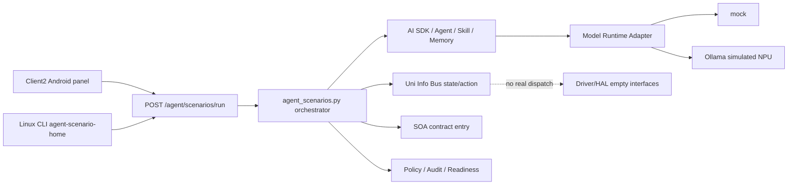

# Central Brain 咖咖虾参考场景测试计划

版本：0.1
日期：2026-07-11

## 1. 定位

本文把地平线 KaKaClaw（咖咖虾）公开展示的产品概念转换为 Central Brain Python 原型的可验证场景。它是独立实现的产品参考和验收设计，不声明接口兼容、代码复用、功能等价或品牌授权。

架构图仍是最高需求基线。参考功能只能落到 `APP-004`、`XSC-001`、`XSC-002`、`XSC-003`、`XSC-005`、`XSC-006`、`FW-U-004`、`FW-U-006`、`FW-U-007`、`NV-F-001`、`NV-F-011`、`NV-G-005`、`NV-G-007` 和 `DEL-001..003` 所定义的模块与接口，不能建立绕过 AI SDK、Uni Info Bus、SOA 或 Runtime & Governance 的旁路。

## 2. 公开资料基线

| 来源 | 本项目采用的公开概念 | 使用限制 |
| --- | --- | --- |
| [Horizon Robotics: KaKaClaw Agentic Car OS](https://en.horizon.auto/news/press/445) | task-as-service、自然语言任务调度、物理/数字/云 Agent、本地核心、人格与方言、长期记忆、主动关怀、Skill 创建/组合、Skill sandbox、default-deny、权限检查、Privacy Router | 官方产品概念来源；不据此推断私有协议或内部实现 |
| [凤凰科技发布报道](https://tech.ifeng.com/c/8sXCCT2uGgl) | 连续对话、多指令、路线与媒体任务、主动推荐、AIGC 主题、安全沙箱和本地隐私 | 用于补充公开演示场景，不作为接口规范 |
| [新浪汽车现场体验](https://www.sina.cn/news/detail/5305795421932953.html) | 出行任务编排、午休场景、人格化表达、自然语言创建 Skill | 用于测试用例抽象，不声明当前原型已实现全部能力 |
| [易车产品解读](https://www.bitauto.com/article/1003109472546/) | task-as-service 和疲劳/到家联动示例 | 只用于场景覆盖交叉核对 |

## 3. 产品能力映射

| 参考能力 | Central Brain 落点 | 演示场景 | 当前结论 | Req ID |
| --- | --- | --- | --- | --- |
| 模糊意图与主动关怀 | AI SDK -> Agent -> UIB Action -> Model Runtime | `我冷了`、`我累了` | active mock；给出建议并验证策略，不下发真实车控 | APP-004, XSC-001, XSC-002, XSC-005, NV-F-011 |
| Task as Service / 多任务编排 | Agent plan/execute + SOA contract + governance | `回家规划` | 生成 5 步 contract task graph；导航/媒体/车控只计划不执行 | XSC-001, XSC-003, FW-U-006, NV-F-001 |
| 场景 Skill 与沙箱 | Skill registry/invoke + policy | `午休模式`、`技能中心` | Skill contract mock；具备 sandbox 元数据，不是量产隔离沙箱 | XSC-001, FW-U-006, FW-U-007, NV-G-005 |
| 车辆上下文 | Uni Info Bus state + Vehicle Signal Adapter | `车辆状态` | 读取 VSS-style mock snapshot，不连接 VHAL/CAN | XSC-002, NV-F-003..005 |
| 长期偏好记忆 | AI SDK Memory facade | `偏好记忆` | 进程内只读 mock，`cloud_sync=false`，未实现持久化学习 | XSC-001, NV-F-001 |
| Default deny / Privacy Router | Policy + Permission + Audit | `越权拦截`、`隐私检查` | 可验证默认拒绝；Privacy Router 仅为 policy contract mock | FW-U-007, XSC-005, NV-G-005, NV-G-007 |
| 可观测与模型运行时 | Audit + Model Runtime Adapter | `审计记录`、`NPU状态` | 可观察 audit 和 mock/Ollama backend；不访问 PCIe NPU | XSC-005, NV-F-011, HW-002 |
| Android/Linux 交付成熟度 | completion/readiness 聚合 | `系统总览` | 显示当前 Python 范围完成和 Android/Linux 样例就绪；量产未就绪 | DEL-001..004, XSC-006 |

## 4. 场景目录

Android Client2 面板和 Linux/API 测试共用以下 12 个稳定 `scenario_id`：

| 分组 | 按钮 | `scenario_id` | 主要底层接口 | 通过条件 |
| --- | --- | --- | --- | --- |
| 场景任务 | 我冷了 | `care.cold` | `/agent/plan`、`/uib/actions/request`、`/ai/infer` | 返回自然语言或 mock 建议、规划状态和动作门禁状态 |
| 场景任务 | 我累了 | `care.fatigue` | `/vehicle/state`、`/ai/infer` | 返回疲劳建议和当前 mock 车速，不声明接管驾驶 |
| 场景任务 | 回家规划 | `task.home` | `/agent/plan`、`/agent/execute` | 返回 5 步 task graph 和 `validated_mock` |
| 场景任务 | 午休模式 | `skill.nap` | `/skills/cabin.scene.nap/invoke` | 返回 Skill sandbox contract 状态，不下发座椅/车窗/空调 |
| 状态与成长 | 车辆状态 | `state.vehicle` | `/uib/state` | 返回 mock 车速、电量和舱温 |
| 状态与成长 | 偏好记忆 | `memory.preference` | `/memory/query` | 返回本地 mock 偏好并明确未持久化 |
| 状态与成长 | 技能中心 | `skills.catalog` | `/skills` | 返回 Skill 目录并明确零代码发布未实现 |
| 状态与成长 | 审计记录 | `governance.audit` | `/audit/recent` | 返回最近审计记录数量和 trace 信息 |
| 安全与系统 | 越权拦截 | `security.denied` | `/policy/evaluate`、`/audit/recent` | 结果必须为 `blocked_as_expected` |
| 安全与系统 | 隐私检查 | `security.privacy` | `/policy/evaluate` | 云同步缺少权限时必须为 `blocked_as_expected` |
| 安全与系统 | NPU状态 | `runtime.npu` | `/npu/status` | 显示 backend/model，且 `hardware_accessed=false` |
| 安全与系统 | 系统总览 | `system.overview` | `/prototype/completion-summary` | 显示 Android/Linux 状态和 `production_ready=false` |

## 5. 接口设计

### 5.1 读取目录

`GET /agent/scenarios`

响应包括 `scenario_harness`、`groups`、`scenarios`、`reference_capability_gaps`、`boundaries` 和 `req_ids`。验收表达为 `product_compatibility_claimed=false`，对应 JSON 字段 `boundaries.product_compatibility_claimed` 必须为 `false`。

### 5.2 执行场景

`POST /agent/scenarios/run`

最小请求：

```json
{
  "scenario_id": "task.home",
  "utterance": "回家规划",
  "runtime": "mock",
  "caller_permissions": ["vehicle.read", "vehicle.control", "service.read"]
}
```

关键响应字段：

```json
{
  "status": "ok",
  "scenario": {"scenario_id": "task.home"},
  "result": {
    "outcome": "passed",
    "generated_text": "...",
    "checks": []
  },
  "evidence": {},
  "boundaries": {
    "real_vehicle_control": false,
    "service_dispatch_triggered": false,
    "hardware_accessed": false,
    "driver_development_triggered": false,
    "virtualization_development_triggered": false,
    "production_ready": false
  }
}
```

未知 `scenario_id` 必须返回 `status=error` 和 `result.outcome=unknown_scenario`。

## 6. 模块关系



`agent_scenarios.py` 是演示编排器，不是新的架构层。它只组合已有接口，不直接读取硬件、调用 vendor SDK、连接车辆总线或绕过策略检查。

## 7. 验收方法

```bash
bash tools/smoke_central_brain_agent_scenarios.sh
bash tools/check_client2_central_brain_demo.sh
CENTRAL_BRAIN_BASE_URL=http://127.0.0.1:8787 \
python3 central-brain/linux-cli/central_brain_cli.py agent-scenarios
CENTRAL_BRAIN_BASE_URL=http://127.0.0.1:8787 \
python3 central-brain/linux-cli/central_brain_cli.py agent-scenario-home
```

自动验收必须确认：目录恰好包含 12 个稳定 ID；全部场景返回预期 outcome；两个安全场景必须被拒绝；未知场景必须失败；Android 布局包含全部 ID；Linux CLI 能读取同一目录并执行同一 API；所有场景都保持 no-hardware/no-driver/no-virtualization/no-production 边界。

## 8. 2026-07-11 运行证据

- API 36 x86_64 可视模拟器使用 `1920x1080` skin；Client2 Activity resumed，原车模保持全屏，右侧面板范围 `[1265,160][1888,1048]`。
- 控件区可独立滚动；UI dump 验证首屏 6 个按钮和滚动后的 8 个按钮可点击，覆盖全部 12 个场景。
- `回家规划` 返回 5 步 task graph 和 `validated_mock`；`越权拦截` 返回 `DENY`；`NPU状态` 显示 `ollama-simulated-npu` 与 `qwen3.5:27b-optimized`；`系统总览` 显示当前 Python 原型范围完成、Android/Linux 同步就绪、量产未就绪。
- `我冷了` 经真实本地 Ollama 仿真链路在约 77.6 秒内返回中文建议；当次 `ollama ps` 显示 27B 模型约为 `90%/10% CPU/GPU`，因此这不是 PCIe NPU 或全 GPU 性能证据。
- 图形后端因当前 WSL GPU 条件回退到 `llvmpipe`；稳定截图正常，瞬时 `screencap` 可能捕获 Unity 软件渲染中的黑块，不视为面板布局故障。

## 9. 未实现能力和后续顺序

1. 连续多轮会话状态和跨任务记忆写入。
2. 可切换人格、方言和语气运行时。
3. 自然语言零代码创建、审核、发布和组合 Skill。
4. 真实物理/数字/云 Agent 协作以及主动触发器。
5. 真实导航、媒体、座舱车控和 ADAS 服务 dispatch。
6. 量产级 Skill sandbox、Privacy Router、身份、权限和审计后端。
7. HTTP 演示 binding 迁移到 Android Binder/SDK/system service；Linux 同步补 IPC/gRPC 场景入口。

这些缺口必须继续通过 ISSUE/DEV 跟踪；在目标硬件、服务 contract、owner、权限和 Safety State 未明确前，不增加 Driver/HAL 或虚拟化实现。
