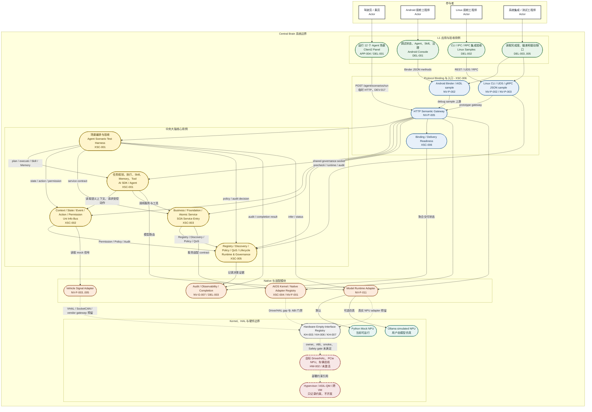

# Central Brain 模块调用用例图

版本：0.1
日期：2026-07-11

## 图的范围

本图同时表达四类参与者、Android/Linux 接入用例、中央大脑核心模块调用关系，以及真实硬件空接口边界。它是当前 Python 原型的用例-模块组合视图，不替代架构图需求基线。

覆盖 Req ID：`APP-004`、`XSC-001`、`XSC-002`、`XSC-003`、`XSC-004`、`XSC-005`、`XSC-006`、`FW-U-001..008`、`FW-S-001..006`、`NV-F-001`、`NV-F-003..005`、`NV-F-011`、`NV-G-001..007`、`NV-P-002`、`NV-P-003`、`NV-P-005`、`KH-003`、`KH-006`、`KH-007`、`HW-002`、`DEL-001..005`。

## 用例-模块调用关系图

## 阅读规则

- 实线表示当前原型中存在的调用或查询路径。
- 虚线表示 contract、空接口或目标平台预留路径，不表示已经访问真实硬件。
- Client2 到 HTTP Gateway 是 `DEV-017` 临时演示路径；正式 Android 路径仍应迁移到 Binder/SDK/system service。
- Android 与 Linux 客户端都不能直接调用 Model Runtime、Driver/HAL 或 PCIe NPU。
- SOA 和 Uni Info Bus 的受控操作必须进入 Runtime & Governance，完成 Registry、Policy、QoS、Lifecycle 和 Audit 检查。
- `Ollama simulated NPU` 只替代模型推理后端，不关闭 `DRV-GAP-001`，也不代表真实 NPU 性能或驱动已验收。
- 虚拟化层只保留部署和安全域约束，不产生实现调用。

## 主要用例结果

| 参与者用例 | 主要入口 | 核心模块链 | 当前边界 |
| --- | --- | --- | --- |
| 驾驶员运行 Agent 场景 | Client2 `/agent/scenarios/run` | Scenario Harness -> AI SDK/UIB/SOA/Governance/Model Adapter | HTTP demo；真实车控和服务 dispatch 为 false |
| Android 工程师调试 | Console -> Binder/AIDL | Binder -> Gateway -> core modules | 普通 debug APK sample，非 privileged service |
| Linux 工程师集成 | CLI/UDS/gRPC JSON | Linux Binding -> Gateway/shared governance | gRPC JSON sample，非量产 broker |
| 系统工程师验收 | readiness/completion/driver-gap API | Binding/Governance/Audit/Native registries | 只读证据，不关闭量产 gate |

所有路径固定保持 `hardware_accessed=false`、`driver_development_triggered=false`、`virtualization_development_triggered=false` 和 `production_ready=false`。
