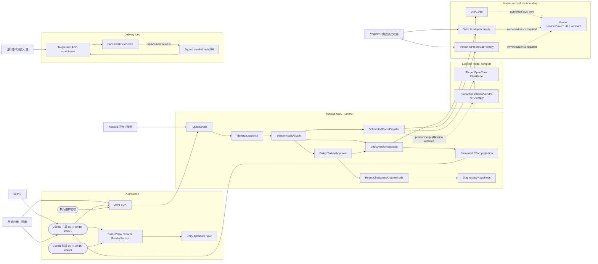
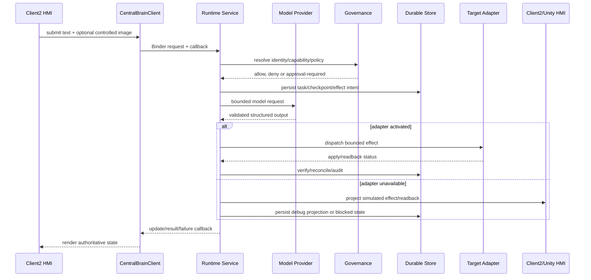

# Central Brain Android 模块用例与调用关系

版本：1.1
日期：2026-07-27
状态：`REPOSITORY_SOFTWARE_ARCHITECTURE_BASELINE_READY / PRODUCTION_ACTIVATION_EXTERNAL_BLOCKED`

本图只描述黑盒 Android 13 实机工程。Req ID：`APP-004`、`XSC-001..006`、
`NV-F-001/003/004/005/011/012`、`NV-G-003..007`、`NV-P-002`、`KH-003/006`、
`DEL-001/003/004/005`。

## 用例约束

| Actor | 用例 | 权威入口 | 当前边界 |
| --- | --- | --- | --- |
| 驾驶员 | 选择“我冷了”“我累了”“处理一下”等场景 | Client2 -> SDK -> Binder | 文字/受控图片进入真实模型路径；执行仍为 UI 仿真 |
| 座舱工程师 | 集成 SDK、显示 session/plan/effect | Java SDK/AIDL | 不直接调用模型或车辆 API |
| 平台工程师 | 配置 signer/capability/部署和 diagnostics | Runtime APK、policy XML、ADB | 不修改无源码系统组件 |
| Vendor 工程师 | 实现车辆/NPU adapter | Java/C contract、公开 SDK | ABI/权限/Safety/evidence 未齐不得激活 |
| 测试人员 | 安装、双屏渲染恢复、故障恢复、目标证据 | bundle + ADB scripts | Client1 必须先于 Client2 建立共享 RenderService；只提交脱敏摘要 |

## 关键时序

当前 `hardware_accessed=false`、`driver_development_triggered=false`、
`virtualization_development_triggered=false`、`architecture_document_set_ready=true`、
`production_ready=false`、`target_hardware_validated=false`。
