# Central Brain Ollama Model Gateway 详细设计

## 1. 文档状态

- 工作包：`P7-R2`
- 状态：开发环境 WSL 模型网关已在 Android 13 ARM64 实机验证；独立 debug 投影已完成
  host/build 验证，因本轮 ADB 设备数为 0 待实机复测
- Req IDs：`S2-MDL-001`、`S2-SAF-001`、`S2-OBS-001`、`XSC-001/005/006`、
  `DEL-001/003/004/005`
- 量产状态：端点和安全边界已冻结，release Provider 尚未启用
- 明确非声明：`production_ready=false`、`target_hardware_validated=false`

## 2. 设计目标

本设计提供同一 `ModelProvider` 上层合同下的两种固定端点配置：

1. 开发环境：Android 访问 `127.0.0.1:11434`，通过 `adb reverse` 转发到 Windows/WSL 中的
   Ollama，运行 `qwen3.5:27b-optimized`。
2. 量产环境：Android 直接访问专用链路本地算力基座 `169.254.208.110:11434`。

调用方不能传入 URL，模型输出不能直接授予车辆 Effect 权限，原始 prompt/response 不进入日志和
持久化数据库。开发环境必须能够证明模型确实被调用，而不是按钮直接生成固定成功结果。

## 3. 非目标

- 不修改座舱厂商 Android 13 系统、SDK 或已刷机分区。
- 不在 Android APK 中嵌入 Ollama 或 27B 模型。
- 不开发 PCIe/NPU 驱动、Vendor HAL 或模型编译器。
- 不将 WSL CPU/GPU 运行证据解释为目标 NPU 证据。
- 不允许模型文本直接生成未经 catalog、policy 和 safety 校验的车辆指令。

## 4. 总体架构

### 4.1 开发环境

```mermaid
flowchart LR
    HMI["Client2 HMI"] --> SDK["Session/Orchestration SDK"]
    SDK --> RT["Android Runtime Service"]
    RT --> MR["PolicyAwareModelRouter"]
    MR --> LP["LocalModelProvider"]
    LP --> OG["OllamaInferenceEngine (debug only)"]
    OG --> LOOP["127.0.0.1:11434"]
    LOOP --> ADB["ADB reverse tcp:11434"]
    ADB --> WSL["WSL Ollama"]
    WSL --> MODEL["qwen3.5:27b-optimized"]
    MODEL --> VALIDATE["Schema + scenario + action allowlist"]
    VALIDATE --> PROJECTION["DevelopmentModelProjection (debug only)"]
    PROJECTION --> HMI
```



Android 侧只知道 loopback 地址。`tools/start_central_brain_wsl_ollama_bridge.sh` 负责检查本地模型、
Ollama version endpoint、单一在线设备和 reverse rule；脚本不输出设备 serial。

### 4.2 量产环境

```mermaid
flowchart LR
    HMI["Production HMI"] --> SDK["Typed Binder SDK"]
    SDK --> RT["Runtime Model Gateway"]
    RT --> POLICY["Policy / resource / thermal admission"]
    POLICY --> PROD["Production ModelProvider"]
    PROD --> IP["169.254.208.110:11434"]
    IP --> BASE["External Ollama/NPU compute base"]
    BASE --> VALIDATE["Same bounded response validator"]
    VALIDATE --> COMPILER["Scenario compiler + safety authority"]
    COMPILER --> EFFECT["Governed Effect pipeline"]
```



当前只实现 `OllamaEndpointConfig.productionLinkLocal()`、release 网络白名单和失败关闭的 BuildConfig。
`ProductionOllamaProvider`、真实 health owner、NPU 资源遥测、量产模型名及签名发布不在 P7-R2 中启用。

## 5. 模块与文件

| 模块 | 文件 | 职责 |
| --- | --- | --- |
| 固定端点配置 | `runtime-service/.../model/OllamaEndpointConfig.java` | 冻结开发/量产 host、端口、path、timeout 和模型名校验 |
| 开发 HTTP Engine | `runtime-service/src/debug/.../model/OllamaInferenceEngine.java` | 组装 `/api/chat` 请求、执行 HTTP、校验结构化响应、输出安全指标 |
| Provider 生命周期 | `runtime-service/src/debug/.../model/LocalModelProvider.java` | warmup、deadline、cancel、bounded stream、metrics、fault isolation |
| Registry/Router | `ModelProviderRegistry.java`、`PolicyAwareModelRouter.java` | 固定 provider ID、health freshness、开发网络策略和 route admission |
| 决策组合 | `DebugDecisionCompositionBoundary.java` | Context/Trigger/Consent/Model/Event 组合及模型证据绑定 |
| 开发模型投影 | SDK `src/debug/.../model/DevelopmentModelProjection.aidl`、`ICentralBrainDevelopmentModelProjection.aidl` | 独立于 Orchestration V1 的瞬时回复、provider ID、output digest 和推理耗时 |
| 投影内存与服务 | `DevelopmentModelProjectionStore.java`、`DevelopmentModelProjectionService.java` | owner-scoped、16 条上限、不落库；仅 debug variant 注册 Binder Service |
| Client2 投影 | `CockpitSimulatedScenarioState.java`、`CockpitHmiReducer.java` | 校验 Binder 字段、显示真实回复、标记模型阶段 |
| 网络安全 | main/debug `network_security_config.xml` | 默认禁止明文；每个 variant 只放行一个固定 host |
| 开发桥 | `tools/start_central_brain_wsl_ollama_bridge.sh` | 建立和验证 ADB reverse |
| 机器合同 | `central_brain_android_ollama_gateway_v1.json` | 固化实现、证据和非声明 |
| 静态门禁 | `tools/check_central_brain_android_ollama_gateway.sh` | 检查端点、variant 隔离、输出边界和持久化禁区 |

## 6. 端点配置

| 属性 | 开发 profile | 量产 profile |
| --- | --- | --- |
| profile | `DEVELOPMENT_WSL_ADB_REVERSE` | `PRODUCTION_LINK_LOCAL` |
| Android base URL | `http://127.0.0.1:11434` | `http://169.254.208.110:11434` |
| Chat API | `/api/chat` | `/api/chat` |
| 网络路径 | ADB reverse 到 WSL | 座舱以太网直连算力基座 |
| 模型 | `qwen3.5:27b-optimized` | `UNCONFIGURED`，必须由量产 owner 冻结 |
| Provider enable | debug `true` | release `false` |
| 明文白名单 | 仅 `127.0.0.1` | 仅 `169.254.208.110` |
| 跳转 | 禁止 | 禁止 |

端口使用 Ollama 默认 `11434`。配置类不暴露任意 URL factory，模型名拒绝空值、`UNCONFIGURED`、
URL 和路径穿越片段。

## 7. `/api/chat` 请求合同

请求使用 `POST application/json`，关键字段如下：

```json
{
  "model": "qwen3.5:27b-optimized",
  "stream": false,
  "think": false,
  "keep_alive": "5m",
  "messages": [
    {"role": "system", "content": "bounded planner instruction"},
    {"role": "user", "content": "allowlisted scenario material"}
  ],
  "format": {"type": "object", "additionalProperties": false},
  "options": {"temperature": 0, "num_predict": 192}
}
```

开发版目前只注册两个场景：

| 场景 | 输入 | 可提议 action ID |
| --- | --- | --- |
| `scene.comfort.cold.v1` | `车里有点冷` | `hvac.warm_cabin`、`media.keep_playing` |
| `scene.fatigue.assist.v1` | `我有些疲惫` | `seat.recline`、`hvac.ventilate`、`media.pause`、`navigation.find_rest_area` |

这些 action 是模型提议白名单，不是 Effect authority。P7-R2 仍使用已签入的固定场景 Plan；模型 action
只做结构、安全和场景一致性校验，不改变固定 Plan 节点集合。

## 8. 响应合同

Ollama envelope 必须满足：HTTP 2xx、`model` 精确匹配、`done=true`、`message.content` 是 JSON。
content 的唯一合法形状为：

```json
{
  "scenario_id": "scene.fatigue.assist.v1",
  "reply": "bounded Chinese display text",
  "actions": ["seat.recline", "hvac.ventilate"]
}
```

校验顺序：

1. response byte 数不超过 65,536；
2. scenario ID 必须与当前 Session 场景一致；
3. reply 非空且不超过 256 字符；
4. action 数量为 1..4、无重复；
5. 每个 action 必须存在于该场景固定白名单；
6. 校验后重新生成 canonical JSON，再交给 `LocalModelProvider` 计算 output digest。

任一失败均返回 Provider failure，Orchestration 不启动模拟 Effect。

## 9. UI 与数据生命周期

模型成功后，Runtime 通过独立 debug 接口 `ICentralBrainDevelopmentModelProjection` 返回
`DevelopmentModelProjection`：

- `assistantDisplayText`
- `providerId=android.local.development`
- `latencyMs`
- `outputDigest`、`projectionDigest`、`completedAtEpochMs`

该接口和 typed client 都位于 SDK `debug` source set，release AAR 不包含它，release manifest 也不注册 Service。
读取方必须具备签名权限和 `ORCHESTRATION_READ_OWN` capability，服务还会从 Room 重新验证 Session owner。
`OrchestrationSnapshot` V1 及其冻结 hash 保持不变。Store 在 Runtime 进程内最多保留 16 条且返回副本；
`DurableOrchestrationProjectionRepository` 不读取或写入这些字段，Room 只保留 Orchestration projection digest、
Plan/Node 状态和固定 detail code。Client2 checkpoint 也不保存模型文本。
进程重启后不能恢复旧回复，HMI 必须以“回复不可恢复”处理，不能伪造内容。

执行链中 Plan 阶段显示 provider ID 和 `MODEL_OK_<latency>MS`；底部回复区显示经过校验的真实模型回复。
等待模型时界面保持在“计划”阶段，不把按钮点击投影为执行成功。

## 10. 超时、并发与失败

- connect timeout：3,000 ms
- read/request deadline：120,000 ms
- pending prompt registry：最多 16
- request：最多 16,384 bytes
- response：最多 65,536 bytes
- reply：最多 256 chars
- action：最多 4
- Client2 Session deadline：120,000 ms

日志只输出固定错误码：`TRANSPORT_FAILURE`、`HTTP_STATUS_REJECTED`、
`RESPONSE_SIZE_REJECTED`、`MODEL_IDENTITY_REJECTED`、`NON_TERMINAL_RESPONSE`、
`SCENARIO_BINDING_REJECTED`、`REPLY_BOUNDS_REJECTED`、`ACTION_COUNT_REJECTED`、
`ACTION_ALLOWLIST_REJECTED`、`STRUCTURED_OUTPUT_REJECTED`、`DEADLINE_EXCEEDED`、
`CANCELLED`、`INTERNAL_GATEWAY_FAILURE`。

日志不得包含 prompt、reply、action payload、设备 serial 或指纹。

## 11. 开发环境启动

前置条件：WSL Ollama 已运行，模型名存在，Android 13 设备通过 ADB 在线。

```bash
cd /home/normad400/appDev
tools/start_central_brain_wsl_ollama_bridge.sh
tools/build_client2_central_brain_demo.sh
```

安装 Runtime 和 Client2 后再次运行 bridge 脚本，防止 ADB server 或 USB 重连导致 reverse rule 丢失。
验证 reverse：

```bash
/mnt/e/platform-tools/adb.exe reverse --list
/mnt/e/platform-tools/adb.exe shell /system/bin/curl -sS \
  http://127.0.0.1:11434/api/version
```

触发 Client2 的“我有些疲惫”后，安全日志应出现：

```text
ollama_inference_completed=true endpoint_profile=development_wsl_adb_reverse ...
network_accessed=true npu_accessed=false hardware_accessed=false
raw_prompt_logged=false raw_response_logged=false
```

## 12. P7-R2 验证结果

2026-07-19 在 Android API 33 / ARM64 实机完成：

- Android 到 WSL `/api/version` 可达；
- `qwen3.5:27b-optimized` 被实际加载；
- 单次 Fatigue 推理耗时 43,739 ms；
- Ollama 显示 processor 为 `90%/10% CPU/GPU`；
- 结构化响应通过 scenario/reply/action 校验；
- 先前实机链已显示经验证的真实模型回复；
- 最终独立 debug 投影接口已通过 JVM、SDK/APK build 和 variant 隔离验证，Orchestration V1 hash 未改变且
  release Service 缺失；本轮因 Windows ADB 返回 0 台设备，最终接口的 Android 13 ARM64 复测未执行；
- WSL 计算不是目标 NPU，车辆 Effect 仍为 debug simulation。

因此本工作包区分两项证据：`development_android13_arm64_verified=true` 仅证明 Android 到 WSL 的
实际 HTTP/模型/结构化响应链；`development_projection_android13_arm64_verified=false` 表示重构后的独立
debug Binder 尚待设备重新上线后复测。

## 13. 量产实现待办

`P7-R3` 必须在启用 release Provider 前完成：

1. 冻结量产模型名、版本、artifact digest、Ollama 版本和兼容矩阵；
2. 实现 release `ProductionOllamaProvider`，复用同一 response validator；
3. 增加 `169.254.208.110` health/version/model warmup 与退化策略；
4. 接入可信 thermal/resource producer 和 NPU telemetry owner；
5. 定义链路隔离、端口暴露、无认证 HTTP 的 OEM 网络风险接受或安全代理方案；
6. 把模型 action proposal 接到 Scenario Compiler，而不是绕过 catalog/policy/safety；
7. 完成断链、超时、错误 schema、模型错配、重启、并发和长稳测试；
8. 使用量产签名 APK 和目标 NPU 证据后才允许提升 production/target 状态。

在以上条件完成前，release 中 `OLLAMA_DEVELOPMENT_ENABLED=false`、
`OLLAMA_MODEL=UNCONFIGURED`，生产模型调用保持失败关闭。
