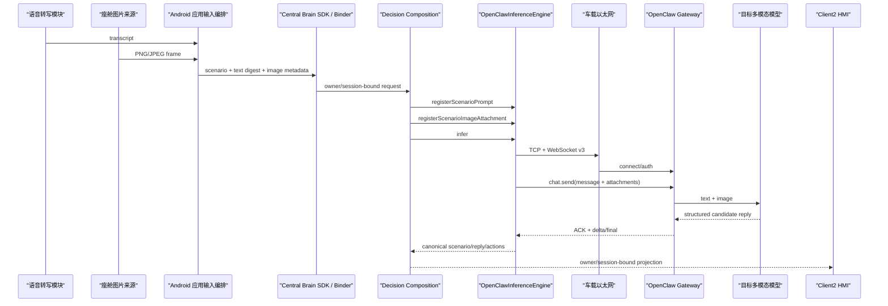

# Central Brain Android 车机直连 OpenClaw 接口详解

## 1. 文档范围

本文只描述目标车机在生产网络拓扑下，通过 Android 硬件以太网直接访问外部 OpenClaw 算力单元的接口。
唯一网络路径是：

```text
Android 13 座舱域控制器
  -> 车载以太网
  -> ws://169.254.208.110:18789/
  -> OpenClaw Gateway
  -> 目标模型运行时
```

本文覆盖：

- 目标地址、构建 profile 和 WebSocket v3 协议；
- 文字输入；
- 单张图片输入；
- 同一 `chat.send` 中的文字+图片联合输入；
- 模型回复校验、失败关闭、日志和 Client2 投影；
- 当前实现边界以及目标端仍需完成的接入工作。

本文不把“生产网络拓扑”解释为“已经取得量产资格”。当前实现仍是
`target_openclaw_transitional / TARGET_INTEGRATION`：

- `release_routing_enabled=false`
- `production_eligible=false`
- `target_multimodal_protocol_implemented=true`
- `target_multimodal_frontend_bound=false`
- `target_multimodal_verified=false`
- `direct_npu_accessed=false`
- `vehicle_effect_hardware_accessed=false`
- `production_ready=false`
- `target_hardware_validated=false`

适用阶段：`P7-R3-OC2`、`P7-R5-MMDEV`。

Req IDs：`S2-MDL-001/002`、`S2-SAF-001`、`S2-OBS-001/002`、
`XSC-001/005/006`、`DEL-001/003/004/005`。

## 2. 生产环境网络端点

目标 OpenClaw 暴露两个用途不同的地址：

| 用途 | URI | 调用方 | 说明 |
| --- | --- | --- | --- |
| 人工控制页面 | `http://169.254.208.110:18789/chat?token=<源码固化值>` | 工程人员浏览器 | 仅用于人工页面，不是模型 RPC |
| 模型 WebSocket | `ws://169.254.208.110:18789/` | Android Runtime | RFC6455 Upgrade 后执行 OpenClaw protocol v3 |

模型调用不得向 `/chat` 发送 HTTP POST，也不得把控制页面当作 OpenAI-compatible REST API。
WebSocket URI 不携带 query、userinfo 或 fragment。认证值在收到 `connect.challenge` 后放入：

```text
connect.params.auth.token
```

目标地址和凭据由
`central-brain/android-runtime/runtime-service/src/main/java/com/centralbrain/runtime/model/OpenClawEndpointConfig.java`
固定。调用方不能传入其他 host、port、path 或 token。

当前关键常量：

| 字段 | 值 | 约束 |
| --- | ---: | --- |
| `TARGET_HOST` | `169.254.208.110` | 外部算力单元 |
| `TARGET_PORT` | `18789` | TCP/WebSocket 端口 |
| `WEBSOCKET_PATH` | `/` | 模型 Upgrade 路径 |
| `CONTROL_UI_PATH` | `/chat` | 人工页面路径 |
| `TARGET_PROTOCOL_VERSION` | `3` | `minProtocol=maxProtocol=3` |
| `CONNECT_TIMEOUT_MS` | `3000` | 同时受请求总 deadline 截断 |
| `READ_TIMEOUT_MS` | `120000` | 同时受请求总 deadline 截断 |
| `MAX_HANDSHAKE_BYTES` | `16384` | HTTP Upgrade header |
| `MAX_PREAUTH_FRAME_BYTES` | `65536` | connect 等普通出站 RPC |
| `MAX_MULTIMODAL_CHAT_FRAME_BYTES` | `8500000` | 已认证且携带图片的 `chat.send` |
| `MAX_FRAME_BYTES` | `1048576` | 服务端单条或拼接入站消息 |
| `MAX_REQUEST_BYTES` | `16384` | 文字 prompt UTF-8 |
| `MAX_RESPONSE_BYTES` | `65536` | 模型终态文字 UTF-8 |

当前是明文 `ws://`。TLS、服务端证书校验和可轮换凭据尚未进入 release 路径。

## 3. 端到端模块关系



当前完成度必须分开理解：

| 接口段 | 当前状态 |
| --- | --- |
| Android Runtime -> 目标 WebSocket | 已实现 |
| 文字 `message` -> `chat.send` | 已实现；存在历史目标证据 |
| 图片 `attachments[0]` -> `chat.send` | 已实现、JVM 合同已验证 |
| 文字和图片同一 RPC | 已实现、JVM 合同已验证 |
| 前端语音转写+相机帧 -> SDK/Binder | 未绑定，`ISSUE-055` |
| 目标车机以太网多模态终态 | 未验收 |
| release source set | 未发布 |

Client2 不直接打开 OpenClaw socket。所有模型网络访问必须经过 Runtime、Provider、输出校验和会话投影。

## 4. 源码模块映射

| 层级 | 文件或类型 | 责任 |
| --- | --- | --- |
| Build profile | `runtime-service/build.gradle.kts` | 生成固定 target profile |
| Endpoint | `OpenClawEndpointConfig` | 固定目标 URI、协议、凭据和容量 |
| Prompt | `CockpitModelPrompt` | 座舱角色、场景、动作白名单 |
| Provider | `ModelProviderProfiles` / `LocalModelProvider` | 生命周期、deadline、cancel、metrics |
| Registry/Router | `ModelProviderRegistry` / `PolicyAwareModelRouter` | 只选择 `TARGET_INTEGRATION` provider |
| Protocol engine | `OpenClawInferenceEngine` | WebSocket、文字/图片、RPC、输出校验 |
| Composition | `DebugDecisionCompositionBoundary` | Context、Trigger、Policy、Provider 集成 |
| Target probe | `OpenClawTargetIntegrationProbeActivity` | 目标链路元数据探针 |
| Projection | `DevelopmentModelProjectionStore` / Binder | owner/session-bound 回复投影 |
| Client2 | `OrchestrationRuntimeClient` | 读取投影，不持有网络凭据 |
| Machine contract | `central_brain_android_openclaw_target_gateway_v1.json` | 固化目标接口和 false claims |
| Static gate | `check_central_brain_android_openclaw_target_gateway.sh` | 检查代码、合同和本文一致 |

`OpenClawInferenceEngine` 当前位于 `src/debug`，因此目标集成 profile 可运行，但 release source set
尚未发布同等 engine。这是发布边界，不改变本文定义的生产网络接口形态。

## 5. 目标构建 profile

构建目标 OpenClaw profile：

```bash
CENTRAL_BRAIN_TARGET_OPENCLAW=true \
  tools/build_central_brain_android_runtime.sh
```

对应 BuildConfig 语义：

```text
MODEL_GATEWAY_PROFILE=target_openclaw_transitional
OPENCLAW_TARGET_ENDPOINT_CONFIGURED=true
OPENCLAW_TARGET_ROUTING_ENABLED=true
OPENCLAW_BASE_URL=ws://169.254.208.110:18789
OPENCLAW_PROTOCOL_VERSION=3
OLLAMA_DEVELOPMENT_ENABLED=false
```

`DebugDecisionCompositionBoundary.resolveNetworkMode()` 交叉检查 profile、URI、协议和路由开关。
任一字段不一致都会抛出 `target OpenClaw build configuration is invalid`，禁止隐式 fallback。

Provider 固定属性：

```text
providerId=external.openclaw.transitional
backendKind=OPENCLAW_GATEWAY
assurance=TARGET_INTEGRATION
fallbackClass=NEVER
hardwareBacked=false
productionEligible=false
```

模型输出只形成候选结果：

```text
actionAuthorizationGranted=false
effectDispatchRequested=false
```

## 6. 文字与图片输入合同

### 6.1 文字输入

语音模块先在车机侧产生文字转写。OpenClaw 接口当前不发送原始 PCM、AAC 或其他音频字节。
Runtime 使用 `CockpitModelPrompt` 把以下内容合成为 `chat.send.params.message`：

- 用户文字；
- 场景 ID；
- 汽车座舱系统指令；
- 驾驶员服务目标；
- 受控 Context；
- 允许动作；
- 必选动作；
- 精确 JSON 输出 schema。

文字 UTF-8 最大 16 KiB。

### 6.2 图片输入

模型网关图片入口：

```java
registerScenarioImageAttachment(
    String inputDigest,
    String mimeType,
    String fileName,
    byte[] content)
```

当前约束：

| 项目 | 约束 |
| --- | --- |
| 每个请求图片数 | 最多 1 张 |
| MIME | `image/png` 或 `image/jpeg` |
| 单图大小 | 1..6 MiB |
| 待处理图片总量 | 最大 12 MiB |
| 文件名 | `[A-Za-z0-9][A-Za-z0-9._-]{0,95}` |
| 内容校验 | MIME 必须与 PNG/JPEG 魔数一致 |
| 内存所有权 | 注册时复制 `byte[]` |
| 完整性 | 计算 SHA-256 |
| 重复注册 | MIME、文件名、SHA-256、长度全部相同才幂等 |

图片以 `inputDigest` 为 key，与同一场景 prompt 一起被 `infer()` 取出。当前 `inputDigest`
本身尚未强制包含图片 SHA-256；前端媒体 DTO、组合摘要和 history 绑定由 `ISSUE-055` 继续收口。

### 6.3 文字和图片必须属于同一请求

调用顺序：

```java
openClawEngine.registerScenarioPrompt(inputDigest, scenarioId);
openClawEngine.registerScenarioImageAttachment(
        inputDigest,
        "image/jpeg",
        "cabin-frame.jpg",
        imageBytes);
modelProvider.infer(inferenceRequest);
```

三个调用必须使用相同的 `inputDigest`。不能先发送文字、再使用另一个 session 单独发送图片。

### 6.4 图片生命周期

Runtime 不把图片放入日志、模型投影或 Client2 状态。完成、失败或关闭后，待处理注册表不再保留该条目。
但当前实现没有显式清零 JVM `byte[]`，OpenClaw 对大附件也可能使用服务端 managed inbound media。
量产前必须由媒体生命周期 owner 冻结内存清零、服务端 retention、删除和诊断取证策略。

## 7. 输入摘要和会话绑定

核心 `ModelContractV2` 仍是 digest-only：

```text
requestId
traceId
inputDigest
purpose
privacyClass
latencyBudget
tokenBudget
requiredCapability
fallbackPolicy
```

OpenClaw 会话标识：

```text
sessionKey = agent:main:cougaros- + inputDigest 前 32 字符
idempotencyKey = UUID.nameUUIDFromBytes(requestId UTF-8)
```

目标前端合同应将以下字段纳入统一 canonical digest：

```text
schema version
normalized transcript digest
image SHA-256
image MIME
scenario ID
session ID
capture timestamp class
```

这项 aggregate digest 尚未进入公开 SDK/Binder，所以当前目标多模态不得声明端到端完成。

## 8. WebSocket Upgrade

`SocketTransport` 使用 Java `Socket`，目标请求形态：

```http
GET / HTTP/1.1
Host: 169.254.208.110:18789
Upgrade: websocket
Connection: Upgrade
Sec-WebSocket-Key: <random-base64>
Sec-WebSocket-Version: 13
Origin: http://169.254.208.110:18789
```

客户端要求：

- 状态码为 HTTP 101；
- `Sec-WebSocket-Accept` 与 RFC6455 计算结果一致；
- header 不超过 16 KiB；
- 客户端帧使用随机 MASK；
- 入站帧不得带 MASK；
- RSV 位为 0；
- 支持 text、continuation、ping/pong、close；
- JSON 使用严格 UTF-8。

## 9. OpenClaw protocol v3 鉴权

第一条协议消息必须是：

```json
{
  "type": "event",
  "event": "connect.challenge",
  "payload": {"nonce": "<non-empty>"}
}
```

随后 Runtime 发送：

```json
{
  "type": "req",
  "id": "<uuid>",
  "method": "connect",
  "params": {
    "minProtocol": 3,
    "maxProtocol": 3,
    "client": {
      "id": "openclaw-control-ui",
      "version": "cougaros-target-integration",
      "platform": "android",
      "mode": "webchat"
    },
    "role": "operator",
    "scopes": ["operator.read", "operator.write"],
    "caps": [],
    "auth": {"token": "<源码固化值>"},
    "locale": "zh-CN",
    "userAgent": "CougarOS-Android/0.3"
  }
}
```

返回必须 `ok=true` 且 `payload.protocol=3`。token 错误只会在 TCP、Upgrade、challenge 成功后暴露。

## 10. chat.send 文字与图片 RPC

### 10.1 纯文字

```json
{
  "type": "req",
  "id": "<uuid>",
  "method": "chat.send",
  "params": {
    "sessionKey": "agent:main:cougaros-<digest-prefix>",
    "message": "<汽车座舱 prompt>",
    "deliver": false,
    "idempotencyKey": "<uuid>"
  }
}
```

### 10.2 文字+图片

```json
{
  "type": "req",
  "id": "<uuid>",
  "method": "chat.send",
  "params": {
    "sessionKey": "agent:main:cougaros-<digest-prefix>",
    "message": "<汽车座舱 prompt 和用户文字>",
    "deliver": false,
    "idempotencyKey": "<uuid>",
    "attachments": [
      {
        "type": "image",
        "mimeType": "image/jpeg",
        "fileName": "cabin-frame.jpg",
        "content": "<base64 image bytes>"
      }
    ]
  }
}
```

`message` 和 `attachments` 在同一个已认证 RPC 中发送。图片字节先经过本地校验，再 Base64 编码。
只有带图片的 `chat.send` 可以使用 8.5 MB 出站上限；`connect`、`history`、`abort` 等仍使用 64 KiB 上限。

## 11. ACK、流式终态和 history

`chat.send` ACK 必须 `ok=true`。若 ACK 返回 `runId`，后续事件绑定该 run ID。

只处理：

- `type=event`
- `event=chat`
- sessionKey 与当前请求一致
- runId 为空或与当前 run 一致

状态处理：

| state | 行为 |
| --- | --- |
| `delta` | 更新累计文本 |
| `final` | 优先使用 final message，否则使用累计 delta |
| `error` | 失败关闭 |

终态文本为空时，当前实现最多读取 6 条 `chat.history`，并要求最近 user 文字与当前 `message`
逐字符一致。该回退目前不比较图片 SHA-256；目标多模态量产接入前必须补充附件摘要绑定，
或在图片请求上禁用该回退。

发生 transport/protocol 异常时，Runtime best-effort 发送 `chat.abort(sessionKey, runId)`。

## 12. 模型输出合同

模型必须只返回：

```json
{
  "scenario_id": "scene.comfort.cold.v1",
  "reply": "正在为你调节座舱温度。",
  "actions": ["hvac.warm_cabin"]
}
```

校验规则：

| 字段 | 规则 |
| --- | --- |
| key 集合 | 精确为 `scenario_id`, `reply`, `actions` |
| `scenario_id` | 与注册场景完全相同 |
| `reply` | 1..256 字符，无控制字符 |
| `actions` | 1..4、不重复、全部在场景 allowlist |
| 必选动作 | Cold 必须有 HVAC；Fatigue 必须有 HVAC 和 Seat |
| 未知字段 | 拒绝 |
| 总响应 | 1..65536 UTF-8 bytes |

通过后 Runtime 重建 canonical JSON，不直接透传原始回复。

图片只提供额外 Context。模型不能因为识别到人物、物体或姿态而创建新的 Effect capability，
也不能绕过 Scenario Catalog、Consent、Safety、固定 Plan、Adapter 或 readback。

## 13. Client2 投影

Runtime 只投影已校验结果：

```text
sessionId
scenarioId
providerId
assistantDisplayText
latencyMs
outputDigest
projectionDigest
completedAtEpochMs
```

以下数据不得进入 Client2 投影：

- 原始图片；
- 图片 Base64；
- 原始 prompt；
- 完整原始模型回复；
- token；
- OpenClaw 内部 run history。

Client2 通过 owner/session-bound Binder 获取投影。Binder 不可用或校验失败时，不得由 Client2
自行连接 OpenClaw。

## 14. 失败关闭

图片在网络前可能失败：

| 条件 | 当前异常 |
| --- | --- |
| MIME 不在 allowlist | `IllegalArgumentException` |
| 文件名非法 | `IllegalArgumentException` |
| 0 字节或超过 6 MiB | `IllegalArgumentException` |
| MIME 与魔数不一致 | `IllegalArgumentException` |
| 同 digest 注册不同图片 | `IllegalArgumentException` |
| 图片暂存容量超过 12 MiB | `IllegalStateException` |

网络阶段故障码：

| Failure code | 典型来源 |
| --- | --- |
| `CREDENTIAL_UNAVAILABLE` | token 不可用 |
| `HANDSHAKE_REJECTED` | HTTP Upgrade 或 accept 错误 |
| `PROTOCOL_REJECTED` | challenge/protocol 不匹配 |
| `AUTHENTICATION_REJECTED` | connect 被拒绝 |
| `DEADLINE_EXCEEDED` | TCP/read/总 deadline |
| `CANCELLED` | 请求取消 |
| `SCENARIO_BINDING_REJECTED` | 场景不一致 |
| `REPLY_BOUNDS_REJECTED` | reply 越界 |
| `ACTION_ALLOWLIST_REJECTED` | action 不可信 |
| `STRUCTURED_OUTPUT_REJECTED` | JSON/schema 错误 |
| `TRANSPORT_FAILURE` | connect、EOF 或 IOException |
| `INTERNAL_GATEWAY_FAILURE` | 未归类内部错误 |

TCP `Connection refused` 发生在 WebSocket 和鉴权前，不能通过修改 token、图片格式或 prompt 修复。

## 15. 日志与隐私

允许记录：

```text
endpoint_profile
protocol
image_present
image_bytes
image_sha256
latency_ms
response_bytes
history_fallback_used
fixed failure_code
```

必须持续声明：

```text
raw_image_logged=false
raw_prompt_logged=false
raw_response_logged=false
credential_logged=false
direct_npu_accessed=false
vehicle_effect_dispatch_authorized=false
```

不得记录：

- 图片 Base64 或图片内容；
- 用户完整语音转写；
- 完整模型回复；
- token；
- 设备序列号；
- 车辆原始 payload。

## 16. 目标网络部署前置条件

目标车机与算力单元必须满足：

1. 位于同一受控车载以太网段；
2. Android 到 `169.254.208.110` 路由可达；
3. TCP 18789 正在监听；
4. OpenClaw 服务提供 WebSocket v3；
5. 服务接受当前 client identity 和 operator scopes；
6. OpenClaw 后端模型支持文字和图片；
7. 服务端图片大小、retention 和删除策略与车机合同一致；
8. Android 网络安全配置允许固定目标明文连接；
9. Runtime、SDK 和 Client2 来自同一发布 cohort；
10. 图片来源、用途和生命周期 owner 已批准。

## 17. 目标排障顺序

1. **Ethernet/L2**：检查链路、地址、ARP/neighbor。
2. **TCP**：检查 18789 是否监听；RST 表示服务未监听。
3. **Upgrade**：确认 HTTP 101 和 `Sec-WebSocket-Accept`。
4. **Challenge**：确认 `connect.challenge`。
5. **Auth**：确认 protocol 3、token、role、scope。
6. **Chat ACK**：确认 `chat.send` 被接受。
7. **Image admission**：检查 MIME、大小、魔数和服务端附件限制。
8. **Terminal**：确认 session/run-bound final。
9. **Schema**：检查 scenario/reply/actions。
10. **Binder/HMI**：检查 owner、session、AIDL version/hash 和投影。

## 18. 当前验证状态

| 证据 | 状态 |
| --- | --- |
| 目标纯文字 WebSocket v3 历史证据 | 已有 |
| 目标纯文字 Client2 投影历史证据 | 已有 |
| 最新目标端口连通 | 未确认，`ISSUE-054` |
| 图片附件 Java 合同 | 已通过 |
| 文字+图片 OpenClaw RPC 结构 | 已实现 |
| 目标车机前端图片 Binder | 未实现，`ISSUE-055` |
| 目标以太网多模态终态 | 未验证 |
| 目标模型/NPU 归因 | 未验证 |
| production release provider | 未发布 |

不能使用其他环境的多模态结果关闭本表中的目标证据缺口。

## 19. 接口变更清单

### 19.1 Endpoint 或协议变化

必须同步：

1. `OpenClawEndpointConfig`
2. `runtime-service/build.gradle.kts`
3. `DebugDecisionCompositionBoundary.resolveNetworkMode()`
4. `OpenClawTargetIntegrationProbeActivity`
5. endpoint/engine JVM tests
6. `central_brain_android_openclaw_target_gateway_v1.json`
7. `check_central_brain_android_openclaw_target_gateway.sh`
8. 本文和目标网关概要
9. 路线图、偏差、问题与交付状态

### 19.2 图片合同变化

必须同步：

1. MIME allowlist；
2. 单图/总量/frame 上限；
3. 图片摘要与 aggregate input digest；
4. SDK/Binder DTO schema；
5. OpenClaw attachment shape；
6. history fallback 绑定；
7. 内存和服务端 retention；
8. 目标模型 capability；
9. Target probe 和 Client2 HMI；
10. 失败码与日志字段。

### 19.3 新增场景

必须先在 Scenario Catalog 和固定 Plan 中建立能力，再扩展 prompt、action allowlist、模型输出校验、
Client2 reducer 和 HMI。不能只在图片 prompt 中增加车辆动作。

## 20. 明确未完成项

- 前端语音转写与相机帧的版本化 SDK/Binder DTO；
- aggregate transcript/image digest；
- 图片请求的 history attachment 绑定；
- 图片内存显式清零；
- OpenClaw managed media retention/删除策略；
- 目标端多模态模型 capability 证据；
- 目标以太网文字+图片端到端证据；
- TLS/WSS 和证书校验；
- 可轮换或硬件保护凭据；
- release source set OpenClaw engine；
- 目标 NPU artifact、health、资源、性能和归因；
- 真实 Vehicle Effect 和 readback；
- 生产资格与目标硬件验收。

上述缺口继续由 `DEV-122/124/127`、`ISSUE-024/044/054/055` 跟踪。
