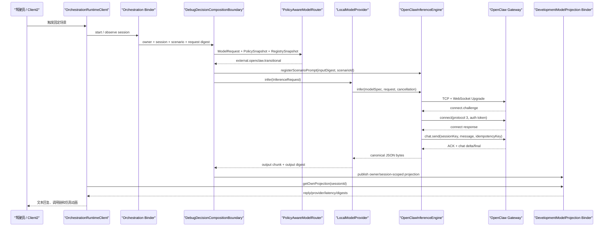

# Central Brain OpenClaw 接口代码详解

## 1. 文档目的

本文面向维护 Central Brain Android 13 工程的开发人员，逐层说明 APK 如何访问目标 OpenClaw、代码中的
接口约束、数据结构、调用顺序、失败处理和 UI 投影路径。本文描述当前仓库实现，不把历史验证或 UI 动画
解释为量产资格、直接 NPU 访问或真实车辆控制。

适用阶段：`P7-R3-OC2`。

Req IDs：`S2-MDL-001`、`S2-MDL-002`、`S2-SAF-001`、`S2-OBS-001/002`、
`XSC-001/005/006`、`DEL-001/003/004/005`。

相关状态：

- `openclaw_target_integration_implemented=true`
- `openclaw_target_android13_arm64_verified=true`：历史成功证据，日期为 2026-07-19
- `latest_target_connectivity_verified=false`：2026-07-20 复测时 TCP 18789 拒绝连接
- `release_routing_enabled=false`
- `model_action_authority=false`
- `direct_npu_accessed=false`
- `vehicle_effect_hardware_accessed=false`
- `production_ready=false`
- `target_hardware_validated=false`

## 2. 两类地址的语义

目标设备对外给出的地址看起来像一个普通网页地址，但代码将它拆成两个用途：

| 用途 | URI 形态 | 使用方 | 代码行为 |
| --- | --- | --- | --- |
| 控制台页面 | `http://169.254.208.110:18789/chat?token=<固化凭据>` | 人工浏览器/诊断 | 仅由 `getControlUiUri()` 表达，推理代码不会向该路径发送 HTTP POST |
| 模型传输 | `ws://169.254.208.110:18789/` | Android Runtime | RFC6455 Upgrade 后执行 OpenClaw protocol v3 RPC |

凭据不放在 WebSocket URI 的 query、userinfo 或 HTTP header 中。运行时在收到 `connect.challenge` 后，将凭据
放入 `connect.params.auth.token`。因此，直接对 `/chat?token=...` 发 HTTP 请求不能替代当前模型调用代码。

入口实现：

- `central-brain/android-runtime/runtime-service/src/main/java/com/centralbrain/runtime/model/OpenClawEndpointConfig.java`
- `central-brain/android-runtime/runtime-service/src/debug/java/com/centralbrain/runtime/model/OpenClawInferenceEngine.java`

当前凭据按维护者指令固化在 `OpenClawEndpointConfig.TARGET_TOKEN`。本文不复制其明文；源码常量和机器合同
是唯一事实来源。该值会进入 Git、编译产物和已安装 APK，可被提取，不属于安全凭据存储。

## 3. 端到端调用关系



重要边界：Client2 不直接访问 OpenClaw。网络调用只能从 Runtime 的 debug 模型引擎发起；Client2 只消费经过
Runtime 校验的会话投影。

## 4. 源码模块映射

| 层级 | 文件或类型 | 责任 |
| --- | --- | --- |
| Build profile | `runtime-service/build.gradle.kts` | 将 Gradle 属性映射为 `BuildConfig`，确保 OpenClaw 与 WSL Ollama 路由互斥 |
| Endpoint | `OpenClawEndpointConfig` | 固定 host、port、路径、协议、凭据和容量/超时上限 |
| Prompt | `CockpitModelPrompt` | 固定场景语句、座舱上下文、动作白名单和必选动作 |
| Provider profile | `ModelProviderProfiles` | 声明 `OPENCLAW_GATEWAY`、`TARGET_INTEGRATION`、非硬件、非量产 |
| Provider registry | `ModelProviderRegistry` | 注册 provider，并只接受绑定健康源 `TARGET_OPENCLAW_RUNTIME` |
| Router | `PolicyAwareModelRouter` | 仅在 `TARGET_INTEGRATION` 模式选择 OpenClaw；不授予动作或 Effect 权限 |
| Provider lifecycle | `LocalModelProvider` | warmup、异步 infer、deadline/cancel、chunk、terminal、metrics |
| Protocol engine | `OpenClawInferenceEngine` | Prompt 注册、WebSocket v3、RPC、流式回复、严格输出校验、故障码 |
| Composition | `DebugDecisionCompositionBoundary` | Context/Trigger/Consent/Router/Provider 的集成入口 |
| Target probe | `OpenClawTargetIntegrationProbeActivity` | DUMP-protected 的端到端元数据探针 |
| Projection store | `DevelopmentModelProjectionStore` | 最多 16 条、进程内、owner 绑定、不落库 |
| Projection Binder | `ICentralBrainDevelopmentModelProjection` | debug-only AIDL，按 session 读取调用方自己的投影 |
| SDK client | `DevelopmentModelProjectionClient` | Binder 协议协商、死亡监听、投影合同复验 |
| Client2 bridge | `OrchestrationRuntimeClient` | 读取投影并交给 `CockpitHmiReducer`，不拥有模型网络接口 |
| Machine contract | `central_brain_android_openclaw_target_gateway_v1.json` | 固化 profile、协议、历史证据、最新复测和 false claims |
| Static gate | `check_central_brain_android_openclaw_target_gateway.sh` | 验证关键代码、合同和文档没有漂移 |

## 5. 构建期开关

### 5.1 Gradle 属性

`runtime-service/build.gradle.kts` 读取：

```kotlin
val targetOpenClaw = providers.gradleProperty("centralBrainTargetOpenClaw")
    .map { it.equals("true", ignoreCase = true) }
    .getOrElse(false)
```

当值为 `true` 时，debug 构建生成以下语义：

```text
MODEL_GATEWAY_PROFILE=target_openclaw_transitional
OPENCLAW_TARGET_ENDPOINT_CONFIGURED=true
OPENCLAW_TARGET_ROUTING_ENABLED=true
OPENCLAW_BASE_URL=ws://169.254.208.110:18789
OPENCLAW_PROTOCOL_VERSION=3
OLLAMA_DEVELOPMENT_ENABLED=false
```

不传该属性时，debug 构建选择 `development_wsl_ollama`。release 虽保留 endpoint 合同，但
`OPENCLAW_TARGET_ROUTING_ENABLED=false`，且协议引擎只存在于 `src/debug`，所以 release 不能执行该调用。

仓库脚本将环境变量转换为 Gradle 参数：

```bash
CENTRAL_BRAIN_TARGET_OPENCLAW=true tools/build_central_brain_android_runtime.sh
```

### 5.2 运行时一致性检查

`DebugDecisionCompositionBoundary.resolveNetworkMode()` 同时检查 profile、URI、协议、Ollama 开关和 OpenClaw
路由开关。任一字段不一致会抛出 `target OpenClaw build configuration is invalid`，不做隐式回退。

## 6. Endpoint 配置合同

`OpenClawEndpointConfig` 不接受构造参数，也不允许调用方覆盖地址。`targetProductionTransitional()` 每次创建并
验证固定配置。

| 字段 | 当前值 | 作用 |
| --- | ---: | --- |
| `TARGET_HOST` | `169.254.208.110` | 目标计算单元 link-local 地址 |
| `TARGET_PORT` | `18789` | TCP/WebSocket 监听端口 |
| `WEBSOCKET_PATH` | `/` | 模型协议 Upgrade 路径 |
| `CONTROL_UI_PATH` | `/chat` | 人工控制台路径，不用于模型 RPC |
| `PROTOCOL_VERSION` | `3` | connect 的最小/最大协议均固定为 3 |
| `CONNECT_TIMEOUT_MS` | `3000` | TCP connect 上限，并受请求总 deadline 截断 |
| `READ_TIMEOUT_MS` | `120000` | 单次 socket read 上限，并受请求总 deadline 截断 |
| `MAX_HANDSHAKE_BYTES` | `16384` | HTTP Upgrade header 上限 |
| `MAX_PREAUTH_FRAME_BYTES` | `65536` | 客户端发出 JSON frame 上限 |
| `MAX_FRAME_BYTES` | `1048576` | 服务端单条或拼接消息上限 |
| `MAX_REQUEST_BYTES` | `16384` | 模型 prompt UTF-8 上限 |
| `MAX_RESPONSE_BYTES` | `65536` | 最终模型文本 UTF-8 上限 |

`validate()` 还要求 WebSocket URI 没有 userinfo/query/fragment，控制台 URI 没有 fragment。由此禁止通过调用方输入
切换任意 endpoint。

Android manifest 声明 `android.permission.INTERNET`。`network_security_config.xml` 只为固定目标主机放行明文；
debug overlay 额外放行 `127.0.0.1`，用于 WSL Ollama。当前 OpenClaw 是 `ws://`，不是 TLS `wss://`。

## 7. Provider 注册和路由

### 7.1 Provider 描述

`ModelProviderProfiles.targetOpenClawTransitional()` 的关键属性是：

```text
providerId=external.openclaw.transitional
backendKind=OPENCLAW_GATEWAY
assurance=TARGET_INTEGRATION
fallbackClass=NEVER
hardwareBacked=false
productionEligible=false
```

`LocalModelProvider` 构造时再次断言 OpenClaw 只能使用 `TARGET_INTEGRATION` assurance，且必须保持
`FallbackClass.NEVER`、`hardwareBacked=false`、`productionEligible=false`。

### 7.2 健康状态和路由

`DebugDecisionCompositionBoundary.invokeModel()` 先用 `TARGET_OPENCLAW_RUNTIME` 发布有时效的健康报告，再构造：

```text
purpose=SCENARIO_REASONING
privacyClass=INTERNAL
requiredCapability=TEXT_GENERATION
fallbackPolicy=NO_FALLBACK
tokenBudget=128 input + 128 output, 256 total
latencyBudget=120000 ms
```

随后调用 `PolicyAwareModelRouter.decide()`。`TARGET_INTEGRATION` 模式优先且只允许目标集成可用的 OpenClaw
profile；route 必须满足：

- `DecisionCode.SELECTED`
- primary provider 是 `external.openclaw.transitional`
- `actionAuthorizationGranted=false`
- `effectDispatchRequested=false`

任何条件不满足都会失败关闭。`PRODUCTION` 路由没有把该 provider 当作候选量产实现。

## 8. Prompt 构造

### 8.1 注册与摘要绑定

调用 Provider 前，组合层执行：

```java
openClawEngine.registerScenarioPrompt(inputDigest, scenarioId);
```

`inputDigest` 必须是 64 位小写 SHA-256。引擎以 digest 为 key 保存最多 16 个待处理 prompt；同一 digest 重复注册
必须内容完全一致，否则拒绝。`infer()` 使用后立即从 map 删除，防止跨请求重用。

### 8.2 固定座舱上下文

`CockpitModelPrompt` 把模型角色固定为“汽车座舱 AIOS 场景规划器”，并明确：

- 服务驾驶员舒适、清醒和行车任务；
- 模型只提出候选动作；
- 模型不能授权 Safety 或 Effect；
- 模型不能声称车辆已经真实执行；
- 当前效果是 `UI_SIMULATION_ONLY`；
- 安全模式是 `INTERFACE_RESERVED`；
- 只允许返回一个 JSON 对象。

当前场景表：

| Scenario | 用户表达 | 固定上下文摘要 | 允许动作 | 必选动作 |
| --- | --- | --- | --- | --- |
| `scene.comfort.cold.v1` | 车里有点冷 | 驾驶席、模拟 17.0 C、设定 26.5 C | `hvac.warm_cabin`, `media.keep_playing` | `hvac.warm_cabin` |
| `scene.fatigue.assist.v1` | 我有些疲惫 | 驾驶席、模拟 fatigue 0.82 | `seat.recline`, `hvac.ventilate`, `media.pause`, `navigation.find_rest_area` | `seat.recline`, `hvac.ventilate` |

组合后的 prompt 再附加精确字段、reply 长度、动作数量和示例。模型必须输出：

```json
{
  "scenario_id": "scene.comfort.cold.v1",
  "reply": "正在为你调节座舱温度。",
  "actions": ["hvac.warm_cabin"]
}
```

## 9. OpenClawInferenceEngine 生命周期

### 9.1 `warmup(ModelSpec)`

这里不加载本地模型，只记录允许的 `ModelSpec`。后续 `infer()` 要求 model ID、version、artifact digest 与 warmup
完全一致。OpenClaw 当前使用 `central-intent-v0` / `openclaw-ws-v3`，artifact digest 由 endpoint URI 派生。

### 9.2 `infer(...)`

执行顺序：

1. 检查 engine 未关闭且已 warmup。
2. 按 `inputDigest` 取出并删除 prompt。
3. 在网络前检查 cancellation 和 deadline。
4. 构造并验证不超过 16 KiB 的 UTF-8 prompt。
5. 从 endpoint 读取固化凭据，并生成 session/idempotency 标识。
6. 调用 `SocketTransport.execute()`。
7. 检查返回协议仍为 v3。
8. 严格解析并 canonicalize 模型回复。
9. 更新计数、耗时和最后故障码，只记录元数据。

会话标识规则：

```text
sessionKey = agent:main:cougaros- + inputDigest 前 32 字符
idempotencyKey = UUID.nameUUIDFromBytes(requestId UTF-8)
```

因此同一个 `requestId` 会生成稳定 idempotency key；不同输入摘要使用不同 OpenClaw session。

## 10. WebSocket 传输实现

### 10.1 TCP 与 HTTP Upgrade

`SocketTransport` 使用标准 Java `Socket`，不依赖 vendor SDK、NDK 或第三方 WebSocket 客户端。连接后设置
`TCP_NODELAY` 和 bounded read timeout，然后发送 RFC6455 Upgrade：

```http
GET / HTTP/1.1
Host: 169.254.208.110:18789
Upgrade: websocket
Connection: Upgrade
Sec-WebSocket-Key: <16-byte-random-base64>
Sec-WebSocket-Version: 13
Origin: http://169.254.208.110:18789
```

客户端要求状态行以 `HTTP/1.1 101` 开头，并按 RFC6455 GUID 计算、校验
`Sec-WebSocket-Accept`。响应 header 超过 16 KiB、accept 不匹配或连接关闭均失败。

### 10.2 帧处理

- 客户端发出的 text/pong frame 总是设置 MASK，并使用 `SecureRandom` 生成 4 字节 mask。
- 服务端 frame 必须不带 MASK，RSV 位必须为 0。
- 支持 text、continuation、ping/pong、close；其他非 text 数据 frame 被忽略。
- control frame 必须 FIN 且不超过 125 bytes。
- text fragmentation 只接受首帧 opcode `0x1` 和后续 opcode `0x0`。
- 所有完整 JSON payload 使用严格 UTF-8 decoder；错误字节不做替换。
- 单帧或拼接消息不能超过 1 MiB。

## 11. OpenClaw protocol v3 状态机

### 11.1 Challenge

WebSocket 建立后，第一条有效协议消息必须是：

```json
{
  "type": "event",
  "event": "connect.challenge",
  "payload": {"nonce": "<non-empty>"}
}
```

当前客户端验证 nonce 非空，并把 challenge 作为 connect 顺序门；它不会基于 nonce 计算签名，也不会把 nonce
回传。这与当前 target gateway 的 token 认证行为一致，但不构成 challenge-response 密码证明。

### 11.2 `connect`

随后发送的结构等价于：

```json
{
  "type": "req",
  "id": "<random-uuid>",
  "method": "connect",
  "params": {
    "minProtocol": 3,
    "maxProtocol": 3,
    "client": {
      "id": "openclaw-control-ui",
      "version": "cougaros-target-integration",
      "platform": "android",
      "mode": "webchat"
    },
    "role": "operator",
    "scopes": ["operator.read", "operator.write"],
    "caps": [],
    "auth": {"token": "<固化凭据>"},
    "locale": "zh-CN",
    "userAgent": "CougarOS-Android/0.3"
  }
}
```

引擎忽略不匹配 request ID 的异步 frame，只接受对应的 `type=res`。返回必须 `ok=true`，且
`payload.protocol == 3`。

### 11.3 `chat.send`

认证成功后发送：

```json
{
  "type": "req",
  "id": "<random-uuid>",
  "method": "chat.send",
  "params": {
    "sessionKey": "agent:main:cougaros-<digest-prefix>",
    "message": "<完整座舱 prompt>",
    "deliver": false,
    "idempotencyKey": "<deterministic-uuid>"
  }
}
```

响应 ACK 必须 `ok=true`。若 `payload.runId` 存在，后续事件改为绑定该 run ID；否则使用 idempotency key
作为期望 run ID。

### 11.4 流式 `chat` 事件

只处理同时满足下列条件的事件：

- `type=event`
- `event=chat`
- `payload.sessionKey` 等于当前请求 session key
- `payload.runId` 为空或等于期望 run ID

`state=delta` 时，代码提取累计文本，并只接受长度不短于当前缓存的候选；`state=final` 时优先使用 final
message，否则使用累计 delta。只有 ACK 和非空终态文本都存在，调用才成功。`state=error` 立即失败。

### 11.5 `chat.history` 回退

若 final 已到但没有可用文本，或 final 早于 ACK，代码发送：

```json
{
  "type": "req",
  "id": "<random-uuid>",
  "method": "chat.history",
  "params": {
    "sessionKey": "<current-session>",
    "limit": 6
  }
}
```

返回消息必须为 1..6 条。代码从后向前找到 assistant 消息，再向前找到最近 user 消息；user 文本必须与本次
完整 prompt 逐字符一致，才能采用 assistant 文本。这样避免读取同一 session 中不属于当前请求的旧回复。

### 11.6 `chat.abort`

进入 chat 阶段后若发生 RuntimeException 或 IOException，会 best-effort 发送 `chat.abort(sessionKey, runId)`。
abort 自身失败不会覆盖原始失败。

## 12. 模型回复校验

`parseAndValidate()` 只接受 UTF-8 JSON object，并要求 key 集合精确等于：

```text
scenario_id, reply, actions
```

校验规则：

| 字段 | 规则 |
| --- | --- |
| `scenario_id` | 必须等于当前已注册场景 |
| `reply` | trim 后 1..256 字符，不允许 ISO control character |
| `actions` | 1..4 个字符串，不重复，只能来自当前场景 allowlist |
| required actions | Cold 必须有 HVAC；Fatigue 必须同时有 Seat 和 HVAC |
| unknown field | 任何额外 key 均拒绝 |
| response bytes | 1..65536 bytes |

通过后重新构造 canonical JSON，不直接透传原始字符串。组合层的 `parseModelProjection()` 会再次检查 scenario、
reply、latency 和 action admission，形成第二道边界。

模型的 `actions` 是候选动作，不是 Effect 命令。它不能绕过 Scenario Catalog、Consent、Safety、固定 Plan 或
adapter/readback。当前 HVAC/Seat 变化均为 debug UI 仿真。

## 13. 回复到 Client2 的 Binder 路径

### 13.1 发布

`DebugSimulatedOrchestrationBackend` 在组合结果完成后调用 `DevelopmentModelProjectionStore.publish()`。投影字段为：

```text
schemaVersion
sessionId
scenarioId
providerId
assistantDisplayText
latencyMs
outputDigest
projectionDigest
completedAtEpochMs
```

Store 最多保存 16 条，满载时删除最旧项；数据只在 Runtime 进程内存中，不写 Room，也不进入冻结的
`OrchestrationSnapshot` V1。

### 13.2 AIDL

debug SDK 定义：

```aidl
interface ICentralBrainDevelopmentModelProjection {
    int getProtocolVersion();
    String getProtocolHash();
    DevelopmentModelProjection getOwnProjection(String sessionId);
}
```

Service 受 `com.centralbrain.permission.BIND_RUNTIME` signature permission 保护，并在方法内做 caller identity、
capability 和 session owner 校验。调用方只能读取自己的 session；找不到或 owner 不匹配时不会泄露他人数据。

`DevelopmentModelProjectionClient` bind 后检查 AIDL version/hash，注册 Binder death recipient，并在返回后再次执行
字段、digest 和 session 一致性校验。

### 13.3 Client2 消费

`apk-labs/client2-central-brain/bridge/src/com/centralbrain/client2/OrchestrationRuntimeClient.java` 在场景 snapshot
完成时调用 `getOwnProjection(sessionId)`，并检查 projection scenario 与 orchestration snapshot 一致。合法结果只把：

- `assistantDisplayText`
- `providerId`
- `latencyMs`
- `modelProjection != null`

送入 `CockpitSimulatedScenarioState.Projection`。Binder 未连接、RemoteException 或合同错误都会得到空投影并记录
固定原因，不让 Client2 自行回退为未经校验的网络模型调用。

## 14. 超时、取消和失败码

模型请求总 deadline 为 120 秒。TCP connect、socket read 和每个协议等待都被剩余总 deadline 截断。

`OpenClawInferenceEngine.safeFailureCode()` 输出：

| Failure code | 典型来源 |
| --- | --- |
| `CREDENTIAL_UNAVAILABLE` | 凭据为空、越界或 credential source 失败 |
| `HANDSHAKE_REJECTED` | HTTP Upgrade 或 `Sec-WebSocket-Accept` 错误 |
| `PROTOCOL_REJECTED` | challenge/protocol 版本不满足 |
| `AUTHENTICATION_REJECTED` | connect response `ok=false` 或 AUTH 错误 |
| `DEADLINE_EXCEEDED` | TCP/read/总 deadline 超时 |
| `CANCELLED` | 网络前取消或 chat abort/cancel 语义 |
| `SCENARIO_BINDING_REJECTED` | 回复场景与请求不一致 |
| `REPLY_BOUNDS_REJECTED` | reply 为空、超长或含控制字符 |
| `ACTION_ALLOWLIST_REJECTED` | action 未授权、重复或缺少必选动作 |
| `STRUCTURED_OUTPUT_REJECTED` | JSON shape 或通用结构合同错误 |
| `TRANSPORT_FAILURE` | ConnectException、EOF 或其他 IOException |
| `INTERNAL_GATEWAY_FAILURE` | 未归类的内部错误 |

2026-07-20 的 `Connection refused` 发生于 TCP connect，所以不会到达 WebSocket、token 或模型阶段；engine 的权威
分类是 `TRANSPORT_FAILURE`。`OpenClawTargetIntegrationProbeActivity` 使用更粗粒度的二次分类，某些组合层错误可能
折叠成 `MODEL_OUTPUT_REJECTED`；定位时应优先查看 `CentralBrainOpenClaw` 的 engine metadata 和合同中的
`latest_target_retest`，不能仅依赖 probe 汇总码。

## 15. 日志和可观测性

成功路径输出固定阶段标记：

```text
socket_connected
websocket_handshake_complete
connect_challenge_received
connect_authenticated
chat_sent
chat_acknowledged
chat_final_received
history_received              # 仅回退时
```

完成日志包含 profile、protocol、latency、response byte count、history fallback、network/external compute 布尔值。
失败日志包含固定 failure code。所有路径持续声明：

```text
raw_prompt_logged=false
raw_response_logged=false
credential_logged=false
direct_npu_accessed=false
vehicle_effect_dispatch_authorized=false
```

`Snapshot` 仅暴露 invocation/completed/failure/history-fallback 计数、pending 数、最后耗时和最后故障码，不保存
prompt、模型原文或凭据。

## 16. 探针、测试和校验

### 16.1 JVM 测试

`OpenClawEndpointConfigTest` 验证固定 URI、协议、容量界限和不可注入字段。

`OpenClawInferenceEngineTest` 用可替换 `Transport` 和 `CredentialSource` 验证：

- 固定 v3 endpoint 和稳定 session/idempotency；
- prompt 含汽车座舱、驾驶员、UI 仿真和动作约束；
- Cold/Fatigue 回复 canonicalization；
- unknown field、未授权动作和缺少必选动作失败关闭；
- credential/protocol mismatch 计入失败；
- 原始 prompt 不含 token。

Provider、Registry 和 Router 另有测试验证 target profile 不能获得 production/hardware authority。

### 16.2 Android target probe

`OpenClawTargetIntegrationProbeActivity` 仅在 debug manifest 中声明，并受 `android.permission.DUMP` 保护。它固定执行
Cold 场景，检查 provider ID、reply 长度、latency、network marker、Android API 33 和 arm64 ABI，然后立即结束。
探针不记录模型输入、模型回复或凭据。

### 16.3 仓库检查

```bash
bash tools/check_central_brain_android_openclaw_target_gateway.sh
bash tools/check_central_brain_root_readme.sh
bash tools/check_central_brain_github_repository_completeness.sh
CENTRAL_BRAIN_TARGET_OPENCLAW=true tools/build_central_brain_android_runtime.sh
```

机器合同位于：
`central-brain/contracts/central_brain_android_openclaw_target_gateway_v1.json`。

## 17. 调试判定顺序

出现超时时，按层定位：

1. **TCP**：确认 Android 到 `169.254.208.110` 路由可达，且 18789 正在监听。`Connection refused` 表示主机返回
   RST，不是 token 错误。
2. **Upgrade**：检查是否出现 `websocket_handshake_complete`。没有则检查 `/`、HTTP 101 和 accept header。
3. **Challenge**：检查 `connect_challenge_received`。没有则服务并非当前协议端点或服务端未发送 v3 challenge。
4. **Auth**：检查 `connect_authenticated`。到此失败才需要检查 token、role、scope 和协议版本。
5. **Chat ACK**：检查 `chat_acknowledged`。没有则查看 `chat.send` RPC 错误码。
6. **Terminal**：检查 `chat_final_received` 或 `history_received`。ACK 后无终态通常是服务端 run/session 问题。
7. **Schema**：网络完整但 UI 无回复时，查看 engine failure code 是否为 scenario/reply/action/structured rejection。
8. **Binder**：模型成功但 Client2 无文本时，检查 projection service 连接、same-signer、owner/session 和 AIDL hash。

## 18. 修改指南

### 18.1 OpenClaw endpoint 或协议变化

必须同步修改并验证：

1. `OpenClawEndpointConfig`
2. `runtime-service/build.gradle.kts`
3. `DebugDecisionCompositionBoundary.resolveNetworkMode()`
4. `OpenClawTargetIntegrationProbeActivity.requireTargetBuild()`
5. endpoint/engine JVM tests
6. `central_brain_android_openclaw_target_gateway_v1.json`
7. `check_central_brain_android_openclaw_target_gateway.sh`
8. 架构偏差、问题台账、路线图和 README 状态

不要只修改 BuildConfig 字符串；当前代码故意在多个边界交叉断言固定 profile。

### 18.2 新增座舱场景

必须先在 Scenario Catalog/Plan 中建立正式场景和固定 Effect 能力，再扩展 `CockpitModelPrompt.forScenario()` 的
utterance/context/allowed/required action，并增加 engine、composition、Client2 reducer 和 UI 测试。不能只在 prompt
中增加动作字符串，因为模型没有创建新 Effect 能力的权限。

### 18.3 后续迁移到 Ollama

保持以下上层接口不变：

- `ModelContractV2.ModelRequest`
- `ModelProvider` / `LocalModelProvider`
- `PolicyAwareModelRouter`
- `CockpitModelPrompt`
- canonical `scenario_id/reply/actions`
- `DevelopmentModelProjection` 和 Client2 消费逻辑

替换 target provider profile、transport、health/version、artifact identity 和 credential owner。完成 TLS、可轮换凭据、
release source set、资源管理与目标 NPU 证据前，不得把 OpenClaw target profile 直接重命名为 production provider。

## 19. 当前未实现和挂起项

以下内容不是当前代码能力：

- OpenAI-compatible HTTP/REST fallback；
- TLS/WSS 和服务端证书校验；
- 可轮换或硬件保护的凭据；
- Gateway 独立 health/version API；
- release source set 的 OpenClaw inference engine；
- 量产模型 artifact/签名 owner；
- 直接 NPU runtime、PCIe、vendor SDK 调用；
- VHAL/CAN/车辆 Service 写入与真实 readback；
- 模型直接授权 Safety/Effect；
- 生产资格和目标硬件验收。

这些项分别由 `DEV-122/124` 和 `ISSUE-024/044/054` 跟踪。当前文档只解释已有软件接口，不提升任何
`production_ready` 或 `target_hardware_validated` 状态。

## 20. P7-R4-OCDEV 开发环境补充

当前 debug 默认路径不再直接调用 Ollama HTTP，而是由真实 Android 13 Runtime 经 ADB reverse 调用 WSL OpenClaw v4，
再由 OpenClaw 调用 Ollama。`OpenClawEndpointConfig` 同时持有两个不可覆盖的协议 profile：开发 profile 为
`127.0.0.1:18789/v4`，目标过渡 profile 为 `169.254.208.110:18789/v3`。

开发 v4 的 `connect` 使用 `gateway-client/backend`、`operator.read/write` 和 shared token，WebSocket upgrade 不发送
浏览器 Origin。原因是 OpenClaw 2026.7.1 会清除无设备密钥 UI client 的 write scope；Android Runtime 在此链路承担
模型后端桥接，不是控制页。目标 v3 分支继续保留既有 `openclaw-control-ui/webchat` 和 Origin 行为。

真机调用顺序为：`socket_connected -> websocket_handshake_complete -> connect_challenge_received ->
connect_authenticated -> chat_sent -> chat_acknowledged -> chat_final_received`。2026-07-22 API 33 ARM64 的真实
Ollama 终态模型延迟为 31968 ms。完整操作和边界见 `CENTRAL_BRAIN_OPENCLAW_DEVELOPMENT_GATEWAY.md`。

该结果保持 `ethernet_validated=false`、`direct_npu_accessed=false`、`production_ready=false`、
`target_hardware_validated=false`；tracking `DEV-126/ISSUE-024/054`，stage `P7-R4-OCDEV`。
