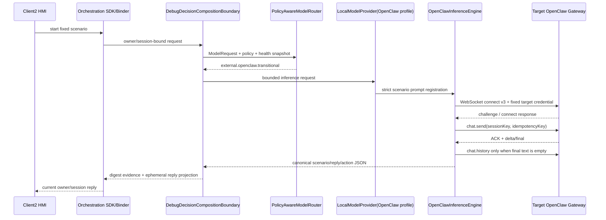

# Central Brain OpenClaw Target Gateway

## 1. Scope and status

This document defines the transitional model path for the current Android 13 target. The compute base currently exposes
OpenClaw rather than Ollama, so `P7-R3-OC2` implements a fixed OpenClaw WebSocket v3 provider while preserving the
`ModelProvider` abstraction. It is a controlled target-integration build, not a production-qualified release.

Req IDs: `S2-MDL-001`, `S2-SAF-001`, `S2-OBS-001`, `XSC-001/005/006`, `DEL-001/003/004/005`.

Current claims:

- `openclaw_target_integration_implemented=true`
- `openclaw_target_android13_arm64_verified=true`
- `client2_openclaw_projection_verified=true`
- `external_compute_accessed=true`
- `direct_npu_accessed=false`
- `vehicle_effect_hardware_accessed=false`
- `fixed_target_credential_active=true`
- `latest_target_connectivity_verified=false`
- `production_provider_qualified=false`
- `production_ready=false`
- `target_hardware_validated=false`

面向软件工程师的逐文件代码、RPC JSON、WebSocket 帧、Binder 投影和故障定位说明见
`docs/CENTRAL_BRAIN_OPENCLAW_INTERFACE_CODE_GUIDE.md`。

## 2. Runtime call graph



The model output is a proposal. Scenario Catalog, Policy, Safety and Effect layers retain action authority. The current
target build never dispatches a real vehicle effect.

## 3. Software modules

| Module | Source | Responsibility |
| --- | --- | --- |
| Fixed endpoint | `OpenClawEndpointConfig` | Locks host, port, WebSocket path, full control-UI URL, target token, protocol and frame/time bounds |
| Provider profile | `ModelProviderProfiles.targetOpenClawTransitional()` | Declares `OPENCLAW_GATEWAY` and `TARGET_INTEGRATION`; explicitly non-production and non-hardware |
| Registry | `ModelProviderRegistry` | Publishes the fixed provider descriptor and accepts health only from `TARGET_OPENCLAW_RUNTIME` |
| Router | `PolicyAwareModelRouter` | Selects OpenClaw only in `TARGET_INTEGRATION`; production mode still requires a qualified production provider |
| Protocol engine | `OpenClawInferenceEngine` | RFC6455 client, v3 challenge/auth, send/abort/history, bounds, strict UTF-8/JSON and action allowlist |
| Composition | `DebugDecisionCompositionBoundary` | Connects Context, Trigger, Consent, Router, Provider and Event evidence; exposes reply only through debug projection |
| Target probe | `OpenClawTargetIntegrationProbeActivity` | Executes the complete target model chain and emits metadata-only evidence |
| Reply projection | `ICentralBrainDevelopmentModelProjection` | Owner/session-scoped, debug-only, non-durable reply access for Client2 |
| Client UI | `OrchestrationRuntimeClient` and `CockpitHmiReducer` | Reads the validated projection and renders it; does not call OpenClaw directly |

## 4. Protocol contract

The supplied browser location, including its query token, is fixed in `OpenClawEndpointConfig`. It is a control UI, not
the model REST endpoint. The runtime connects to the fixed WebSocket root, reads the same fixed token from the endpoint
profile, and implements protocol v3:

1. Receive `connect.challenge` and require a non-empty nonce.
2. Send `connect` with protocol 3, `openclaw-control-ui`, `webchat`, operator read/write scopes and the runtime credential.
3. Require a successful response and exact protocol match.
4. Send `chat.send` with a digest-derived session key and UUID idempotency key.
5. Accept only events bound to the expected session and run.
6. Prefer terminal/delta text. If terminal text is empty, use bounded `chat.history` and require the preceding user message
   to match the current generated request exactly.
7. Send best-effort `chat.abort` on a terminal transport/protocol failure.

The target did not expose the optional OpenAI-compatible HTTP API during this integration, so no REST fallback is
implemented. Redirects, arbitrary hosts and caller-provided URLs are prohibited.

## 5. Structured output and authority

The engine accepts exactly `scenario_id`, `reply` and `actions`. Reply length is 1..256 characters. Actions are unique,
bounded to four, and must belong to the scenario allowlist. Cold and fatigue are the only registered scenarios. Unknown
fields, malformed UTF-8, scenario mismatches, duplicate/unknown actions and protocol mismatches fail closed.

Model actions never become Effect commands directly. Existing Scenario Plan, consent, driver-safety and adapter gates
remain authoritative. Target validation therefore proves external model use, not vehicle control or direct NPU access.

## 6. Build, install and use

Build the target profile and Client2 with the same configured debug signer:

```bash
cd /home/normad400/appDev
CENTRAL_BRAIN_TARGET_OPENCLAW=true tools/build_client2_central_brain_demo.sh
```

Install the Runtime and Client2 APKs. Use the existing signer-migration option only when replacement of the installed
Client2 was explicitly approved:

```bash
adb install -r central-brain/android-runtime/runtime-service/build/outputs/apk/debug/runtime-service-debug.apk
tools/install_client2_central_brain_demo.sh --replace-conflicting-client2
```

No credential provisioning step is required in `P7-R3-OC2`; the maintainer explicitly required the target URL and token
to be compiled into the controlled target build. Launch Client2, open the Central Brain panel and select a fixed scenario.
A successful call displays the model reply and records only safe protocol/provider/latency markers.

## 7. Verification

Repository verification:

```bash
bash tools/check_central_brain_android_openclaw_target_gateway.sh
CENTRAL_BRAIN_TARGET_OPENCLAW=true tools/build_central_brain_android_runtime.sh
```

The 2026-07-19 Android 13 ARM64 run verified fixed-host reachability, WebSocket upgrade, v3 challenge/authentication,
`chat.send` ACK, strict terminal response, Runtime probe and Client2 projection. The two recorded bounded samples were
19,923 ms for the isolated Runtime probe and 7,066 ms for the Client2 cold scenario. Raw prompt, reply and credential were
not captured as evidence.

The 2026-07-20 retest reached the host over ICMP from the Android target, but TCP port 18789 returned
`Connection refused`. Authentication and protocol validation were therefore not reached. This is tracked as an external
OpenClaw service-listener blocker and does not invalidate the earlier successful protocol evidence.

## 8. Security and migration boundary

Current transport is cleartext WebSocket on a dedicated link-local address. Per maintainer directive, the target token is
now a source/APK constant and is therefore extractable from Git history and the installed APK. This is an accepted
closed-test-only deviation (`DEV-124`), not release credential management. It must be replaced before any production
qualification; no security implementation is added by this change.

The next Ollama migration keeps `ModelProvider`, `ModelRequest`, structured output and Client2 projection unchanged. It
replaces only the target profile/transport, after the target exposes the approved Ollama endpoint, model artifact identity,
health/version API, encrypted/authenticated transport and owner-approved credential source.
