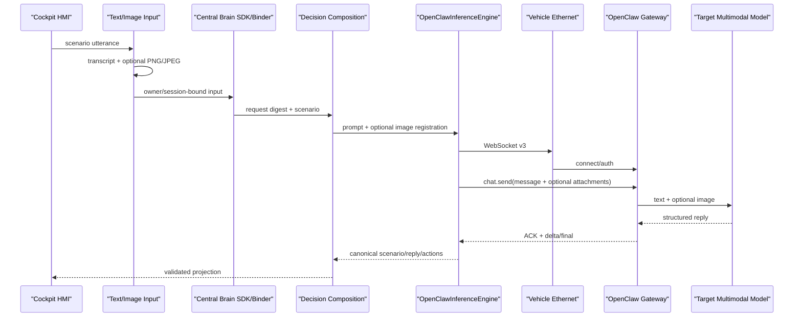

# Central Brain OpenClaw Target Gateway

## 1. Scope

This document defines the production-network topology used by the Android 13 cockpit controller to access the external
OpenClaw compute unit over in-vehicle Ethernet:

```text
Android Runtime -> Ethernet -> ws://169.254.208.110:18789/ -> OpenClaw -> target model
```

The current software profile is `target_openclaw_transitional / TARGET_INTEGRATION`. It defines the target interface but
is not a production-qualified release provider.

Req IDs: `S2-MDL-001/002`, `S2-SAF-001`, `S2-OBS-001/002`,
`XSC-001/005/006`, `DEL-001/003/004/005`.

Current claims:

- `openclaw_target_integration_implemented=true`
- `target_multimodal_protocol_implemented=true`
- `target_multimodal_frontend_bound=true`
- `target_multimodal_verified=true`
- `target_ipv4_configuration_persistent=false`
- `release_routing_enabled=false`
- `direct_npu_accessed=false`
- `vehicle_effect_hardware_accessed=false`
- `production_provider_qualified=false`
- `production_ready=false`
- `target_hardware_validated=false`

Detailed Java, WebSocket, RPC, text/image and failure semantics are defined in
`docs/CENTRAL_BRAIN_OPENCLAW_INTERFACE_CODE_GUIDE.md`.

## 2. Fixed target endpoint

| Purpose | URI | Runtime behavior |
| --- | --- | --- |
| Control page | `http://169.254.208.110:18789/chat?token=<source constant>` | Human-facing page only |
| Model RPC | `ws://169.254.208.110:18789/` | RFC6455 + OpenClaw protocol v3 |

`OpenClawEndpointConfig.targetProductionTransitional()` owns the host, port, paths, protocol and credential.
Callers cannot override them. The model engine sends the credential in `connect.params.auth.token`, not in the
WebSocket URI.

## 3. Runtime call graph



Client2 never opens the OpenClaw connection directly.

## 4. Text and image contract

Text is carried in:

```text
chat.send.params.message
```

The current voice-facing architecture sends speech-to-text output, not raw audio bytes.

An optional image is carried in the same `chat.send`:

```json
{
  "attachments": [
    {
      "type": "image",
      "mimeType": "image/jpeg",
      "fileName": "cabin-frame.jpg",
      "content": "<base64 image bytes>"
    }
  ]
}
```

Image constraints:

- one image per request;
- `image/png` or `image/jpeg`;
- maximum 6 MiB;
- maximum 12 MiB pending image memory;
- safe 1..96-character filename;
- MIME/signature agreement;
- SHA-256 calculated before transport;
- same digest key as the scenario prompt;
- no raw image or Base64 in logs.

The complete multimodal request is:

```json
{
  "type": "req",
  "id": "<uuid>",
  "method": "chat.send",
  "params": {
    "sessionKey": "agent:main:cougaros-<digest-prefix>",
    "message": "<cockpit prompt and transcript>",
    "deliver": false,
    "idempotencyKey": "<uuid>",
    "attachments": [
      {
        "type": "image",
        "mimeType": "image/png",
        "fileName": "cabin-frame.png",
        "content": "<base64 image bytes>"
      }
    ]
  }
}
```

Only an authenticated image-bearing `chat.send` may use the 8.5 MB outbound frame limit. Connect and other RPCs remain
bounded to 64 KiB.

## 5. Protocol state machine

1. Establish TCP to `169.254.208.110:18789`.
2. Perform RFC6455 Upgrade on `/` with the fixed target Origin.
3. Receive a non-empty `connect.challenge`.
4. Send `connect` with protocol 3, target client identity, operator read/write scopes and the fixed credential.
5. Require `ok=true` and `payload.protocol=3`.
6. Send text-only or text+image `chat.send`.
7. Bind ACK and chat events to session/run/idempotency.
8. Consume delta/final text.
9. Use bounded history only when final text is empty.
10. Send best-effort `chat.abort` on terminal transport/protocol failure.

The runtime does not implement REST fallback or arbitrary endpoint redirects.

## 6. Structured output and authority

The engine accepts exactly:

```text
scenario_id, reply, actions
```

The scenario must match, reply is bounded to 256 characters, and actions must be unique and belong to the scenario
allowlist. Unknown fields, malformed UTF-8, untrusted actions and protocol mismatches fail closed.

Text/image model output remains a proposal. It cannot authorize Safety, Plan or Effect execution and cannot write
Vehicle, VHAL or CAN interfaces.

## 7. Target build profile

```bash
CENTRAL_BRAIN_TARGET_OPENCLAW=true \
  tools/build_central_brain_android_runtime.sh
```

Expected build-owned values:

```text
MODEL_GATEWAY_PROFILE=target_openclaw_transitional
OPENCLAW_TARGET_ROUTING_ENABLED=true
OPENCLAW_BASE_URL=ws://169.254.208.110:18789
OPENCLAW_PROTOCOL_VERSION=3
```

The current engine remains in the integration source set and release routing remains disabled. The endpoint contract
therefore describes the production network, while release qualification remains open.

## 8. Verification state

Historical Android 13 ARM64 evidence verifies target text-only WebSocket, challenge/auth, `chat.send` ACK, structured
terminal response and Client2 projection.

The current target multimodal state is:

- image attachment implementation: complete;
- text+image RPC shape: complete;
- target frontend camera/transcript Binder: open (`ISSUE-055`);
- target Ethernet text+image terminal evidence: open;
- target model/NPU qualification: open;
- production media retention policy: open.

The latest tracked target retest did not reach protocol validation because the target service port was not listening.
That service availability issue remains `ISSUE-054`.

## 9. Security and lifecycle boundary

The current target transport is cleartext WebSocket. The target credential is a source/APK constant and is extractable.
This is an accepted closed-target integration deviation, not production credential management.

Images may be held in Runtime memory and may be persisted by OpenClaw managed media behavior. Before production
qualification, owners must define:

- image memory zeroization;
- server-side retention and deletion;
- aggregate transcript/image digest;
- history fallback attachment binding;
- access logging and incident evidence;
- TLS and credential rotation.

## 10. Validation

Repository checks:

```bash
bash tools/check_central_brain_android_openclaw_target_gateway.sh
CENTRAL_BRAIN_TARGET_OPENCLAW=true \
  tools/build_central_brain_android_runtime.sh
```

The machine-readable target contract is:

```text
central-brain/contracts/central_brain_android_openclaw_target_gateway_v1.json
```
