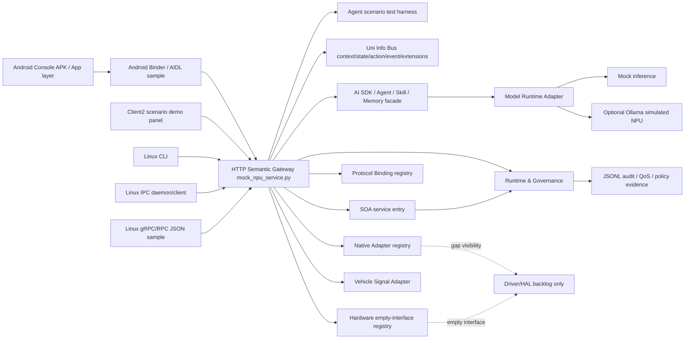
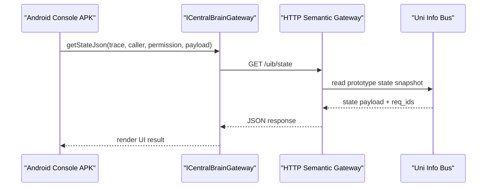
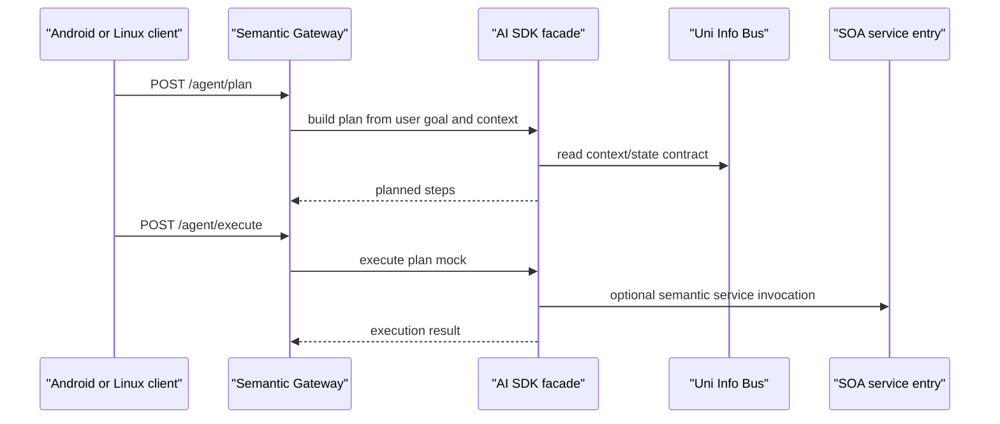
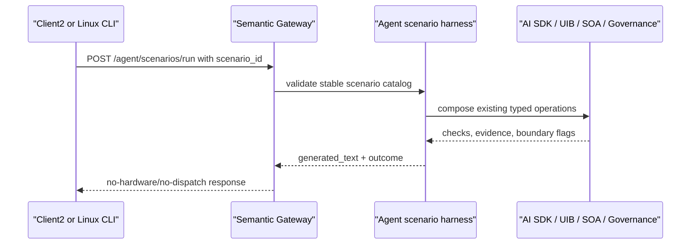
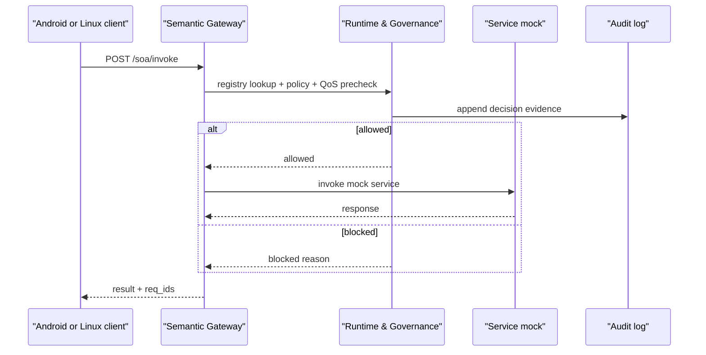
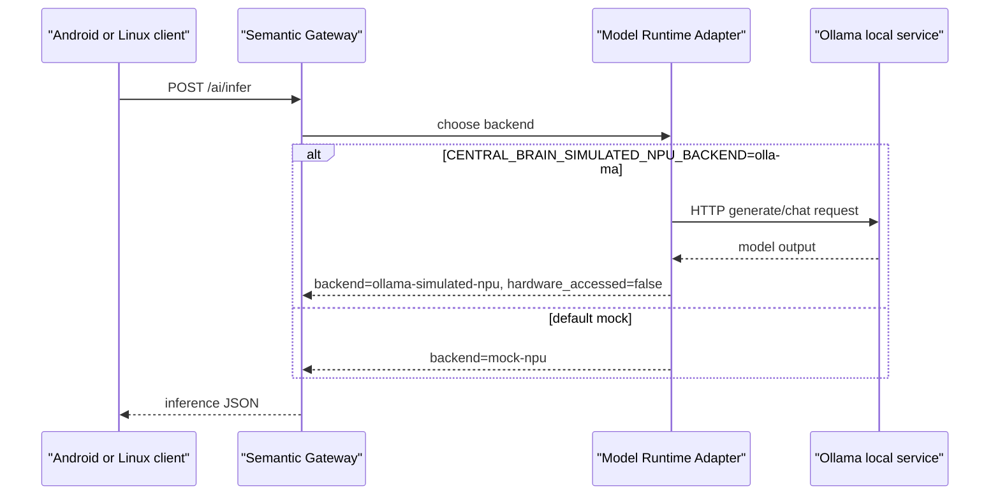
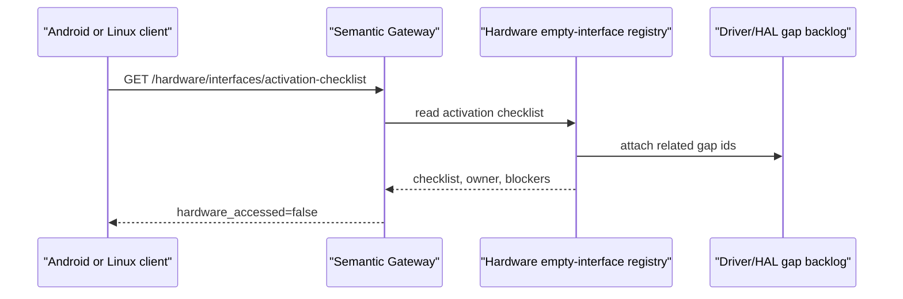

# Central Brain Python 原型模块、接口与关系说明

版本：0.2
日期：2026-07-11
基线：`central-brain/contracts/central_brain_api.json` 版本 `0.1.108`

## 1. 目的和范围

本文回答三个问题：

- 原型中有哪些模块。
- 每个模块对外暴露哪些接口。
- 这些模块之间如何调用、约束和同步交付。

本文面向 Android 和 Linux 座舱域软件工程师。Android 是主路径，Linux 是同步交付路径。黄色小太阳组件必须保持跨 SoC、跨 Android/Linux 的 contract 一致性。

本文只描述当前 Python 原型和配套 Android/Linux 绑定样例，不声明量产完成状态。

面向参与者的单图入口见 `CENTRAL_BRAIN_MODULE_USE_CASE_DIAGRAM.md`，该图把 Android/Linux 用例、核心模块调用和硬件空接口边界放在同一视图中。

## 2. 需求边界

相关 Req ID：

| 需求域 | Req ID | 当前原型覆盖方式 |
| --- | --- | --- |
| AI SDK 应用门面 | XSC-001, APP-004, FW-U-006 | `/ai/sdk/capabilities`、`/ai/infer`、Agent Plan/Execute、Skill、Memory mock |
| Uni Info Bus | XSC-002, FW-U-003, FW-U-004, FW-U-008 | context/state/action/event/extensions REST、Android Binder、Linux CLI/IPC/gRPC 映射 |
| SOA 服务入口 | XSC-003 | service catalog、contract 查询、`/soa/invoke` 语义入口 |
| AIOS Kernel / Native Adapter | XSC-004 | native adapter registry、Driver/HAL gap、hardware empty-interface registry |
| Runtime & Governance | XSC-005 | registry、policy、lifecycle、QoS、audit、deployment/migration contract |
| Protocol Binding | XSC-006, NV-P-002, NV-P-003, NV-P-006 | REST active prototype、Android Binder/AIDL sample、Linux IPC sample、Linux gRPC/RPC JSON sample、MQTT/SOME-IP/DDS planned |
| Model Runtime Adapter | NV-F-011 | mock NPU inference 和可选 `ollama-simulated-npu` 用户态仿真后端 |
| Vehicle Signal Adapter | NV-F-003, NV-F-004, NV-F-005 | VSS-style catalog、activation、validation 只读门禁 |
| Driver/HAL 可见性 | KH-003, KH-006, DEL-005 | interface support matrix、gap backlog、owner decision/evidence/approval contract-only 链 |
| Android/Linux 交付 | DEL-001..005 | Android 主路径 + Linux 同步路径 + docs/smoke/check scripts |

固定边界：

- 不开发虚拟机或虚拟化 runtime。
- 不访问真实 PCIe NPU、camera、audio、vehicle bus、DDS、TSN、shared memory 或 safety runtime。
- Driver/HAL 只在当前 Android/Linux 环境不能满足接口时记录缺口，不在本原型里默认新增驱动开发量。
- Event subscription、hardware activation、adapter-load approval 等长链路是 contract-only 门禁，不启动 broker、不关闭 gate、不加载 adapter、不激活硬件。
- Ollama 仅作为仿真 NPU 内模型执行环境，固定 `hardware_accessed=false`，不关闭 DRV-GAP-001。

## 3. 总体拓扑



调用规则：

1. Android App、Linux CLI、Linux IPC、Linux gRPC/RPC 都不直接访问 NPU、Driver/HAL 或 vendor SDK。
2. 所有上层请求先进入 semantic gateway，再进入 Uni Info Bus、AI SDK、SOA 或 governance 模块。
3. SOA 调用必须经过 Runtime & Governance 的 service registry、policy、QoS 和 audit 约束。
4. Model Runtime Adapter 可以走 mock 推理，也可以在配置开启时走 Ollama simulated NPU。
5. Native Adapter 和 Hardware Interface 当前只暴露接口能力、缺口和激活门禁，不触发真实硬件访问。

## 4. 模块清单

| 模块 | 代码/交付物 | 主要 Req ID | 职责 | Android 主路径 | Linux 同步路径 | 当前状态 |
| --- | --- | --- | --- | --- | --- | --- |
| Android Console APK | `central-brain/android-console/` | DEL-001, XSC-001..006 | 给座舱工程师提供可点击调试入口 | Activity 调 Binder service sample | 不适用 | active sample，非 privileged/system service |
| Client2 Agent 场景面板 | `apk-labs/client2-central-brain/` | APP-004, XSC-001..006, DEL-001 | 在原车模上叠加 12 场景 Android 演示入口 | 临时 HTTP `/agent/scenarios/run` | 不适用 | active demo，DEV-017；非正式 Binder/SDK 路径 |
| Android Binder/AIDL Binding | `central-brain/bindings/android/aidl/com/centralbrain/binding/ICentralBrainGateway.aidl` | XSC-006, DEL-001 | 将 REST contract 映射为 Binder JSON 方法 | `getStateJson`、`invokeServiceJson`、`planAgentTaskJson` 等 | 不适用 | active sample，上游仍代理 REST prototype |
| Linux CLI | `central-brain/linux-cli/central_brain_cli.py` | DEL-002, XSC-002..006 | Linux 调试和验收入口 | 不适用 | CLI 命令调用 REST | active sample |
| Linux IPC Binding | `central-brain/bindings/linux/ipc/` | NV-P-002, DEL-002 | Unix socket 进程间 contract shape | 不适用 | daemon/client operation name 映射 | active sample，非量产 broker |
| Linux gRPC/RPC Binding | `central-brain/bindings/linux/grpc/`, `central-brain/bindings/linux/proto/central_brain_gateway.proto` | NV-P-003, DEL-002 | gRPC/RPC contract shape | 不适用 | JSON TCP wrapper + proto 契约 | active sample，环境无 `grpcio` 时使用 JSON wrapper |
| HTTP Semantic Gateway | `central-brain/backend/mock_npu_service.py` | XSC-001..006 | 原型主服务，承载全部 REST route | Binder service 代理到此 | CLI/IPC/gRPC 代理到此 | active prototype |
| AI SDK / Agent / Skill / Memory | `central-brain/backend/ai_sdk.py` | XSC-001, APP-004, FW-U-006 | 应用层 AI 能力门面、任务规划、任务执行、技能和记忆 mock | Binder AI/Agent/Skill/Memory 方法 | CLI/IPC/gRPC 对应命令 | active mock contract |
| Agent Scenario Test Harness | `central-brain/backend/agent_scenarios.py` | APP-004, XSC-001..006, FW-U-004, FW-U-006, FW-U-007 | 把已有接口组合成 12 个可重复验收场景，不引入新架构层 | Client2 `/agent/scenarios/run` | CLI `agent-scenarios`、`agent-scenario-home` | active test orchestrator，独立实现且不声明产品兼容 |
| Uni Info Bus | gateway route + `central-brain/backend/vehicle_signals.py` 部分联动 | XSC-002, FW-U-003, FW-U-004, FW-U-008 | context、state、action、event、extension、signal gate 语义总线 | Binder UIB 方法和 Console 按钮 | CLI/IPC/gRPC UIB operation | active mock + contract-only gate |
| SOA Service Entry | `central-brain/backend/runtime_governance.py` service catalog + gateway route | XSC-003 | service list、contract list、semantic invocation | Binder `listServicesJson`、`invokeServiceJson` | CLI/IPC/gRPC `service-*` 和 `soa.service.invoke` | active prototype |
| Runtime & Governance | `central-brain/backend/runtime_governance.py` | XSC-005 | Registry、Discovery、Policy、Lifecycle、QoS、Audit、deployment/migration target contract | Binder governance 方法 | CLI/IPC/gRPC governance operation | active prototype，非量产 governance backend |
| Protocol Binding Registry | `central-brain/backend/protocol_bindings.py` | XSC-006 | REST/Binder/IPC/gRPC/MQTT/SOME-IP/DDS readiness 和 artifact 映射 | Binder readiness/detail | CLI/IPC/gRPC readiness/detail | active registry，部分 binding planned |
| Native Adapter Registry | `central-brain/backend/native_adapters.py` | XSC-004, KH-003, KH-006 | AIOS kernel、SOA adapter、vehicle signal adapter、model runtime adapter、security policy adapter 的可见性 | Binder native/driver gap 方法 | CLI `native-adapters-detail`、`driver-gaps` | active registry，不加载 native code |
| Hardware Empty-Interface Registry | `central-brain/backend/hardware_interfaces.py` | KH-003, KH-006, DEL-005 | NPU、vehicle bus、sensor、Ethernet/DDS/TSN、shared memory/safety runtime 的空接口和 owner decision 链 | Binder hardware gate/evidence/approval 方法 | CLI/IPC/gRPC hardware operation | contract-only，不访问硬件 |
| Vehicle Signal Adapter | `central-brain/backend/vehicle_signals.py` | NV-F-003..005 | VSS-style signal catalog、read-bridge activation、validation envelope | Binder `getVehicleSignalsJson` 等 | CLI/IPC/gRPC vehicle operation | active read-only catalog |
| Model Runtime Adapter | `central-brain/backend/native_adapters.py`, `central-brain/backend/ollama_simulated_npu.py` | NV-F-011, APP-004 | 统一模型运行时边界，支持 mock 和 Ollama simulated NPU | Console `Infer` -> Binder/REST | CLI `infer` 或 SOA `npu-inference` | mock active，可选 Ollama backend |
| Observability / Prototype Readiness | gateway route + readiness/completion contract JSON | DEL-003, DEL-004 | readiness、completion、handoff、closure 信息聚合 | Binder readiness/completion 方法 | CLI/IPC/gRPC readiness/completion | active read-only |
| Linux Deployment Package | `central-brain/deploy/linux/` | DEL-002, DEL-004 | systemd/env/package profile/hardening sample | 不适用 | backend、governance、IPC、gRPC service sample | sample only |

## 5. 接口族总览

以下接口族来自 `central_brain_api.json`、AIDL、Linux IPC operation 和 Linux proto 的交叉映射。

| 接口族 | REST 主入口 | Android Binder/AIDL | Linux CLI/IPC/gRPC | 模块关系 | 状态 |
| --- | --- | --- | --- | --- | --- |
| Health / Observability / Prototype | `GET /health`, `GET /observability/readiness`, `GET /prototype/readiness`, `GET /prototype/completion-summary` | `getObservabilityReadinessJson`, `getPrototypeReadinessJson`, `getPrototypeCompletionSummaryJson` | `observability-readiness`, `prototype-readiness`, `prototype-completion-summary` | 用于验收当前原型覆盖面和边界 | active |
| AI SDK / NPU inference | `GET /ai/sdk/capabilities`, `POST /ai/infer` | `getAiSdkCapabilitiesJson`, `inferJson` | `capabilities`, `infer`, `npu-inference` | App -> AI SDK -> Model Runtime Adapter -> mock/Ollama | active mock + optional Ollama |
| Agent / Skill / Memory / Tool | `GET /tools`, `POST /agent/plan`, `POST /agent/execute`, `GET /skills`, `POST /skills/{skill_id}/invoke`, `POST /memory/query` | `planAgentTaskJson`, `executeAgentTaskJson`, `listSkillsJson`, `invokeSkillJson`, `queryMemoryJson` | `agent-plan`, `agent-execute`, `skill-invoke`, `memory-query` | AI SDK facade 组合 UIB/SOA/tool contract | active mock |
| Agent 场景验收 | `GET /agent/scenarios`, `POST /agent/scenarios/run` | Client2 APK 临时 HTTP demo | `agent-scenarios`, `agent-scenario-home` | 场景编排器组合 AI SDK、UIB、SOA、Policy/Audit、Model Runtime 和 readiness；不直接访问实现或硬件 | active test harness |
| Uni Info Bus context/state/action | `GET /context`, `GET /uib/context`, `GET /state`, `GET /uib/state`, `POST /actions/request`, `POST /uib/actions/request`, `GET /uib/extensions` | `getContextJson`, `getStateJson`, `requestActionJson`, `getUibExtensionsJson` | `context`, `state`, `action-request`, `extensions` | App semantic state/action 总线 | active mock |
| Uni Info Bus event active mock | `GET /events/topics`, `POST /events/publish`, `GET /uib/events/topics`, `POST /uib/events/publish`, `GET /uib/events/recent` | `listEventTopicsJson`, `publishEventJson`, `getRecentEventsJson` | `events`, `event-publish`, `event-recent`, `uib.events.*` | Event 语义和最近事件观察 | active mock |
| Uni Info Bus event subscription gate | `/uib/events/subscriptions*` | `getEventSubscriptionsJson` 到 approval/closure 系列方法 | `event-subscription-*`, `uib.events.subscriptions.*`, `GetEventSubscription*` | 表达订阅激活、证据、审批、handoff、closure 门禁 | contract-only |
| SOA service entry | `GET /services`, `GET /soa/services`, `GET /soa/contracts`, `POST /service/invoke`, `POST /soa/invoke`, `GET /soa/extensions/closure-summary` | `listServicesJson`, `getServiceContractsJson`, `invokeServiceJson`, `getSoaExtensionClosureSummaryJson` | `services`, `service-contracts`, `service-invoke`, `soa.service.invoke`, `InvokeService` | service registry -> governance -> target service mock | active prototype |
| Runtime & Governance | `GET /governance/runtime`, `POST /governance/precheck`, `GET /governance/backend-contract`, `GET /governance/migration-check`, `GET /governance/deployment-plan`, `POST /policy/evaluate`, `GET /audit/recent` | governance/policy/audit Binder methods | `governance-*`, shared governance socket, `PrecheckGovernance`, `GetRuntimeGovernance` | SOA 和 binding 共享的策略、QoS、审计中心 | active prototype |
| Protocol Binding / Delivery | `GET /bindings`, `GET /bindings/detail`, `GET /bindings/readiness`, `GET /delivery/readiness` | `listBindingsJson`, `getBindingDetailJson`, `getBindingReadinessJson`, `getDeliveryReadinessJson` | `binding-*`, `delivery-readiness`, `ListBindings`, `GetDeliveryReadiness` | 跟踪 Android/Linux/MQTT/SOME-IP/DDS binding 成熟度 | active registry |
| Native Adapter / Driver gap | `GET /native/adapters`, `GET /native/adapters/detail`, `GET /native/driver-gaps` | `getNativeAdaptersJson`, `getNativeAdaptersDetailJson`, `getDriverHalGapsJson` | `native-adapters-detail`, `driver-gaps` | 显示 native adapter 边界和 Driver/HAL backlog | active registry |
| Hardware empty interface | `/hardware/interfaces*` | `getHardwareInterfacesJson` 到 adapter-load approval/closure 系列方法 | `hardware-interface-*`, `hardware.interfaces.*`, `GetHardwareInterface*` | 空接口、owner decision、evidence、adapter-load 门禁 | contract-only |
| Vehicle state and signal | `GET /vehicle/state`, `GET /vehicle/signals`, `GET /vehicle/signals/activation`, `GET /vehicle/signals/validation` | `getVehicleStateJson`, `getVehicleSignalsJson`, `getVehicleSignalActivationJson`, `getVehicleSignalValidationJson` | `vehicle-*`, `vehicle.signals.*`, `GetVehicleSignal*` | Vehicle Signal Adapter 和 UIB state 联动 | active read-only |
| Permission / Privacy planned | `POST /permission/check`, `POST /privacy/evaluate` | 预留 | 预留 | 安全和隐私策略入口 | planned/mock boundary |

## 6. 关键调用链

### 6.1 Android App 读取状态



关系说明：Android App 只面向 Binder contract，Binder sample 当前代理 REST prototype。后续迁移为 system/privileged service 时，App 侧 contract 不应变化。

### 6.2 Agent 规划和执行



关系说明：Agent 不绕过 AI SDK facade，不直接访问服务实现。Skill/Memory/Tool 也是 AI SDK 侧的 mock contract。

### 6.3 Agent 场景验收链



关系说明：该 harness 是演示和验收编排器，不是新的业务总线或量产 Agent runtime。Android 当前直连 HTTP 是 DEV-017；Linux 通过同一 REST contract 提供同步 CLI。完整矩阵见 `CENTRAL_BRAIN_KAKACLAW_REFERENCE_TEST_PLAN.md`。

### 6.4 SOA 调用治理链



关系说明：SOA 服务入口和 governance 不是并列绕行关系。`/soa/invoke` 必须先完成 registry、policy、QoS、audit 约束，之后才允许 mock dispatch。

### 6.5 Ollama simulated NPU



关系说明：Ollama 是用户态仿真 NPU 内模型，不代表真实 PCIe NPU、vendor SDK、Driver/HAL 或部署隔离已经可用。

### 6.6 Hardware empty-interface 门禁



关系说明：硬件接口链只返回 owner decision、evidence、approval、closure 的 contract 状态。它不创建设备节点、不执行 ioctl、不加载 adapter、不触发真实硬件。

## 7. 模块间数据所有权

| 数据/状态 | Owner 模块 | 被谁读取 | 写入方式 | 当前持久化 |
| --- | --- | --- | --- | --- |
| REST contract 和 Req ID 映射 | `central_brain_api.json` | Binder、Linux CLI/IPC/gRPC、docs/check scripts | 人工增量维护 + check script 校验 | JSON 文件 |
| Service catalog | Runtime & Governance | SOA、Binding readiness、prototype readiness | Python 常量 | 代码内 |
| Policy/QoS decision | Runtime & Governance | SOA、governance precheck、audit | request-time 计算 | JSONL audit 可选 |
| Event topics/recent events | Uni Info Bus | Android/Linux clients | mock publish | 进程内 |
| Event subscription gate | Uni Info Bus contract | Android/Linux clients、readiness docs | no-store request/evidence dry-run | 不持久化 |
| AI Skill/Memory/Tool manifest | AI SDK facade | Agent、Android/Linux clients | Python mock registry | 代码内 |
| Native adapter status | Native Adapter Registry | Prototype readiness、Driver gap docs | Python registry | 代码内 |
| Hardware interface checklist | Hardware Interface Registry | Android/Linux clients、Driver support docs | Python registry + no-store evidence intake | 不持久化真实证据 |
| Vehicle signal catalog | Vehicle Signal Adapter | UIB、Android/Linux clients | Python catalog | 代码内 |
| Ollama backend result | Model Runtime Adapter | `/ai/infer` caller | request-time 调用 Ollama | 不持久化 |

## 8. Android 和 Linux 接口对照规则

| 规则 | 说明 |
| --- | --- |
| REST 是 contract 源 | `central_brain_api.json` 是 Android Binder、Linux CLI、Linux IPC、Linux gRPC/RPC 的共同源。 |
| Android 主路径 | App 调 Binder/AIDL sample，再代理到 semantic gateway；交付对象是 Android 座舱域工程师。 |
| Linux 同步路径 | 每个黄色小太阳组件都要有 Linux CLI/IPC/gRPC 或文档化替代路径。 |
| JSON envelope 一致 | Binder、IPC、gRPC/RPC 都使用 trace/caller/permission/payload JSON envelope 思路。 |
| planned 不伪装 active | MQTT、SOME/IP、DDS、真实 gRPC、真实 Driver/HAL、真实 NPU runtime 没有实现时必须标记 planned 或 contract-only。 |
| no hardware side effect | `hardware_accessed=false`、`driver_development_triggered=false`、`virtualization_development_triggered=false` 是硬件相关 mock/gate 的默认边界。 |

## 9. 当前主要接口数量

| 接口族 | REST 数量 | 说明 |
| --- | ---: | --- |
| AI SDK / Agent / Skill / Memory / Tool | 8 | 应用 AI facade 和 mock 能力 |
| UIB context/state/action/extensions | 7 | 状态、动作和扩展语义 |
| UIB event active mock | 5 | topic、publish、recent |
| UIB event subscription and activation governance | 40 | contract-only 订阅激活、证据、审批、handoff、closure |
| SOA service entry | 6 | service list、contract、invoke、extension closure |
| Runtime & Governance | 7 | runtime、precheck、policy、audit、migration、deployment |
| Protocol Binding / Delivery | 4 | bindings 和 delivery readiness |
| Native adapters / Driver gaps | 3 | adapter registry 和 gap backlog |
| Hardware empty interface and activation gates | 31 | hardware owner decision、evidence、adapter-load approval gate |
| Vehicle state and signal adapter | 4 | vehicle state、catalog、activation、validation |
| Health / Observability / Prototype completion | 4 | health、readiness、completion |
| Model Runtime Adapter / NPU status | 1 | NPU runtime status |
| Permission / Privacy planned | 2 | 安全和隐私预留 |

## 10. 验收和回归检查

从仓库根目录执行：

```bash
python3 -m json.tool central-brain/contracts/central_brain_api.json >/dev/null
bash tools/check_central_brain_binding_artifacts.sh
bash tools/check_central_brain_delivery_docs.sh
bash tools/smoke_central_brain_semantic_gateway.sh
bash tools/smoke_central_brain_linux_ipc.sh
bash tools/smoke_central_brain_linux_grpc.sh
```

可选 Ollama 仿真 NPU 验证：

```bash
CENTRAL_BRAIN_SIMULATED_NPU_BACKEND=ollama \
CENTRAL_BRAIN_OLLAMA_URL=http://127.0.0.1:11434 \
CENTRAL_BRAIN_OLLAMA_MODEL=qwen3.6:27b \
bash tools/smoke_central_brain_ollama_simulated_npu.sh
```

验收时应看到：

- Android Binder、Linux CLI、Linux IPC、Linux gRPC/RPC 的接口族均能映射到同一 REST contract。
- `ollama-simulated-npu` 返回时仍声明 `hardware_accessed=false`。
- hardware/event activation 链不关闭 gate，不加载 adapter，不激活硬件。
- Driver/HAL gap 和 deviation/issue 文档继续跟踪真实硬件依赖。

## 11. 相关文档

- `docs/CENTRAL_BRAIN_PROTOTYPE_USAGE.md`：如何启动和使用原型。
- `docs/CENTRAL_BRAIN_INTERFACE_DESIGN.md`：接口设计主文档。
- `docs/CENTRAL_BRAIN_DELIVERY_TARGETS.md`：Android/Linux 交付目标。
- `docs/CENTRAL_BRAIN_DRIVER_INTERFACE_SUPPORT.md`：Driver/HAL 接口支持和缺口。
- `docs/CENTRAL_BRAIN_NPU_RUNTIME_INTERFACE.md`：NPU runtime 和 Ollama simulated NPU 边界。
- `docs/CENTRAL_BRAIN_ARCHITECTURE_REQUIREMENTS.md`：架构图需求基线和 Req ID。
- `docs/CENTRAL_BRAIN_ARCHITECTURE_DEVIATIONS.md`：偏差记录。
- `docs/CENTRAL_BRAIN_ARCHITECTURE_ISSUES.md`：问题和风险记录。
