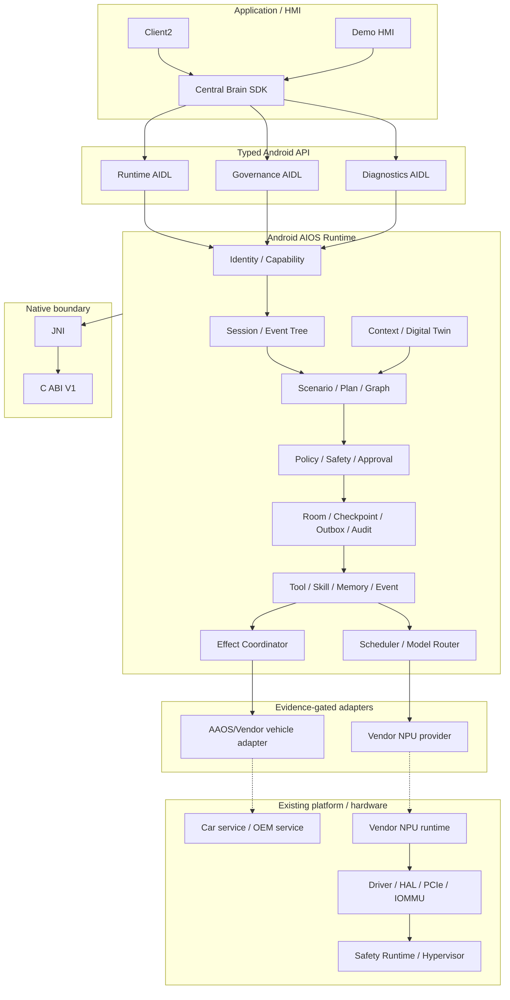

# 车载中央大脑软件架构设计

版本：3.4

日期：2026-07-17

目标平台：黑盒 Android 13 座舱域控制器

## 架构目标

在不修改厂商 Android Framework、VHAL、BSP 和已编译系统组件的条件下，以普通 APK/AAR、
公开 Android/NDK API 和可替换 adapter 构建中央大脑。Python 语义原型已退役，不再构成架构层、
测试 oracle 或 fallback。

Req ID：`APP-004`、`XSC-001..006`、`FW-U-001..008`、`FW-S-001..006`、
`NV-F-001..012`、`NV-G-001..007`、`NV-P-002`、`KH-003/006/007`、
`DEL-001/003/004/005`。

## 总体视图



虚线表示当前外部阻塞路径。没有 owner、公开 API/ABI、权限、Safety、smoke 和 rollback 证据时，
adapter 必须保持 unavailable。

## 分层设计

### 应用层

Client2 和 Demo 只能通过 `central-brain-sdk` 调用 Runtime。应用不能直接访问模型端点、Vendor SDK、
车辆 service、device node 或 Driver/HAL。HMI 只显示 Runtime 认可的 session/plan/effect 状态。

### Framework 语义层

Context、State、Event、Action、Service、Tool 和 Permission 是稳定语义对象。当前 typed AIDL v1
承载 task/governance/diagnostics；P1-W01 已新增独立 Session V1 contract，P1-W02 已新增 4 个
Plan/Node DTO，P1-W03 已新增 5 个 Event DTO、独立 Event/callback V1、23 类 allowlist 及
顺序/父链/脱敏/cursor/replay validator；P1-W04 已新增 4 个 Effect/Approval DTO、完整 Effect 状态转换、
approval stale/expiry 和 undo eligibility 校验。P1-W05 已发布 app-layer Session/Event Service，P1-W06
已接 Room v4 durable repository；P1-W07 以 machine-readable aggregate v2 绑定四组冻结 V1、capability、
error、bounds、Room 和 forbidden fallback。Effect Service、Plan Compiler、approval response/undo executor
和 Graph Runtime 尚未发布。aggregate v2 不是 wire V2，每组合同继续独立版本演进且不破坏已有 AIDL hash。

### Runtime 与 Governance

Runtime 进程拥有：

- Binder caller identity、current signer 和 capability policy；
- Job Supervisor、deadline/quota/cancel；
- Room task/checkpoint/approval/effect/outbox/event cursor/audit；
- Model/Event/Memory/Skill 合同和 readiness；
- 所有 Effect 的 Policy、Safety、Approval、verify/reconcile/compensate 入口。

Runtime 不把模型输出当作执行授权，也不接受请求体自报身份或权限。

### Protocol Binding

当前正式 binding 只有 Android typed Binder/AIDL。SDK 负责显式 component 绑定、version/hash、
callback、death、bounded reconnect 和 cancel。历史 JSON Binder、REST、Linux UDS/RPC 已退役。

### Native 层

C ABI V1 只拥有 lifecycle、health、capacity lease 和未来 provider 的稳定 ABI 边界。Java/JNI 传递
固定宽度值和有界 byte array；C 不拥有 Binder identity、Policy、Room、UI 或业务编排。

### Model Runtime Adapter

`ModelProvider` 定义 descriptor、health、warmup、infer/stream、cancel、metrics、fault 和 close。
`InferenceResourceScheduler` 管理 priority、deadline、owner quota 和 provider slots。当前
`vendor.npu.empty` 不可路由；Android deterministic provider 仅用于 test/debug contract。

### Vehicle Effect Adapter

每个车辆动作必须采用 prepare -> dispatch -> deliver -> apply -> verify 状态机。未知 driving state、
权限、readback 或 adapter result 时失败关闭。AAOS/Vendor adapter 当前尚未接入。

### Kernel、HAL 与 NPU

普通 APK 不实现驱动。只有目标平台公开接口不足、owner 确认 ABI、最小缺口已登记且验收方法明确后，
才新增独立 C/JNI/HAL/driver 工作包。PCIe 枚举、DMA-BUF、IOMMU、firmware、reset 和 fault recovery
均属于 Vendor/平台集成输入。

### 虚拟化与 Safety

不开发 Hypervisor、VM 生命周期或跨 VM 共享内存。若目标平台已有 Safety Runtime/跨域 channel，
adapter 必须保留 identity、schema、policy、deadline、trace 和 readonly fallback 语义。

## 数据与状态

- Binder payload 有界；原始模型/用户/车辆 payload 不进入 GitHub evidence。
- Room durable write 先于可观察状态变化；未知副作用不得自动重放。
- 墙钟用于展示/retention，elapsed realtime 用于 timeout/deadline。
- owner fingerprint 使用 user/package/current-signer 的稳定摘要，不存原始 signer。
- production source 不包含 debug probe Activity 或 test adapter。

## 安全设计

1. Manifest signature permission 是第一层，Runtime capability policy 是第二层。
2. Policy/Safety hard interlock 不能被用户确认覆盖。
3. Effect material、模型输入和车辆 payload 必须遵循最小化、目的和 retention。
4. Vendor adapter 的加载、签名、版本、权限、死亡恢复和 rollback 必须独立验收。
5. `production_ready=false` 与 `target_hardware_validated=false` 不因应用层 PASS 自动改变。

## 部署与交付

正式软件制品为 SDK AAR、Native AAR、Runtime APK、Demo APK 和可选 Client2 APK。远程硬件测试
通过 immutable Release、SHA-256、脱敏 Issue 和 replacement/retest 闭环完成；GitHub 不连接目标 ADB。

## 验证入口

```bash
bash tools/check_central_brain_python_prototype_retirement.sh
bash tools/check_central_brain_android_runtime_evolution.sh
bash tools/check_central_brain_runtime_contract_v2.sh
bash tools/check_central_brain_android_sdk_facade.sh
bash tools/check_central_brain_npu_interface.sh
bash tools/check_central_brain_virtualization_docs.sh
```

`P1-W01 Session DTO/AIDL`、`P1-W02 Plan/Node DTO/AIDL`、`P1-W03 Event DTO/AIDL` 与
`P1-W04 Effect/Approval DTO/AIDL` contract layer、`P1-W05 SDK facade v2`、`P1-W06 Room v4` 和
`P1-W07 Runtime Contract v2 aggregate` 已完成。SDK 通过
`ScenarioClient` 隔离 Binder primitive；同一 Runtime Service 以双 action 发布 Session/Event V1，
Room v4 owner repository 支持 Service rebind 和 Runtime process-death rehydration。P1-W06 Room v4
schema 与 P1 aggregate gate 已完成，下一开发工作包是 `P2-W01 Canonical vehicle signal types`。

当前 `session_runtime_service_published=true`、`event_runtime_service_published=true`、
`event_callback_service_published=true`、`room_schema_version=4`、
`session_runtime_process_death_rehydration=true`、`runtime_contract_v2_verified=true`，但 Event V2、
Scenario/Plan/Effect 执行、
approval response、undo execution 仍为 false。Service 数量保持三项，生产 capability policy 不包含
test principal；`hardware_accessed=false`。
真实 AAOS/Vendor/NPU adapter 继续受
`S2-ADP-002` 和 Driver/HAL gap gate 阻塞。
