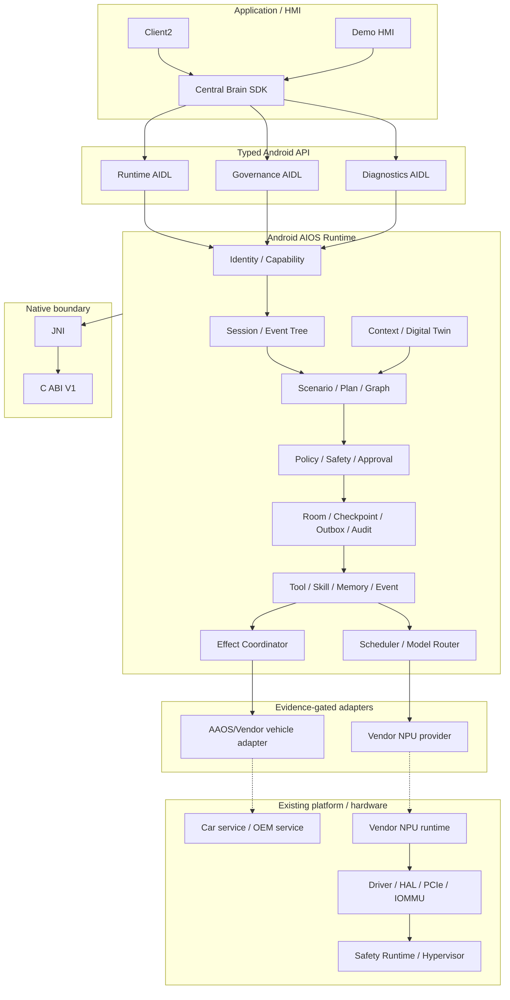

# 车载中央大脑软件架构设计

版本：3.4

日期：2026-07-17

目标平台：黑盒 Android 13 座舱域控制器

## 架构目标

在不修改厂商 Android Framework、VHAL、BSP 和已编译系统组件的条件下，以普通 APK/AAR、
公开 Android/NDK API 和可替换 adapter 构建中央大脑。Python 语义原型已退役，不再构成架构层、
测试 oracle 或 fallback。

Req ID：`APP-004`、`XSC-001..006`、`FW-U-001..008`、`FW-S-001..006`、
`NV-F-001..012`、`NV-G-001..007`、`NV-P-002`、`KH-003/006/007`、
`DEL-001/003/004/005`。

## 总体视图



虚线表示当前外部阻塞路径。没有 owner、公开 API/ABI、权限、Safety、smoke 和 rollback 证据时，
adapter 必须保持 unavailable。

## 分层设计

### 应用层

Client2 和 Demo 只能通过 `central-brain-sdk` 调用 Runtime。应用不能直接访问模型端点、Vendor SDK、
车辆 service、device node 或 Driver/HAL。HMI 只显示 Runtime 认可的 session/plan/effect 状态。

### Framework 语义层

Context、State、Event、Action、Service、Tool 和 Permission 是稳定语义对象。当前 typed AIDL v1
承载 task/governance/diagnostics；P1-W01 已新增独立 Session V1 contract，P1-W02 已新增 4 个
Plan/Node DTO，P1-W03 已新增 5 个 Event DTO、独立 Event/callback V1、23 类 allowlist 及
顺序/父链/脱敏/cursor/replay validator；P1-W04 已新增 4 个 Effect/Approval DTO、完整 Effect 状态转换、
approval stale/expiry 和 undo eligibility 校验。P1-W05 已发布 app-layer Session/Event Service，P1-W06
已接 Room v4 durable repository；P1-W07 以 machine-readable aggregate v2 绑定四组冻结 V1、capability、
error、bounds、Room 和 forbidden fallback。Effect Service、Plan Compiler、approval response/undo executor
和 Graph Runtime 尚未发布。aggregate v2 不是 wire V2，每组合同继续独立版本演进且不破坏已有 AIDL hash。

### Runtime 与 Governance

Runtime 进程拥有：

- Binder caller identity、current signer 和 capability policy；
- Job Supervisor、deadline/quota/cancel；
- Room task/checkpoint/approval/effect/outbox/event cursor/audit；
- Model/Event/Memory/Skill 合同和 readiness；
- 所有 Effect 的 Policy、Safety、Approval、verify/reconcile/compensate 入口。

Runtime 不把模型输出当作执行授权，也不接受请求体自报身份或权限。

### Protocol Binding

当前正式 binding 只有 Android typed Binder/AIDL。SDK 负责显式 component 绑定、version/hash、
callback、death、bounded reconnect 和 cancel。历史 JSON Binder、REST、Linux UDS/RPC 已退役。

### Native 层

C ABI V1 只拥有 lifecycle、health、capacity lease 和未来 provider 的稳定 ABI 边界。Java/JNI 传递
固定宽度值和有界 byte array；C 不拥有 Binder identity、Policy、Room、UI 或业务编排。

### Model Runtime Adapter

`ModelProvider` 定义 descriptor、health、warmup、infer/stream、cancel、metrics、fault 和 close。
`InferenceResourceScheduler` 管理 priority、deadline、owner quota 和 provider slots。当前
`vendor.npu.empty` 不可路由；Android deterministic provider 仅用于 test/debug contract。

### Vehicle Effect Adapter

每个车辆动作必须采用 prepare -> dispatch -> deliver -> apply -> verify 状态机。未知 driving state、
权限、readback 或 adapter result 时失败关闭。AAOS/Vendor adapter 当前尚未接入。

### Kernel、HAL 与 NPU

普通 APK 不实现驱动。只有目标平台公开接口不足、owner 确认 ABI、最小缺口已登记且验收方法明确后，
才新增独立 C/JNI/HAL/driver 工作包。PCIe 枚举、DMA-BUF、IOMMU、firmware、reset 和 fault recovery
均属于 Vendor/平台集成输入。

### 虚拟化与 Safety

不开发 Hypervisor、VM 生命周期或跨 VM 共享内存。若目标平台已有 Safety Runtime/跨域 channel，
adapter 必须保留 identity、schema、policy、deadline、trace 和 readonly fallback 语义。

## 数据与状态

- Binder payload 有界；原始模型/用户/车辆 payload 不进入 GitHub evidence。
- Room durable write 先于可观察状态变化；未知副作用不得自动重放。
- 墙钟用于展示/retention，elapsed realtime 用于 timeout/deadline。
- owner fingerprint 使用 user/package/current-signer 的稳定摘要，不存原始 signer。
- production source 不包含 debug probe Activity 或 test adapter。

## 安全设计

1. Manifest signature permission 是第一层，Runtime capability policy 是第二层。
2. Policy/Safety hard interlock 不能被用户确认覆盖。
3. Effect material、模型输入和车辆 payload 必须遵循最小化、目的和 retention。
4. Vendor adapter 的加载、签名、版本、权限、死亡恢复和 rollback 必须独立验收。
5. `production_ready=false` 与 `target_hardware_validated=false` 不因应用层 PASS 自动改变。

## 部署与交付

正式软件制品为 SDK AAR、Native AAR、Runtime APK、Demo APK 和可选 Client2 APK。远程硬件测试
通过 immutable Release、SHA-256、脱敏 Issue 和 replacement/retest 闭环完成；GitHub 不连接目标 ADB。

## 验证入口

```bash
bash tools/check_central_brain_python_prototype_retirement.sh
bash tools/check_central_brain_android_runtime_evolution.sh
bash tools/check_central_brain_runtime_contract_v2.sh
bash tools/check_central_brain_android_vehicle_signal_schema.sh
bash tools/check_central_brain_android_vehicle_capability_catalog.sh
bash tools/check_central_brain_android_sdk_facade.sh
bash tools/check_central_brain_npu_interface.sh
bash tools/check_central_brain_virtualization_docs.sh
```

`P1-W01 Session DTO/AIDL`、`P1-W02 Plan/Node DTO/AIDL`、`P1-W03 Event DTO/AIDL` 与
`P1-W04 Effect/Approval DTO/AIDL` contract layer、`P1-W05 SDK facade v2`、`P1-W06 Room v4` 和
`P1-W07 Runtime Contract v2 aggregate`、`P2-W01 Canonical vehicle signal types` 与
`P2-W02 Vehicle capability catalog`、`P2-W03 VehicleDigitalTwinStore` 与
`P2-W04 ContextSnapshotBuilder`、`P2-W05 Scenario manifest/schema` 与
`P2-W06 DeterministicScenarioResolver` 已完成。SDK 通过
`ScenarioClient` 隔离 Binder primitive；同一 Runtime Service 以双 action 发布 Session/Event V1，
Room v4 owner repository 支持 Service rebind 和 Runtime process-death rehydration。P1-W06 Room v4
schema 与 P1 aggregate gate 已完成；`vehicle/schema` 提供 12 项固定 path、typed scalar、unit/area、
source/quality/freshness，`vehicle/capability` 提供 8 项 range/risk/dependency/activation metadata；
`vehicle/twin` 提供进程内 desired/reported store、monotonic revision、TTL/quality、atomic snapshot 与
reconciliation；`context` 在同一 Twin revision 上提供固定 policy、driving/safety 派生、freshness/trust
report、restricted 和 digest；`scenario` 通过三份 build-owned v1 asset、strict parser/schema、artifact
checksum、bounded template validator 与 invalid isolation 提供非执行 catalog，并用显式 ID/固定文本规则、
Context/source/zone/capability/PARKED_ONLY gate 输出 immutable accept/degrade/reject resolution。Signal/
Capability/Twin/Context 都没有 provider/property mapping，Twin/Context/Scenario Resolver 也没有 production
Service wiring。下一开发工作包是 `P2-W07 ScenarioPlanCompiler`。

当前 `session_runtime_service_published=true`、`event_runtime_service_published=true`、
`event_callback_service_published=true`、`room_schema_version=4`、
`session_runtime_process_death_rehydration=true`、`runtime_contract_v2_verified=true`、
`vehicle_signal_schema_defined=true`、`vehicle_capability_catalog_defined=true`、
`vehicle_digital_twin_store_defined=true`、`vehicle_digital_twin_persistence_wired=false`、
`context_snapshot_defined=true`、`context_snapshot_production_trusted=false`、
`context_snapshot_production_wired=false`、
`scenario_manifest_schema_version=1`、`scenario_catalog_count=3`、
`scenario_manifest_artifact_crypto_verified=false`、`scenario_catalog_production_trusted=false`、
`scenario_resolver_defined=true`、`scenario_resolution_schema_version=1`、
`scenario_resolver_model_invoked=false`、`scenario_resolver_runtime_wired=false`、
`scenario_compiler_wired=false`、
`scenario_runtime_wired=false`、`scenario_graph_execution_enabled=false`、
`vehicle_production_capability_authorized_count=0`、`vehicle_signal_provider_wired=false`，但 Event V2、
Scenario Compiler、Plan/Effect 执行、
approval response、undo execution 仍为 false。Service 数量保持三项，生产 capability policy 不包含
test principal；`hardware_accessed=false`。
真实 AAOS/Vendor/NPU adapter 继续受
`S2-ADP-002` 和 Driver/HAL gap gate 阻塞。

## P4-W06 Client2 observable execution projection

Client2 application layer now projects the AIOS control chain as:

```text
SessionSnapshot / validated RuntimeEvent
  -> CockpitHmiReducer.Event defensive copy
  -> CockpitExecutionTimeline immutable transition
  -> CockpitHmiState revision
  -> CockpitControlCoordinator
  -> seven stable Android TextView rows + bounded typed trace
```

The projection is intentionally downstream-only: it cannot submit an Effect, grant approval, retry, compensate or write vehicle
state. `CockpitExecutionTimeline` understands typed contract states so future Runtime events do not require View-owned logic, while
the current Runtime truth remains visible as Plan NOT PUBLISHED, Graph NOT WIRED, Effect NOT DISPATCHED and Readback UNAVAILABLE.
FRESH typed observation is required before APPLIED/VERIFIED. The eight-item trace stores no raw ID, digest, user/model text or
vehicle payload.

P4-W01 through P4-W06 are complete at this historical checkpoint. P4-W07 Approval/partial/retry/undo UX follows;
its controls must stay disabled until corresponding Runtime services and typed evidence are published. Req IDs: `S2-UX-001`,
`S2-HMI-003/006`, `S2-EVT-001`, `APP-004`, `XSC-001/005/006`. Current flags:
`cockpit_execution_timeline_implemented=true`, `cockpit_execution_typed_event_projection=true`,
`cockpit_execution_plan_published=false`, `cockpit_execution_effect_dispatch_enabled=false`,
`cockpit_execution_readback_available=false`, `production_ready=false`, `target_hardware_validated=false`.

## P4-W07 Client2 approval and recovery projection

```text
SessionSnapshot / validated RuntimeEvent
  -> CockpitExecutionTimeline sanitized TraceItem
  -> CockpitRecoveryState immutable transition
  -> CockpitHmiState revision
  -> CockpitControlCoordinator recovery renderer
  -> approval details + partial evidence + compensation + disabled commands
```

The recovery model is downstream-only. It maintains bounded counters and enum states but no raw approval/effect/observation/undo
identity, digest, user/model text or vehicle payload. Snapshot `PARTIALLY_COMPLETED` is authoritative aggregate evidence; typed
FRESH verification and failure events provide per-category counts. Compensation is projected independently and never mutates the
original verified Effect.

The current Client2 transport does not deliver `ApprovalPrompt`, `EffectObservation.retryable` or `UndoHandle`. Reason/expiry and
missing target are therefore rendered UNAVAILABLE, while approve/reject/retry/undo remain visible but disabled. This is a deliberate
capability boundary, not a placeholder success path. Overlay dismissal changes presentation only and preserves Session/recovery state.

P4-W01 through P4-W07 are complete at this checkpoint; P4-W08 driving restriction projection is specified below.
Req IDs: `S2-UX-003`, `S2-HMI-003`, `S2-SAF-001`, `S2-EFF-001`, `APP-004`, `XSC-001/005/006`. Current flags:
`cockpit_recovery_state_reducer_owned=true`, `cockpit_partial_outcome_projection=true`,
`cockpit_approval_response_service_published=false`, `cockpit_retry_service_published=false`,
`cockpit_undo_service_published=false`, `cockpit_recovery_commands_enabled=false`,
`production_ready=false`, `target_hardware_validated=false`, `implementation_stage=P5-W02`.

## P4-W08 Client2 driving restriction projection

```text
typed SafetyContext (driving/source/quality/revision)
  -> DrivingUxPolicy
  -> PanelPresentationMode
  -> CockpitHmiReducer / immutable CockpitHmiState
  -> CockpitControlCoordinator
  -> restriction banner + concise text + disabled parameter/high-risk controls
```

Only trusted observed PARKED Context selects PARKED_FULL. MOVING, UNKNOWN, missing, unavailable, stale or revision-less Context
selects MOVING_RESTRICTED. The restricted renderer hides long Intent/Context/Plan/Execution/Result content, keeps a one-line summary
and disables HVAC/Seat parameter editing plus high-risk nap entry. Click handlers repeat the state check before reducer mutation or
Session admission.

This path is presentation-only. Both modes report `isEffectAuthorizationSource=false`; no UI transition can authorize an Effect,
approval or vehicle action. Runtime Governance/Safety remains independent and must revalidate Context at dispatch. The current
physical Client2 has no trusted global Context provider, so its only honest default is restricted; P4-W09 adds a protected debug
simulation surface for physical PARKED/MOVING/UNKNOWN coverage without changing production authority.

P4-W01 through P4-W08 are complete at the Android application layer. Req IDs: `S2-UX-002`, `S2-HMI-002`, `S2-SAF-001`,
`APP-004`, `XSC-001/005/006`. Current flags: `cockpit_driving_ux_policy_implemented=true`,
`cockpit_unknown_driving_restricted=true`, `cockpit_restricted_parameter_editing_disabled=true`,
`cockpit_high_risk_controls_disabled=true`, `cockpit_runtime_policy_authority_independent=true`,
`vehicle_signal_provider_wired=false`, `production_ready=false`, `target_hardware_validated=false`,
`implementation_stage=P5-W02`.

## P5-W01 Tool contract architecture

```text
build-owned Tool definition
  -> ToolManifest (identity/owner/capability/risk/timeout/idempotency/health)
  -> ObjectSchema input + output (bounded scalar fields)
  -> canonical field ordering -> contract SHA-256
  -> ToolSchemaValidator -> immutable validated scalar map OR stable rejection

P5-W02 ToolRegistry/Resolver (not published)
P5-W03 ToolRuleSolver (not implemented)
P5-W04 ToolExecutor (not implemented)
```

The P5-W01 package is a pure contract layer in Runtime main source. It depends only on Java primitives and the existing Plan timeout
ceiling. It does not depend on Android framework, Binder, Room, AgentGraph, ModelProvider, vehicle adapters or Driver/HAL. The debug
probe is a separate adapter used only to prove the same pure-Java contract on API 33 ARM64 and is absent from the release manifest.

Manifest health is declarative: check ID, maximum staleness and mandatory fail-closed admission. It deliberately contains no current
health value. Registry state, version resolution and usable-tool selection are owned by P5-W02. Rule intersection is P5-W03, while
deadline/cancel/audit and actual invocation are P5-W04. No earlier layer may infer the authority of a later layer.

Status: `tool_manifest_contract_defined=true`, `tool_manifest_contract_digest_verified=true`,
`tool_schema_exact_scalar_validation_verified=true`, `tool_manifest_health_fail_closed=true`,
`tool_manifest_android13_arm64_verified=false`, `tool_registry_published=false`,
`tool_resolver_published=false`, `tool_execution_enabled=false`,
`production_tool_artifact_loaded=false`, `effect_dispatch_enabled=false`, `vehicle_readback_accessed=false`,
`npu_accessed=false`, `hardware_accessed=false`, `production_ready=false`, `target_hardware_validated=false`,
`implementation_stage=P5-W02`. Req IDs: `S2-TOL-001`, `S2-SAF-001`, `S2-OBS-001`; tracking: `DEV-063`, `ISSUE-036`.

## P4-W11 Client2 accessibility/display architecture

```text
Android DisplayMetrics + Configuration
  -> CockpitDisplayPolicy (strict allowlist + deterministic panel bounds)
  -> CockpitControlCoordinator admission
  -> XML overlay + runtime accessibility semantics
  -> navigation trigger / panel render OR fail-closed hidden state
```

`CockpitDisplayPolicy` is immutable and Android-independent after primitive metrics are supplied. It owns the exact three-profile
allowlist, font-scale range, 48dp-to-pixel conversion and deterministic overlay bounds. The Coordinator is the only Android adapter:
it constructs the policy, disables the navigation trigger for unsupported configurations and applies content descriptions, focus,
minimum target size, line bounds, selected state and state description to every Button.

The XML remains the static 48dp baseline so accessibility is not dependent on Coordinator timing. Scroll containers preserve access
to controls at compact and large-text profiles. The Web design preview may shrink the 1920x1080 canvas but never scale it above 1.
No state in this path owns Session, Plan, Effect, Vehicle or Safety authority; `isEffectAuthorizationSource=false` is invariant.

P4-W01 through P4-W11 are complete at the Android application layer. Req IDs: `S2-UX-003`, `S2-HMI-001/002`, `APP-004`,
`XSC-001/005/006`; tracking: `DEV-061`, `ISSUE-019/033`. Current flags:
`cockpit_display_matrix_defined=true`, `cockpit_touch_target_min_dp=48`,
`cockpit_accessibility_semantics_runtime_owned=true`, `cockpit_display_matrix_android13_arm64_verified=true`,
`cockpit_display_effect_authorization_source=false`, `production_ready=false`, `target_hardware_validated=false`,
`implementation_stage=P5-W02`.

## P4-W12 aggregate Android acceptance architecture

```text
P4 aggregate runner
  -> recovery suite -> crash-buffer assertion
  -> protected engineer fault suite -> crash-buffer assertion
  -> scenario/manual synchronization suite -> crash-buffer assertion
  -> accessibility/display suite -> crash-buffer assertion + display restore
  -> fresh Client2 launch -> final UI tree -> crash-buffer assertion
```

The aggregate runner is orchestration only. It selects one API 33 ARM64 device without publishing its identity, re-executes each
maintained physical suite and validates fresh markers. Local logs/UI trees/crash buffers remain under ignored evidence paths. A child
failure stops the aggregate; child EXIT traps restore temporarily disabled Runtime and display/font/rotation state.

Evidence modes remain separate in `central_brain_android_p4_hmi_acceptance.json`. Navigation/session/recovery, protected debug
Context/fault, natural/manual synchronization and display/accessibility are physical evidence. Plan/Effect/Media/Nav/approval/partial/
mismatch/undo are host projection plus physical fail-closed evidence only. Runtime release simulation absence is static/APK evidence;
there is no production Client2 release artifact.

P4-W01 through P4-W12 application acceptance is complete. This does not complete HMI-D4. Req IDs: `S2-UX-001..003`,
`S2-HMI-001..006`, `S2-SCN-001`, `S2-SAF-001`, `S2-EFF-001`, `APP-004`, `XSC-001/005/006`; tracking:
`DEV-062`, `ISSUE-022/026/030/033`. Current flags: `p4_w12_application_acceptance_complete=true`,
`p4_android13_arm64_aggregate_verified=true`, `p4_plan_effect_projection_host_verified=true`,
`p4_automatic_plan_runtime_published=false`, `p4_production_effect_dispatch_enabled=false`,
`hmi_d4_demo_control_loop_complete=false`, `production_ready=false`, `target_hardware_validated=false`,
`implementation_stage=P5-W02`.

## P4-W10 Client2 scenario/manual synchronization

```text
natural scene button OR manual HVAC/Seat desired revision
  -> CockpitControlCoordinator
  -> Client2ScenarioBridge (ScenarioClient interface)
  -> SessionHandle / SessionSnapshot / validated RuntimeEvent
  -> CockpitHmiReducer
  -> CockpitScenarioControlState
  -> Intent / Plan / Execution / Result + HVAC/Seat drawer
```

`CockpitScenarioControlState` is immutable and Android-independent. It is the single owner of the 14 UI-to-canonical mappings,
origin, catalog device roles, catalog match status, Session lifecycle, active Plan revision and last event sequence. Bridge lookup and
HMI projection use the same catalog. A canonical mismatch clears device roles and fails the HMI state; duplicate, old-session and gap
events cannot advance it.

Natural cold/fatigue/rest roles describe only manifest participation. They never create HVAC/Seat desired parameters. Manual controls
retain their typed HMI desired state but enter the same ScenarioClient Session/Event lifecycle. Plan is published only when Runtime
supplies a positive `activePlanRevision`; Effect dispatch and readback remain false/unavailable. Req IDs: `S2-HMI-001..006`,
`S2-SCN-001`, `APP-004`, `XSC-001/005/006`; tracking: `DEV-060`, `ISSUE-022/026/030/033`.

P4-W01 through P4-W10 are complete at the Android application layer. Current flags:
`cockpit_scenario_control_state_reducer_owned=true`, `cockpit_scenario_catalog_normalized=true`,
`cockpit_scenario_manual_shared_client=true`, `cockpit_scenario_device_session_synchronized=true`,
`cockpit_scenario_plan_publication_inferred=false`, `cockpit_scenario_effect_dispatch_enabled=false`,
`cockpit_scenario_readback_available=false`, `production_ready=false`, `target_hardware_validated=false`,
`implementation_stage=P5-W02`.

## P4-W09 Client2 protected engineer simulation projection

```text
Engineer drawer (hidden until connected)
  -> DebugSimulationControllerClient
  -> signature permission + caller capability + AIDL version/hash
  -> Runtime DebugSimulationController (debug variant only)
  -> acknowledged status + strictly increasing revision
  -> CockpitEngineerState -> CockpitHmiReducer -> DrivingUxPolicy
```

The engineer path is an application test boundary. `CockpitEngineerState` is immutable and Android-independent; the Binder client
is the only transport adapter, and the reducer is the only state writer. The drawer accepts only fixed driving, occupancy, belt,
adapter and fault enums. It does not accept arbitrary property paths or vehicle payload. Unknown/reset/disconnect projects an
unavailable Context; acknowledged PARKED/MOVING projects source=SIMULATED solely for presentation testing.

Runtime debug admission is layered: signature permission, Binder caller identity, `debug.simulation.control` capability and frozen
interface version/hash. The Runtime release source/manifest/policy contains no controller exposure. Neither the engineer state nor
the resulting `PanelPresentationMode` can authorize Effect, Policy, Safety or vehicle action. Production Context provider, OEM
vehicle mapping and dispatch-time safety revalidation remain P8 responsibilities.

P4-W01 through P4-W09 are complete at the Android application layer. Req IDs: `S2-HMI-004`, `S2-ADP-001`, `S2-OBS-001`,
`APP-004`, `XSC-001/005/006`. Current flags: `cockpit_engineer_simulation_drawer_implemented=true`,
`cockpit_engineer_context_revisioned=true`, `cockpit_engineer_runtime_release_service_absent=true`,
`cockpit_engineer_effect_authorization_source=false`, `cockpit_engineer_production_available=false`,
`vehicle_signal_provider_wired=false`, `production_ready=false`, `target_hardware_validated=false`,
`implementation_stage=P5-W02`.
