# CougarOS Central Brain 生产软件架构文档

版本：2.2
状态：生产架构权威基线
适用平台：Android 13 座舱域控制器
更新日期：2026-08-21

`production_document_scope=true`
`production_architecture_document=true`
`production_ready=false`
`target_hardware_validated=false`

## 1. 架构目标与边界

Central Brain 将“用户意图”转换为“经过治理、可追踪、可核验的车辆动作”。架构的核心不是聊天界面，
而是把感知、模型、计划、工具、执行器和 HMI 放入同一条受控运行链路。

生产软件运行在不可修改系统源码的 Android 13 座舱域控制器上，以普通 APK、独立 Runtime Service、
Java SDK 和 Native Library 交付。外部 AI 算力基座通过车载以太网访问；车辆信号与末端执行器通过
OEM/Vendor 提供的公开或授权接口接入。缺少接口时保持空 Adapter 和失败关闭状态，不推断 Driver/HAL。

### 1.1 架构原则

1. **意图优先**：HMI 输入目标，不要求用户逐个操作执行器。
2. **模型无执行权**：模型只能产生候选结构化计划。
3. **确定性治理**：白名单、策略、审批和车辆状态决定动作能否执行。
4. **状态可恢复**：Session、Plan、Event、Checkpoint 和 Effect 均有持久状态。
5. **desired/reported 分离**：请求成功不等于车辆已达到目标状态。
6. **失败关闭**：未知身份、未知能力、陈旧状态、非法模型输出和缺失 Adapter 一律拒绝。
7. **接口先行**：跨进程、Native、车辆和模型边界均有稳定版本合同。
8. **平台隔离**：业务编排不依赖具体车辆属性号、NPU ABI 或模型后端。

## 2. 系统上下文

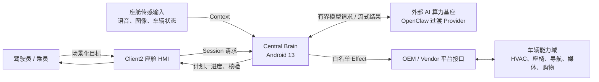

系统信任边界如下：

- HMI 输入是用户意图，不是已授权动作。
- 模型输出是不可信候选数据。
- OEM/Vendor Adapter 是车辆能力的唯一出口。
- 车辆 reported state 是 Effect 完成的主要依据。
- HMI 只投影 Runtime 状态，不拥有编排真相。

## 3. 生产部署架构

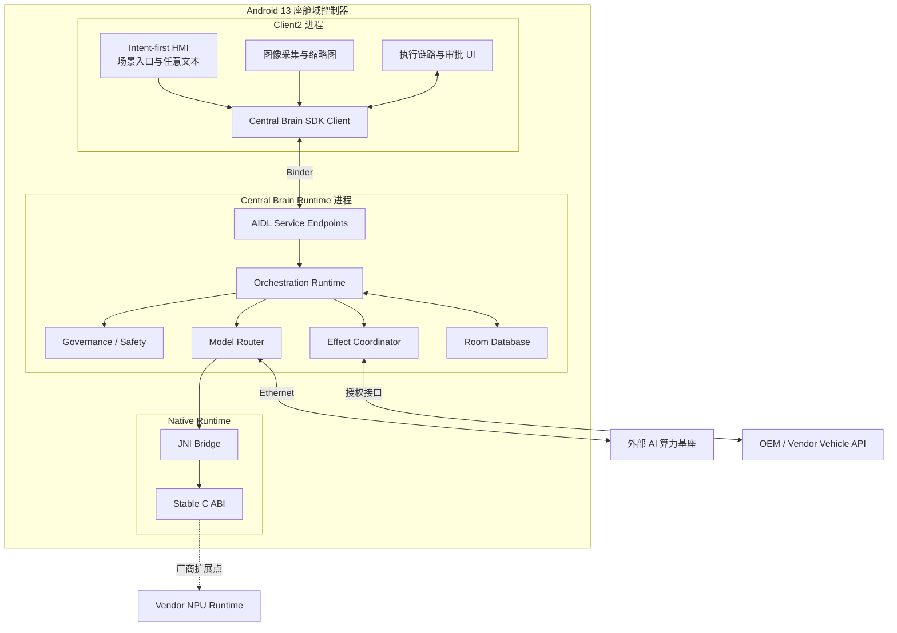

### 3.1 进程职责

| 进程/组件 | 职责 | 禁止事项 |
| --- | --- | --- |
| Client2 | 输入、图片预览、链路展示、审批交互 | 不直接调用模型或车辆 Adapter |
| SDK | Binder 连接、DTO 校验、协议协商、重连 | 不保存 Runtime 权威状态 |
| Runtime Service | 编排、治理、持久化、模型路由、Effect | 不依赖 HMI 生命周期 |
| Native Runtime | 资源槽位、健康、厂商 ABI 入口 | 不拥有产品策略 |
| External AI | 推理和流式输出 | 不直接访问车辆执行器 |
| Vehicle Adapter | 能力映射、执行和回读 | 不接受未治理的自由文本 |

## 4. 逻辑分层

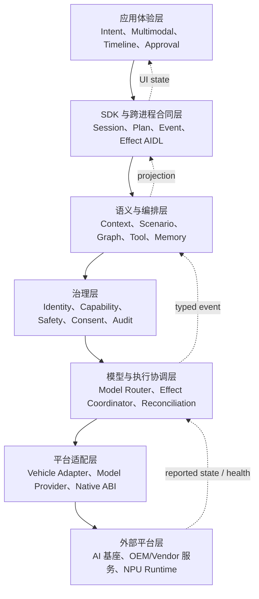

依赖只允许向下，状态反馈通过 typed Event 向上投影。平台适配层不得反向依赖 HMI 或场景文案。

## 5. 核心模块

### 5.1 Client2 座舱 HMI

HMI 由任务入口、输入/输出流、执行链路、审批条和执行器反馈组成。生产交互遵循：

- 底部导航入口切换固定场景任务面板，例如“我累了”“处理一下”。
- 底部电话入口切换任意文本输入框；两个浮层互斥，输入卡关闭控件或点击浮层外可关闭输入。
- 任意文本只是 Session 绑定的用户目标，不能绕过 Scenario、Model、Governance 或 Effect。
- 输入和模型输出按到达顺序滚动显示。
- 图片以缩略图显示，点击后居中预览，点击外部区域退出。
- Plan 节点、Effect、审批和 readback 形成一条连续链路。
- HVAC 温度、座椅角度等 UI 状态来自 Runtime 投影，不使用固定结果文本。
- 1920x1080 下 HMI 不改变车模画布的原始比例、清晰度和触摸坐标。

Client、Client2 与 RenderService 的厂商渲染关系是受保护边界：

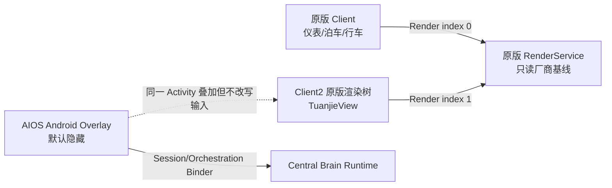

AIOS 不得调用 `TuanjieView.setRenderScale()`、覆盖其触摸监听、反射访问 RenderService
或要求修改后的 Unity bundle。浮层关闭时，只允许保留导航/电话入口的有界透明热区；车模区域的
事件必须继续进入厂商输入链。共享 RenderService 更新后必须按 Client1 后 Client2 的顺序重建
双路会话，但不得通过资源重写修复 UI。

### 5.2 Central Brain SDK

SDK 是 HMI 与 Runtime 的唯一正式入口，包括：

- `SessionClient`：打开、查询、取消和观察 Session。
- `OrchestrationClient`：启动场景、读取快照、提交审批、撤销和取消。
- Event V2：游标、ACK、回放和 oneway callback。
- 协议协商：interface version/hash、capability 和 schema version。
- 生命周期恢复：Binder death、重连、Session 恢复、事件续传。

### 5.3 Session 与持久化

Session 是端到端所有权边界。每个 Session 绑定调用方、场景、截止时间、活动 Plan revision 和状态。
Room 保存 Session、Plan、节点、事件、游标、检查点、审批、Effect、回读和审计摘要。

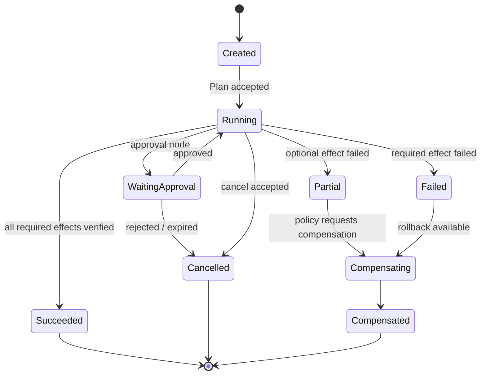

### 5.4 Context 与 Vehicle Digital Twin

Context 层把车辆和座舱输入转换为 canonical signal：

`path + area + typed value + timestamp + quality + source + schemaVersion`

Digital Twin 分离：

- `reported`：从可信车辆接口读取的实际状态。
- `desired`：通过治理后准备执行的目标状态。
- `freshness`：状态是否仍可用于安全决策。
- `revision`：防止旧写入覆盖新状态。

### 5.5 Scenario 与 Plan Compiler

Scenario Manifest 描述允许的场景、节点类型、能力、审批和补偿规则。Resolver 根据 Context 确定场景，
Compiler 生成不可变 DAG。模型可以填充参数和提出候选分支，但不能创建未知节点类型或能力。

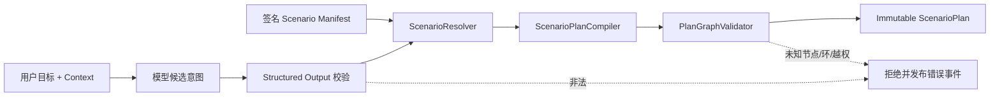

### 5.6 Agent Graph Runtime

Graph Runtime 按依赖和策略执行 typed node。节点类型包括模型、规则、Tool、审批、Effect、等待、核验和补偿。
每次状态迁移先写检查点，再发布事件。重启后由 `GraphRestartReconciler` 根据持久状态恢复，不重复提交
已经确认的外部动作。

座舱合规检测采用两级 Agent：`ComplianceTriageAgent` 只产生版本化事件候选，
`CabinComplianceAgentRouter` 用场景 ID、候选类型和置信度确定性选择专用 Agent。显式 HMI 场景直接进入
代码路由，不让模型自行选择 Agent；连续图像流则先经过 Triage，再进入相同 Router。专用 Agent 的输出必须
经过独立 Schema 校验，且检测结果不能直接连接 Tool 或 Effect。

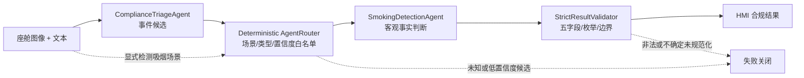

### 5.7 Governance

Governance 位于模型和 Effect 之间，是唯一动作准入权威：

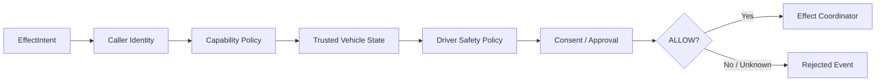

安全策略使用确定性代码，不接受模型生成的策略文本。行驶状态未知等价于受限状态。

### 5.8 Tool 与 Skill

Tool 是受控能力调用，Skill 是可验证的复合行为包。Tool Registry 只登记 Manifest、Schema、版本、
健康和 capability；RuleSolver 将模型候选与系统规则求交集；Executor 只执行内建或已验证实现。

Tool 调用与 Vehicle Effect 必须分开：搜索商品可以是 Tool，提交订单和启动车辆导航必须经过独立审批。

### 5.9 Memory

Memory 分为：

- Working Memory：当前 Session 的短期状态。
- Profile Memory：用户偏好，必须具备同意、授权和加密 owner。
- Episodic Memory：有界摘要，不保存原始输入和模型全文。
- Context Budget：按安全优先级为模型分配上下文预算。

Memory 不是审计日志。审计只保存摘要、状态码和关联 ID。

### 5.10 Event Broker

Event Broker 传递 Observation、Action、Runtime 和 Message 事件。生产事件必须有：

- 单调 sequence 和稳定 cursor。
- owner/session/topic 过滤。
- 有界 page 和 subscriber queue。
- ACK 与重放。
- 背压策略和丢弃计数。
- 终态事件不可重复发布。

### 5.11 Model Runtime

Model Runtime 由 `ModelProviderRegistry`、`PolicyAwareModelRouter`、`ModelProfileRouter`、
`InferenceResourceScheduler` 和 Provider 构成。Provider 路由解决“使用哪个模型服务”，Profile
路由解决“已选服务中使用哪个模型及上下文预算”，两者不可合并为由模型自行判断的自由路由。
当前生产目标使用 OpenClaw 过渡 Provider；Ollama 或 Vendor NPU 是后续可替换 Provider。

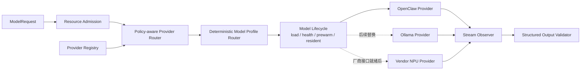

第一级 Router 依据 assurance、隐私、网络、健康、模态、并发和热状态选择 Provider；第二级 Router
依据确定性场景策略选择构建时登记的模型 Profile，并把 `profileId`、`modelId`、served model、最大上下文、
健康 revision 和路由摘要写入证据。吸烟合规图像固定进入专用视觉 Profile，其余场景进入通用座舱 Profile。
专用目标未就绪、身份不匹配或健康过期时失败关闭，不回退到通用模型。

生产运行时必须在接收业务请求前完成目标模型身份检查和真实预热，并按资源预算维持必要模型常驻。
上下文上限是 Profile 合同而非调用方参数：专用检测 Profile 使用较小预算，通用座舱 Profile 使用较大预算；
请求还需按 system instruction、当前输入、安全上下文、会话摘要和历史优先级做二次裁剪。任何裁剪不得删除
安全边界、输出 Schema 或当前图文输入。过渡 Provider 未达到 production assurance 前，全局
`production_ready` 保持 false。

### 5.12 Effect 与 Vehicle Adapter

Effect 流程分为 prepare、dispatch、readback、reconcile：

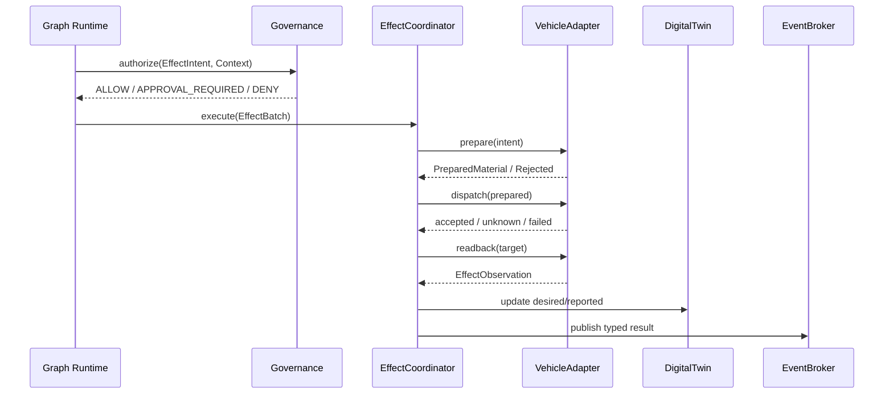

Adapter 不可用时返回明确错误。UI 动画只能投影状态，不能作为 readback 或量产证据。

### 5.13 Native Runtime

Native Runtime 提供稳定 C ABI：

- `cb_runtime_create_v1`
- `cb_runtime_get_health_v1`
- `cb_runtime_acquire_slot_v1`
- `cb_runtime_release_slot_v1`
- `cb_runtime_destroy_v1`

该层当前负责资源槽位和健康合同。厂商 NPU、共享内存、DMA、模型生命周期和故障恢复在 Vendor ABI
确认后通过扩展 Adapter 实现，不改变上层 Java 业务合同。

## 6. 关键业务流程

### 6.1 语音场景流程

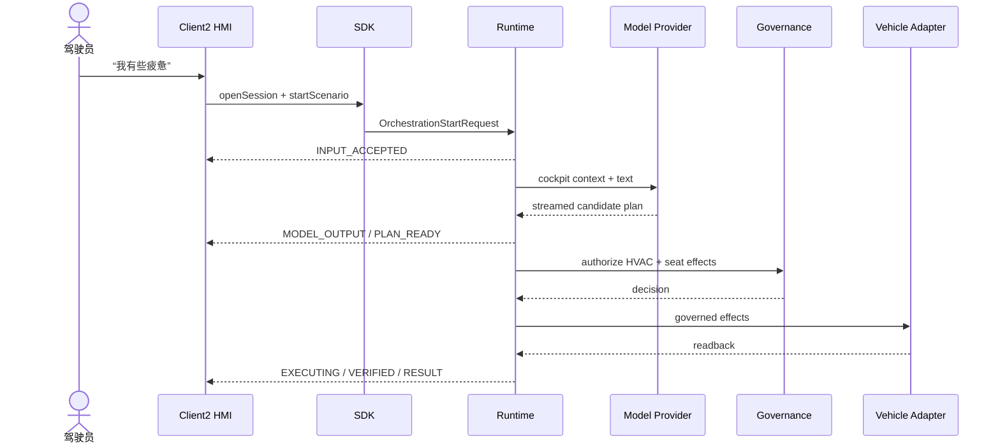

### 6.2 多模态座舱流程

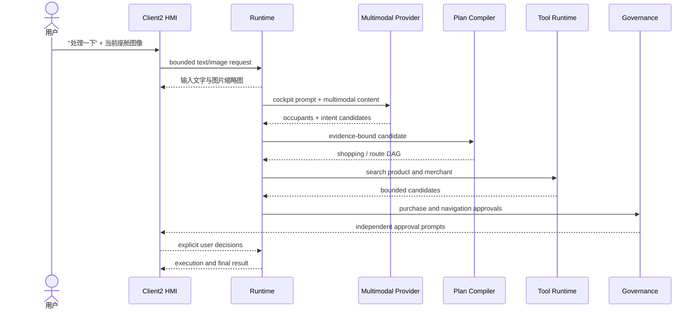

模型识别到乘员和饮水意图后，系统只能准备购物与路径候选；购买提交和导航启动是两个独立确认点。

### 6.3 任意文本座舱任务

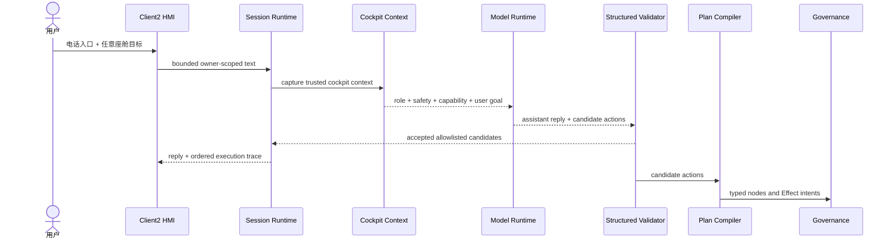

### 6.4 座舱吸烟合规检测

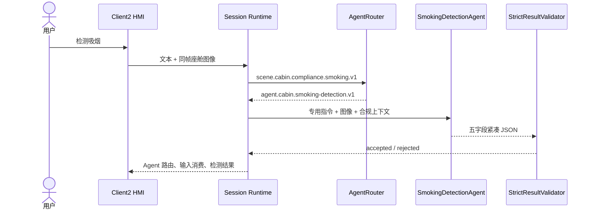

标准输出只包含 `smoking_detected`、`person_count`、`location`、`confidence` 和 `description`。
置信度低于 0.5 时必须规范化为 `UNKNOWN` 的不确定结果。场景图只包含 Context、路由、模型、校验和
结果渲染节点，不包含 Tool、Effect 或业务处置节点。

Provider 内部快速通道使用 `[status,count,location_code,confidence_percent]`。Schema 以三个互斥分支编码
字段联动：阴性只能为 `[0,0,0,50..100]`，阳性只能为 `[1,1..2,1..4,50..100]`，不确定只能为
`[2,0,0,0..49]`。解析器仍需二次校验；生成约束不能替代本地失败关闭。快速通道未达到接受条件时使用
原始图像和五字段合同回退。

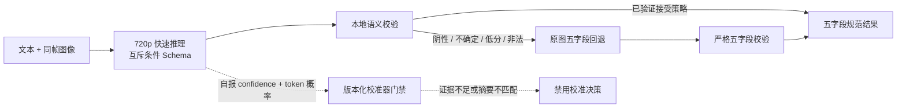

模型自报 `confidence` 是生成字段，token 概率是受当前提示词、解码和 Schema 影响的模型分布，二者都不是
真实正确率。只有绑定模型、Agent 指令、预处理、wire schema 和数据清单摘要的校准器，且在成组隔离的
独立测试集同时改善 Brier 与 ECE、保留分类质量和覆盖率时，才可参与自动接受策略。缺少有效校准器时，
系统保留现有失败关闭和原图回退，不把任何分数升级为 Tool、Effect 或安全授权。

当前任意文本链路可输出模型回复和白名单候选动作。只有候选动作成功转换为构建时可审查的 typed Plan，
并经过 Governance 后，才可进入 Tool 或 Effect；无法编译、未知参数或缺少能力时必须停止在结果投影阶段。

### 6.4 审批与撤销

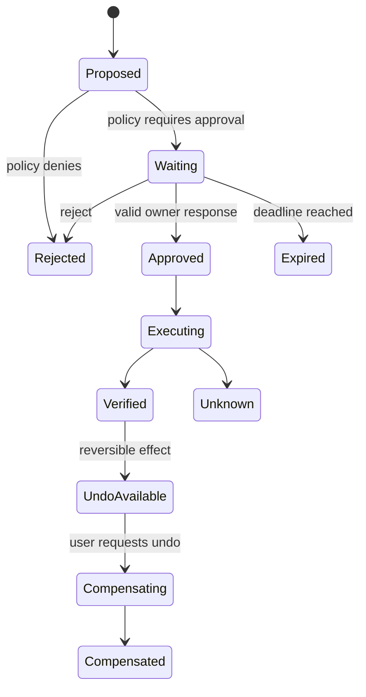

审批必须绑定 owner、Session、Plan revision、Effect digest 和 deadline，旧审批不能作用于新计划。

### 6.5 故障与恢复

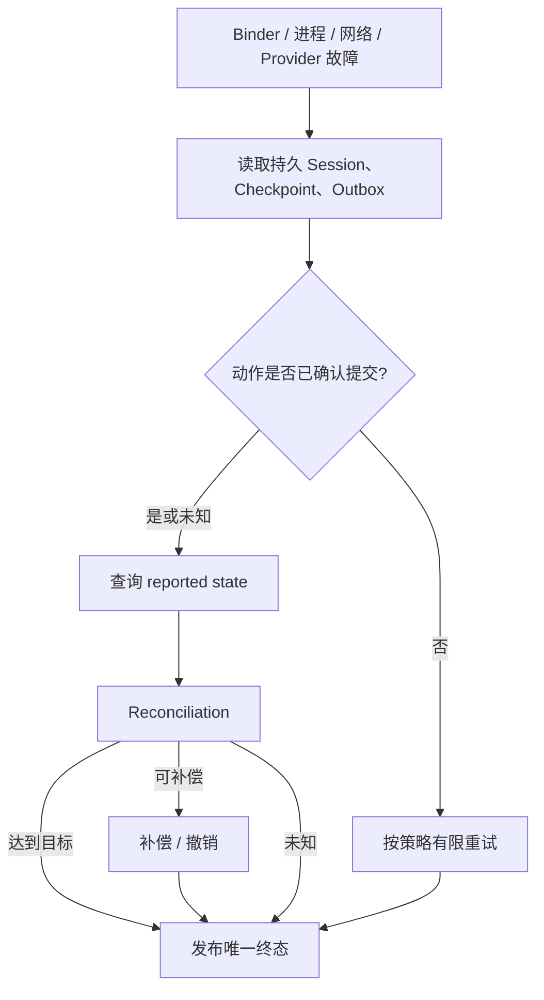

## 7. 数据架构

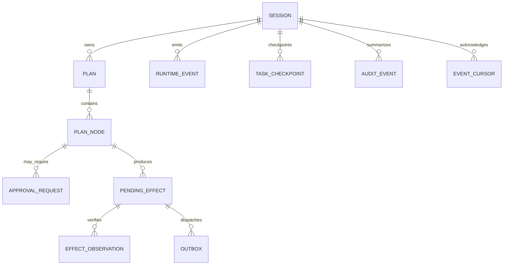

### 7.1 权威状态

| 数据 | 权威 owner | 持久化 |
| --- | --- | --- |
| Session/Plan/Graph | Runtime Service | Room |
| HMI 展示状态 | Client2 reducer | 可由 Runtime 重建 |
| Vehicle reported state | Vehicle Adapter / Digital Twin | 有界快照 |
| Model health | Model Provider Registry | 进程内快照 |
| Approval | Governance + durable repository | Room |
| Effect dispatch | Effect outbox | Room |
| 审计 | Audit projection | 只保存摘要 |

## 8. 安全、隐私与发布架构

```mermaid
flowchart LR
    App["调用方 APK"]
    Binder["Signature Permission + UID"]
    Runtime["Runtime Authority"]
    Model["Untrusted Model Output"]
    Schema["Schema / Allowlist"]
    Policy["Governance"]
    Adapter["Signed Adapter"]
    Vehicle["Vehicle Domain"]

    App --> Binder --> Runtime
    Runtime --> Model --> Schema --> Policy --> Adapter --> Vehicle
    Vehicle -. "readback" .-> Adapter
```

- Binder 使用签名权限、UID 和 owner fingerprint。
- 模型输出先经过结构化校验，再进入 Scenario/Tool/Effect。
- Tool 和 Adapter 使用构建时登记、版本和摘要。
- 驾驶状态、安全联锁和审批均由确定性策略执行。
- 原始输入不进入审计；日志中禁止凭据、图像、模型全文和车辆原始载荷。
- 发布由 signer、数据库兼容、候选版本、安装策略和回滚策略共同准入。

## 9. 可用性与性能

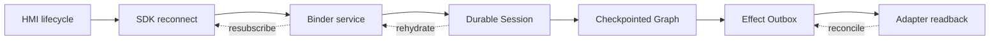

性能由分层预算控制：HMI 本地响应、Binder 接收、模型首 token、Plan 编译、Effect prepare/dispatch、
readback 和最终投影分别测量。任何目标值只有在量产硬件和真实 Provider/Adapter 上测得后才能成为
发布证据。

## 10. 生产集成缺口

| 缺口 | 架构处理 |
| --- | --- |
| 真实 Vehicle property/service 未确认 | 保留 canonical Adapter；运行时返回 unavailable |
| NPU ABI 未确认 | 保留 `ModelProvider` 与 C ABI；Vendor Provider 不注册 |
| OpenClaw assurance 未达量产 | 作为过渡 Provider，限制权限并保持全局未就绪 |
| 可信车速/档位/DMS 未接入 | 高风险动作失败关闭 |
| 生产签名/OTA/回滚未确认 | Release Admission 拒绝发布 |
| 隐私 owner 策略未批准 | Profile/Episodic 写入和导出关闭 |

## 11. 模块与需求映射

| 模块 | 主要 Req ID |
| --- | --- |
| Client2 HMI | `APP-001..005`, `S2-UX-*`, `S2-HMI-*`, `P4-*` |
| SDK/AIDL | `S2-SES-001`, `S2-EVT-001`, `P1-*` |
| Context/Digital Twin | `S2-CTX-001`, `S2-TWN-001`, `P2-W01..07` |
| Scenario/Graph | `S2-SCN-*`, `S2-GRF-001`, `P3-*` |
| Governance/Effect | `S2-SAF-*`, `S2-EFF-001`, `P3-W05..09` |
| Tool/Skill/Memory | `S2-TOL-*`, `S2-SKL-001`, `S2-MEM-*`, `P5-*` |
| Event/Proactive | `S2-EVT-001`, `P6-*` |
| Model Runtime | `S2-MDL-*`, `P7-*` |
| Vehicle/NPU Adapter | `S2-ADP-*`, `P8-*` |
| Quality/Release | `S2-OBS-001`, `S2-REL-001`, `P9-*` |

实现类、AIDL、C ABI、数据库实体和错误语义见
[软件开发文档](CENTRAL_BRAIN_SOFTWARE_DEVELOPMENT.md)。全量状态见
[需求文档](CENTRAL_BRAIN_REQUIREMENTS.md)。
