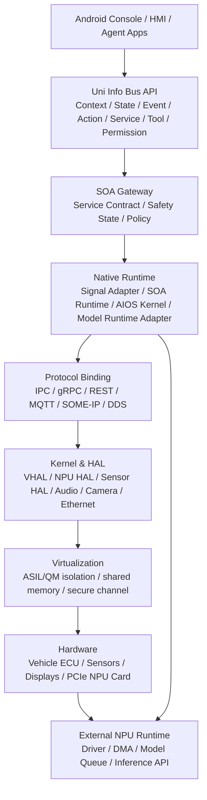
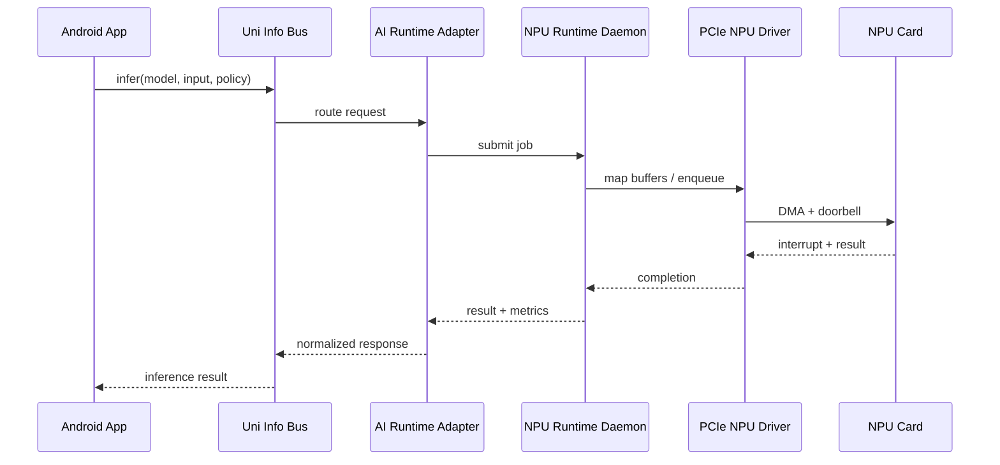
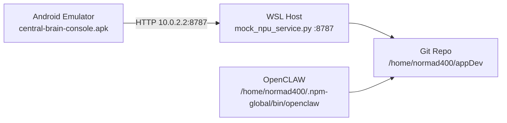

# 车载中央大脑软件架构设计

版本：0.1
日期：2026-07-04

## 架构目标

建立一个可从本地 mock 演进到真实车载域控/中央计算平台的软件架构。系统由 Android 应用层、中间层服务总线、Native runtime、Kernel/HAL、虚拟化隔离和外置 PCIe NPU 后端组成。

## 架构图基线

`docs/assets/central_brain_architecture_source.png` 是本项目的需求基线，不是示意图。本文档的任何架构描述都必须服从该图的分层和模块边界。需求追踪见 `docs/CENTRAL_BRAIN_ARCHITECTURE_REQUIREMENTS.md`；软件偏差见 `docs/CENTRAL_BRAIN_ARCHITECTURE_DEVIATIONS.md`；架构疑点见 `docs/CENTRAL_BRAIN_ARCHITECTURE_ISSUES.md`。

产品参考资料，例如 KaKaClaw 咖咖虾，只能用于补充应用体验和 Agent/Skill/Memory 的产品形态，不能替代图中的 Uni Info Bus、SOA 服务入口、Native Runtime & Governance、Protocol Binding、Kernel/HAL 和 Hypervisor 分层。

用户进一步明确：虚拟化层不需要开发；驱动层只在当前环境不满足接口时新增开发量，但驱动接口支持必须文档化。图中带黄色小太阳标记的 AI SDK、Uni Info Bus、SOA 服务入口、AIOS Kernel、Runtime & Governance、Protocol Binding 等组件按跨 SoC 可移植平台组件处理。开发以 Android 为主，交付必须同步提供 Linux 版本，面向 Android/Linux 座舱域软件工程师。

## 总体视图

## 分层设计

### 应用层

对应架构图中的座舱 Apps、Agent Apps、Cluster & TBOX、智驾应用、诊断/标定/Trace 应用。

职责：
- 呈现 HMI、车况、服务状态和 AI 能力。
- 发起用户意图、工具调用、诊断请求和模型推理请求。
- 根据驾驶状态隐藏或降级高分心能力。

第一阶段实现：
- `central-brain/android-console`：普通 Android App，不依赖 Gradle，可用本仓库 Android SDK 构建。

### Framework 层

对应 Uni Info Bus 语义接口。

核心对象：
- `Context`：车辆、用户、环境、驾驶场景。
- `State`：服务、模型、车辆信号、网络、健康状态。
- `Event`：订阅型事件，包含车辆信号变化、诊断、模型状态、OTA。
- `Action`：受控动作，例如座椅、灯光、空调、导航、诊断工具执行。
- `Service`：方法调用入口，包含同步/异步调用。
- `Tool`：AI Agent 可调用工具 Schema。
- `Permission`：权限、角色、安全域、驾驶状态限制。

长期实现建议：
- Android App 到系统服务使用 AIDL。
- 系统服务到 Native runtime 使用 AIDL、Binder NDK 或 Unix domain socket。
- 车内网络桥接使用 SOME/IP、DDS、MQTT、gRPC/REST 适配器。

### SOA 服务入口

职责：
- 统一服务注册、发现、路由、版本和契约校验。
- 安全状态检查：ASIL/QM、驾驶/驻车、降级/互锁。
- 统一审计：调用者、目标服务、参数摘要、结果、耗时。

关键服务类别：
- Business Services：场景服务，如座舱模式、诊断流程、泊车辅助状态。
- Foundation Services：复用能力，如时间同步、账号、权限、配置。
- Atomic Services：最小能力，如信号读写、单一 ECU 操作。
- Service Contract：IDL/Schema 版本、兼容性和生成代码。
- Safety State：互锁、降级、故障隔离。

### Native 层

职责：
- AIOS Kernel：Agent、模型、工具、内存、安全运行时。
- Sensor/Actuator：摄像头、雷达、USS、IMU、麦克风、音频等。
- Service Adapters：Signal Map、ECU Proxy、协议实现。
- SOA Service Runtime：容器、状态机、服务调用、生命周期。
- Model Runtime Adapter：NPU/GPU/CPU/Cloud 模型运行时适配。
- Security/Policy Adapter：权限、安全域、ASIL/QM 分区策略。
- Data/Time Sync：TSN/PTP/Frame metadata。

当前 A5 原型新增 `central-brain/backend/native_adapters.py` 和 `/native/adapters/detail`，以注册表方式固定 AIOS Kernel、SOA Service Adapter、Vehicle Signal Adapter、Model Runtime Adapter、Security/Policy Adapter 的 Req ID、Android 主开发路径、Linux 同步交付路径、Driver/HAL 依赖和虚拟化约束。该增量不访问真实 Driver/HAL，不开发虚拟化层。

### Protocol Binding

| 协议 | 用途 | 第一阶段 |
| --- | --- | --- |
| IPC/Binder | Android App 与系统服务 | AIDL + service/client sample |
| REST | 原型、工具、云 API | 已用于 mock |
| gRPC/RPC | AI 工具服务、跨进程高层 API | 预留 |
| MQTT | 云端消息和轻量事件 | 预留 |
| SOME/IP | 量产车载 SOA 与 ECU 服务发现 | 预留 |
| DDS | 感知/融合/高频发布订阅 | 预留 |

### Kernel & HAL 层

职责：
- Android VHAL：车辆属性读写订阅。
- NPU HAL：模型加载、队列、buffer、推理、功耗和错误状态。
- Linux PCIe driver：设备枚举、BAR、MSI/MSI-X、中断、DMA、IOMMU、复位和电源管理。
- 安全运行时：进程隔离、SELinux、权限、异常管理。

外置 PCIe NPU 最小链路：

### 虚拟化与 Safety 约束

L5 虚拟化层只记录接口约束和部署假设，不开发 Hypervisor、ASIL/QM 隔离或跨 VM 共享内存实现。A7 当前交付见 `docs/CENTRAL_BRAIN_VIRTUALIZATION_SAFETY_CONSTRAINTS.md`，覆盖 HV-001、HV-002、HV-003、FW-S-005、NV-G-005、NV-F-009、KH-007、DEL-004。

关键约束：

- 跨 VM 通信必须保留 Uni Info Bus/SOA 语义，不能让 App 直连 Hypervisor channel。
- Safety State 必须进入 SOA 服务入口、Runtime & Governance Policy 和 Native Security/Policy Adapter。
- ASIL domain 不可用时，只允许 readonly fallback 或明确失败，不允许自动降级为不受控写操作。
- 目标 SoC/Hypervisor/Safety Runtime 未明确前，本仓库不新增虚拟化、共享内存或 Driver/HAL 代码。

## 服务契约

第一阶段契约文件：`central-brain/contracts/central_brain_api.json`。

核心端点：
- `GET /health`：系统、服务总线、NPU 后端健康状态。
- `GET /services`：已注册服务和能力。
- `GET /vehicle/state`：mock 车辆/VSS 风格信号。
- `GET /npu/status`：PCIe/NPU 发现和 runtime 状态。
- `POST /ai/infer`：mock 模型推理请求。

后续演进：
- JSON contract 迁移到 OpenAPI + protobuf/IDL。
- Android 侧生成客户端。
- 系统服务侧引入 Stable AIDL；当前已有 Android Binder service/client sample，仍代理语义网关 prototype binding。
- 车载 SOA 侧增加 SOME/IP IDL/映射。

## 安全设计

- 权限模型：调用者身份、服务权限、工具权限、车辆状态权限。
- 驾驶状态限制：驾驶中禁止高分心 UI 和高风险动作。
- 安全状态：正常、降级、互锁、故障隔离、只读诊断。
- 数据分域：个人数据、车辆数据、诊断数据、AI 数据、日志/Trace。
- NPU 隔离：IOMMU、DMA buffer 生命周期、模型签名、固件版本校验。
- 审计：所有 Action、诊断、OTA、模型调用都写入审计事件。

## 可观测性

必须记录：
- 服务健康：ready/live/degraded。
- 调用 Trace：request id、caller、service、latency、result。
- AI 指标：model id、runtime、queue time、inference time、tokens/frames、错误码。
- 车载指标：信号延迟、丢包、时间同步偏差、协议桥接状态。
- 安全指标：拒绝调用、越权、降级、异常恢复。

## 本地验证拓扑

## 后续架构里程碑

1. M0：文档、契约、Android App、mock NPU 服务、本地构建完成。
2. M1：App 与 mock 后端在模拟器上联通，增加自动 smoke test。
3. M2：中间层拆成独立 service gateway，引入服务注册、权限和 Trace。
4. M3：定义 AIDL 接口，准备 AAOS/System Service 形态。
5. M4：引入 VSS 信号目录和 VHAL/VSS 映射。
6. M5：对接真实或开发板 NPU SDK，替换 mock 推理后端。
7. M6：验证 SOME/IP 或 DDS 其中一条车载协议链路。
8. M7：安全、OTA、诊断、可观测性进入工程化。
