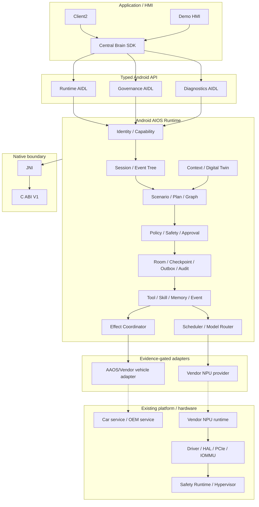

# 车载中央大脑软件架构设计

版本：3.4

日期：2026-07-17

目标平台：黑盒 Android 13 座舱域控制器

## 架构目标

在不修改厂商 Android Framework、VHAL、BSP 和已编译系统组件的条件下，以普通 APK/AAR、
公开 Android/NDK API 和可替换 adapter 构建中央大脑。Python 语义原型已退役，不再构成架构层、
测试 oracle 或 fallback。

Req ID：`APP-004`、`XSC-001..006`、`FW-U-001..008`、`FW-S-001..006`、
`NV-F-001..012`、`NV-G-001..007`、`NV-P-002`、`KH-003/006/007`、
`DEL-001/003/004/005`。

## 总体视图



虚线表示当前外部阻塞路径。没有 owner、公开 API/ABI、权限、Safety、smoke 和 rollback 证据时，
adapter 必须保持 unavailable。

## 分层设计

### 应用层

Client2 和 Demo 只能通过 `central-brain-sdk` 调用 Runtime。应用不能直接访问模型端点、Vendor SDK、
车辆 service、device node 或 Driver/HAL。HMI 只显示 Runtime 认可的 session/plan/effect 状态。

### Framework 语义层

Context、State、Event、Action、Service、Tool 和 Permission 是稳定语义对象。当前 typed AIDL v1
承载 task/governance/diagnostics；P1-W01 已新增独立 Session V1 contract，P1-W02 已新增 4 个
Plan/Node DTO，P1-W03 已新增 5 个 Event DTO、独立 Event/callback V1、23 类 allowlist 及
顺序/父链/脱敏/cursor/replay validator；P1-W04 已新增 4 个 Effect/Approval DTO、完整 Effect 状态转换、
approval stale/expiry 和 undo eligibility 校验。P1-W05 已发布 app-layer Session/Event Service，P1-W06
已接 Room v4 durable repository；P1-W07 以 machine-readable aggregate v2 绑定四组冻结 V1、capability、
error、bounds、Room 和 forbidden fallback。Effect Service、Plan Compiler、approval response/undo executor
和 Graph Runtime 尚未发布。aggregate v2 不是 wire V2，每组合同继续独立版本演进且不破坏已有 AIDL hash。

### Runtime 与 Governance

Runtime 进程拥有：

- Binder caller identity、current signer 和 capability policy；
- Job Supervisor、deadline/quota/cancel；
- Room task/checkpoint/approval/effect/outbox/event cursor/audit；
- Model/Event/Memory/Skill 合同和 readiness；
- 所有 Effect 的 Policy、Safety、Approval、verify/reconcile/compensate 入口。

Runtime 不把模型输出当作执行授权，也不接受请求体自报身份或权限。

### Protocol Binding

当前正式 binding 只有 Android typed Binder/AIDL。SDK 负责显式 component 绑定、version/hash、
callback、death、bounded reconnect 和 cancel。历史 JSON Binder、REST、Linux UDS/RPC 已退役。

### Native 层

C ABI V1 只拥有 lifecycle、health、capacity lease 和未来 provider 的稳定 ABI 边界。Java/JNI 传递
固定宽度值和有界 byte array；C 不拥有 Binder identity、Policy、Room、UI 或业务编排。

### Model Runtime Adapter

`ModelProvider` 定义 descriptor、health、warmup、infer/stream、cancel、metrics、fault 和 close。
`InferenceResourceScheduler` 管理 priority、deadline、owner quota 和 provider slots。当前
`vendor.npu.empty` 不可路由；Android deterministic provider 仅用于 test/debug contract。

### Vehicle Effect Adapter

每个车辆动作必须采用 prepare -> dispatch -> deliver -> apply -> verify 状态机。未知 driving state、
权限、readback 或 adapter result 时失败关闭。AAOS/Vendor adapter 当前尚未接入。

### Kernel、HAL 与 NPU

普通 APK 不实现驱动。只有目标平台公开接口不足、owner 确认 ABI、最小缺口已登记且验收方法明确后，
才新增独立 C/JNI/HAL/driver 工作包。PCIe 枚举、DMA-BUF、IOMMU、firmware、reset 和 fault recovery
均属于 Vendor/平台集成输入。

### 虚拟化与 Safety

不开发 Hypervisor、VM 生命周期或跨 VM 共享内存。若目标平台已有 Safety Runtime/跨域 channel，
adapter 必须保留 identity、schema、policy、deadline、trace 和 readonly fallback 语义。

## 数据与状态

- Binder payload 有界；原始模型/用户/车辆 payload 不进入 GitHub evidence。
- Room durable write 先于可观察状态变化；未知副作用不得自动重放。
- 墙钟用于展示/retention，elapsed realtime 用于 timeout/deadline。
- owner fingerprint 使用 user/package/current-signer 的稳定摘要，不存原始 signer。
- production source 不包含 debug probe Activity 或 test adapter。

## 安全设计

1. Manifest signature permission 是第一层，Runtime capability policy 是第二层。
2. Policy/Safety hard interlock 不能被用户确认覆盖。
3. Effect material、模型输入和车辆 payload 必须遵循最小化、目的和 retention。
4. Vendor adapter 的加载、签名、版本、权限、死亡恢复和 rollback 必须独立验收。
5. `production_ready=false` 与 `target_hardware_validated=false` 不因应用层 PASS 自动改变。

## 部署与交付

正式软件制品为 SDK AAR、Native AAR、Runtime APK、Demo APK 和可选 Client2 APK。远程硬件测试
通过 immutable Release、SHA-256、脱敏 Issue 和 replacement/retest 闭环完成；GitHub 不连接目标 ADB。

## 验证入口

```bash
bash tools/check_central_brain_python_prototype_retirement.sh
bash tools/check_central_brain_android_runtime_evolution.sh
bash tools/check_central_brain_runtime_contract_v2.sh
bash tools/check_central_brain_android_vehicle_signal_schema.sh
bash tools/check_central_brain_android_vehicle_capability_catalog.sh
bash tools/check_central_brain_android_sdk_facade.sh
bash tools/check_central_brain_npu_interface.sh
bash tools/check_central_brain_virtualization_docs.sh
```

`P1-W01 Session DTO/AIDL`、`P1-W02 Plan/Node DTO/AIDL`、`P1-W03 Event DTO/AIDL` 与
`P1-W04 Effect/Approval DTO/AIDL` contract layer、`P1-W05 SDK facade v2`、`P1-W06 Room v4` 和
`P1-W07 Runtime Contract v2 aggregate`、`P2-W01 Canonical vehicle signal types` 与
`P2-W02 Vehicle capability catalog`、`P2-W03 VehicleDigitalTwinStore` 与
`P2-W04 ContextSnapshotBuilder`、`P2-W05 Scenario manifest/schema` 与
`P2-W06 DeterministicScenarioResolver` 已完成。SDK 通过
`ScenarioClient` 隔离 Binder primitive；同一 Runtime Service 以双 action 发布 Session/Event V1，
Room v4 owner repository 支持 Service rebind 和 Runtime process-death rehydration。P1-W06 Room v4
schema 与 P1 aggregate gate 已完成；`vehicle/schema` 提供 12 项固定 path、typed scalar、unit/area、
source/quality/freshness，`vehicle/capability` 提供 8 项 range/risk/dependency/activation metadata；
`vehicle/twin` 提供进程内 desired/reported store、monotonic revision、TTL/quality、atomic snapshot 与
reconciliation；`context` 在同一 Twin revision 上提供固定 policy、driving/safety 派生、freshness/trust
report、restricted 和 digest；`scenario` 通过三份 build-owned v1 asset、strict parser/schema、artifact
checksum、bounded template validator 与 invalid isolation 提供非执行 catalog，并用显式 ID/固定文本规则、
Context/source/zone/capability/PARKED_ONLY gate 输出 immutable accept/degrade/reject resolution。Signal/
Capability/Twin/Context 都没有 provider/property mapping，Twin/Context/Scenario Resolver 也没有 production
Service wiring。下一开发工作包是 `P2-W07 ScenarioPlanCompiler`。

当前 `session_runtime_service_published=true`、`event_runtime_service_published=true`、
`event_callback_service_published=true`、`room_schema_version=4`、
`session_runtime_process_death_rehydration=true`、`runtime_contract_v2_verified=true`、
`vehicle_signal_schema_defined=true`、`vehicle_capability_catalog_defined=true`、
`vehicle_digital_twin_store_defined=true`、`vehicle_digital_twin_persistence_wired=false`、
`context_snapshot_defined=true`、`context_snapshot_production_trusted=false`、
`context_snapshot_production_wired=false`、
`scenario_manifest_schema_version=1`、`scenario_catalog_count=3`、
`scenario_manifest_artifact_crypto_verified=false`、`scenario_catalog_production_trusted=false`、
`scenario_resolver_defined=true`、`scenario_resolution_schema_version=1`、
`scenario_resolver_model_invoked=false`、`scenario_resolver_runtime_wired=false`、
`scenario_compiler_wired=false`、
`scenario_runtime_wired=false`、`scenario_graph_execution_enabled=false`、
`vehicle_production_capability_authorized_count=0`、`vehicle_signal_provider_wired=false`，但 Event V2、
Scenario Compiler、Plan/Effect 执行、
approval response、undo execution 仍为 false。Service 数量保持三项，生产 capability policy 不包含
test principal；`hardware_accessed=false`。
真实 AAOS/Vendor/NPU adapter 继续受
`S2-ADP-002` 和 Driver/HAL gap gate 阻塞。

## P4-W06 Client2 observable execution projection

Client2 application layer now projects the AIOS control chain as:

```text
SessionSnapshot / validated RuntimeEvent
  -> CockpitHmiReducer.Event defensive copy
  -> CockpitExecutionTimeline immutable transition
  -> CockpitHmiState revision
  -> CockpitControlCoordinator
  -> seven stable Android TextView rows + bounded typed trace
```

The projection is intentionally downstream-only: it cannot submit an Effect, grant approval, retry, compensate or write vehicle
state. `CockpitExecutionTimeline` understands typed contract states so future Runtime events do not require View-owned logic, while
the current Runtime truth remains visible as Plan NOT PUBLISHED, Graph NOT WIRED, Effect NOT DISPATCHED and Readback UNAVAILABLE.
FRESH typed observation is required before APPLIED/VERIFIED. The eight-item trace stores no raw ID, digest, user/model text or
vehicle payload.

P4-W01 through P4-W06 are complete at this historical checkpoint. P4-W07 Approval/partial/retry/undo UX follows;
its controls must stay disabled until corresponding Runtime services and typed evidence are published. Req IDs: `S2-UX-001`,
`S2-HMI-003/006`, `S2-EVT-001`, `APP-004`, `XSC-001/005/006`. Current flags:
`cockpit_execution_timeline_implemented=true`, `cockpit_execution_typed_event_projection=true`,
`cockpit_execution_plan_published=false`, `cockpit_execution_effect_dispatch_enabled=false`,
`cockpit_execution_readback_available=false`, `production_ready=false`, `target_hardware_validated=false`.

## P4-W07 Client2 approval and recovery projection

```text
SessionSnapshot / validated RuntimeEvent
  -> CockpitExecutionTimeline sanitized TraceItem
  -> CockpitRecoveryState immutable transition
  -> CockpitHmiState revision
  -> CockpitControlCoordinator recovery renderer
  -> approval details + partial evidence + compensation + disabled commands
```

The recovery model is downstream-only. It maintains bounded counters and enum states but no raw approval/effect/observation/undo
identity, digest, user/model text or vehicle payload. Snapshot `PARTIALLY_COMPLETED` is authoritative aggregate evidence; typed
FRESH verification and failure events provide per-category counts. Compensation is projected independently and never mutates the
original verified Effect.

The current Client2 transport does not deliver `ApprovalPrompt`, `EffectObservation.retryable` or `UndoHandle`. Reason/expiry and
missing target are therefore rendered UNAVAILABLE, while approve/reject/retry/undo remain visible but disabled. This is a deliberate
capability boundary, not a placeholder success path. Overlay dismissal changes presentation only and preserves Session/recovery state.

P4-W01 through P4-W07 are complete at this checkpoint; P4-W08 driving restriction projection is specified below.
Req IDs: `S2-UX-003`, `S2-HMI-003`, `S2-SAF-001`, `S2-EFF-001`, `APP-004`, `XSC-001/005/006`. Current flags:
`cockpit_recovery_state_reducer_owned=true`, `cockpit_partial_outcome_projection=true`,
`cockpit_approval_response_service_published=false`, `cockpit_retry_service_published=false`,
`cockpit_undo_service_published=false`, `cockpit_recovery_commands_enabled=false`,
`production_ready=false`, `target_hardware_validated=false`, `implementation_stage=P6-W06`.

## P4-W08 Client2 driving restriction projection

```text
typed SafetyContext (driving/source/quality/revision)
  -> DrivingUxPolicy
  -> PanelPresentationMode
  -> CockpitHmiReducer / immutable CockpitHmiState
  -> CockpitControlCoordinator
  -> restriction banner + concise text + disabled parameter/high-risk controls
```

Only trusted observed PARKED Context selects PARKED_FULL. MOVING, UNKNOWN, missing, unavailable, stale or revision-less Context
selects MOVING_RESTRICTED. The restricted renderer hides long Intent/Context/Plan/Execution/Result content, keeps a one-line summary
and disables HVAC/Seat parameter editing plus high-risk nap entry. Click handlers repeat the state check before reducer mutation or
Session admission.

This path is presentation-only. Both modes report `isEffectAuthorizationSource=false`; no UI transition can authorize an Effect,
approval or vehicle action. Runtime Governance/Safety remains independent and must revalidate Context at dispatch. The current
physical Client2 has no trusted global Context provider, so its only honest default is restricted; P4-W09 adds a protected debug
simulation surface for physical PARKED/MOVING/UNKNOWN coverage without changing production authority.

P4-W01 through P4-W08 are complete at the Android application layer. Req IDs: `S2-UX-002`, `S2-HMI-002`, `S2-SAF-001`,
`APP-004`, `XSC-001/005/006`. Current flags: `cockpit_driving_ux_policy_implemented=true`,
`cockpit_unknown_driving_restricted=true`, `cockpit_restricted_parameter_editing_disabled=true`,
`cockpit_high_risk_controls_disabled=true`, `cockpit_runtime_policy_authority_independent=true`,
`vehicle_signal_provider_wired=false`, `production_ready=false`, `target_hardware_validated=false`,
`implementation_stage=P6-W06`.

## P5-W03 Tool RuleSolver architecture

P5-W03 adds a pure-Java policy-selection layer between P5-W02 Resolver eligibility and the future P5-W04 executor boundary:

```text
build/test rule list -> immutable ToolRuleSet ----+
trusted-condition placeholder -> ConditionSnapshot |
model-selected family IDs -------------------------+-> ToolRuleSolver -> bounded Selection[]
P5-W02 Resolution[] (RESOLVED + USABLE only) ------+                    execution=false
```

The RuleSet owns static workflow topology only. Init chooses the first eligible families; child edges constrain successors;
conditional rules use tri-state observations; terminal ends expansion; required-before-exit blocks terminal selection until all named
families are completed; requires-approval annotates but never grants. Static rules have a deterministic digest and are independent of
dynamic condition, health or model results.

The solver computes monotonic set reduction. Neither model selection nor condition inputs can add a family to the static allowset.
The final set must also exist in P5-W02 USABLE resolutions. Empty intersections are explicit terminal failures, never fallback to a
different model choice, older Tool version or synthetic health. Output ordering is canonical family order.

There is intentionally no Runtime composition root, Binder API, Room entity, Graph node, model adapter, approval Service or executor
reference in this package. The debug probe constructs a local sample graph and emits only booleans/counts; release omits it. Production
rule catalog ownership, trusted condition publication and approval binding remain `ISSUE-038`; signed built-in invocation is P5-W04.

Flags: `tool_rule_set_contract_defined=true`, `tool_rule_model_intersection_fail_closed=true`,
`tool_rule_solver_android13_arm64_verified=false`, `tool_rule_solver_published=false`,
`tool_rule_solver_runtime_wired=false`, `tool_execution_enabled=false`, `effect_dispatch_enabled=false`,
`vehicle_readback_accessed=false`, `model_invoked=false`, `npu_accessed=false`, `hardware_accessed=false`,
`production_ready=false`, `target_hardware_validated=false`, `implementation_stage=P6-W06`. Req IDs: `S2-TOL-001`,
`S2-SAF-001`, `S2-OBS-001`, `DEL-001/004/005`; tracking: `DEV-065`, `ISSUE-038`.

## P5-W01 Tool contract architecture

```text
build-owned Tool definition
  -> ToolManifest (identity/owner/capability/risk/timeout/idempotency/health)
  -> ObjectSchema input + output (bounded scalar fields)
  -> canonical field ordering -> contract SHA-256
  -> ToolSchemaValidator -> immutable validated scalar map OR stable rejection

P5-W02 ToolRegistry/Resolver (pure Java contract developed, not Runtime-published)
P5-W03 ToolRuleSolver (developed, not Runtime-published)
P5-W04 ToolExecutor boundary (developed, not Runtime-published)
P5-W05 Skill package verifier (developed, no trusted evidence/load)
P5-W06 WorkingMemoryStore (developed process-local, not Runtime/model-published)
```

The P5-W01 package is a pure contract layer in Runtime main source. It depends only on Java primitives and the existing Plan timeout
ceiling. It does not depend on Android framework, Binder, Room, AgentGraph, ModelProvider, vehicle adapters or Driver/HAL. The debug
probe is a separate adapter used only to prove the same pure-Java contract on API 33 ARM64 and is absent from the release manifest.

Manifest health is declarative: check ID, maximum staleness and mandatory fail-closed admission. It deliberately contains no current
health value. Registry state, version resolution and usable-tool selection are owned by P5-W02. Rule intersection is P5-W03, while
deadline/cancel/audit and actual invocation are P5-W04. No earlier layer may infer the authority of a later layer.

Status: `tool_manifest_contract_defined=true`, `tool_manifest_contract_digest_verified=true`,
`tool_schema_exact_scalar_validation_verified=true`, `tool_manifest_health_fail_closed=true`,
`tool_manifest_android13_arm64_verified=false`, `tool_registry_published=false`,
`tool_resolver_published=false`, `tool_execution_enabled=false`,
`production_tool_artifact_loaded=false`, `effect_dispatch_enabled=false`, `vehicle_readback_accessed=false`,
`npu_accessed=false`, `hardware_accessed=false`, `production_ready=false`, `target_hardware_validated=false`,
`implementation_stage=P6-W06`. Req IDs: `S2-TOL-001`, `S2-SAF-001`, `S2-OBS-001`; tracking: `DEV-063`, `ISSUE-036`.

## P5-W02 Tool Registry/Resolver architecture

```text
P5-W01 immutable ToolManifest list
  -> ToolRegistry
     -> canonical family/version map
     -> duplicate digest collapse OR deterministic conflict
     -> order-independent registry digest

dynamic health observations -> ToolHealthSnapshot -> freshness eligibility

ToolResolver.Query(family, version range, capability, optional digest)
  -> highest compatible registered Manifest
  -> exact capability/digest check
  -> dynamic health check
  -> REGISTERED / RESOLVED / USABLE + stable failure code
  -X-> Tool execution / Graph dispatch / Binder / Room / hardware
```

The Registry and Resolver are immutable Android-independent main-source components. Registry owns only static P5-W01 contracts;
HealthSnapshot owns only bounded dynamic observations. Resolver composes them without mutating either. Sorting by family/version and
using the Manifest digest makes registration and selection independent of caller list order.

Resolution intentionally selects before evaluating health. Therefore an unhealthy highest compatible version is visible as
RESOLVED/NOT_USABLE and cannot cause silent fallback to an older healthy contract. Static mismatch remains NOT_RESOLVED. This keeps
registered, resolved and currently usable semantics distinct for P5-W03 rule intersection.

P5-W02 has no composition root in `CentralBrainRuntimeService`, Governance Service or `AgentGraphRuntime`. There is no production
catalog, health publisher, Tool artifact, Binder endpoint, Room table or executor. `USABLE` is not authorization and
`isExecutionEnabled=false` is invariant. The debug DUMP probe is the only Android adapter and release omits it.

Status: `tool_registry_contract_defined=true`, `tool_resolver_contract_defined=true`,
`tool_health_dynamic_snapshot_defined=true`, `tool_registry_digest_verified=true`,
`tool_registry_version_conflict_rejected=true`, `tool_resolver_highest_version_deterministic=true`,
`tool_resolver_states_separated=true`, `tool_resolver_unhealthy_no_fallback=true`, `tool_health_fail_closed=true`,
`tool_registry_android13_arm64_verified=false`, `tool_registry_published=false`, `tool_resolver_published=false`,
`tool_registry_runtime_wired=false`, `tool_execution_enabled=false`, `production_tool_registered=false`,
`effect_dispatch_enabled=false`, `vehicle_readback_accessed=false`, `npu_accessed=false`, `hardware_accessed=false`,
`production_ready=false`, `target_hardware_validated=false`, `implementation_stage=P6-W06`. Req IDs: `S2-TOL-001`,
`S2-SAF-001`, `S2-OBS-001`; tracking: `DEV-064`, `ISSUE-037`.

## P4-W11 Client2 accessibility/display architecture

```text
Android DisplayMetrics + Configuration
  -> CockpitDisplayPolicy (strict allowlist + deterministic panel bounds)
  -> CockpitControlCoordinator admission
  -> XML overlay + runtime accessibility semantics
  -> navigation trigger / panel render OR fail-closed hidden state
```

`CockpitDisplayPolicy` is immutable and Android-independent after primitive metrics are supplied. It owns the exact three-profile
allowlist, font-scale range, 48dp-to-pixel conversion and deterministic overlay bounds. The Coordinator is the only Android adapter:
it constructs the policy, disables the navigation trigger for unsupported configurations and applies content descriptions, focus,
minimum target size, line bounds, selected state and state description to every Button.

The XML remains the static 48dp baseline so accessibility is not dependent on Coordinator timing. Scroll containers preserve access
to controls at compact and large-text profiles. The Web design preview may shrink the 1920x1080 canvas but never scale it above 1.
No state in this path owns Session, Plan, Effect, Vehicle or Safety authority; `isEffectAuthorizationSource=false` is invariant.

P4-W01 through P4-W11 are complete at the Android application layer. Req IDs: `S2-UX-003`, `S2-HMI-001/002`, `APP-004`,
`XSC-001/005/006`; tracking: `DEV-061`, `ISSUE-019/033`. Current flags:
`cockpit_display_matrix_defined=true`, `cockpit_touch_target_min_dp=48`,
`cockpit_accessibility_semantics_runtime_owned=true`, `cockpit_display_matrix_android13_arm64_verified=true`,
`cockpit_display_effect_authorization_source=false`, `production_ready=false`, `target_hardware_validated=false`,
`implementation_stage=P6-W06`.

## P4-W12 aggregate Android acceptance architecture

```text
P4 aggregate runner
  -> recovery suite -> crash-buffer assertion
  -> protected engineer fault suite -> crash-buffer assertion
  -> scenario/manual synchronization suite -> crash-buffer assertion
  -> accessibility/display suite -> crash-buffer assertion + display restore
  -> fresh Client2 launch -> final UI tree -> crash-buffer assertion
```

The aggregate runner is orchestration only. It selects one API 33 ARM64 device without publishing its identity, re-executes each
maintained physical suite and validates fresh markers. Local logs/UI trees/crash buffers remain under ignored evidence paths. A child
failure stops the aggregate; child EXIT traps restore temporarily disabled Runtime and display/font/rotation state.

Evidence modes remain separate in `central_brain_android_p4_hmi_acceptance.json`. Navigation/session/recovery, protected debug
Context/fault, natural/manual synchronization and display/accessibility are physical evidence. Plan/Effect/Media/Nav/approval/partial/
mismatch/undo are host projection plus physical fail-closed evidence only. Runtime release simulation absence is static/APK evidence;
there is no production Client2 release artifact.

P4-W01 through P4-W12 application acceptance is complete. This does not complete HMI-D4. Req IDs: `S2-UX-001..003`,
`S2-HMI-001..006`, `S2-SCN-001`, `S2-SAF-001`, `S2-EFF-001`, `APP-004`, `XSC-001/005/006`; tracking:
`DEV-062`, `ISSUE-022/026/030/033`. Current flags: `p4_w12_application_acceptance_complete=true`,
`p4_android13_arm64_aggregate_verified=true`, `p4_plan_effect_projection_host_verified=true`,
`p4_automatic_plan_runtime_published=false`, `p4_production_effect_dispatch_enabled=false`,
`hmi_d4_demo_control_loop_complete=false`, `production_ready=false`, `target_hardware_validated=false`,
`implementation_stage=P6-W06`.

## P4-W10 Client2 scenario/manual synchronization

```text
natural scene button OR manual HVAC/Seat desired revision
  -> CockpitControlCoordinator
  -> Client2ScenarioBridge (ScenarioClient interface)
  -> SessionHandle / SessionSnapshot / validated RuntimeEvent
  -> CockpitHmiReducer
  -> CockpitScenarioControlState
  -> Intent / Plan / Execution / Result + HVAC/Seat drawer
```

`CockpitScenarioControlState` is immutable and Android-independent. It is the single owner of the 14 UI-to-canonical mappings,
origin, catalog device roles, catalog match status, Session lifecycle, active Plan revision and last event sequence. Bridge lookup and
HMI projection use the same catalog. A canonical mismatch clears device roles and fails the HMI state; duplicate, old-session and gap
events cannot advance it.

Natural cold/fatigue/rest roles describe only manifest participation. They never create HVAC/Seat desired parameters. Manual controls
retain their typed HMI desired state but enter the same ScenarioClient Session/Event lifecycle. Plan is published only when Runtime
supplies a positive `activePlanRevision`; Effect dispatch and readback remain false/unavailable. Req IDs: `S2-HMI-001..006`,
`S2-SCN-001`, `APP-004`, `XSC-001/005/006`; tracking: `DEV-060`, `ISSUE-022/026/030/033`.

P4-W01 through P4-W10 are complete at the Android application layer. Current flags:
`cockpit_scenario_control_state_reducer_owned=true`, `cockpit_scenario_catalog_normalized=true`,
`cockpit_scenario_manual_shared_client=true`, `cockpit_scenario_device_session_synchronized=true`,
`cockpit_scenario_plan_publication_inferred=false`, `cockpit_scenario_effect_dispatch_enabled=false`,
`cockpit_scenario_readback_available=false`, `production_ready=false`, `target_hardware_validated=false`,
`implementation_stage=P6-W06`.

## P4-W09 Client2 protected engineer simulation projection

```text
Engineer drawer (hidden until connected)
  -> DebugSimulationControllerClient
  -> signature permission + caller capability + AIDL version/hash
  -> Runtime DebugSimulationController (debug variant only)
  -> acknowledged status + strictly increasing revision
  -> CockpitEngineerState -> CockpitHmiReducer -> DrivingUxPolicy
```

The engineer path is an application test boundary. `CockpitEngineerState` is immutable and Android-independent; the Binder client
is the only transport adapter, and the reducer is the only state writer. The drawer accepts only fixed driving, occupancy, belt,
adapter and fault enums. It does not accept arbitrary property paths or vehicle payload. Unknown/reset/disconnect projects an
unavailable Context; acknowledged PARKED/MOVING projects source=SIMULATED solely for presentation testing.

Runtime debug admission is layered: signature permission, Binder caller identity, `debug.simulation.control` capability and frozen
interface version/hash. The Runtime release source/manifest/policy contains no controller exposure. Neither the engineer state nor
the resulting `PanelPresentationMode` can authorize Effect, Policy, Safety or vehicle action. Production Context provider, OEM
vehicle mapping and dispatch-time safety revalidation remain P8 responsibilities.

P4-W01 through P4-W09 are complete at the Android application layer. Req IDs: `S2-HMI-004`, `S2-ADP-001`, `S2-OBS-001`,
`APP-004`, `XSC-001/005/006`. Current flags: `cockpit_engineer_simulation_drawer_implemented=true`,
`cockpit_engineer_context_revisioned=true`, `cockpit_engineer_runtime_release_service_absent=true`,
`cockpit_engineer_effect_authorization_source=false`, `cockpit_engineer_production_available=false`,
`vehicle_signal_provider_wired=false`, `production_ready=false`, `target_hardware_validated=false`,
`implementation_stage=P6-W06`.


## P5-W04 Tool Executor architecture

The P5 Tool path now has four explicit software boundaries:

```text
ToolManifest/Schema -> Registry/Resolver -> RuleSolver Selection
                                          |
                                          v
                      ToolInvocationContext + built-in allowlist
                                          |
                                          v
                            InProcessBuiltInToolExecutor
                                          |
                              bounded digest-only audit
```

P5-W04 is below rule selection but remains outside Runtime and AgentGraph composition. The selection cannot expand the build-owned
allowlist; context cannot grant approval; current signer, artifact and contract must all match before an implementation is reachable.
Input/output validation occurs on both sides of the implementation. Time uses one injected monotonic domain so tests and Android can
prove expiry without wall-clock dependence.

Execution is intentionally synchronous and in-process. This minimizes the first contract surface and avoids inventing an OS
virtualization layer, but it provides cooperative, not hard, cancellation. Therefore the component is suitable for bounded built-ins
that obey checkpoints, not untrusted Skill code, arbitrary APKs, native vendor calls or NPU/vehicle drivers. P5-W05 adds verification
metadata only; production process isolation and Runtime publication require separate owner approval and evidence.

No edge exists from `CentralBrainRuntimeService`, `CentralBrainGovernanceService` or `AgentGraphRuntime` to this executor. No edge exists
from it to Effect adapters, Digital Twin, ModelProvider, VHAL or NPU. Status remains `tool_executor_runtime_wired=false`,
`tool_execution_enabled=false`, `production_tool_execution_enabled=false`, `os_virtualization_enabled=false`,
`hardware_accessed=false`, `production_ready=false`, `target_hardware_validated=false`, `implementation_stage=P6-W06`.
Req IDs: `S2-TOL-001`, `S2-SAF-001`, `S2-OBS-001`, `DEL-001/004/005`; tracking: `DEV-066`, `ISSUE-039`.

## P5-W05 Skill package verifier architecture

```text
trusted evidence source (NOT CONFIGURED)
  -> observed signer digest + measured artifact digest
package metadata
  -> SkillPackageManifest -> canonical manifest digest
build-owned static policy
  -> SkillSignerPolicy (active / retired / revoked / epoch)
  -> SkillVersionPolicy (Skill range / Runtime range / anti-downgrade)
  -> capability allowlist
all inputs
  -> SkillArtifactVerifier
     -> REJECTED + stable code + no package
     -> VERIFIED digest metadata + dynamicLoad=false + execution=false
```

The verifier is a trust-decision kernel below any future package publisher. It deliberately separates supplied evidence from policy:
manifest/artifact/signer equality is checked before signer state, version/runtime/epoch/downgrade and capability. Policy and manifest
digests are deterministic and independent of list/set input ordering.

There is no edge from the verifier to files, PackageManager, keystore/TEE, APK/JAR/dex parsers or class loaders. Therefore VERIFIED
means only that supplied static evidence satisfies supplied static policy. It does not mean a signature chain was checked, the
evidence source is trusted, the artifact is installed, or code is runnable. ISSUE-040 owns those missing production authorities.

There is also no edge from Runtime/Governance/AgentGraph/P5-W04 executor to this verifier and no edge from it to Effect, Digital Twin,
ModelProvider, VHAL, NPU or Driver/HAL. Status: `skill_artifact_verifier_contract_defined=true`,
`skill_revocation_downgrade_fail_closed=true`, `trusted_skill_evidence_source_configured=false`,
`package_signature_cryptographically_verified=false`, `dynamic_skill_loading_enabled=false`,
`skill_execution_enabled=false`, `skill_package_verifier_runtime_wired=false`, `hardware_accessed=false`,
`production_ready=false`, `target_hardware_validated=false`, `implementation_stage=P6-W06`. Req IDs: `S2-TOL-001`,
`S2-SAF-001`, `S2-OBS-001`, `FW-U-008`, `DEL-001/004/005`; tracking: `DEV-067`, `ISSUE-040`.

## P5-W06 WorkingMemoryStore architecture

```text
trusted Runtime-policy metadata + opaque bytes
  -> PutRequest defensive copy
  -> owner fingerprint / Session / item isolation
  -> projected item + byte + token + TTL admission
  -> process-local WorkingMemoryStore
       -> immutable ItemSnapshot + payload copy
       -> exact replay / bounded replacement / explicit remove
       -> elapsed-realtime expiry -> retained-byte zeroization
       -> Session terminal cleanup -> zeroization + bounded tombstone
  -X-> Runtime/Graph/Room/Binder/model context/Effect/Vehicle/NPU/Driver-HAL
```

P5-W06 is a process-local data-plane component below any future Memory service. It stores actual bounded opaque bytes so later Graph or
model composition has a real working-context primitive, but the class is not instantiated by `CentralBrainRuntimeService` or
`AgentGraphRuntime`. Existing `BoundedMemoryLifecycle` remains a digest-only governance metadata contract; it is not reused as the
payload store and its production readiness blocker still refers to durable encrypted Memory.

Resource admission is deterministic and mutation-last. Item size/token/TTL are checked first, then replacement-adjusted Session item,
byte and token totals. There is no silent eviction, truncation, summarization or model fallback. Exact replay preserves the original
TTL; replacement zeroes old retained bytes only after the new state has passed every bound.

All public data access is owner/session scoped and copy-based. Expiry, explicit remove and terminal Session cleanup zero retained byte
arrays, while a bounded terminal tombstone prevents late reactivation for its retention window. Tombstone eviction is explicit in the
snapshot; after eviction, upstream Session authority must still prevent reuse. P5-W06 does not claim cryptographic memory wiping or
heap-copy control outside the store.

There is no persistence, Binder, Runtime composition, tokenizer, model publication, Graph execution, Effect, vehicle, NPU or hardware
edge. Status: `working_memory_store_defined=true`, `working_memory_session_scope_verified=true`,
`working_memory_ttl_verified=true`, `working_memory_item_limit_verified=true`, `working_memory_byte_limit_verified=true`,
`working_memory_token_limit_verified=true`, `working_memory_terminal_cleanup_verified=true`,
`working_memory_payload_zeroized_on_cleanup=true`, `working_memory_android13_arm64_verified=false`,
`working_memory_process_local=true`, `working_memory_persistence_wired=false`, `working_memory_runtime_wired=false`,
`working_memory_model_context_published=false`, `working_memory_tokenizer_verified=false`,
`working_memory_content_logged=false`, `hardware_accessed=false`, `production_ready=false`,
`target_hardware_validated=false`, `implementation_stage=P6-W06`. Req IDs: `S2-MEM-001`, `S2-SAF-001`,
`S2-OBS-001`, `FW-U-001/006/007`, `NV-F-001`, `NV-G-005/006/007`, `DEL-001/004/005`; tracking: `DEV-068`,
`ISSUE-041`.

## P5-W07 ProfileMemoryStore architecture

```text
trusted profile policy / caller (not Runtime-wired)
  -> ProfileKey(owner fingerprint + user/seat + build-owned Field)
  -> FieldPolicy exact type/range/scope
  -> ConsentAuthority or DELETE/EXPORT AuthorizationAuthority
  -> EncryptionOwner readiness gate
  -> seal/open exact key + revision
  -> process-local map of SealedPayload only
  -> read/update/delete/export result
  -X-> Room/file/SharedPreferences/Android Keystore/TEE/Runtime/Graph/model/Effect/Vehicle/NPU
```

P5-W07 separates profile governance from storage/key implementation. The store owns deterministic admission, typed field policy,
scope isolation, retention/capacity and ciphertext lifecycle. `ConsentAuthority`, `AuthorizationAuthority` and `EncryptionOwner` are
injected owner boundaries; none has a production implementation or Service publication in this increment.

At rest inside the store, an Entry contains key metadata, revision, monotonic expiry and `SealedPayload`; no `ProfileValue` reference is
retained. update encodes a bounded transient, calls seal, wipes the transient, verifies owner/key-generation binding and only then
replaces state. read/export open into a bounded transient, decode and wipe it. replace/delete/expiry wipe the store-retained ciphertext.
This is best-effort JVM lifecycle control, not secure hardware erase.

User-global fields cannot enter seat scope and seat fields cannot enter user-global scope. Consent controls read/update; explicit owner
authorization controls delete/export. Deletion remains possible after consent revocation, while export requires both active consent and
EXPORT authorization. Every authority exception and owner/key mismatch fails closed.

The debug/test XOR owner demonstrates only the interface and sealed-byte lifecycle. Durable repository, Android Keystore/TEE key
generation/rotation/revocation, consent UI/authority, multi-user identity publication and process-death recovery remain ISSUE-042.
`MemoryRuntimeReadinessSnapshot` therefore keeps durable storage, key lifecycle, consent and repository blockers unchanged.

状态：`profile_memory_store_defined=true`、`profile_memory_explicit_consent_verified=true`、
`profile_memory_field_allowlist_verified=true`、`profile_memory_user_seat_scope_verified=true`、
`profile_memory_read_update_verified=true`、`profile_memory_delete_verified=true`、`profile_memory_export_verified=true`、
`profile_memory_encryption_owner_gate_verified=true`、`profile_memory_sealed_payload_zeroized=true`、
`profile_memory_android13_arm64_verified=false`、`profile_memory_process_local=true`、
`profile_memory_durable_storage_wired=false`、`profile_memory_production_encryption_owner_configured=false`、
`profile_memory_consent_authority_production_wired=false`、`profile_memory_runtime_wired=false`、
`hardware_accessed=false`、`production_ready=false`、`target_hardware_validated=false`、`implementation_stage=P6-W06`。
Req IDs：`S2-MEM-001`、`S2-SAF-001`、`S2-OBS-001`、`DEL-001/004/005`；tracking：`DEV-069`、`ISSUE-042`。

## P5-W08 EpisodicMemoryStore architecture

```text
typed scenario result
  -> ScenarioReference(id + build catalog digest)
  -> ScenarioCatalogAuthority fail-closed check
  -> owner/episode-bound StoragePolicyEvidence
  -> StoragePolicyAuthority fail-closed check
  -> categorical RecordRequest only
  -> process-local bounded EpisodicMemoryStore
  -> ReadAuthority -> immutable owner page
  -> EraseAuthority -> authorized erase
  -X-> raw continuous signals / arbitrary payload / free-form model or user text
  -X-> Room/file/Binder/Runtime/Graph/model/Effect/Vehicle/NPU/Driver-HAL
```

P5-W08 is a summary plane, not a telemetry store. The stored record contains owner/episode keying, catalog-bound scenario identity,
trigger/result/outcome enums, action counts, elapsed interval and expiry. The type system intentionally omits samples and arbitrary
content, so an upstream component cannot pass a vehicle-signal stream through this API without changing the reviewed contract.

Catalog trust, storage purpose, read authorization and erase authorization are separate injected boundaries. Any missing, expired, mismatched or throwing
authority fails closed. Exact replay is idempotent; conflicting reuse of an episode ID is rejected. Capacity is bounded globally and by
owner without pressure eviction. Expiry and erase remove the whole categorical record and expose counts only.

The store is not composed by Runtime or Agent Graph and does not publish model context. There is no production authority, trusted
cross-restart retention clock, encrypted repository, migration or process-death recovery. `MemoryRuntimeReadinessSnapshot` blockers
remain unchanged. State: `episodic_memory_store_defined=true`, `episodic_memory_summary_result_only_verified=true`,
`episodic_memory_android13_arm64_verified=false`, `episodic_memory_process_local=true`,
`episodic_memory_read_fail_closed=true`, `episodic_memory_production_read_authority_wired=false`,
`episodic_memory_raw_continuous_signal_stored=false`, `episodic_memory_persistence_wired=false`,
`episodic_memory_runtime_wired=false`, `episodic_memory_model_context_published=false`, `hardware_accessed=false`,
`production_ready=false`, `target_hardware_validated=false`, `implementation_stage=P6-W06`. Req IDs: `S2-MEM-001`,
`S2-SAF-001`, `S2-OBS-001`, `DEL-001/004/005`; tracking: `DEV-070`, `ISSUE-043`.

## P5-W09 ContextBudgetManager architecture

```text
trusted upstream metadata (not Runtime-wired)
  -> fixed ContextDescriptor(category/id/token/byte/required/summaryAllowed/priority)
  -> fixed BudgetPolicy(global + per-category token/byte + item count)
  -> validate all descriptors and duplicate IDs before allocation
  -> required-first admission
       -X-> any required overflow => empty REQUIRED_BUDGET_EXCEEDED plan
  -> optional category/priority/ID order
       -> INCLUDE
       -> SUMMARIZE_TO_BUDGET directive
       -> TRUNCATE_TO_BUDGET directive
       -> DROP directive
  -> immutable metadata-only AllocationResult
  -X-> text/byte content, tokenizer, summarizer, model/NPU, Runtime/Graph/Effect/Vehicle
```

P5-W09 is a control-plane allocator between future authorized Memory retrieval and future model context composition. It does not read
Working/Profile/Episodic stores and is not composed by Runtime. This prevents a process-local contract-test component from silently
becoming a privacy or model execution authority.

Required descriptors are allocated before optional data so an optional history entry cannot consume a system requirement. Within each
phase the order is category enum, descending priority and canonical ID; output is re-sorted by the same stable order. Both global and
category token/byte availability must permit a whole INCLUDE. Optional overflow consumes only the exact remaining dual budget and emits
a transformation directive; an empty token or byte dimension yields DROP. Category budget is never borrowed from another category.

The manager deliberately owns no content and cannot perform semantic summarization. A future executor must bind the decision to exact
content identity, tokenizer family/version/digest and privacy authority, execute the directive, recount the result and revalidate the
global/category envelope before model submission. That production chain is tracked by ISSUE-044.

State: `context_budget_manager_defined=true`, `context_budget_category_allocation_verified=true`,
`context_budget_dual_limit_verified=true`, `context_budget_deterministic_overflow_verified=true`,
`context_budget_required_fail_closed=true`, `context_budget_android13_arm64_verified=false`,
`context_budget_decision_only=true`, `context_budget_text_payload_accepted=false`,
`context_budget_tokenizer_wired=false`, `context_budget_summarizer_wired=false`,
`context_budget_production_authority_wired=false`, `context_budget_runtime_wired=false`,
`context_budget_content_logged=false`, `model_invoked=false`, `npu_accessed=false`, `hardware_accessed=false`,
`production_ready=false`, `target_hardware_validated=false`, `implementation_stage=P6-W06`. Req IDs: `S2-MEM-001`,
`S2-MDL-001`, `S2-SAF-001`, `S2-OBS-001`, `DEL-001/004/005`; tracking: `DEV-071`, `ISSUE-044`.

## P5-W10 Memory consent HMI/API architecture

```text
fixed Memory source catalog
  -> owner fingerprint + driving state
  -> MemoryConsentController.snapshot
       -> WORKING_SESSION / session terminal / always operational
       -> PROFILE_PREFERENCE / user clear / retained switch
       -> EPISODIC_SCENARIO / maximum 30 days / retained switch
  -> debug MemoryConsentHmiActivity (38% responsive translucent right panel)

PARKED user action
  -> operation-bound MutationEvidence
  -> replay/conflict gate
  -> MutationAuthority fail-closed decision
  -> process-local HMI projection revision
  -X-> production repository mutation / model context / Runtime wiring

MOVING or UNKNOWN
  -> source overview + NOT_DISCLOSED presence
  -X-> switch / clear / authority call
```

该模块是 Memory control plane 的 UI/API contract，不是新的 Memory data plane。Working source 始终保持 session-only 可用；全局开关
只影响可保留的 Profile/Episode 投影。clear 只把 process-local preference presence 置空，返回结果明确
`repositoryMutationApplied=false`，避免 debug 演示被解释为 Keystore/Room repository 已擦除。

owner、operation、target 和 validity 在 authority 前精确绑定。replay cache 有 64 条上限；相同 request 的 exact replay 不重复授权，
冲突复用失败。PARKED 以外的复杂管理在 authority 之前拒绝，因此 debug 或未来失效 Context 不能绕过 Car UX restriction。

main 不依赖 Android framework；debug Activity 只组合固定 allow authority，并同时承担人工 HMI 与 automated API 33 probe。
release、Runtime、Graph、Profile/Episodic store、model、Effect、Vehicle 和硬件路径保持未接。状态：
`memory_consent_controller_defined=true`、`memory_consent_source_visibility_verified=true`、
`memory_consent_disable_verified=true`、`memory_consent_preference_clear_verified=true`、
`memory_consent_moving_restriction_verified=true`、`memory_consent_android13_arm64_verified=false`、
`memory_consent_hmi_projection_only=true`、`memory_consent_repository_mutation_wired=false`、
`memory_consent_production_authority_wired=false`、`memory_consent_runtime_wired=false`、
`memory_consent_model_context_published=false`、`model_invoked=false`、`npu_accessed=false`、`hardware_accessed=false`、
`production_ready=false`、`target_hardware_validated=false`、`implementation_stage=P6-W06`. Req IDs: `S2-MEM-001`,
`S2-UX-003`, `S2-SAF-001`, `S2-OBS-001`, `DEL-001/004/005`; tracking: `DEV-072`, `ISSUE-045`.

## P6-W01 EventBroker interface/in-process architecture

```text
trusted caller metadata (not Runtime-wired)
  -> fixed Topic<T> catalog
       -> TaskStatePayload | PolicyDecisionPayload | ModelHealthPayload
  -> operation/topic/owner/identity/policy/elapsed AccessEvidence
  -> fail-closed AccessAuthority
  -> InProcessDurableEventBroker
       -> per-topic monotonic cursor
       -> append to bounded process-local retention
       -> notify matching owner-scoped subscriptions
       -> callback failure closes subscriber; event remains replayable
       -> bounded explicit replay(filter, after-cursor, page)
  -X-> Room/file durability, Binder broker, DDS/SOME-IP, Runtime/Graph/Effect/Vehicle/NPU
```

P6-W01 不能复用名称来提升成熟度。`InProcessDurableEventBroker` 的 append-before-notify 是 durable delivery contract 的
前置语义，但 retention 仍随进程退出丢失；旧 R6A2 `DurableEventCursorRepository` 没有被注入。两者在 production repository
owner、transaction boundary、publisher sequence recovery 和 process-death reconciliation 冻结前必须保持分离。

typed catalog 阻止上游创建任意 topic/schema/payload。filter 是 event kind/subject digest 的声明式交集，不接收 Java Predicate
或动态代码。identity/policy evidence 与 injected authority 是独立门禁；Broker 不把 owner digest、HMI、模型选择或 caller
boolean 当成授权。

当前 callback 同步执行且无 queue，因此 P6-W01 不宣称 backpressure、priority、coalesce、critical no-drop 或 disconnect QoS；
这些属于 P6-W02。状态：`event_broker_interface_defined=true`、`event_broker_typed_topics_verified=true`、
`event_broker_append_before_notify_verified=true`、`event_broker_bounded_replay_filter_verified=true`、
`event_broker_identity_policy_verified=true`、`event_broker_android13_arm64_verified=false`、
`event_broker_process_local=true`、`event_broker_durable_persistence_wired=false`、
`event_broker_dds_transport_wired=false`、`event_broker_production_published=false`、
`event_broker_runtime_wired=false`、`hardware_accessed=false`、`production_ready=false`、
`target_hardware_validated=false`、`implementation_stage=P6-W06`. Req IDs: `S2-EVT-001`, `S2-SAF-001`,
`S2-OBS-001`, `DEL-001/004/005`; tracking: `DEV-073`, `ISSUE-046`.

## P6-W02 Event Backpressure/QoS architecture

```text
P6-W01 immutable EventRecord + trusted QoS metadata
  -> one InProcessEventBackpressureQueue per subscription
       -> capacity / max batch / elapsed deadline
       -> priority-aware DROP_OLD | key-bound COALESCE
       -> explicit REJECT | explicit DISCONNECT + replay cursor
       -> CRITICAL_ACTION_OBSERVATION no drop/coalesce
       -> FIFO drain + head retention on callback failure
  -> immutable counters/replay-required snapshot
  -X-> P6-W01 Broker attachment, durable ACK, Binder, DDS/SOME-IP, Runtime/Graph/hardware
```

pressure queue 是 Broker callback 与未来 middleware 之间的控制平面策略，不是新的 event source 或 durable store。每个实例只绑定
一个 subscription owner/topic，容量和 replay tombstone 有绝对上限；一个 consumer 的 callback 异常或 disconnect 不改变其他实例。

priority 只参与 queue-full admission：`DROP_OLD` 选择最低优先级、最早的非关键 candidate，incoming 不得挤掉更高优先级或关键
event。`COALESCE` 用 caller 提供的 digest key 只替换非关键旧状态。正常 drain 保持 cursor queue order，避免本轮引入未定义的
跨 topic reorder/ACK 语义。

所有 loss 都显式留下 replay-required 与 last delivered cursor。这个保证仍依赖调用方检查结果和 P6-W01 process-local retention；
它不是 process-death no-loss 证据。production repository/middleware/identity/callback owner 继续由 ISSUE-046 跟踪。

状态：`event_qos_contract_defined=true`、`event_qos_policies_verified=true`、
`event_qos_critical_no_silent_drop_verified=true`、`event_qos_deadline_priority_verified=true`、
`event_qos_consumer_isolation_verified=true`、`event_qos_android13_arm64_verified=false`、
`event_qos_process_local=true`、`event_qos_broker_wired=false`、`event_qos_durable_persistence_wired=false`、
`event_qos_production_middleware_wired=false`、`hardware_accessed=false`、`production_ready=false`、
`target_hardware_validated=false`、`implementation_stage=P6-W06`. Req IDs: `S2-EVT-001`, `NV-G-004`,
`S2-SAF-001`, `S2-OBS-001`, `DEL-001/004/005`; tracking: `DEV-073`, `ISSUE-046`.

## P6-W03 TriggerEngine architecture

```text
build-owned TriggerRule.Manifest
  -> rule/scenario digest + metric/zone + threshold
  -> sustain window + maximum sample gap + minimum samples
  -> debounce + scope cooldown

digest-only Observation + elapsed clock
  -> quality/future/stale/order/replay gate
  -> per rule+scope process-local state
  -> atomic bounded CooldownStore reserve
  -> ScenarioSuggestion(source=TRIGGER, auto=false, effect=false)
  -X-> EventBroker/Runtime/Graph/Effect/Vehicle/Model/NPU/Driver-HAL
```

`TriggerRule.Manifest` 是可复验配置合同，不是动态脚本或 production policy。固定 metric range 避免把 vendor property、模型表达式或
用户文本带进规则解释器。规则同时约束最大样本间隔和最小样本数，防止只有窗口两端的稀疏样本被当成持续条件。

Engine 状态按 rule+scope 隔离，observation replay tombstone 与 state/cooldown 都有绝对容量。invalid/stale observation 重置连续条件；
future/out-of-order 不推进状态。cooldown reservation 原子完成，避免 check-then-write 重入；它仍是 process-local，重启后不保留。

输出只创建 suggestion metadata，不进入 Session/Plan/Effect。P6-W04 才能定义 proactive consent/policy，P6-W05 才能接可信 Context/
Vehicle source adapter；在此之前 Runtime composition 和所有硬件路径失败关闭。

状态：`trigger_rule_manifest_defined=true`、`trigger_rule_manifest_verified=true`、
`trigger_threshold_window_debounce_verified=true`、`trigger_cooldown_scope_verified=true`、
`trigger_input_fail_closed_verified=true`、`trigger_suggestion_only_verified=true`、
`trigger_engine_android13_arm64_verified=false`、`trigger_engine_process_local=true`、
`trigger_cooldown_persistence_wired=false`、`trigger_source_adapter_wired=false`、
`trigger_auto_execution_enabled=false`、`trigger_runtime_wired=false`、`hardware_accessed=false`、
`production_ready=false`、`target_hardware_validated=false`、`implementation_stage=P6-W06`. Req IDs: `S2-EVT-001`,
`S2-SCN-001`, `S2-SAF-001`, `S2-OBS-001`, `DEL-001/004/005`; tracking: `DEV-074`, `ISSUE-031`.

## P6-W04 Proactive consent/policy architecture

```text
PARKED consent management + digest-only consent/privacy evidence
  -> independent ConsentAuthority (contract-test injection only)
  -> ProactiveConsentPolicy bounded process-local grant store
       -> owner + scenario/digest + capability + zone + max risk + TTL
TriggerEngine ScenarioSuggestion (not wired)
  -> future scenario/capability resolution
  -> AutoExecutionCandidate
  -> exact grant admission
       LOW/MEDIUM -> POLICY_ELIGIBLE -> mandatory Safety revalidation
       HIGH/CRITICAL -> EXPLICIT_APPROVAL_REQUIRED
  -X-> Effect dispatch / Runtime / Graph / Vehicle
```

Consent mutation and candidate admission are intentionally separate. Grant creation/revocation is PARKED-only, authority-gated and
replay-safe; candidate evaluation may only return policy eligibility. No result bypasses dispatch-time Safety/Policy or becomes an Effect
command. HIGH/CRITICAL is rejected before calling an injected authority, so a permissive test authority cannot create a generic grant.

Grant state, replay state and elapsed TTL are process-local. There is no Binder, Room/file, cross-restart clock, user/profile service,
TriggerEngine composition, EventBroker publication or Client2 HMI in this work package. P6-W05 owns trusted Context sources and P6-W06
owns suggestion UX; production consent ownership remains ISSUE-031.

状态：`proactive_consent_policy_defined=true`、`proactive_grant_binding_verified=true`、
`proactive_high_critical_generic_grant_blocked=true`、`proactive_grant_ttl_revoke_verified=true`、
`proactive_policy_fail_closed_verified=true`、`proactive_consent_android13_arm64_verified=false`、
`proactive_policy_process_local=true`、`proactive_grant_persistence_wired=false`、
`proactive_consent_authority_wired=false`、`proactive_auto_execution_enabled=false`、
`proactive_runtime_wired=false`、`hardware_accessed=false`、`production_ready=false`、
`target_hardware_validated=false`、`implementation_stage=P6-W06`. Req IDs: `S2-SAF-001`, `S2-MEM-001`,
`S2-EVT-001`, `S2-OBS-001`, `DEL-001/004/005`; tracking: `DEV-075`, `ISSUE-031`.

## P6-W05 Context source adapters architecture

```text
caller-owned Runtime health evidence ----> RuntimeHealthContextSourceAdapter --+
canonical SIMULATED SignalValue ---------> SimulatedVehicleSignal...Adapter ---+--> normalized Observation/Result
injected epoch/elapsed/offset evidence ---> TimeContextSourceAdapter -----------+
                                                                               X  TriggerEngine (not wired)
                                                                               X  Runtime/Event publication
                                                                               X  Vehicle service/property/hardware
```

The common interface owns the three-entry allowlist and normalization envelope. Concrete adapters own only source-specific validation;
they do not own polling, scheduling, discovery, permission, publication or retry. Freshness uses caller-supplied receive-side elapsed time,
and all unavailable/error/conflict paths remain explicit rather than synthesizing defaults.

The simulated adapter reuses the canonical P2 vehicle schema and rejects every non-SIMULATED provenance. This is a schema bridge, not a
production vehicle adapter. The time adapter is deterministic because it receives the clock sample; the Runtime health adapter receives
digest-bound health evidence and does not inspect a process. P8 remains the owner of any real vehicle API/property mapping.

状态：`context_source_adapter_contract_defined=true`、`context_source_count=3`、
`context_source_allowlist_verified=true`、`context_source_runtime_health_verified=true`、
`context_source_simulated_vehicle_verified=true`、`context_source_time_verified=true`、
`context_source_freshness_quality_verified=true`、`context_source_fail_closed_verified=true`、
`context_source_android13_arm64_verified=false`、`context_source_production_registry_published=false`、
`context_source_runtime_wired=false`、`context_source_trigger_engine_wired=false`、
`vehicle_signal_provider_wired=false`、`vehicle_property_mapping_configured=false`、`hardware_accessed=false`、
`production_ready=false`、`target_hardware_validated=false`、`implementation_stage=P6-W06`. Req IDs: `S2-CTX-001`,
`S2-EVT-001`, `S2-SAF-001`, `S2-OBS-001`, `DEL-001/004/005`; tracking: `DEV-076`, `ISSUE-031`.
