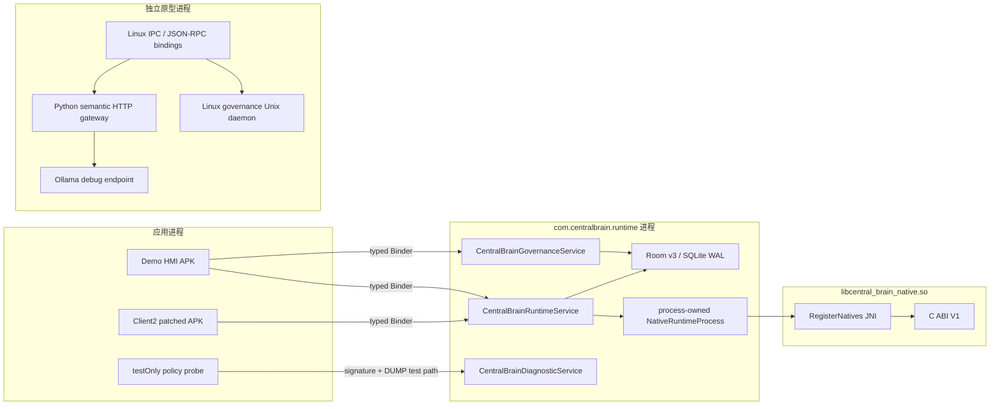
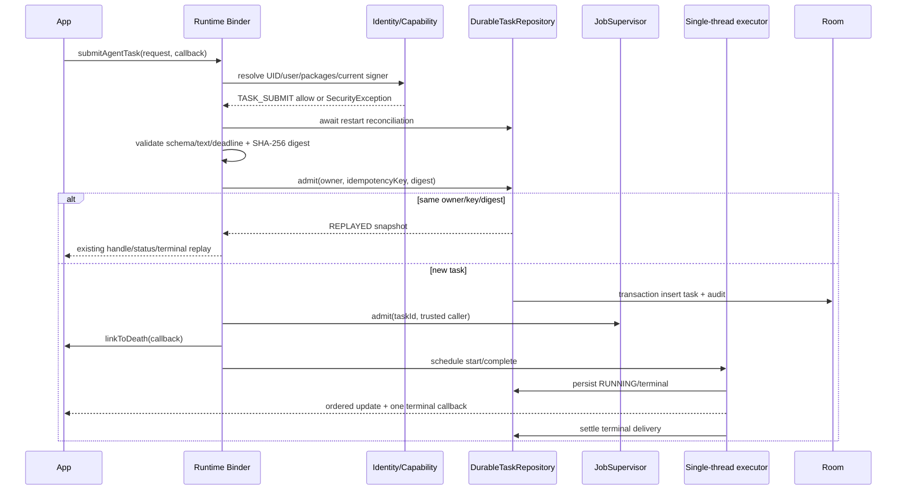

# Central Brain 软件详细设计

| 属性 | 值 |
| --- | --- |
| 版本 | 1.0 |
| 日期 | 2026-07-12 |
| 受众 | Central Brain Android、Native、Python、Linux Binding、测试与集成软件工程师 |
| 状态 | 与当前仓库源码同步；物理控制器、Vendor NPU、VHAL、Driver/HAL 未验证 |

## 1. 文档目的

本文是工程实现级详细设计，不是产品介绍，也不是目标平台能力承诺。它回答以下问题：

1. 当前仓库每个正式软件模块为什么存在、负责什么、明确不负责什么；
2. App、SDK、Binder Service、Room、Native Runtime、Python 原型与 Linux Binding 如何调用；
3. 公开接口、内部接口、状态机、线程模型、数据所有权、错误语义和配置项是什么；
4. 工程师如何在不破坏安全边界和架构 Req ID 的前提下扩展实现；
5. 哪些代码已经进入 Android 集成路径，哪些仅为 contract test、debug sample 或硬件空接口。

本文覆盖需求 `APP-004`、`XSC-001..006`、`FW-U-001..008`、`FW-S-001..006`、
`NV-F-001/011/012`、`NV-G-001..007`、`NV-P-001..006`、`HW-002`、
`KH-003/006/007`、`DEL-001..005`。用户提供的架构图仍是最高层需求基线；偏差和疑点分别由
`CENTRAL_BRAIN_ARCHITECTURE_DEVIATIONS.md` 与 `CENTRAL_BRAIN_ARCHITECTURE_ISSUES.md` 管理。

### 1.1 规范词

- **必须**：违反后会破坏接口兼容、安全边界、数据一致性或 Req ID 验收。
- **应当**：默认实现要求；只有在记录设计理由和验证证据后才允许偏离。
- **不得**：当前工程边界明确禁止。
- **可**：不改变合同语义的实现选择。

### 1.2 权威来源顺序

发生冲突时按以下顺序处理，并在同一提交中修正文档：

1. 用户确认的架构图和 `CENTRAL_BRAIN_ARCHITECTURE_REQUIREMENTS.md`；
2. 已编译接口：AIDL、C 头文件、Room schema export、JSON contract/proto；
3. Runtime/SDK/Repository 的源代码和自动化测试；
4. 本文及其他说明文档。

不得只修改本文来“声明”代码已经具备能力。接口变更必须同时修改源码、合同、测试、本文和路线图。

## 2. 范围、成熟度与硬边界

### 2.1 两条软件路径

| 路径 | 部署目的 | 主要语言 | 当前成熟度 | 量产解释 |
| --- | --- | --- | --- | --- |
| `central-brain/android-runtime/` | 黑盒 Android 13 控制器的实际应用层 Runtime | Java 17、AIDL、C11、JNI、Room | `android_integrated`，模拟器验收完成 | 尚未 `hardware_validated` 或 `production_qualified` |
| `central-brain/backend/` 与 `bindings/` | 验证 UIB、SOA、Governance、Agent、Linux parity 和 simulated-NPU | Python 3、JSON、Unix socket、HTTP | `prototype_implemented` | 不得替代 Android Runtime 或真实 NPU 证据 |

两条路径共享语义和 Req ID，但不共享进程、线程、持久化数据库或安全主体。Python REST gateway 不得成为
Android 生产 Binder Service 的隐式后端；Android Runtime 也不得依赖 Python 进程才能启动。

### 2.2 当前必须保持为 false 的能力

| 标志 | 当前值 | 变更前置条件 |
| --- | --- | --- |
| `production_ready` | `false` | 生产签名、后台策略、系统 owner、升级/回滚和量产安全评审 |
| `target_hardware_validated` | `false` | 物理 Android 13 控制器上的版本化、可复现证据 |
| `vendor_npu_provider_available` | `false` | 厂商 Runtime ABI、模型生命周期、健康/故障和目标硬件测试 |
| `native_runtime_dispatch_enabled` | `false` | 生产 Model Router、Scheduler、Provider 和治理链完成接线 |
| `effect_delivery_activation_allowed` | `false` | durable material、幂等 adapter、状态查询、审批和恢复闭环 |
| `hardware_accessed` | `false` | 明确的 vendor 接口和经批准的 Driver/HAL 接入 |
| `driver_development_triggered` | `false` | 公开 Android/Linux 能力确实不足且缺口已进入 gap backlog |
| `virtualization_development_triggered` | `false` | 本项目不开发 Hypervisor；只维护接口约束 |

“类存在”“测试通过”“APK 可安装”和“readiness snapshot 可查询”都不等于能力已生产启用。

### 2.3 主要源码索引

| 模块 | 权威源码入口 |
| --- | --- |
| Python gateway/governance/Agent/Ollama | `central-brain/backend/mock_npu_service.py`、`runtime_governance.py`、`ai_sdk.py`、`agent_scenarios.py`、`ollama_simulated_npu.py` |
| Android typed AIDL | `central-brain/android-runtime/central-brain-sdk/src/main/aidl/` |
| Android prototype JSON AIDL | `central-brain/bindings/android/aidl/com/centralbrain/binding/ICentralBrainGateway.aidl` |
| Android Runtime Services | `central-brain/android-runtime/runtime-service/src/main/java/com/centralbrain/runtime/` |
| Native ABI/JNI | `central-brain/android-runtime/native-runtime/src/main/cpp/` |
| Client2 bridge | `apk-labs/client2-central-brain/bridge/src/com/centralbrain/client2/` |
| Linux IPC | `central-brain/bindings/linux/ipc/central_brain_ipc_daemon.py`、`central_brain_governance_daemon.py` |
| Linux JSON-RPC/proto | `central-brain/bindings/linux/grpc/central_brain_grpc_server.py`、`central-brain/bindings/linux/proto/central_brain_gateway.proto` |
| Linux CLI | `central-brain/linux-cli/central_brain_cli.py` |

Android Gradle 工程固定包含五个 module：`central-brain-sdk`、`native-runtime`、`runtime-service`、
`demo-hmi`、`policy-probe`。新增、删除或改名必须同时更新 `settings.gradle.kts`、本文、README、构建脚本和交付清单。

## 3. 部署与进程设计



### 3.1 Android Runtime 进程

- 包名：`com.centralbrain.runtime`。
- 最低系统：Android 13 / API 33；当前 `compileSdk=36`、`targetSdk=36`。
- 公开组件：三个 exported Binder Service；release manifest 不包含 Activity。
- 进程 owner：`CentralBrainRuntimeApplication` 只创建一个 `NativeRuntimeProcess`。
- 数据库：`central_brain_runtime.db`，Room version 3，WAL，显式 migration，禁止 destructive fallback。
- 生产 manifest 不声明 `INTERNET`，Runtime 不扫描 device node，不加载 vendor SDK。

### 3.2 Python/Linux 原型进程

- HTTP gateway 默认监听 `0.0.0.0:8787`，只适用于受控开发网络。
- Linux IPC gateway 默认 socket 为 `/tmp/central_brain_gateway.sock`。
- 共享 Governance daemon 默认 socket 为 `/tmp/central_brain_governance.sock`。
- JSON-RPC 风格 TCP sample 默认监听 `127.0.0.1:18788`；它不是 `grpcio` 服务。
- Ollama 默认地址 `http://127.0.0.1:11434`，只作为 simulated-NPU。

## 4. 跨模块通用设计

### 4.1 标识符与追踪

| 字段 | 生成方 | 作用域 | 规则 |
| --- | --- | --- | --- |
| `clientRequestId` | App/SDK caller | 一次业务请求 | 非空、有界；不可作为可信身份 |
| `idempotencyKey` | App/SDK caller | owner 内幂等 | 同 owner + 同 key + 同 digest 才可重放 |
| `taskId` | Runtime repository | Runtime task | 服务端生成；调用方不得伪造所有权 |
| `approvalId` | Approval repository | 审批记录 | 服务端生成；只能由 owner 查询/取消 |
| `trace_id` | binding 或 gateway | 一次语义调用链 | Python envelope 中必须回传；缺失时 gateway 生成 UUID |
| `ownerFingerprint` | Runtime | durable principal | 由 UID、Android user、package/current signer 派生，不接受请求输入 |
| `payloadDigest` | Runtime/repository | durable 内容绑定 | 小写 SHA-256；数据库优先保存 digest，不保存原始用户文本 |

幂等键不能代替 task ID，也不能跨 owner 复用。重放请求若 payload digest 不一致，必须 fail closed。

### 4.2 时钟域

1. Binder deadline、live task retention 和调度使用 `SystemClock.elapsedRealtime()`；不受墙钟校时影响。
2. Room 持久化使用 `*_at_wall_ms`，以支持进程重启后的记录比较。
3. 重启后不得直接把旧的 elapsed time 当成当前 deadline；必须执行 reconciliation 或重新计算。
4. 审批 AIDL 暴露 elapsed time，repository 内保存 wall time，转换逻辑集中在 Governance Service。
5. Python 原型中的墙钟和 uptime 仅用于演示，不是可信安全时钟。

生产 Memory retention、OTA、车辆动作等需要可信时钟时，必须新增明确 provider 和 readiness gate。

### 4.3 错误语义

| 边界 | 错误形式 | 调用方处理 |
| --- | --- | --- |
| Android 同步 Binder | `SecurityException`、`IllegalArgumentException`、`RemoteException` | 不重试权限/参数错误；Binder death 后先重连 |
| Android 异步 task | `TaskFailure(errorCode, retryable)` | 每个 task 只接受一个 terminal callback |
| Python HTTP | HTTP 400/404 或 200 + semantic decision | 不得仅以 HTTP 200 判断动作已执行 |
| Linux socket | `{status,error,payload}` envelope | `status != ok` 时不得读取 payload 为成功结果 |
| C ABI | `cb_status_t` | 不使用 `errno` 推断；只按 ABI 状态码处理 |
| JNI Java wrapper | `IllegalStateException` 或负 status 内部映射 | 不泄漏裸指针，不在 Java 外保存 handle |

策略拒绝、approval required、contract-only rejection 和 hardware gate blocked 是业务决定，不是传输成功。

### 4.4 并发规则

- Binder 入口可能并发到达；共享 admission 必须由 `admissionLock`、同步 repository transaction 或并发容器保护。
- Runtime task 事件由单线程 `ScheduledExecutorService` 串行推进，线程名为
  `central-brain-task-runner`。
- `JobSupervisor`、Scheduler、Event、Memory、Skill 和 test router 的可变状态通过 synchronized 方法保护。
- `ICentralBrainTaskCallback` 是 `oneway`；Service 不得在 Binder 线程等待 App callback 完成。
- `CentralBrainClient.SerialExecutor` 保证同一 task callback 有序，但不同 task 可并发。
- C handle 内部操作受 native mutex 保护；调用方仍必须把 destroy 与所有其他操作串行化。
- Python `ThreadingHTTPServer` 会并发执行 Handler；当前全局注册表只适用于单进程原型，不提供跨进程一致性。

### 4.5 数据与隐私

- Binder caller 的 UID、包名和 signer 必须由 Android `PackageManager` 解析，不能从 JSON/AIDL 请求信任。
- Runtime 的 live `TaskRecord` 可短暂持有 utterance；Room 只持久化 digest 和状态。
- 日志不得输出完整 utterance、模型文本、Memory 内容、token、车辆 payload、serial 或 build fingerprint。
- Diagnostic Binder 只返回有界、只读、已整理的状态；不得提供任务控制或任意 SQL 查询。
- Python/Ollama 原型会把 prompt 发送到本机 Ollama，部署者必须把它视为 debug 数据路径。

## 5. Android SDK 与 AIDL 详细设计

源码根：`central-brain/android-runtime/central-brain-sdk/`。该 module 只包含公开合同和客户端包装，
不得依赖 Runtime 实现类或 Room。

### 5.1 `CentralBrainSdk`

| 常量 | 当前值 | 用途 |
| --- | --- | --- |
| `SDK_NAME` | `central-brain-sdk` | 诊断和 artifact 标识 |
| `SDK_VERSION` | `0.1.0` | AAR 软件版本；不代替 AIDL hash |
| `EVOLUTION_STAGE` | `R4_DURABLE_WORKFLOW` | Runtime 当前基础阶段标识 |
| `MATURITY` | `android_integrated` | 软件集成成熟度，不代表硬件/量产 |

### 5.2 Production Runtime AIDL

接口：`ICentralBrainRuntime`，version `1`，hash 固定为 AIDL 文件中的 64 字符十六进制字符串。

```aidl
int getProtocolVersion();
String getProtocolHash();
TaskHandle submitAgentTask(in AgentTaskRequest request,
                           ICentralBrainTaskCallback callback);
boolean cancelTask(in TaskHandle handle, int reasonCode);
TaskUpdate getTaskStatus(in TaskHandle handle);
```

#### 输入 `AgentTaskRequest`

| 字段 | 类型 | 校验/语义 |
| --- | --- | --- |
| `schemaVersion` | `int` | 必须为 1 |
| `clientRequestId` | `String` | 必填，单字段最大 4096 字符 |
| `sessionId` | `String` | 可为空；只作业务分组，不作身份 |
| `utterance` | `String` | 必填，Runtime 最大 4096；Client2 先缩到 256 |
| `locale` | `String` | 可为空；非空时单字段最大 4096，如 `zh-CN` |
| `deadlineElapsedRealtimeMs` | `long` | 0 表示未指定；非 0 必须晚于当前 elapsed time |
| `priority` | `int` | 必须为 0..3；当前 task stub 校验但生产 Scheduler 策略尚未接线 |
| `idempotencyKey` | `String` | 必填；owner 内唯一并与 payload digest 绑定 |

#### 输出与状态

- `TaskHandle`：`taskId`、`acceptedAtElapsedRealtimeMs`。
- `TaskUpdate`：state、0..100 单调 progress、单调 sequence、短 message。
- `TaskResult`：completionCode、replyText、summary、completed elapsed time。
- `TaskFailure`：errorCode、errorMessage、`retryable`。
- 状态：`UNKNOWN -> ACCEPTED -> RUNNING -> COMPLETED|FAILED|CANCELLED`。
- 当前有效取消原因：USER、CLIENT_DIED、DEADLINE、POLICY。

`UNKNOWN` 是查询结果，不是可持久化 task 状态。完成态不可再次转换；取消和完成竞态由 supervisor 的
原子状态转换决定，后到达者只能得到 already-terminal 结果。

### 5.3 Callback AIDL

`ICentralBrainTaskCallback` 是 `oneway`：

```aidl
void onTaskUpdate(in TaskUpdate update);
void onTaskCompleted(in TaskResult result);
void onTaskFailed(in TaskFailure failure);
```

Service 必须遵守：

1. update sequence 单调；
2. `onTaskCompleted` 与 `onTaskFailed` 合计最多一次；
3. callback Binder death 触发该 owner task 的 system cancel；
4. callback 失败不得阻塞 executor 或导致其他 task 失败；
5. terminal delivery settle 后才能进入可淘汰状态。

### 5.4 Governance AIDL

接口：`ICentralBrainGovernance`，version 1。它只负责快速策略评估和 pending approval 控制：

```aidl
ActionDecision evaluateAction(in ActionRequest request);
ApprovalHandle requestApproval(in ActionRequest request);
ApprovalStatus getApprovalStatus(in ApprovalHandle handle);
boolean cancelApproval(in ApprovalHandle handle);
```

动作目录固定为：

| Action ID | 风险类 | 当前结果原则 |
| --- | --- | --- |
| `vehicle.state.read` | READ_ONLY | 仅在可信 safety state 下 policy-only allow |
| `cabin.temperature.set` | COMFORT_CONTROL | 需要策略判断；不 dispatch |
| `driver.display.video.play` | DRIVER_DISTRACTION | 移动车辆 fail closed |
| `vehicle.diagnostics.write` | DIAGNOSTIC_WRITE | 高风险，approval required/deny |
| `system.ota.install` | OTA | 高风险，approval required/deny |

`ActionDecision.dispatchAllowed` 当前恒为 false。AIDL 故意不提供 `grantApproval`；测试或 App 不得通过
直接修改 Room 状态绕过该限制。

### 5.5 Diagnostics AIDL

接口：`ICentralBrainDiagnostics`，只读分页：

```aidl
DiagnosticPage getPage(in DiagnosticQuery query);
```

- `pageSize` 最大 100；默认 50。
- cursor 是 Service 生成的有界索引，不是数据库游标或 SQL。
- 页面记录包含 type、id、summary、detail、sequence、observed elapsed time。
- 诊断面与 production task control 分离，使用独立 signature permission。

### 5.6 Java 客户端

#### `CentralBrainClient`

公开方法：`connect()`、`reconnect()`、`isConnected()`、协议 version/hash、
`submitAgentTask()`、`cancelTask()`、`getTaskStatus()`、`close()`。

设计规则：

- 使用显式 component `com.centralbrain.runtime/.CentralBrainRuntimeService`，不做隐式 service discovery。
- bind/death 状态由内部锁保护；`close()` 必须幂等。
- 每个 task 使用 `CallbackBridge`，通过原子 terminal 标志阻止重复完成。
- 每个 task 的 callback 进入独立 `SerialExecutor`，最终在调用方提供的 `Executor` 上执行。
- Runtime Binder death 时，所有 active callback 以 `ERROR_SERVICE_DIED`、`retryable=true` 结束。
- 客户端不会自动重提 task；重提必须由业务层使用原 idempotency key 明确执行。

#### `CentralBrainGovernanceClient`

连接、death 和 close 模式与 `CentralBrainClient` 一致。它不缓存策略决定；调用方在动作执行前应重新
评估时效敏感的 Safety State。

### 5.7 AIDL 演进规则

1. 现有字段不得重排、复用或改变含义；新增字段必须给安全默认值。
2. 破坏兼容的修改必须提升 interface version，更新 hash、SDK 测试和 Client2 bridge。
3. 新增 task command 前先判断是否属于 Runtime、Governance 或 Diagnostics；不得把三者重新混成 JSON 万能接口。
4. 所有 Parcelable 必须保留 `schemaVersion` 并在 Service 入口严格校验。
5. 提交前运行 `tools/check_central_brain_android_aidl_contract.sh` 和完整 Android evolution gate。

## 6. Android Runtime Service 详细设计

### 6.1 `CentralBrainRuntimeApplication`

设计意图：把 native handle 的所有权提升到进程生命周期，避免每个 Service 各建一套 C Runtime。

- `onCreate()` 调用 `NativeRuntimeProcess.start(4)`。
- `getNativeRuntimeSnapshot()` 只暴露 immutable snapshot，不暴露 `NativeRuntime` handle。
- `onTerminate()` 仅用于测试环境清理；真实 Android 进程终止不能依赖该回调。
- native start 失败时返回 unavailable snapshot，Java Runtime 仍应 fail-closed 启动诊断面。

### 6.2 `CentralBrainRuntimeService`

#### 设计意图

提供受 signature permission 保护的 typed task 控制面，完成可信身份、幂等 admission、进程内状态机、
Room 持久化、callback 生命周期和重启 reconciliation。当前 task body 是确定性软件 stub，未连接
production Model Router、Effect dispatch 或硬件。

#### 关键容量与时序

| 常量 | 值 | 说明 |
| --- | --- | --- |
| `START_DELAY_MS` | 40 ms | debug task 从 ACCEPTED 到 RUNNING 的调度延迟 |
| `COMPLETE_DELAY_MS` | debug 3000 ms / release 160 ms | 测试竞态窗口，不是模型 SLA |
| `MAX_TEXT_LENGTH` | 4096 | Binder request 文本上限 |
| `MAX_TASK_RECORDS` | 128 | in-memory supervisor 上限 |
| `MAX_REPLAY_CALLBACKS_PER_TASK` | 4 | 同一 durable task 的 callback replay 上限 |
| `TERMINAL_RETENTION_MS` | 5 分钟 | terminal delivery settled 后的内存保留 |

#### submit 顺序



出现 repository admit 成功、supervisor admit 或 callback link 失败时，必须调用
`failUnscheduledAdmission()` 把 durable task 转为 failed；不得留下永久 ACCEPTED 记录。

#### 重启行为

- `onCreate()` 在 task executor 上运行 `reconcileInterruptedTasks()`。
- 新请求在 reconciliation 完成前等待其 `Future`。
- 当前 `task_execution_resume_enabled=false`：重启前的 active task 被 fail-closed reconcile，不恢复业务执行。
- incomplete terminal delivery 保留为可查询状态，但不能伪造 callback 已送达。
- `durable_dispatch_enabled=false` 和 `hardware_accessed=false` 必须出现在日志/readiness 中。

#### 查询与取消

- 先按 live `TaskRecord` 查询，再按 durable owner fingerprint 查询。
- 未找到和非 owner 对外均表现为 unknown/not-applied，避免对象枚举。
- cancel reason 必须属于 AIDL 定义集合。
- callback death 使用 system cancel；App 主动 cancel 使用 caller owner 校验。

### 6.3 `CentralBrainGovernanceService`

设计意图：把动作风险和 Safety State 判断从 HMI/Agent 中移出，形成独立、可审计、fail-closed 的 Binder 面。

- pending 容量：64；默认 TTL：2 分钟。
- state provider：`RuntimeOwnedSafetyVehicleStateProvider`，当前不是硬件可信源。
- policy：`ActionGovernancePolicy`。
- persistence：`DurableApprovalRepository`。
- 所有 action 请求最大字段长度 256。
- `requestApproval` 只有 policy 返回高风险 `APPROVAL_REQUIRED` 时才创建 pending。
- approval grant 不支持；cancel 只允许 owner。
- 所有返回都保持 `dispatchAllowed=false`、`hardware_accessed=false`。

### 6.4 `CentralBrainDiagnosticService`

设计意图：向受信任测试/运维客户端提供有限的 Runtime readiness，而不扩大生产控制面。

当前记录聚合以下 snapshot：native、governance、effect、model、event、memory、skill、runtime acceptance。
每条记录必须是 immutable projection；新增诊断项时不得直接返回 Room entity、调用方身份明文或用户内容。

### 6.5 Manifest 与权限

| Service | 权限 | 能力 |
| --- | --- | --- |
| `CentralBrainRuntimeService` | `com.centralbrain.permission.BIND_RUNTIME` | task submit/status/cancel |
| `CentralBrainGovernanceService` | `com.centralbrain.permission.BIND_GOVERNANCE` | action evaluate/pending approval |
| `CentralBrainDiagnosticService` | `com.centralbrain.permission.ACCESS_DIAGNOSTICS` | bounded read-only diagnostics |

三项权限均为 `signature`。目标设备若使用不同 signer，必须由系统 owner 决定 signer cohort 或受控的
privileged integration；不得把 protection level 降为 normal/dangerous 解决安装问题。

## 7. 身份与 Capability Policy

### 7.1 `AndroidCallerIdentityResolver`

输入是 Binder calling UID；输出 `CallerIdentitySnapshot`：Android user serial、UID、关联 packages、
每个 package 的当前 signer SHA-256 和解析状态。

规则：

1. 多 package UID 不能只取第一个包；policy 必须匹配 package + current signer。
2. 历史 signer 不默认获得权限；当前配置使用 `runtime-current` 语义。
3. 解析失败必须拒绝，不回退到请求声明的 package/client ID。
4. 日志只输出整理后的 audit summary，不输出证书或设备原始标识。

### 7.2 `AndroidCapabilityPolicyLoader`

配置：`runtime-service/src/main/res/xml/central_brain_capability_policy.xml`。

- 根版本必须为 1，`defaultDecision=deny`。
- 未知、缺失、重复 attribute/principal/capability 立即启动失败。
- signer 规则必须是 `runtime-current`。
- release Runtime、Demo 和 Client2 只获得其必要 capability；Diagnostics 不因拥有 Runtime 权限自动放行。

### 7.3 Capability 划分

| 面 | Capability 示例 | 所有权规则 |
| --- | --- | --- |
| Runtime | `PROTOCOL_READ`、`TASK_SUBMIT`、`TASK_STATUS_OWN`、`TASK_CANCEL_OWN` | status/cancel 只能作用于 own task |
| Governance | protocol read、action evaluate、approval request/status/cancel | approval status/cancel 只能作用于 own approval |
| Diagnostics | diagnostics read | 只读，独立授权 |

新增 capability 的步骤见第 18.2 节；不得用 package name 的字符串前缀做授权。

### 7.4 `DurablePrincipalFingerprint`

以 domain `central-brain-principal-v1` 对可信身份规范化并计算 digest。它是 durable ownership key，不是
跨设备用户 ID。算法或 canonical form 变更属于数据库迁移，必须提供旧 owner 映射策略。

## 8. Job Supervisor 与 Scheduler

### 8.1 `JobSupervisor`

设计意图：为 Binder task 提供小型、确定性、owner-isolated 的 live 状态机。

合法转换：

```text
ACCEPTED -> RUNNING | FAILED | CANCELLED
RUNNING  -> COMPLETED | FAILED | CANCELLED
```

- progress 必须单调，范围 0..100；RUNNING 小于 100；COMPLETED 等于 100。
- terminal callback 未 settle 的记录不得被淘汰。
- 达到容量时只能淘汰最旧且已 settle 的 terminal 记录；否则抛出 capacity exceeded。
- `cancelOwned` 使用完整 caller principal；`cancelSystem` 只供 Runtime 内部 death/deadline 路径。

### 8.2 `InferenceResourceScheduler`

设计意图：固定未来模型资源准入合同，包括 effective priority、elapsed deadline、global/per-owner queue、
running quota、provider slot、claim、cancel、settle 和 deadline sweep。

核心接口：

```java
Admission admit(TrustedSubmission submission);
Claim claimNext();
CancelResult cancelOwned(String requestId, String ownerFingerprint, CancelReason reason);
Settlement settle(Lease lease, ProviderTerminalOutcome outcome);
ExpiryReport sweepDeadlines();
ActiveSnapshot findOwned(String requestId, String ownerFingerprint);
SchedulerSnapshot snapshot();
```

当前类有完整 contract test，但 `CentralBrainRuntimeService` 未将 production task 接入 Scheduler。
工程师不得仅因 Scheduler 单测通过而把 `scheduler_production_wired` 改为 true。

## 9. Room 持久化与 Durable Workflow

### 9.1 数据库

`CentralBrainDatabase`：version 3、WAL、单一 DAO `RuntimeStateDao`。当前八张表：

| Entity / 表 | 主键 | 用途 | 关键约束 |
| --- | --- | --- | --- |
| `RuntimeSessionEntity` / `runtime_session` | `session_id` | owner/session 归属 | owner + session key 索引 |
| `RuntimeTaskEntity` / `runtime_task` | `task_id` | durable task 状态 | owner + idempotency key 唯一 |
| `TaskCheckpointEntity` / `task_checkpoint` | `checkpoint_id` | task step digest checkpoint | task 外键 |
| `PendingEffectEntity` / `pending_effect` | `effect_id` | 待执行 effect 元数据 | idempotency key 唯一、task cascade |
| `OutboxEntity` / `effect_outbox` | `outbox_id` | effect delivery claim/retry | effect 外键、状态/重试时间 |
| `ApprovalRequestEntity` / `approval_request` | `approval_id` | pending/cancelled/expired approval | owner + idempotency key 唯一 |
| `AuditEventEntity` / `audit_event` | 自增 sequence | digest-only audit | event ID/type/subject/owner/digest |
| `EventCursorEntity` / `event_cursor` | `cursor_id` | subscription cursor/overflow | owner + client subscription 唯一 |

Room schema export 位于 `runtime-service/schemas/`，必须纳入版本控制。任何 schema 修改必须新增 migration，
运行 v1/v2/v3 reopen tests，不得使用 `fallbackToDestructiveMigration()`。

### 9.2 `DurableTaskRepository`

职责：事务化 admission、幂等 replay、状态转换、terminal delivery settle、owner 查询和重启 reconcile。

- 状态：ACCEPTED、RUNNING、COMPLETED、FAILED、CANCELLED。
- admission 以 owner + idempotency key 定位；payload digest 不同则拒绝。
- audit 与状态写入必须在同一 repository operation 中完成。
- repository 不调用 Binder callback，不拥有 executor，不执行模型。

### 9.3 `DurableEffectRepository`

职责：effect prepare、outbox claim、成功、retry、dead-letter、cancel 和 interrupted claim reconcile。

典型状态链：

```text
PREPARED -> CLAIMED -> APPLIED
                   -> RETRY_WAIT -> CLAIMED
                   -> DEAD_LETTER
PREPARED -> CANCELLED
```

默认最大尝试次数为 3。当前 production dispatch gate 关闭；repository 具备状态机不表示 adapter 会被调用。

### 9.4 `DurableApprovalRepository`

- 状态只有 PENDING、CANCELLED、EXPIRED。
- `request()` 支持 owner 内幂等 replay。
- `findOwned()`、`cancelOwned()` 不泄漏其他 owner 记录。
- `supportsApprovalGrant()` 当前必须返回 false。

### 9.5 `DurableEventCursorRepository`

提供 register/replay conflict、单调 ACK、overflow/resync、owner isolation 和 bounded cancel retention。
schema 与 repository 已完成，但 Event Binder/callback/broker production wiring 仍为 false。

### 9.6 Repository 开发约束

1. Service 不得绕过 repository 直接拼 SQL 或直接修改 entity 状态。
2. 所有可重试外部 effect 必须使用 outbox/idempotency token，不能在 task transaction 内直接调用硬件。
3. 原始 prompt、模型输出、Memory 内容不得写入 audit detail；只保存 digest 和有界 metadata。
4. wall time 只用于 durable 排序/恢复；live deadline 使用 elapsed time。
5. 任何恢复策略必须明确“重新执行”“只查询状态”或“fail closed”，不得隐式重复动作。

## 10. Governance、Effect 与安全状态

### 10.1 `ActionGovernancePolicy`

`classify(actionId)` 返回风险类，`evaluate(actionId, SafetyVehicleStateSnapshot)` 返回 decision。

Fail-closed 条件包括：未知 action、未知 Safety State、移动状态下的 driver distraction、非可信生产状态源。
`getCatalog()` 只返回不可变目录。新增 action 时必须同时更新 AIDL 常量、policy catalog、Demo/测试和文档。

### 10.2 `FixedGovernanceMiddlewareChain`

固定顺序不可由插件重排：

```text
IDENTITY -> SCHEMA -> PRIVACY -> POLICY -> QOS -> TRACE
         -> DISPATCH_GATE -> OUTPUT_GUARD -> AUDIT
```

- 第一处 reject 后，后续业务 stage 标为 SKIPPED。
- AUDIT 无论 allow/deny 都必须 exactly once 记录。
- output 最大 64 KiB。
- 当前通过 `createForContractTest()` 创建，尚未接入 production Runtime task path。

### 10.3 `EffectAdapter`

```java
Descriptor descriptor();
ApplyResult apply(Invocation invocation);
StatusResult queryStatus(String idempotencyToken);
```

生产 adapter 最低要求：

- `IdempotencyMode.TOKEN_DEDUPLICATED`；重复 apply 返回原结果；
- 可查询 applied/not-applied/rejected/unknown；
- payload 最大 64 KiB、envelope 最大 128 KiB；
- payload/envelope 必须与 SHA-256 digest 一致；
- `UNKNOWN` 不得当作成功，必须进入 reconciliation；
- adapter 不得自行绕过 Governance 或读取 App caller 声明身份。

### 10.4 Material 与 Activation Gate

`EffectMaterialSource` 提供 canonical payload/envelope；`EmptyEffectMaterialSource` 当前明确返回不可用。
`EffectDeliveryActivationGate` 在下列条件全部满足前阻断：adapter 安全合同、destination 一致、durable material、
加密/完整性/delete 能力、apply/status 开关和 retention 上限。

`EffectStatusReconciler` 负责 crash window 后按 adapter status 决定 applied、retry、dead-letter 或保持 unknown。
不得通过删除 blocker 常量来“启用”真实动作。

## 11. Model Runtime

### 11.1 `ModelProvider` 接口

```java
Descriptor descriptor();
Snapshot snapshot();
Snapshot warmup(ModelSpec modelSpec);
InferenceHandle infer(InferenceRequest request, StreamObserver observer);
CancelState cancel(String requestId, String reason);
Metrics metrics();
FaultSnapshot lastFault();
void close();
```

关键合同：

- stream chunk 最大 65,536 bytes，sequence 从 1 单调递增；
- model artifact 和输入/输出使用小写 SHA-256 digest；
- deadline 使用 elapsed realtime；
- observer 只能收到一个 terminal result；
- `Assurance.EMPTY/TEST_ONLY/DEBUG_ONLY/PRODUCTION` 决定是否可路由；
- Stub/Ollama 不得声明 hardware-backed 或 production-eligible；
- EMPTY provider 必须无 slot、无 warmup/infer、状态 UNAVAILABLE。

### 11.2 Provider profiles

| Provider | Backend | Assurance | 当前用途 |
| --- | --- | --- | --- |
| `deterministic.stub` | DETERMINISTIC_STUB | TEST_ONLY | JVM/API 33 contract/race 测试 |
| `vendor.npu.empty` | VENDOR_NPU | EMPTY | 固定未来 Vendor NPU 接口，永不路由 |
| Python Ollama adapter | OLLAMA_DEBUG | debug 原型 | 不在 Android Runtime provider registry 中 |

### 11.3 `DeterministicStubModelProvider`

提供 COLD/READY 生命周期、单 slot、有序 stream、cancel ack、有界 metrics/history 和 fault injection。
只能用于测试；生产代码不得通过 build flag 把它悄然升级为 production provider。

### 11.4 `TestOnlyModelRouter`

把 Scheduler 的 admission/lease/cancel/deadline/settlement 与 deterministic provider 连接，fallback 固定
`NO_FALLBACK`。仅允许 `createForContractTest()`；当前 Runtime Service 未实例化它。

### 11.5 Vendor NPU provider 的实现准入

在新增实现前必须具备：vendor Runtime ABI/header/library、支持 ABI、线程和进程模型、模型加载/卸载、
deadline/cancel、健康/故障、reset、内存/热管理、错误码、签名/版本、目标设备 evidence。缺一项时保持
`vendor.npu.empty`，并在 Driver/HAL gap 文档登记，不猜测 ioctl 或 device node。

## 12. Event、Memory 与 Skill

### 12.1 `BoundedEventRuntime`

可信低频 topic：

- `runtime.task.state`
- `governance.policy.decision`
- `model.runtime.health`

接口族：publish、subscribe、owner dispatch、ACK/cursor、cancel、findOwned、snapshot。它提供全局单调
sequence、有界 retention/queue、overflow 和最多 64 个 cancelled tombstone。当前仅 contract test；
production broker、Binder callback、DDS/high-rate data plane 均未接线。

### 12.2 `BoundedMemoryLifecycle`

| Scope | 最大 TTL | 额外要求 |
| --- | --- | --- |
| EPHEMERAL | 5 分钟 | 仅短任务上下文 |
| SESSION | 24 小时 | owner + session 绑定 |
| PROFILE | 30 天 | 必须有可信 consent evidence |

接口族：`write()`、`queryOwned()`、`findOwned()`、`deleteOwned()`、`exportOwned()`、`snapshot()`。
query 返回 redacted record；export 需要可信 authorization。当前没有加密 Room store、Keystore key lifecycle、
consent authority/revocation 或 production repository，不能保存真实用户画像。

### 12.3 `BoundedBuiltInSkillRuntime`

内置 Skill：

| Skill ID | 设计意图 | 当前边界 |
| --- | --- | --- |
| `vehicle.state.query` | 只读车辆状态 | 无 VHAL 硬件源 |
| `cabin.precondition` | 座舱舒适预调节计划 | 不执行真实动作 |
| `cabin.scene.nap` | 小憩场景计划 | 不执行 seat/HVAC/audio effect |

接口族：manifest list/find、admit、findOwned、cancelOwned、snapshot。当前 signer evidence 是 compile-time
合同，不是动态插件的密码学验签；没有动态代码加载。

### 12.4 Readiness snapshot

Model、Event、Memory、Skill、Native、Effect 和 Runtime Acceptance 都通过 immutable snapshot 暴露。
同一 snapshot 必须同时服务 startup log、protected dumpsys 和 Diagnostic Binder，避免三个出口状态漂移。

## 13. Native Runtime C/JNI

源码：`central-brain/android-runtime/native-runtime/`。产物为 AAR，并只包含
`arm64-v8a`、`x86_64` 的 `libcentral_brain_native.so`。

### 13.1 C ABI V1

```c
cb_status_t cb_runtime_create_v1(const cb_runtime_config_v1_t *, cb_runtime_t **);
cb_status_t cb_runtime_get_health_v1(cb_runtime_t *, cb_runtime_health_v1_t *);
cb_status_t cb_runtime_acquire_slot_v1(cb_runtime_t *, uint64_t *lease_id);
cb_status_t cb_runtime_release_slot_v1(cb_runtime_t *, uint64_t lease_id);
cb_status_t cb_runtime_destroy_v1(cb_runtime_t *);
const char *cb_status_name(cb_status_t);
```

#### ABI 结构

- `CB_NATIVE_ABI_VERSION=1`，`CB_NATIVE_MAX_SLOTS=64`。
- handle 为 opaque `cb_runtime_t`；调用方不得访问结构字段。
- config 和 health 以 `struct_size + abi_version` 开头，支持显式 ABI 检查。
- health 暴露 initialized、slot、generation、last status 以及三个能力布尔值。
- `software_provider_available`、`vendor_npu_provider_available`、`hardware_accessed` 当前均为 0。

#### 状态码

`OK`、`INVALID_ARGUMENT`、`ABI_MISMATCH`、`OUT_OF_MEMORY`、`CAPACITY_EXHAUSTED`、
`NOT_FOUND`、`BUSY`、`CLOSED`、`INTERNAL_ERROR`。

destroy 时仍有 active lease 必须返回 BUSY；调用方释放全部 lease 后重试。destroy 成功后 handle 不得再次使用。

### 13.2 JNI

JNI 使用 `JNI_OnLoad + RegisterNatives` 注册五个方法：create、snapshot、acquireSlot、releaseSlot、destroy。

- native pointer 仅在 Java wrapper 内转换为 `jlong`。
- snapshot 固定 10 个 `long`，Java `fromNative()` 必须验证长度和值域。
- acquire 失败返回负的 `cb_status_t`，wrapper 转成异常；release/destroy 返回 status。
- 不缓存 `JNIEnv*`，不保存不必要的 global ref，不使用 name-based 导出入口。
- JNI 只做类型转换和状态映射，不实现 policy、线程池、Room 或业务编排。

### 13.3 Java wrapper

`NativeRuntime` 所有公开方法 synchronized，并实现 `AutoCloseable`：

- constructor 只接受 1..64 slot；
- `snapshot()` 返回 immutable `NativeRuntimeSnapshot`；
- `acquireSlot()` 返回正 lease ID；
- `releaseSlot()` 对未知 lease fail closed；
- `close()` 只有 destroy 成功后才清零 handle；BUSY 时抛异常并保留可重试 handle。

`NativeRuntimeProcess` 捕获 native load/start 故障并转换成 `NativeRuntimeProcessSnapshot`。生产 Runtime 当前只查询
snapshot，不 acquire slot，因此不会触发 inference 或硬件。

### 13.4 C 层禁止项

C 层不得拥有 Binder identity、Android permission、Room、用户 session、prompt、Policy、approval、UI、网络
或 vendor contract 推断；不得添加 `/dev/*` 扫描、任意 ioctl、DMA/IOMMU 或 VHAL 访问，除非对应 gap、
接口、owner 和目标证据均已批准。

## 14. Demo HMI、Policy Probe 与 Client2

### 14.1 Demo HMI

`demo-hmi/DemoActivity.java` 是 SDK 集成样例：

- 通过 `CentralBrainClient` 提交 typed task；
- 通过 `CentralBrainGovernanceClient` 做 action evaluate/approval；
- UI 不直接访问 Room、Native 或 Python gateway；
- Service 未连接时显示明确失败，不自动切换 HTTP；
- Runtime/Governance Binder death 后由 Activity 延迟 500 ms 显式调用 SDK `reconnect()`，最多 10 次；
  任一路连接成功即取消对应重试并刷新 version/hash 状态，`onDestroy()` 取消全部 pending callback。

### 14.2 Policy Probe

`policy-probe` 设置 `android:testOnly=true`，入口受 `android.permission.DUMP` 保护，用于权限正/负向验证。
Runtime debug manifest 中的 probe Activity/Receiver 同样只用于测试。release 构建必须保持三个 Service、零 probe
Activity，不得把 DUMP probe 当作目标集成 API。

### 14.3 Client2 Binder bridge

源码：`apk-labs/client2-central-brain/bridge/`；以 `classes2.dex` 注入隔离的 debug APK。

公开入口：

```java
boolean Client2ScenarioBridge.submit(
    Activity activity,
    String scenarioId,
    String userText,
    ScenarioCallback callback);
```

`ScenarioCallback`：status、reply、failure 三个 UI 回调。允许的 12 个 scenario ID：

```text
care.cold, care.fatigue, task.home, skill.nap,
state.vehicle, memory.preference, skills.catalog, governance.audit,
security.denied, security.privacy, runtime.npu, system.overview
```

桥接规则：

- user text trim 后最多 256 字符；deadline 为当前 elapsed time + 10 秒；priority=1。
- 每次 submission 建一个 `CentralBrainClient`，先校验 protocol version/hash，再 submit。
- `AtomicBoolean terminal` 保证 UI 只收到一个 terminal；完成/失败后总是 close client。
- APK 不申请 INTERNET，不保留 HTTP fallback。
- UI controller 必须 single-flight，悬浮面板不得改变 Tuanjie/Unity render surface 尺寸。
- `runtime.npu` 只验证 readiness 文本，不能解释为 NPU 已运行。

原始 Client2 APK、逆向目录、签名材料和生成 APK 不进入 Git；仓库只跟踪 patch、bridge 和可复现脚本。

## 15. Python 语义原型

### 15.1 `mock_npu_service.py`

设计意图：以一个标准库 HTTP 进程组合 UIB、SOA、Runtime Governance、AI SDK、Agent、Binding registry、
hardware empty-interface 和 simulated-NPU，便于 Android Console/Linux 客户端验证语义。

运行模型：`ThreadingHTTPServer` + `BaseHTTPRequestHandler`；全局 registry 在进程启动时创建。该服务没有 TLS、
认证、生产限流或多进程一致性，只能在受控开发环境使用。

标准 envelope：

```json
{
  "trace_id": "uuid-or-caller-trace",
  "status": "ok",
  "error": null,
  "payload": {},
  "metrics": {"queue_ms": 0.0, "execution_ms": 0.0}
}
```

#### 主要接口族

| 接口族 | HTTP 入口 | 实现语义 |
| --- | --- | --- |
| 健康/状态 | `GET /health`、`/context`、`/uib/state`、`/vehicle/state` | mock/read-only |
| SOA | `GET /soa/services`、`/soa/contracts`；`POST /soa/invoke` | policy/QoS checked mock，不 dispatch |
| Governance | `/governance/runtime`、`/precheck`、`/backend-contract`、`/migration-check`、`/deployment-plan` | 单进程 policy/QoS/audit 原型 |
| UIB Event | topics、publish、recent、subscriptions 及 readiness/evidence 链 | 低频内存事件或 contract-only |
| UIB Action | `POST /uib/actions/request` | permission/safety checked mock，不车控 |
| AI SDK/Agent | capabilities、plan、execute、scenario catalog/run | policy-aware mock |
| Skill/Memory | `GET /skills`、`POST /skills/{id}/invoke`、`POST /memory/query` | contract mock |
| NPU | `GET /npu/status`、`POST /ai/infer` | deterministic mock 或 Ollama debug |
| Binding/Delivery | bindings、adapters、driver gaps、readiness | 只读成熟度与阻塞项 |
| Hardware | `/hardware/interfaces/**` | 空接口、no-store evidence、blocked dry-run |

`/hardware/interfaces/**` 和长 Event activation/evidence 路径是合同和审计闭环视图，不执行 adapter load、
broker activation、Driver/HAL、车辆动作或持久化审批。新增子路径时必须同步 Android sample、Linux IPC、
JSON-RPC map、CLI、contract JSON 和 binding checker。

HTTP 400 只用于 JSON 解析错误，404 用于未知路径；policy deny 等语义通常仍返回 200，因此客户端必须检查
`payload` 内 decision/state/dispatch flags。

### 15.2 `runtime_governance.py`

`RuntimeGovernance` 负责：service registry/contracts、discovery、permission/policy、fixed-window QoS、lifecycle、
recent audit、backend contract、migration check 和 deployment plan。

主要方法：

```python
precheck(request, consume_qos=True)
evaluate_permissions(service_name, method, caller)
evaluate_qos(service_name, qos, consume=True)
record_audit(trace_id, event)
audit_payload(limit=20)
governance_payload()
backend_contract_payload()
migration_check_payload()
deployment_plan_payload()
```

配置 `CENTRAL_BRAIN_AUDIT_LOG` 后以 JSONL 追加并启动时恢复最近 50 条。文件写入只是原型持久化，
不提供锁服务、tamper evidence、rotation 或生产审计保证。

### 15.3 `ai_sdk.py`

职责：从 request 推导 intent，生成 policy-aware plan/execute 结果，列出和调用 mock Skill，执行 mock Memory query。
它不直接访问 Ollama；推理由 gateway 的 NPU adapter 调用。App 不应绕过 AI SDK 直接拼硬件 action。

### 15.4 `agent_scenarios.py`

提供 12 个稳定场景的 catalog 与验收 orchestrator。`run_payload(request, operations)` 调用传入 operation
函数并汇总 check；它是测试 harness，不是新的 Agent Runtime 层。scenario ID 变更必须同步 Client2 allowlist。

### 15.5 `ollama_simulated_npu.py`

配置：

| 环境变量 | 默认值 | 说明 |
| --- | --- | --- |
| `CENTRAL_BRAIN_SIMULATED_NPU_BACKEND` | `mock` | `mock` 或 `ollama` |
| `CENTRAL_BRAIN_OLLAMA_URL` | `http://127.0.0.1:11434` | Ollama HTTP base URL |
| `CENTRAL_BRAIN_OLLAMA_MODEL` | `qwen3.5:27b-optimized` | debug 模型名 |
| `CENTRAL_BRAIN_OLLAMA_TIMEOUT_MS` | `60000` | HTTP timeout |
| `CENTRAL_BRAIN_OLLAMA_NUM_PREDICT` | `96` | 输出 token 上限 hint |
| `CENTRAL_BRAIN_OLLAMA_THINK` | `false` | 是否请求 thinking mode |

adapter 只调用 Ollama user-space HTTP API，必须返回 `hardware_accessed=false`。GPU/CPU 的实际执行由 Ollama
runtime 决定；Central Brain 不能据此声称 PCIe NPU、GPU offload 或性能合格。

### 15.6 Registry 模块

| 模块 | 公开方法 | 设计意图 |
| --- | --- | --- |
| `ProtocolBindingRegistry` | `list_payload/detail_payload/readiness_payload` | 记录 REST/Binder/IPC/JSON-RPC/proto/MQTT/SOME-IP/DDS 成熟度 |
| `NativeAdapterRegistry` | `list_payload/detail_payload/driver_gap_payload` | 记录 AIOS/SOA/Signal/Model/Policy adapter 责任与缺口 |
| `HardwareInterfaceRegistry` | grouped payload/readiness/dry-run methods | 固定 NPU、vehicle、sensor、Ethernet、shared memory/Safety 空接口 |
| `VehicleSignalRegistry` | catalog/activation/validation | VSS-style 只读信号目录与未来读桥准入 |
| `PrototypeReadinessRegistry` | `readiness_payload` | 汇总模块成熟度和 open issue/deviation |
| `delivery_readiness_payload` | function | 汇总 Android/Linux 交付和验证命令 |

这些 registry 不加载动态库、不打开设备、不创建 DDS broker，也不改变 Android production state。

## 16. Protocol Binding

### 16.1 第一阶段 Android JSON Binder sample

`central-brain/bindings/android/` 的 `ICentralBrainGateway`、Binder Service 和 Client 把大量 JSON 方法映射到
Python HTTP gateway，默认上游 `http://10.0.2.2:8787`。它用于原型调试，不是
`central-brain-sdk` typed AIDL，也不应打入 B4 Runtime APK。

扩展该 sample 时必须保持方法与 HTTP/IPC/CLI 语义映射一致；但新的生产 Android 能力应优先进入 typed
AIDL，而不是继续扩大 JSON Binder。

### 16.2 Linux Governance daemon

请求 envelope：

```json
{
  "trace_id": "non-empty",
  "operation": "governance.precheck",
  "payload": {},
  "req_ids": ["XSC-005", "XSC-006"]
}
```

支持 `governance.precheck`、`governance.runtime.get`、`audit.recent.get`。每个 Unix socket connection 读取到
EOF，处理一个 JSON 请求，写一个 JSON + newline 响应。socket mode 为 `0660`，部署者必须用 systemd
User/Group 和目录权限限制 caller。

### 16.3 Linux IPC gateway

`central_brain_ipc_daemon.py` 通过 `OPERATION_MAP` 将稳定 operation 映射到 HTTP method/path。SOA invoke 等
受控操作先调用共享 Governance socket；不可用时进入明确标记的 local fallback。不得静默跳过 precheck。

默认配置：

- `CENTRAL_BRAIN_BASE_URL=http://127.0.0.1:8787`
- `CENTRAL_BRAIN_IPC_SOCKET=/tmp/central_brain_gateway.sock`
- `CENTRAL_BRAIN_GOVERNANCE_SOCKET` 可选共享 daemon
- `CENTRAL_BRAIN_IPC_AUDIT_LOG` 可选 JSONL

### 16.4 JSON-RPC 风格 TCP sample 与 proto

`central_brain_grpc_server.py` 使用标准库 TCP + JSON，并由 `RPC_MAP` 映射语义；名称虽然包含 grpc，当前并未
启动 grpcio。`central_brain_gateway.proto` 是迁移合同。引入真实 gRPC 时必须：

1. 从 proto 生成代码，不手写 wire parser；
2. 保留 shared Governance precheck；
3. 定义 deadline、message size、mTLS/UDS 权限和错误码映射；
4. 并行保留旧 sample 直到 parity tests 通过；
5. 更新 registry maturity，不能直接把 sample 标为 production。

### 16.5 Linux CLI

`central_brain_cli.py` 是人工和 smoke 测试入口，读取 `CENTRAL_BRAIN_BASE_URL`。CLI 命令只映射已有语义，
不得包含绕过 Governance 的隐藏硬件命令。输出应保留 trace、decision 和 false boundary flags。

## 17. Hardware、Driver/HAL 与虚拟化空接口

当前硬件接口按五族管理：

| 接口族 | 目标对象 | 当前实现 | 允许的下一步 |
| --- | --- | --- | --- |
| NPU Runtime | 外置 PCIe NPU | empty provider + Python simulated-NPU | 获得 vendor ABI 后实现 user-space adapter |
| Vehicle | VHAL/vehicle service/CAN/Ethernet | signal catalog + empty adapter | 先做只读 target capability probe |
| Sensor/Media | Camera/Audio/其他 sensor | contract only | 使用公开 Android API 能满足时不新增驱动 |
| Ethernet/Data Plane | SOME/IP、DDS、TSN/PTP | binding registry/contract only | 明确 high-rate 需求后评估 Linux/Android service |
| Safety/Shared Memory | Safety Runtime、ASIL/QM domain | constraint only | 不开发 Hypervisor；只接 owner 提供的受控接口 |

任何 adapter 激活必须经过：owner assignment、接口版本、signer/RBAC、部署配置、smoke、fault recovery、
audit、rollback、Android/Linux parity（适用时）和目标证据。contract-only POST 的 `dry-run` 结果不得持久化、
不得加载 adapter、不得关闭 gate。

## 18. 扩展开发操作手册

### 18.1 新增或修改 AIDL

1. 确定属于 Runtime、Governance 或 Diagnostics，写 Req ID 和 threat boundary。
2. 修改 `central-brain-sdk/src/main/aidl/`；兼容新增字段提供默认值。
3. 更新 Service Stub 和 Java client wrapper，补 Binder death、owner、terminal/race 测试。
4. 更新 protocol version/hash；同步 Demo 和 Client2 bridge。
5. 更新 AIDL contract 文档、本文和 delivery acceptance。
6. 运行 AIDL、Binder lifecycle、capability、Gradle 和 API 33 instrumentation tests。

### 18.2 新增 Capability 或 principal

1. 在 `CallerCapabilityPolicy.Capability` 定义最小能力，不按功能包授予“大权限”。
2. 在 Service 入口调用 `resolveAuthorizedCaller()`；own-resource 操作还必须做 owner fingerprint 校验。
3. 更新 XML policy，保持 `defaultDecision=deny` 和 current signer 规则。
4. 增加 allow、unknown caller deny、wrong signer deny、shared UID/multi-package 测试。
5. 不得通过降低 manifest permission 或接受请求中的 package 字段解决 policy failure。

### 18.3 修改 Room schema/repository

1. 修改 entity/DAO，提升 database version。
2. 新增逐版本 migration；保留旧 migration，不使用 destructive fallback。
3. 导出 schema JSON 并检查 index、foreign key、default value。
4. repository operation 保持事务边界、幂等、owner isolation、digest audit exactly once。
5. 增加 JVM 与 API 33 create/migrate/reopen/reconcile 测试。

### 18.4 接入新的 Model Provider

1. 先提交 `Descriptor`，准确标记 backend/assurance/fallback/hardware/production。
2. 实现 warmup/infer/stream/cancel/metrics/fault/close，验证单 terminal 和 deadline。
3. 连接 Scheduler 之前完成 provider isolation、slot、OOM、crash/reset 和 close race 测试。
4. 通过固定 Governance middleware 后才能接 production router。
5. Vendor provider 未获得目标证据前 assurance 不得设为 PRODUCTION。

### 18.5 新增 Built-in Skill

1. 使用稳定、命名空间化 Skill ID；定义输入/输出 schema、capability、风险、effect intent。
2. 加入 compile-time catalog，禁止下载并执行任意代码。
3. admission 必须绑定 owner/client/idempotency/deadline。
4. 车辆动作只生成受治理 effect，不直接调用 VHAL/adapter。
5. 同步 Python catalog、Client2 场景（若面向演示）和 parity tests。

### 18.6 新增 UIB/SOA 语义接口

1. 在架构需求中确认 FW-U/FW-S Req ID 和语义对象所有权。
2. 先定义 schema、permission、Safety State、QoS、audit 和错误语义。
3. 更新 Python gateway，再同步 Android sample Binder、Linux IPC/RPC/CLI 和 API contract。
4. 运行 `tools/check_central_brain_binding_artifacts.sh`，确保 operation/path/RPC 漂移为零。
5. 若接口要进入 Android 生产路径，另行设计 typed AIDL；不得把 Python JSON 当作生产合同。

### 18.7 接入真实 Effect/VHAL/NPU adapter

1. 在 Driver/HAL gap 文档记录公开能力、缺口、vendor owner、版本和最小开发量。
2. 仅实现 user-space adapter 能解决的部分；只有确有内核缺口时才提 Driver/HAL work item。
3. 先实现 read-only capability/health，再实现 apply；apply 必须幂等和可查询。
4. 接入 durable material/outbox/reconciler、Governance、audit、rollback 和 readiness gate。
5. 先在受控目标设备运行 fault matrix，再由 owner 审批 activation。
6. 保留 empty provider 作为 fail-closed 默认，不以环境变量自动启用生产硬件。

## 19. 构建与验证矩阵

| 改动类型 | 最低验证 |
| --- | --- |
| 本文/架构索引 | `bash tools/check_central_brain_software_detailed_design.sh`、root README check |
| AIDL/SDK | AIDL contract、SDK unit、Binder lifecycle、API 33 instrumentation |
| Runtime/Policy | Job Supervisor、capability、action governance、runtime acceptance |
| Room | durable schema/repository/reopen/reconciliation tests |
| Effect | outbox、terminal、adapter contract、activation gate/wiring |
| Model/Scheduler | provider contract、scheduler、stub、router、readiness |
| Event/Memory/Skill | 各自 contract、durable repository（适用）、readiness |
| Native C/JNI | host ASan/UBSan、Java unit、AAR ABI/ELF/export/hardening |
| Client2 | static patch、12 button Binder、reply UI、Runtime death/reconnect |
| Python semantic | semantic gateway、audit/QoS、binding artifacts |
| Linux binding | governance socket、IPC、JSON-RPC、systemd hardening |
| B4/B5 delivery | manifest/hash/signer/ABI、dry-run installer、GitHub contract |

全量 Android 软件门禁：

```bash
bash tools/check_central_brain_android_runtime_evolution.sh
```

该命令不能替代目标物理控制器验收。B5 测试必须使用不可变 Release、外部 SHA-256、脱敏 evidence 和
structured Issue；只有 tester 对替换版本复测通过后才能关闭 issue。

## 20. 已知限制与未实现项

1. `CentralBrainRuntimeService` 当前完成 task stub，不调用 production Model Router 或 Ollama。
2. Scheduler、Model Router、Event、Memory、Skill 和固定 middleware 的核心类多为 contract-test 软件基线，
   readiness 明确标记 production wiring=false。
3. approval durable，但没有 grant authority；effect outbox durable，但 dispatch gate 关闭。
4. Python Event/Hardware 的长 evidence 链多为 no-store contract，不是 workflow engine。
5. Android JSON Binder sample 依赖 Python HTTP，仅用于原型；B4 typed Runtime 不依赖它。
6. Linux “gRPC” 当前是 JSON TCP sample，不是 grpcio。
7. Ollama 是否使用 CPU/GPU 由其 runtime 决定，且与 PCIe NPU 无关。
8. 物理 Android 13 控制器、生产 signer、后台存活、Client2/RenderService trust、Vendor NPU/VHAL contract
   仍是外部 blocker。
9. 不开发 Linux 前端实际产品、不修改厂商 Android Framework/BSP、不开发虚拟化。

## 21. Code Review Checklist

### 21.1 接口

- [ ] 变更有 Req ID，AIDL/JSON/C ABI/schema 与调用方同步。
- [ ] 没有把 Diagnostics、Governance 和 Runtime task control 混为一个万能接口。
- [ ] 兼容字段有默认值；version/hash/schema migration 已更新。
- [ ] policy deny、transport error、terminal failure 和 hardware blocked 可区分。

### 21.2 安全与数据

- [ ] caller identity 来自 Binder/OS，不来自请求。
- [ ] status/cancel/query 做了 owner isolation。
- [ ] 默认 deny，未降低 signature permission。
- [ ] 日志/Issue/Release 不含用户、模型、Memory、token、车辆 payload 或设备敏感标识。
- [ ] 真实 action 经过 Governance、outbox、idempotency、status reconcile 和 activation gate。

### 21.3 并发与恢复

- [ ] terminal exactly once、callback death、Binder death、cancel/completion race 有测试。
- [ ] 持久化写入在 transaction 中，重启行为明确为 resume/query/fail-closed 之一。
- [ ] deadline 使用正确时钟域；wall/elapsed 没有混用。
- [ ] bounded capacity、retention、queue、payload/message size 有上限。

### 21.4 硬件与交付

- [ ] 没有无合同地扫描 device node、猜 ioctl 或加载 vendor library。
- [ ] hardware/provider/readiness 标志没有被测试实现错误提升。
- [ ] Driver/HAL 只在明确缺口时新增，并记录 Android/Linux 差异。
- [ ] 虚拟化仍为接口约束，不产生 Hypervisor 实现。
- [ ] build、static gate、API 33/目标设备证据与状态声明一致。

## 22. 文档维护

以下变更必须同步更新本文：

- 新增/删除 Gradle module、Runtime package、Python backend module、binding 或 Client2 bridge；
- AIDL 方法/字段、C ABI、Room schema/repository、状态机、错误码、权限、线程或配置变化；
- contract-test 模块进入 production wiring，或任一 hardware/production flag 变化；
- 新增 vendor adapter、Driver/HAL gap、交付 artifact 或目标验收流程。

提交前运行：

```bash
bash tools/check_central_brain_software_detailed_design.sh
bash tools/check_central_brain_root_readme.sh
```

本文的存在只满足 `DEL-003` 工程文档要求的一部分；安装、目标配置、Driver/HAL 和远程验收仍分别以
对应专项文档为准。
