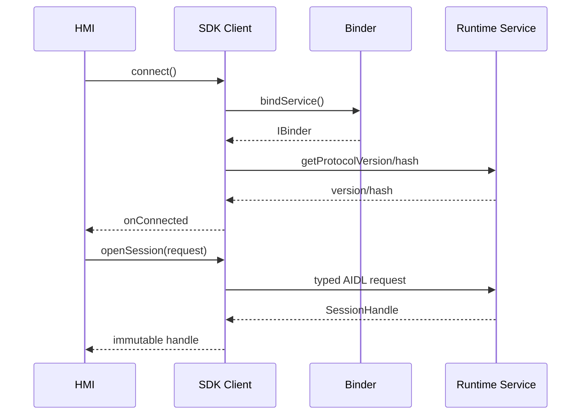

# SDK 与 Binder 合同模块详设

版本：1.0
适用范围：Android 13 生产软件
上级文档：[生产软件开发文档](../CENTRAL_BRAIN_SOFTWARE_DEVELOPMENT.md)

`production_document_scope=true`
`module_detailed_design=true`
`production_ready=false`
`target_hardware_validated=false`

## 1. 设计目标与边界

本模块为 Client2、其他座舱应用和 Central Brain Runtime 之间提供唯一稳定的跨进程入口。设计目标是：

- 以 AIDL 固化事务、Parcelable、状态码和版本协商语义。
- 以 Java facade 隔离 Binder 生命周期、回调串行化、重连和协议不匹配。
- 业务调用方只依赖 SDK，不直接构造 Runtime 内部对象。
- Task、Session、Event、Orchestration、Governance、Diagnostics 使用独立接口，避免权限扩大。

本模块不负责计划执行、模型推理、车辆动作或持久化，只负责合同验证和传输。

## 2. 需求映射

| Req ID | 本模块责任 |
| --- | --- |
| `APP-003` | 在 Parcelable 边界校验来源、标识、截止时间和有界载荷 |
| `S2-SES-001` | 暴露 owner-scoped Session API |
| `S2-EVT-001` | 暴露带游标、ACK、重放和恢复的 Event V2 |
| `S2-SAF-001` | 通过 signature 权限和调用方身份保持安全边界 |
| `S2-OBS-001` | Diagnostics 只返回有界、脱敏的结构化记录 |

## 3. 源码地图

| 代码路径 | 关键符号 | 设计责任 |
| --- | --- | --- |
| [CentralBrainSdk.java](../../central-brain/android-runtime/central-brain-sdk/src/main/java/com/centralbrain/sdk/CentralBrainSdk.java) | `SDK_VERSION`、Service action 常量 | SDK 版本和 Binder action 单一来源 |
| [CentralBrainClient.java](../../central-brain/android-runtime/central-brain-sdk/src/main/java/com/centralbrain/sdk/CentralBrainClient.java) | `connect`、`submitAgentTask`、`CallbackBridge` | Task facade、死亡监听、回调串行化 |
| [SessionClient.java](../../central-brain/android-runtime/central-brain-sdk/src/main/java/com/centralbrain/sdk/SessionClient.java) | `openSession`、`observeSession`、`recoverV2` | Session facade、事件重放和恢复 |
| [OrchestrationClient.java](../../central-brain/android-runtime/central-brain-sdk/src/main/java/com/centralbrain/sdk/OrchestrationClient.java) | `start`、`respondToApproval`、`requestUndo` | 计划运行、审批和撤销 facade |
| [CentralBrainGovernanceClient.java](../../central-brain/android-runtime/central-brain-sdk/src/main/java/com/centralbrain/sdk/CentralBrainGovernanceClient.java) | `evaluateAction`、`requestApproval` | 治理合同 facade |
| [RuntimeContractV2.java](../../central-brain/android-runtime/central-brain-sdk/src/main/java/com/centralbrain/sdk/RuntimeContractV2.java) | 合同常量与验证 | Runtime v2 的公共约束 |
| [TaskCallbackReplayGuard.java](../../central-brain/android-runtime/central-brain-sdk/src/main/java/com/centralbrain/sdk/TaskCallbackReplayGuard.java) | 回调状态机 | 终态唯一和重放去重 |
| [ICentralBrainRuntime.aidl](../../central-brain/android-runtime/central-brain-sdk/src/main/aidl/com/centralbrain/sdk/production/ICentralBrainRuntime.aidl) | `submitAgentTask`、`cancelTask` | typed Task 控制面 |
| [ICentralBrainSessionRuntime.aidl](../../central-brain/android-runtime/central-brain-sdk/src/main/aidl/com/centralbrain/sdk/session/ICentralBrainSessionRuntime.aidl) | `openSession`、`listSessions` | Session 控制面 |
| [ICentralBrainSessionEventsV2.aidl](../../central-brain/android-runtime/central-brain-sdk/src/main/aidl/com/centralbrain/sdk/event/ICentralBrainSessionEventsV2.aidl) | `getEvents`、`acknowledge` | Event V2 数据面 |
| [ICentralBrainOrchestration.aidl](../../central-brain/android-runtime/central-brain-sdk/src/main/aidl/com/centralbrain/sdk/orchestration/ICentralBrainOrchestration.aidl) | `start`、`getSnapshot`、`requestUndo` | 编排控制面 |
| [ICentralBrainGovernance.aidl](../../central-brain/android-runtime/central-brain-sdk/src/main/aidl/com/centralbrain/sdk/governance/ICentralBrainGovernance.aidl) | `evaluateAction`、`requestApproval` | 治理与审批控制面 |
| [ICentralBrainDiagnostics.aidl](../../central-brain/android-runtime/central-brain-sdk/src/main/aidl/com/centralbrain/sdk/diagnostics/ICentralBrainDiagnostics.aidl) | `getPage` | 只读诊断面 |
| [AndroidManifest.xml](../../central-brain/android-runtime/runtime-service/src/main/AndroidManifest.xml) | 三个 signature 权限 | Binder 发布权限 |

## 4. 核心设计

### 4.1 接口分面

`ICentralBrainRuntime` 只接受 Task；`ICentralBrainSessionRuntime` 只修改 Session；Event V2 只处理事件；
Orchestration 只处理计划投影；Governance 只给出策略决定；Diagnostics 永远不能提交动作。

任何新增方法首先判断是否属于现有分面。若会扩大权限或改变事务语义，应增加新接口版本，而不是把方法
塞入权限更宽的接口。

### 4.2 协议协商

每个 Binder 接口均暴露 `getProtocolVersion()` 和 `getProtocolHash()`。客户端建立连接后必须：

1. 读取远端 version/hash。
2. 与 SDK 编译期常量比较。
3. 不兼容时关闭连接并向调用方返回协议错误。
4. 不得在 hash 不匹配后继续调用业务事务。

`aidl-api/*.sha256` 是冻结接口的审查基线。Parcelable 只允许兼容扩展；既有字段语义和事务顺序不得重用。

### 4.3 Binder 生命周期

`CentralBrainClient` 和 `OrchestrationClient` 通过 `ServiceConnection` 与 `linkToDeath` 同时观察连接：

- `onServiceConnected` 只在协议协商成功后发布已连接状态。
- `onBindingDied` 或 DeathRecipient 触发时清空远端引用。
- `reconnect()` 必须先使旧连接失效，防止旧回调覆盖新连接。
- `close()` 必须解除死亡监听、解绑 Service，并拒绝后续调用。

`CallbackBridge` 使用串行执行器保证同一任务的 `update → completed/failed` 顺序；终态之后的重复回调由
`TaskCallbackReplayGuard` 丢弃。

## 5. 接口与数据

| 接口 | 主要输入 | 主要输出 | 所有权 |
| --- | --- | --- | --- |
| `submitAgentTask` | `AgentTaskRequest`、callback | `TaskHandle` | Runtime 生成 task ID |
| `openSession` | `SessionRequest` | `SessionHandle` | Runtime 生成 session ID |
| `registerSessionCallback` | subscription、callback | subscription handle | Runtime 生成 cursor ID |
| `start` | `OrchestrationStartRequest` | `OrchestrationSnapshot` | Session owner 可见 |
| `evaluateAction` | `ActionRequest` | `ActionDecision` | Governance 只返回决定 |
| `getPage` | `DiagnosticQuery` | `DiagnosticPage` | 只读、有界分页 |

跨进程对象应视为不可变快照。SDK 在保存或重新派发对象前执行防御性复制；调用方不能修改对象后把它当作
Runtime 当前状态。

## 6. 关键流程

## 7. 失败关闭与并发

- Binder 未连接、已关闭或协议不匹配时，不缓存车辆动作等待重放。
- 调用方 UID、包名或 signer 不能解析时，Runtime 必须拒绝业务事务。
- RemoteException 映射为稳定 SDK 错误，不能泄露服务内部异常文本。
- callback 不在 Binder 线程直接调用 HMI；必须经过调用方提供的 Executor。
- Event overflow 后必须从服务返回的 cursor 重放，调用方不得自增构造 cursor。
- Diagnostics 的分页大小不得超过 AIDL 常量。

## 8. 代码校对清单

- [ ] AIDL version/hash 与 `aidl-api` 摘要一致。
- [ ] 新 Parcelable 字段有默认值、上限和空值策略。
- [ ] 每个对外调用先执行连接和协议检查。
- [ ] Service death 后不存在可继续使用的旧 Binder 引用。
- [ ] 同一 Task/Session 的回调顺序稳定，终态最多一次。
- [ ] 所有跨进程数组、字节和集合均防御性复制。
- [ ] Diagnostics 没有写事务或原始内容字段。
- [ ] 权限声明与 Service 所属接口严格匹配。

## 9. 增量开发规则

增加接口时依次更新 AIDL、Parcelable、合同 hash、SDK facade、Runtime Stub、权限审查、合同 JSON 和本详设。
若新增字段会让旧客户端误解状态，则创建新版本接口并保留旧版本只读兼容期。

## 10. 当前缺口

- Client2 和 Runtime 的量产 signer 共同所有权尚未形成批准证据。
- 所有接口合同已存在，但目标硬件上的跨进程兼容性不能据此声明完成。
- `production_ready=false`，`target_hardware_validated=false`。
