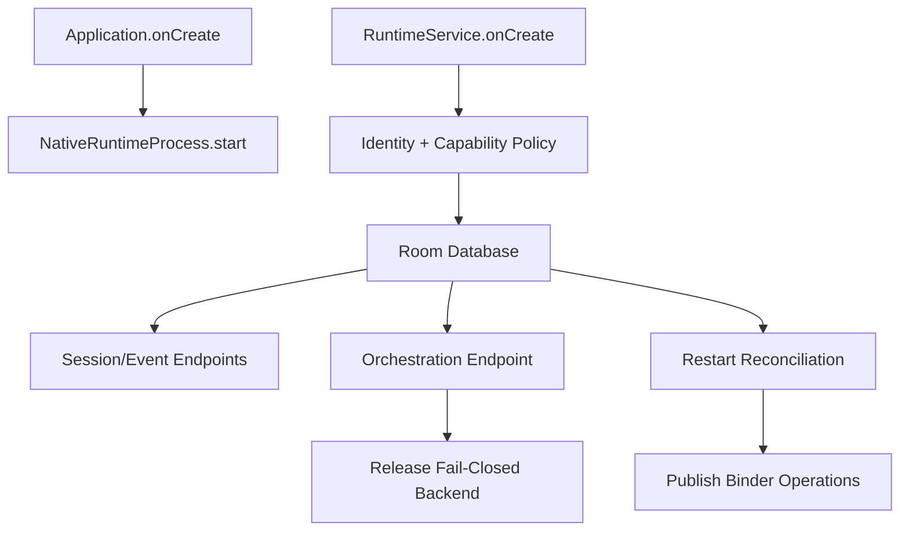
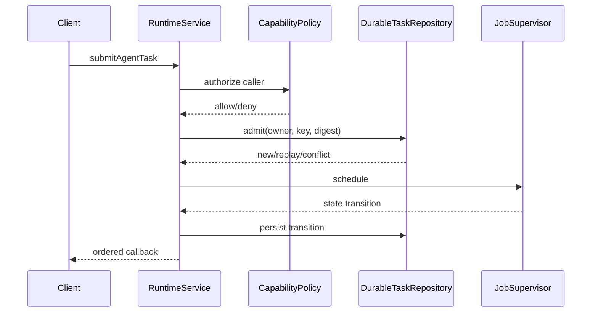

# Runtime Service 组合模块详设

版本：1.0
适用范围：Android 13 生产软件
上级文档：[生产软件开发文档](../CENTRAL_BRAIN_SOFTWARE_DEVELOPMENT.md)

`production_document_scope=true`
`module_detailed_design=true`
`production_ready=false`
`target_hardware_validated=false`

## 1. 设计目标与边界

本模块负责 Central Brain Android 进程的依赖组合、Service 发布、调用方准入、任务调度、启动恢复和关闭顺序。
它是组件装配层，不实现模型、计划或车辆能力的领域算法。

生产变体必须失败关闭：外部权威、车辆 Adapter、模型 Provider 或安全证据未接入时，只发布可查询状态，
不得以固定成功结果替代真实依赖。

## 2. 需求映射

| Req ID | 本模块责任 |
| --- | --- |
| `S2-SES-001` | 装配 durable Session、Event 和 Orchestration endpoint |
| `S2-SAF-001` | 每次 Binder 调用解析身份并执行 capability policy |
| `S2-MDL-005` | 模型 Runtime 不合格时阻止任务进入执行 |
| `S2-HMI-004` | 通过 readiness snapshot 暴露 unavailable，而不是伪造成功 |
| `S2-REL-001` | 启动恢复、发布准入和诊断状态可审计 |

## 3. 源码地图

| 代码路径 | 关键符号 | 设计责任 |
| --- | --- | --- |
| [CentralBrainRuntimeApplication.java](../../central-brain/android-runtime/runtime-service/src/main/java/com/centralbrain/runtime/CentralBrainRuntimeApplication.java) | `onCreate`、`getNativeRuntimeSnapshot` | Native 进程级所有权 |
| [CentralBrainRuntimeService.java](../../central-brain/android-runtime/runtime-service/src/main/java/com/centralbrain/runtime/CentralBrainRuntimeService.java) | `onCreate`、Binder Stub、`startTask`、`completeTask` | Runtime 主组合根和 Task 生命周期 |
| [CentralBrainGovernanceService.java](../../central-brain/android-runtime/runtime-service/src/main/java/com/centralbrain/runtime/CentralBrainGovernanceService.java) | `evaluateAction`、`requestApproval` | 独立治理 Service |
| [CentralBrainDiagnosticService.java](../../central-brain/android-runtime/runtime-service/src/main/java/com/centralbrain/runtime/CentralBrainDiagnosticService.java) | `getPage`、`records` | 有界只读诊断 |
| [OrchestrationBackendFactory.java](../../central-brain/android-runtime/runtime-service/src/release/java/com/centralbrain/runtime/orchestration/OrchestrationBackendFactory.java) | `create` | 生产变体后端选择 |
| [FailClosedOrchestrationBackend.java](../../central-brain/android-runtime/runtime-service/src/main/java/com/centralbrain/runtime/orchestration/FailClosedOrchestrationBackend.java) | `start`、`respondToApproval` | 未接权威时返回 blocked |
| [JobSupervisor.java](../../central-brain/android-runtime/runtime-service/src/main/java/com/centralbrain/runtime/supervisor/JobSupervisor.java) | admit、transition、cancel | 进程内 Task 状态与容量 |
| [RuntimeAcceptanceSnapshot.java](../../central-brain/android-runtime/runtime-service/src/main/java/com/centralbrain/runtime/acceptance/RuntimeAcceptanceSnapshot.java) | readiness getters | 跨模块激活门槛 |
| [AndroidManifest.xml](../../central-brain/android-runtime/runtime-service/src/main/AndroidManifest.xml) | application、services、permissions | 进程和 Service 发布 |

## 4. 核心设计

### 4.1 组合根

`CentralBrainRuntimeService.onCreate()` 按以下顺序装配：

1. `AndroidCallerIdentityResolver`。
2. `AndroidCapabilityPolicyLoader` 与 default-deny policy。
3. `CentralBrainDatabase`。
4. `DurableSessionRegistry`、`DurableEventCursorRepository`、`TransientSessionEndpoint`。
5. `OrchestrationEndpoint` 和生产 `OrchestrationBackendFactory`。
6. Orchestration 与 Task 启动 reconciliation。
7. `DurableTaskRepository`、`JobSupervisor` 和 readiness snapshots。

顺序不能颠倒：Binder 发布前必须完成身份策略、数据库和恢复任务的创建。需要依赖恢复结果的操作通过
`awaitStartupReconciliation()` 或 `awaitOrchestrationStartupReconciliation()` 建立屏障。

### 4.2 Task 生命周期

`submitAgentTask` 的实现顺序是参数校验、身份与 capability 准入、幂等摘要、durable admit、进程内 record
注册、callback 死亡监听和异步调度。状态变更先持久化，再向回调投影。

Task 状态只允许：

`ACCEPTED → RUNNING → COMPLETED|FAILED|CANCELLED`

重放命中同一 owner、幂等键和 payload digest 时返回已有 handle；同一键对应不同摘要时拒绝。

### 4.3 生产后端

`src/release/.../OrchestrationBackendFactory.create()` 当前返回 `FailClosedOrchestrationBackend`。这是明确的
生产安全边界：在 Context authority、Approval authority、Effect Adapter 和 Undo authority 未批准前，
Orchestration API 可用，但结果必须是 blocked/unavailable，不会触发硬件动作。

## 5. 接口与数据

| 组件 | 输入 | 输出 | 线程/所有权 |
| --- | --- | --- | --- |
| Runtime Binder Stub | typed AIDL | handle/snapshot | Binder 线程，立即校验 |
| `JobSupervisor` | Task admission/transition | immutable snapshot | Service 单一逻辑所有者 |
| `DurableTaskRepository` | owner、幂等、状态 | durable snapshot | Room 事务 |
| `OrchestrationEndpoint` | owner-scoped request | projection + event | endpoint 内提交 |
| readiness snapshots | 编译期和装配状态 | blocker list | 只读 |

## 6. 关键流程

Task 提交流程：

## 7. 失败关闭与并发

- `executor` 为单线程调度器，Task transition 和启动恢复不得在 Binder 线程执行长操作。
- `admissionLock` 与 durable transaction 共同防止容量检查和 admit 的竞态。
- Binder callback 失败只影响该 callback，不得回滚已持久化终态。
- 进程重启后不会自动重放外部 Effect；不明确的运行中状态进入失败或待 reconciliation。
- `onDestroy()` 先停止接收任务，再关闭 endpoint、数据库、Native owner 和 executor。
- readiness blocker 不允许被日志、HMI 或调用方参数覆盖。

## 8. 代码校对清单

- [ ] `onCreate()` 中策略和数据库先于可处理的 Binder 调用。
- [ ] 每个业务事务都调用 `resolveAuthorizedCaller`。
- [ ] Task transition 先持久化后回调。
- [ ] 启动恢复不执行未知外部副作用。
- [ ] `release` 后端在权威缺失时仍失败关闭。
- [ ] Service 销毁顺序不会让 callback 或 executor 使用已关闭数据库。
- [ ] readiness 状态来自模块事实，不来自调用方输入。
- [ ] 日志只包含计数、状态和摘要。

## 9. 增量开发规则

新增生产组件时，应通过显式 factory 或 constructor 注入装配，并把激活条件加入 readiness snapshot。
不得在 `CentralBrainRuntimeService` 内直接实现领域算法。需要后台运行的组件必须声明线程、取消、关闭和
重启恢复语义。

## 10. 当前缺口

- 生产 Orchestration 后端尚未激活。
- production Model Router、Vehicle Adapter、consent authority 和持久化 Memory authority 尚未装配。
- `production_ready=false`，`target_hardware_validated=false`。
