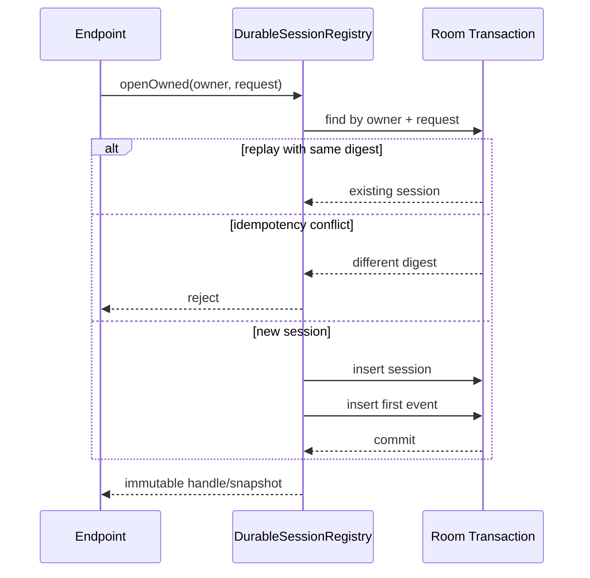

# Session 与持久化模块详设

版本：1.0
适用范围：Android 13 生产软件
上级文档：[生产软件开发文档](../CENTRAL_BRAIN_SOFTWARE_DEVELOPMENT.md)

`production_document_scope=true`
`module_detailed_design=true`
`production_ready=false`
`target_hardware_validated=false`

## 1. 设计目标与边界

本模块负责 Session、Plan、Graph recovery、Event、Task、Effect outbox、Approval 和 Audit 的 durable
事实。Room 数据库是 Runtime 状态的单一持久化所有者，HMI 和模型不能直接访问数据库。

持久化只保存结构化状态、摘要和有界元数据；原始用户文本、模型全文、图像、位置和车辆载荷不得进入
这些表。

## 2. 需求映射

| Req ID | 本模块责任 |
| --- | --- |
| `S2-SES-001` | owner-scoped Session、deadline、状态和恢复 |
| `S2-EVT-001` | Event、cursor、ACK 和 replay 状态持久化 |
| `S2-EFF-001` | Effect、outbox、observation 和 compensation 事实 |
| `S2-MEM-002` | durable 表只保存摘要和引用 |
| `S2-OBS-001` | Audit 采用有界允许字段 |
| `S2-REL-001` | schema migration 和 restart reconciliation |

## 3. 源码地图

| 代码路径 | 关键符号 | 设计责任 |
| --- | --- | --- |
| [CentralBrainDatabase.java](../../central-brain/android-runtime/runtime-service/src/main/java/com/centralbrain/runtime/persistence/CentralBrainDatabase.java) | `VERSION=4`、migrations、`open` | Room schema 和升级 |
| [RuntimeStateDao.java](../../central-brain/android-runtime/runtime-service/src/main/java/com/centralbrain/runtime/persistence/RuntimeStateDao.java) | owner 查询、insert/update、恢复查询 | 唯一 DAO |
| [DurableSessionRegistry.java](../../central-brain/android-runtime/runtime-service/src/main/java/com/centralbrain/runtime/session/DurableSessionRegistry.java) | `openOwned`、`findOwned`、`cancelOwned` | Session 事务与事件追加 |
| [DurableTaskRepository.java](../../central-brain/android-runtime/runtime-service/src/main/java/com/centralbrain/runtime/persistence/DurableTaskRepository.java) | `admit`、`transition`、`settleTerminalDelivery` | Task 幂等与恢复 |
| [DurableEventCursorRepository.java](../../central-brain/android-runtime/runtime-service/src/main/java/com/centralbrain/runtime/persistence/DurableEventCursorRepository.java) | `registerSession`、`acknowledgeSessionOwned` | Event V2 cursor 状态 |
| [DurableEffectRepository.java](../../central-brain/android-runtime/runtime-service/src/main/java/com/centralbrain/runtime/persistence/DurableEffectRepository.java) | `prepare`、`claimNext`、`recordSuccess` | Effect/outbox 原子提交 |
| [DurableApprovalRepository.java](../../central-brain/android-runtime/runtime-service/src/main/java/com/centralbrain/runtime/persistence/DurableApprovalRepository.java) | `request`、`findOwned`、`cancelOwned` | Approval 幂等与过期 |
| [DurableGraphRecoveryRepository.java](../../central-brain/android-runtime/runtime-service/src/main/java/com/centralbrain/runtime/persistence/DurableGraphRecoveryRepository.java) | `persistInitial`、`applyRecovery` | Graph 恢复事实 |
| [DurableOrchestrationProjectionRepository.java](../../central-brain/android-runtime/runtime-service/src/main/java/com/centralbrain/runtime/persistence/DurableOrchestrationProjectionRepository.java) | `commitOwned`、`reconcileInterrupted` | snapshot 与 Event 原子投影 |
| [DurableDigest.java](../../central-brain/android-runtime/runtime-service/src/main/java/com/centralbrain/runtime/persistence/DurableDigest.java) | `sha256` | 领域分隔摘要 |
| [schemas](../../central-brain/android-runtime/runtime-service/schemas/com.centralbrain.runtime.persistence.CentralBrainDatabase/4.json) | Room schema v4 | schema 审查基线 |

## 4. 核心设计

### 4.1 表所有权

| 表 | 主键/唯一约束 | 保存内容 |
| --- | --- | --- |
| `sessions` | `session_id`；owner + client request 唯一 | Session 状态、revision、deadline、摘要 |
| `plans` | `plan_id`；session + revision 唯一 | plan/context/manifest digest |
| `plan_nodes` | plan + node；plan + idempotency 唯一 | node 状态、attempt、checkpoint ref |
| `runtime_events` | `event_id`；session + sequence 唯一 | typed event 元数据和 canonical payload |
| `runtime_task` | `task_id`；owner + idempotency 唯一 | Task 状态和 terminal delivery |
| `task_checkpoint` | `checkpoint_id`；task + sequence 唯一 | step、state、payload digest |
| `pending_effect` | `effect_id`；idempotency 唯一 | desired Effect |
| `effect_outbox` | `outbox_id`；effect 关联 | destination、attempt、not-before |
| `effect_observations` | effect + sequence | reported/verified 观察摘要 |
| `compensations` | `compensation_id`；idempotency 唯一 | before snapshot ref 和补偿状态 |
| `approval_request` | `approval_id`；owner + idempotency 唯一 | 风险、状态和过期时间 |
| `event_cursor` | `cursor_id`；owner + client subscription 唯一 | ACK、overflow、resync |
| `audit_event` | `event_id` | subject、event type 和摘要 |

### 4.2 Session 事务

`DurableSessionRegistry.openOwned()` 在一个事务中执行容量清理、幂等检查、Session insert 和首个 Event
insert。相同 owner/clientRequestId 且摘要相同返回原 Session；摘要不同抛出冲突。

`cancelOwned()` 只允许 owner 操作自己的 Session。终态取消为幂等 no-op；有效取消同时更新 Session revision
和追加 RuntimeEvent。

### 4.3 Outbox

`DurableEffectRepository.prepare()` 必须原子写入 `pending_effect` 和 `effect_outbox`。Dispatcher 通过
`claimNext(destination)` 领取一个到期项；`recordSuccess`、`scheduleRetry` 或 `deadLetter` 必须同时更新
Effect、outbox 和 audit。

数据库存在 outbox 并不代表生产 dispatch 已激活；激活还需 Adapter、material source 和治理证据。

## 5. 接口与数据

Repository 方法必须显式接收 `ownerFingerprint`，不能依赖线程局部身份。摘要采用：

```text
sha256(domain, field1, field2, ...)
```

domain 必须随实体和操作变化，防止同一字段序列跨类型复用。墙钟用于持久化排序和过期记录，
进程内 deadline 仍需转换为单调时钟语义。

## 6. 关键流程



## 7. 失败关闭与并发

- Repository 的多表修改必须通过 `runInTransaction` 完成。
- Room 使用 WAL；不得因此假设跨 Repository 操作天然原子。
- owner 不匹配返回 not found/deny，不能泄露其他 owner 的实体存在性。
- 迁移脚本不得使用 destructive fallback。
- 中断的 `IN_FLIGHT` outbox 只可 requeue 或 dead-letter，不可假设已执行成功。
- 容量回收只删除明确终态实体，并保留关联完整性。
- schema 新版本必须提交导出的 JSON。

## 8. 代码校对清单

- [ ] 每个外部幂等键均绑定 payload/request digest。
- [ ] 每个 owner-scoped 查询同时包含 owner 条件。
- [ ] 多表状态变化位于同一 Room 事务。
- [ ] Event sequence 和 entity revision 单调递增。
- [ ] 恢复查询只选择明确定义的非终态或未结算状态。
- [ ] 无原始用户、模型、图像、位置或车辆载荷字段。
- [ ] migration 保留索引、外键和旧数据可读性。
- [ ] schema JSON 与 `CentralBrainDatabase.VERSION` 一致。

## 9. 增量开发规则

新增 durable 状态时，先定义 owner、主键、幂等键、摘要、终态和保留策略；再增加 Entity、DAO、Repository、
migration、schema JSON 和恢复规则。不能由 HMI 或 Adapter 直接调用 DAO。

## 10. 当前缺口

- Memory 的加密 durable repository 仍未接入本数据库。
- 外部 Effect material 目前没有满足加密、完整性和重启可恢复要求的存储 owner。
- 数据库升级和恢复仍需目标发布证据。
- `production_ready=false`，`target_hardware_validated=false`。
