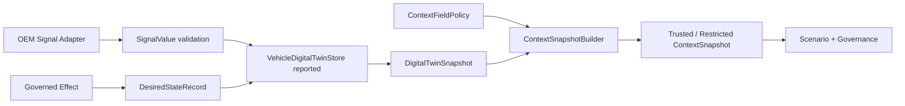

# Context、车辆信号与 Digital Twin 模块详设

版本：1.0
适用范围：Android 13 生产软件
上级文档：[生产软件开发文档](../CENTRAL_BRAIN_SOFTWARE_DEVELOPMENT.md)

`production_document_scope=true`
`module_detailed_design=true`
`production_ready=false`
`target_hardware_validated=false`

## 1. 设计目标与边界

本模块把 OEM 车辆事实转换为可审计的 typed Context，并以 Digital Twin 分离 desired 与 reported 状态。
任何模型、Scenario 或 Effect 都不能直接读取未归一化的车辆载荷。

没有 OEM 信号映射、时间质量或 authority 时，对应字段为 unknown/unavailable；不得用常量值补齐。

## 2. 需求映射

| Req ID | 本模块责任 |
| --- | --- |
| `S2-PER-001` | 只承载有界座位、区域、置信与证据摘要 |
| `S2-CTX-001` | canonical path、type、unit、quality、source、timestamp |
| `S2-CTX-002` | 按 seat-area 融合 freshness、trust 和 conflict |
| `S2-TWN-001` | desired/reported 分离与 reconciliation |
| `S2-ADP-001` | Capability 的 area、range、risk 和 availability |
| `S2-SCN-004` | 乘员事实保持座位区域语义 |

## 3. 源码地图

| 代码路径 | 关键符号 | 设计责任 |
| --- | --- | --- |
| [VehicleSignalPath.java](../../central-brain/android-runtime/runtime-service/src/main/java/com/centralbrain/runtime/vehicle/schema/VehicleSignalPath.java) | enum catalog、`fromCanonicalPath` | canonical 信号目录 |
| [SignalValue.java](../../central-brain/android-runtime/runtime-service/src/main/java/com/centralbrain/runtime/vehicle/schema/SignalValue.java) | typed factories、`validateFreshness` | 信号值和元数据 |
| [SignalTimestamp.java](../../central-brain/android-runtime/runtime-service/src/main/java/com/centralbrain/runtime/vehicle/schema/SignalTimestamp.java) | `ageMs`、`isFresh` | 时间新鲜度 |
| [SignalQuality.java](../../central-brain/android-runtime/runtime-service/src/main/java/com/centralbrain/runtime/vehicle/schema/SignalQuality.java) | `isUsableForDecision` | 质量准入 |
| [SignalSource.java](../../central-brain/android-runtime/runtime-service/src/main/java/com/centralbrain/runtime/vehicle/schema/SignalSource.java) | source assurance | 来源分类 |
| [VehicleCapability.java](../../central-brain/android-runtime/runtime-service/src/main/java/com/centralbrain/runtime/vehicle/capability/VehicleCapability.java) | `CapabilityId`、`TargetRange`、`RiskClass` | 能力合同 |
| [CapabilityCatalog.java](../../central-brain/android-runtime/runtime-service/src/main/java/com/centralbrain/runtime/vehicle/capability/CapabilityCatalog.java) | `stage2Defaults`、`require` | 固定能力目录 |
| [CapabilityAvailability.java](../../central-brain/android-runtime/runtime-service/src/main/java/com/centralbrain/runtime/vehicle/capability/CapabilityAvailability.java) | `canUseProduction` | 合同与生产可用性分离 |
| [VehicleDigitalTwinStore.java](../../central-brain/android-runtime/runtime-service/src/main/java/com/centralbrain/runtime/vehicle/twin/VehicleDigitalTwinStore.java) | `updateReported`、`setDesired`、`snapshot` | Twin 状态所有者 |
| [DigitalTwinSnapshot.java](../../central-brain/android-runtime/runtime-service/src/main/java/com/centralbrain/runtime/vehicle/twin/DigitalTwinSnapshot.java) | `reconcile` | desired/reported 对比 |
| [ContextFieldPolicy.java](../../central-brain/android-runtime/runtime-service/src/main/java/com/centralbrain/runtime/context/ContextFieldPolicy.java) | `general`、`seatComfort`、`seatRecline` | 场景字段策略 |
| [ContextSnapshotBuilder.java](../../central-brain/android-runtime/runtime-service/src/main/java/com/centralbrain/runtime/context/ContextSnapshotBuilder.java) | `build`、`reconcileDrivingState` | Context 归一化和摘要 |
| [ContextSnapshot.java](../../central-brain/android-runtime/runtime-service/src/main/java/com/centralbrain/runtime/context/ContextSnapshot.java) | `ContextField`、`isProductionTrusted` | 不可变决策快照 |

## 4. 核心设计

### 4.1 信号类型

每个 `VehicleSignalPath` 固定声明 scalar type、unit、允许 area 和 maximum age。`SignalValue` 创建时校验：

- path 与 scalar type 一致；
- unit 与 path 一致；
- area 在允许集合中；
- revision 非负；
- valued quality 与实际值一致；
- timestamp 可以计算当前 age。

调用方不能通过字符串动态扩展 path。新增信号必须改动 enum 和合同。

### 4.2 Capability

`VehicleCapability` 把动作能力与信号事实分开。`TargetRange` 负责参数上下限和步长；例如 HVAC 温度采用
180..300 deci-C、步长 5。`CapabilityAvailability.canUseProduction()` 仅在 production available 和
production authorized 同时为真时返回真。

### 4.3 Digital Twin

`VehicleDigitalTwinStore` 是进程内同步状态所有者：

- `updateReported()` 接收来自受信源的 `SignalValue`。
- `setDesired()` 保存治理后动作的期望值和过期时间。
- `compareAndSetDesired()` 防止旧 plan revision 覆盖新目标。
- `snapshot()` 复制 reported/desired 并计算过期。
- `reconcile()` 返回 MATCHED、MISMATCHED、PENDING、EXPIRED 或 UNKNOWN。

### 4.4 Context 构建

`ContextSnapshotBuilder.build()` 按 `ContextFieldPolicy` 从 Twin 读取字段，计算 missing、stale、conflict、
trust 和 source mode。驾驶状态同时比较 Runtime 权威状态与车辆信号；冲突时 `hasMotionConflict=true`，
快照不得用于受限 Effect。

## 5. 接口与数据

```text
OEM signal -> SignalValue -> VehicleDigitalTwinStore.reported
governed action -> DesiredStateRecord -> VehicleDigitalTwinStore.desired
policy + twin snapshot -> ContextSnapshotBuilder -> ContextSnapshot
```

关键不变量：

- `area` 是主键的一部分，driver、front passenger、rear left、rear right 不可合并。
- desired 不是执行成功证据。
- reported 只有质量可用、未过期且来源受信时才能参与决策。
- Context digest 必须覆盖 policy、revision、时间状态、area 和字段摘要。

## 6. 关键流程



## 7. 失败关闭与并发

- `VehicleDigitalTwinStore` 的读取和修改均同步，revision 在锁内递增。
- 同 revision 的不同 reported 值必须拒绝或明确覆盖策略，不能静默倒退。
- required 字段缺失、陈旧、冲突或非生产来源时，Context 为 restricted。
- area 不匹配时不允许 fallback 到 cabin 全局值，除非 policy 明确声明 `CABIN` scope。
- 车辆状态 unknown 或 moving 时，驾驶席座椅受限动作不准入。
- source timestamp 和 received monotonic timestamp 均需保留。

## 8. 代码校对清单

- [ ] 新信号声明了 scalar、unit、area 和 maximum age。
- [ ] 新 Capability 声明 range、risk、reported path 和 required fresh signals。
- [ ] 每个 Context 字段说明 required/optional 和 area scope。
- [ ] seat-area 没有被降级为全舱布尔值。
- [ ] desired 与 reported 使用不同类型和存储入口。
- [ ] 所有 Effect 核验使用 reported，不使用 desired 自证成功。
- [ ] unknown/stale/conflict 路径均有失败关闭结果。
- [ ] 摘要不包含原始图像或自由文本。

## 9. 增量开发规则

接入 OEM 车辆数据时新增独立 Adapter，将 OEM property 映射为 `VehicleSignalPath` 和 `SignalValue`；
映射层不能修改 Runtime schema。必须为每个 path 提供 source、quality、timestamp、area、unit 和 revision，
并在 owner 批准后更新 `CapabilityAvailability`。

## 10. 当前缺口

- OEM vehicle property 到 canonical path 的生产映射尚未提供。
- 生产车辆状态 authority 和 readback source 尚未注册。
- 当前 Capability 目录不能据此视为真实硬件可用。
- `production_ready=false`，`target_hardware_validated=false`。
