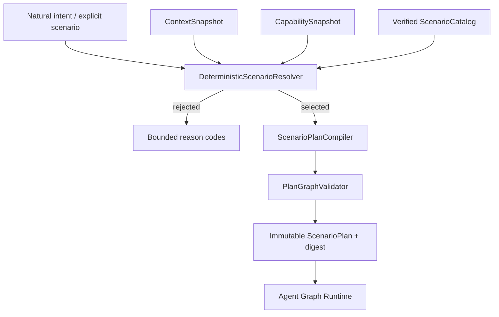
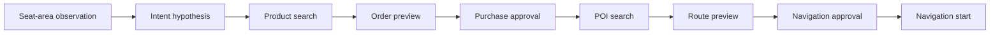

# Scenario 解析与 Plan 编译模块详设

版本：1.0
适用范围：Android 13 生产软件
上级文档：[生产软件开发文档](../CENTRAL_BRAIN_SOFTWARE_DEVELOPMENT.md)

`production_document_scope=true`
`module_detailed_design=true`
`production_ready=false`
`target_hardware_validated=false`

## 1. 设计目标与边界

本模块把自然意图或显式场景请求确定性映射为构建时登记的 `ScenarioManifest`，再编译为不可变
`ScenarioPlan`。模型可以提出候选参数，但不能创建未登记节点、绕过审批或直接指定 Adapter。

购物、路径规划和车辆控制必须建模为不同节点及确认点；从图像得到的用户意图只是候选假设。

## 2. 需求映射

| Req ID | 本模块责任 |
| --- | --- |
| `S2-GRF-001` | 编译不可变、有向无环、版本化 Plan |
| `S2-SCN-001` | 只选择登记且摘要匹配的 Scenario |
| `S2-SCN-002` | 校验节点、依赖、并发、审批、截止和补偿 |
| `S2-SCN-003` | 购物、购买确认、目的地确认和导航启动分离 |
| `S2-SCN-004` | 保留 seat-area 语义 |
| `S2-SCN-005` | 输入证据不足的动作不得进入可执行 Plan |
| `S2-INT-001` | 感知意图保持有时限、可拒绝的候选 |
| `S2-NAV-001` | POI、路线预览、导航启动分层 |
| `S2-COM-001` | 商品、订单预览、订单提交分层 |

## 3. 源码地图

| 代码路径 | 关键符号 | 设计责任 |
| --- | --- | --- |
| [ScenarioManifest.java](../../central-brain/android-runtime/runtime-service/src/main/java/com/centralbrain/runtime/scenario/ScenarioManifest.java) | `NodeTemplate`、`PolicyTemplate`、`FallbackPolicy` | 构建时场景合同 |
| [ScenarioManifestParser.java](../../central-brain/android-runtime/runtime-service/src/main/java/com/centralbrain/runtime/scenario/ScenarioManifestParser.java) | `parse`、`TokenBudget`、unknown-field rejection | 有界严格解析 |
| [ScenarioCatalog.java](../../central-brain/android-runtime/runtime-service/src/main/java/com/centralbrain/runtime/scenario/ScenarioCatalog.java) | `load`、`require`、catalog digest | 清单装载和摘要 |
| [ScenarioResolver.java](../../central-brain/android-runtime/runtime-service/src/main/java/com/centralbrain/runtime/scenario/ScenarioResolver.java) | `Request`、`CapabilitySnapshot` | Resolver 合同 |
| [DeterministicScenarioResolver.java](../../central-brain/android-runtime/runtime-service/src/main/java/com/centralbrain/runtime/scenario/DeterministicScenarioResolver.java) | `resolve`、`rules` | 规则化场景选择 |
| [ScenarioResolution.java](../../central-brain/android-runtime/runtime-service/src/main/java/com/centralbrain/runtime/scenario/ScenarioResolution.java) | decision、reason、digest | 选择结果和拒绝原因 |
| [ScenarioPlanCompiler.java](../../central-brain/android-runtime/runtime-service/src/main/java/com/centralbrain/runtime/scenario/ScenarioPlanCompiler.java) | `compile`、`compileNodes`、`compileDependencies` | Plan 物化 |
| [PlanGraphValidator.java](../../central-brain/android-runtime/runtime-service/src/main/java/com/centralbrain/runtime/scenario/PlanGraphValidator.java) | `validate`、`validateTransport` | DAG 和安全结构校验 |
| [PlanDigest.java](../../central-brain/android-runtime/runtime-service/src/main/java/com/centralbrain/runtime/scenario/PlanDigest.java) | plan digest | canonical Plan 摘要 |
| [scenario schema](../../central-brain/android-runtime/runtime-service/src/main/assets/scenarios/schema/scenario-manifest-v1.schema.json) | JSON Schema | manifest 文件格式 |
| [multimodal manifest](../../central-brain/android-runtime/runtime-service/src/main/assets/scenarios/scene.cabin.multimodal.assist.v1.json) | 座舱多模态节点图 | 购物与导航候选场景 |
| [fatigue manifest](../../central-brain/android-runtime/runtime-service/src/main/assets/scenarios/scene.fatigue.assist.v1.json) | 疲劳关怀节点图 | HVAC、座椅、媒体组合 |

## 4. 核心设计

### 4.1 Manifest

Manifest 固定声明：

- `scenarioId`、version 和 artifact digest；
- 支持的 source 与 zone；
- required/optional Context；
- required/optional Capability；
- risk class；
- node、dependency、policy、compensation；
- fallback 和 HMI 元数据。

Parser 使用字段白名单、深度、token、集合长度和字符串长度上限。未知字段、重复 ID、非法 enum、环依赖、
孤立补偿或摘要不匹配均禁用该 Manifest。

### 4.2 Resolver

`DeterministicScenarioResolver.resolve()` 接收显式 scenario、归一化文本、source、zone、Context、Capability
snapshot 和 Catalog。优先显式且合法的 scenario，再执行固定规则。结果包含候选列表、缺失 Context、缺失
Capability、reason codes 和 resolution digest。

Resolver 不调用模型，也不做车辆动作。匹配规则必须可审查，不能由远端响应动态改写。

### 4.3 Compiler

`ScenarioPlanCompiler.compile()`：

1. 校验 manifest、resolution、context、capability 绑定摘要。
2. 选择需要排除的 optional nodes。
3. 物化 `PlanNode`、`NodePolicy` 和 `NodeDependency`。
4. 为资源冲突生成稳定 `resourceKey`。
5. 计算 plan digest。
6. 调用 `PlanGraphValidator`。

required node 缺失时 Plan 不可执行；optional node 缺失时必须按 fallback 规则排除并保留原因。

## 5. 接口与数据

`ScenarioResolver.Request` 是输入边界；`ScenarioResolution` 是确定性选择证据；`CompileRequest` 绑定：

| 字段 | 约束 |
| --- | --- |
| session/plan ID | canonical UUID |
| revision | 正整数，Session 内单调 |
| resolution digest | 64 位小写摘要 |
| context digest | 来自不可变 ContextSnapshot |
| capability digest | 来自固定 CapabilitySnapshot |
| deadline | 不晚于 Session deadline |

Plan 节点的 `idempotencyKey` 必须可由 session、revision、node 和 target 摘要稳定生成。

## 6. 关键流程

购物路径必须至少表现为：

## 7. 失败关闭与并发

- Catalog 装载完成后不可在运行中被调用方修改。
- Resolver 和 Compiler 是纯决策组件；相同输入摘要必须产生相同输出摘要。
- required Context 不可信或 required Capability 不可用时拒绝，不降级为模型自由规划。
- 高风险节点必须存在审批前驱。
- Effect 节点必须存在可达的 Verification 节点。
- 同一资源并发节点必须由 dependency 或 resource key 串行化。
- 订单提交和导航启动不能共享一次审批。

## 8. 代码校对清单

- [ ] Manifest 的 artifact digest 与实际字节一致。
- [ ] Parser 拒绝未知字段、超限和非法 DAG。
- [ ] Resolver 规则只引用 Catalog 中的 scenario ID。
- [ ] seat-area 在 Request、Context 和节点参数中一致。
- [ ] optional node 排除原因进入 resolution/plan digest。
- [ ] 每个高风险节点有独立审批前驱。
- [ ] 每个 Effect 有 Verification 或明确不可核验终态。
- [ ] 购物、订单、路线和导航启动节点互相独立。

## 9. 增量开发规则

新增场景时先分配 Req ID，再提交 schema 合法的 Manifest、artifact digest、Resolver 规则、Capability 映射、
Plan 编译验证和 HMI 元数据。模型 prompt 不能替代 Manifest 评审。

## 10. 当前缺口

- 多模态场景的生产感知 authority、购物服务、支付 owner 和地图 owner 尚未接入。
- Manifest 已表达流程，但生产执行后端尚未激活。
- `production_ready=false`，`target_hardware_validated=false`。
