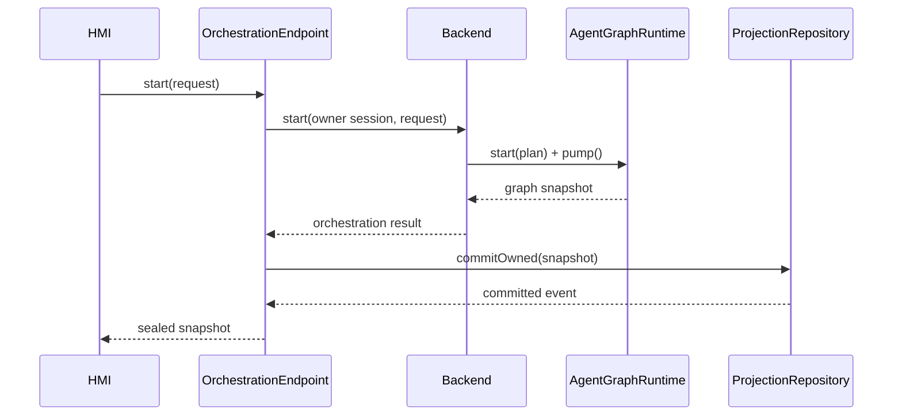

# Agent Graph 与 Orchestration 模块详设

版本：1.0
适用范围：Android 13 生产软件
上级文档：[生产软件开发文档](../CENTRAL_BRAIN_SOFTWARE_DEVELOPMENT.md)

`production_document_scope=true`
`module_detailed_design=true`
`production_ready=false`
`target_hardware_validated=false`

## 1. 设计目标与边界

本模块把 `ScenarioPlan` 作为不可变输入，确定性推进节点状态，处理依赖、审批中断、重试、超时、checkpoint、
撤销和重启 reconciliation。Orchestration Binder 只暴露快照，不允许 HMI 修改内部 Graph 状态。

Graph 执行器不授予动作权限；Policy、Approval 和 Effect 节点仍受 Governance 与 Adapter gate 控制。

## 2. 需求映射

| Req ID | 本模块责任 |
| --- | --- |
| `S2-GRF-001` | 不可变 DAG、节点状态、revision 和 checkpoint |
| `S2-SCN-002` | 依赖、并发、重试、超时和补偿 |
| `S2-SCN-006` | 合规 Triage 到专用 Agent 的确定性路由 |
| `S2-SAF-003` | 独立审批中断和恢复 |
| `S2-SAF-006` | 合规检测输出不得直接调用 Tool 或 Effect |
| `S2-UX-002` | 按节点状态投影计划、审批、执行、核验 |
| `S2-UX-003` | 部分成功、失败、重试、撤销和补偿状态 |
| `S2-HMI-003` | 提供可恢复 OrchestrationSnapshot |

## 3. 源码地图

| 代码路径 | 关键符号 | 设计责任 |
| --- | --- | --- |
| [AgentGraphRuntime.java](../../central-brain/android-runtime/runtime-service/src/main/java/com/centralbrain/runtime/graph/AgentGraphRuntime.java) | `start`、`pump`、`claimNextReadyNode`、`completeClaimedNode` | Graph 状态所有者 |
| [GraphRunState.java](../../central-brain/android-runtime/runtime-service/src/main/java/com/centralbrain/runtime/graph/GraphRunState.java) | `canTransitionTo` | Graph 状态约束 |
| [NodeRunState.java](../../central-brain/android-runtime/runtime-service/src/main/java/com/centralbrain/runtime/graph/NodeRunState.java) | `canTransitionTo`、dependency semantics | Node 状态约束 |
| [NodeExecutorRegistry.java](../../central-brain/android-runtime/runtime-service/src/main/java/com/centralbrain/runtime/graph/NodeExecutorRegistry.java) | `validatePlan`、`validateExecutor` | typed executor 注册表 |
| [NodeExecutionInput.java](../../central-brain/android-runtime/runtime-service/src/main/java/com/centralbrain/runtime/graph/NodeExecutionInput.java) | typed node inputs | 输入 schema |
| [NodeExecutionOutput.java](../../central-brain/android-runtime/runtime-service/src/main/java/com/centralbrain/runtime/graph/NodeExecutionOutput.java) | typed node outputs | 输出 schema |
| [NodeRetryPolicy.java](../../central-brain/android-runtime/runtime-service/src/main/java/com/centralbrain/runtime/graph/NodeRetryPolicy.java) | `decide` | 有界重试 |
| [NodeTimeoutPolicy.java](../../central-brain/android-runtime/runtime-service/src/main/java/com/centralbrain/runtime/graph/NodeTimeoutPolicy.java) | `openAttempt`、`inspect` | 节点与 Plan deadline |
| [ApprovalInterruptExecutor.java](../../central-brain/android-runtime/runtime-service/src/main/java/com/centralbrain/runtime/graph/ApprovalInterruptExecutor.java) | `createPending`、`recordDecision`、`expire` | 审批 checkpoint |
| [ApprovalResumeValidator.java](../../central-brain/android-runtime/runtime-service/src/main/java/com/centralbrain/runtime/graph/ApprovalResumeValidator.java) | `validate` | 恢复时重验安全上下文 |
| [JsonPrimitiveCheckpointSerializer.java](../../central-brain/android-runtime/runtime-service/src/main/java/com/centralbrain/runtime/graph/JsonPrimitiveCheckpointSerializer.java) | `create`、`serialize`、`deserialize` | canonical checkpoint |
| [GraphRestartReconciler.java](../../central-brain/android-runtime/runtime-service/src/main/java/com/centralbrain/runtime/graph/GraphRestartReconciler.java) | `reconcile` | 重启后状态判定 |
| [OrchestrationEndpoint.java](../../central-brain/android-runtime/runtime-service/src/main/java/com/centralbrain/runtime/orchestration/OrchestrationEndpoint.java) | Binder Stub、`committed` | owner-scoped 编排入口 |
| [OrchestrationProjectionFactory.java](../../central-brain/android-runtime/runtime-service/src/main/java/com/centralbrain/runtime/orchestration/OrchestrationProjectionFactory.java) | `blocked`、`seal`、`copySnapshot` | 快照完整性 |
| [CabinComplianceAgentRouter.java](../../central-brain/android-runtime/runtime-service/src/main/java/com/centralbrain/runtime/agent/CabinComplianceAgentRouter.java) | `routeExplicit`、`routeCandidate` | 合规 Agent 确定性路由 |
| [smoking scenario manifest](../../central-brain/android-runtime/runtime-service/src/main/assets/scenarios/scene.cabin.compliance.smoking.v1.json) | `route_smoking_specialist`、`invoke_smoking_detection_agent` | 吸烟检测 response-only DAG |

## 4. 核心设计

### 4.1 状态机

Graph 典型状态：

`QUEUED → RUNNING → WAITING|COMPLETED|PARTIAL|FAILED|CANCELLED|STUCK`

Node 典型状态：

`PENDING → READY → EXECUTING → WAITING|SUCCEEDED|FAILED|SKIPPED|CANCELLED`

补偿节点可进入 `COMPENSATING → COMPENSATED|STUCK`。所有转换通过 enum 的
`canTransitionTo()` 和 Runtime 内部 transition 方法校验，禁止直接改字段。

### 4.2 Typed Executor

`NodeExecutionSchemas` 为每个 node type 固定 input/output class 和 schema ID。
`NodeExecutorRegistry.validateInput/validateResult()` 在执行前后验证：

- node type 与 class 一致；
- input 绑定 plan/session/node、attempt、deadline 和 digest；
- output 只表达结果，不授予 Effect；
- result status、reason 和 output 组合合法。

### 4.3 审批中断

审批节点创建 `ApprovalInterruptRecord`，记录 action、plan、context、policy、safety digest 和过期时间。
收到决定后不直接恢复执行，必须由 `ApprovalResumeValidator` 重验 plan revision、deadline、authority 和
当前 safety state。

### 4.4 重启 reconciliation

`GraphRestartReconciler` 根据 checkpoint、Effect delivery observation、补偿记录和治理重验结果产生
directive。证据不足的执行中 Effect 不能重发；应进入 reconcile、failed 或 stuck。

### 4.5 合规多 Agent 路由

`ComplianceTriageAgent` 的候选结果不等于路由授权。`CabinComplianceAgentRouter.routeCandidate()` 只接受
登记的候选类型、目标场景和不低于 0.5 的置信度，再返回带摘要的专用 Agent 决定。显式 HMI 场景调用
`routeExplicit()`，因此不会因通用模型改写 Agent 名称或场景 ID。

`scene.cabin.compliance.smoking.v1` 的固定节点顺序为：

`capture_compliance_context → route_smoking_specialist → invoke_smoking_detection_agent → validate_smoking_detection_result → render_compliance_result`

该图没有 `tool.invoke` 或 `effect.execute`。后续业务处置必须建立独立场景、策略和审批，不能在检测 Agent
内新增副作用。

## 5. 接口与数据

`OrchestrationEndpoint` 将 Binder 请求映射到 `OrchestrationBackend`，随后由
`DurableOrchestrationProjectionRepository.commitOwned()` 原子保存 snapshot 和 RuntimeEvent。

`OrchestrationSnapshot` 必须包含：

- session/scenario/plan revision；
- graph state 和 pending stage；
- node projections；
- effect projections；
- approval、undo 和 failure reason；
- snapshot digest。

快照返回前由 `OrchestrationProjectionFactory.seal()` 计算或验证 digest。

## 6. 关键流程

## 7. 失败关闭与并发

- `AgentGraphRuntime` 的 public mutation 方法同步，单实例拥有 run map。
- `claimNextReadyNode` 一次只暴露一个已 claim 节点，避免重复执行。
- deadline 到期优先于重试；重试次数和 backoff 有上限。
- Effect 节点重启后无终态证据时不得直接重发。
- approval authority 或 safety digest 变化时恢复被拒绝。
- 生产 `OrchestrationBackend` 未激活时 endpoint 返回 blocked，不得调用 Graph dispatcher。
- HMI cancel 只提交请求，不能直接把 snapshot 标成 cancelled。

## 8. 代码校对清单

- [ ] 所有状态变更通过合法 transition。
- [ ] node input/output schema 与 node type 唯一对应。
- [ ] claim、complete、suspend 和 resume 不能跨 run/node。
- [ ] retry 同时受 node max attempts 和 plan deadline 限制。
- [ ] approval resume 重验当前 safety 和 authority。
- [ ] checkpoint canonical、带摘要、拒绝未知字段和超限。
- [ ] restart 不重复执行证据不明的 Effect。
- [ ] snapshot 提交与 Event 追加在同一 durable 事务。
- [ ] 合规 Agent 路由只接受已登记场景、候选类型和专用 Agent ID。
- [ ] 吸烟检测图保持 response-only，Tool 和 Effect 节点数为零。

## 9. 增量开发规则

新增 node type 时同时增加 schema、typed input/output、registry entry、Graph 状态语义、checkpoint 策略、
重启规则、HMI projection 和 Req ID。只有在生产 authority 全部接入后，才能把 executor registration
标记为 production authorized。

## 10. 当前缺口

- 生产 `OrchestrationBackend` 保持失败关闭。
- production executor dispatcher、approval authority、Effect Adapter 和 undo authority 尚未装配。
- `production_ready=false`，`target_hardware_validated=false`。
