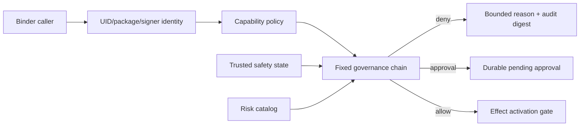

# Governance、Approval 与调用方身份模块详设

版本：1.0
适用范围：Android 13 生产软件
上级文档：[生产软件开发文档](../CENTRAL_BRAIN_SOFTWARE_DEVELOPMENT.md)

`production_document_scope=true`
`module_detailed_design=true`
`production_ready=false`
`target_hardware_validated=false`

## 1. 设计目标与边界

本模块是所有模型、Tool、Skill、HMI 和 Adapter 的动作准入中心。它解析 Binder 调用方身份，匹配 package
与 signer，执行 capability、驾驶状态、风险、隐私、审批和 dispatch route 的固定治理链。

模型输出和用户点击都只是请求，不能自身授予 Effect 权限。安全类执行在 OEM 策略未批准时保持失败关闭。

## 2. 需求映射

| Req ID | 本模块责任 |
| --- | --- |
| `S2-SAF-001` | 身份、capability、驾驶状态、风险和审批校验 |
| `S2-SAF-002` | 行驶状态下限制长文本和高风险交互 |
| `S2-SAF-003` | 座椅、购物和导航的独立审批 |
| `S2-SAF-004` | 所有入口统一经过 Governance |
| `S2-SAF-005` | OEM authority 缺失时失败关闭 |
| `S2-INT-001` | 候选意图不能直接授权 Tool/Effect |

## 3. 源码地图

| 代码路径 | 关键符号 | 设计责任 |
| --- | --- | --- |
| [AndroidCallerIdentityResolver.java](../../central-brain/android-runtime/runtime-service/src/main/java/com/centralbrain/runtime/identity/AndroidCallerIdentityResolver.java) | `resolveCallingIdentity` | UID、Android user、package、signer |
| [CallerIdentitySnapshot.java](../../central-brain/android-runtime/runtime-service/src/main/java/com/centralbrain/runtime/identity/CallerIdentitySnapshot.java) | `samePrincipal`、`auditSummary` | 不可变身份快照 |
| [DurablePrincipalFingerprint.java](../../central-brain/android-runtime/runtime-service/src/main/java/com/centralbrain/runtime/identity/DurablePrincipalFingerprint.java) | `from` | durable owner fingerprint |
| [AndroidCapabilityPolicyLoader.java](../../central-brain/android-runtime/runtime-service/src/main/java/com/centralbrain/runtime/policy/AndroidCapabilityPolicyLoader.java) | `load`、`parsePrincipal` | 固定权限策略装载 |
| [CallerCapabilityPolicy.java](../../central-brain/android-runtime/runtime-service/src/main/java/com/centralbrain/runtime/policy/CallerCapabilityPolicy.java) | `evaluate`、`PrincipalRule` | default-deny capability |
| [central_brain_capability_policy.xml](../../central-brain/android-runtime/runtime-service/src/main/res/xml/central_brain_capability_policy.xml) | principal rules | package/signer/capability 配置 |
| [ActionGovernancePolicy.java](../../central-brain/android-runtime/runtime-service/src/main/java/com/centralbrain/runtime/governance/ActionGovernancePolicy.java) | `classify`、`evaluate` | action 风险和快速决定 |
| [DriverSafetyAdmissionContract.java](../../central-brain/android-runtime/runtime-service/src/main/java/com/centralbrain/runtime/governance/DriverSafetyAdmissionContract.java) | `evaluate`、`ActionRule` | 驾驶安全准入合同 |
| [FixedGovernanceMiddlewareChain.java](../../central-brain/android-runtime/runtime-service/src/main/java/com/centralbrain/runtime/governance/FixedGovernanceMiddlewareChain.java) | `stageOrder`、`evaluate` | 固定治理阶段 |
| [SafetyVehicleStateSnapshot.java](../../central-brain/android-runtime/runtime-service/src/main/java/com/centralbrain/runtime/governance/SafetyVehicleStateSnapshot.java) | `isProductionTrusted` | safety/motion/driver authority |
| [CentralBrainGovernanceService.java](../../central-brain/android-runtime/runtime-service/src/main/java/com/centralbrain/runtime/CentralBrainGovernanceService.java) | Governance Binder Stub | 对外治理接口 |
| [DurableApprovalRepository.java](../../central-brain/android-runtime/runtime-service/src/main/java/com/centralbrain/runtime/persistence/DurableApprovalRepository.java) | `request`、`findOwned`、`cancelOwned` | durable pending approval |

## 4. 核心设计

### 4.1 身份

`AndroidCallerIdentityResolver` 从 Binder UID 获取所属 package，并读取当前 signer SHA-256。解析失败返回
unresolved，不允许 caller 自报 package 或 signer。`DurablePrincipalFingerprint` 把 Android user、package
和 signer 规范化后生成 owner fingerprint，数据库只保存 fingerprint。

### 4.2 Capability Policy

`AndroidCapabilityPolicyLoader` 只接受固定 XML 结构。Runtime 自身 signer 用于验证 principal rule；
`CallerCapabilityPolicy.evaluate()` 默认拒绝，并返回稳定 reason：

- identity unresolved；
- package 未登记；
- signer 不匹配；
- capability 未授予；
- allow。

### 4.3 固定治理链

`FixedGovernanceMiddlewareChain` 的阶段顺序不可由请求改变：

1. Identity
2. Privacy
3. Safety
4. Policy
5. Approval
6. QoS
7. Trace
8. Dispatch
9. Output

每一阶段输出 `StageEvidence`；首个拒绝阶段决定终态。审计只保存 request fingerprint、stage、reason 和
evidence digest。

### 4.4 Approval

高风险动作的 `requestApproval` 只创建 pending handle。当前接口刻意没有 grant 方法；真实批准必须来自
独立可信 HMI/owner authority，并在恢复时再次校验安全状态、plan digest 和 expiry。

## 5. 接口与数据

| 输入 | 必须绑定 |
| --- | --- |
| `ActionRequest` | action ID、target、request/trace digest、owner |
| `SafetyVehicleStateSnapshot` | source、revision、capture time、safety、motion、driver、assurance |
| `PolicyProfile` | policy body digest、owner approvals |
| `ApprovalHandle` | approval ID、owner、action digest、expiry |
| Dispatch evidence | route owner、policy matched、adapter authority |

`ActionDecision` 的 allow 只表示 policy 允许继续，不代表外部动作已经执行。

## 6. 关键流程

## 7. 失败关闭与并发

- unresolved identity、signer mismatch、unknown action 或 unknown safety 均拒绝。
- caller 参数不能声明自己是 driver、owner 或 production authority。
- approval TTL 到期后不可恢复；相同幂等键和不同 action digest 冲突。
- 行驶状态改变后，已批准动作仍需重新校验。
- 审批状态变更和 audit insert 必须在同一事务。
- middleware audit 使用有界 ring；容量淘汰只影响投影，不改变决定。
- Governance 决定不得直接调用 Adapter。

## 8. 代码校对清单

- [ ] 身份只来自 Binder/PackageManager，不来自业务载荷。
- [ ] capability policy 为 default deny。
- [ ] package 与当前 signer 同时匹配。
- [ ] stage order 固定且全部产生 evidence。
- [ ] unknown safety/motion 对高风险动作失败关闭。
- [ ] 每个高风险动作有独立 approval ID 和 expiry。
- [ ] approval resume 重验 plan/context/safety/authority。
- [ ] 审计不含原始文本、图像、位置或车辆载荷。

## 9. 增量开发规则

新增 action 时先加入风险目录和 capability policy，再定义 safety rule、approval requirement、adapter route、
readback 和 audit reason。不得仅在 HMI 中新增按钮或仅在 prompt 中声明白名单。

## 10. 当前缺口

- OEM driver-safety policy、consent owner 和真实 approval authority 尚未批准。
- 当前 Runtime-owned safety provider 不构成 production vehicle authority。
- 安全相关真实执行保持失败关闭。
- `production_ready=false`，`target_hardware_validated=false`。
