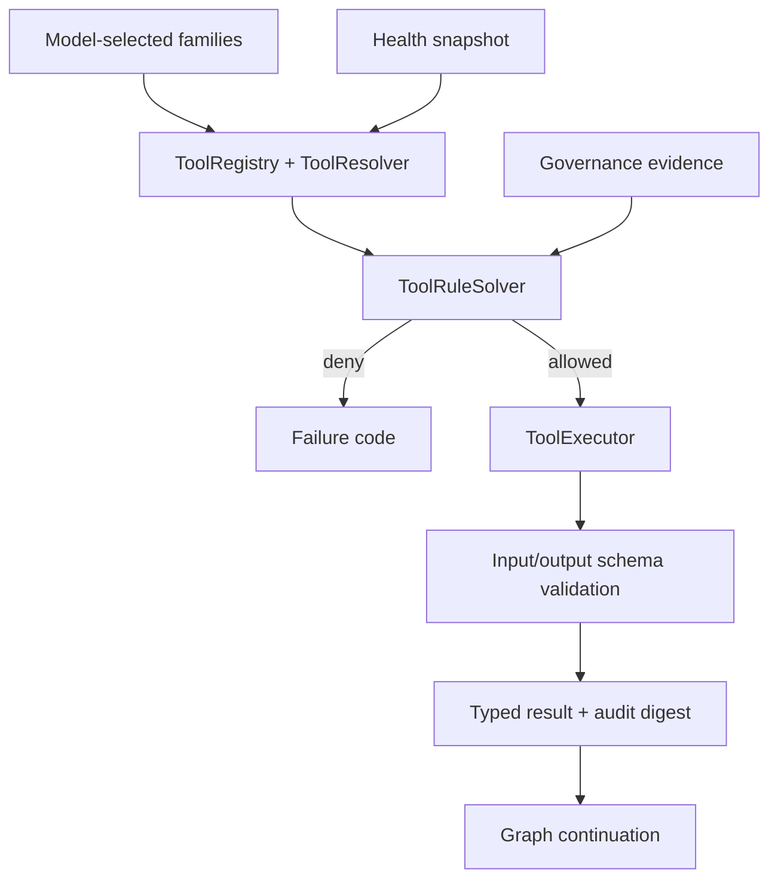

# Tool 与 Skill Runtime 模块详设

版本：1.0
适用范围：Android 13 生产软件
上级文档：[生产软件开发文档](../CENTRAL_BRAIN_SOFTWARE_DEVELOPMENT.md)

`production_document_scope=true`
`module_detailed_design=true`
`production_ready=false`
`target_hardware_validated=false`

## 1. 设计目标与边界

本模块将外部能力表示为版本化 Tool，把复合能力表示为受签名、受权限和受生命周期约束的 Skill。
模型只能选择已登记 family；最终 Tool 选择、Schema 校验、健康检查和执行准入由 Runtime 完成。

Tool/Skill 不得绕过 Governance、直接打开任意网络连接、动态加载未验证代码或访问未声明 capability。

## 2. 需求映射

| Req ID | 本模块责任 |
| --- | --- |
| `S2-TOL-001` | 版本化 Manifest、Schema、健康和 capability |
| `S2-TOL-002` | 确定性版本解析和健康失败关闭 |
| `S2-SKL-001` | Skill 签名、版本、摘要、依赖和权限 |
| `S2-SAF-004` | Tool/Skill 不能绕过 Governance |
| `S2-OBS-001` | 执行审计只保存摘要和状态 |

## 3. 源码地图

| 代码路径 | 关键符号 | 设计责任 |
| --- | --- | --- |
| [ToolManifest.java](../../central-brain/android-runtime/runtime-service/src/main/java/com/centralbrain/runtime/tools/ToolManifest.java) | `ObjectSchema`、`FieldSchema`、`HealthContract` | Tool 合同 |
| [ToolRegistry.java](../../central-brain/android-runtime/runtime-service/src/main/java/com/centralbrain/runtime/tools/ToolRegistry.java) | constructor、`manifestsFor` | 固定注册表 |
| [ToolResolver.java](../../central-brain/android-runtime/runtime-service/src/main/java/com/centralbrain/runtime/tools/ToolResolver.java) | `resolve` | 版本、capability、健康解析 |
| [ToolRuleSet.java](../../central-brain/android-runtime/runtime-service/src/main/java/com/centralbrain/runtime/tools/ToolRuleSet.java) | parent/child、condition、approval rules | 组合约束 |
| [ToolRuleSolver.java](../../central-brain/android-runtime/runtime-service/src/main/java/com/centralbrain/runtime/tools/ToolRuleSolver.java) | `solve` | 确定性选择 |
| [ToolSchemaValidator.java](../../central-brain/android-runtime/runtime-service/src/main/java/com/centralbrain/runtime/tools/ToolSchemaValidator.java) | `validateInput`、`validateOutput` | 严格 typed payload |
| [ToolInvocationContext.java](../../central-brain/android-runtime/runtime-service/src/main/java/com/centralbrain/runtime/tools/ToolInvocationContext.java) | invocation、deadline、capability、idempotency | 调用上下文 |
| [InProcessBuiltInToolExecutor.java](../../central-brain/android-runtime/runtime-service/src/main/java/com/centralbrain/runtime/tools/InProcessBuiltInToolExecutor.java) | `execute`、allowlist、audit | 内建 Tool 执行器合同 |
| [SkillArtifactVerifier.java](../../central-brain/android-runtime/runtime-service/src/main/java/com/centralbrain/runtime/skills/SkillArtifactVerifier.java) | package manifest、`verify` | Skill 包完整性 |
| [SkillSignerPolicy.java](../../central-brain/android-runtime/runtime-service/src/main/java/com/centralbrain/runtime/skills/SkillSignerPolicy.java) | signer allowlist | signer 准入 |
| [SkillVersionPolicy.java](../../central-brain/android-runtime/runtime-service/src/main/java/com/centralbrain/runtime/skills/SkillVersionPolicy.java) | version compatibility | Runtime 版本约束 |
| [BoundedBuiltInSkillRuntime.java](../../central-brain/android-runtime/runtime-service/src/main/java/com/centralbrain/runtime/skills/BoundedBuiltInSkillRuntime.java) | `listManifests`、`admit`、`cancelOwned` | 有界内建 Skill 生命周期 |
| [SkillGovernanceReadinessSnapshot.java](../../central-brain/android-runtime/runtime-service/src/main/java/com/centralbrain/runtime/governance/SkillGovernanceReadinessSnapshot.java) | blockers | 生产激活门槛 |

## 4. 核心设计

### 4.1 Tool Manifest

Manifest 固定声明 tool ID、version、family、owner、input/output schema、capability、risk、timeout、
idempotency 和 health contract。`contractDigest` 覆盖 canonical form，解析时拒绝重复 family/version。

Schema 只支持固定 scalar 和有界 object；unknown field、类型不符、文本/整数越界或 encoded bytes 超限均拒绝。

### 4.2 解析与规则

`ToolResolver.resolve()` 根据 family、版本范围、required capability、required contract digest 和
`ToolHealthSnapshot` 返回唯一 resolution。没有精确健康证据时不静默选择旧版本。

`ToolRuleSolver` 在 Registry resolution 之后应用 init、terminal、child、conditional、approval 和
required-before-exit 规则。模型选择只是候选集合，solver 才产生允许的有序 selection。

### 4.3 执行

`InProcessBuiltInToolExecutor.execute()` 顺序：

1. 验证 manifest、signer、artifact allowlist。
2. 验证 invocation context、deadline、capability 和 idempotency。
3. 验证 input schema。
4. 调用内建 implementation，并周期性 `checkpoint()`。
5. 验证 output schema 和最大字节。
6. 生成不含内容的 audit record。

### 4.4 Skill

Skill package 需同时通过 manifest digest、artifact digest、signer policy、Runtime version 和 capability
校验。当前内建 Skill 采用编译期目录；动态加载在生产中保持关闭。

## 5. 接口与数据

`ToolInvocationContext` 必须绑定 request、session、plan、node、audit correlation、family、contract、
capability、idempotency、issued time、deadline 和 maximum output bytes。

Tool output 仍是 typed 结果，不是车辆动作授权。需要 Effect 的 Tool 必须把候选结果返回 Graph，由
Governance 和 Effect 模块继续处理。

## 6. 关键流程

## 7. 失败关闭与并发

- Registry 和 RuleSet 构造后不可由请求修改。
- 同 family/version 重复注册直接失败。
- health stale、capability 不匹配、contract digest 不匹配均不可执行。
- executor 到期或取消时必须停止产生输出；终态最多一次。
- Tool 不能自行扩大 maximum output bytes 或 deadline。
- Skill signer 和 artifact digest 必须同时匹配。
- 动态代码、任意网络和操作系统隔离能力未批准时保持关闭。

## 8. 代码校对清单

- [ ] Manifest 所有字段进入 contract digest。
- [ ] input/output schema 都执行 unknown-field rejection。
- [ ] Resolver 选择确定且不静默回退。
- [ ] RuleSet 覆盖 init、terminal、approval 和依赖约束。
- [ ] Invocation 绑定 session/plan/node/capability/idempotency。
- [ ] executor 在 deadline/cancel 后不再交付结果。
- [ ] Skill 同时校验 signer、artifact 和 Runtime version。
- [ ] audit 仅含摘要、状态、耗时和错误分类。

## 9. 增量开发规则

新增 Tool 时提交 Manifest、Schema、health contract、allowlist、规则、实现、Governance mapping 和 Graph
node binding。新增 Skill 时额外提交 signer owner、artifact verification、版本兼容和撤销/回滚策略。

## 10. 当前缺口

- production Tool registry、health authority、route owner 和 dispatcher 尚未发布。
- Skill lifecycle store、撤销、回滚、隔离和 production signer evidence 尚未闭环。
- `production_ready=false`，`target_hardware_validated=false`。
