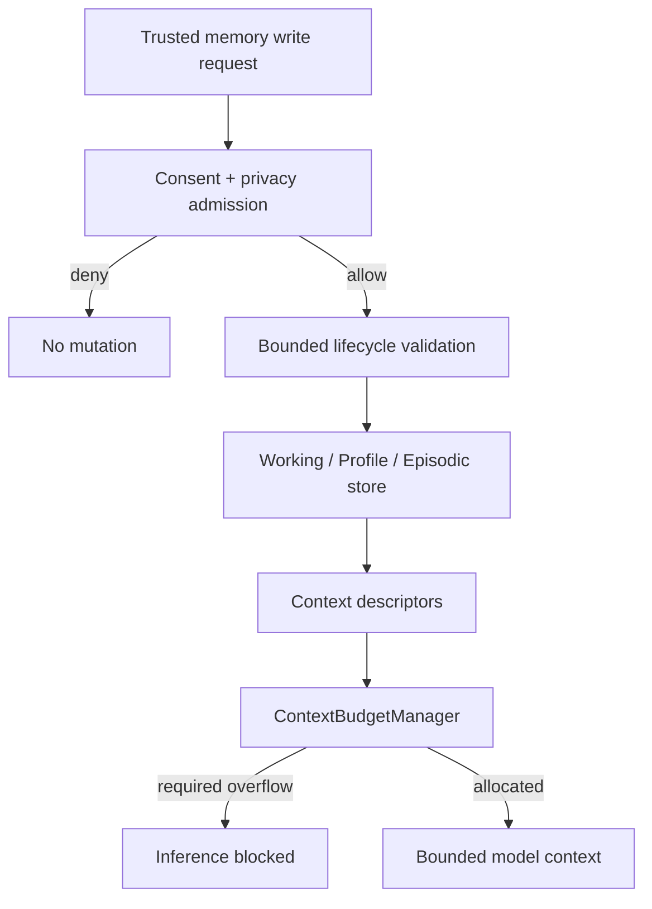

# Memory 与 Context Budget 模块详设

版本：1.0
适用范围：Android 13 生产软件
上级文档：[生产软件开发文档](../CENTRAL_BRAIN_SOFTWARE_DEVELOPMENT.md)

`production_document_scope=true`
`module_detailed_design=true`
`production_ready=false`
`target_hardware_validated=false`

## 1. 设计目标与边界

本模块将 Memory 分为 Working、Profile 和 Episodic 三类，并把用户同意、用途、保留期、删除、导出和
Context token/byte 预算设为强制边界。模型不能直接写入长期 Memory。

当前实现主要是有界领域合同和进程内 store；未接入加密 durable owner 时，production Memory publication
保持关闭。

## 2. 需求映射

| Req ID | 本模块责任 |
| --- | --- |
| `S2-MEM-001` | Working/Profile/Episodic 分层和生命周期 |
| `S2-MEM-002` | 原始用户、模型、车辆和位置内容不进入审计持久层 |
| `APP-004` | 按预算选择可进入模型的座舱 Context |
| `S2-SAF-004` | Memory 写入受 Governance 和 consent authority 约束 |
| `S2-OBS-001` | 只暴露计数、摘要和生命周期状态 |

## 3. 源码地图

| 代码路径 | 关键符号 | 设计责任 |
| --- | --- | --- |
| [WorkingMemoryStore.java](../../central-brain/android-runtime/runtime-service/src/main/java/com/centralbrain/runtime/memory/WorkingMemoryStore.java) | `put`、`readSessionOwned`、`terminateSessionOwned` | Session 短期 Memory |
| [ProfileMemoryStore.java](../../central-brain/android-runtime/runtime-service/src/main/java/com/centralbrain/runtime/memory/ProfileMemoryStore.java) | preference write/read/erase | owner preference 合同 |
| [EpisodicMemoryStore.java](../../central-brain/android-runtime/runtime-service/src/main/java/com/centralbrain/runtime/memory/EpisodicMemoryStore.java) | `store`、`readOwner`、`eraseEpisode` | 场景结果摘要 |
| [BoundedMemoryLifecycle.java](../../central-brain/android-runtime/runtime-service/src/main/java/com/centralbrain/runtime/memory/BoundedMemoryLifecycle.java) | `write`、`queryOwned`、`deleteOwned`、`exportOwned` | 通用生命周期 |
| [MemoryConsentController.java](../../central-brain/android-runtime/runtime-service/src/main/java/com/centralbrain/runtime/memory/MemoryConsentController.java) | `snapshot`、`setRetainedMemoryEnabled` | 用户管理投影 |
| [ContextBudgetManager.java](../../central-brain/android-runtime/runtime-service/src/main/java/com/centralbrain/runtime/memory/ContextBudgetManager.java) | `allocate`、`BudgetPolicy` | token/byte/category 预算 |
| [MemoryRuntimeReadinessSnapshot.java](../../central-brain/android-runtime/runtime-service/src/main/java/com/centralbrain/runtime/memory/MemoryRuntimeReadinessSnapshot.java) | blocker list | production 激活门槛 |
| [PrivacyLifecyclePolicyAdmission.java](../../central-brain/android-runtime/runtime-service/src/main/java/com/centralbrain/runtime/privacy/PrivacyLifecyclePolicyAdmission.java) | `evaluate`、`evaluateOperation` | 保留/删除/导出准入 |

## 4. 核心设计

### 4.1 Working Memory

Working Memory 绑定 owner + session，保存有界 typed payload 副本、schema、token/byte count 和 TTL。
Session 终态时 `terminateSessionOwned()` 清理全部 item，并对内存字节执行覆盖。它不能跨 Session 自动复用。

### 4.2 Profile Memory

Profile Memory 只保存明确允许的偏好 schema，不保存对话全文。每次写入需 consent evidence、owner、
purpose、TTL 和 content digest。用户关闭 retained memory 或清除偏好后，后续模型 Context publication
必须立即停止。

### 4.3 Episodic Memory

Episodic Memory 保存场景 ID、触发类型、结果类型、动作计数、开始/结束时间和 catalog digest。连续车辆
信号和任意载荷不被接受。读、写、删除均需要各自 authority evidence。

### 4.4 Context Budget

`ContextBudgetManager.allocate()` 只接收 metadata descriptor，不接收实际文本。它按 category、required、
priority、token 和 byte 预算确定 INCLUDE、SUMMARIZE、TRUNCATE 或 DROP。required item 无法容纳时，整个
allocation 失败，不能丢弃 required Context 后继续推理。

## 5. 接口与数据

| Memory | owner scope | 生命周期 | 可进入模型 |
| --- | --- | --- | --- |
| Working | owner + session | Session 终态或短 TTL | 当前 Session，按预算 |
| Profile | owner | consent + retention policy | 明确允许的偏好摘要 |
| Episodic | owner + episode | 场景结果 TTL | 只读结果摘要 |

所有 persistent candidate 至少绑定 `schemaId`、`purpose`、`contentDigest`、created/expiry 和 consent evidence。
审计不保存 content reference。

## 6. 关键流程

## 7. 失败关闭与并发

- 所有 store mutation 为同步方法，owner 与容量在同一锁内检查。
- consent 过期、撤销或 owner 不匹配时不返回内容存在性。
- TTL 计算使用单调时钟，并使用饱和加法防止溢出。
- Session 终态清理和显式删除必须幂等。
- required Context budget 超限时阻止模型调用。
- tokenizer 或 summarizer authority 未接入时，只能给出决策，不能声称已生成摘要。
- 未接加密 durable store 时不提升 production readiness。

## 8. 代码校对清单

- [ ] 每条 Memory 有 owner、scope、purpose、schema、TTL 和 digest。
- [ ] 长期写入有 consent 和 privacy authority。
- [ ] Working Memory 在 Session 终态清理并覆盖字节。
- [ ] Episodic Memory 不接收连续原始信号。
- [ ] Profile Memory 不保存对话全文。
- [ ] read/delete/export 使用独立 authority。
- [ ] required budget overflow 阻止推理。
- [ ] 日志与 audit 不含 content reference 或原始内容。

## 9. 增量开发规则

新增 Memory schema 时必须登记 sensitivity、owner scope、consent、retention、delete、export、log mode 和
Context budget category。随后实现 durable encrypted repository、key lifecycle 和 owner-approved migration，
最后才能接入 production model context。

## 10. 当前缺口

- 加密 durable storage、key lifecycle、production consent authority 和 retention clock 尚未接入。
- Memory store 尚未装配到 production Runtime 和模型 Context publication。
- `production_ready=false`，`target_hardware_validated=false`。
