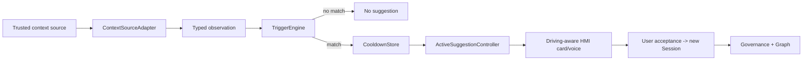

# Event、Trigger 与主动建议模块详设

版本：1.0
适用范围：Android 13 生产软件
上级文档：[生产软件开发文档](../CENTRAL_BRAIN_SOFTWARE_DEVELOPMENT.md)

`production_document_scope=true`
`module_detailed_design=true`
`production_ready=false`
`target_hardware_validated=false`

## 1. 设计目标与边界

本模块提供 typed Event 发布、订阅、游标、重放、背压，以及由受信 Context 产生场景建议的确定性规则。
Trigger 只创建 suggestion，不自动授予模型、Tool 或 Effect 权限。

主动建议在行驶状态下必须减少信息量，支持合并、去重、冷却、拒绝和永久关闭。

## 2. 需求映射

| Req ID | 本模块责任 |
| --- | --- |
| `S2-EVT-001` | typed Event、cursor、ACK、replay 和恢复 |
| `S2-TRG-002` | 主动建议合并、冷却、拒绝和驾驶限制 |
| `S2-CTX-002` | 只接受有 freshness/quality/trust 的 Context |
| `S2-UX-002` | 为 HMI 提供顺序里程碑 |
| `S2-OBS-002` | Runtime 到 Readback 的 ordered projection |

## 3. 源码地图

| 代码路径 | 关键符号 | 设计责任 |
| --- | --- | --- |
| [EventBroker.java](../../central-brain/android-runtime/runtime-service/src/main/java/com/centralbrain/runtime/events/EventBroker.java) | `Topic`、publish/subscribe/replay 合同 | typed broker API |
| [InProcessDurableEventBroker.java](../../central-brain/android-runtime/runtime-service/src/main/java/com/centralbrain/runtime/events/InProcessDurableEventBroker.java) | `publish`、`subscribe`、`replay`、`cancel` | append-before-notify broker |
| [BoundedEventRuntime.java](../../central-brain/android-runtime/runtime-service/src/main/java/com/centralbrain/runtime/events/BoundedEventRuntime.java) | `publish`、`dispatchOwned` | 有界事件生命周期 |
| [EventDeliveryQoS.java](../../central-brain/android-runtime/runtime-service/src/main/java/com/centralbrain/runtime/events/EventDeliveryQoS.java) | overflow、priority、queue contract | 背压语义 |
| [InProcessEventBackpressureQueue.java](../../central-brain/android-runtime/runtime-service/src/main/java/com/centralbrain/runtime/events/InProcessEventBackpressureQueue.java) | `offer`、`drainOwned` | 队列压力处理 |
| [ContextSourceAdapter.java](../../central-brain/android-runtime/runtime-service/src/main/java/com/centralbrain/runtime/events/ContextSourceAdapter.java) | descriptor、observation、adaptation result | Context source 归一化 |
| [TriggerRule.java](../../central-brain/android-runtime/runtime-service/src/main/java/com/centralbrain/runtime/events/TriggerRule.java) | metric、threshold、window、cooldown | 触发规则 |
| [TriggerEngine.java](../../central-brain/android-runtime/runtime-service/src/main/java/com/centralbrain/runtime/events/TriggerEngine.java) | `evaluate`、`ScenarioSuggestion` | 确定性建议生成 |
| [CooldownStore.java](../../central-brain/android-runtime/runtime-service/src/main/java/com/centralbrain/runtime/events/CooldownStore.java) | `reserve` | suggestion 冷却 |
| [ProactiveConsentPolicy.java](../../central-brain/android-runtime/runtime-service/src/main/java/com/centralbrain/runtime/events/ProactiveConsentPolicy.java) | `mutate`、`evaluate` | 主动执行候选准入 |
| [ActiveSuggestionController.java](../../central-brain/android-runtime/runtime-service/src/main/java/com/centralbrain/runtime/suggestion/ActiveSuggestionController.java) | `ingest`、`dismiss`、`neverAsk`、`snapshot` | HMI 建议投影 |
| [TransientSessionEndpoint.java](../../central-brain/android-runtime/runtime-service/src/main/java/com/centralbrain/runtime/session/TransientSessionEndpoint.java) | Event V1/V2 Binder Stub、dispatch | Session Event 出口 |

## 4. 核心设计

### 4.1 Event Broker

Topic 固定绑定 topic ID、schema ID、payload class 和 event kinds。`publish()` 先追加到 retained/durable
事实，再通知 subscriber。相同 request ID 和相同 payload 返回 replay；不同 payload 冲突。

Subscriber 绑定 owner、client subscription ID、topic、after cursor 和 filter。replay 返回 earliest/latest/
next cursor 和 `hasMore`，调用方不解析 cursor 内部。

### 4.2 背压

每个 subscriber 有固定 queue capacity 和 overflow policy：

- critical event 不允许静默丢弃；
- 可合并状态按 coalesce key 替换旧值；
- drop-old 必须返回 displaced cursor；
- retention gap 或 overflow 后进入 resync required；
- consumer failure 可关闭订阅，并提供 replay cursor。

### 4.3 Trigger

`TriggerEngine.evaluate()` 对 observation 执行 source、quality、freshness、zone、threshold、持续窗口、sample
gap、debounce 和 cooldown 校验。满足条件时生成 `ScenarioSuggestion`，其中
`isAutoExecutionRequested=false`、`isEffectDispatchRequested=false`。

### 4.4 Suggestion HMI

`ActiveSuggestionController` 合并同一 owner/scene/scope 候选，记录 cooldown 和 never-ask scope。行驶中使用
最小化 presentation，只提供短语音和低注意力动作；它不持有 Effect 权限。

## 5. 接口与数据

`RuntimeEvent` 是 Session 事件；`EventBroker.EventRecord` 是模块内 topic 事件。两者都必须包含 sequence、
published time、source/owner、schema、payload digest 和 event digest，不保存自由内容。

Trigger observation 至少包含 observation ID、metric、zone、scope digest、observed time、quality、typed value
和 source evidence digest。

## 6. 关键流程

## 7. 失败关闭与并发

- Broker mutation 拒绝 callback reentrancy。
- sequence 在锁内单调增长；notify 发生在 append 之后。
- subscriber owner 不匹配时拒绝，不泄露 cursor。
- critical event overflow 触发 resync/disconnect，不能伪造 delivered。
- Context source 不可信、陈旧或质量无效时 Trigger 不匹配。
- suggestion 不能调用模型、Graph 或 Effect，必须经用户/consent 和 Session 入口。
- never-ask 和 cooldown 需要 production durable owner 后才可跨进程保持。

## 8. 代码校对清单

- [ ] Topic、schema 和 payload class 一一对应。
- [ ] publish 先持久化/保留再通知。
- [ ] cursor、ACK、overflow 和 resync 状态单调。
- [ ] critical event 无静默丢弃路径。
- [ ] Trigger 校验 source、quality、freshness、zone 和时间窗口。
- [ ] suggestion 明确不授予 auto execution 或 Effect。
- [ ] 行驶模式只显示最小信息。
- [ ] Event 与 audit 不保存原始模型或车辆载荷。

## 9. 增量开发规则

新增 Event topic 时定义 topic/schema/kind、owner operation、retention、QoS 和 HMI projection。新增 Trigger
时定义 metric、source authority、zone、window、cooldown、场景 Manifest 和 suggestion 文案；不得直接绑定
Adapter。

## 10. 当前缺口

- production broker publication、Context source registry 和 Trigger wiring 尚未完成。
- cooldown、never-ask 和 consent grant 尚无 production durable owner。
- `production_ready=false`，`target_hardware_validated=false`。
