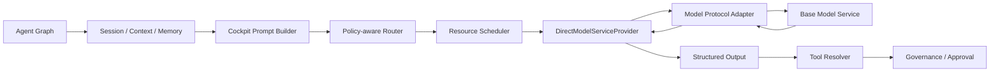
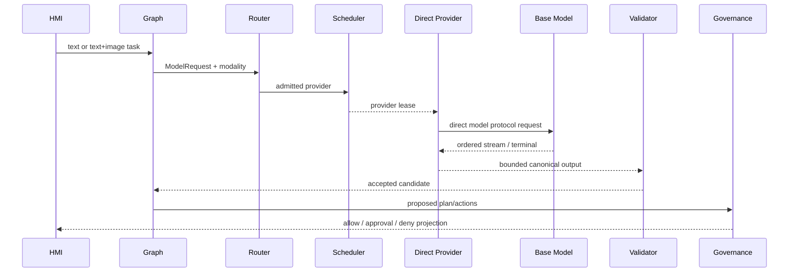

# Model、Scheduler 与 Direct Model Service 模块详设

版本：2.0
适用范围：Android 13 生产软件
上级文档：[生产软件开发文档](../CENTRAL_BRAIN_SOFTWARE_DEVELOPMENT.md)

`production_document_scope=true`
`module_detailed_design=true`
`production_ready=false`
`target_hardware_validated=false`

## 1. 设计目标与边界

本模块定义 Central Brain 自有的模型运行时。AIOS 通过 `ModelProvider` 和
`DIRECT_MODEL_SERVICE` 直接访问外部语言或视觉语言模型服务，不依赖外部 Agent Gateway。

Central Brain 必须自行持有：

- Session、Context 和 Memory 摘要；
- system/user Prompt 与响应 Schema；
- 模态、隐私、资源和 Provider 路由；
- 工具候选、Scenario Plan、Governance 和审批；
- 流式关联、deadline、取消、幂等和故障隔离；
- 模型输出校验及从候选到 Effect 的权限边界。

模型服务只执行受控推理。它不能直接调用 Tool、Vehicle Adapter 或 Effect，也不能声称动作已执行。

## 2. 需求映射

| Req ID | 本模块责任 |
| --- | --- |
| `APP-002` | 文字和单帧图片组成同一视觉语言请求 |
| `APP-004` | 注入座舱角色、上下文、服务目标和安全边界 |
| `S2-MDL-001` | Provider 生命周期、流式、取消、指标和故障 |
| `S2-MDL-002` | 按模态、隐私、资源、健康和 assurance 路由 |
| `S2-MDL-003` | AIOS 直接访问基座模型，并拥有 Agent 编排职责 |
| `S2-MDL-004` | 结构化 Schema、场景和 capability 白名单 |
| `S2-MDL-005` | 不可用、非法、超时或取消时失败关闭 |
| `S2-MDL-006` | Endpoint、认证材料和模型内容不进入非授权边界 |
| `S2-OBS-001` | 有界时延、计数、摘要和失败码 |
| `S2-OBS-002` | request/session/provider/stream 端到端关联 |
| `S2-SAF-001` | 模型结果不授予 Tool、Approval 或 Effect 权限 |

## 3. 源码地图

| 代码路径 | 关键符号 | 设计责任 |
| --- | --- | --- |
| [ModelContractV2.java](../../central-brain/android-runtime/runtime-service/src/main/java/com/centralbrain/runtime/model/ModelContractV2.java) | `ModelRequest`、`VISION_LANGUAGE_INFERENCE` | provider-neutral 请求 |
| [ModelProvider.java](../../central-brain/android-runtime/runtime-service/src/main/java/com/centralbrain/runtime/model/ModelProvider.java) | lifecycle、infer、cancel、stream | Provider SPI |
| [DirectModelServiceContract.java](../../central-brain/android-runtime/runtime-service/src/main/java/com/centralbrain/runtime/model/DirectModelServiceContract.java) | Endpoint、Modality、Request | 直连模型合同 |
| [OllamaEndpointConfig.java](../../central-brain/android-runtime/runtime-service/src/main/java/com/centralbrain/runtime/model/OllamaEndpointConfig.java) | `productionLinkLocal` | 当前协议 Adapter 端点 |
| [OllamaChatProtocolAdapter.java](../../central-brain/android-runtime/runtime-service/src/main/java/com/centralbrain/runtime/model/OllamaChatProtocolAdapter.java) | HTTP、NDJSON、图片、cancel | 生产源码协议 Adapter |
| [DirectModelServiceProvider.java](../../central-brain/android-runtime/runtime-service/src/main/java/com/centralbrain/runtime/model/DirectModelServiceProvider.java) | lifecycle、input、stream、terminal | Provider 核心 |
| [ModelProviderProfiles.java](../../central-brain/android-runtime/runtime-service/src/main/java/com/centralbrain/runtime/model/ModelProviderProfiles.java) | `directModelService` | Provider profile |
| [ModelProviderRegistry.java](../../central-brain/android-runtime/runtime-service/src/main/java/com/centralbrain/runtime/model/ModelProviderRegistry.java) | fixed catalog、health | Provider 目录 |
| [PolicyAwareModelRouter.java](../../central-brain/android-runtime/runtime-service/src/main/java/com/centralbrain/runtime/model/PolicyAwareModelRouter.java) | route decision | 策略路由 |
| [InferenceResourceScheduler.java](../../central-brain/android-runtime/runtime-service/src/main/java/com/centralbrain/runtime/scheduler/InferenceResourceScheduler.java) | queue、lease、deadline | 资源调度 |
| [CockpitModelPrompt.java](../../central-brain/android-runtime/runtime-service/src/main/java/com/centralbrain/runtime/model/CockpitModelPrompt.java) | system/user instruction | 座舱 Prompt |
| [StructuredModelOutput.java](../../central-brain/android-runtime/runtime-service/src/main/java/com/centralbrain/runtime/model/StructuredModelOutput.java) | strict validate | 统一输出边界 |
| [direct model contract](../../central-brain/contracts/central_brain_android_direct_model_service_v1.json) | migration、endpoint、claims | 机器可读合同 |
| [structured output schema](../../central-brain/android-runtime/runtime-service/src/main/assets/model/model-structured-output-v1.schema.json) | exact JSON | 模型响应 Schema |

字段级网络与多模态设计见
[Direct Model Service API 详设](11a-direct-model-service-api.md)。

## 4. 核心设计

### 4.1 逻辑结构



`DirectModelServiceProvider` 是 AIOS 侧组件；`Model Protocol Adapter` 只处理具体 wire protocol。
替换 Ollama、OpenAI-compatible 或 Vendor Native 服务时，只替换 Adapter 和 Endpoint profile。

### 4.2 Provider SPI

Provider 必须实现：

```java
Descriptor descriptor();
Snapshot snapshot();
Snapshot warmup(ModelSpec modelSpec);
InferenceHandle infer(InferenceRequest request, StreamObserver observer);
CancelState cancel(String requestId, String reason);
Metrics metrics();
FaultSnapshot lastFault();
void close();
```

约束：

- chunk sequence 单调递增；
- terminal 最多一次；
- cancel/deadline 后不再交付内容；
- `descriptor.backendKind=DIRECT_MODEL_SERVICE`；
- 未完成 release 实现和资格时 assurance 最高为 `TARGET_INTEGRATION`；
- `productionEligible=true` 只能与 `PRODUCTION` assurance 同时出现。

### 4.3 AIOS Agent 职责

Direct Model Service 不提供 Agent Runtime。以下能力必须位于 Central Brain：

| 能力 | Central Brain owner |
| --- | --- |
| 会话与恢复 | Session Registry、Room、Graph Checkpoint |
| 上下文 | ContextSnapshot、Vehicle Twin、Memory Budget |
| Prompt | CockpitModelPrompt、Scenario Manifest |
| Tool | Tool Registry、Rule Solver、Executor |
| 计划 | Scenario Resolver、Plan Compiler、Agent Graph |
| 权限 | Identity、Capability、Governance、Approval |
| 执行 | Effect Coordinator、Vehicle Adapter、Readback |
| 模型协议 | DirectModelServiceProvider、Protocol Adapter |

模型只能返回文本和结构化候选。所谓 function/tool call 也只能被解析为候选，不能直接执行。

### 4.4 模态

`ModelContractV2.RequiredCapability` 增加 `VISION_LANGUAGE_INFERENCE`。Direct Provider 必须显式声明：

- `TEXT_GENERATION`；
- `VISION_LANGUAGE_INFERENCE`；
- `STRUCTURED_SCENARIO_CANDIDATE`；
- 支持的 token、图片、并发和响应上限。

文字与图片请求共享一个 request fingerprint。图片缺失、摘要不匹配或 Provider 不支持图像时，不能退化为
仅文字请求。

### 4.5 Router 与 Scheduler

Router 依次检查：

1. route mode；
2. Provider 实现与 assurance；
3. health freshness；
4. required capability；
5. privacy class；
6. Ethernet policy；
7. thermal/resource 状态；
8. latency/token quota；
9. fallback policy。

当前 fixed catalog 已登记 `external.model-service.direct`，并不再登记历史 OpenClaw Provider。由于 release
Provider 尚未实现，`TARGET_INTEGRATION` 和 `PRODUCTION` 仍必须返回无可用 Provider。

Scheduler 初始限制 Direct Provider 最大并发为 1。Provider slot 从网络连接前一直持有到 terminal、cancel
或 fault close。

### 4.6 Prompt 与输出

`CockpitModelPrompt` 生成：

- 汽车座舱角色；
- 驾驶员/乘员服务目标；
- bounded Context；
- allowed/required actions；
- 图片可见事实与隐私限制；
- provider-neutral JSON Schema。

模型响应必须进入 `StructuredModelOutput.validate()`。接受结果仍保持：

```text
actionAuthorizationGranted=false
approvalDecisionGranted=false
effectDispatchRequested=false
```

## 5. 接口与数据

### 5.1 Endpoint

当前生产协议 Adapter 使用：

```text
profile = production.direct-model-service.ollama-chat-v1
protocol = OLLAMA_CHAT_V1
chat = http://169.254.208.110:11434/api/chat
agentGatewayRequired = false
arbitraryEndpointOverrideAllowed = false
```

模型名由受控构建或 Runtime owner 提供，不能由 HMI、Intent 或 Binder 调用方覆盖。

### 5.2 Request

`DirectModelServiceContract.Request` 只保存：

```text
requestId
sessionId
idempotencyKey
modality
textDigest
contextDigest
responseSchemaDigest
optional image descriptor
deadlineElapsedRealtimeMs
requestFingerprint
```

原始文字和图片由有界输入 owner 持有，在 Router 选择 Provider 后交给协议 Adapter。Request metadata 不含
原始内容、认证材料或车辆 payload。

### 5.3 图片

| 字段 | 上限 |
| --- | --- |
| 数量 | 1 |
| MIME | `image/png`、`image/jpeg` |
| 字节 | 6 MiB |
| 完整性 | SHA-256 + magic + actual length |
| 生命周期 | consume-once，完成后覆盖内存 |

### 5.4 Response

协议 Adapter 把底座响应转换为：

```text
ordered StreamChunk*
one TerminalResult
bounded structured output bytes
usage/latency/status metadata
```

协议状态、模型名、terminal 标志、finish reason 和 usage 必须与当前 request 对应。

## 6. 关键流程



历史 OpenClaw challenge、gateway session 和 gateway tool 语义不进入此流程。

## 7. 失败关闭与并发

- Direct Provider 未实现或 health 不新鲜时 Router 不选择。
- Ethernet 不可用时不切换到未授权网络。
- HTTP 非 2xx、redirect、模型名不匹配或 terminal 缺失均失败。
- JSON line、frame 或 response 超限时关闭当前请求。
- 图片校验失败时整个多模态请求失败。
- request/session/idempotency/fingerprint 不匹配时丢弃响应。
- timeout/cancel 后迟到内容不回调、不持久化、不进入 Event。
- 模型生成的 Tool 名称必须再经过 Tool Registry 和 Rule Solver。
- Provider 故障不得触发 Vehicle Adapter。

## 8. 代码校对清单

- [ ] fixed catalog 只登记 `DIRECT_MODEL_SERVICE`，不登记历史 OpenClaw。
- [ ] Router 的 target integration 首选 Direct Provider。
- [ ] release Provider 未实现时保持无可用路由。
- [ ] AIOS 持有 Session、Prompt、Tool、Schema、cancel 和 deadline。
- [ ] Endpoint/model name 不可由上层覆盖。
- [ ] 文字和图片共享 request fingerprint。
- [ ] Provider 声明 `VISION_LANGUAGE_INFERENCE`。
- [ ] 图片数量、MIME、尺寸、magic 和摘要均校验。
- [ ] Stream sequence 单调且 terminal 最多一次。
- [ ] 输出进入 `StructuredModelOutput`。
- [ ] 模型结果不授予 Tool 或 Effect 权限。
- [ ] 原始 Prompt、图片和响应不进入日志。

## 9. 增量开发规则

1. 先冻结 `DirectModelServiceContract` 与 machine-readable contract。
2. 以 `OllamaChatProtocolAdapter` 实现 text、text-image、stream、cancel 和 parser 边界。
3. 以 `DirectModelServiceProvider` 组合 input、health、Adapter、stream、terminal 和 metrics。
4. 将 Provider 接入 production input owner、release Registry、Router、Scheduler 和 Graph。
5. 删除历史 OpenClaw build profile、执行器、探针和合同。
6. 完成目标 Ethernet、模型服务、NPU、性能、隐私和故障资格。
7. 最后才允许提升 assurance 和 production readiness。

协议 Adapter 不得包含 Scenario、Tool 或 Vehicle 业务。新增模型后端必须实现同一 Provider SPI 和统一输出
Schema，不能在 Graph 中增加后端分支。

## 10. 当前缺口

- `DirectModelServiceContract` 和 fixed catalog 已形成。
- `VISION_LANGUAGE_INFERENCE` capability 已登记。
- `OllamaChatProtocolAdapter` 已进入生产源集，文字流、图片绑定、模型身份、终态和连接取消已有单元验证。
- `DirectModelServiceProvider` 核心已实现并完成 lifecycle、stream、output admission、terminal、metrics
  与取消单元验证。
- production input owner、health owner 和 release composition 尚未实现，Provider 未注册且路由保持关闭。
- V2 Binder 图片入口、生产输入 store 和流式投影尚未完成。
- 历史 OpenClaw 源码和工具仍待分阶段删除；其 build profile 已不可选择，并已退出新 catalog 和 Router。
- 目标模型名称、health/version、TLS、artifact 和资源 owner 尚未确认。
- `production_ready=false`，`target_hardware_validated=false`。
